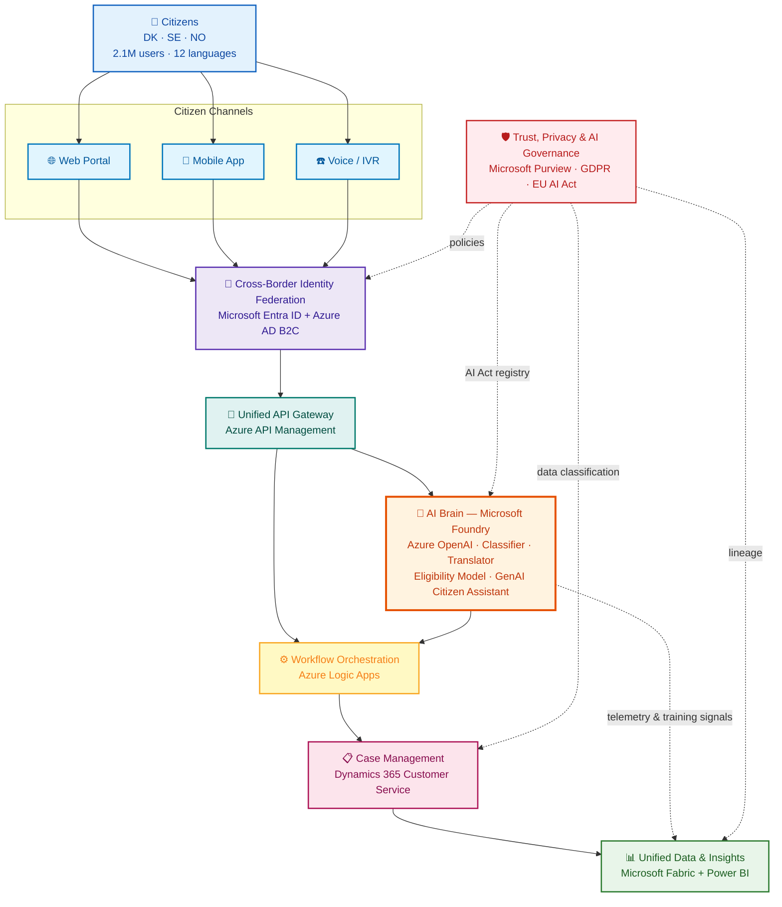

# UDCSP — Unified Digital Citizen Services Platform

> A federated, AI-first citizen services platform for the Scandinavian public administrations of **Denmark, Sweden, and Norway** — built on Microsoft Azure with **Microsoft Foundry** at the core of every decision.

---

## The Story in One Page

Three Nordic governments collectively serve **2.1 million citizens** through **47 disconnected legacy portals**. A citizen who moves from Copenhagen to Stockholm has to re-submit identity documents, wait **28 days** for a residency decision, navigate a portal that does not speak their language, and may not be accessible to them at all.

UDCSP is a single, federated platform that:

- **Unifies the front door** for citizens across web, mobile, and telephone in **12 languages**.
- **Federates identity** across the three countries while preserving national data sovereignty.
- **Puts AI at the center** — a Foundry-hosted set of agents and models classifies requests, translates content, pre-determines benefit eligibility, and answers citizen questions in natural language.
- **Automates back-office routing** through Logic Apps and a Dynamics 365 case management spine.
- **Closes the loop** with a unified data and governance layer powered by Microsoft Fabric, Power BI, and Microsoft Purview — keeping the platform compliant with **GDPR, the EU AI Act, and sector-specific EU directives** by design.

Target outcome: applications processed in **4 days instead of 28**, **+38 % citizen satisfaction**, and **WCAG 2.1 AA** accessibility throughout.

---

## Simplified Architecture

> **Reading the diagram:** every citizen interaction flows top-to-bottom through identity, the API gateway and the AI brain before reaching back-office case management and the data platform. Governance is a horizontal concern that audits and constrains every layer.

---

## What Makes the Platform Distinctive

| Pillar | Highlights |
|---|---|
| **AI-first** | Microsoft Foundry hosts the agents (classifier, translator, eligibility, citizen assistant) with built-in evaluation, tracing, content safety and the EU AI Act registry. |
| **Federated, not centralised** | Each country keeps its sovereign data zone; identity, AI and orchestration meet in the middle through standards (eIDAS, OpenID Connect, OAuth 2.0). |
| **Inclusive by design** | WCAG 2.1 AA baked into the design system; voice channel for citizens who cannot or will not use a screen; 12 official languages. |
| **Compliance by design** | Purview classifies and labels every dataset; Logic Apps enforces approval gates; AI agents are registered, evaluated and monitored under the EU AI Act. |
| **Auditable** | Every agent decision and every case action is traced into Fabric and made visible in Power BI dashboards for citizens, caseworkers and auditors. |

---

## Repository Layout (planned)

| Path | Purpose |
|---|---|
| `README.md` | This file — story, simplified architecture, evaluation matrix. |
| `architecture.md` | Deep-dive architecture: layers, sub-systems, data flows, sovereignty zones. |
| `plan.md` | Multi-agent development plan — work packages, agent profiles, parallel waves. |
| `case-study-11.md` | Original case study extracted from the source brief. |
| `infra/` *(future)* | Bicep / Terraform landing zone & per-domain modules. |
| `apps/` *(future)* | Citizen portals, mobile shell, voice bot. |
| `services/` *(future)* | API microservices and Logic Apps definitions. |
| `foundry/` *(future)* | Foundry agents, prompts, evaluations, datasets. |
| `data/` *(future)* | Fabric items, semantic models, Power BI reports. |
| `governance/` *(future)* | Purview policies, AI Act registry entries, DPIAs. |

---

## Mandatory Azure Services (from the case study)

All nine services from the case study are first-class citizens of the platform — none can be removed.

| # | Service | Role in UDCSP |
|---|---|---|
| 1 | **Azure Active Directory B2C** | Citizen-facing identity store; per-country tenants federated through Entra. |
| 2 | **Microsoft Entra ID** | Workforce identity for caseworkers & administrators; cross-border federation hub (eIDAS bridge). |
| 3 | **Azure OpenAI** *(via Microsoft Foundry)* | Foundation models for the classifier, translator, eligibility reasoner and citizen assistant. |
| 4 | **Microsoft Fabric** | Lakehouse, real-time intelligence, semantic models, and the federated analytics layer across the 3 countries. |
| 5 | **Dynamics 365 Customer Service** | Case management spine for caseworkers; SLA, queues, knowledge base, omnichannel integration. |
| 6 | **Azure API Management** | Single entry point for all citizen channels and partner agencies; policies, throttling, transformation. |
| 7 | **Microsoft Purview** | Data catalogue, classification, lineage, DLP, and the EU AI Act risk register for AI assets. |
| 8 | **Azure Logic Apps** | Workflow orchestration of the 4-day end-to-end process across agencies. |
| 9 | **Power BI** | Operational, executive, citizen-facing and auditor dashboards on top of Fabric. |

> Additional Azure services (Foundry, Container Apps, Static Web Apps, Functions, Cosmos DB, Key Vault, Communication Services, AI Speech, AI Document Intelligence, AI Translator, Defender for Cloud, Sentinel, Front Door, Service Bus, Event Grid, Monitor, Copilot Studio, etc.) complete the picture and are detailed in [`architecture.md`](./architecture.md).

---

## Evaluation Criteria — Case-Study Coverage Matrix

The table below maps every requirement and outcome stated in the case study to the platform component(s) that deliver it and to the validation method that proves it.

| # | Case-study requirement / outcome | Delivered by | Validation method |
|---|---|---|---|
| 1 | Consolidate **47 legacy portals** into a unified front door | Static Web Apps + design system + API Management aggregation layer | Inventory mapping in `architecture.md`; portal-decommission tracker |
| 2 | **Cross-border identity federation** for 2.1 M citizens | Entra ID External ID + Azure AD B2C + eIDAS bridge | Federation conformance test against eIDAS sandbox; SSO load test |
| 3 | Reduce processing time **28 d → 4 d** | Logic Apps end-to-end orchestration + Foundry eligibility pre-assessment + D365 Customer Service queues | Process-mining KPI in Fabric; Power BI SLA dashboard |
| 4 | **+38 % citizen satisfaction** | GenAI assistant (Copilot Studio + Foundry) + omnichannel + WCAG-compliant UI | CSAT survey pipeline → Fabric → Power BI trend |
| 5 | AI **classification & routing in 12 languages** | Foundry classifier agent + AI Translator + Azure OpenAI | Foundry evaluations (accuracy, BLEU, language coverage); golden dataset |
| 6 | **GenAI citizen assistant** across web / mobile / phone | Copilot Studio + Foundry agents + AI Speech + Azure Communication Services | Foundry evals + content-safety scorecards + channel-specific UAT |
| 7 | **Automated eligibility pre-assessment** before human review | Foundry eligibility model + business rules in Logic Apps + D365 review queue | Shadow-mode evaluation (model vs. caseworker), bias audit, EU AI Act conformity |
| 8 | **WCAG 2.1 AA** accessibility | Accessible design system + automated axe scans in CI/CD + manual audits | axe-core CI gate; third-party accessibility audit report |
| 9 | **GDPR + EU AI Act + sector directives** compliance | Purview classification & policies + AI Act registry + DPIA per use case + Sentinel + Defender for Cloud | DPIA checklist; AI Act high-risk system documentation; Purview compliance report |
| 10 | **National data sovereignty** preserved per country | Three sovereign Azure regions (DK / SE / NO) + per-country Fabric workspaces + per-country B2C tenants + cross-border data-sharing policies in Purview | Network topology review; data-residency tests; Purview policy diff |
| 11 | Different **DPA interpretations** of data-sharing rules | Per-tenant policy packs in Purview + per-country Logic Apps connectors + DPIA per data-flow | Policy unit-tests; legal sign-off per country |
| 12 | **Web, mobile, telephone** channels | Static Web Apps + native mobile shell + AI Speech + Azure Communication Services | Channel UAT scripts; voice bot transcription accuracy |
| 13 | Use of **all 9 mandatory Azure services** | See "Mandatory Azure Services" table above | Architecture review; service-inventory CI check |
| 14 | **Auditability** of every AI decision | Foundry tracing + Application Insights + Fabric audit lakehouse + Power BI audit dashboard | Trace replay test; auditor walkthrough |
| 15 | **Caseworker productivity** | D365 Customer Service + Copilot for Service + knowledge base | D365 KPIs (AHT, FCR); caseworker satisfaction survey |

---

## Where to Go Next

- **Citizens / business sponsors** → start with this README.
- **Architects** → continue with [`architecture.md`](./architecture.md).
- **Delivery teams and AI coding agents** → continue with [`plan.md`](./plan.md).
- **Auditors / DPOs** → start with the *Evaluation Criteria* table above, then the *Governance* sections of `architecture.md`.
