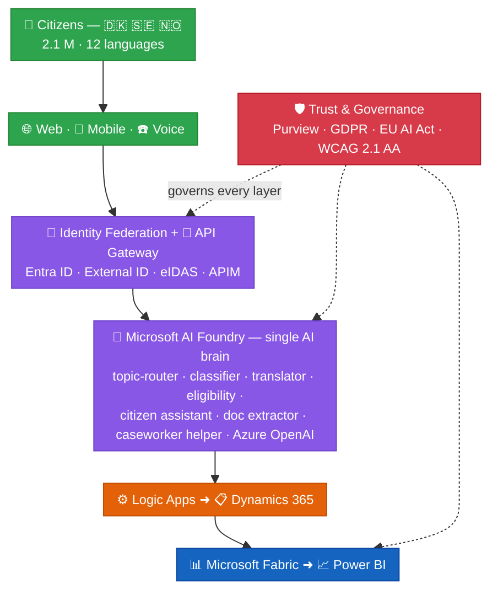
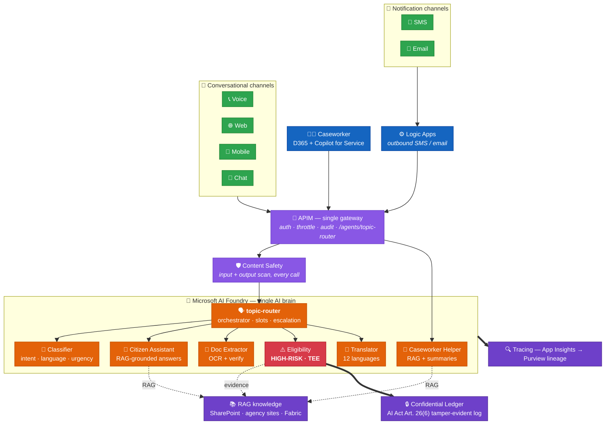

# 🌍 UDCSP

### Unified Digital Citizen Services Platform

*A federated, AI-first citizen services platform for the Scandinavian public administrations of **Denmark · Sweden · Norway***

---

## ✨ The Story in One Page

Three Nordic governments collectively serve **2.1 million citizens** through **47 disconnected legacy portals**. A citizen who moves from Copenhagen to Stockholm has to re-submit identity documents, wait **28 days** for a residency decision, navigate a portal that may not speak their language, and which may not be accessible to them at all.

UDCSP is **one** federated platform that:

- 🌐 **Unifies the front door** — the 47 national portals are rationalised into a single citizen experience across web, mobile and telephone in **12 languages**, **multilingual and inclusive by design** (voice, screen-reader, plain language) — while each country keeps its sovereign back-office systems intact.
- 🔐 **Federates identity** across the three countries while preserving national data sovereignty.
- 🧠 **Puts AI at the center, under human control** — a Microsoft Foundry-hosted set of agents and models classifies requests, translates content, pre-determines benefit eligibility and answers citizen questions in natural language. **Every model recommendation is traceable, explainable and systematically validated or adjusted by a human caseworker** before any final decision (AI-first, but supervised).
- ⚙️ **Automates back-office routing** through Azure Logic Apps and a Dynamics 365 case-management spine.
- 📊 **Closes the loop** with a unified data and governance layer powered by Microsoft Fabric, Power BI and **Microsoft Purview** — a single governance fabric (catalog, AI Act registry, end-to-end traceability) that makes cross-border data sharing strictly compliant with **GDPR, the EU AI Act and sector-specific EU directives — by design, not as an afterthought**.

> [!IMPORTANT]
> **Target outcomes:** applications processed in **4 days instead of 28**, **+38 % citizen satisfaction**, **WCAG 2.1 AA** accessibility, and **2.1 M citizens** served via a single federated front door — without compromising national data sovereignty.

---

## 🏛️ Simplified Architecture

Green = citizens / channels, purple = identity & AI, orange = backend & process, blue = data, red = governance.

> 📖 **Reading the diagram:** citizens enter through web, mobile or voice; identity is federated and gated by API Management; requests are routed to the **Microsoft AI Foundry brain** and to Logic Apps; cases land in Dynamics 365 and analytics flow into Fabric + Power BI. **Microsoft Purview wraps every layer.**
>
> 👉 *Want the full topology?* See [`architecture.md` §2.1 — High-level view](./docs/tech/architecture.md#21-high-level-view-whole-platform) for the same picture with every Foundry agent, identity service and country flag broken out, then §2.2+ for the deep-dive layer breakdown, data flows, AI request lifecycle, deployment topology, and installer flow.

---

## 🧠 AI Brain

A simplified view of the AI architecture detailed in [`docs/biz/ai.md`](./docs/biz/ai.md): **one** Foundry brain, **one** APIM gateway, **one** Content Safety pipeline, **seven** channels, **seven** agents — and an explicit high-risk lane (Eligibility) running in a Trusted Execution Environment with tamper-evident logging.

> 📖 **Reading the diagram.** Every conversational channel (voice, web, mobile, chat) and every workforce action (caseworker via D365 Copilot for Service) hits the **same APIM endpoint** `/agents/topic-router`. Notification channels (SMS, email) bypass conversational routing — they only need the **Translator** agent for outbound 12-language localisation. Inside Foundry, the `topic-router` is the only orchestrator: it owns slots, escalation rules, and dispatches to the six worker agents. **Content Safety runs on every input and every output**, no exceptions. The **Eligibility** agent is the platform's only EU AI Act high-risk component — it runs inside a **Trusted Execution Environment** (Confidential Compute, SEV-SNP) and every decision is appended to **Azure Confidential Ledger** for cryptographic, tamper-evident proof (AI Act Art. 26(6)). RAG-grounded agents cite their sources back to SharePoint, public agency sites and Fabric. The whole conversation is traced through App Insights and indexed in Purview.
>
> 🔗 **Concrete wiring.** The Eligibility agent's three tools (`deterministic-rules-engine`, `case-history-lookup`, `lineage-writer`) and the topic-router's six connections / knowledge sources are declared as real OpenAPI contracts under [`foundry/agents/`](./foundry/agents/) — APIM endpoints, managed-identity auth, per-tool rate limits, AI-Act compliance refs. The installer substitutes the per-tenant `${VAR}` placeholders at deploy time.
>
> 👉 *Want the full picture?* See [`docs/biz/ai.md`](./docs/biz/ai.md) — mental model, agent catalogue, per-channel AI footprint, RAG strategy, safety + eval pipelines, EU AI Act registry, end-to-end conversation flow, anti-patterns.

---

## 🌟 What Makes the Platform Distinctive

| | Pillar | Highlights |
|:-:|---|---|
| 🧠 | **AI-first** | Microsoft Foundry hosts the agents (classifier, translator, eligibility, citizen assistant, document extractor) with built-in evaluation, tracing, content safety, and the EU AI Act registry. **Azure OpenAI is only accessed through Foundry.** |
| 🌐 | **Federated, not centralised** | Each country keeps its sovereign data zone; identity, AI, and orchestration meet in the middle through standards (eIDAS, OpenID Connect, OAuth 2.0). |
| ♿ | **Inclusive by design** | WCAG 2.1 AA baked into the design system; voice channel for citizens who cannot or will not use a screen; **12 official languages with native parity**, not a translation pass. |
| 🛡️ | **Compliance by design** | Purview classifies and labels every dataset; Logic Apps enforces approval gates; AI agents are registered, evaluated, and monitored under the EU AI Act. |
| 🔍 | **Auditable end-to-end** | Every agent decision and every case action is traced into Fabric and made visible in Power BI dashboards for citizens, caseworkers, and auditors. |

---

## 🌍 Multilingual & Inclusive by Design

UDCSP treats **language and accessibility as platform invariants**, not as an end-of-project translation pass.

| Layer | How the 12 languages are handled |
|---|---|
| 🌐 **Channels (web · mobile · voice)** | Locale-aware UI built on a shared design system using **ICU MessageFormat**; per-country branded portals; voice IVR with **Azure AI Speech** STT/TTS in all 12 languages. |
| 🤖 | **Conversational AI** | Microsoft **Foundry `topic-router` agent** owns the multi-turn dialog logic in 12 languages, with slot-filling state in **Azure Cache for Redis**; topics are reviewed per locale; falls through to specialised Foundry agents (classifier, citizen-assistant, doc-extractor, eligibility, translator). |
| 🧠 **AI Brain (Foundry)** | The **Translator agent** chains Azure OpenAI with **Azure AI Translator** to preserve administrative terminology; the **Classifier** and **Citizen Assistant** are evaluated per language with golden datasets. |
| 📄 **Documents** | **Azure AI Document Intelligence** + LLM verification handle multilingual passports, payslips, leases, and forms. |
| 📋 **Case management** | **D365 Customer Service** multilingual knowledge base; outbound communications translated and edited by a caseworker before sending. |
| 📊 **Data & insights** | Per-language tagging in Fabric; Power BI semantic models slice satisfaction, accuracy, and SLA KPIs **by language** to surface inequity. |

> [!NOTE]
> **Accessibility is non-negotiable.** axe-core gates every web build in CI/CD, and an annual third-party WCAG 2.1 AA audit is part of the operating contract.

The 12 supported languages cover the **official** and **most common minority** languages of Denmark, Sweden, and Norway, plus the cross-border working languages required by the **EU Single Digital Gateway**.

---

## 🤖 Built by an Agent Swarm

UDCSP is delivered by a swarm of **17 specialised AI coding agents**, organised in **5 waves** with explicit parallelisation. Two agents are highlighted up front because they make this case study **demonstrable end-to-end**:

| | Agent | What it produces | Why it matters for the case study |
|:-:|---|---|---|
| 🎲 | **A15 · Synthetic Data & Personas** | GDPR-safe personas, applications, documents, multilingual conversations and golden eval datasets for **DK · SE · NO** in **all 12 languages**, with regenerable pipelines. | Provides the realistic, multi-country dataset needed to demo cross-border journeys, train and evaluate the Foundry agents, prove accessibility, and run audits — without ever using real PII. |
| 🛠️ | **A16 · Installer & Developer Experience** | A single **PowerShell one-shot installer** (`scripts/install/Install-UDCSP.ps1`) that stands up the entire platform end-to-end (landing zone → identity → security → data → Foundry → integration → D365 → frontends → voice → governance), plus a tear-down counterpart and developer-onboarding scripts. | Lets an evaluator (or a new developer) go **from a clean Azure tenant to a running federated platform in one command**. Repeatable, idempotent, CI-validated. |

> [!TIP]
> **From zero to running platform in one command.** Once Wave 4 closes, an evaluator can clone the repo, run `./scripts/install/Install-UDCSP.ps1 -Environment dev -SeedSyntheticData`, sign in to Azure, and watch the federated platform — populated with realistic DK/SE/NO data in 12 languages — come up.

The full agent catalogue, dependency graph, per-wave sub-diagrams and risk register live in [`plan.md`](./docs/tech/plan.md).

---

## 📁 Repository Layout

| Path | Purpose |
|---|---|
| 📄 `README.md` | This file — story, simplified architecture, evaluation matrix. |
| 🏗️ [`docs/tech/architecture.md`](./docs/tech/architecture.md) | Deep-dive architecture: layers, sub-systems, data flows, sovereignty zones, multilingual strategy, deployment. |
| 🗄️ [`docs/tech/data.md`](./docs/tech/data.md) | Storage architecture: 5 zones, retention matrix, GDPR + AI Act + ePrivacy compliance mapping, right-to-erasure playbook. |
| 🛡️ [`docs/biz/datacompliance.md`](./docs/biz/datacompliance.md) | Data compliance — every regulation responded to (GDPR, EU AI Act, ePrivacy, eIDAS, NIS2, WCAG, DK·SE·NO national law) with article-by-article responses, citizen rights SLAs, and evidence pack. |
| 🤖 [`docs/tech/plan.md`](./docs/tech/plan.md) | Multi-agent development plan — work packages, agent profiles, parallel waves. |
| 🎬 [`docs/biz/uses.md`](./docs/biz/uses.md) | **10 demonstration scenarios** an evaluator can run, each mapped to the evaluation matrix rows below. |
| 📚 [`docs/biz/case-study-11.md`](./docs/biz/case-study-11.md) | Original case study extracted from the source brief. |
| 🏛️ `infra/` | Bicep landing zone, Microsoft Entra External ID + Microsoft Entra ID + custom user flows, Defender + Sentinel baseline, Log Analytics + App Insights observability stack. |
| 💻 `apps/` | React web portal (incl. the new HTML/JS Chart.js insights components — post-audit replacement for Power BI Embedded), Expo mobile shell, **voice orchestrator Container App** (`apps/voice/call-automation/` — Node.js + ACS Call Automation SDK + GPT-4o Realtime + Foundry topic-router as a function tool + D365 warm transfer), ACS + AI Speech IVR scaffolding, D365 model-driven apps + Power Platform solutions. *(The conversational orchestration that lived in `apps/copilot-studio/` is now in `foundry/agents/topic-router/`.)* |
| 🔌 `services/` | API Management (11 OpenAPI APIs), Logic Apps (10 workflows), Functions / Container Apps, Power Automate flows. |
| 🧠 `foundry/` | 7 Foundry agents (eligibility, classifier, citizen-assistant, translator, doc-extractor, caseworker-helper, **topic-router** *(post-audit)*), prompts, evaluations, datasets. |
| 📊 `data/` | Fabric capacities + 3 sovereign workspaces (DK / SE / NO), each holding 1 Lakehouse with 3 medallion layers (Bronze · Silver · Gold) — i.e. 3 Lakehouses × 3 layers = **9 logical zones**. Notebooks + Power BI items, **synthetic personas & cases for DK/SE/NO** (A15). |
| 🛡️ `governance/` | Purview classifications & policies, EU AI Act registry entries, DPIAs, sovereignty test packs. |
| 🧪 `tests/` | Playwright e2e (10 scenarios), Foundry eval pipelines, axe accessibility gate, k6 load, OWASP ZAP, eIDAS / GDPR / AI Act conformance suites. |
| 🛠️ `scripts/install/` | **One-shot PowerShell installer** `Install-UDCSP.ps1` (A16) with **25 phase modules** *(post-audit: +Postgres, +Redis, +VerifiedId, +Bastion, +Ciem, +Ddos, +BackupAsr, +ConfidentialLedger, +ConfidentialCompute, +ChaosStudio, +Priva; −CopilotStudio)*. Companion scripts: `scripts/cleanup/Remove-UDCSP.ps1` (tear-down), `scripts/dev/Bootstrap-DevEnv.ps1` (operator workstation). See [`installation.md`](./docs/tech/installation.md). |
| ⚙️ `.github/workflows/` | CI for installer validation, repo checks, e2e tests, evals, accessibility, load, security, conformance. |
| 📑 [`docs/tech/agents.md`](./docs/tech/agents.md) · [`docs/tech/installation.md`](./docs/tech/installation.md) · [`docs/tech/recipe.md`](./docs/tech/recipe.md) | Build execution log · install procedure · acceptance walk-through. |

---

## 🎯 Evaluation Criteria — Case-Study Coverage Matrix

The table below maps every requirement and outcome stated in the case study to the platform component(s) that deliver it and to the validation method that proves it.

**Legend** — 🟦 Reach / Scale · 🟨 Functional channel · 🟧 AI capability · 🟪 Case management · 🟩 Outcome · 🟥 Compliance · 🟫 Mandatory services

| | # | Case-study requirement / outcome | Delivered by | Validation method |
|:-:|:-:|---|---|---|
| 🟦 | 1 | Consolidate **47 legacy portals** into a unified front door | Static Web Apps + design system + API Management aggregation layer | Inventory mapping in `architecture.md`; portal-decommission tracker |
| 🟦 | 2 | **Cross-border identity federation** for 2.1 M citizens | Microsoft Entra External ID (per country) + Microsoft Entra ID + eIDAS bridge | Federation conformance test against eIDAS sandbox; SSO load test |
| 🟩 | 3 | Reduce processing time **28 d → 4 d** | Logic Apps end-to-end orchestration + Foundry eligibility pre-assessment + D365 queues | Process-mining KPI in Fabric; Power BI SLA dashboard |
| 🟩 | 4 | **+38 % citizen satisfaction** | GenAI assistant (Foundry **`topic-router`** + downstream agents) + omnichannel + WCAG-compliant UI | CSAT survey pipeline → Fabric → Power BI trend |
| 🟧 | 5 | AI **classification & routing in 12 languages** | Foundry classifier agent + AI Translator + Azure OpenAI | Foundry evaluations (accuracy, BLEU, language coverage); golden dataset per language |
| 🟧 | 6 | **GenAI citizen assistant** across web / mobile / phone | Foundry `topic-router` + downstream Foundry agents + AI Speech + Azure Communication Services | Foundry evals + content-safety scorecards + per-channel UAT |
| 🟥 | 7 | **Automated eligibility pre-assessment** before human review | Foundry eligibility model (high-risk under EU AI Act) + business rules in Logic Apps + D365 review queue | Shadow-mode evaluation (model vs. caseworker), bias audit, EU AI Act conformity |
| 🟥 | 8 | **WCAG 2.1 AA** accessibility | Accessible design system + automated axe scans in CI/CD + manual annual audit | axe-core CI gate; third-party accessibility audit report |
| 🟥 | 9 | **GDPR + EU AI Act + sector directives** compliance | Purview classification & policies + AI Act registry + DPIA per use case + Sentinel + Defender for Cloud | DPIA checklist; AI Act high-risk system documentation; Purview compliance report |
| 🟦 | 10 | **National data sovereignty** preserved per country | Three sovereign Azure regions (DK / SE / NO) + per-country Fabric workspaces + per-country External ID tenants + cross-border data-sharing policies in Purview | Network topology review; data-residency tests; Purview policy diff |
| 🟥 | 11 | Different **DPA interpretations** of data-sharing rules | Per-tenant policy packs in Purview + per-country Logic Apps connectors + DPIA per data-flow | Policy unit-tests; legal sign-off per country |
| 🟨 | 12 | **Web, mobile, telephone** channels | Static Web Apps + native mobile shell + **voice orchestrator** (`apps/voice/call-automation/` — ACS Call Automation ↔ GPT-4o Realtime ↔ Foundry topic-router) + **D365 Customer Service voice channel** for PSTN, queues and warm-transfer to human caseworkers | Channel UAT scripts; `apps/voice/scripts/Test-Voice.ps1` (healthz + Event Grid handshake); voice transcription accuracy in Fabric |
| 🟦 | 13 | **Multilingual support across all 12 languages** | ICU i18n in UI; Translator agent in Foundry; Speech STT/TTS in 12 languages; Foundry `topic-router` per-locale topic logic; per-language KPIs | Per-language Foundry eval suites; per-language CSAT slicing in Power BI |
| 🟫 | 14 | Use of **all 9 mandatory Azure services** | External ID + Entra + Foundry (OpenAI) + Fabric + D365 + APIM + Purview + Logic Apps + Power BI Premium — all light up across the 10 demo scenarios in [`uses.md`](./docs/biz/uses.md) | Architecture review; service-inventory CI check |
| 🟧 | 15 | **Auditability** of every AI decision | Foundry tracing + Application Insights + Fabric audit lakehouse + Power BI audit dashboard | Trace replay test; auditor walkthrough |
| 🟪 | 16 | **Caseworker productivity** | D365 Customer Service + Copilot for Service + multilingual knowledge base | D365 KPIs (AHT, FCR); caseworker satisfaction survey |
| 🟦 | 17 | **Synthetic but realistic data** for the three countries (demos, training, evals, audits) | Dedicated synthetic-data agent (A15) producing 12-language personas, applications, documents, conversations and golden eval datasets — GDPR-safe, regenerable | Dataset coverage report; eval baselines green; auditor-ready persona book |
| 🟫 | 18 | **One-shot installable platform** — repeatable, zero-to-running deployment | Dedicated installer agent (A16) producing `scripts/install/Install-UDCSP.ps1` that orchestrates Bicep, Foundry (incl. the `topic-router` agent), D365 and Power Platform assets across the 3 sovereign zones — **25 phases** post-audit | Smoke deployment from a clean Azure tenant in CI; tear-down script verifies idempotency; deployment report archived in `scripts/install/reports/` |

---

## 📚 Where to Go Next

| Audience | Start with |
|---|---|
| 👔 **Citizens / business sponsors** | This README. |
| 🎬 **Evaluators / demo audiences** | [`uses.md`](./docs/biz/uses.md) — **10 scenarios** that exercise every row of the evaluation matrix. |
| 🧠 **Anyone reading the AI story** | [`ai.md`](./docs/biz/ai.md) — Foundry as the single AI brain (with the `topic-router` agent), the 7-agent catalogue, safety, evals, EU AI Act registry, end-to-end conversation flow. |
| 🔀 **Channel designers / demo team** | One deep-dive per channel under [`docs/biz/`](./docs/biz/) — 📞 [`voice`](./docs/biz/voice.md) · 🌐 [`web`](./docs/biz/web.md) · 📱 [`mobile`](./docs/biz/mobile.md) · 💬 [`chat`](./docs/biz/chat.md) · 📲 [`sms`](./docs/biz/sms.md) · 📧 [`email`](./docs/biz/email.md) · 🧑‍💼 [`caseworker`](./docs/biz/caseworker.md). |
| 🏗️ **Architects** | [`architecture.md`](./docs/tech/architecture.md) — deep-dive across 16 sections. |
| 🤖 **Delivery teams & AI coding agents** | [`plan.md`](./docs/tech/plan.md) — 17 agent profiles, 5 waves, parallelisation graphs. |
| 🛠️ **Operators / DevOps** | [`installation.md`](./docs/tech/installation.md) + [`scripts/install/Install-UDCSP.ps1`](./scripts/install/Install-UDCSP.ps1) — the one-shot installer with **25 phase modules** *(post-audit refactor)*. |
| 🛡️ **Auditors / DPOs** | [`datacompliance.md`](./docs/biz/datacompliance.md) — every regulation we answer to (GDPR · EU AI Act · ePrivacy · eIDAS · NIS2 · WCAG · DK·SE·NO national law) with article-by-article responses + evidence pack. |
| 📚 **Original case study** | [`case-study-11.md`](./docs/biz/case-study-11.md). |

---

## 🚧 Future Recommendations (not implemented in this repository)

An internal architecture audit surfaced two larger replacements that would meaningfully reduce vendor lock-in but were **deliberately not implemented** in this case-study scaffolding (the case study mandates D365 and Logic Apps as part of the 9 Microsoft services). They are documented here as a forward-looking note for any team taking UDCSP into production:

| Current | Proposed replacement | Why it would be considered |
|---|---|---|
| Dynamics 365 Customer Service | Camunda 8 (BPMN/DMN) + a custom caseworker UI on Container Apps + Dataverse-free Power Apps **or** ServiceNow GovCloud | D365 is the platform's largest single vendor lock-in and is priced per-seat. The Nordic public sector is actively standardising on **BPMN 2.0** for case lifecycles. Camunda handles long-running stateful workflows and exposes **DMN** decision tables that are first-class auditable artefacts — exactly what the high-risk Eligibility Pre-Assessor (AI Act) demands. |
| Azure Logic Apps | Camunda 8 / Zeebe (chosen consistently with the D365 → Camunda move) | The headline "28 d → 4 d" SLO is a textbook BPMN case. Logic Apps remains a JSON black box; **BPMN diagrams are directly readable by lawyers and Data Protection Authorities** — a meaningful audit advantage at every renewal. |

These are forward-looking recommendations only; the implemented platform keeps Dynamics 365 Customer Service and Azure Logic Apps exactly as the case study requires.

---

*UDCSP — built with Microsoft Azure and Microsoft Foundry, for the citizens of Denmark, Sweden, and Norway.* 🇩🇰 🇸🇪 🇳🇴

