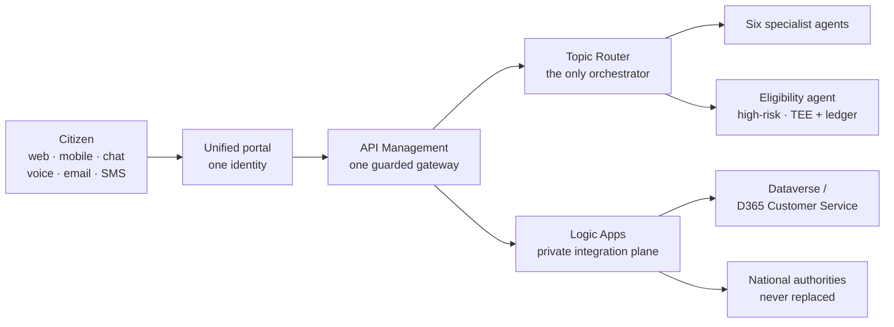

UDCSP consolidates 47 legacy government portals into a single accessible front door, backed by a governed multi-agent AI brain. Citizens reach it through web, mobile, chat, voice, email and SMS; every channel hits the same brain, which classifies the request in 12 languages, pre-assesses eligibility, and routes the case to the right authority. Each country keeps its own sovereign data zone. The platform bridges to the existing national systems over private networking; it never replaces them.

## 🎬 Walkthrough video

<video controls width="100%" preload="metadata">
  <source src="https://github.com/user-attachments/assets/3ce40e48-d465-445c-ab05-a87cabf5c867" type="video/mp4" />
  Your browser does not support the video tag.
</video>

:::note
This site is a Blume rendering of the UDCSP documentation set — the same Markdown that lives in the repository under `docs/biz` and `docs/tech`, served with navigation, search, theming and Mermaid diagrams.
:::

## How it fits together

## Start here

<CardGroup cols={2}>
  <Card title="The case study" href="/business/case-study-11" icon="clipboard-list">
    The immutable Use Case 11 brief the platform answers, verbatim.
  </Card>
  <Card title="Demo scenarios" href="/business/uses" icon="clapperboard">
    Ten narrative journeys — one persona, one path each.
  </Card>
  <Card title="The AI Brain" href="/business/ai" icon="brain">
    Microsoft Foundry, the topic-router, seven agents, 12 languages.
  </Card>
  <Card title="UDCSP Guardian" href="/business/guardian" icon="shield-check">
    The proactive, autonomous, human-supervised entitlement layer.
  </Card>
</CardGroup>

## Build it and run it

<CardGroup cols={2}>
  <Card title="Architecture" href="/technical/architecture" icon="network">
    The multi-country dispatch architecture and how each zone is privatised.
  </Card>
  <Card title="The agent swarm" href="/technical/agents" icon="bot">
    How the platform itself was built by a coordinated set of agents.
  </Card>
  <Card title="Data & compliance" href="/business/datacompliance" icon="file-check">
    GDPR, EU AI Act, eIDAS 2.0, NIS2 — every control and its evidence.
  </Card>
  <Card title="Cost to run" href="/business/cost" icon="coins">
    Fixed floor vs variable, from 10k to 1M citizens per country.
  </Card>
</CardGroup>

## Two audiences, one repository

<CardGroup cols={2}>
  <Card title="Business documentation" href="/business" icon="briefcase">
    Why the platform exists, who it serves, and how every channel works.
  </Card>
  <Card title="Technical documentation" href="/technical" icon="wrench">
    The deep-dive architecture, data truth, install guide and runbooks.
  </Card>
</CardGroup>
