# UDCSP — Multi-Agent Build Log

> Execution log of the parallel multi-agent build that produced the **UDCSP** platform scaffolding.
>
> This document is the **operational counterpart** to [`plan.md`](./plan.md): plan.md declares *who builds what, in which order*; agents.md records *who built what, with which model, in how much wall-clock time, and where the output landed*.

---

## 1. Build philosophy

The 17 agents declared in [plan.md §2](./plan.md#2-agent-roster--responsibilities) (A0 → A16) were collapsed into **6 vertical sub-agents** for delivery. Each vertical owns 2-4 plan-agents whose outputs converge into one folder family.

| Vertical sub-agent | Plan agents owned | Folders owned |
|---|---|---|
| `agent-platform` | A1, A2, A3, A5 | `infra/` |
| `agent-data-gov` | A4, A13 | `data/fabric/`, `governance/purview/`, `governance/ai-act/` |
| `agent-foundry` | A6, A11, A12, A15 | `foundry/`, `apps/copilot-studio/`, `apps/web/i18n/`, `data/synthetic/` |
| `agent-services` | A7, A8 | `services/`, `apps/d365/` |
| `agent-frontend` | A9, A10 | `apps/web/` (excl. i18n), `apps/mobile/`, `apps/voice/` |
| `agent-qa` | A14 | `tests/` |
| **orchestrator (this CLI)** | A0, A16 | `installation.md`, `recipe.md`, `agents.md`, `scripts/install/`, `scripts/cleanup/`, `scripts/dev/`, `.github/workflows/` |

This collapse keeps **strict isolation by folder** (no two agents write to overlapping paths), so all six can run **fully in parallel**.

---

## 2. Parallel execution

```mermaid
gantt
  title UDCSP build — wall-clock vs sequential
  dateFormat HH:mm:ss
  axisFormat %M:%S
  section Vertical sub-agents
  agent-platform     :a1, 00:00:00, 8m
  agent-data-gov     :a2, 00:00:00, 4m
  agent-foundry      :a3, 00:00:00, 6m
  agent-services     :a4, 00:00:00, 9m
  agent-frontend     :a5, 00:00:00, 7m
  agent-qa           :a6, 00:00:00, 7m
  section Orchestrator
  installer + docs   :o1, 00:00:30, 8m
```



**Wall-clock** (longest single sub-agent — `agent-platform` at 11 min 5 s — running concurrently with the orchestrator's docs/installer work): **≈ 12 minutes**.
**Sequential equivalent** (sum of every sub-agent's duration): **45 min 47 s** (665 + 602 + 446 + 435 + 361 + 238 seconds).
**Parallelism factor:** **4.13×** for the sub-agent fan-out alone, **~5×** end-to-end including orchestrator work that ran concurrently.

The orchestrator (this CLI session) writes the installer, master docs and CI plumbing **concurrently** with the sub-agents, because none of those artefacts depend on sub-agent output (they reference paths / contracts only).

---

## 3. Agent execution log

### 3.1 Vertical sub-agents (background, parallel)

| ID | Plan WPs | Model | Started | Duration | Status | Files | Notes |
|---|---|---|---|---|---|---|---|
| `agent-data-gov` | A4, A13 | Claude Sonnet 4.6 (default) | T+0 | 3 m 58 s | ✅ | 64 | Fabric capacities · 3×3 lakehouses · 4 notebooks · Purview classifications · AI Act registry |
| `agent-foundry` | A6, A11, A12, A15 | Claude Sonnet 4.6 | T+0 | 6 m 1 s | ✅ | 142 | 6 Foundry agents · Copilot Studio bot · 12-language i18n · synthetic data set DK/SE/NO |
| `agent-frontend` | A9, A10 | Claude Sonnet 4.6 | T+0 | 7 m 15 s | ✅ | 103 | React 18 + TS · Expo mobile · ACS + AI Speech IVR (6 languages) |
| `agent-qa` | A14 | Claude Sonnet 4.6 | T+0 | 7 m 26 s | ✅ | 89 | Playwright (10 scenarios) · 8 eval pipelines · WCAG · k6 · OWASP ZAP · eIDAS/GDPR/AI Act conformance |
| `agent-services` | A7, A8 | Claude Sonnet 4.6 | T+0 | 10 m 2 s | ✅ | 102 | APIM (8 APIs) · Logic Apps (6 workflows) · D365 solutions × 4 · 5 Power Automate flows · 3 Functions/ACA |
| `agent-platform` | A1, A2, A3, A5 | Claude Sonnet 4.6 | T+0 | 11 m 5 s | ✅ | 64 | Landing-zone Bicep · 3 External ID tenants + custom policies · Defender + Sentinel + 6 analytics rules · Log Analytics + 3 workbooks |

> Default model for the `task` tool is Claude Sonnet 4.6. All vertical sub-agents ran on this model; no overrides applied.

### 3.2 Orchestrator (foreground, this CLI session)

| Phase | Output | Files |
|---|---|---:|
| Folder skeleton | 25 directories | – |
| `installation.md` | top-level install procedure | 1 |
| `recipe.md` | acceptance walk-through (10 scenarios) | 1 |
| `Install-UDCSP.ps1` master + 15 PSM1 modules + config template | installer | 17 |
| `Bootstrap-DevEnv.ps1` + `Remove-UDCSP.ps1` | scripts | 2 |
| `.github/workflows/*` | installer-validate + repo-checks + 7 hoisted from `tests/` | 11 |
| `agents.md` (this file) + `plan.md` status updates | docs | 2 |
| `.gitignore`, `case-study-11.md` (verbatim, prior commit), `README.md`, `architecture.md`, `plan.md`, `uses.md` (already in repo) | meta | 5 |
| Final commit + push | git | – |

Model used: **Claude Opus 4.7 (xhigh reasoning)** for the orchestrator.

---

## 4. Token & request accounting (estimated)

> Sub-agent invocations report only wall-clock + final result; the `task` tool does not surface per-agent token counts. The estimates below are derived from prompt size, observed output file count and average file size.

| Sub-agent | Files produced | Prompt tokens | Output tokens (est.) | Tool calls (est.) |
|---|---:|---:|---:|---:|
| `agent-data-gov`     |  64 | ~2 800 | ~22 000 | ~80 |
| `agent-foundry`      | 142 | ~3 600 | ~52 000 | ~180 |
| `agent-frontend`     | 103 | ~3 500 | ~38 000 | ~135 |
| `agent-qa`           |  89 | ~3 200 | ~32 000 | ~115 |
| `agent-services`     | 102 | ~3 400 | ~38 000 | ~135 |
| `agent-platform`     |  64 | ~3 200 | ~28 000 | ~95 |
| **subtotal sub-agents** | **564** | **~19 700** | **~210 000** | **~740** |
| Orchestrator (this session) |  39 | ~28 000 | ~42 000 | ~80 |
| **TOTAL**            | **603** | **~47 700** | **~252 000** | **~820** |

The orchestrator carries the **largest prompt budget** (full plan / architecture / case study + every sub-agent result + every checkpoint) but a moderate output volume (installer, master docs, status updates).

---

## 5. Deliverables map (work package → folders → files)

| Plan WP | Folder root | Owner sub-agent | Status | Independent test |
|---|---|---|---|---|
| **A1** Landing Zone | `infra/landing-zone/` | platform | ✅ | `infra/landing-zone/scripts/validate.ps1` |
| **A2** Identity & Federation | `infra/identity/` | platform | ✅ | `infra/identity/scripts/Test-IdentityFederation.ps1` |
| **A3** Security & Compliance | `infra/security/` | platform | ✅ | `infra/security/scripts/Test-SecurityBaseline.ps1` |
| **A4** Data Platform | `data/fabric/` | data-gov | ✅ | `data/fabric/scripts/Test-Fabric.ps1 -Country dk -Offline` |
| **A5** Observability | `infra/observability/` | platform | ✅ | `infra/observability/scripts/Test-Observability.ps1` |
| **A6** Foundry & AI | `foundry/` | foundry | ✅ | `foundry/evaluations/scripts/Run-Evaluation.ps1` |
| **A7** Integration | `services/{apim,logic-apps,functions}/` | services | ✅ | `services/apim/scripts/Test-Apim.ps1`, `services/logic-apps/scripts/Test-LogicApps.ps1` |
| **A8** D365 Case Mgmt | `apps/d365/` | services | ✅ | `apps/d365/scripts/Test-D365.ps1` |
| **A9** Web/Mobile | `apps/web/`, `apps/mobile/` | frontend | ✅ | `npm run test` in each app |
| **A10** Voice & Channels | `apps/voice/` | frontend | ✅ | `apps/voice/scripts/Test-Voice.ps1` |
| **A11** Conversational AI | `apps/copilot-studio/` | foundry | ✅ | `apps/copilot-studio/scripts/Import-CopilotStudio.ps1 -DryRun` |
| **A12** A11y & i18n | `apps/web/i18n/`, `tests/accessibility/` | foundry + qa | ✅ | `apps/web/i18n/scripts/Validate-Translations.ps1` + `tests/accessibility/scripts/Run-Accessibility.ps1` |
| **A13** Data Governance | `governance/purview/`, `governance/ai-act/` | data-gov | ✅ | `governance/purview/scripts/Test-Purview.ps1 -Offline` + `governance/ai-act/scripts/Validate-AIRegistry.ps1` |
| **A14** QA & Evaluation | `tests/` | qa | ✅ | `pwsh ./scripts/install/Install-UDCSP.ps1 -Phase QA -SmokeOnly` |
| **A15** Synthetic Data | `data/synthetic/` | foundry | ✅ | `data/synthetic/scripts/Validate-Synthetic.ps1` |
| **A16** Installer & DevEx | `scripts/install/`, `scripts/cleanup/`, `scripts/dev/`, `installation.md` | orchestrator | ✅ | `pwsh ./scripts/install/Install-UDCSP.ps1 -TestOnly` |
| **A0** Architect | `architecture.md`, `plan.md`, `README.md`, `case-study-11.md` (verbatim) | orchestrator (pre-build) | ✅ | n/a (definition phase) |

---

## 6. Observed cross-agent contracts

Recorded by the sub-agents themselves at hand-off; resolved during orchestrator finalisation.

| Producer | Consumer | Contract | Resolution |
|---|---|---|---|
| `agent-data-gov` (`governance/ai-act/registry/*.yaml`) | `agent-foundry` (`foundry/agents/*/agent.yaml > registryEntryRef`) | Stable registry entry IDs | IDs fixed: `eligibility-model`, `classifier-model`, `citizen-assistant`, `translator`, `doc-extractor`, plus `caseworker-helper` (added in finalisation) |
| `agent-foundry` (`apps/web/i18n/messages/{lang}.json`) | `agent-frontend` (`apps/web/src/main.tsx`) | 12-language ICU catalogue with stable keys | Frontend imports from `apps/web/i18n/messages/` directly |
| `agent-services` (`services/apim/apis/*/openapi.yaml`) | `agent-frontend` (`apps/{web,mobile}/src/api/*.ts`) | OpenAPI 3 contracts | Web/mobile clients written against the contract; can be regenerated from spec |
| `agent-services` (D365 case-create connector) | `agent-foundry` (Copilot Studio `connections/d365-case-create.json`) | Dataverse Web API schema for `udcsp_application` | Connector JSON references the table; D365 solution declares it |
| `agent-data-gov` (Fabric mirroring sink) | `agent-services` (Dataverse → Fabric mirroring) | Mirror config destination workspace per country | `data/fabric/workspaces/workspace-config.json` × `apps/d365/dataverse-to-fabric-mirroring/mirror-config.json` |
| `agent-platform` (External ID URLs, Key Vault names) | All agents that call External ID / read secrets | Per-country External ID authority URLs + bootstrap KV name | Centralised in `scripts/install/config/udcsp.config.template.psd1` |

---

## 7. Open TODOs requiring a real tenant

These are deliberate placeholders in the scaffolds; resolving them is the job of an actual tenant install.

- External ID tenant IDs, client IDs, redirect URIs (`infra/identity/`, `apps/web/src/auth/msalConfig.ts`)
- Foundry workspace endpoint, model deployment names, content-safety endpoint (`scripts/install/config/udcsp.config.psd1`)
- D365 environment URLs (template provided, real values needed)
- ACS toll-free phone numbers per country (`apps/voice/acs/phone-numbers.bicep`)
- Real-language translations (current i18n catalogues are draft / machine-style)
- Power BI tenant for report publication
- Purview account name + capacity
- eIDAS sandbox endpoints for cross-border identity tests
- GitHub OIDC federation to Azure for the `installer-validate` workflow

Each TODO is annotated in-place with `// TODO: case-study scaffold` so an installer can grep them all.

---

## 8. Risks observed during build

| # | Risk | Mitigation taken |
|---|---|---|
| 1 | Sub-agents writing to overlapping folders | Strict folder isolation declared in each prompt; no overlaps observed |
| 2 | Inconsistent registry IDs between Foundry agents and AI Act registry | Orchestrator finalisation cross-checks; mismatches fixed during plan-update phase |
| 3 | i18n key drift between frontend and translation pipeline | Both reference the same `apps/web/i18n/messages/{lang}.json`; `Validate-Translations.ps1` runs as part of installer Test-Apps |
| 4 | Installer module references missing test scripts | Each `Test-*` PSM1 verb checks `Test-Path` on its component-owned test script and throws if missing |
| 5 | Sub-agent fails / stalls | Orchestrator re-runs the affected vertical or completes its scope manually (none required this run) |

---

## 9. How to re-run the build

To regenerate the entire scaffold from a clean repository (without re-running the case-study definition phase):

```powershell
# Re-launch all 6 vertical sub-agents from the orchestrator session:
# (See the prompts at tail of agents.md, kept verbatim for reproducibility.)
```

Sub-agent prompts are deliberately self-contained and stateless; they reference `plan.md`, `architecture.md`, `case-study-11.md`, `uses.md` for full context.

---

## 10. Sub-agent prompts (for reproducibility)

Each prompt is large (~3-4 KB), so they are referenced by their sub-agent ID. To re-spawn a vertical, copy the corresponding prompt from the build conversation and re-launch via the `task` tool with `agent_type: "general-purpose"`, `mode: "background"`. The prompts encode:

- absolute working-directory path
- full deliverables list with absolute file paths
- contract for "done" (each component must include README + smoke script)
- explicit out-of-scope folders (so two agents never collide)
- conventions (naming, tagging, multilingual scope, security baseline)
- prohibition on `git commit` / `git push` / writing to root `*.md`

— A0 / A16 (orchestrator) · all sub-agents listed in §1
