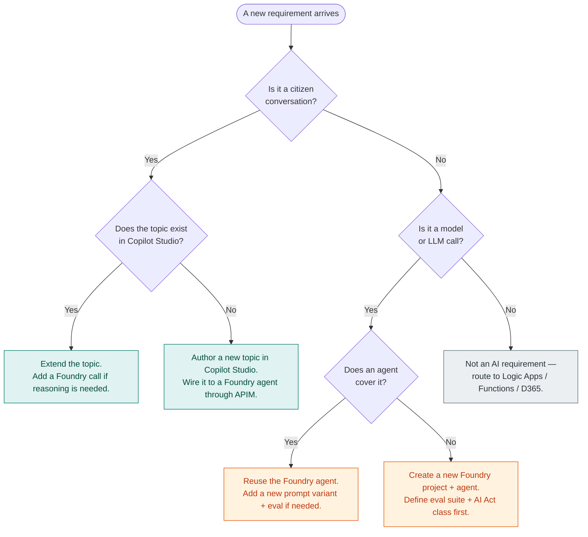
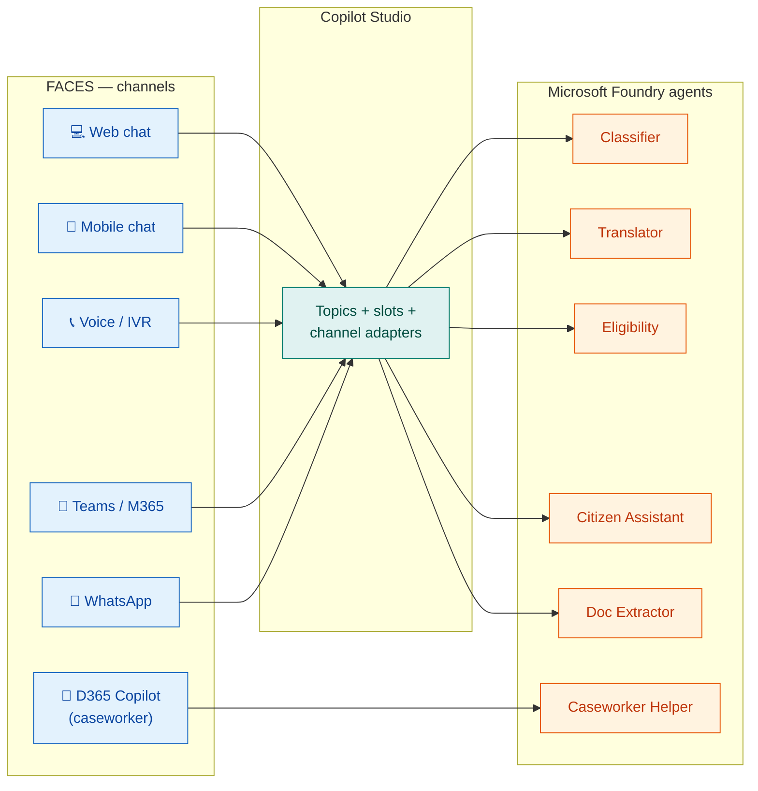
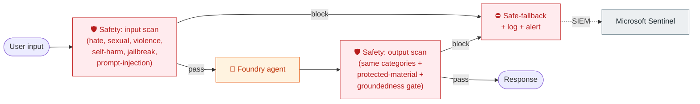
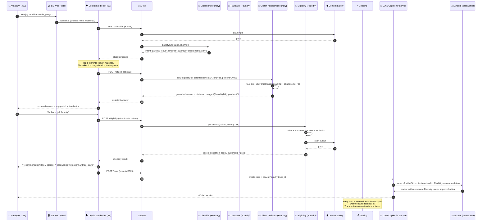

<div align="center">

# 🧠 UDCSP — The AI Architecture

### Microsoft Foundry · Microsoft Copilot Studio · Azure OpenAI · 6 agents · 12 languages

*One brain (Foundry), many faces (Copilot Studio). Why both products are mandatory, how they cooperate, and what every Foundry agent does.*

[](#)
[](#)
[](#)
[](#)

[](#)
[](#)
[](#)
[](#)

</div>

---

> [!IMPORTANT]
> **TL;DR.** UDCSP runs **two** AI products side-by-side, by design.
> **Microsoft Foundry** is the AI **control plane** — every model call, every agent, every evaluation, every trace, and every EU AI Act registration lives there.
> **Microsoft Copilot Studio** is the conversational **façade** — it owns dialog state, channel adapters (Web, Teams, Voice, M365 Copilot, WhatsApp) and topic-based intent routing, and it *delegates* its hard reasoning to Foundry agents through APIM.
>
> One brain (Foundry), many faces (Copilot Studio). Mandatory because the case study lists both — and architecturally correct because each does what the other should not.

---

## 📑 Table of contents

1. [Why this document exists](#1-why-this-document-exists)
2. [The mental model in one picture](#2-the-mental-model-in-one-picture)
3. [Microsoft Foundry — the AI control plane](#3-microsoft-foundry--the-ai-control-plane)
4. [Microsoft Copilot Studio — the conversational façade](#4-microsoft-copilot-studio--the-conversational-façade)
5. [Why both? The architectural rationale](#5-why-both-the-architectural-rationale)
6. [The agent catalogue](#6-the-agent-catalogue)
7. [Knowledge, RAG, and grounding](#7-knowledge-rag-and-grounding)
8. [Multilingual strategy (12 languages)](#8-multilingual-strategy-12-languages)
9. [Safety, evaluation, observability](#9-safety-evaluation-observability)
10. [Governance, lineage, EU AI Act](#10-governance-lineage-eu-ai-act)
11. [End-to-end conversation flow](#11-end-to-end-conversation-flow)
12. [Operational model — deployments, regions, capacity, cost](#12-operational-model--deployments-regions-capacity-cost)
13. [Anti-patterns we avoid](#13-anti-patterns-we-avoid)
14. [What changes if…?](#14-what-changes-if)

---

## 1. Why this document exists

The case study hands us a tricky-looking pair: **Azure OpenAI** *and* **Microsoft Copilot Studio**, both flagged as mandatory, plus a strong implicit demand for governance (EU AI Act, GDPR, Purview lineage) and for multi-channel reach (citizens on web, mobile, voice, plus caseworkers in D365). A naïve reading is "two AI products doing the same thing — pick one and hide the other." That is **wrong**.

This document explains, in one place, what each product does in UDCSP, why both are needed, and how they cooperate. Read it once and the rest of the AI surface (`docs/tech/architecture.md` § 5, the Foundry assets under `foundry/`, the Copilot Studio assets under `copilot-studio/`, the eval pipelines under `tests/eval/`) becomes self-evident.

---

## 2. The mental model in one picture

```mermaid
flowchart TB
    %% =========================================
    %% UDCSP AI stack — layered mental model
    %% =========================================

    subgraph CITIZENS["👥 Citizens · 12 languages · web · mobile · voice"]
        WEB["💻 Web chat"]
        MOB["📱 Mobile chat"]
        VOX["🎙️ Voice / IVR"]
        TEAMS["👥 Microsoft 365 Copilot"]
        WAPP["💬 WhatsApp / SMS"]
    end

    subgraph CASEWORKERS["👩‍💼 Caseworkers in Dynamics 365"]
        D365COP["🤖 D365 Copilot for Service"]
    end

    subgraph FACADE["🗣️ Conversational façade · Microsoft Copilot Studio"]
        TOPICS["📚 Topics &amp; dialogs<br/><i>Intent routing, slot filling,<br/>multi-turn state</i>"]
        CHAN["🔌 Channel adapters<br/><i>Web · Teams · WhatsApp · Voice</i>"]
        ACT["⚡ Actions<br/><i>HTTP calls to APIM</i>"]
    end

    subgraph GATEWAY["🚪 Azure API Management"]
        APIM["Single entry point<br/>JWT · throttling · WAF · audit"]
    end

    subgraph BRAIN["🧠 AI control plane · Microsoft Foundry"]
        direction TB
        subgraph AGENTS["🤖 Hosted agents"]
            CLS["Classifier"]
            TRA["Translator"]
            ELI["Eligibility<br/><b>HIGH-RISK</b>"]
            ASSI["Citizen Assistant<br/>(RAG)"]
            DOC["Doc Extractor"]
            CWH["Caseworker Copilot Helper"]
        end
        subgraph PLATFORM["🛠️ Platform services"]
            MOD["📦 Model Catalog<br/>Azure OpenAI + OSS"]
            SAFE["🛡️ Content Safety"]
            EVAL["📊 Evaluations"]
            TRC["🔍 Tracing"]
            REG["📋 EU AI Act registry"]
            OPT["🎯 Prompt optimizer"]
        end
        AGENTS --> MOD
        AGENTS --> SAFE
        AGENTS --> EVAL
        AGENTS --> TRC
        AGENTS --> REG
        AGENTS -. continuous .-> OPT
    end

    subgraph KNOWLEDGE["📚 Knowledge &amp; data sources"]
        SP["📁 SharePoint &amp; agency docs"]
        FAB["🐟 Microsoft Fabric<br/>(case history, anonymised)"]
        WEBKB["🌐 Public agency websites"]
        PUR["🛡️ Purview catalogue<br/>+ classifications"]
    end

    subgraph SUPPORT["🎤 Supporting Azure AI services"]
        SPCH["Azure AI Speech (STT/TTS)"]
        TXL["Azure AI Translator"]
        DCI["Azure AI Document Intelligence"]
    end

    %% Wiring
    WEB --> CHAN
    MOB --> CHAN
    TEAMS --> CHAN
    WAPP --> CHAN
    VOX --> SPCH
    SPCH --> CHAN
    CHAN --> TOPICS
    TOPICS --> ACT
    ACT --> APIM
    APIM --> AGENTS

    D365COP --> APIM

    ASSI -. RAG .-> SP
    ASSI -. RAG .-> FAB
    ASSI -. RAG .-> WEBKB
    TRA --> TXL
    DOC --> DCI
    CWH --> SP
    CWH --> FAB

    PUR -. governs .-> KNOWLEDGE
    PUR -. governs .-> AGENTS

    %% Colour palette
    classDef citizen fill:#E3F2FD,stroke:#1565C0,color:#0D47A1
    classDef workforce fill:#F3E5F5,stroke:#6A1B9A,color:#4A148C
    classDef facade fill:#E0F2F1,stroke:#00796B,color:#004D40,stroke-width:2px
    classDef gw fill:#FFF8E1,stroke:#F9A825,color:#E65100,stroke-width:2px
    classDef brain fill:#FFF3E0,stroke:#E65100,color:#BF360C,stroke-width:2px
    classDef agent fill:#FFE0B2,stroke:#EF6C00,color:#BF360C
    classDef plat fill:#FFCC80,stroke:#E65100,color:#BF360C
    classDef know fill:#E8F5E9,stroke:#2E7D32,color:#1B5E20
    classDef sup fill:#FFF9C4,stroke:#F9A825,color:#F57F17

    class WEB,MOB,VOX,TEAMS,WAPP citizen
    class D365COP workforce
    class TOPICS,CHAN,ACT facade
    class APIM gw
    class CLS,TRA,ELI,ASSI,DOC,CWH agent
    class MOD,SAFE,EVAL,TRC,REG,OPT plat
    class SP,FAB,WEBKB,PUR know
    class SPCH,TXL,DCI sup
```



**How to read this picture, top to bottom**

| Layer | Owns | Does NOT own |
|---|---|---|
| 👥 **Citizen channels** | The user's surface (browser, app, phone call, Teams chat, WhatsApp). | Anything AI; they only render. |
| 🗣️ **Copilot Studio façade** | Conversation state, intent topics, channel plumbing, language detection, escalation rules. | Reasoning, eligibility scoring, document extraction, model choice. |
| 🚪 **APIM** | Authentication, throttling, audit, version pinning, response shaping. | Anything AI-specific; it is a generic gateway. |
| 🧠 **Foundry control plane** | Models, agents, prompts, evaluations, traces, safety, AI Act registry, prompt optimization. | The user-facing dialog or the channel mix. |
| 📚 **Knowledge & data** | The grounding corpus, lineage, classifications. | Reasoning. |
| 🎤 **Supporting Azure AI** | Single-purpose AI primitives (Speech, Translator, Doc Intelligence) reused by multiple agents. | Orchestration. |

Each layer has **one** reason to change, which is why it can be evolved (and tested) independently — see § 13.

---

## 3. Microsoft Foundry — the AI control plane

> **One-liner.** Foundry is the production-grade home for *every* model call we make. Azure OpenAI is **never reached directly** — neither from the web app, nor from APIM, nor from a notebook. If an LLM is used, it is exposed as a Foundry agent.

### 3.1 What Foundry brings to UDCSP

| Capability | Why UDCSP needs it |
|---|---|
| 🏛️ **Hub & projects** | One sovereign **Hub** per region (DK / SE / NO) so model deployments respect data residency. One **Project** per agent (or agent family) — so we can grant least-privilege access, version independently, and wire dedicated evals + tracing. |
| 📦 **Model catalog** | A curated, versioned list of models (Azure OpenAI `gpt-4o-mini`, `gpt-4o`, `o1-preview`, plus open-source models for the Translator and embeddings). Catalog enforces region pinning, content-filter level, and approved fine-tunes. |
| 🤖 **Hosted agents** | Each Foundry **Agent** = system prompt + tools + knowledge + model + evaluation suite + safety filter + trace, all versioned together. Replaces the brittle pattern of "prompt + plain-text file + ad-hoc API call" sprinkled across services. |
| 🛡️ **Content Safety** | Every prompt and every response is screened for hate, sexual, violence, self-harm, jailbreak, and prompt-injection patterns. Centralised so we do not have to plumb safety into 6 different code paths. |
| 📊 **Evaluations** | Versioned eval suites: groundedness, relevance, fluency, similarity, F1 against gold labels, cross-language consistency, bias panels. Runs **in CI** on every prompt change and gates promotion to PROD. |
| 🔍 **Tracing** | OpenTelemetry-format traces of every call (input, retrieval set, tool invocation, model output, safety verdict, latency, tokens). Exported to App Insights and to Fabric for analytics. |
| 📋 **EU AI Act registry** | First-class field on every agent: AI Act class (minimal / limited / high-risk), intended purpose, technical documentation pointer, post-market monitoring plan, conformity declaration. Signed off before deployment. |
| 🎯 **Prompt optimizer** | Closes the loop: traces → evaluation failures → automatic prompt improvement experiments → ranked candidates → human approval → versioned prompt update. Cuts prompt-engineering cycle time without sacrificing audit trail. |

### 3.2 What lives in `foundry/` in this repo

```
foundry/
├── hubs/                      # one Bicep file per regional hub (DK/SE/NO)
├── projects/                  # one folder per agent
│   ├── classifier/
│   │   ├── agent.yaml         # name, model, prompts, tools, eval suite
│   │   ├── prompts/           # versioned system + few-shot prompts
│   │   ├── evaluators/        # groundedness, F1, bias custom evals
│   │   └── datasets/          # gold labels per language
│   ├── translator/
│   ├── eligibility/           # the only HIGH-RISK agent
│   ├── citizen-assistant/
│   ├── document-extractor/
│   └── caseworker-helper/
├── safety/                    # content-safety policy bundles
├── ai-act-registry/           # one JSON dossier per registered agent
└── observability/             # trace correlation map, cost dashboards
```

Each `agent.yaml` is the source of truth — installer + CI deploy from it, eval pipeline reads it, AI Act dossier references it.

---

## 4. Microsoft Copilot Studio — the conversational façade

> **One-liner.** Copilot Studio is where the **conversation lives**: which topic was triggered, what slots are filled, what to say next, on which channel, and when to escalate. It does **not** reason about eligibility, it does **not** call models directly — it asks a Foundry agent (through APIM) and renders the result.

### 4.1 Why Copilot Studio is essential — even with Foundry

| Capability | Without Copilot Studio you would have to… | What it costs us out-of-the-box |
|---|---|---|
| 🔌 **Channel adapters** | Build and maintain 5 separate clients (Teams, WhatsApp, Web embed, Voice via ACS, Microsoft 365 Copilot embed). | One bot wired into all five with checkboxes. |
| 🧵 **Multi-turn dialog state** | Re-invent slot filling, interruption, "back", "start over", confirmation patterns in code for every client. | Built-in topic engine with no-code authoring. |
| 🌍 **Per-channel localisation** | Maintain language packs and per-channel formatting rules manually. | Native language variants per topic. |
| 👤 **Authoring by non-engineers** | Every wording change becomes a code PR. | Caseworker advisors and content designers can co-author topics. |
| 📞 **Escalation to human** | Build queue/handoff manually. | Out-of-the-box D365 Omnichannel handoff. |
| 🏁 **Time to first useful demo** | Weeks. | Hours. |

### 4.2 The strict Copilot Studio contract in UDCSP

Copilot Studio in UDCSP is **deliberately small**. We treat it like a thin shell:

- ✅ It owns: greeting, intent detection (top-level), slot collection, language switch UI, escalation routing, channel-specific rendering.
- ✅ Every "real" answer is produced by a **Foundry agent** invoked through an APIM action.
- ❌ It must **not** call Azure OpenAI on its own (Copilot Studio's "Generative answers" feature against a model is **disabled** in UDCSP — all generative answers are funneled through Foundry agents so they inherit safety / tracing / evals).
- ❌ It must **not** hold authoritative business logic (no eligibility math in topic expressions; no document parsing).

This contract is enforced by:
1. APIM policy: refuses requests from Copilot Studio that are not for an *allow-listed* Foundry agent endpoint.
2. Foundry guardrails: high-risk agents require an `actor=copilot-studio|d365|web|mobile|voice` claim and reject undocumented callers.
3. Eval pipelines that diff Copilot Studio "Generative answers" usage and fail the build if any creep in.

### 4.3 What lives in `copilot-studio/` in this repo

```
copilot-studio/
├── bot/                       # exported solution package
├── topics/
│   ├── greeting/
│   ├── application-status/
│   ├── eligibility-precheck/  # → calls Eligibility agent in Foundry
│   ├── translate-document/    # → calls Translator + Doc Extractor agents
│   ├── escalate-to-human/
│   └── language-switch/
├── actions/                   # HTTP/Power Automate action specs against APIM
├── knowledge/                 # SharePoint and website connectors (link only — never raw copies)
├── channels/                  # Teams / Web / WhatsApp / Voice (ACS) / M365 Copilot
└── tests/                     # conversation transcripts that gate releases
```

---

## 5. Why both? The architectural rationale

This is the question evaluators will ask first. The short answer: **they solve different problems, and combining them is cheaper and safer than overloading either**.

### 5.1 Side-by-side comparison

| Concern | 🗣️ Copilot Studio | 🧠 Microsoft Foundry |
|---|---|---|
| Primary purpose | **Conversational orchestration** | **AI runtime &amp; governance** |
| Audience | Content designers, business analysts, channel operators | ML engineers, prompt engineers, compliance officers |
| Authoring style | Low-code / no-code, WYSIWYG | Code-first (Python / C# / YAML), CI/CD |
| Channels | First-class: Web, Teams, WhatsApp, Voice (ACS), M365 Copilot, custom | None — exposes HTTPS endpoints |
| Dialog state | Built-in (topics, slots, interruption, fallback) | None |
| Reasoning | Light (rules, expressions, generative answers) | Heavy (multi-step agents, tools, RAG, fine-tuning) |
| Model governance | Limited (uses platform-provided models) | Full (catalog, version pinning, region pinning, RAI policies) |
| Evaluation suite | Topic-level conversation tests | Quantitative evals: groundedness, relevance, F1, bias, jailbreak |
| Tracing & telemetry | Conversation analytics | Per-call OTEL traces with full lineage |
| EU AI Act registration | Not the right artifact | First-class registry per agent |
| Content Safety | Inherited via the Foundry calls it makes | Native, configurable per agent |
| Skill ceiling for novel use cases | Stops at the limits of topic + generative answers | Arbitrary code, arbitrary tools |

### 5.2 The decision tree we apply



### 5.3 The "single brain, many faces" pattern



The diagonal observation: **the caseworker channel skips Copilot Studio**. The D365 Copilot for Service is itself a conversational shell, so it calls Foundry agents directly through APIM — exactly the same agents the citizen-side Copilot Studio bot calls. This guarantees that a caseworker reviewing a citizen request sees the same eligibility recommendation, with the same evidence, that the citizen self-service flow saw — *because both are powered by the same Foundry agent and the same trace*.

---

## 6. The agent catalogue

Six Foundry agents, deliberately small. Every one is registered, evaluated, traceable, and content-safety-filtered.

| # | Agent | Mission | Inputs | Outputs | Models | EU AI Act class | Human-in-the-loop |
|---|---|---|---|---|---|---|---|
| 1 | **Classifier** | Detect intent, target agency, language, urgency. | Citizen utterance + channel | `{intent, agency, language, urgency, confidence}` | `gpt-4o-mini` (low latency) + periodic LoRA fine-tune on labelled traces | Limited risk | Caseworker can re-route. |
| 2 | **Translator orchestrator** | Translate citizen content + outbound communications across the 12 languages, preserving administrative terminology. | Source text + source/target lang + domain glossary | Translated text + per-segment confidence + glossary hits | Azure AI Translator (mass) + `gpt-4o` (admin terminology) hybrid | Limited risk | Caseworker can edit translation before sending. |
| 3 | **Eligibility Pre-Assessor** | Compute likelihood of benefit eligibility from structured + unstructured inputs; output a **recommendation**, never a decision. | Application form + extracted document fields + citizen profile claims | `{recommendation, score, evidence[], counter-evidence[], applicable rules[]}` | Tool-using `gpt-4o` + deterministic Python rule engine plug-in | **HIGH RISK** | **Always** reviewed by a caseworker; never auto-approves. |
| 4 | **Citizen Assistant** | Answer citizen questions in natural language, perform safe actions on behalf of the citizen, escalate when in doubt. | Citizen question + persona + locale + retrieved chunks | Grounded answer + citations + suggested next action | `gpt-4o` with strict RAG over public knowledge + Fabric anonymised case history | Limited risk | Escalation to human caseworker on demand. |
| 5 | **Document Extractor** | Extract structured data from uploaded documents (passport, payslip, lease, ID card). | Document binary + expected schema | `{fields, confidences, redaction map, raw OCR}` | Azure AI Document Intelligence (custom + prebuilt) + `gpt-4o-mini` for cross-field validation | Limited risk | Caseworker validates extraction. |
| 6 | **Caseworker Copilot Helper** | Summarise cases, draft replies, suggest knowledge articles, propose next-best-action. | D365 case record + thread + KB retrieval set | Summary + draft reply + cited sources + next-best-actions | `gpt-4o` grounded on the case record + KB | Limited risk | Caseworker is the operator and signs every action. |

> **Note.** The eligibility agent is the only **high-risk** AI system in the platform. Its dossier in `foundry/ai-act-registry/eligibility.json` is the most complete: intended purpose, training-data summary, evaluation report, post-market monitoring plan, conformity declaration, contact for the AI Act competent authority in each of DK/SE/NO. *No autonomous decision is ever taken by this agent — the recommendation goes to a caseworker queue in D365 with full evidence.*

---

## 7. Knowledge, RAG, and grounding

| Source | Used by | How it is indexed | Refresh cadence |
|---|---|---|---|
| 📁 **SharePoint sites** (per-country agency knowledge bases) | Citizen Assistant, Caseworker Helper | Foundry "knowledge" connector → Azure AI Search hybrid index (vector + keyword + semantic ranker) | Hourly delta |
| 🌐 **Public agency websites** | Citizen Assistant | Crawler → Azure AI Search index, pinned to `.dk`/`.se`/`.no` domains, with a per-domain trust score | Daily |
| 🐟 **Microsoft Fabric** lakehouse — **anonymised** case history | Caseworker Helper, Eligibility (precedent retrieval, **never** as a decision input) | Synapse-style notebook → vector index over case-summary embeddings | Nightly |
| 📋 **Eligibility rules** (deterministic) | Eligibility | Code (Python rule plug-ins) versioned in `foundry/projects/eligibility/rules/` | Per release |
| 🛡️ **Purview catalogue** | Cross-cutting | Lineage + classification metadata exposed to the agents through a Foundry tool, so every grounded answer can declare its source class (PII / sensitive / public) | Continuous |

**Grounding rules we enforce:**
- Every Citizen Assistant answer must cite at least one source from an authoritative domain or return "I do not know — let me connect you to a caseworker".
- Eligibility never grounds on the citizen's own prior cases (avoids feedback loops); it grounds on the rule set + the current submission only. Precedent cases are surfaced *to the caseworker*, separately, by the Caseworker Helper.
- Doc Extractor's "verification" step is a strict-JSON LLM call with a low temperature that re-checks the OCR fields against the document schema — it is allowed to flag, never to overwrite.

---

## 8. Multilingual strategy (12 languages)

UDCSP supports **12 languages by design**, not as a translation add-on.

| Language | ISO | Coverage | Primary AI path |
|---|---|---|---|
| Danish | da | Full | Native model + Translator hybrid |
| Swedish | sv | Full | Native model + Translator hybrid |
| Norwegian (Bokmål) | nb | Full | Native model + Translator hybrid |
| English | en | Full | Native model |
| German | de | Full | Native model |
| Polish | pl | Full | Native model |
| Arabic | ar | Full | Native model + RTL UI |
| Somali | so | Full | Translator-led (model coverage limited) + native QA |
| Tigrinya | ti | Full | Translator-led + native QA |
| Ukrainian | uk | Full | Native model |
| Finnish | fi | Full | Native model + Translator hybrid |
| Sami (Northern) | se | Full | Translator-led + native review |

**Mechanisms:**
- **Detection** at every entry point (Classifier sets `language`).
- **Foundry agents** receive `language` as a first-class parameter; prompts have language-specific variants when terminology matters (admin language).
- **Translator orchestrator** calls Azure AI Translator for bulk content and uses `gpt-4o` to align administrative terminology against per-country glossaries stored in Fabric.
- **Voice** uses Azure AI Speech with locale-pinned voices.
- **Eval** suites in Foundry run cross-language consistency tests (the same benefit eligibility outcome must be produced for the same case regardless of input language).

---

## 9. Safety, evaluation, observability

### 9.1 Content Safety pipeline



### 9.2 Evaluation regime

| Eval | What it measures | Runs… | Gate |
|---|---|---|---|
| **Unit** | One prompt, one example | On every commit touching `foundry/projects/*/prompts/` | Build |
| **Golden** | A 200–1000 example dataset per agent, in 12 languages | Nightly + on every prompt change | PR merge |
| **Regression** | Evals on traces from yesterday's PROD | Nightly | Auto-rollback if drop |
| **Bias panel** | Demographic parity across personas in the synthetic test set | Weekly + before any model upgrade | Release |
| **Adversarial / jailbreak** | A panel of 50+ jailbreak prompts | Weekly + before any model upgrade | Release |
| **Cross-language consistency** | Same outcome in 12 languages | Nightly | PR merge |
| **A/B in prod** | Live shadow traffic between prompt versions | Continuous | Promotion |

All evals live under `tests/eval/` and are driven by the YAML pipelines in `tests/eval/pipelines/`.

### 9.3 Tracing &amp; lineage

Every Foundry call emits an OTEL trace with:
- `request_id` (correlated end-to-end through Copilot Studio → APIM → Foundry → tools)
- `agent_id`, `agent_version`, `prompt_version`, `model_id`, `model_version`
- `safety_verdict` (input + output)
- `tokens_in`, `tokens_out`, `latency_ms`
- `retrieval_set` (sources used by RAG)
- `tools_invoked[]`
- `eval_id` (when running on a labelled set)
- `actor` (citizen channel / caseworker / system)
- `country`

Traces are stored in App Insights, exported nightly to a Fabric lakehouse for analytics, and indexed by Purview so that any answer can be re-traced to the prompt version, model version, knowledge source, and rule plug-in that produced it.

---

## 10. Governance, lineage, EU AI Act

| Concern | Where it lives | Owner |
|---|---|---|
| **Risk classification** per agent (minimal / limited / high) | `foundry/ai-act-registry/<agent>.json` | Compliance + agent owner |
| **Technical documentation** (Annex IV) | Same file + linked specs in `docs/` | Agent owner |
| **Data governance** (training data summary, GDPR DPIA) | Purview catalog + `governance/dpia/` | DPO |
| **Logging &amp; traceability** | App Insights traces (≥ 6 months hot, ≥ 6 years cold per EU AI Act Article 12) | Platform team |
| **Human oversight** | D365 caseworker queue for high-risk; escalation topics in Copilot Studio | Service owner |
| **Accuracy &amp; robustness metrics** | Foundry eval reports, exported nightly | Agent owner |
| **Cybersecurity** | Defender for Cloud, Sentinel, content-safety verdicts, jailbreak monitoring | SOC |
| **Post-market monitoring plan** | `foundry/ai-act-registry/<agent>.json` | Compliance |
| **Conformity declaration** | Same file, signed before release | Compliance + product owner |
| **Authority contact** (DK / SE / NO) | Same file | Compliance |

**Purview integration.** Every Foundry agent registers itself as a Purview asset (custom type `MicrosoftFoundry.Agent`) and emits lineage edges to the knowledge sources it grounds on, the data products it reads, and the data products it writes. Result: a single Purview query "what AI assets touch citizen X's case Y?" returns the full graph.

---

## 11. End-to-end conversation flow

The canonical example: a Danish citizen, `Anna`, asks the SE web portal in Danish whether she is eligible for parental leave after moving to Sweden.



---

## 12. Operational model — deployments, regions, capacity, cost

| Concern | Approach |
|---|---|
| **Regions** | Foundry hubs in Sweden Central (DK + SE workloads) and Norway East (NO workloads). Cross-border calls go through APIM only. |
| **Model deployments** | One PTU pool per hub for `gpt-4o`, one pay-as-you-go pool for `gpt-4o-mini`. Capacity reserved for Eligibility (high-risk SLA). |
| **Capacity governance** | `foundry/projects/*/agent.yaml` declares `min_tps` and `max_tps`. CI fails if total declared > pool capacity. |
| **Cost guardrails** | Per-project budget alerts in Cost Management; Foundry tracing exports `tokens_in/out` per agent; Power BI dashboard slices cost by agent / channel / language. |
| **Promotion** | DEV → STAGING → PROD via GitHub Actions. Every promotion runs the gold + bias + adversarial evals; promotion blocks on regression > 1 % on any guarded metric. |
| **Rollback** | `agent_version` is immutable; rollback flips a Foundry deployment alias and is fully auditable. |
| **DR** | Foundry config is in code (Bicep + YAML); Sweden Central DR pair is Sweden South (citizen-facing) + Norway East (workforce). |

---

## 13. Anti-patterns we avoid

| ❌ Anti-pattern | Why it's wrong | What we do instead |
|---|---|---|
| Calling Azure OpenAI directly from a service. | No safety, no tracing, no eval, no AI Act registration. Audit nightmare. | Always go through a Foundry agent via APIM. |
| Putting eligibility math inside Copilot Studio expressions. | Untestable, unversioned, invisible to evals, can't be registered as high-risk. | Eligibility is a Foundry agent + deterministic rule plug-in. |
| Using Copilot Studio "Generative answers" with a model directly. | Bypasses Foundry safety and trace; produces unaudited answers. | Disabled at the Copilot Studio policy level; all generative answers go through the Citizen Assistant agent. |
| Building a 7th channel adapter ourselves. | Re-invents what Copilot Studio gives free. | Add the channel in Copilot Studio. |
| Letting a Foundry agent write to a domain database. | Foundry agents have **no** data-modifying side effects; they recommend, they do not commit. | Mutations go through APIM → domain microservice or Logic App, with caseworker approval where required. |
| Hand-editing prompts in PROD. | Bypasses eval gating, no rollback. | Prompts versioned in `foundry/projects/*/prompts/`; CI deploys them. |
| Sharing one Foundry project across all six agents. | Loses per-agent RBAC, eval suite, registry entry. | One project per agent, by policy. |
| Sending raw PII to a model. | GDPR + AI Act risk. | Doc Extractor redacts before any LLM call; Purview tags propagate to prompts; Content Safety has a "protected-material" check. |

---

## 14. What changes if…?

| Scenario | Impact |
|---|---|
| **Add a new language (e.g. Lithuanian)** | Add a Speech locale, extend the language detector dataset, add per-language gold eval set in each agent, extend the Translator glossary. No code change in Copilot Studio outside topic translation strings. |
| **Add a new channel (e.g. Apple Messages for Business)** | Add a channel in Copilot Studio. No Foundry change. |
| **Swap the underlying model** | Change `model_id` in the relevant `agent.yaml`. CI runs golden + bias + jailbreak evals; promotion blocks on regression. No client-side change. |
| **Add a new high-risk use case** | Create a new Foundry project, declare AI Act class, build eval suite + AI Act dossier, register in `foundry/ai-act-registry/`, then expose through APIM. Only then plug it into Copilot Studio (or D365 Copilot, or both). |
| **Disconnect a knowledge source** | Remove the connector, re-run RAG evals, tag the agent's risk register entry. Foundry tracing makes the retrieval-set delta visible immediately. |
| **EU AI Act amendment changes a duty** | Update the dossier template under `foundry/ai-act-registry/`; CI re-validates every dossier; agents missing the new field are blocked from PROD until updated. |

---

## ✅ One-line recap for the evaluator

> *Microsoft Foundry is the brain — it runs every model call, evaluates every output, traces every step, classifies every agent under the EU AI Act, and centralises Content Safety. Microsoft Copilot Studio is the face — it owns the conversation, the channels, and the dialog state, and it delegates every reasoning step to a Foundry agent through APIM. Together they let UDCSP serve 2.1 M citizens in 12 languages on 5 channels, with a single auditable AI control plane.*

— Companion docs: [`architecture.md`](../tech/architecture.md) (full platform), [`agents.md`](../tech/agents.md) (build agents), [`uses.md`](./uses.md) (demo scenarios).
