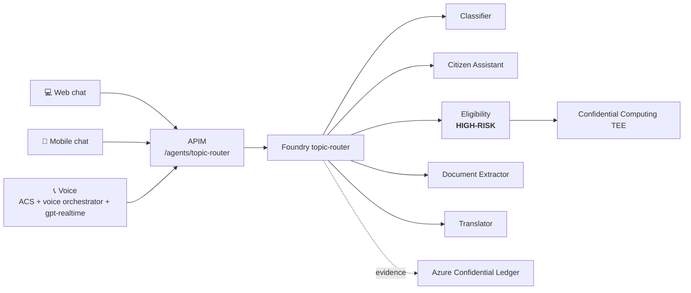
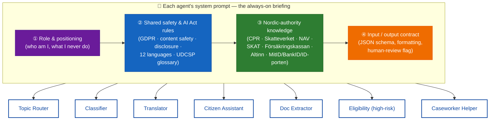
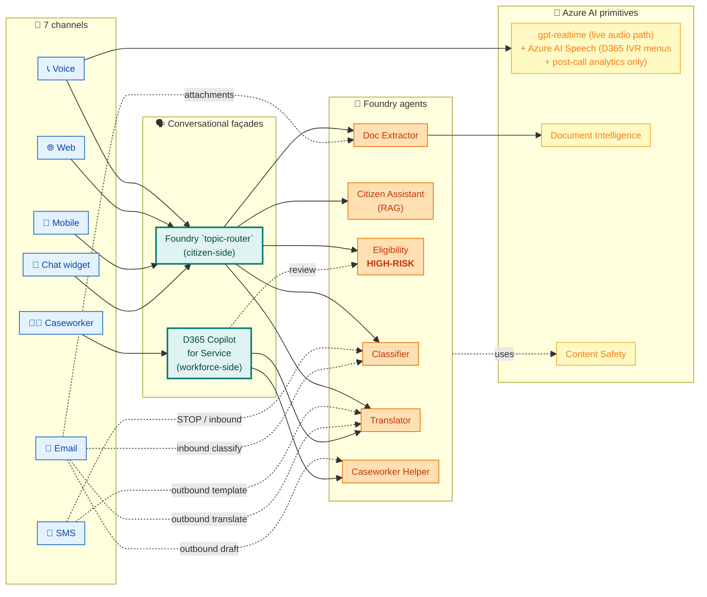
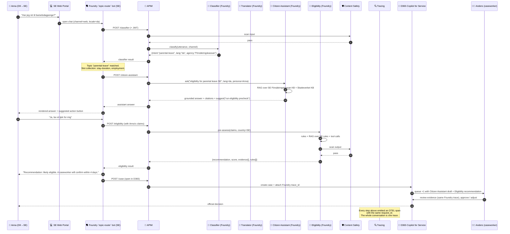

<div align="center">

# 🧠 UDCSP — The AI Architecture

### Microsoft Foundry · topic-router · Azure OpenAI · 7 agents · 12 languages

*One brain: Microsoft Foundry. The `topic-router` agent owns the conversational façade and routes web chat, mobile chat, and voice through APIM.*

[](#)
[](#)
[](#)
[](#)

[](#)
[](#)
[](#)
[](#)

</div>

---

> [!IMPORTANT]
> **TL;DR.** UDCSP has **one AI brain: Microsoft Foundry**. Web chat, mobile chat, and voice IVR call APIM `/agents/topic-router`, which invokes the Foundry `topic-router` agent and delegates to the six worker agents — `citizen-assistant`, `classifier`, `translator`, `doc-extractor`, `eligibility`, and `caseworker-helper` — as needed.
>
> The conversational façade lives entirely in the Foundry `topic-router` agent. The EU AI Act registry, evaluations, traces, and content-safety controls stay in Foundry and are backed by Azure Confidential Ledger.
>
> 📡 *For a **per-channel breakdown** — what AI fires on voice vs web vs mobile vs chat vs SMS vs email vs caseworker, with one consolidated matrix — see [§ 7. AI per communication channel](#7-ai-per-communication-channel).*
>
> 📞 *For the deep-dive on the **telephone channel** specifically — call lifecycle, neural voices, accessibility, per-country sovereignty, and how to procure a real Nordic toll-free number — see [`voice.md`](./voice.md).*

---

## 📑 Table of contents

**Foundations** (the AI stack, viewed by *layer*)

1. [Why this document exists](#1-why-this-document-exists)
2. [The mental model in one picture](#2-the-mental-model-in-one-picture)
3. [Microsoft Foundry — the AI control plane](#3-microsoft-foundry--the-ai-control-plane)
4. [Foundry topic-router — the conversational orchestrator](#4-foundry-topic-router--the-conversational-orchestrator)
5. [Why one brain? The architectural rationale](#5-why-one-brain-the-architectural-rationale)
6. [The agent catalogue](#6-the-agent-catalogue)

**The heart of this document** (the AI stack, viewed by *channel*)

7. [AI per communication channel](#7-ai-per-communication-channel) ★
   - [7.1 At-a-glance matrix](#71-at-a-glance-matrix)
   - [7.2 📞 Voice channel](#72--voice-channel)
   - [7.3 🌐 Web portal channel](#73--web-portal-channel)
   - [7.4 📱 Mobile app channel](#74--mobile-app-channel)
   - [7.5 💬 Chat widget channel](#75--chat-widget-channel)
   - [7.6 📲 SMS channel](#76--sms-channel)
   - [7.7 📧 Email channel](#77--email-channel)
   - [7.8 🧑‍💼 Caseworker channel](#78--caseworker-channel)
   - [7.9 Cross-channel observations](#79-cross-channel-observations)

**Cross-cutting concerns** (apply to every channel and every agent)

8. [Knowledge, RAG, and grounding](#8-knowledge-rag-and-grounding)
9. [Multilingual strategy (12 languages)](#9-multilingual-strategy-12-languages)
10. [Safety, evaluation, observability](#10-safety-evaluation-observability)
11. [Governance, lineage, EU AI Act](#11-governance-lineage-eu-ai-act)
12. [End-to-end conversation flow](#12-end-to-end-conversation-flow)
13. [Operational model — deployments, regions, capacity, cost](#13-operational-model--deployments-regions-capacity-cost)
14. [Anti-patterns we avoid](#14-anti-patterns-we-avoid)
15. [What changes if…?](#15-what-changes-if)

---

## 1. Why this document exists

The case study hands us Azure OpenAI plus a strong implicit demand for governance (EU AI Act, GDPR, Purview lineage) and for multi-channel reach (citizens on voice, web, mobile, chat, SMS, email — plus caseworkers in D365 — see § 7 for the channel-by-channel breakdown). A naïve reading is "two AI products doing the same thing — pick one and hide the other." That is **wrong**.

This document explains, in one place, how Foundry centralises every model call, every route, and every audit trail. Read it once and the rest of the AI surface (`docs/tech/architecture.md` § 5, the Foundry assets under `foundry/`, the Foundry `topic-router` assets under `foundry/agents/topic-router/`, the eval pipelines under `tests/eval/`) becomes self-evident.

---

## 2. The mental model in one picture

```mermaid
flowchart TB
    %% =========================================
    %% UDCSP AI stack — layered mental model
    %% =========================================

    subgraph CITIZENS["👥 Citizens · 12 languages · web · mobile · voice"]
        WEB["💻 Web chat"]
        MOB["📱 Mobile chat"]
        VOX["🎙️ Voice / IVR"]
        TEAMS["👥 Microsoft 365 Copilot"]
        WAPP["💬 WhatsApp / SMS"]
    end

    subgraph CASEWORKERS["👩‍💼 Caseworkers in Dynamics 365"]
        D365COP["🤖 D365 Copilot for Service"]
    end

    subgraph FACADE["🗣️ Conversational façade · Foundry `topic-router` agent"]
        TOPICS["📚 Topics &amp; dialogs<br/><i>Intent routing, slot filling,<br/>multi-turn state</i>"]
        CHAN["🔌 Channel adapters<br/><i>Web · Teams · WhatsApp · Voice</i>"]
        ACT["⚡ Actions<br/><i>HTTP calls to APIM</i>"]
    end

    subgraph GATEWAY["🚪 Azure API Management"]
        APIM["Single entry point<br/>JWT · throttling · WAF · audit"]
    end

    subgraph BRAIN["🧠 AI control plane · Microsoft Foundry"]
        direction TB
        subgraph AGENTS["🤖 Hosted agents"]
            CLS["Classifier"]
            TRA["Translator"]
            ELI["Eligibility<br/><b>HIGH-RISK</b>"]
            ASSI["Citizen Assistant<br/>(RAG)"]
            DOC["Doc Extractor"]
            CWH["Caseworker Copilot Helper"]
        end
        subgraph PLATFORM["🛠️ Platform services"]
            MOD["📦 Model Catalog<br/>Azure OpenAI + OSS"]
            SAFE["🛡️ Content Safety"]
            EVAL["📊 Evaluations"]
            TRC["🔍 Tracing"]
            REG["📋 EU AI Act registry"]
            OPT["🎯 Prompt optimizer"]
        end
        AGENTS --> MOD
        AGENTS --> SAFE
        AGENTS --> EVAL
        AGENTS --> TRC
        AGENTS --> REG
        AGENTS -. continuous .-> OPT
    end

    subgraph KNOWLEDGE["📚 Knowledge &amp; data sources"]
        SP["📁 SharePoint &amp; agency docs"]
        FAB["🐟 Microsoft Fabric<br/>(case history, anonymised)"]
        WEBKB["🌐 National-authority sites<br/>(borger · skatteverket · skatteetaten · NAV · Altinn · Info Norden)"]
        PUR["🛡️ Purview catalogue<br/>+ classifications"]
    end

    subgraph NATIONAL["🤝 National authorities — bridge, never replace"]
        DKAUTH["🇩🇰 CPR · borger · MitID · SKAT · Udbetaling DK"]
        SEAUTH["🇸🇪 Skatteverket · Försäkringskassan · BankID · Freja+"]
        NOAUTH["🇳🇴 Skatteetaten · NAV · Altinn · UDI · ID-porten"]
    end

    subgraph SUPPORT["🎤 Supporting Azure AI services"]
        SPCH["Azure AI Speech<br/>(D365 IVR menus + post-call analytics —<br/>NOT in the live audio path)"]
        TXL["Azure AI Translator"]
        DCI["Azure AI Document Intelligence"]
    end

    %% Wiring
    WEB --> CHAN
    MOB --> CHAN
    TEAMS --> CHAN
    WAPP --> CHAN
    VOX --> SPCH
    SPCH --> CHAN
    CHAN --> TOPICS
    TOPICS --> ACT
    ACT --> APIM
    APIM --> AGENTS

    D365COP --> APIM

    ASSI -. RAG .-> SP
    ASSI -. RAG .-> FAB
    ASSI -. RAG .-> WEBKB
    TRA --> TXL
    DOC --> DCI
    CWH --> SP
    CWH --> FAB

    PUR -. governs .-> KNOWLEDGE
    PUR -. governs .-> AGENTS

    APIM -. submit / status (Logic Apps) .-> DKAUTH
    APIM -. submit / status (Logic Apps) .-> SEAUTH
    APIM -. submit / status (Logic Apps) .-> NOAUTH

    %% Colour palette
    classDef citizen fill:#E3F2FD,stroke:#1565C0,color:#0D47A1
    classDef workforce fill:#F3E5F5,stroke:#6A1B9A,color:#4A148C
    classDef facade fill:#E0F2F1,stroke:#00796B,color:#004D40,stroke-width:2px
    classDef gw fill:#FFF8E1,stroke:#F9A825,color:#E65100,stroke-width:2px
    classDef brain fill:#FFF3E0,stroke:#E65100,color:#BF360C,stroke-width:2px
    classDef agent fill:#FFE0B2,stroke:#EF6C00,color:#BF360C
    classDef plat fill:#FFCC80,stroke:#E65100,color:#BF360C
    classDef know fill:#E8F5E9,stroke:#2E7D32,color:#1B5E20
    classDef sup fill:#FFF9C4,stroke:#F9A825,color:#F57F17
    classDef nat fill:#1565C0,stroke:#0D47A1,color:#fff

    class WEB,MOB,VOX,TEAMS,WAPP citizen
    class D365COP workforce
    class TOPICS,CHAN,ACT facade
    class APIM gw
    class CLS,TRA,ELI,ASSI,DOC,CWH agent
    class MOD,SAFE,EVAL,TRC,REG,OPT plat
    class SP,FAB,WEBKB,PUR know
    class SPCH,TXL,DCI sup
    class DKAUTH,SEAUTH,NOAUTH nat
```



**How to read this picture, top to bottom**

| Layer | Owns | Does NOT own |
|---|---|---|
| 👥 **Citizen channels** | The user's surface (browser, app, phone call, Teams chat, WhatsApp). | Anything AI; they only render. |
| 🗣️ **Foundry `topic-router` façade** | Conversation state, intent topics, channel plumbing, language detection, escalation rules. | Reasoning, eligibility scoring, document extraction, model choice. |
| 🚪 **APIM** | Authentication, throttling, audit, version pinning, response shaping. | Anything AI-specific; it is a generic gateway. |
| 🧠 **Foundry control plane** | Models, agents, prompts, evaluations, traces, safety, AI Act registry, prompt optimization. | The user-facing dialog or the channel mix. |
| 📚 **Knowledge & data** | The grounding corpus, lineage, classifications. | Reasoning. |
| 🎤 **Supporting Azure AI** | Single-purpose AI primitives (Speech, Translator, Doc Intelligence) reused by multiple agents. | Orchestration. |
| 🤝 **National authorities (bridge)** | The decision, the certificate, the residency record, the benefit payment — issued by CPR / Skatteverket / Skatteetaten / SKAT / Försäkringskassan / NAV / Udbetaling DK / Altinn / UDI. | Anything AI; UDCSP submits and mirrors the official status, never substitutes it. |

Each layer has **one** reason to change, which is why it can be evolved (and tested) independently — see § 14.

---

## 3. Microsoft Foundry — the AI control plane

> **One-liner.** Foundry is the production-grade home for *every* model call we make. Azure OpenAI is **never reached directly** — neither from the web app, nor from APIM, nor from a notebook. If an LLM is used, it is exposed as a Foundry agent.

### 3.1 What Foundry brings to UDCSP

| Capability | Why UDCSP needs it |
|---|---|
| 🏛️ **Hub & projects** | **3 sovereign Foundry hubs in production — one per country.** DK hub in `northeurope`, SE hub in `swedencentral`, NO hub in `norwayeast`. Each hub hosts the same seven agents with country-specific model deployments, evaluation suites, knowledge bases and AI Act registry entries. No agent call ever crosses a national border. *Sovereignty exception:* `gpt-realtime` is not yet GA in `norwayeast`, so the NO voice orchestrator uses the SE hub's deployment under Microsoft EU Data Boundary + Nordic-DPA cooperation; the day quota lands in `norwayeast`, a single Bicep flip moves the inference home. See [`../tech/architecture.md`](../tech/architecture.md) § 5.2 and [`./voice.md`](./voice.md) § 11.2. One **Project** per agent so we can grant least-privilege access, version independently, and wire dedicated evals + tracing. |
| 📦 **Model catalog** | A curated, versioned list of models (Azure OpenAI `gpt-5.4-mini`, `gpt-5.4`, `gpt-realtime`, plus open-source models for the Translator and embeddings). Catalog enforces region pinning, content-filter level, and approved fine-tunes. |
| 🤖 **Hosted agents** | Each Foundry **Agent** = system prompt + tools + knowledge + model + evaluation suite + safety filter + trace, all versioned together. Replaces the brittle pattern of "prompt + plain-text file + ad-hoc API call" sprinkled across services. |
| 🛡️ **Content Safety** | Every prompt and every response is screened for hate, sexual, violence, self-harm, jailbreak, and prompt-injection patterns. Centralised so we do not have to plumb safety into 6 different code paths. |
| 📊 **Evaluations** | Versioned eval suites: groundedness, relevance, fluency, similarity, F1 against gold labels, cross-language consistency, bias panels. Runs **in CI** on every prompt change and gates promotion to PROD. |
| 🔍 **Tracing** | OpenTelemetry-format traces of every call (input, retrieval set, tool invocation, model output, safety verdict, latency, tokens). Exported to App Insights and to Fabric for analytics. |
| 📋 **EU AI Act registry** | First-class field on every agent: AI Act class (minimal / limited / high-risk), intended purpose, technical documentation pointer, post-market monitoring plan, conformity declaration. Signed off before deployment. |
| 🎯 **Prompt optimizer** | Closes the loop: traces → evaluation failures → automatic prompt improvement experiments → ranked candidates → human approval → versioned prompt update. Cuts prompt-engineering cycle time without sacrificing audit trail. |

### 3.2 What lives in `foundry/` in this repo

```
foundry/
├── hubs/                      # one Bicep file per regional hub (DK/SE/NO)
├── projects/                  # one folder per agent
│   ├── classifier/
│   │   ├── agent.yaml         # name, model, prompts, tools, eval suite
│   │   ├── prompts/           # versioned system + few-shot prompts
│   │   ├── evaluators/        # groundedness, F1, bias custom evals
│   │   └── datasets/          # gold labels per language
│   ├── translator/
│   ├── eligibility/           # the only HIGH-RISK agent
│   ├── citizen-assistant/
│   ├── document-extractor/
│   └── caseworker-helper/
├── safety/                    # content-safety policy bundles
├── ai-act-registry/           # one JSON dossier per registered agent
└── observability/             # trace correlation map, cost dashboards
```

Each `agent.yaml` is the source of truth — installer + CI deploy from it, eval pipeline reads it, AI Act dossier references it.

---

## 4. Foundry topic-router — the conversational orchestrator

> **One-liner.** The `topic-router` is a Foundry agent that owns conversational routing for citizen channels: same citizen journeys, single trace plane, one place to author dialogue.

### 4.1 What the topic-router owns

| Capability | How it works now |
|---|---|
| 🧭 **Intent routing** | Web chat, mobile chat, and voice IVR post to APIM `/agents/topic-router`; the router selects the right downstream Foundry agent. |
| 🧵 **Slot state** | Short-lived slot-filling state lives in Azure Cache for Redis Enterprise; drafts lasting more than 24 h are persisted in PostgreSQL JSONB. |
| 🌍 **Language routing** | The first utterance locks locale, calls Translator only when required, and preserves civic terminology. |
| 🤝 **Escalation** | The router calls D365 through APIM to create a warm case with transcript, trace ID, and evidence. |
| 📜 **Traceability** | Every route decision, downstream agent call, and safety verdict is a Foundry trace and an AI Act evidence event. |

### 4.2 Explicit migration note

Voice IVR, the web chat widget, and mobile chat all call APIM directly and receive a Foundry-mediated response shaped for their channel.

---

## 5. Why one brain? The architectural rationale

The post-audit decision removes the redundant conversational façade. Foundry already owns model governance, traces, evals, AI Act registration, and content safety; putting routing into a Foundry agent gives UDCSP a single control plane instead of stitching two AI products together.



The caseworker channel remains different: **Dynamics 365 Customer Service + Copilot for Service is unchanged** and calls Foundry through APIM as the workforce shell.

---

## 6. The agent catalogue

Seven Foundry agents, deliberately small. Every one is registered, evaluated, traceable, and content-safety-filtered.

| # | Agent | Mission | Inputs | Outputs | Models | EU AI Act class | Human-in-the-loop |
|---|---|---|---|---|---|---|---|
| 1 | **topic-router** | Route web chat, mobile chat, and voice IVR turns to the correct Foundry agent; manage slot state and escalation. | Channel payload + locale + traceparent | `{route, slots, downstreamAgent, escalationAction}` | `gpt-5.4-mini` + deterministic routing tools | Limited risk | Caseworker receives escalations; DPO audits route traces. |
| 2 | **Classifier** | Detect intent, target agency, language, urgency. | Citizen utterance + channel | `{intent, agency, language, urgency, confidence}` | `gpt-5.4-mini` (low latency) + periodic LoRA fine-tune on labelled traces | Limited risk | Caseworker can re-route. |
| 3 | **Translator orchestrator** | Translate citizen content + outbound communications across the 12 languages, preserving administrative terminology. | Source text + source/target lang + domain glossary | Translated text + per-segment confidence + glossary hits | Azure AI Translator (mass) + `gpt-5.4` (admin terminology) hybrid | Limited risk | Caseworker can edit translation before sending. |
| 4 | **Eligibility Pre-Assessor** | Compute likelihood of benefit eligibility from structured + unstructured inputs; output a **recommendation**, never a decision. | Application form + extracted document fields + citizen profile claims | `{recommendation, score, evidence[], counter-evidence[], applicable rules[]}` | Tool-using `gpt-5.4` + deterministic Python rule engine plug-in | **HIGH RISK** | **Always** reviewed by a caseworker; never auto-approves. |
| 5 | **Citizen Assistant** | Answer citizen questions in natural language, perform safe actions on behalf of the citizen, escalate when in doubt. | Citizen question + persona + locale + retrieved chunks | Grounded answer + citations + suggested next action | `gpt-5.4` with strict RAG over public knowledge + Fabric anonymised case history | Limited risk | Escalation to human caseworker on demand. |
| 6 | **Document Extractor** | Extract structured data from uploaded documents (passport, payslip, lease, ID card). | Document binary + expected schema | `{fields, confidences, redaction map, raw OCR}` | Azure AI Document Intelligence (custom + prebuilt) + `gpt-5.4-mini` for cross-field validation | Limited risk | Caseworker validates extraction. |
| 7 | **Caseworker Copilot Helper** | Summarise cases, draft replies, suggest knowledge articles, propose next-best-action. | D365 case record + thread + KB retrieval set | Summary + draft reply + cited sources + next-best-actions | `gpt-5.4` grounded on the case record + KB | Limited risk | Caseworker is the operator and signs every action. |

### 6.1 Confidential Computing for the Eligibility Pre-Assessor

The Eligibility Pre-Assessor is the only high-risk AI Act system in UDCSP. It runs inside an **Azure Confidential Computing** trusted execution environment (`infra/security/confidential-compute/`) so cross-border prompts, retrieved evidence, model-tool inputs, and intermediate scores are protected while in use. The TEE attestation is attached to each eligibility trace before a caseworker sees the recommendation.

### 6.2 Confidential Ledger for AI decision audit trail

Every AI Act-relevant event — route decision, eligibility recommendation, human override, model version, eval gate, and post-market monitoring checkpoint — is anchored in **Azure Confidential Ledger** (`infra/security/confidential-ledger/`). The ledger provides the tamper-evident backing for Art. 26(6) log retention; Foundry remains the operational trace viewer, while the ledger proves the trace has not been rewritten.

> **Note.** The eligibility agent is the only **high-risk** AI system in the platform. Its dossier in `governance/ai-act/registry/eligibility-model.yaml` is the most complete: intended purpose, training-data summary, evaluation report, post-market monitoring plan, conformity declaration, contact for the AI Act competent authority in each of DK/SE/NO. *No autonomous decision is ever taken by this agent — the recommendation goes to a caseworker queue in D365 with full evidence.*

### 6.3 Bridge to national authorities — what the agents are NOT

UDCSP is **a unified citizen platform that bridges to the existing national authorities, not a replacement of them**. The seven agents above produce **drafts, classifications, recommendations, summaries, translations and grounded answers** — they never **issue** an administrative decision. The decision, the certificate, the residency record and the benefit payment always come from the competent national authority and are mirrored back into the citizen's *My cases* timeline.

| Service the citizen is trying to obtain | Authority that issues / decides | Where AI helps inside UDCSP |
|---|---|---|
| Residency registration 🇩🇰 | **CPR** + borger.dk + MitID. *CPR cannot be issued before the citizen has actually moved.* | Doc Extractor reads the passport / lease; Citizen Assistant explains the "after arrival" rule; Translator localises the form; topic-router escalates to a caseworker if the case is borderline. |
| Residency registration 🇸🇪 | **Skatteverket Folkbokföring** + BankID/Freja+. *Required if stay ≥ 1 year.* | Same agents — Citizen Assistant grounds answers on Skatteverket pages and Info Norden. |
| Residency registration 🇳🇴 | **Skatteetaten Folkeregisteret** (+ UDI for non-Nordic) + ID-porten. *> 6-month stay → must register; Nordic citizens don't need a permit but must notify.* | Same agents — Citizen Assistant explains the 6-month threshold and the Nordic exemption. |
| Tax-residency certificate 🇩🇰 | **SKAT form 02.050** — request workflow, **not** instant download. | Doc Extractor pre-fills, Eligibility Pre-Assessor flags edge cases, but the certificate is issued by SKAT. |
| Tax-residency certificate 🇸🇪 | **Skatteverket Hemvistintyg** — new e-service since Feb 2026 (or fallback form SKV 2734). | Same. UDCSP never claims "instant" issuance. |
| Tax-residency certificate 🇳🇴 | **Altinn form RF-1306** + Skatteetaten. *Tax residence rule: > 183 days / 12 mo OR > 270 days / 36 mo.* | Same — Citizen Assistant restates the rule before pre-filling. |
| Child & family benefit 🇩🇰 | **Udbetaling Danmark / lifeindenmark.dk**. *Income-based with a specific EU/EEA cross-border path; an apply-without-MitID flow exists for new arrivals.* | Eligibility Pre-Assessor scores the case and produces a recommendation; the actual benefit is decided and paid by Udbetaling Danmark. |
| Child & family benefit 🇸🇪 | **Försäkringskassan barnbidrag** — generally **automatic** for resident children; cross-border EU/EEA cases coordinated. | Citizen Assistant explains "you don't need to apply" for the resident case; Eligibility only fires for cross-border or split-custody. |
| Child & family benefit 🇳🇴 | **NAV barnetrygd** — automatic for born-in-NO; application required for EEA / cross-border / complex family. **NAV utvidet barnetrygd** is a separate single-parent flow. | Same logic — Eligibility runs only when an application is actually required. |
| Status of *My cases* | The relevant national authority case system, mirrored into D365. | Caseworker Helper summarises; the citizen sees the official status, not a UDCSP-derived one. |

This bridge boundary is enforced at four levels:

1. **System prompt** of the Citizen Assistant explicitly forbids phrases like *"single application across the Nordics"*, *"signed and verifiable in minutes"*, *"income-based child benefit in Sweden"* and similar over-promises.
2. **APIM `agent-topic-router` policy** rate-limits and tags every voice/chat request with `x-channel-actor` so cross-channel telemetry can detect drift from the bridge wording.
3. **Eligibility Pre-Assessor** never returns a *decision* enum — its output schema is `{recommendation, score, evidence[], counter-evidence[], applicable rules[]}` and the caseworker is the only signer.
4. **Tracing** records the downstream national authority for every applicable case, so audit can verify that UDCSP did not skip the official channel.

### 6.4 How each agent's brain is configured

Every agent has its own **system prompt** — the always-on briefing that the model reads before every single citizen turn. Think of it as the agent's job description, code of conduct and country knowledge, all rolled into one. The seven UDCSP agents follow a shared **four-layer recipe**, but each agent fills the layers in differently because their job is different.



**The four layers, in plain language:**

1. **Role & positioning.** A short paragraph that tells the model *what it is*, *who it serves* and — just as importantly — *what it must never do*. The Citizen Assistant for instance is told it answers questions; the Eligibility agent is told it recommends but never decides; the Caseworker Helper is told it drafts but never closes a case.
2. **Shared safety & AI Act rules.** The same three rules every UDCSP agent must follow: respect GDPR + the EU AI Act, talk to citizens in any of the **12 supported languages** without ever translating Nordic-authority names (CPR, MitID, BankID, Hemvistintyg, Folkeregisteret, NAV, Altinn, ID-porten, barnetrygd, barnbidrag, Udbetaling Danmark…), and disclose that this is an AI assistant when asked. These rules live in the agent's prompt as a self-contained block so the agent behaves correctly even if it is invoked outside its usual channel.
3. **Nordic-authority knowledge.** The factual block tailored to that agent's job. The Citizen Assistant carries the four UDCSP services and the per-country authority for each. The Eligibility agent carries the country rules (CPR cannot be issued before arrival; Sweden Folkbokföring requires ≥ 1 year intended stay; Norway is 183/270 days; Sweden child allowance is automatic and not income-based; NAV barnetrygd is automatic for born-in-NO; Norway's Nordic citizens are exempt from a permit but must notify). The Translator carries the **UDCSP glossary** of terms it must never translate. The Document Extractor carries the catalogue of recognised documents per country (CPR card, Personbevis, Folkeregisterutskrift, lønseddel, lönespecifikation, lønnslipp, NAV decision letters…). Each agent's block is shaped to the job — the Eligibility agent does not need the Translator's glossary in detail, and vice versa.
4. **Input / output contract.** The strict shape of the answer the agent must return — JSON for the agents that feed downstream automation (Classifier, Translator, Eligibility, Doc Extractor, Caseworker Helper), markdown for the conversational Citizen Assistant. Every agent contract includes a `humanReviewRequired` flag so the human-in-the-loop is never optional for high-risk steps.

**Why the prompt is self-contained.** Each agent's prompt embeds layers ② and ③ directly rather than referencing a shared file. This guarantees that an agent invoked from anywhere — the citizen web chat, a Foundry Studio test, an evaluation run, a future channel like Teams — behaves identically and respects the same Nordic-authority rules. It also makes the prompt the single audit-ready artefact for the AI Act registry under `governance/ai-act/registry/<agent>.yaml`.

**How updates flow.** When a Nordic authority changes a rule (a new e-service from Skatteverket, a new NAV form, a tightened CPR procedure), the change is made in the relevant agent's system prompt, the agent's evaluation suite is run to confirm no regression on the existing test cases, the new prompt version is deployed to Foundry, and the previous version is kept side-by-side for rollback and lineage. The Foundry trace shows which prompt version answered every citizen turn.

---

## 7. AI per communication channel

> **Why this section exists.** Sections 3 to 6 explained the AI **stack**. This section flips the axis: for **each of the seven UDCSP channels**, what AI fires, where Foundry `topic-router` sits in the picture, which Foundry agents are reached, and what the multilingual + safety stories look like for that surface. It is the per-channel cheat sheet that complements the channel deep-dives in `docs/biz/{channel}.md`.

### 7.1 At-a-glance matrix

The seven channels split cleanly into **three patterns** based on what conversational façade they require:

| Pattern | Channels | Façade |
|---|---|---|
| **Conversational** (real-time, two-way) | 📞 Voice · 🌐 Web · 📱 Mobile · 💬 Chat | Foundry `topic-router` (mandatory) |
| **Notification + light inbound** | 📲 SMS · 📧 Email | None — direct ACS calls + Foundry agents inside Logic Apps / D365 workflows |
| **Workforce** (back-office) | 🧑‍💼 Caseworker | D365 Customer Service + Copilot for Service (its own conversational shell) |

Per-channel AI footprint, in one row each:

| Channel | Sync? | Foundry `topic-router` role | Foundry agents | Azure AI primitives | EU AI Act trigger | Channel doc |
|---|---|---|---|---|---|---|
| 📞 **Voice** | Real-time (≤ 2 s p95) | Voice orchestrator + gpt-realtime + `lookup_topic_router` function tool | Classifier · Citizen Assistant · Eligibility · Translator | **gpt-realtime native STT+TTS** · Content Safety · (Azure AI Speech reserved for D365 IVR menus + post-call analytics, **not** in the live audio path) | Eligibility (HR) when invoked | [`voice.md`](./voice.md) |
| 🌐 **Web** | Real-time | Hosts the chat widget; portal forms call Foundry directly | Classifier · Citizen Assistant · Eligibility · Document Extractor · Translator | Content Safety · Document Intelligence (uploads) | Eligibility (HR) on form submission | [`web.md`](./web.md) |
| 📱 **Mobile** | Real-time | Same widget bundle as web, embedded in `WebView` | Classifier · Citizen Assistant · Eligibility · Document Extractor · Translator | Content Safety · Document Intelligence (camera capture) | Eligibility (HR) on form submission | [`mobile.md`](./mobile.md) |
| 💬 **Chat** (widget) | Real-time | Direct APIM `/agents/topic-router` call; topics + slot filling in Foundry | Classifier · Citizen Assistant · Eligibility · Document Extractor · Translator | Content Safety | Eligibility (HR) when "run pre-check" topic fires | [`chat.md`](./chat.md) |
| 📲 **SMS** | Async (mostly outbound) | None | Translator (template render) · Classifier (STOP / unknown inbound) | Content Safety (template QA) | None directly — downstream of decisions | [`sms.md`](./sms.md) |
| 📧 **Email** | Async (bi-directional) | None | Classifier (inbound auto-route) · Caseworker Helper (draft) · Document Extractor (attachments) · Translator (template render) | Content Safety · Document Intelligence | None directly — drafts go through eval suite | [`email.md`](./email.md) |
| 🧑‍💼 **Caseworker** | Real-time (workforce) | None — D365 Copilot for Service is the shell | Caseworker Helper · Translator · Eligibility (read-only review) | Content Safety | Eligibility (HR) reviewed here under Art. 14 oversight | [`caseworker.md`](./caseworker.md) |



**Read this picture top-to-bottom.** The seven channels reduce to three façade patterns, but they all converge on the **same six Foundry agents** under the hood. That's the "one brain, many faces" guarantee — and the reason a single Foundry eval pass on `citizen-assistant` covers Voice + Web + Mobile + Chat at once.

---

### 7.2 📞 Voice channel

> *PSTN → ACS → voice orchestrator → **gpt-realtime** (one stream, native STT+reasoning+TTS) → APIM `/agents/topic-router` as a function tool.*  
> 📖 *Architecture deep-dive: [`voice.md`](./voice.md). Procurement of a real Nordic toll-free number lives in § 9 of that doc.*

| | |
|---|---|
| 🗣️ **Façade** | Voice orchestrator Container App (`apps/voice/call-automation/`) bridges ACS audio ↔ gpt-realtime; calls Foundry `topic-router` via APIM as a function tool |
| 🤖 **Foundry agents** | topic-router (orchestrator) → Citizen Assistant (RAG) → optional Eligibility (HIGH-RISK) → optional Translator (out-of-locale escalation summary) |
| 🎤 **Azure AI primitives** | **gpt-realtime** for live STT + reasoning + TTS in one stream (12 languages, neural voices native to the model); **Azure AI Speech reserved for D365 pre-orchestrator IVR menus + post-call analytics — not in the live audio path**; Content Safety (input + output) |
| ⏱️ **Latency budget** | ≤ 2 s p95 from end-of-utterance to start-of-TTS |
| 🌍 **Multilingual mechanism** | gpt-realtime detects locale natively; in-call language switch supported |
| 🛡️ **Safety extras** | Voice-specific jailbreak panel (audio prompt-injection, "read these instructions"); barge-in handled server-side by GPT Realtime |
| 📋 **EU AI Act class triggered** | Eligibility = HIGH-RISK when invoked; Citizen Assistant + Classifier = limited risk |

**What's special on this channel.**

- It is the **only channel with a real-time bidirectional audio stream** — every other channel sees text from byte one.
- Voice is **the only channel where latency is on the critical path**: a 4 s wait that is invisible on web is a deal-breaker on the phone, so the Citizen Assistant has a special voice prompt variant (`max_completion_tokens=120`) tuned for short, conversational answers.
- Warm-transfer to a caseworker is **wired in code but gated** on `D365_VOICE_QUEUE_ID` env var being non-empty — until D365 Customer Service is provisioned per country, Demo 2 v1 runs in **no-handoff mode** (verbal callback closure + ACS SMS recap). See [`../tech/inprogress.md`](../tech/inprogress.md) § "Demo 2".

---

### 7.3 🌐 Web portal channel

> *The federated front door.*  
> 📖 *Architecture deep-dive: [`web.md`](./web.md).*

| | |
|---|---|
| 🗣️ **Router** | The portal **hosts** the chat widget, which posts to APIM `/agents/topic-router`; the page itself is **not** a conversational brain |
| 🤖 **Foundry agents** | Through the embedded widget: same five agents as Chat (§ 7.5). Through portal forms (no widget): Document Extractor (uploads), Eligibility (form submission) |
| 🎤 **Azure AI primitives** | Document Intelligence (PDF / image uploads), Content Safety (chat path) |
| ⏱️ **Latency budget** | Async UX (form submit shows a "we're processing" state; eligibility callback in ≤ 5 s) |
| 🌍 **Multilingual mechanism** | ICU MessageFormat in `apps/web/i18n/messages/{locale}.json`; the chat widget inherits the page locale |
| 🛡️ **Safety extras** | XSS / CSRF on the upload path; Document Intelligence's PII detection runs **before** any LLM sees the OCR output (PII masked in the prompt) |
| 📋 **EU AI Act class triggered** | Eligibility (HR) on form submission; Document Extractor (limited) on uploads |

**What's special on this channel.**

- Two AI surfaces co-exist: the **chat widget** (synchronous, conversational) and the **forms** (asynchronous, transactional). They are bridged by the citizen ID — the chat can pre-fill the next form, and the form can hand off to the chat for "explain this rejection".
- The portal is the **only place where a citizen sees a Foundry trace_id rendered to the screen** — under "decision details", we expose the trace_id so the citizen has an audit anchor before they ever pick up the phone.

---

### 7.4 📱 Mobile app channel

> *The same brain, native body.*  
> 📖 *Architecture deep-dive: [`mobile.md`](./mobile.md).*

| | |
|---|---|
| 🗣️ **Façade** | The **same chat widget** as web, embedded in a `WebView` (Expo `react-native-webview`); the MSAL token is injected via `postMessage` |
| 🤖 **Foundry agents** | Same as web/chat |
| 🎤 **Azure AI primitives** | Document Intelligence on native camera captures; Content Safety on chat |
| ⏱️ **Latency budget** | Same as web; offline queue for camera uploads when on cellular |
| 🌍 **Multilingual mechanism** | Reuses `apps/web/i18n/messages/{locale}.json` — one bundle, two clients |
| 🛡️ **Safety extras** | Native camera roll never leaves the device; the Document Extractor receives only the picture the citizen explicitly attached |
| 📋 **EU AI Act class triggered** | Eligibility (HR) on form submission; Document Extractor (limited) on captures |

**What's special on this channel.**

- The mobile app runs **zero distinct AI logic** — it is a transport for the same widget + APIM endpoints that the web channel uses. This is why a single Foundry eval pass guarantees parity across web and mobile: there is no second copy of the prompt or the topic.
- Native push notifications (APNs / FCM) are generated by the **Translator agent** when a back-office event needs to surface a localised message — see § 7.6 (SMS) for the equivalent over telecom.

---

### 7.5 💬 Chat widget channel

> *The Foundry `topic-router` shop window.*
> 📖 *Architecture deep-dive: [`chat.md`](./chat.md).*

| | |
|---|---|
| 🗣️ **Router** | Foundry `topic-router` web channel; APIM validates the citizen token and forwards the turn |
| 🤖 **Foundry agents** | Classifier → Citizen Assistant → optional Eligibility → optional Document Extractor → optional Translator |
| 🎤 **Azure AI primitives** | Content Safety on every turn |
| ⏱️ **Latency budget** | First token in ≤ 1.2 s; full answer in ≤ 4 s p95 |
| 🌍 **Multilingual mechanism** | Per-locale topics; if the citizen types in a language different from the page locale, the Classifier flags the mismatch and offers an in-place switch |
| 🛡️ **Safety extras** | The full prompt-injection panel runs here first (it is the most-attacked channel); offending sessions are quarantined and the trace is shipped to Sentinel |
| 📋 **EU AI Act class triggered** | Eligibility (HR) when "run pre-check" topic fires |

**What's special on this channel.**

- The widget is the **single source of truth** for all four conversational channels (Voice, Web, Mobile, Chat). Voice reuses the same `agent.yaml`, the same topics, the same authoring history (see [`chat.md`](./chat.md) — "one brain: Foundry topic-router").
- This is the channel where the **APIM `/agents/topic-router` endpoint** lives — never hard-code the secret; the page sends its Entra token and `traceparent` to APIM.

---

### 7.6 📲 SMS channel

> *Outbound-first; AI in the workflow, not in the chat.*  
> 📖 *Architecture deep-dive: [`sms.md`](./sms.md).*

| | |
|---|---|
| 🗣️ **Façade** | **None** — there is no conversation; SMS is a notification stream with a single inbound keyword (`STOP`) |
| 🤖 **Foundry agents** | Outbound: Translator (renders the per-language template against the case context). Inbound: Classifier (parses STOP / unknown messages) |
| 🎤 **Azure AI primitives** | Content Safety on every rendered message before it leaves Logic Apps |
| ⏱️ **Latency budget** | Outbound SLO: under 60 s from D365 trigger to delivery receipt; inbound STOP: under 30 s to consent-record update |
| 🌍 **Multilingual mechanism** | 12 templates per event in `apps/voice/notifications/sms-templates.json`; Translator generates new variants when an event type is added |
| 🛡️ **Safety extras** | GSM-7 length budget enforced before send (Content Safety would flag if a translated template balloons past 153 chars and might leak across SMS parts) |
| 📋 **EU AI Act class triggered** | None directly; SMS is a downstream of the high-risk decision, not a producer of one |

**What's special on this channel.**

- SMS is a **deliberately AI-light surface**: the content is composed offline, reviewed by a content designer, and only **translated** by the AI. Runtime AI is limited to the STOP-keyword classifier and template variable substitution. This is the right amount of AI for a non-rich channel.
- It **bypasses Foundry `topic-router` entirely** — the conversational façade is unnecessary and would add latency for a one-liner.

---

### 7.7 📧 Email channel

> *Bidirectional; AI in both legs.*  
> 📖 *Architecture deep-dive: [`email.md`](./email.md).*

| | |
|---|---|
| 🗣️ **Façade** | **None** — outbound triggered by D365 events; inbound auto-routed by D365 email-to-case |
| 🤖 **Foundry agents** | Outbound: Translator (template) + Caseworker Helper (custom drafts). Inbound: Classifier (route reply onto correct case) + Document Extractor (attachments) |
| 🎤 **Azure AI primitives** | Content Safety on every outbound; Document Intelligence on attachments; per-country DKIM/SPF/DMARC validation on inbound |
| ⏱️ **Latency budget** | Outbound: under 5 min from D365 event to mailbox delivery (S/MIME-signed); inbound: under 2 min from MX to case update |
| 🌍 **Multilingual mechanism** | 12 templates per event (same `email-templates.json` pattern as SMS); Caseworker Helper writes free-form drafts in the citizen's case locale |
| 🛡️ **Safety extras** | S/MIME signing for GDPR Art. 15 data exports; PII redaction before any LLM sees the inbound email body (Doc Extractor + Classifier both receive a redacted view) |
| 📋 **EU AI Act class triggered** | None directly; email is downstream of decisions, but Caseworker Helper drafts go through the same eval suite as voice/chat outputs |

**What's special on this channel.**

- The **inbound classifier auto-routes a citizen reply onto the correct case** — even if they reply to a six-month-old thread on a different mailbox. This is where the AI does the heavy lifting that humans hate (case-routing tedium).
- It **bypasses Foundry `topic-router`** because email is not a "real-time conversation" — D365 email-to-case is the canonical façade, and Foundry `topic-router` would only duplicate it.

---

### 7.8 🧑‍💼 Caseworker channel

> *The human in the loop.*  
> 📖 *Architecture deep-dive: [`caseworker.md`](./caseworker.md).*

| | |
|---|---|
| 🗣️ **Façade** | D365 Customer Service + **Copilot for Service** (its own conversational shell, **not** Foundry `topic-router`) |
| 🤖 **Foundry agents** | Caseworker Helper (summary + draft + next-best-action) · Translator (per-citizen language) · Eligibility (read-only review with Art. 14 oversight) |
| 🎤 **Azure AI primitives** | Content Safety on every Copilot-for-Service answer |
| ⏱️ **Latency budget** | ≤ 3 s p95 for a case summary on case-open; draft reply ≤ 5 s |
| 🌍 **Multilingual mechanism** | Caseworker UI in the workforce locale (typically EN/SV/NB/DA); Caseworker Helper renders summaries in the workforce locale and drafts replies in the citizen locale |
| 🛡️ **Safety extras** | Every override of an Eligibility recommendation is captured in `udcsp_eligibility_assessment` (Dataverse) with reason text + classification, mirrored to the Foundry trace as `human-override` |
| 📋 **EU AI Act class triggered** | Eligibility (HR) is **always** reviewed here — this is where Art. 14 "meaningful human oversight" lives |

**What's special on this channel.**

- It's the **only channel where AI serves the workforce, not the citizen**. The Copilot for Service shell is the workforce-side equivalent of Foundry `topic-router`'s citizen-side shell — both delegate hard reasoning to Foundry agents through APIM.
- It's the **one place where the high-risk Eligibility decision is finalised**: the agent computes a recommendation, the caseworker disposes. No autonomous decision ever leaves this channel.

---

### 7.9 Cross-channel observations

| Observation | Why it matters | Where to verify |
|---|---|---|
| **Same 6 agents, 7 channels** | Eval-once parity: a Foundry eval pass on `citizen-assistant` covers Voice + Web + Mobile + Chat at once. | `foundry/projects/*/datasets/` |
| **Conversational channels (Voice, Web, Mobile, Chat) all share Foundry `topic-router`** | One bot, one topic library, one place to author dialogue. | [`chat.md`](./chat.md) — "one brain: Foundry topic-router" |
| **Notification channels (SMS, Email) bypass Foundry `topic-router`** | No conversation = no need for a façade. AI lives in the workflow (Logic Apps + Translator agent), not in a chat. | [`sms.md`](./sms.md) · [`email.md`](./email.md) |
| **The workforce channel has its own Copilot** | Copilot for Service is to the caseworker what Foundry `topic-router` is to the citizen. | [`caseworker.md`](./caseworker.md) |
| **Eligibility is invoked from 5 channels** (Voice, Web, Mobile, Chat, Caseworker) but **finalised in 1** (Caseworker) | EU AI Act Art. 14 — the recommendation can be computed anywhere; the decision lives with the human. | [`caseworker.md`](./caseworker.md) — § "Eligibility AI" |
| **Document Extractor fires on 3 channels** (Web upload, Mobile camera, Email attachment) but **with the same prompt** | One prompt, three capture devices = one truth, three convenient inputs. | `foundry/projects/document-extractor/prompts/` |
| **Translator orchestrator is the cross-channel localiser** | It writes outbound SMS / email / push in 12 languages and harmonises admin terminology against per-country glossaries. | `foundry/projects/translator/` |
| **Content Safety runs on every channel for every agent** | No channel has a "safe-by-vibes" path. | § 10.1 — pipeline is identical regardless of caller |

---

## 8. Knowledge, RAG, and grounding

| Source | Used by | How it is indexed | Refresh cadence |
|---|---|---|---|
| 📁 **SharePoint sites** (per-country agency knowledge bases) | Citizen Assistant, Caseworker Helper | Foundry "knowledge" connector → Azure AI Search hybrid index (vector + keyword + semantic ranker) | Hourly delta |
| 🌐 **National-authority public sites** (the bridge KB) — borger.dk · lifeindenmark.dk · skat.dk · udbetaling.dk *(🇩🇰)* · skatteverket.se · forsakringskassan.se *(🇸🇪)* · skatteetaten.no · nav.no · altinn.no · udi.no · idporten.no *(🇳🇴)* · norden.org/Info Norden · oresunddirekt.com · grensetjansten.com · ec.europa.eu (Single Digital Gateway / OOTS / eIDAS) | Citizen Assistant — every cross-border answer must cite at least one of these. | Crawler → Azure AI Search index, pinned to `.dk`/`.se`/`.no`/`norden.org`/`europa.eu` domains, with a per-domain trust score and a country tag | Daily |
| 🐟 **Microsoft Fabric** lakehouse — **anonymised** case history | Caseworker Helper, Eligibility (precedent retrieval, **never** as a decision input) | Synapse-style notebook → vector index over case-summary embeddings | Nightly |
| 📋 **Eligibility rules** (deterministic) | Eligibility | Code (Python rule plug-ins) versioned in `foundry/projects/eligibility/rules/` | Per release |
| 🛡️ **Purview catalogue** | Cross-cutting | Lineage + classification metadata exposed to the agents through a Foundry tool, so every grounded answer can declare its source class (PII / sensitive / public) | Continuous |

**Grounding rules we enforce:**
- Every Citizen Assistant answer must cite at least one source from an authoritative domain (national authority site, Info Norden, EU portal) or return "I do not know — let me connect you to a caseworker".
- The assistant is **never allowed to claim** that UDCSP itself issues residency, tax-residence certificates or family benefits — those are issued by CPR / Skatteverket / Skatteetaten / SKAT / Försäkringskassan / NAV / Udbetaling DK respectively. Phrases like *"single application across DK/SE/NO"* and *"signed and verifiable in minutes"* are explicit no-go strings in the system prompt and in the eval suite.
- Eligibility never grounds on the citizen's own prior cases (avoids feedback loops); it grounds on the rule set + the current submission only. Precedent cases are surfaced *to the caseworker*, separately, by the Caseworker Helper.
- Doc Extractor's "verification" step is a strict-JSON LLM call with a low temperature that re-checks the OCR fields against the document schema — it is allowed to flag, never to overwrite.

---

## 9. Multilingual strategy (12 languages)

UDCSP supports **12 languages by design**, not as a translation add-on.

> The canonical 12-language set is enforced as a closed-list slot in [`foundry/agents/topic-router/topics/slot-definitions.yaml`](../../foundry/agents/topic-router/topics/slot-definitions.yaml) and pinned in [`scripts/install/config/udcsp.config.template.psd1`](../../scripts/install/config/udcsp.config.template.psd1) and [`governance/ai-act/registry/topic-router.yaml`](../../governance/ai-act/registry/topic-router.yaml). Any drift between this table and those files is a build-blocker.

| Language | ISO | Coverage | Primary AI path |
|---|---|---|---|
| Danish | da | Full | Native model + Translator hybrid |
| Swedish | sv | Full | Native model + Translator hybrid |
| Norwegian (Bokmål) | nb | Full | Native model + Translator hybrid |
| Norwegian (Nynorsk) | nn | Full | Native model (limited) + Translator hybrid + native QA |
| Sami (Northern) | se | Full | Translator-led + native review (low-resource language) |
| English | en | Full | Native model |
| German | de | Full | Native model |
| French | fr | Full | Native model |
| Polish | pl | Full | Native model |
| Arabic | ar | Full | Native model + RTL UI |
| Ukrainian | uk | Full | Native model |
| Finnish | fi | Full | Native model + Translator hybrid |

**Mechanisms:**
- **Detection** at every entry point (Classifier sets `language`).
- **Foundry agents** receive `language` as a first-class parameter; prompts have language-specific variants when terminology matters (admin language).
- **Translator orchestrator** calls Azure AI Translator for bulk content and uses `gpt-5.4` to align administrative terminology against per-country glossaries stored in Fabric.
- **Voice** uses `gpt-realtime` for native multilingual STT + TTS in one stream (12 languages); Azure AI Speech is reserved for D365 pre-orchestrator IVR menus + post-call analytics, not the live audio path.
- **Eval** suites in Foundry run cross-language consistency tests (the same benefit eligibility outcome must be produced for the same case regardless of input language).

---

## 10. Safety, evaluation, observability

### 10.1 Content Safety pipeline


### 10.2 Evaluation regime

| Eval | What it measures | Runs… | Gate |
|---|---|---|---|
| **Unit** | One prompt, one example | On every commit touching `foundry/projects/*/prompts/` | Build |
| **Golden** | A 200–1000 example dataset per agent, in 12 languages | Nightly + on every prompt change | PR merge |
| **Regression** | Evals on traces from yesterday's PROD | Nightly | Auto-rollback if drop |
| **Bias panel** | Demographic parity across personas in the synthetic test set | Weekly + before any model upgrade | Release |
| **Adversarial / jailbreak** | A panel of 50+ jailbreak prompts | Weekly + before any model upgrade | Release |
| **Cross-language consistency** | Same outcome in 12 languages | Nightly | PR merge |
| **A/B in prod** | Live shadow traffic between prompt versions | Continuous | Promotion |

All evals live under `tests/eval/` and are driven by the YAML pipelines in `tests/eval/pipelines/`.

### 10.3 Tracing &amp; lineage

Every Foundry call emits an OTEL trace with:
- `request_id` (correlated end-to-end through Foundry `topic-router` → APIM → Foundry → tools)
- `agent_id`, `agent_version`, `prompt_version`, `model_id`, `model_version`
- `safety_verdict` (input + output)
- `tokens_in`, `tokens_out`, `latency_ms`
- `retrieval_set` (sources used by RAG)
- `tools_invoked[]`
- `eval_id` (when running on a labelled set)
- `actor` (citizen channel / caseworker / system)
- `country`

Traces are stored in App Insights, exported nightly to a Fabric lakehouse for analytics, and indexed by Purview so that any answer can be re-traced to the prompt version, model version, knowledge source, and rule plug-in that produced it.

---

## 11. Governance, lineage, EU AI Act

> 🛡️ **For the wider regulation map** (every regulation UDCSP responds to — GDPR · EU AI Act · ePrivacy · eIDAS · NIS2 · WCAG · DK·SE·NO national law — with article-by-article responses and the evidence pack), see [`datacompliance.md`](./datacompliance.md). This section is the **AI-specific** governance view.

| Concern | Where it lives | Owner |
|---|---|---|
| **Risk classification** per agent (minimal / limited / high) | `governance/ai-act/registry/<agent>.yaml` | Compliance + agent owner |
| **Technical documentation** (Annex IV) | Same file + linked specs in `docs/` | Agent owner |
| **Data governance** (training data summary, GDPR DPIA) | Purview catalog + `governance/dpia/` | DPO |
| **Logging &amp; traceability** | App Insights traces (180-day hot per country) + per-country Log Analytics retention configured to **730 days** (= 2× the AI Act Art. 12.3 minimum of 6 months) · W3C `traceparent` propagated end-to-end · Confidential Ledger anchors per high-risk decision. Full implementation recipe + 4-min audit pitch in [`../tech/monitoring.md`](../tech/monitoring.md) § 5. | Platform team |
| **Human oversight** | D365 caseworker queue for high-risk; escalation topics in Foundry `topic-router` | Service owner |
| **Accuracy &amp; robustness metrics** | Foundry eval reports, exported nightly | Agent owner |
| **Cybersecurity** | Defender for Cloud, Sentinel, content-safety verdicts, jailbreak monitoring | SOC |
| **Post-market monitoring plan** | `governance/ai-act/registry/<agent>.yaml` | Compliance |
| **Conformity declaration** | Same file, signed before release | Compliance + product owner |
| **Authority contact** (DK / SE / NO) | Same file | Compliance |
| **GDPR Subject Rights Requests on AI traces** (right of access, erasure, rectification on AI conversation logs and Foundry traces) | **Microsoft Priva** Subject Rights Request workflow (`governance/priva/`), wired to the `gdpr-data-export` and `gdpr-data-erase` Logic Apps so that Foundry App Insights spans, knowledge-source extracts and eligibility evidence are part of the DSAR package — see [`datacompliance.md`](./datacompliance.md) § GDPR. | DPO |

**Purview integration.** Every Foundry agent registers itself as a Purview asset (custom type `MicrosoftFoundry.Agent`) and emits lineage edges to the knowledge sources it grounds on, the data products it reads, and the data products it writes. Result: a single Purview query "what AI assets touch citizen X's case Y?" returns the full graph.

---

## 12. End-to-end conversation flow

The canonical example: a Danish citizen, `Anna`, asks the SE web portal in Danish whether she is eligible for parental leave after moving to Sweden.



---

## 13. Operational model — deployments, regions, capacity, cost

| Concern | Approach |
|---|---|
| **Regions** | **3 sovereign Foundry hubs in production — one per country.** DK hub in `northeurope`, SE hub in `swedencentral`, NO hub in `norwayeast`. Each country's citizen interaction stays in its country's hub end-to-end; no agent call ever crosses a national border. Cross-country case handoffs travel as signed claims envelopes through APIM + the federation-hub mTLS gateway (see `architecture.md §13.1.1`). |
| **gpt-realtime sovereignty exception** | Microsoft `gpt-realtime` is currently rolled out to `swedencentral` and `northeurope` but **not yet to `norwayeast`**. The NO voice orchestrator (ACS Call Automation + Container App, both in NO) opens its WebSocket to the SE hub's gpt-realtime under Microsoft EU Data Boundary + Nordic-DPA cross-border cooperation. Citizen-side audio + STT transcripts persist only in NO. The day gpt-realtime lands in `norwayeast`, a single Bicep parameter flip moves the inference to NO hub. |
| **Model deployments** | Per hub: one PTU pool for `gpt-realtime` (voice baseline) + one PTU pool for `gpt-5.4` (eligibility + assistant + caseworker helper + translator) + one pay-as-you-go pool for `gpt-5.4-mini` (classifier + doc extractor + topic-router). Capacity reserved for Eligibility (high-risk SLA). |
| **Capacity governance** | `foundry/projects/*/agent.yaml` declares `min_tps` and `max_tps` per hub. CI fails if total declared > pool capacity. |
| **Cost guardrails** | Per-project + per-hub budget alerts in Cost Management; Foundry tracing exports `tokens_in/out` per agent per country; Power BI dashboard slices cost by agent / channel / language / country (see `architecture.md §11.6`). |
| **Promotion** | DEV → STAGING → PROD via GitHub Actions, replicated in each of the 3 hubs. Every promotion runs the gold + bias + adversarial + per-locale parity evals; promotion blocks on regression > 1 % on any guarded metric. Champion-challenger pattern with 5 % shadow traffic for high-risk Eligibility (see `architecture.md §5.2.1`). |
| **Rollback** | `<agent_name>:<version>` is immutable; rollback flips a Foundry deployment alias and is fully auditable. Per-hub, so a rollback in DK does not affect SE or NO. |
| **DR** | Foundry config is in code (Bicep + YAML); active-passive per country with paired EU region within the same sovereign zone (RPO ≤ 15 min, RTO ≤ 4 h). Active-active across the 3 hubs is implicit because each hub serves only its country — the loss of one hub never stops the platform globally. |

---

## 14. Anti-patterns we avoid

| ❌ Anti-pattern | Why it's wrong | What we do instead |
|---|---|---|
| Calling Azure OpenAI directly from a service. | No safety, no tracing, no eval, no AI Act registration. Audit nightmare. | Always go through a Foundry agent via APIM. |
| Putting eligibility math inside Foundry `topic-router` expressions. | Untestable, unversioned, invisible to evals, can't be registered as high-risk. | Eligibility is a Foundry agent + deterministic rule plug-in. |
| Using Foundry `topic-router` "Generative answers" with a model directly. | Bypasses Foundry safety and trace; produces unaudited answers. | Disabled at the Foundry `topic-router` policy level; all generative answers go through the Citizen Assistant agent. |
| Building a 7th channel adapter ourselves. | Re-invents what Foundry `topic-router` gives free. | Add the channel in Foundry `topic-router`. |
| Letting a Foundry agent write to a domain database. | Foundry agents have **no** data-modifying side effects; they recommend, they do not commit. | Mutations go through APIM → domain microservice or Logic App, with caseworker approval where required. |
| Hand-editing prompts in PROD. | Bypasses eval gating, no rollback. | Prompts versioned in `foundry/projects/*/prompts/`; CI deploys them. |
| Sharing one Foundry project across all seven agents. | Loses per-agent RBAC, eval suite, registry entry. | One project per agent, by policy. |
| Sending raw PII to a model. | GDPR + AI Act risk. | Doc Extractor redacts before any LLM call; Purview tags propagate to prompts; Content Safety has a "protected-material" check. |

---

## 15. What changes if…?

| Scenario | Impact |
|---|---|
| **Add a new language (e.g. Lithuanian)** | Add a Speech locale, extend the language detector dataset, add per-language gold eval set in each agent, extend the Translator glossary. No code change in Foundry `topic-router` outside topic translation strings. |
| **Add a new channel (e.g. Apple Messages for Business)** | Add a channel in Foundry `topic-router`. No Foundry change. |
| **Swap the underlying model** | Change `model_id` in the relevant `agent.yaml`. CI runs golden + bias + jailbreak evals; promotion blocks on regression. No client-side change. |
| **Add a new high-risk use case** | Create a new Foundry project, declare AI Act class, build eval suite + AI Act dossier, register in `governance/ai-act/registry/`, then expose through APIM. Only then plug it into Foundry `topic-router` (or D365 Copilot, or both). |
| **Disconnect a knowledge source** | Remove the connector, re-run RAG evals, tag the agent's risk register entry. Foundry tracing makes the retrieval-set delta visible immediately. |
| **EU AI Act amendment changes a duty** | Update the dossier template under `governance/ai-act/registry/`; CI re-validates every dossier; agents missing the new field are blocked from PROD until updated. |

---

## ✅ One-line recap for the evaluator

> *Microsoft Foundry is the brain — it runs every model call, evaluates every output, traces every step, classifies every agent under the EU AI Act, and centralises Content Safety. Foundry `topic-router` agent is the citizen-side face — it owns the conversation, the channels, and the dialog state, and it delegates every reasoning step to a Foundry agent through APIM. D365 Copilot for Service is the workforce-side face — same delegation pattern, same six agents. Together they let UDCSP serve 2.1 M citizens in 12 languages on 7 channels (voice, web, mobile, chat, SMS, email, caseworker), with a single auditable AI control plane.*

— Companion docs: [`architecture.md`](../tech/architecture.md) (full platform), [`monitoring.md`](../tech/monitoring.md) (telemetry + AI Act art. 12 evidence trail), [`traceability.md`](./traceability.md) (citizen-facing GDPR + AI Act story), [`agents.md`](../tech/agents.md) (multi-agent build log), [`uses.md`](./uses.md) (demo scenarios).
