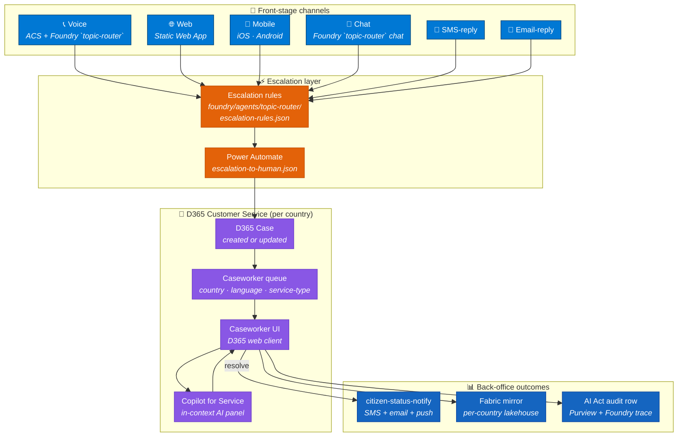
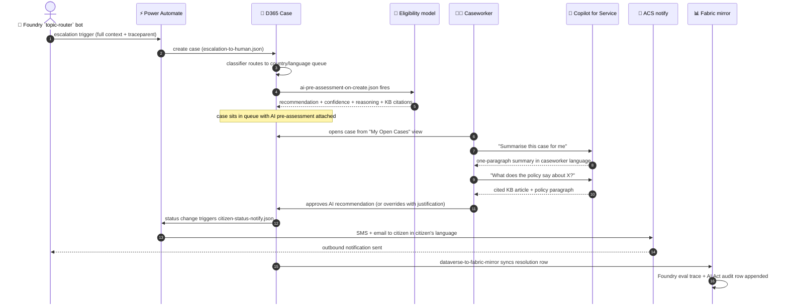
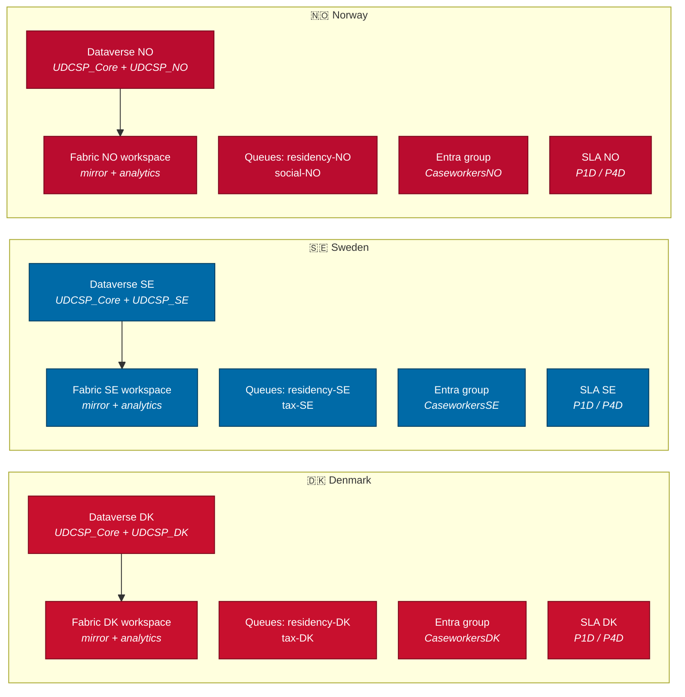
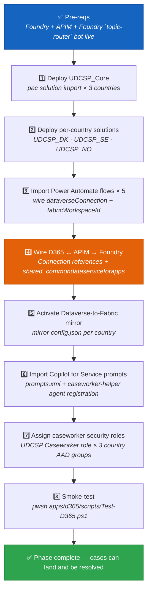

<div align="center">

# 🧑‍💼 UDCSP — The Caseworker Channel

### The back-office channel where every escalation lands and AI is supervised

*How a government caseworker in DK, SE, or NO opens D365, reads the AI co-pilot's recommendation, makes the final call, and closes the human-in-the-loop principle — with a full EU AI Act audit trail.*

[](#)
[](#)
[](#)
[](#)

[](#)
[](#)
[](#)
[](#)

</div>

---

> [!IMPORTANT]
> **TL;DR.** Every escalation from voice, web, mobile, chat, SMS, and email lands here. **Microsoft Dynamics 365 Customer Service** receives the case with full conversation context. **Power Automate** routes it to the right country/language queue. The **Foundry eligibility model** attaches a recommendation — confidence score, reasoning trace, and cited policy articles. The caseworker reviews and decides: **AI-first, human-in-the-loop, audited**. Every override is captured for EU AI Act Art. 14 conformity. The 28-day baseline becomes 4 days — not because AI decides, but because AI does the preparation.
>
> | Field | Value |
> |---|---|
> | 🗄️ **Where stored** | Case/actions in Dataverse `case` + `case_audit`; overrides in `eligibility_override`; Copilot conversations in `bot_session`; traces in App Insights → OneLake. |

---

> [!NOTE]
> D365 Customer Service and **Copilot for Service are unchanged**. Caseworker administration uses **Azure Bastion** per country (no public IPs), **Microsoft Entra Permissions Management** (CIEM) continuously checks cross-tenant permissions, and auditors can view Confidential Ledger-backed AI Act decision evidence.

## 📑 Table of contents

1. [Why a caseworker channel at all](#1-why-a-caseworker-channel-at-all)
2. [The mental model in one picture](#2-the-mental-model-in-one-picture)
3. [The case lifecycle, step by step](#3-the-case-lifecycle-step-by-step)
4. [The seven building blocks](#4-the-seven-building-blocks)
5. [The AI co-pilot for caseworkers — Microsoft Copilot for Service](#5-the-ai-co-pilot-for-caseworkers--microsoft-copilot-for-service)
6. [The eligibility AI — recommendation, not decision](#6-the-eligibility-ai--recommendation-not-decision)
7. [Multilingual — caseworker and citizen can speak different languages](#7-multilingual--caseworker-and-citizen-can-speak-different-languages)
8. [Accessibility — caseworker workflow accessibility](#8-accessibility--caseworker-workflow-accessibility)
9. [Sovereignty — one Dataverse environment per country](#9-sovereignty--one-dataverse-environment-per-country)
10. [SLOs, risks, and mitigations](#10-slos-risks-and-mitigations)
11. [🎯 Onboarding a caseworker (training + sandbox)](#11--onboarding-a-caseworker-training--sandbox)
12. [The activation runbook](#12-the-activation-runbook)
13. [How to test it (three levels)](#13-how-to-test-it-three-levels)
14. [The demo script for a jury](#14-the-demo-script-for-a-jury)
15. [Anti-patterns we avoid](#15-anti-patterns-we-avoid)
16. [Where the caseworker activity is stored](#16-where-the-caseworker-activity-is-stored)

---

## 1. Why a caseworker channel at all

The case study (`docs/biz/case-study-11.md` § AI Infusion Point) is explicit:

> *"An **automated eligibility determination model** pre-assesses benefit entitlements **before human review**."*

That human review is not a checkbox — it is a structural requirement enforced at three levels:

- ⚖️ **Regulatory.** EU AI Act Art. 14 mandates meaningful human oversight for high-risk AI systems that produce or influence decisions on citizens' welfare, residency, and social benefits. An automated AI verdict without a human caseworker validating it is a conformity violation. Every `udcsp_eligibility_assessment` row must have a corresponding caseworker approval or override action before it becomes a citizen-facing decision.
- 🤝 **Trust.** Citizens whose residency permit or income-supplement benefit is being assessed want a human to make that call. AI speeds the preparation; the caseworker holds the pen. Casework-study satisfaction target: **+38 % CSAT** — not achievable if citizens distrust the channel that closes their case.
- 🔄 **Resolution.** Voice, web, mobile, chat, SMS-reply, and email-reply are all *front-stage* channels. They are optimised for speed and self-service. But every one of them has an "escape to human" hatch (`foundry/agents/topic-router/escalation-rules.json`), and all those hatches lead **here**. Without the caseworker channel, every complex or sensitive case becomes a dead end.
- 🔐 **Accountability.** Public sector decisions carry legal weight. A citizen denied a benefit can appeal. The caseworker channel is where the legally accountable record is created, stored, and made auditable — not the bot, not the model, but the caseworker's explicit action in D365.

The design principle, visible in the BPF (`apps/d365/solutions/UDCSP_Core/customizations/businessprocessflows/application-intake-bpf.xml`):

> *Receive → Classify → Pre-assess → **Caseworker review** → Decide*

The `Caseworker review` stage is not optional and cannot be skipped by configuration.

> [!NOTE]
> **AI-first, but supervised.** This is the phrase the case study team coined in the planning sessions. The AI does the preparation work — classification, pre-assessment, KB lookup, draft replies — so the caseworker can focus entirely on the judgment call. The caseworker is not a rubber stamp; they are the decision maker. The AI is the analyst. This distinction is the foundation of UDCSP's EU AI Act conformity argument.

The escalation rules (`foundry/agents/topic-router/escalation-rules.json`) define four paths that reach the caseworker channel: low-confidence classifier output (`classifierConfidence < 0.70`), high-risk topics requiring a formal decision (`social-benefit`, `residency-application`), explicit citizen request (`userIntent == 'escalate-to-human'`), and accessibility-flagged cases routed to the `accessibility-help` priority queue. All four paths converge on D365.

The `escalate-to-human` Foundry `topic-router` topic (`foundry/agents/topic-router/topics/escalate-to-human.yaml`) is localised across all 12 languages — a citizen can trigger the escalation in any supported language and the handover context is preserved verbatim in that language inside the D365 case.

---

## 2. The mental model in one picture



> 📖 **Reading the picture.** Blue = front-stage channels. Orange = escalation layer (the bridge). Purple = D365 caseworker stack. Dark blue = back-office outcomes. **The caseworker channel is the convergence point — every escalation path leads here.**

The voice channel (`docs/biz/voice.md`) ends with a warm transfer: *"D365 warm-transfer with full context"*. This is where that transfer arrives. The case is pre-populated with the full Foundry `topic-router` conversation transcript, the detected locale, the citizen's intent, and any slot-fill data collected during the conversation. The caseworker does not start from a blank case.

The Foundry `topic-router` `escalate-to-human` topic (`foundry/agents/topic-router/topics/escalate-to-human.yaml`) invokes the `d365-escalation` connector (`foundry/agents/topic-router/connections/d365-escalation.json`) to create the case before the agent hands off. By the time a caseworker picks up the case, the AI context is already there.

---

## 3. The case lifecycle, step by step



**Time budget** (target: case resolved in ≤ 4 business days p95):

| Phase | Budget | How we hit it |
|---|---|---|
| Escalation → case creation | < 30 s | Power Automate cloud flow, no polling |
| AI pre-assessment attached | < 2 min | `ai-pre-assessment-on-create` fires on Dataverse `Create` event |
| Queue routing to caseworker | < 1 business hour | SLA KPI `FirstResponse` = `P1D`; sla-risk-alert fires at 75 % |
| Caseworker review + decision | ≤ 4 business days | SLA KPI `ResolveBy` = `P4D` (down from 28-day baseline) |
| Citizen notification | < 5 min after resolve | `citizen-status-notify` triggered on case status change |
| Fabric mirror sync | < 15 min | Near-real-time Dataverse Link to Fabric; bronze layer auto-refreshes |
| AI Act audit row | < 15 min | Same mirror pipeline; Purview lineage event emitted by `mirror-config.json` |

The sequence also covers the **failure path**: if the eligibility model returns a confidence below the 0.70 threshold, the `escalation-to-human` flow skips the pre-assessment step and routes directly to a caseworker with a flag on the case — no citizen waits for a model that can't decide.

---

## 4. The seven building blocks

| # | Block | What it does | Where it lives |
|:-:|---|---|---|
| **1** | **`UDCSP_Core` solution + 4 entities** | Shared schema: `udcsp_application`, `udcsp_consent_record`, `udcsp_country_zone`, `udcsp_eligibility_assessment`. Every case ultimately writes to these tables. | `apps/d365/solutions/UDCSP_Core/solution.xml`, `customizations/entities/` |
| **2** | **Per-country solutions `UDCSP_DK / SE / NO`** | Country-specific queue names, local terminology (Bopæl / Folkbokföring / Folkeregister), dependency on Core. Deployed on top of Core — **never standalone**. | `apps/d365/solutions/UDCSP_{DK,SE,NO}/country-overrides.json` |
| **3** | **Business process flow `application-intake-bpf`** | Five locked stages: Receive → Classify → Pre-assess → Caseworker review → Decide. The `Caseworker review` stage cannot be bypassed. | `customizations/businessprocessflows/application-intake-bpf.xml` |
| **4** | **Caseworker views + queues** | Three views: `My Open Cases`, `SLA-Risk`, `AI Pre-assessed`. Four queues: `residency-DK`, `tax-SE`, `social-NO`, `accessibility-help`. | `customizations/views/caseworker-views.xml`, `customizations/queues/case-queues.xml` |
| **5** | **SLA `four-day-sla`** | `FirstResponse` KPI: fail after `P1D`. `ResolveBy` KPI: fail after `P4D`. Applies to residency, tax, social-benefit, cross-border case types. The headline 28d → 4d reduction from the case study. | `customizations/sla/four-day-sla.xml` |
| **6** | **Copilot for Service prompts** | Two scaffold prompts (`summarize-application`, `draft-citizen-reply`) backed by the Foundry `caseworker-helper` agent (`foundry/agents/caseworker-helper/`). Full runtime set includes 5 prompts (summarise, draft reply, suggest next action, explain eligibility reasoning, cite policy). | `customizations/copilot-for-service/prompts.xml` |
| **7** | **Power Automate flows × 5** | `escalation-to-human` — creates case; `ai-pre-assessment-on-create` — triggers eligibility model; `citizen-status-notify` — outbound SMS+email; `sla-risk-alert` — warns at 75 % SLA; `dataverse-to-fabric-mirror` — syncs to Fabric. | `apps/d365/power-automate-flows/` |
| **8** | **Dataverse → Fabric mirror** | Tables `udcsp_application`, `udcsp_eligibility_assessment`, `udcsp_country_zone`, `udcsp_consent_record` mirrored near-real-time to the per-country Fabric bronze lakehouse. Lineage events emitted to Purview. | `apps/d365/dataverse-to-fabric-mirroring/mirror-config.json` |

The eight blocks divide naturally into two layers: **Foundation** (blocks 1–2, the Dataverse schema and country customisations — must be deployed first) and **Orchestration** (blocks 3–8, the runtime behaviour — deployable incrementally after foundation).

Two cross-cutting concerns:

| | Concern | Where |
|:-:|---|---|
| 📜 | **Correlation thread** — every case carries a `udcsp_traceparent` (W3C trace context) that links the Foundry `topic-router` conversation, the Power Automate flows, the Foundry eligibility trace, and the Fabric mirror row into a single observable request chain. | `apps/d365/solutions/UDCSP_Core/customizations/entities/udcsp_application.xml` |
| 🔐 | **Consent gating** — citizen consent for data processing is modelled in `udcsp_consent_record` and checked by `citizen-status-notify` before any outbound communication. Notifications are suppressed if consent has expired or been withdrawn. | `apps/d365/solutions/UDCSP_Core/customizations/entities/udcsp_consent_record.xml` |

Every caseworker has a persistent **Copilot for Service panel** docked inside the D365 case form. It is powered by the `udcsp-caseworker-helper` Foundry agent (`foundry/agents/caseworker-helper/agent.yaml`) — model `gpt-5.5`, temperature `0.2`, `p95 ≤ 2 s` inside the D365 panel.

The five runtime prompts (two scaffolded in `prompts.xml`, three added at import time):

| Prompt | What the caseworker types | What the AI returns |
|---|---|---|
| **summarize-application** | *(auto-triggered on case open)* | One paragraph: citizen situation, AI pre-assessment verdict, evidence gaps, SLA risk |
| **draft-citizen-reply** | "Draft an update for this citizen" | Accessible plain-language reply in the citizen's preferred language; caseworker edits before sending |
| **suggest-next-action** | "What should I do next?" | Prioritised action list: missing documents, related cases, policy citation |
| **explain-eligibility** | "Why did the model say ineligible?" | Step-by-step reasoning trace from `udcsp_eligibility_assessment` — confidence, features, KB citations |
| **cite-policy** | "What does Article X say?" | Verbatim policy paragraph + source URL from the multilingual knowledge base |

The agent's knowledge sources are the same Foundry KB indices used by the citizen-assistant — **one knowledge base, two audiences**. Caseworker prompts add the `d365-case-reader` tool so the agent can read the live case record, and the `draft-response-writer` tool so it can propose outbound messages.

Content safety is applied on both input and output (`azure-ai-content-safety-standard`). The `blockCategories` list includes `pii_exfiltration` — the co-pilot cannot be prompted into leaking citizen data outside the case context. The evaluation suite (`foundry/evaluations/eval-suites/caseworker-helper.yaml`) is run on every Foundry agent release to guarantee non-regression on summary quality, draft accuracy, and policy citation precision.

> [!NOTE]
> **Every AI suggestion is opt-in.** The caseworker accepts, edits, or rejects each Copilot output. No message leaves D365 without a human pressing **Send**. Accepted/edited/rejected outcomes are logged to Dataverse and mirrored to Fabric for quality tracking.

---

## 6. The eligibility AI — recommendation, not decision

The **Eligibility Pre-Assessor** (`foundry/agents/eligibility/agent.yaml`) is classified as a **high-risk AI system** under the EU AI Act (`governance/ai-act/registry/eligibility-model.yaml`). Its role is strictly advisory:

1. On case creation, the `ai-pre-assessment-on-create` Power Automate flow invokes the eligibility model via APIM.
2. The model reads the `udcsp_application` record, retrieves validated policy reference data from Fabric silver, and produces:
   - `udcsp_recommendation` (Eligible / Ineligible / Needs more information)
   - `udcsp_confidence` (decimal 0–1)
   - Reasoning trace (step-by-step feature attribution)
   - Cited policy articles (from the multilingual KB)
3. All four fields are written to a new `udcsp_eligibility_assessment` row, which is linked to the case and immediately visible in the caseworker view.
4. The caseworker reviews, and **must** take one of: approve / override / request more information. The BPF `Caseworker review` stage does not advance until this action is recorded.
5. Every override captures a justification text plus a classification code (missing document / new evidence / policy interpretation / other) — these become training signal for the next evaluation cycle.

From the AI Act registry (`governance/ai-act/registry/eligibility-model.yaml`):

> `humanOversight: "Caseworker must review and can override every recommendation before a citizen-facing decision."`

Fairness metrics enforced quarterly: equal opportunity difference by country ≤ 0.05, language accuracy variance ≤ 3 pp, override rate reviewed monthly. Severe incidents escalated within 72 hours.

An override record in Dataverse looks like this (simplified):

```json
{
  "udcsp_name": "Override-2026-05-08-NO-1234",
  "udcsp_applicationid": "<case-guid>",
  "udcsp_recommendation": "Eligible",
  "udcsp_confidence": 0.71,
  "udcsp_aiActRegistryId": "eligibility-model/v3",
  "udcsp_lineageId": "00-4bf92f3577b34da6a3ce929d0e0e4736-00f067aa0ba902b7-01"
}
```

The `udcsp_lineageId` is the W3C `traceparent` carried from the original Foundry `topic-router` conversation — it is the thread that makes every AI decision replay-able by an auditor a year later (see Demo 7 in [`uses.md`](./uses.md#️-demo-7--hans-the-dpo-audits-a-six-month-old-ai-decision)).

> [!IMPORTANT]
> **Override = training data.** Caseworker overrides are not exceptions — they are the most valuable signal in the system. Override rate by case type is a live KPI on the executive dashboard, not a hidden metric.

---

## 7. Multilingual — caseworker and citizen can speak different languages

The case carries two language fields: `citizenLanguage` (set at escalation time from the Foundry `topic-router` conversation locale) and `caseworkerLanguage` (set from the caseworker's Entra ID profile locale). These can differ — and often do.

| Scenario | What happens |
|---|---|
| Citizen in PL, caseworker in SV | Copilot for Service auto-presents the case narrative in SV; draft citizen reply is proposed in PL |
| Citizen in AR, caseworker in DA | KB search returns DA articles for the caseworker; outbound draft is in AR with RTL formatting |
| Citizen and caseworker both in NB | No translation required; native pass-through |
| Citizen in UK, caseworker in EN | Foundry translator bridges UK → EN for the case narrative |

The Foundry `translator` agent (`foundry/agents/translator/`) handles the translation pipeline. All 12 case-study languages are supported: Danish (DA), Swedish (SV), Norwegian Bokmål (NB), Norwegian Nynorsk (NN), Northern Sámi (SE), German (DE), French (FR), Polish (PL), Arabic (AR), Ukrainian (UK), Finnish (FI), and English (EN).

The `caseworker-helper` agent (`agent.yaml`) lists all 12 locales in its `languages` field — the co-pilot is language-neutral from the caseworker's perspective. Outbound citizen notifications (`citizen-status-notify.json`) are rendered from the citizen's language template, regardless of which country queue resolved the case.

> [!NOTE]
> **Civic-term awareness.** The Foundry KB is indexed with country-specific civic terminology (`personnummer` for SE, `CPR-nummer` for DK, `fødselsnummer` for NO) so that caseworker queries using national terms hit the right KB chunks. The same lexical awareness that powers the voice channel STT is present in the caseworker co-pilot knowledge search.

---

## 8. Accessibility — caseworker workflow accessibility

Caseworkers themselves may have disabilities. UDCSP is built to that bar:

- ♿ **WCAG 2.1 AA** — the D365 web client meets WCAG 2.1 AA out of the box; Microsoft publishes accessibility conformance reports for D365 Customer Service.
- ⌨️ **Keyboard-only case navigation** — all queue views, case forms, BPF stage controls, and Copilot for Service panel are fully keyboard-navigable. No action requires a mouse.
- 🔊 **Screen-reader-friendly queue views** — the `My Open Cases`, `SLA-Risk`, and `AI Pre-assessed` saved queries in `caseworker-views.xml` are implemented as standard Dataverse grids with proper ARIA roles and column headers.
- 🎯 **Focus-visible on AI suggestions panel** — the Copilot for Service panel's accept / edit / reject controls carry explicit `:focus-visible` outlines at 3 px contrast-compliant weight.
- 🎞️ **Reduced-motion respected** — the BPF stage-progress animation respects `prefers-reduced-motion: reduce` via the D365 theming layer.
- 🖋️ **High-contrast mode** — D365's built-in high-contrast theme is tested in CI against the three custom entities and the Copilot panel via axe-core.

The `accessibility-help` queue (`case-queues.xml`) is a cross-country priority queue for cases where the citizen has signalled an accessibility need. Caseworkers assigned to this queue receive additional training on handling citizens with disabilities and are equipped with Copilot for Service's plain-language drafting prompt to ensure replies are at CEFR B1 reading level or below.

Accessibility is not just a citizen concern — caseworkers with low vision, motor impairments, or cognitive load differences use this channel all day, every day. UDCSP is designed to the same bar for both sides of the service window.

---

## 9. Sovereignty — one Dataverse environment per country, one mirror per country, one queue tree per country



What stays in-country: **all case data, eligibility assessments, consent records, AI traces, and Fabric mirror**. What is shared cross-country: **the `UDCSP_Core` solution definition** (schema) and **the Foundry agent definitions** (the brain). The data never crosses the border.

Cross-border collaboration is **forbidden by default**. A DK caseworker cannot query an SE case. Any cross-country lookup goes through APIM with an explicit `cross-border-consent` claim validated against `udcsp_consent_record`.

The per-country queue trees (`apps/d365/solutions/UDCSP_{DK,SE,NO}/country-overrides.json`) define not just queue names but also localised terminology: DK calls it *Bopæl*, SE calls it *Folkbokföring*, NO calls it *Folkeregister*. These terminology overrides surface in BPF stage labels and caseworker view column headers — a Norwegian caseworker never sees a Swedish term. This is not cosmetic; it is a compliance requirement under each country's administrative law.

---

## 10. SLOs, risks, and mitigations

| | SLO | Target | How we measure |
|:-:|---|---|---|
| ⚡ | **Time-to-first-touch** (case assigned → caseworker opens it) | ≤ **1 business hour** p95 | SLA KPI `FirstResponse` in D365; `sla-risk-alert` fires at 75 % |
| 🎯 | **Case resolution** | ≤ **4 business days** p95 | SLA KPI `ResolveBy`; Power BI per-country KPI tile |
| 🤖 | **AI-suggestion acceptance rate** | Track; guarantee non-degradation | `caseworker-helper` eval suite in `foundry/evaluations/eval-suites/caseworker-helper.yaml` |
| 😊 | **Caseworker satisfaction with co-pilot** | ≥ **4 / 5** CSAT | Post-session survey embedded in D365 (A15 synthetic baseline; prod live survey) |
| 📋 | **AI Act audit completeness** | **100 %** of eligibility decisions have an `udcsp_eligibility_assessment` row with caseworker action | Purview compliance dashboard + automated nightly check |
| 🔁 | **Fabric mirror lag** | ≤ 15 min p95 | Dataverse Link to Fabric latency metric in Fabric monitoring |
| 🛡️ | **Cross-border data isolation** | Zero cross-country data reads without explicit consent claim | APIM policy audit log scanned nightly for `cross-border-consent` violations |

Risks tracked in `docs/tech/plan.md` (A8 / A11 risk register):

| Risk | Mitigation |
|---|---|
| **AI overreliance** — caseworker rubber-stamps without reading | Override-rate KPI visible on exec dashboard; EU AI Act Art. 14 training mandatory at onboarding; BPF `Caseworker review` stage requires explicit action field |
| **Case-data sprawl** — PII leaking across country boundaries | Purview sensitivity labels on all four core entities; per-country Dataverse environment; APIM cross-border guard |
| **Training drift** — eligibility model degrades over time | Foundry eval pipeline runs monthly against caseworker-labelled gold set per country and language; severe drift triggers model rollback |
| **SLA breach cascade** — a queue surge breaches all SLAs at once | `sla-risk-alert.json` fires at 75 % of the window; Power Automate re-routes overflow cases to a standby queue; supervisor dashboard shows real-time SLA heat map |

---

## 11. 🎯 Onboarding a caseworker (training + sandbox)

A new caseworker goes live through six concrete steps:

1. **AAD group membership** — the caseworker's work account is added to the correct country group (`CaseworkersDK`, `CaseworkersSE`, or `CaseworkersNO`) in Entra ID. This is the only step required to grant D365 environment access.
2. **D365 security role assignment** — the `UDCSP Caseworker` security role is assigned in the target Dataverse environment. The role grants read/write on the four core entities, queue access to the country queues, and read-only access to `udcsp_eligibility_assessment`.
3. **Sandbox environment with synthetic cases** — the caseworker logs in to the DEV or UAT environment seeded with `Install-UDCSP.ps1 -SeedSyntheticData`. The `data/synthetic/` dataset includes ~200 realistic cases across all case types and all 12 languages — enough to rehearse every BPF path.
4. **Copilot for Service trial week with shadowing** — the caseworker spends the first five working days processing synthetic cases alongside a senior colleague. Every Copilot suggestion is reviewed jointly; the caseworker learns when to trust, edit, or override.
5. **AI Act registry briefing + EU AI Act Art. 14 training** — mandatory 45-minute module covering: what the eligibility model does, what `riskLevel: high` means for the caseworker's legal responsibility, how to complete an override record correctly, and how to read the AI Act audit dashboard.
6. **Production go-live with progressive case load** — first week: 10 cases / day (monitored); second week: 30 cases / day; third week: full queue. Override rates and CSAT are tracked per caseworker during the ramp period.

The ramp schedule is tracked in the per-country Dataverse environment. A supervisor Power BI tile shows each new caseworker's daily throughput, override rate, and CSAT score during the ramp, with automated alerts if any metric is out of band.

> [!TIP]
> **The sandbox is seeded with adversarial cases.** The A15 synthetic data generator (`data/synthetic/`) deliberately includes edge cases designed to trigger the override path — low-confidence eligibility verdicts, cases with missing documents, cross-language cases. New caseworkers are encouraged to override freely during training; every override is a learning opportunity for both the caseworker and the model.

---

## 12. The activation runbook



All steps P1–P7 are automated by `scripts/install/modules/Install-D365.psm1` (phase 8 of the master installer). The only decision point is **step P4** — connection references require a human to select the correct Dataverse environment URL and Fabric workspace ID for each country (`Config.D365EnvironmentUrls[DK/SE/NO]`).

The installer logs each step to `install-d365.log`:

```
[scaffold] pac solution import --path apps/d365/solutions/UDCSP_Core --environment https://org-dk.crm4.dynamics.com/
[scaffold] pac solution import --path apps/d365/solutions/UDCSP_DK --environment https://org-dk.crm4.dynamics.com/
[scaffold] pac solution import --path apps/d365/solutions/UDCSP_Core --environment https://org-se.crm4.dynamics.com/
[scaffold] pac solution import --path apps/d365/solutions/UDCSP_SE --environment https://org-se.crm4.dynamics.com/
[scaffold] pac solution import --path apps/d365/solutions/UDCSP_Core --environment https://org-no.crm4.dynamics.com/
[scaffold] pac solution import --path apps/d365/solutions/UDCSP_NO --environment https://org-no.crm4.dynamics.com/
```

Core is always imported before the country solution — `UDCSP_DK/SE/NO` each have `"dependsOn": "UDCSPCore"` in their `country-overrides.json`.

---

## 13. How to test it (three levels)

| Level | Command | What it proves | Lead time |
|---|---|---|---|
| **🚦 Smoke (isolated)** | `pwsh apps/d365/scripts/Test-D365.ps1 -EnvironmentUrl $url -AccessToken $token` | Creates a synthetic application, validates BPF wiring, checks SLA timer starts, checks AI pre-assessment row is created. **No citizen data, no real Fabric write.** | < 60 s |
| **🧪 E2E (Playwright)** | `npx playwright test tests/e2e/tests/scenario-05-astrid-caseworker.spec.ts` | Escalates a synthetic chat to the SE caseworker queue; asserts the D365 case appears with AI pre-assessment; asserts Copilot summary is rendered; asserts override action is logged to Foundry trace. | ~ 3 min |
| **👤 Live (real caseworker)** | Real caseworker logs in to D365 web client in UAT | The full human experience: queue view, Copilot panel, BPF progression, citizen-notify, Fabric mirror. Validates accessibility with screen reader. | Manual, ~20 min |

The smoke script (`apps/d365/scripts/Test-D365.ps1`) requires `-EnvironmentUrl` and `-AccessToken`. Both are emitted by `Deploy-D365.ps1` into the install log so the test-run can be chained immediately after deployment without manual credential gathering.

The E2E spec (`tests/e2e/tests/scenario-05-astrid-caseworker.spec.ts`) maps to eval-matrix rows 3, 7, 9, 13, 14, 15, 16, and 17. It uses the `personas` fixture (Astrid Lindgren, SE) and the `signInWithExternalIdTestToken` helper — no production credentials are needed in CI. The `traceparent` propagated through the test binds the Playwright span to the Foundry trace, enabling full observability of the test run in Application Insights.

> [!NOTE]
> The Playwright scenario covers the **happy path** (approval). A separate adversarial spec (`scenario-06-eligibility-human-loop`) exercises the override path and is also in `tests/e2e/tests/`.

---

## 14. The demo script for a jury

5 beats, ~7 minutes, no setup beyond the seeded DEV environment:

| Beat | Action | What the jury sees | Eval-matrix rows hit |
|:-:|---|---|---|
| 1 | Show Lars's voice case (Demo 2 aftermath) landing in the NO queue with full ACS transcript + AI pre-assessment verdict "likely eligible — confidence 0.82" | `social-NO` queue; SLA countdown started; AI assessment panel visible | #3 (28d→4d) · #16 (caseworker) |
| 2 | Caseworker opens the case; Copilot for Service auto-summarises in NB ("Lars Eriksen applied for income supplement…") | One-paragraph summary; evidence checklist; SLA risk: green | #6 (GenAI assist) · #13 (multilingual) |
| 3 | Caseworker asks: *"Hva sier loven om inntektsgrensen?"* (NB) | Copilot cites the correct NAV policy article in NB, with a direct link | #6 · #15 (audit) |
| 4 | Caseworker clicks **Approve** — one click, one confirmation | Outbound SMS + email sent to Lars in NB; BPF advances to **Decide** | #3 · #4 (CSAT) · #13 |
| 5 | Jury switches to Power BI / Fabric NO workspace | Resolution row in Fabric bronze; Foundry trace visible; AI Act audit row appended with `action: approved` | #10 (sovereignty) · #15 · #9 (GDPR/AI Act) |

This corresponds to **Demo 5** and **Demo 6** in [`uses.md`](./uses.md#️-demo-5--astrid-the-caseworker-triages-a-queue-with-copilot-for-service).

#### 💡 Talking points for the jury

- 💬 *"Lars submitted by voice. The case landed in D365 with the full transcript, the AI assessment, and a countdown. The caseworker never typed an intake form."*
- 💬 *"Copilot drafts; the caseworker disposes. **No outbound message leaves D365 without a human in the loop** — this is not a configuration option, it is an architectural constraint."*
- 💬 *"Switch to the Power BI audit tile — the AI Act audit row is there in real time. That is what 'meaningful human oversight' looks like under EU AI Act Art. 14."*

> [!TIP]
> For maximum jury impact, run beat 3 twice: once where the caseworker **approves** (normal path) and once where they **override** with a justification. The second run makes the AI Act compliance story tangible — the override is written to the AI Act registry in real time.

---

## 15. Anti-patterns we avoid

| ❌ Anti-pattern | ✅ What we do instead |
|---|---|
| Let the AI auto-decide (skip caseworker review) | `Caseworker review` BPF stage is mandatory; `udcsp_eligibility_assessment` requires a caseworker action field before `Decide` stage |
| Share one D365 environment across countries | One Dataverse environment per country, enforced by `Install-D365.psm1` and AAD group separation |
| Ignore the override signal | Override rate is a live exec KPI; every override feeds the Foundry monthly eval cycle |
| Put the AI co-pilot outside the case context | Copilot for Service panel reads the live case record via `d365-case-reader` tool — it reasons on **this** citizen's data, not generic knowledge |
| Email-to-case without classification | `escalation-to-human.json` routes to `accessibility-help` or the correct country/skill queue — no unclassified inbox |
| Let citizen-language drift from caseworker reply | Copilot drafts the outbound reply in the **citizen's** language; caseworker cannot inadvertently reply in their own language without editing the draft |
| No SLA timer | `four-day-sla.xml` starts the SLA KPI the moment the case is created; `sla-risk-alert.json` fires at 75 % of the failure window |
| No AI Act audit row | Every `udcsp_eligibility_assessment` is mirrored to Fabric and tagged in the Purview AI Act registry; completeness is checked nightly |
| Caseworker training without adversarial cases | The sandbox is seeded with adversarial synthetic cases that force override decisions; caseworkers who never override in training are flagged for a follow-up session |
| Deploy country solutions without Core | `country-overrides.json` declares `"dependsOn": "UDCSPCore"`; the installer enforces this order for all three countries |

---

## 16. Where the caseworker activity is stored

The caseworker channel is the legally accountable system of record: case state, human actions, and override decisions live in Dataverse, while every AI suggestion is correlated to a Foundry trace. Copilot for Service conversations use the same Microsoft conversational store as Foundry `topic-router`, and precedent knowledge is read from anonymised OneLake Gold only. See [`../tech/data.md`](../tech/data.md) § 3.3 for the Zone 3 policy.

| What | Where | Retention |
|---|---|---|
| Case state + actions | Dataverse `case` + `case_audit` | 10 years |
| Human override | Dataverse `eligibility_override` + Foundry `human-override` annotation | 10 years / case retention |
| Copilot for Service chat | Dataverse `bot_session` | 6 months hot; 6 years OneLake |
| AI traces + precedents | App Insights → OneLake Bronze; OneLake Gold read-only precedents | Traces 180 days hot; precedents anonymised |

For the full retention matrix, use [`../tech/data.md`](../tech/data.md) § 5.

> 📖 Full storage architecture and retention rules: see [`../tech/data.md`](../tech/data.md).

---

<div align="center">

*The caseworker channel is where AI meets accountability — every recommendation supervised, every decision audited.*  🇩🇰 🇸🇪 🇳🇴

[](./uses.md#️-demo-5--astrid-the-caseworker-triages-a-queue-with-copilot-for-service)
[](../tech/agents.md)
[](../tech/installation.md)

</div>
