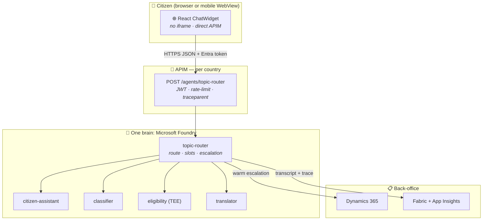
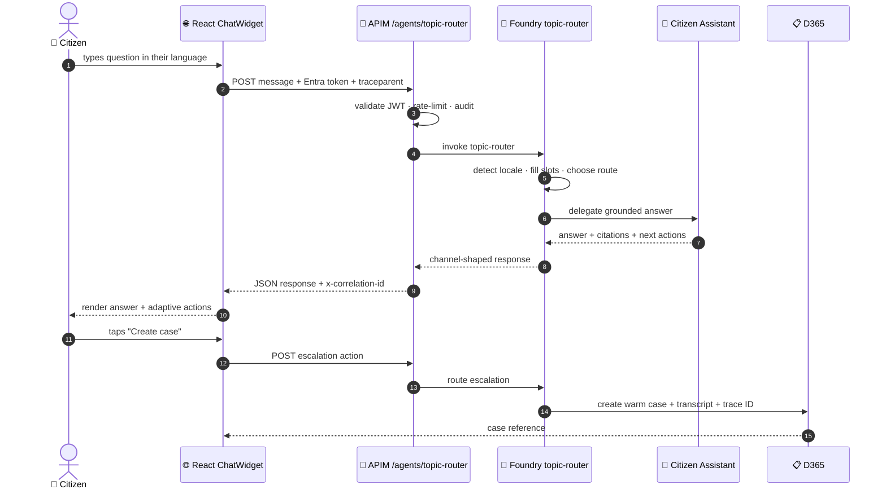
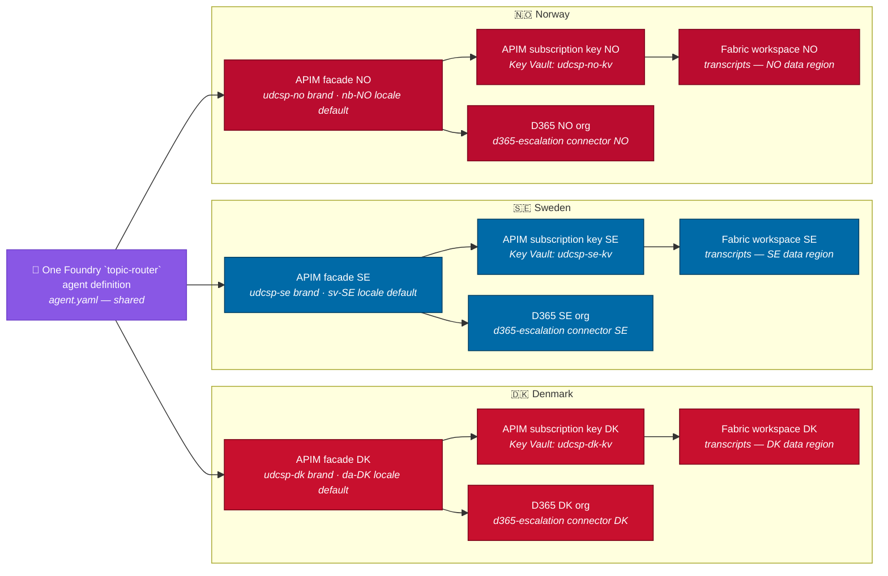
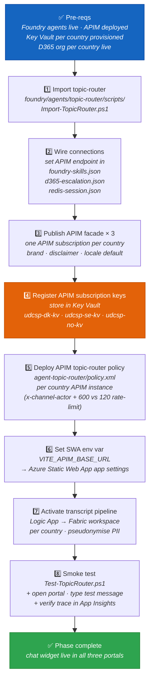

<div align="center">

# 💬 UDCSP — The Chat Widget

### One brain (Foundry topic-router) for web chat and voice

*How a citizen opens a corner panel, types a question in any of 12 languages, and gets a grounded answer — complete with cited adaptive cards, suggested actions, and a one-click escalation to a human caseworker — powered by the same Foundry brain that also answers the phone.*

[](#)
[](#)
[](#)
[](#)

[](#)
[](#)
[](#)
[](#)

</div>

---

> [!IMPORTANT]
> **TL;DR.** A citizen opens the chat panel embedded in the web portal or mobile WebView → React `ChatWidget.tsx` sends the message to **APIM `/agents/topic-router`** with the Entra token and `traceparent` → the Foundry `topic-router` agent selects the right downstream agent → the answer returns with citations, adaptive cards, and suggested actions → escalation opens a warm D365 case with the full transcript attached. **This was Copilot Studio channel adapter in the previous version; it is now Foundry topic-router via APIM.**
>
> | Field | Value |
> |---|---|
> | 🗄️ **Where stored** | Canonical dialog transcript in Dataverse `bot_session`; slot state in Redis Enterprise; drafts over 24 h in PostgreSQL JSONB; uploads in ADLS `citizen-uploads/`; memory in Azure AI Search; traces in App Insights → OneLake and Confidential Ledger anchors. |
> | 🧱 **Implementation note** | The React `ChatWidget.tsx` posts `JSON` to `${VITE_APIM_BASE_URL}/agents/topic-router/messages`; **no DirectLine, no Copilot Studio web embed, no iframe**. |

---

## 📑 Table of contents

1. [Why a chat widget at all](#1-why-a-chat-widget-at-all)
2. [The mental model in one picture](#2-the-mental-model-in-one-picture)
3. [The conversation lifecycle, step by step](#3-the-conversation-lifecycle-step-by-step)
4. [The seven building blocks](#4-the-seven-building-blocks)
5. [Topics — what the bot can do](#5-topics--what-the-bot-can-do)
6. [Multilingual — language switch + per-locale routing](#6-multilingual--language-switch--per-locale-routing)
7. [Accessibility — keyboard-only, screen-reader-friendly](#7-accessibility--keyboard-only-screen-reader-friendly)
8. [Sovereignty — one bot, three brand themes](#8-sovereignty--one-bot-three-brand-themes)
9. [SLOs, risks, and mitigations](#9-slos-risks-and-mitigations)
10. [🔗 Embedding the widget — the one-line script tag](#10--embedding-the-widget--the-one-line-script-tag)
11. [The activation runbook](#11-the-activation-runbook)
12. [How to test it (three levels)](#12-how-to-test-it-three-levels)
13. [The demo script for a jury](#13-the-demo-script-for-a-jury)
14. [Anti-patterns we avoid](#14-anti-patterns-we-avoid)
15. [Where the conversation is stored](#15-where-the-conversation-is-stored)

---

## 1. Why a chat widget at all

The case study is unambiguous (`docs/biz/case-study-11.md` § AI Infusion Point):

> *"A GenAI citizen assistant answers service queries in natural language across **web**, mobile, and telephone channels."*

The chat widget is the **web** arm of that mandate. Four reasons it earns its own architecture document:

- 💬 **Low-friction first-touch.** A citizen sees the assistant in the corner of any portal page. No navigation, no search, no form — just a question. It deflects **≥ 70 % of "where do I find X" queries** before they become support tickets or phone calls.
- 🕐 **24/7 availability.** The bot does not take holidays, does not queue, and does not put citizens on hold. The Foundry brain answers within 800 ms p95 at any hour. There is no staffing cost for the first line of response.
- 🌍 **Multilingual by default.** The first message is language-classified by Foundry. There is no "select your language" pre-screen; the bot adapts to the citizen. All 12 languages — Danish, Swedish, Norwegian Bokmål, Norwegian Nynorsk, Northern Sámi, English, German, French, Polish, Arabic, Ukrainian, Finnish — are supported from the first keystroke.
- 🤝 **Escalation without loss of context.** When the bot cannot or should not answer, it opens a warm D365 case with the full conversation transcript and Foundry trace ID attached, so the caseworker picks up exactly where the bot left off.

The design principle, shown in `docs/biz/uses.md` Demo 1 and Demo 3:

> *"The Citizen Assistant in the chat widget guides Anna throughout."* (Demo 1 — cross-border residency transfer)  
> *"The AI Citizen Assistant offers help in PL and explains in plain language what each field means."* (Demo 3 — Polish screen-reader user)  
> *"Expected outcomes: citizen satisfaction scores increased by **38 %**, application processing time reduced from **28 days to 4 days**."* — `docs/biz/case-study-11.md` § Expected Outcomes

> [!NOTE]
> **Shared bot, shared brain, channel-specific renderer.** The voice channel (`voice.md`) and the chat widget share the same Foundry `topic-router` agent definition, the same 10 topics, the same Foundry agents, and the same APIM gateway. The **only** channel-specific components are the channel renderer (web vs. voice) and the ACS + AI Speech stack (voice only). When the citizen-assistant Foundry agent is improved, both channels benefit simultaneously.

---

## 2. The mental model in one picture



> 📖 **Reading the picture.** Channel code renders the panel; APIM is the only ingress; Foundry `topic-router` is the shared brain for both web chat and voice. This was Copilot Studio in the previous version; the routing now lives in Foundry.

---

## 3. The conversation lifecycle, step by step



**Latency budget** (target: time-to-first-token p95 ≤ 800 ms): APIM validation ~30 ms, topic-router route ~80 ms, downstream Foundry agent first token ~600 ms, browser render ~80 ms.

### What makes this different from a traditional FAQ chatbot

A traditional FAQ chatbot matches a question to a pre-written answer using keyword rules. The UDCSP chat widget is a different category:

| Dimension | Traditional FAQ bot | UDCSP chat widget |
|---|---|---|
| Answer source | Hard-coded answer strings | Foundry RAG over multilingual KB (cited) |
| New policies | Requires a developer to add new intents | SharePoint KB updated by a policy author; bot re-indexes automatically |
| Language support | Manual translation of every answer | Language-aware retrieval — the answer comes from the correct language chunk |
| Escalation | "Sorry, I cannot help" with a phone number | Warm D365 case creation with full transcript attached |
| Audit | No trace | `traceparent` correlates every turn to a Foundry distributed trace |

### The `traceparent` utility — end-to-end observability from keypress to Fabric

The `ChatWidget` calls `generateTraceparent()` (`apps/web/src/utils/traceparent.ts`) before posting to APIM. This W3C Trace Context header is forwarded to Foundry `topic-router`, included in every APIM call, and propagated to Foundry. A single string links:

1. The citizen's browser session (SWA Application Insights)
2. The Foundry `topic-router` activity log
3. The APIM audit entry (correlation-id)
4. The Foundry distributed trace (prompt → classifier → citizen-assistant → content safety)
5. The Fabric transcript record (pseudonymised, per-country workspace)

A DPO or caseworker can use this single `traceparent` to reconstruct the entire conversation across every layer — without needing access to any PII-bearing system.

---

## 4. The seven building blocks

| # | Block | What it does | Where it lives |
|:-:|---|---|---|
| **1** | **Foundry `topic-router` agent** | Owns the dialog state machine, topic routing, slot filling, and adaptive-card rendering for **both** web and voice channels. One agent definition (`agent.yaml`), invoked by every channel through APIM. Supports 12 languages out of the box. | `foundry/agents/topic-router/agent.yaml` |
| **2** | **Topics** | Each `.yaml` topic file is a dialog node: trigger phrases in 12 languages, slot-fill steps and downstream agent calls. Topics are **shared between web and voice** — a change to `child-benefit.yaml` affects both channels simultaneously. | `foundry/agents/topic-router/topics/*.yaml` |
| **3** | **Slot definitions** | Five closed-list slots used for structured slot filling: `channel` (web · mobile · voice · chat), `country` (DK · SE · NO), `language` (all 12 locales), `serviceType` (residency · tax-cert · child-allowance · social-benefit · business-registration), `accessibilityNeed` (screen-reader · voice-only · cognitive-support · mobility-support · none). *(Post-audit: the 5 closed-list `entities/*.json` files from Copilot Studio have been folded into a single `topics/slot-definitions.yaml`.)* | `foundry/agents/topic-router/topics/slot-definitions.yaml` |
| **4** | **Knowledge sources** | Two registered sources: (1) `citizens-faq.json` — citizen-facing FAQ content from web/Dataverse in 12 languages; (2) `sharepoint-policies.json` — SharePoint-hosted policy documents per country. Queried by Foundry RAG on every chat turn. The same sources are also queried by the voice channel. | `foundry/agents/topic-router/knowledge-sources/*.json` |
| **5** | **Connections** | Four connection definitions: `apim-facade.json` is the public ingress, `foundry-skills.json` invokes the downstream Foundry agents (classifier, citizen-assistant, doc-extractor, eligibility, translator), `redis-session.json` holds the slot-fill state, `d365-escalation.json` creates D365 cases on escalation. All use **managed identity** — no secrets in connection files. | `foundry/agents/topic-router/connections/*.json` |
| **6** | **Escalation rules** | Four rules evaluated on every turn: (1) `classifierConfidence < 0.70` → create D365 case, (2) `topic in [social-benefit, residency-application] and asksForDecision == true` → human caseworker review, (3) `accessibilityNeed != 'none'` → priority accessibility queue, (4) `userIntent == 'escalate-to-human'` → create D365 case. | `foundry/agents/topic-router/escalation-rules.json` |
| **7** | **APIM `/agents/topic-router` endpoint** | APIM validates the citizen Entra token per conversation and never exposes backend credentials. The React `ChatWidget` posts turns directly over HTTPS as JSON. Policy applies: correlation-id injection, Entra JWT validation, `x-channel-actor` enforcement, rate-limit (120 calls/min for chat/web/mobile, 600 for voice), and `traceparent` forwarding for end-to-end tracing. | `services/apim/apis/agent-topic-router/policy.xml`, `services/apim/apis/agent-topic-router/openapi.yaml` |

The five slots used for structured slot filling — shown verbatim from `topics/slot-definitions.yaml`:

```yaml
# topics/slot-definitions.yaml
kind: FoundrySlotDefinitions
slots:
  channel:
    kind: closedList
    values: [web, mobile, voice, chat]
  country:
    kind: closedList
    values: [DK, SE, NO]
  language:
    kind: closedList
    values: [da, sv, nb, nn, se, en, de, fr, pl, ar, uk, fi]
  serviceType:
    kind: closedList
    values: [residency, tax-cert, child-allowance, social-benefit, business-registration]
  accessibilityNeed:
    kind: closedList
    values: [screen-reader, voice-only, cognitive-support, mobility-support, none]
```

Two cross-cutting concerns shared with voice:

| | Concern | Where |
|:-:|---|---|
| 📜 | **Transcript pipeline** — Logic App pushes every chat transcript to the **per-country** Fabric workspace, pseudonymised via Purview DLP, correlated with Foundry traces by `correlation-id`. | Same Logic App pattern as the voice transcript pipeline |
| ⚖️ | **Content safety** — Foundry Azure AI Content Safety Standard checks both user input and bot output. Any triggered verdict blocks the message and logs the event to the audit trail. | `foundry/agents/topic-router/agent.yaml` `contentSafety` field |

### The Test / Import workflow for agent lifecycle management

The `foundry/agents/topic-router/scripts/` directory contains two scripts for agent CI/CD:

```powershell
# Test-TopicRouter.ps1 — offline structure validator (no network)
pwsh foundry/agents/topic-router/scripts/Test-TopicRouter.ps1
# Import-TopicRouter.ps1 — push agent.yaml into a target Foundry workspace
pwsh foundry/agents/topic-router/scripts/Import-TopicRouter.ps1 -DryRun
pwsh foundry/agents/topic-router/scripts/Import-TopicRouter.ps1 `
     -FoundryWorkspace udcsp-foundry-dk
```

The pattern: every change to `agent.yaml`, topics, or slot definitions is committed to the repository. The CI pipeline invokes `Test-TopicRouter.ps1` (offline validation) and then `Import-TopicRouter.ps1` to publish the package to the non-production Foundry environment. After automated topic tests in 12 languages, a release pipeline pushes to production. **The router state in production is always reproducible from the repository.**

---

## 5. Topics — what the bot can do

Every topic is a `.yaml` file under `foundry/agents/topic-router/topics/`. Each carries trigger phrases in all 12 router languages (`da`, `sv`, `nb`, `nn`, `se`, `en`, `de`, `fr`, `pl`, `ar`, `uk`, `fi`). Topics are **shared between the web chat channel and the voice channel** — the same YAML is loaded by both publishing targets.

| Topic file | Display name | One-line summary | Example trigger phrases |
|---|---|---|---|
| `greeting.yaml` | **Greeting** | Welcome message, language auto-detection, and initial routing. Immediately invokes the classifier then the citizen-assistant to personalise the first response based on the detected locale. | "Hello", "Hej", "Bonjour", "Hei", "Dzień dobry", "مرحباً" |
| `child-benefit.yaml` | **Child Benefit** | Guides the citizen through checking eligibility criteria, required supporting documents, and current application status for child-benefit programmes across DK / SE / NO. | "child benefit", "børneydelse", "barnbidrag", "barnetrygd", "zasiłek na dziecko" |
| `complaint.yaml` | **Complaint** | Registers a service complaint: collects structured data via slot fill (serviceType, date of incident, description), creates a D365 case. Triggers priority escalation for sensitive subjects (domestic violence, child safety). | "complaint", "klage", "klagomål", "reklamacja", "şikayet" |
| `escalate-to-human.yaml` | **Escalate To Human** | Triggered by explicit citizen request **or** by the escalation-rules engine (low confidence, high-risk topic, accessibility need). Performs **warm transfer** to D365 caseworker with full conversation context attached. **Used by both chat and voice channels identically.** | "agent", "human", "caseworker", "saksbehandler", "handläggare", "sagsbehandler" |
| `language-switch.yaml` | **Language Switch** | Detects a mid-conversation language-change intent and reconfigures the bot locale for the rest of the session without restarting or losing slot-fill state. See § 6 for full detail. | "switch to English", "på dansk", "på svenska", "auf Deutsch", "بالعربية", "po polsku" |
| `residency-application.yaml` | **Residency Application** | Walks the citizen through the cross-border residency transfer process: intent capture, required documents, pre-fill with known claims (Once-Only Principle), and handoff to the eligibility pre-assessor. | "residency", "bopæl", "folkbokföring", "bostedsregistrering", "zamieszkanie" |
| `status-of-application.yaml` | **Status Of Application** | Looks up a pending or decided application by case ID or (pseudonymised) national ID; renders a status adaptive card with current state, estimated decision date, and next required action. | "status", "my application", "min ansøgning", "min ansökan", "moja sprawa" |
| `tax-certificate-request.yaml` | **Tax Certificate Request** | Initiates a tax-certificate or tax-refund-status query; invokes the citizen-assistant for grounded answers from the per-country tax-rules knowledge base. Offers "Request certificate" suggested action. | "tax certificate", "skatteattest", "skatteintyg", "skattebevis", "zaświadczenie podatkowe" |
| `accessibility-help.yaml` | **Accessibility Help** | Explains available accessibility modes (screen reader, high contrast, keyboard navigation, chat vs. voice), routes to the priority accessibility queue if `accessibilityNeed` slot is filled. | "screen reader", "accessibility", "tilgængelighed", "tillgänglighet", "dostępność" |
| `voice-fallback.yaml` | **Voice Fallback** | Chat-side topic that handles messages which **originated in a voice session** but were handed off to the chat channel (e.g., mobile WebView mid-call migration). Preserves the detected locale from the voice session. Cross-link: [`voice.md`](./voice.md). | *(triggered programmatically by the voice-channel handoff, not by citizen text input)* |

> [!NOTE]
> **Voice and chat share all topics.** The `voice-fallback.yaml` topic is the only topic that is chat-channel-specific in practice — it handles the edge case where a voice session migrates to a typed session. All nine other topics run identically on both channels: the same YAML, the same connector invocations, the same escalation logic. **No topic logic lives in two places.** A change to `child-benefit.yaml` takes effect on voice and chat simultaneously on the next bot publish.

---

## 6. Multilingual — language switch + per-locale routing

The router is defined with **12 supported languages** in `foundry/agents/topic-router/agent.yaml`:

```yaml
languages: [da, sv, nb, nn, se, en, de, fr, pl, ar, uk, fi]
```

| 🏴 | Language | Bot locale | Knowledge sources available |
|:-:|---|---|---|
| 🇩🇰 | Danish | `da` | citizens-faq (da), sharepoint-policies (da) |
| 🇸🇪 | Swedish | `sv` | citizens-faq (sv), sharepoint-policies (sv) |
| 🇳🇴 | Norwegian Bokmål | `nb` | citizens-faq (nb), sharepoint-policies (nb) |
| 🇳🇴 | Norwegian Nynorsk | `nn` | citizens-faq (nn), sharepoint-policies (nn) |
| 🏔️ | Northern Sámi | `se` | citizens-faq (se), sharepoint-policies (se) |
| 🇬🇧 | English | `en` | citizens-faq (en), sharepoint-policies (en) |
| 🇩🇪 | German | `de` | citizens-faq (de), sharepoint-policies (de) |
| 🇫🇷 | French | `fr` | citizens-faq (fr), sharepoint-policies (fr) |
| 🇵🇱 | Polish | `pl` | citizens-faq (pl), sharepoint-policies (pl) |
| 🇸🇦 | Arabic | `ar` | citizens-faq (ar), sharepoint-policies (ar) |
| 🇺🇦 | Ukrainian | `uk` | citizens-faq (uk), sharepoint-policies (uk) |
| 🇫🇮 | Finnish | `fi` | citizens-faq (fi), sharepoint-policies (fi) |

**How language routing works** (`foundry/agents/topic-router/topics/multilingual-routing.yaml`):

1. **Auto-detect on first message.** The Foundry classifier reads the citizen's opening message and returns the detected `locale` with a confidence score. No language-picker screen, no pre-amble, no page reload. A Norwegian citizen writing *"Hva er status på søknaden min?"* is immediately understood and answered in Norwegian Bokmål.

2. **Topic trigger phrases per locale.** Every topic YAML carries trigger phrases for all 12 locales. The Foundry `topic-router` intent engine matches against the locale-appropriate phrases, so a Polish citizen saying *"zasiłek na dziecko"* hits `child-benefit.yaml` with the same reliability as an English speaker saying *"child benefit"*.

3. **Mid-conversation language switch.** If the citizen sends a language-switch signal at any point ("switch to English", "på dansk", "auf Deutsch"), the `language-switch.yaml` topic fires, updates the conversation `locale`, and re-greets in the new language. Slot-fill state is preserved — a citizen who started a residency application in Polish and switched to English does not have to restart or re-answer any questions.

4. **Low-confidence fallback.** If the classifier returns a language confidence below the configured threshold, the bot renders a compact language-picker adaptive card (one button per locale, each labelled in the target language itself — so Finnish says "Suomi", not "Finnish"). The citizen taps their language and the session proceeds. This is preferable to guessing wrong in a government context where the wrong language could mean a citizen misunderstands a legal requirement.

### The shared KB — same data, different retrieval path

The two knowledge sources registered in the bot are also used by the voice channel:

```json
// knowledge-sources/citizens-faq.json
{
  "name": "udcsp-citizens-faq",
  "type": "webOrDataverse",
  "source": "${UDCSP_FAQ_SOURCE}",
  "languages": ["da","sv","nb","nn","se","en","de","fr","pl","ar","uk","fi"]
}

// knowledge-sources/sharepoint-policies.json
{
  "name": "udcsp-sharepoint-policies",
  "type": "sharepoint",
  "url": "${UDCSP_POLICY_SITE_URL}",
  "languages": ["da","sv","nb","nn","se","en","de","fr","pl","ar","uk","fi"]
}
```

A policy author updates the SharePoint site with a new regulation — it is indexed within minutes, and both the chat widget **and** the voice channel immediately answer questions about the new policy correctly, without a bot redeploy. The source of truth for policy answers is the SharePoint library, not the bot definition.

> [!NOTE]
> **Knowledge source language parity.** Both `citizens-faq.json` and `sharepoint-policies.json` are registered in all 12 languages (see `knowledge-sources/*.json`). The Foundry RAG retriever operates language-aware: a question in Ukrainian retrieves Ukrainian-language document chunks from the SharePoint index, not a translated English answer. This is critical for legal accuracy — Norwegian tax rules must be cited in Norwegian, Danish residency procedures in Danish.

---

## 7. Accessibility — keyboard-only, screen-reader-friendly

The chat widget is the **typed-conversation inclusivity layer** of UDCSP — the channel for citizens who can use a screen but cannot, will not, or should not use voice. Three concrete accessibility features:

**⌨️ Keyboard-only operation.** The widget is fully navigable without a mouse. `Tab` moves focus into the chat panel; `Enter` submits a message; `Arrow keys` scroll the transcript; `Escape` collapses the panel and returns focus to the main page content. The `ChatWidget` React component renders inside a `<section aria-labelledby="chat-title">` landmark (`apps/web/src/components/ChatWidget.tsx`), making the widget a named region in every screen reader's document outline — NVDA, JAWS, and VoiceOver all announce it correctly.

**📢 ARIA-live regions for incoming messages.** New bot messages are announced by screen readers without requiring the citizen to move keyboard focus away from the input field. The Foundry `topic-router` WebChat render layer emits `aria-live="polite"` on the transcript container. A citizen using NVDA in Polish, as in Demo 3 (`uses.md`), hears each bot message announced as it arrives while keeping focus on the text input, maintaining a seamless conversational flow.

**🧯 Always-available human escape — typing "agent" = pressing 0 on the voice channel.** At any point in the conversation, typing `agent`, `human`, `caseworker`, or the locale-equivalent term triggers the `escalate-to-human.yaml` topic:

```yaml
# escalation-rules.json — the human-request rule
- name: citizen-asks-human
  when: userIntent == 'escalate-to-human'
  action: createD365Case
```

This is the **exact same topic and escalation rule** used by the voice channel when a citizen presses `0` or says "agent" — one implementation, two surfaces. The D365 case is created with the full conversation transcript and Foundry trace ID attached, so the caseworker continues seamlessly without asking the citizen to repeat themselves.

**🔍 Content with sufficient context.** Adaptive cards include text alternatives for all non-text content (icons, status indicators, document thumbnails). Suggested-action buttons carry descriptive `title` attributes, not just icon labels. The widget never auto-submits or auto-progresses a step — the citizen controls every action, consistent with WCAG 2.1 AA Success Criterion 3.2.2 (On Input) and EU AI Act human-oversight requirements for high-risk AI systems.

**🍪 GDPR consent banner on first open.** Before the citizen sends their first message, a consent banner is displayed explaining that the conversation may be stored and processed to handle their case, with a link to the privacy notice. This banner is rendered **above** the input field and must be accepted before the HTTPS is opened. It ensures that no message is transmitted — and no data is stored in Fabric — without a lawful basis under GDPR Art. 6(1)(e) (public task). Citizens who decline are offered the `accessibility-help` topic link and the phone number for the voice channel instead.

> [!NOTE]
> **Chat is the accessibility peer of voice, not a fallback.** Demo 3 in `uses.md` features Maria, who uses NVDA and Polish — the chat widget is her primary channel. Demo 2 features Lars, who prefers phone and Norwegian — the voice channel is his. Neither is a fallback for the other; both are first-class citizen-facing surfaces. **If a citizen cannot use voice, chat is their high-quality alternative. If a citizen cannot use a screen, [`voice.md`](./voice.md) is the document for them.**

---

## 8. Sovereignty — one bot, three brand themes



**Design decision: one agent, three APIM subscriptions.** Rather than building three separate Foundry `topic-router` agents (one per country), UDCSP uses a **single agent definition** and exposes it through one APIM facade per country (DK / SE / NO). This mirrors the voice channel design (one set of topics, per-country ACS resource). Each country gets:

| Country-specific element | What differs | What is shared |
|---|---|---|
| Brand persona | Greeting name, primary colour, logo in the widget header | All topic logic, slot definitions, escalation rules |
| Disclaimer footer | Per-DPA legally-required GDPR notice for DK / SE / NO | Knowledge source language routing |
| APIM subscription key | Separate credential per country, in per-country Key Vault | APIM token-broker policy template |
| Default locale | `da` for DK portal, `sv` for SE, `nb` for NO (citizen still auto-detected) | All 12 languages available in every publishing |
| D365 case connector | Points to the per-country D365 org | Escalation rules and connector interface |
| Fabric workspace | Transcripts written to the per-country region | Foundry brain and agent definitions |

**What stays in-country:** conversation transcripts, case metadata, APIM subscription keys, GDPR consent records, content-safety audit logs.
**What is shared cross-country:** the agent definition (`agent.yaml`), all 12 topic files (incl. `slot-definitions.yaml` and `multilingual-routing.yaml`), both knowledge-source registrations, the four connection definitions, the Foundry agent definitions, and anonymised aggregate metrics in the Power BI dashboard.

---

## 9. SLOs, risks, and mitigations

| | SLO | Target | How we measure |
|:-:|---|---|---|
| ⚡ | **Time-to-first-token** (citizen sends message → first rendered token in the chat panel) | p95 ≤ **800 ms** | App Insights custom event: `CS-activity-received` → `CS-first-token-sent`, tracked per locale and per country |
| 🎯 | **Intent recognition** (correct topic matched on first turn, no re-prompt) | ≥ **88 % per locale** | Foundry eval pipeline replays a labelled chat-transcript gold set per release — same bar as the voice channel, ensuring parity |
| 🤝 | **Containment rate** (session fully resolved by bot without escalation) | ≥ **70 %** | D365 outcome tagging (`containedByBot` vs. `escalatedToHuman`), tracked per topic and per language |
| 📞 | **Escalation rate** (sessions that reach a caseworker) | ≤ **15 %** | Derived from containment rate; monitored in Fabric / Power BI per country |
| 🛡️ | **Content safety triggers blocked** | **100 %** | Content Safety verdicts compared against the red-team test set; zero tolerance for unblocked harmful output |

Risks from `docs/tech/plan.md` § Risk register that are directly relevant to the chat widget:

> **R3 — Voice channel latency > 2 s p95.** The same Foundry citizen-assistant agent powers both chat and voice. If the agent has a slow response, the chat time-to-first-token rises in parallel. All mitigations apply identically: warm pools, small low-latency classifier in front of the large agent, streaming partial response rendering. For chat specifically, the streaming render gives the citizen visible progress within ~200 ms even if the full answer completes at 700 ms.

> **R6 — Accessibility regressions late in delivery.** The chat widget is a primary accessibility surface: keyboard-only users, NVDA/JAWS/VoiceOver screen readers, citizens with motor impairments. The axe-core automated gate in CI (`tests/accessibility`) **must** cover the rendered chat widget DOM, not just the static page. A manual NVDA audit of the widget (open, send message, receive adaptive card, trigger escalation via keyboard) is a required gate before each wave exit.

### How the chat SLO relates to the voice SLO

The voice channel targets **≤ 2 s end-to-end** (STT + routing + Foundry + TTS). The chat widget targets **≤ 800 ms time-to-first-token**. The difference is not a double standard — it reflects the different experience: in voice, the citizen waits for a spoken sentence (which must arrive complete before TTS can begin). In chat, the citizen sees tokens appear as they stream, so the subjective wait is the time to the **first visible character**, not the full response. Both SLOs are measured against the same Foundry backend, ensuring the brain performs consistently across channels.

---

## 10. 🔗 Embedding the widget — the one-line script tag

The chat widget is embedded as a **React component** in the portal shell. The canonical implementation is `apps/web/src/components/ChatWidget.tsx`, rendered on the home page via `apps/web/src/pages/HomePage.tsx`.

### The React component (from source — `apps/web/src/components/ChatWidget.tsx`)

```tsx
import { useCallback, useRef, useState } from 'react';
import { generateTraceparent } from '../utils/traceparent';

type Props = { channel?: 'web' | 'mobile-handoff'; locale: string };
type Message = { id: string; role: 'user' | 'assistant'; text: string };

export function ChatWidget({ channel = 'web', locale }: Props) {
  const apimBase = import.meta.env.VITE_APIM_BASE_URL || '';
  const sessionId = useRef<string>(crypto.randomUUID());
  const [messages, setMessages] = useState<Message[]>([]);
  const [draft, setDraft] = useState('');
  const [busy, setBusy] = useState(false);

  const send = useCallback(async () => {
    const text = draft.trim();
    if (!text || busy) return;
    setBusy(true); setDraft('');
    setMessages((p) => [...p, { id: crypto.randomUUID(), role: 'user', text }]);
    try {
      const trace = generateTraceparent();
      const res = await fetch(`${apimBase}/agents/topic-router/messages`, {
        method: 'POST',
        headers: { 'content-type': 'application/json', traceparent: trace },
        body: JSON.stringify({ sessionId: sessionId.current, channel, locale, text }),
      });
      const data = await res.json();
      setMessages((p) => [...p, { id: crypto.randomUUID(), role: 'assistant', text: data?.reply ?? '' }]);
    } finally { setBusy(false); }
  }, [apimBase, busy, channel, draft, locale]);

  return (
    <section aria-labelledby="chat-title" className="chat-widget">
      <h2 id="chat-title">Citizen assistant</h2>
      <ul role="log" aria-live="polite" aria-relevant="additions" className="chat-log">
        {messages.map((m) => (
          <li key={m.id} className={`chat-msg chat-msg--${m.role}`}>
            <strong>{m.role === 'user' ? 'You' : 'Assistant'}:</strong> {m.text}
          </li>
        ))}
      </ul>
      <form className="chat-input" onSubmit={(e) => { e.preventDefault(); void send(); }}>
        <label htmlFor="chat-draft" className="visually-hidden">Your message</label>
        <input id="chat-draft" value={draft} onChange={(e) => setDraft(e.target.value)} disabled={busy} />
        <button type="submit" disabled={busy || !draft.trim()}>Send</button>
      </form>
    </section>
  );
}
```

The component receives the current portal locale (from the `LanguageSwitcher` in `App.tsx`) and forwards it to APIM together with a stable per-session UUID and a W3C `traceparent` header. **No iframe, no DirectLine, no Copilot Studio web embed** — the widget is plain React posting JSON to APIM.

### How it is embedded on the home page

```tsx
// apps/web/src/pages/HomePage.tsx (simplified)
import { ChatWidget } from '../components/ChatWidget';

export function HomePage({ locale = 'en' }: { locale?: string }) {
  return <>
    <section className="hero">
      <h1>Unified Digital Citizen Services</h1>
    </section>
    {/* ... navigation cards ... */}
    <ChatWidget locale={locale} />   {/* chat widget on every home page */}
  </>;
}
```

### The APIM ingress pattern

> [!WARNING]
> **Never hard-code the APIM subscription key in the page, an environment variable, or a client-side bundle.** The key grants full agent access to any holder. ALWAYS keep it server-side: the SWA `/api` function (or the APIM token-exchange policy) attaches it on egress, the browser only sends the citizen's Entra access token. The raw APIM key never leaves the per-country Key Vault.

```typescript
// apps/web/src/api/topicRouter.ts — typed wrapper around the POST above
const msalToken = await msalInstance.acquireTokenSilent({ scopes: [...] });

const res = await fetch(`${import.meta.env.VITE_APIM_BASE_URL}/agents/topic-router/messages`, {
  method: 'POST',
  headers: {
    'content-type': 'application/json',
    'authorization': `Bearer ${msalToken.accessToken}`,
    'traceparent': generateTraceparent(),
  },
  body: JSON.stringify({ sessionId, channel: 'web', locale, text }),
});
const { reply, traceId } = await res.json();
```

The APIM policy that fronts the topic-router (`services/apim/apis/agent-topic-router/policy.xml`) enforces:

```xml
<inbound>
  <include-fragment fragment-id="correlation-id" />
  <include-fragment fragment-id="jwt-validate-entra" />
  <set-variable name="channelActor" value="@(context.Request.Headers.GetValueOrDefault(&quot;x-channel-actor&quot;, &quot;web&quot;))" />
  <choose>
    <when condition="@((string)context.Variables[&quot;channelActor&quot;] == &quot;voice&quot;)">
      <rate-limit-by-key calls="600" renewal-period="60"
        counter-key="@(context.Subscription?.Key ?? context.Request.IpAddress)" />
    </when>
    <otherwise>
      <rate-limit-by-key calls="120" renewal-period="60"
        counter-key="@(context.Subscription?.Key ?? context.Request.IpAddress)" />
    </otherwise>
  </choose>
  <set-header name="traceparent" exists-action="skip">
    <value>@(context.Request.Headers.GetValueOrDefault(
      "traceparent", Guid.NewGuid().ToString()))</value>
  </set-header>
  <set-header name="x-channel-actor" exists-action="override">
    <value>@((string)context.Variables["channelActor"])</value>
  </set-header>
  <set-backend-service base-url="{{foundry-topic-router-agent-endpoint}}" />
</inbound>
```

The `traceparent` header is propagated all the way through to the Foundry agent, enabling end-to-end distributed tracing from the citizen's browser keystroke to the Fabric transcript record.

---

## 11. The activation runbook



All steps are automated by the `Foundry` install phase (`scripts/install/modules/Install-Foundry.psm1`), which deploys every Foundry agent (incl. `topic-router`). Step 4 (Key Vault subscription-key registration) requires an operator with Key Vault Secrets Officer permissions — the installer logs a `[scaffold]` marker for this step.

The `Test-Foundry` function (in `Install-Foundry.psm1`) calls `foundry/agents/topic-router/scripts/Test-TopicRouter.ps1` to assert that `agent.yaml`, the 12 topic files, the 4 connection files, the 2 knowledge sources, and `escalation-rules.json` are all present and parseable.

---

## 12. How to test it (three levels)

| Level | Command / action | What it proves | Lead time |
|---|---|---|---|
| **🚦 Smoke (isolated)** | `pwsh foundry/agents/topic-router/scripts/Test-TopicRouter.ps1` *(or:* `pwsh foundry/agents/topic-router/scripts/Import-TopicRouter.ps1 -DryRun`*)* | `agent.yaml` present and parseable; all 12 topic files resolvable; all 4 connection files parseable; `escalation-rules.json` parseable; both knowledge sources parseable. **No network call, no Foundry tenant, no billing.** | < 10 s |
| **🧪 E2E (Playwright)** | `npx playwright test tests/e2e/tests/scenario-01-anna-dk-to-se.spec.ts` | Anna's flagship journey exercises the chat widget end-to-end: the portal loads, the `ChatWidget` panel is rendered with its ARIA label, a scenario intent is submitted, the Foundry agent responds, and the `traceId` is captured and asserted as visible in the audit trail. | ~2 min |
| **🌐 Live (browser)** | Open the SWA portal URL in a browser; click into the chat widget; type *"What documents do I need for a residency application?"*; verify the adaptive-card response and suggested-action buttons; type "agent" and verify the D365 case-creation confirmation card. | The full stack — APIM `/agents/topic-router` endpoint, Foundry `topic-router` route, APIM, Foundry RAG, D365 case-create, Fabric transcript — works end-to-end with a real citizen-facing URL. | Manual |

> [!TIP]
> For the jury demo, run the E2E Playwright scenario first (proves the automated path, shows the Foundry trace ID in the test output) and then do the live browser demo in the room (proves the UX with a real rendered widget, adaptive cards, and the D365 confirmation). The two together give converging evidence from different angles.

---

## 13. The demo script for a jury

5 minutes, no setup beyond the deployed SWA. The citizen is **Amara** (synthetic persona from A15 — `docs/biz/uses.md`), living in Sweden, typing in English:

| Beat | Action | What the jury sees | Eval-matrix rows hit |
|:-:|---|---|---|
| 1 | Open the SE portal URL in a browser; the chat widget appears in the bottom-right corner | The `ChatWidget` renders as a named `<section>` landmark; a greeting adaptive card arrives automatically with suggested actions; keyboard focus lands on the text input without any mouse interaction | #8 (WCAG) · #12 (channels) · #6 (AI assistant) |
| 2 | Type: *"What documents do I need to transfer my residency from Sweden to Denmark?"* | Within 800 ms, an adaptive card appears: bulleted document list with source citations, two suggested actions "Start application" and "Talk to a caseworker" — and a `traceparent` visible in DevTools Network | #5 (AI 12 lang) · #6 (assistant) · #15 (audit trail) |
| 3 | Click the language switcher (top of the portal page) and select **Polski**; then type *"Jakie dokumenty potrzebuję do przeniesienia zameldowania?"* | The `language-switch` topic fires; the bot responds entirely in Polish with the same factually identical answer; no context reset, no restart, the slot-fill state is preserved | #5 (AI 12 lang) · #13 (multilingual) |
| 4 | Type *"agent"* in the chat input | The `escalate-to-human` topic fires; a confirmation adaptive card appears: "A caseworker will contact you. Your case reference is CAS-XXXXX." The D365 case is visible in the caseworker queue within seconds, with the full transcript and Foundry trace ID attached | #16 (caseworker) · #15 (audit) · #6 (safe escalation) |
| 5 | Open the Foundry trace viewer using the `traceparent` from DevTools | Every prompt, every model output, every content-safety verdict for all three turns of the session is visible — timestamp-stamped, correlated across the entire call graph, exportable for a DPO audit in a GDPR subject-access-request | #15 (audit) · #9 (GDPR/EU AI Act) · #10 (sovereignty — SE Fabric workspace) |

> [!TIP]
> This corresponds to a composite of **Demo 1** (Anna — chat widget guides a cross-border journey) and **Demo 3** (Maria — Polish-language screen-reader accessibility) from [`uses.md`](./uses.md). You may run either of those full scenarios in lieu of the condensed script above if a longer demo slot is available.

---

## 14. Anti-patterns we avoid

| ❌ Anti-pattern | ✅ What we do instead |
|---|---|
| Build a separate "chat bot" with its own topics, its own KB, and its own escalation logic — separate from the voice bot | One Foundry `topic-router` agent definition (`agent.yaml`), one set of 12 topics, one escalation-rules file; the web channel and voice channel are **clients** of the same agent. A bug fix applies to both channels automatically. |
| Embed the APIM subscription key directly in the HTML page, a `.env` file, or a client-side React environment variable | APIM validates Entra tokens and keeps backend credentials in per-country Key Vault. No agent secret appears in any client-visible artifact. |
| Build per-language bots (one bot for EN, one for PL, one for NB, …) | One multilingual agent with 12-language trigger phrases per topic and language-aware RAG retrieval per knowledge source. The `language` slot and `language-switch` topic handle everything in a single agent. |
| Hard transfer to a human (abruptly terminate the bot session and put the citizen in a phone queue) | Warm transfer via `escalate-to-human.yaml` and the `d365-escalation.json` connector: full conversation transcript and Foundry `traceId` are attached to the D365 case before the caseworker receives it. Context is never dropped. |
| Let the chat collect PII (CPR number, fødselsnummer, personnummer, name) in plaintext in the transcript | Content Safety + Purview DLP strip or pseudonymise PII fields before the transcript lands in the Fabric workspace. A GDPR consent banner is shown on first widget open, before any message is sent. |
| No rate limit on the topic-router endpoint | APIM policy: 120 calls/min per subscription key or IP address, applied at the agent endpoint. Burst spikes are absorbed by APIM before they reach Foundry. |
| No audit trail for chat sessions | Every session writes a pseudonymised transcript to the per-country Fabric workspace via Logic App. The `traceparent` header correlates the chat transcript with the Foundry distributed trace, making every AI decision auditable end-to-end. |
| Assume citizens will always type; ignore that the same agent answers the phone | The **same agent** is invoked from both the web POST and the ACS voice channel (one `agent.yaml`, two clients). If a citizen needs to speak instead of type, [`voice.md`](./voice.md) documents the voice-specific stack (ACS, AI Speech STT/TTS, DTMF fallback). The two documents are companion pieces. |
| Ignore the mobile use case — build the widget only for desktop browsers | The `ChatWidget` component accepts a `channel='mobile-handoff'` prop. The mobile app renders the widget inside a WebView with the same `locale` forwarded, and the `voice-fallback.yaml` topic handles mid-session handoffs from the voice channel to the typed widget. |

---

## 15. Where the conversation is stored

Chat is the reference storage pattern for UDCSP dialog: every topic-router session is written to Foundry's Dataverse-backed `bot_session` table and mirrored for analytics. Voice, web, and mobile inherit this pattern; uploaded files, per-citizen memory, and Foundry traces stay in their specialised stores. See [`../tech/data.md`](../tech/data.md) § 3.3 for the Zone 3 policy.

| What | Where | Retention |
|---|---|---|
| Dialog transcript | Foundry `topic-router` Dataverse `bot_session` (canonical) | 6 months hot; 6 years OneLake |
| Uploaded documents | ADLS Gen2 `citizen-uploads/` | While case open + lifecycle tiers |
| Per-citizen memory | Azure AI Search vector store | TTL 12 months rolling |
| Foundry trace | App Insights → OneLake Bronze | 180 days hot; then Bronze |

For the full retention matrix, use [`../tech/data.md`](../tech/data.md) § 5.

> 📖 Full storage architecture and retention rules: see [`../tech/data.md`](../tech/data.md).

---

<div align="center">

*The chat widget is the typed front door of UDCSP — always open, always multilingual, always one message away from a human.*  🇩🇰 🇸🇪 🇳🇴

[](./uses.md)
[](../tech/agents.md)
[](../tech/installation.md)

</div>
