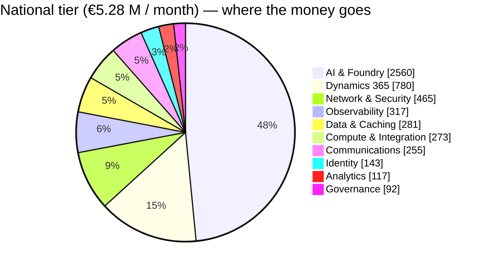

<div align="center">

# 💶 UDCSP — Cost to Run

### *What the platform costs at rest, and what it costs at national scale*

*A non-technical, FinOps view of the run-rate — what is a fixed platform floor, what scales with citizens, and why the cost per citizen falls sharply as the platform grows.*

[](#)
[](#)
[](#)
[](#)

[](#)
[](#)
[](#)
[](#)

</div>

---

> [!IMPORTANT]
> **TL;DR.** UDCSP is not one platform — it is **three sovereign platforms, one per country, each in a different Azure region**, and the region changes the price. Denmark runs in **North Europe** (the lowest-priced EU region — our baseline), Sweden in **Sweden Central** (≈ +8 % on Azure infrastructure), and Norway in **Norway East** (≈ +20 % — a premium region). Each country also has a different population, so each carries its own bill. **Not every inhabitant uses the platform**: we size the infrastructure for the full population but pay for the **active** citizens, and we model adoption that ramps to **≈ 80 %** at maturity (§2.1). Every zone has a **fixed platform floor** (the always-on cost of a private, regulated zone) and a **variable layer** that grows with citizen activity (AI capacity, caseworker licences, communications, telemetry). At a small pilot the floor dominates, so each citizen looks "expensive" (**≈ €24 / citizen / year**). At full national scale — **up to 22.3 million addressable citizens across the three countries** — that floor is amortised and the unit cost collapses to **≈ €2.8 / citizen / year**, an **≈ 8× improvement**. The two biggest lines stay **reserved AI capacity (PTU)** and **Dynamics 365 caseworker licences**; the most region-sensitive lines are the Azure-infrastructure ones — which is why **Norway is the most expensive country per citizen** despite the smallest population.
>
> **By rollout phase** (combined, all three countries, at the full-addressable ceiling):
>
> | Tier | Citizens | Azure footprint | Run-rate / month | Run-rate / year | Per citizen / year |
> |---|--:|---|--:|--:|--:|
> | 🟢 **Pilot** | 30 000 | one small zone each | **≈ €60 k** | ≈ €0.72 M | **≈ €24** |
> | 🟡 **Regional** | 300 000 | three zones | **≈ €144 k** | ≈ €1.73 M | **≈ €5.8** |
> | 🔵 **National (ceiling)** | 22 300 000 | NE + Sweden C + Norway East | **≈ €5.28 M** | ≈ €63.4 M | **≈ €2.84** |
>
> **Over time** — adoption ramps, so the bill ramps with it (population fixed at 22.3 M, §5):
>
> | Year | Adoption | Registered | Run-rate / year | Per citizen / year |
> |---|:-:|--:|--:|--:|
> | **Year 1** | 15 % | 3.3 M | ≈ €28.8 M | ≈ €8.6 |
> | **Year 3** | 45 % | 10.0 M | ≈ €41.0 M | ≈ €4.1 |
> | **Year 8** | 80 % | 17.8 M | ≈ €55.2 M | ≈ €3.1 |
>
> **At national scale, by country** (the region premium is the story):
>
> | Country | Population | Azure region | Price index | Run-rate / month | Per citizen / year |
> |---|--:|---|:-:|--:|--:|
> | 🇩🇰 **Denmark** | 6.0 M | North Europe | **1.00** | ≈ €1.34 M | **≈ €2.69** |
> | 🇸🇪 **Sweden** | 10.7 M | Sweden Central | **1.08** | ≈ €2.52 M | **≈ €2.83** |
> | 🇳🇴 **Norway** | 5.6 M | Norway East | **1.20** | ≈ €1.42 M | **≈ €3.04** |
> | **Combined** | **22.3 M** | three regions | — | **≈ €5.28 M** | **≈ €2.84** |
>
> *All figures are **indicative list prices** (EUR, 2026), before Microsoft Customer Agreement discounts, Azure Reservations and Savings Plans — which typically remove a further **30–40 %** from the compute and AI lines. The **price index** is the indicative Azure-infrastructure premium of each region relative to North Europe. "Citizens" at national scale is the **addressable population (ceiling)**; the realistic steady state is ≈ 80 % adoption (≈ 17.8 M). This is a **run-rate** (steady-state operating cost); one-time build, migration and certification costs are out of scope (see §10).*

---

## 📑 Table of contents

1. [How to read this document](#1-how-to-read-this-document)
2. [The activity model — from citizens to load](#2-the-activity-model--from-citizens-to-load)
3. [Where the cost comes from — the ten cost centres](#3-where-the-cost-comes-from--the-ten-cost-centres)
4. [Per-country cost — why the Azure region matters](#4-per-country-cost--why-the-azure-region-matters)
5. [Cost at three scales](#5-cost-at-three-scales) · [Cost over time — the adoption ramp](#cost-over-time--the-adoption-ramp)
6. [Fixed floor vs variable layer](#6-fixed-floor-vs-variable-layer)
7. [How each service scales — the cost shape per service](#7-how-each-service-scales--the-cost-shape-per-service)
8. [Why unit cost falls — economies of scale](#8-why-unit-cost-falls--economies-of-scale)
9. [The levers — how we keep the bill down](#9-the-levers--how-we-keep-the-bill-down)
10. [What this estimate does NOT include](#10-what-this-estimate-does-not-include)
11. [Worked calculations — how each number is built](#11-worked-calculations--how-each-number-is-built)
12. [Assumptions register](#12-assumptions-register)

---

## 1. How to read this document

This is a **business** estimate, not a billing quote. It answers three executive questions:

- **"What does it cost to keep the lights on?"** — the fixed platform floor (§6).
- **"What happens to the bill when usage grows?"** — the scale table (§5) and the per-country table (§4).
- **"Is it efficient?"** — the per-citizen unit cost and the levers that drive it down (§8, §9).

Three deployment tiers anchor the estimate. They are not three different products — they are **the same platform** sized for three population bands. At national scale the bands are the **real populations** of each country, in each country's own Azure region (§4):

| Tier | Citizens (DK + SE + NO) | Monthly active citizens (MAU, ≈ 40 %) | Peak concurrent sessions |
|---|--:|--:|--:|
| 🟢 **Pilot** | 30 000 | ≈ 12 000 | ≈ 240 |
| 🟡 **Regional** | 300 000 | ≈ 120 000 | ≈ 2 400 |
| 🔵 **National** | 22 300 000 | ≈ 8.92 M | ≈ 178 000 |

> **Why MAU and concurrency matter more than "registered users".** You do not pay for a citizen who never logs in. The cost drivers are **monthly active citizens** (identity, AI, communications) and **peak concurrency** (how much capacity you must reserve). We assume 40 % of registered citizens are active in a given month, and that peak concurrency is ≈ 2 % of MAU — both conservative for digital government.

---

## 2. The activity model — from citizens to load

### 2.1 From population to registered citizens — the adoption rate

**Not every inhabitant uses the platform.** A digital-government portal is adopted gradually, and even at maturity it does not reach 100 % of the population (children, the digitally excluded, people who still prefer a counter). We therefore separate three numbers:

1. **Addressable population** — everyone in the country (DK 6.0 M · SE 10.7 M · NO 5.6 M = 22.3 M).
2. **Registered citizens** = population × **adoption rate**. We model a realistic ramp that reaches **≈ 80 %** at maturity (the Nordics are high-trust, high-adoption — Denmark's MitID / borger.dk already reaches the large majority of adults).
3. **Monthly active citizens (MAU)** = registered × **40 %** — the people who actually log in in a given month, and the real cost driver.

> So the platform is **sized for the full population** (the infrastructure ceiling, §4–§6) but **paid for the active citizens** (the variable layer). The full-addressable, ~100 %-adoption figures in §4–§6 are the **planning ceiling**; §5 then shows the **realistic year-by-year ramp** toward ~80 % adoption.

### 2.2 From an active citizen to a monthly load

Cost follows behaviour. The estimate turns "an active citizen" into a measurable monthly load using one transparent set of per-active-citizen assumptions:

| Activity | Per active citizen / month | What it drives | Cost centre |
|---|--:|---|---|
| 💬 AI assistant conversations | 0.8 (≈ 6 turns each) | Token + reserved AI capacity | AI & Foundry |
| 📞 Voice (PSTN) calls | 0.06 (≈ 4 min) | Realtime AI capacity + telephony | AI, Communications |
| 📲 SMS (status + OTP) | 0.6 | Per-message telephony | Communications |
| 📧 Email (notifications) | 1.0 | Per-message + storage | Communications |
| 🧾 Eligibility assessments | 0.15 | Strong-model + Confidential Compute | AI & Foundry |
| 📄 Documents extracted | 0.30 | Small-model + Document Intelligence | AI & Foundry |
| 🧑‍💼 Escalations to a caseworker | ≈ 4 % of conversations | D365 licences + Dataverse | Dynamics 365 |

At the **full-addressable ceiling** (22.3 M registered, 8.92 M MAU) the monthly load is:

| Load (per month) | 🟢 Pilot | 🟡 Regional | 🔵 National (ceiling) |
|---|--:|--:|--:|
| AI conversation **turns** | ≈ 58 k | ≈ 0.58 M | ≈ 42.8 M |
| Voice **minutes** | ≈ 2.9 k | ≈ 29 k | ≈ 2.14 M |
| SMS sent | ≈ 7 k | ≈ 72 k | ≈ 5.35 M |
| Eligibility assessments | ≈ 1.8 k | ≈ 18 k | ≈ 1.34 M |
| Caseworkers needed (with multilingual + shift cover) | ≈ 20 | ≈ 150 | ≈ 7 400 |

The **AI brain** keeps cost flat per turn by routing cheap work to a small model. Only the assistant, eligibility, translation and caseworker-helper run on the **strong** model; the topic-router, classifier and document-extractor run on **`gpt-5.4-mini`**, which is roughly an order of magnitude cheaper per token (see [`ai.md`](./ai.md) §13).

---

## 3. Where the cost comes from — the ten cost centres

Every deployed service maps to one of ten cost centres. The table names the **real services** in the repository (`infra/`, `services/`, `apps/`) so each line is auditable.

| # | Cost centre | What is inside | Scales with |
|:-:|---|---|---|
| 1 | 🧠 **AI & Foundry** | Azure AI Foundry (3 hubs) · Azure OpenAI **PTU** pools for `gpt-5.4` (assistant, eligibility, translator, caseworker-helper) and `gpt-realtime` (voice) · pay-as-you-go `gpt-5.4-mini` (router, classifier, doc-extractor) · Content Safety · Document Intelligence | Peak concurrency + turns |
| 2 | 🧑‍💼 **Dynamics 365 & Power Platform** | D365 Customer Service Enterprise · Copilot for Service · Dataverse capacity · model-driven caseworker Power App | Caseworker headcount |
| 3 | 🛡️ **Network & Security** | Front Door Premium + WAF · Azure Firewall Premium (1 / zone) · DDoS Protection Standard · Bastion Standard · Defender for Cloud · Sentinel · Entra Permissions Management (CIEM) | Floor + resource count |
| 4 | ⚙️ **Compute & Integration** | API Management Premium (VNet, multi-region) · Logic Apps Standard · Azure Functions · Confidential Compute (eligibility enclave) | Floor + throughput |
| 5 | 🗄️ **Data & Caching** | PostgreSQL Flexible (HA / zone) · Redis Enterprise · ADLS / Blob storage · Confidential Ledger | Data volume |
| 6 | 🔭 **Observability** | Log Analytics + Application Insights ingestion (3 zones) | Telemetry volume |
| 7 | 📡 **Communications** | Azure Communication Services — PSTN voice, SMS, email + phone-number rental | Messages + minutes |
| 8 | 📊 **Analytics** | Microsoft Fabric capacity (F-SKU) · Power BI Premium semantic models (internal) | Data + report users |
| 9 | 🪪 **Identity** | Entra External ID (per-country, MAU-billed) · Entra ID P2 (workforce) · Verified ID | MAU + workforce |
| 10 | 📒 **Governance** | Microsoft Purview · Microsoft Priva (DSR + privacy risk) | Catalogue + subjects |

---

## 4. Per-country cost — why the Azure region matters

UDCSP is deployed as **three independent sovereign zones**, each pinned to the Azure region that keeps that country's data at home. Azure list prices are **not identical in every region**, so the same workload costs a different amount in each country. North Europe (Ireland) is one of the lowest-priced EU regions and is our **baseline (index 1.00)**; Sweden Central runs a few points above it; Norway East is a recognised **premium region**.

| Country | Population | Sovereign Azure region | Why this region | Infra price index |
|---|--:|---|---|:-:|
| 🇩🇰 Denmark | 6.0 M | **North Europe** (Ireland) | No in-country Azure region yet — North Europe is the nearest EU-sovereign, lowest-priced option | **1.00** (baseline) |
| 🇸🇪 Sweden | 10.7 M | **Sweden Central** | In-country region; also hosts the shared `gpt-realtime` voice model (only Nordic region with realtime quota) | **≈ 1.08** |
| 🇳🇴 Norway | 5.6 M | **Norway East** (Oslo) | In-country region; ACS voice media pinned here for sovereignty | **≈ 1.20** |

> The price index applies to the **Azure-infrastructure** lines (compute, network, data, observability, AI hubs, analytics, governance — ≈ 65 % of the bill). The **SaaS / licence** lines are region-neutral: Dynamics 365 caseworker licences and Entra External ID MAU are priced per-user across the EU, not per-region. Telephony (SMS / PSTN) follows each country's A2P rate.

Applying each country's population and region index gives the **national run-rate per country** (at the full-addressable ceiling — the realistic adoption ramp is in §5):

| Country | MAU at ceiling | Fixed floor / mo | Variable / mo | Run-rate / mo | Run-rate / yr | Per citizen / yr |
|---|--:|--:|--:|--:|--:|--:|
| 🇩🇰 Denmark | 2.40 M | ≈ €0.56 M | ≈ €0.78 M | **≈ €1.34 M** | ≈ €16.1 M | **≈ €2.69** |
| 🇸🇪 Sweden | 4.28 M | ≈ €0.72 M | ≈ €1.80 M | **≈ €2.52 M** | ≈ €30.2 M | **≈ €2.83** |
| 🇳🇴 Norway | 2.24 M | ≈ €0.61 M | ≈ €0.81 M | **≈ €1.42 M** | ≈ €17.0 M | **≈ €3.04** |
| **Combined** | **8.92 M** | **≈ €1.89 M** | **≈ €3.39 M** | **≈ €5.28 M** | **≈ €63.4 M** | **≈ €2.84** |

```text
Per citizen / year (EUR) — the Norway East premium is visible

🇩🇰 Denmark   North Europe    ██████████████████████        ≈ €2.69
🇸🇪 Sweden    Sweden Central  ███████████████████████       ≈ €2.83
🇳🇴 Norway    Norway East     ██████████████████████████    ≈ €3.04
```

**The story.** Norway is the **most expensive country per citizen** (≈ €3.04) for two compounding reasons: Norway East carries the highest regional price index (≈ +20 % on infrastructure), **and** Norway has the smallest population, so its fixed floor is spread over the fewest people. Denmark is the **cheapest** (≈ €2.69) — the lowest-priced region (North Europe) with a mid-sized population. Sweden sits between (≈ €2.83): the Sweden Central premium is offset by the best floor-amortisation of the three (10.7 M citizens). **You do not engineer this away — you plan for it**, and you keep cross-border egress near-zero so no country subsidises another (see §10).

---

## 5. Cost at three scales

Indicative **monthly** run-rate by cost centre (EUR, list price, rounded). The arithmetic behind each line is the activity model in §2 applied to the unit prices in §11. The **National** column is the combined three-country total at real populations (22.3 M citizens), region-adjusted per §4.

| Cost centre | 🟢 Pilot | 🟡 Regional | 🔵 National |
|---|--:|--:|--:|
| 🧠 AI & Foundry | 23 500 | 59 700 | 2 560 000 |
| 🧑‍💼 Dynamics 365 & Power Platform | 2 400 | 16 250 | 780 000 |
| 🛡️ Network & Security | 12 700 | 22 500 | 465 000 |
| ⚙️ Compute & Integration | 10 400 | 12 900 | 273 000 |
| 🗄️ Data & Caching | 3 750 | 8 700 | 281 000 |
| 🔭 Observability | 2 500 | 8 000 | 317 000 |
| 📡 Communications | 900 | 4 840 | 255 000 |
| 📊 Analytics | 1 900 | 4 250 | 117 000 |
| 🪪 Identity | 270 | 2 200 | 143 000 |
| 📒 Governance | 2 000 | 4 500 | 92 000 |
| **Total / month** | **≈ €60 k** | **≈ €144 k** | **≈ €5.28 M** |
| **Total / year** | **≈ €0.72 M** | **≈ €1.73 M** | **≈ €63.4 M** |
| **Per citizen / year** | **≈ €24** | **≈ €5.8** | **≈ €2.84** |
| **Per active citizen / month** | **≈ €5.0** | **≈ €1.20** | **≈ €0.59** |

```text
Cost per citizen per year (EUR) — falls as the platform scales

Pilot      30k   ████████████████████████  ≈ €24
Regional  300k   ██████                     ≈ €5.8
National 22.3M   ███                        ≈ €2.84
```

### Cost over time — the adoption ramp

The "National" column above is the **planning ceiling** (≈ 100 % adoption). In reality adoption **ramps over years**, so the bill ramps too. Holding the population fixed at 22.3 M and growing the **adoption rate** (§2.1) gives the realistic trajectory the budget should plan for:

| Year | Adoption | Registered citizens | MAU (40 %) | Run-rate / month | Run-rate / year | Per citizen / year |
|---|:-:|--:|--:|--:|--:|--:|
| **Year 1** | 15 % | 3.3 M | 1.34 M | ≈ €2.4 M | ≈ €28.8 M | ≈ €8.6 |
| **Year 2** | 30 % | 6.7 M | 2.68 M | ≈ €2.9 M | ≈ €34.9 M | ≈ €5.2 |
| **Year 3** | 45 % | 10.0 M | 4.01 M | ≈ €3.4 M | ≈ €41.0 M | ≈ €4.1 |
| **Year 5** | 65 % | 14.5 M | 5.80 M | ≈ €4.1 M | ≈ €49.1 M | ≈ €3.4 |
| **Year 8** | 80 % | 17.8 M | 7.14 M | ≈ €4.6 M | ≈ €55.2 M | ≈ €3.1 |
| *Ceiling* | *100 %* | *22.3 M* | *8.92 M* | *≈ €5.28 M* | *≈ €63.4 M* | *≈ €2.84* |

```text
Run-rate per year (EUR M) — the bill grows far slower than the citizen base

Y1  15%   ██████████                  ≈ €28.8 M   (3.3 M citizens)
Y2  30%   ████████████                ≈ €34.9 M   (6.7 M)
Y3  45%   ██████████████              ≈ €41.0 M   (10.0 M)
Y5  65%   █████████████████           ≈ €49.1 M   (14.5 M)
Y8  80%   ███████████████████         ≈ €55.2 M   (17.8 M)
```

**The shape that matters.** Citizens grow **×5.3** from Year 1 to Year 8 (3.3 M → 17.8 M) while the bill grows only **×1.9** (€28.8 M → €55.2 M) — because the always-on **fixed floor (≈ €1.9 M / month)** is provisioned once for national-grade and then amortised over an ever-larger active base. Per-citizen cost therefore **falls from ≈ €8.6 to ≈ €3.1 / year** as the platform matures. (Per-registered-citizen stays slightly above the €2.84 ceiling at 80 % adoption, because the floor is shared among fewer people than the theoretical maximum — more adoption is always cheaper per head.)

---

## 6. Fixed floor vs variable layer

Not every euro behaves the same way. Some cost is **fixed** — you pay it whether one citizen logs in or millions do, because it is the price of running three sovereign, private, regulated zones provisioned for national-grade. The rest is **variable** — it tracks active usage (MAU).

| Behaviour | What is in it | 🟢 Pilot | 🔵 National (ceiling) |
|---|---|--:|--:|
| 🧱 **Fixed platform floor** | National-grade gateway, firewalls, DDoS, Bastion, base AI (PTU) reservation, HA data tier, Fabric capacity, governance | ≈ €45 k / mo | ≈ €1.9 M / mo |
| 📈 **Variable with usage (MAU)** | AI tokens & burst PTU, caseworker licences, communications, telemetry ingestion, External-ID MAU | ≈ €15 k / mo | ≈ €3.4 M / mo |

> The fixed floor is what makes the adoption ramp (§5) so favourable: it is paid up-front for national-grade capacity, so every new active citizen only adds **variable** cost (≈ €0.38 / active / month), not floor.



The story the chart tells: at national scale the bill is dominated by **reserved AI capacity** and **caseworker licences** — both of which are *value* lines (they are the citizen assistant and the humans who keep the AI accountable), not waste. Everything else is a thin, well-controlled tail.

---

## 7. How each service scales — the cost shape per service

Two platforms can land on the **same** total at the ceiling yet cost very different amounts on the way there, because **services do not all scale the same way with users**. Some are billed per message or per token (they track active citizens almost exactly); some are reserved in blocks sized to peak; some are bought in discrete SKU steps; and some are a flat, national-grade floor you pay from day one. Knowing the **shape** of each line is what makes the year-by-year ramp (§5) predictable — and tells you where the levers (§9) actually bite.

### 7.1 The five scaling shapes

| Shape | Behaviour as MAU grows | Main services | Why it behaves this way |
|---|---|---|---|
| 📈 **Linear (metered)** | Cost ∝ MAU — a straight line through ≈ 0 | ACS **SMS / voice / email**, Content Safety, Document Intelligence, `gpt-5.4-mini` pay-as-you-go, External ID MAU | Billed per unit consumed — every extra active citizen adds a fixed marginal cost |
| 🧱 **Block-reserved** | High fixed base, then steps up in chunks | AI **PTU pools** (`gpt-5.4`, `gpt-realtime`) | Provisioned Throughput is reserved to **peak concurrency** (≈ 2 % of MAU) for latency + price |
| 🪜 **Stepped (SKU / scale-unit)** | Flat inside a tier, jumps at thresholds | **API Management** units, **Microsoft Fabric** F-SKU, PostgreSQL / Redis SKUs, Firewall instances | Capacity is bought in discrete units, not per request |
| 👤 **Headcount-linear** | Tracks people; slightly sub-linear (AI deflection improves) | **Dynamics 365** caseworker licences | 1 caseworker ≈ 1 200 active citizens **after** AI deflection |
| ⬛ **Flat floor** | Same bill at 1 M or 9 M MAU | Front Door, **Azure Firewall**, DDoS, Bastion, Foundry hubs, Purview | National-grade is provisioned once per sovereign zone |

### 7.2 The main services, year by year

Monthly run-rate by cost centre (€ thousands, **National**, list price) as adoption ramps from Year 1 to the ceiling. The monthly-active base (MAU) grows **×6.7** over the period — watch how differently each line responds:

| Cost centre — main services | Shape | Y1 · 1.34 M | Y3 · 4.01 M | Y5 · 5.80 M | Y8 · 7.14 M | Ceiling · 8.92 M | Y1 → ceiling |
|---|:-:|--:|--:|--:|--:|--:|:-:|
| 🧠 **AI & Foundry** — PTU pools | 🧱 block | 979 | 1 536 | 1 909 | 2 189 | 2 560 | **×2.6** |
| 🧑‍💼 **Dynamics 365** — caseworker licences | 👤 headcount | 143 | 367 | 518 | 630 | 780 | **×5.5** |
| 📡 **Communications** — ACS SMS / voice / email | 📈 linear | 43 | 117 | 168 | 205 | 255 | **×5.9** |
| 🔭 **Observability** — Log Analytics / App Insights | 📈 linear | 99 | 176 | 227 | 266 | 317 | **×3.2** |
| 🛡️ **Network & Security** — FW · DDoS · Front Door | ⬛ flat | 427 | 440 | 449 | 456 | 465 | **×1.1** |
| 🗄️ **Data & Caching** — PostgreSQL · Redis | 🪜 stepped | 221 | 242 | 256 | 267 | 281 | **×1.3** |
| ⚙️ **Compute & Integration** — APIM · Logic Apps · Functions | 🪜 stepped | 211 | 233 | 248 | 258 | 273 | **×1.3** |
| 📊 **Analytics** — Microsoft Fabric F-SKU | 🪜 stepped | 103 | 108 | 111 | 114 | 117 | **×1.1** |
| 🪪 **Identity** — External ID · Entra P2 | 📈 / ⬛ mixed | 115 | 125 | 131 | 136 | 143 | **×1.2** |
| 📒 **Governance** — Purview · Priva | ⬛ flat | 82 | 85 | 87 | 90 | 92 | **×1.1** |
| **Total / month** | | **≈ 2 420** | **≈ 3 430** | **≈ 4 110** | **≈ 4 610** | **≈ 5 280** | **×2.2** |

> Read it as **three families.** The **user-metered** lines (Communications, Dynamics 365, Observability) grow almost in step with citizens — **×3 to ×6**. The **AI PTU** line grows only **×2.6** despite ×6.7 more users, because the mini-first router keeps cheap turns on the small model and the reserved base is national-grade from day one. The **stepped and flat** infrastructure (Network, Data, Compute, Analytics, Governance) barely moves — **×1.1 to ×1.3** — it is provisioned for the ceiling up front and only nudges up in SKU steps. *(Per-year totals reconcile with the adoption ramp in §5; full unit prices in §11.)*

### 7.3 The services you asked about — APIM, Logic Apps, and the reserved lines

- **API Management (Premium)** — *stepped.* Capacity is bought in **scale units**; each unit adds a fixed throughput envelope and one more gateway instance (for VNet / multi-region). The bill is **flat between thresholds** and jumps only when sustained peak requests-per-second crosses a unit boundary. Regional → National adds **a handful of units across three regions**, not a MAU-proportional amount — so APIM grows ≈ ×1.3, not ×6.7.
- **Logic Apps (Standard)** — *fixed floor + thin marginal.* Production runs on a reserved **Workflow Standard plan** (vCore + memory) that hosts the orchestration workflows; extra executions are near-free until the plan saturates, then you add another plan — a small step. Non-production uses **Consumption** (per-action, scales to zero). Net: Logic Apps is mostly **flat** with occasional steps.
- **AI PTU pools** — *block-reserved.* Provisioned Throughput is reserved in **blocks sized to peak concurrency** (≈ 2 % of MAU), with a national-grade base kept always-on for a latency promise. It is cheaper per token than pay-as-you-go at scale, and the **mini-first router** means most added users hit the cheap model — which is why AI grows ×2.6, not ×6.7.
- **Azure Communications Services** — *pure linear.* Every SMS, email and voice-minute is metered, so this line tracks MAU almost exactly (×5.9). The **push-before-SMS** lever (§9) is what bends its slope.
- **Microsoft Fabric** — *stepped.* One reserved **F-SKU** per tier (F16 → F32 → F256), sized to refresh and query load, not to MAU — flat within a tier.
- **Entra External ID** — *linear, but free at the start.* The first **50 000 active / tenant are free**, so at pilot the citizen-identity line is ≈ €0; at national it is a thin linear line. The larger, near-fixed part is the **workforce** Entra ID P2 licences securing caseworkers and staff.

### 7.4 What this means for the budget

```text
Growth Y1 → ceiling as the active base (MAU) goes ×6.7

  Communications   ▁▂▃▅▇   ×5.9   linear        — metered per message
  Dynamics 365     ▁▂▃▅▇   ×5.5   headcount      — per caseworker
  Observability    ▁▂▃▄▆   ×3.2   linear        — telemetry per MAU
  AI & Foundry     ▄▅▅▆▇   ×2.6   block-reserved — PTU sized to peak
  Compute & Data   ▆▆▆▇▇   ×1.3   stepped        — APIM · Logic Apps · SKUs
  Network & Sec    ▇▇▇▇▇   ×1.1   flat           — firewalls · DDoS · Front Door
```

Only the **user-metered family** — AI-variable + Dynamics 365 + Communications + Observability + External ID — actually scales with citizens; together that is **≈ €3.4 M of the €5.28 M ceiling**. The other **≈ €1.9 M is the fixed / stepped floor**, provisioned once for national-grade (§6). That split is exactly why the ramp is gentle: **one extra active citizen adds ≈ €0.38 / month of metered cost and €0 of floor.** It also tells you where to aim the levers (§9): **reserve** the block lines (PTU, Fabric, PostgreSQL), **bend** the linear lines (push-before-SMS, mini-first routing), and **never over-build** the flat floor.

---

## 8. Why unit cost falls — economies of scale

The headline is the slope, not the absolute number. From pilot to national the platform serves **≈ 740× more citizens** but the bill grows only **≈ 88×** — because the fixed floor is paid once and then amortised.

| Metric | 🟢 Pilot | 🟡 Regional | 🔵 National | Pilot → National |
|---|--:|--:|--:|:-:|
| Citizens served | 30 000 | 300 000 | 22 300 000 | **×743** |
| Run-rate / year | €0.72 M | €1.73 M | €63.4 M | **×88** |
| **Per citizen / year** | €24 | €5.8 | €2.84 | **÷8.5** |

This is the answer to *"can a citizen platform be affordable?"* — **yes, if it is built once and scaled, not rebuilt per service.** The same three sovereign zones, the same AI brain, the same gateway carry the 47 services the case study targets and the hundreds a national rollout would add (see the *Scaling to thousands of services* slides and [`architecture.md`](../tech/architecture.md)).

---

## 9. The levers — how we keep the bill down

The estimate above is **list price with no optimisation**. Each lever below is already designed into the platform (`architecture.md` §11.6 FinOps, `ai.md` §13):

| 🎚️ Lever | What it does | Typical saving |
|---|---|--:|
| 🏷️ **Reservations & Savings Plans** | 1- or 3-year commitment on PTU, App Service, PostgreSQL, Fabric | **−30 % to −40 %** on those lines |
| 🧠 **Model routing (mini-first)** | Cheap `gpt-5.4-mini` handles routing/classification/extraction; the strong model is reserved for reasoning | ≈ 10× cheaper per routed token |
| 📐 **PTU right-sizing to peak** | Reserve AI capacity to *peak concurrency*, autoscale pay-as-you-go for spikes only | Avoids over-provisioning the 98 % off-peak |
| 📲 **Push & email before SMS** | SMS is the most usage-sensitive line; prefer in-app push and email, keep SMS for OTP/critical | Can halve the Communications line |
| 🔭 **Telemetry sampling & tiering** | Adaptive sampling in App Insights, basic-tier logs, archive to cheap storage | −40 % to −60 % on Observability at scale |
| 📊 **Fabric capacity right-sizing** | One F-SKU sized per tier (F16 → F32 → F256), pause dev capacities | Match analytics spend to refresh load |
| 🧰 **Dev/test scales to zero** | Logic Apps Consumption + serverless in non-prod; PTU only in prod | Non-prod ≈ a fraction of prod |
| 🏷️ **Tag-enforced showback** | Every resource tagged `country` / `workload` / `cost-center`; the build **fails** if an agent exceeds its token budget | Stops cost drift before it ships |

> Applied together, these levers realistically take the **National** run-rate from the **≈ €63.4 M / year** list figure toward **≈ €40–46 M / year** committed — without changing a line of citizen-facing behaviour.

---

## 10. What this estimate does NOT include

To stay honest, the run-rate **excludes** the following — they are real, but they are not monthly platform-operation cost:

- **One-time build & migration** — the engineering already done (see *built by an agent swarm*), plus integration with each national authority's legacy registers (the adapters in [`architecture.md`](../tech/architecture.md) §2.3).
- **Microsoft licensing baselines** not driven by citizens — e.g. workforce Microsoft 365, Power Platform per-app fall-backs in degraded mode.
- **Support plan** — Microsoft Unified support is typically a percentage of annual Azure consumption.
- **Data egress between continents** — by design, raw data never leaves its country, so cross-border egress is intentionally near-zero; only aggregated server-side semantic models cross for the executive view.
- **Certification & audit** — EU AI Act conformity assessment, third-party WCAG and penetration testing, ISO 27001 / SOC 2 audit fees.
- **FX and price drift** — Azure list prices move; treat every figure as ± a band, not a quote.

---

## 11. Worked calculations — how each number is built

Every figure in §5 is reproducible. This section shows the **arithmetic**, worked at **National** scale (the other two tiers use the same formulas with their own monthly-active count; the per-country split in §4 applies each region's price index to the Azure-infrastructure share). Prices are the indicative list values in §12.

### 11.1 From citizens to monthly load

The whole estimate starts from one chain — registered citizens become activity:

| Step | Formula | National |
|---|---|--:|
| Registered citizens | 6.0 M (DK) + 10.7 M (SE) + 5.6 M (NO) | 22 300 000 |
| Monthly active (MAU) | registered × 40 % | 8 920 000 |
| Peak concurrent sessions | MAU × 2 % | 178 400 |
| AI conversations / month | MAU × 0.8 | 7 136 000 |
| AI **turns** / month | conversations × 6 | 42 816 000 |
| Voice minutes / month | MAU × 0.06 call × 4 min | 2 140 800 |
| SMS / month | MAU × 0.6 | 5 352 000 |
| Email / month | MAU × 1.0 | 8 920 000 |
| Eligibility assessments / month | MAU × 0.15 | 1 338 000 |
| Documents extracted / month | MAU × 0.30 | 2 676 000 |
| Caseworker escalations / month | conversations × 4 % | 285 440 |

> For **Pilot** and **Regional**, swap the 8 920 000 MAU for **12 000** and **120 000** and every line scales linearly — only the fixed-floor centres (§11.6) stay flat.

### 11.2 AI & Foundry — €2.56 M / month (the biggest line)

Reserved **PTU** (Provisioned Throughput Units) are sized to sustain **peak** token throughput, not the average. The line is the sum of five priced parts plus the hub baseline:

| Component | Basis | Monthly |
|---|---|--:|
| `gpt-5.4` PTU pool (assistant · eligibility · translator · caseworker-helper) | ≈ 6 600 PTU × €260 | €1 716 000 |
| `gpt-realtime` PTU pool (voice, centralised in Sweden Central) | ≈ 1 450 PTU × €260 | €377 000 |
| `gpt-5.4-mini` pay-as-you-go (router · classifier · doc-extractor) | ≈ 42.8 M routed turns + 2.68 M extractions | €290 000 |
| Document Intelligence | 2 676 000 docs × ≈ 3 pages × €0.01 | €80 000 |
| Content Safety | 42.8 M turns checked in + out ÷ 1 000 × €0.70 | €60 000 |
| Azure AI Foundry hubs & endpoints (3 hubs, national-grade) | fixed baseline | €37 000 |
| **Sub-total** | | **≈ €2 560 000** |

> **Why reserved PTU and not pay-as-you-go for the strong model?** At peak concurrency a reserved pool is cheaper per token *and* gives a predictable latency promise. Pay-as-you-go is kept only for the cheap **mini** model and for short spikes — that is the *model-routing* lever in §9.

### 11.3 Dynamics 365 — €780 k / month (driven by people, not tokens)

Caseworker headcount ≈ active citizens ÷ 1 200 (after AI deflection), then add multilingual and 24/7 shift cover. Cost = licences + Dataverse capacity:

| Tier | Caseworkers | × €95 licence | + Dataverse | = Line |
|---|--:|--:|--:|--:|
| 🟢 Pilot | 20 | €1 900 | €500 | **€2 400** |
| 🟡 Regional | 150 | €14 250 | €2 000 | **€16 250** |
| 🔵 National | 7 400 | €703 000 | €77 000 | **€780 000** |

This is the second-largest national line **by design** — it is the human accountability layer behind every AI decision, not overhead. It is also **region-neutral**: D365 licences are priced per-user across the EU, so this line is the same euro in Denmark, Sweden or Norway (§4).

### 11.4 Communications — €255 k / month (the usage-sensitive line)

| Channel | Volume / month | × Unit | Monthly |
|---|--:|--:|--:|
| SMS (after push / email deflection) | ≈ 5 200 000 | €0.045 | €234 000 |
| Voice (PSTN inbound) | 2 140 800 min | €0.0075 | €16 050 |
| Email | 8 920 000 | ≈ €0.0003 | €2 680 |
| Phone numbers & misc | — | — | ≈ €2 270 |
| **Sub-total** | | | **≈ €255 000** |

**SMS is ≈ 90 %** of this centre — exactly why the platform prefers in-app push and email and keeps SMS for one-time codes and critical alerts (lever §9). Telephony also follows each country's A2P rate, so it is one of the lines that varies slightly by country.

### 11.5 Identity — €143 k / month (mostly workforce, not citizens)

| Component | Basis | Monthly |
|---|---|--:|
| Entra External ID (citizens) | (8.92 M MAU − 150 k free across 3 countries) × €0.003 | €26 300 |
| Entra ID P2 (workforce) | ≈ 9 000 staff × €8.74 | €78 700 |
| Verified ID issuance | per credential | ≈ €38 000 |
| **Sub-total** | | **≈ €143 000** |

Citizens are nearly free — the first **50 000 active per country cost nothing**. The spend is the workforce identities securing the ≈ 7 400 caseworkers and supporting staff.

### 11.6 The fixed-floor centres — basis at a glance

The remaining centres are mostly **platform floor**: paid whether 30 000 or 22 300 000 citizens log in, scaled to national-grade SKUs across three regions. Each line is the sum of the named services in §3:

| Cost centre | National basis (summary) | Monthly |
|---|---|--:|
| 🛡️ Network & Security | Front Door + WAF · 3× Firewall Premium · DDoS · Bastion · Defender · Sentinel · CIEM | €465 000 |
| ⚙️ Compute & Integration | APIM Premium (multi-region units) · Logic Apps Standard · Functions · Confidential Compute enclave | €273 000 |
| 🗄️ Data & Caching | 3× PostgreSQL HA · 3× Redis Enterprise · ADLS/Blob · Confidential Ledger | €281 000 |
| 🔭 Observability | Log Analytics + App Insights ingestion (3 zones, sampled) | €317 000 |
| 📊 Analytics | Fabric F256 + Power BI semantic models | €117 000 |
| 📒 Governance | Purview catalogue + Priva DSR / subjects | €92 000 |

These six are the lines the **regional price index** in §4 bites hardest on: they sit in each country's own region, so Norway East's ≈ +20 % premium lands here, not on the region-neutral licence lines.

### 11.7 Roll-up check

Add the ten centres (€ thousands / month):

```text
2560  AI & Foundry
 780  Dynamics 365
 465  Network & Security
 317  Observability
 281  Data & Caching
 273  Compute & Integration
 255  Communications
 143  Identity
 117  Analytics
  92  Governance
─────
5283  €/month  →  ×12 = €63.4 M / year  →  ÷ 22 300 000 citizens = €2.84 / citizen / year
```

The same arithmetic at the Pilot's 12 000 MAU gives **≈ €60 k / month** and **≈ €24 / citizen / year** — the fixed floor (≈ €45 k) dominates when the citizen base is small, which is the entire economies-of-scale story in §8.

---

## 12. Assumptions register

Every number above is reproducible from these inputs. Prices are **indicative list, EUR, 2026**, in each country's deployment region.

| Assumption | Value | Note |
|---|--:|---|
| Addressable population | DK 6.0 M · SE 10.7 M · NO 5.6 M = 22.3 M | Basis of the national ceiling |
| Adoption rate (registered ÷ population) | 15 % → 30 % → 45 % → 65 % → 80 % (Y1→Y8) | Ramps to ≈ 80 % at maturity (§2.1, §5) |
| Active share of registered citizens (MAU) | 40 % | Conservative for digital government |
| Peak concurrency | 2 % of MAU | Drives reserved capacity |
| Regional Azure-infra price index | DK 1.00 · SE ≈ 1.08 · NO ≈ 1.20 | Relative to North Europe (§4) |
| Region-neutral share of bill | ≈ 35 % | D365 / External-ID licences — priced per-user EU-wide |
| AI conversations / active citizen / month | 0.8 | ≈ 6 turns each |
| Strong model (`gpt-5.4`) capacity | PTU pools, peak-sized per hub | Reserved monthly |
| Small model (`gpt-5.4-mini`) | Pay-as-you-go tokens | ≈ €0.15 in / €0.60 out per 1M tokens |
| PTU unit price | ≈ €260 / PTU / month | Monthly reservation |
| Content Safety | ≈ €0.70 / 1 000 records | In + out checked |
| Entra External ID | First 50 000 MAU / tenant free, then ≈ €0.003 / MAU | 3 tenants (one per country) |
| D365 Customer Service Enterprise | ≈ €95 / caseworker / month | Copilot for Service included; region-neutral |
| SMS (Nordic A2P) | ≈ €0.045 / message | Most usage-sensitive line |
| Voice (PSTN inbound) | ≈ €0.0075 / minute + number rental | Realtime AI on PTU |
| Fabric capacity | F16 (Pilot) · F32 (Regional) · F256 (National) | Reserved |
| Fixed floor at national-grade | ≈ €1.9 M / month | Provisioned once, amortised over MAU |
| Variable rate per active citizen | ≈ €0.38 / active / month | Drives the adoption ramp (§5) |
| Reservations / Savings Plans | −30 % to −40 % on committed lines | Not applied to headline totals |

> **See also:** [`ai.md`](./ai.md) (capacity & token model) · [`architecture.md`](../tech/architecture.md) §11.6 (FinOps controls) · [`datacompliance.md`](./datacompliance.md) (why three sovereign zones are non-negotiable) · the *Scaling to thousands of services* slides in the deck.

---

<div align="center">

*Indicative figures for executive planning. For a binding estimate, model the target tenant in the [Azure Pricing Calculator](https://azure.microsoft.com/pricing/calculator/) with the assumptions in §11.*

</div>
