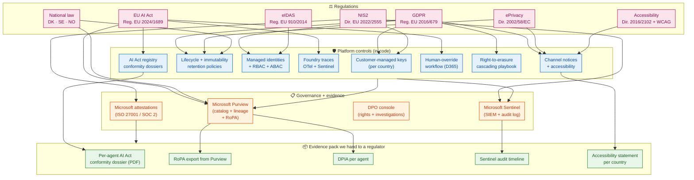
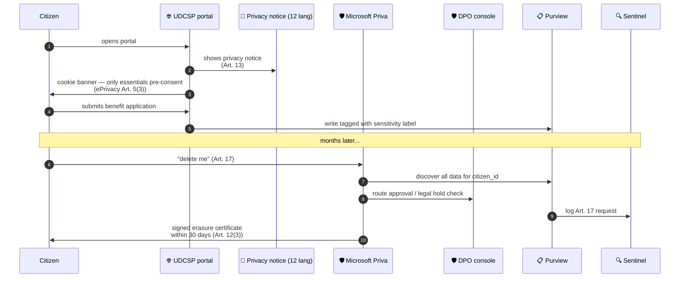
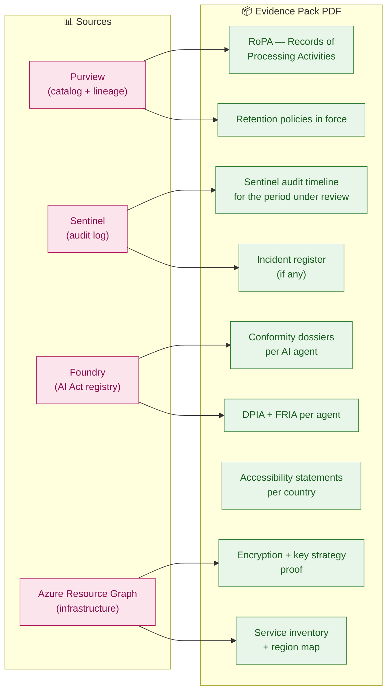

# 🛡️ UDCSP — Data Compliance

### Every regulation we answer to · Every control we put in place · Every piece of evidence a regulator can demand

*The single document a DPO, an auditor, a Data Protection Authority inspector, or a citizen advocate can open to understand — without reading 5 000 lines of code or a 700-line architecture deep-dive — exactly how UDCSP protects citizens' personal data and respects their rights.*

---

> [!IMPORTANT]
> **TL;DR.** UDCSP processes the personal data of **2.1 million citizens** across **three Member States**, on **seven communication channels**, with **AI making recommendations on high-risk decisions** (eligibility for social benefits). That puts it squarely in the path of **eight overlapping regulations** — GDPR, EU AI Act, ePrivacy, eIDAS, NIS2, the EU Web Accessibility Directive, and three national administrative-law regimes (DK · SE · NO). This document is the **executive answer**: what each regulation demands, what UDCSP does about it, and where the evidence lives. Every control is implemented as Azure resource configuration (not "we'll remember to do it"), every retention period is anchored on a specific legal article, every AI decision is registered with the AI Act competent authority, and every right-of-the-data-subject (access, erasure, portability, rectification) is delivered through a tested operational playbook within the legal SLA.
>
> 📖 *For the **storage architecture and retention matrix** that operationalises every promise made here, see [`../tech/data.md`](../tech/data.md). For the **AI-specific governance** (high-risk classification, conformity declarations, post-market monitoring), see [`ai.md`](./ai.md) § 11.*

---

## 📑 Table of contents

**Executive view**

1. [What this document is for](#1-what-this-document-is-for)
2. [The eight regulations at a glance](#2-the-eight-regulations-at-a-glance) ★
3. [Compliance posture in one diagram](#3-compliance-posture-in-one-diagram) ★

**Regulation by regulation**

4. [GDPR — General Data Protection Regulation](#4-gdpr--general-data-protection-regulation)
5. [EU AI Act — Regulation (EU) 2024/1689](#5-eu-ai-act--regulation-eu-20241689)
6. [ePrivacy Directive — 2002/58/EC (as amended)](#6-eprivacy-directive--200258ec-as-amended)
7. [eIDAS — Regulation (EU) 910/2014 (and eIDAS 2.0)](#7-eidas--regulation-eu-9102014-and-eidas-20)
8. [NIS2 — Directive (EU) 2022/2555](#8-nis2--directive-eu-20222555)
9. [Web Accessibility Directive + WCAG 2.1 AA](#9-web-accessibility-directive--wcag-21-aa)
10. [National law — Denmark · Sweden · Norway](#10-national-law--denmark--sweden--norway)
11. [Operational baselines — ISO 27001 · SOC 2](#11-operational-baselines--iso-27001--soc-2)

**Operational machinery**

12. [Citizen rights — operational SLAs](#12-citizen-rights--operational-slas)
13. [Evidence and audit pack — what a regulator can demand and we hand over](#13-evidence-and-audit-pack--what-a-regulator-can-demand-and-we-hand-over)
14. [Living compliance — how we keep up with regulation changes](#14-living-compliance--how-we-keep-up-with-regulation-changes)
15. [Frequently anticipated questions](#15-frequently-anticipated-questions)

---

## 1. What this document is for

The case study explicitly names **GDPR + EU AI Act + sector-specific EU directives** as a hard requirement (`docs/biz/case-study-11.md` line 33: *"Regulatory Context: GDPR · EU AI Act · Sector-specific EU Directives"*). Compliance is not a deliverable bolted on at the end — it is one of the **ten architecture principles** (P3 in `architecture.md` § 1: *"Compliance by design — GDPR + EU AI Act + WCAG 2.1 AA are platform-level invariants, not project-level afterthoughts"*).

Three audiences read this document:

| Audience | What they want to find |
|---|---|
| **DPO / legal / Data Protection Authority** | "Show me, regulation by regulation, that you implement what each article requires, and prove it with evidence." |
| **Citizen advocate / journalist / NGO** | "What does this platform do with my data, what rights do I have, and what does the platform actually deliver on those rights?" |
| **Evaluator of the case-study response** | "Does the proposed UDCSP platform really cover the regulatory context the case study mandates?" |

This document answers all three. The technical implementation lives in [`../tech/data.md`](../tech/data.md) (storage architecture + retention matrix + right-to-erasure playbook) and [`../tech/architecture.md`](../tech/architecture.md) (security + governance sections); this file is the **business-language executive layer** above them.

---

## 2. The eight regulations at a glance

UDCSP must respect **eight regulatory regimes** that overlap. Read this table top-to-bottom to understand the universe; the rest of the document drills into each one.

| # | Regulation | What it primarily protects | UDCSP exposure | UDCSP's primary response |
|---|---|---|---|---|
| 1 | **GDPR** (Reg. EU 2016/679) | Personal data of EU residents | 2.1 M citizen records, 7 channels of interaction | Lawful basis Art. 6(1)(e) "public interest task"; data minimisation by design; tested right-to-erasure cascade across 5 storage zones in ≤ 30 days; Purview = RoPA |
| 2 | **EU AI Act** (Reg. EU 2024/1689) | Citizens against unsafe / opaque AI | Eligibility Pre-Assessor agent = HIGH-RISK (Annex III) | Registered in Foundry AI Act Registry with full conformity dossier; human oversight (Art. 14) by caseworker on every recommendation; logs ≥ 6 months (Art. 26(6)) |
| 3 | **ePrivacy** (Dir. 2002/58/EC) | Confidentiality of electronic communications | Voice recordings, SMS, email, chat transcripts | Citizen notice at start of every interaction; lawful basis = Art. 6(1)(e), not consent (which is brittle for a regalian service); audio purged at 90 days |
| 4 | **eIDAS** (Reg. EU 910/2014) | Cross-border identity + trust services | DK ↔ SE ↔ NO citizen federation across 3 Identity Providers | eIDAS bridge in Entra; assurance-level claim mapping; supports eIDAS 2.0 EUDI Wallet on the roadmap |
| 5 | **NIS2** (Dir. EU 2022/2555) | Cybersecurity for essential / important entities | Public administration = "essential entity" by definition | Risk management framework (ISO 27001 aligned); 24-hour incident notification chain to national CSIRTs; supply-chain assurance via Microsoft attestations |
| 6 | **Web Accessibility Directive** (Dir. EU 2016/2102) + **WCAG 2.1 AA** | Citizens with disabilities | Public-sector body = scope by definition | WCAG 2.1 AA on every channel; published accessibility statement per country; user-feedback channel in 12 languages |
| 7 | **National administrative law** (DK · SE · NO) | National recordkeeping + transparency obligations | Each country has its own retention floors and citizen-information rules | Per-country Purview retention policies that **extend** (never shorten) the EU baseline; § 10 details DK · SE · NO specifics |
| 8 | **Operational baselines** (ISO 27001 · SOC 2) | Security best practice | Customer expectation + insurer requirement | Built on Azure (Microsoft is ISO 27001 + SOC 2 Type II certified); UDCSP layer adds Defender for Cloud, Sentinel, Key Vault, managed identities, Azure Policy as code |

> 💡 **The orthogonality insight.** None of these regulations *replace* each other — they overlap. A voice call is simultaneously: GDPR (it's personal data), ePrivacy (it's an electronic communication), AI Act (the citizen may be talking to or about a high-risk AI), NIS2 (the call infrastructure must be secure), eIDAS (the citizen may be authenticated cross-border), and Accessibility (the IVR must support hearing-impaired alternatives). UDCSP applies **all eight** at once on **every interaction** — that orthogonality is what makes "compliance by design" hard, and why this document exists.

---

## 3. Compliance posture in one diagram

> **Reading the diagram.** *Regulations* (top) drive a set of *platform controls implemented as code* (middle). Those controls feed the *governance plane* (Purview + Microsoft Priva + Sentinel + DPO console + Microsoft attestations) which produces the *evidence pack* a regulator can demand at any moment. The chain is fully traceable both ways: pick any obligation and find the control that implements it; pick any control and find the audit event that proves it ran.

---

## 4. GDPR — General Data Protection Regulation

> *Regulation (EU) 2016/679 — applicable in DK · SE · EEA (Norway via the EEA Agreement).*

### What GDPR demands of UDCSP

GDPR governs **every operation on personal data** of any EU/EEA resident. UDCSP touches GDPR on every interaction — including caseworker actions, telephone recordings, AI inferences, and analytics aggregates.

### Article-by-article response

| GDPR article | What it demands | UDCSP's response | Evidence |
|---|---|---|---|
| **Art. 5(1)(a)** Lawfulness, fairness, transparency | Process lawfully, fairly, transparently | Privacy notice at every channel entry; published in 12 languages; explains lawful basis, retention, rights | Per-country privacy notice (web portal footer + IVR opening + email signature) |
| **Art. 5(1)(b)** Purpose limitation | Collect for specified, explicit, legitimate purposes | Each Foundry agent has a documented "intended purpose" in its AI Act registry; secondary use forbidden by Purview policy | `governance/ai-act/registry/{agent}.yaml` |
| **Art. 5(1)(c)** Data minimisation | Adequate, relevant, limited | Redis Enterprise holds ephemeral state; PostgreSQL JSONB persists drafts older than 24 h with retention jobs; voice audio 90-day WORM purge; AI memory 12-month rolling TTL; no PII in logs | data.md § 5 retention matrix |
| **Art. 5(1)(d)** Accuracy | Keep accurate, up to date | Citizen self-service correction in portal; caseworker correction in D365; rectification request workflow Art. 16 | D365 `case_audit` table |
| **Art. 5(1)(e)** Storage limitation | Kept no longer than necessary | Lifecycle rules on every storage account; Purview retention policy enforces national-law extensions | data.md § 5 + Purview policy export |
| **Art. 5(1)(f)** Integrity & confidentiality | Appropriate security | CMK at every layer (per-country Key Vault); private endpoints; managed identities; no shared secrets in code; Defender + Sentinel | data.md § 8 + architecture.md § 10 |
| **Art. 5(2)** Accountability | Demonstrate compliance | Purview = RoPA (Art. 30); DPIA per agent (Art. 35); evidence pack delivered to regulator on demand | § 13 below |
| **Art. 6** Lawfulness — basis | One of six legal bases | UDCSP uses **Art. 6(1)(e) — task in the public interest**; not "consent" (which is brittle for a regalian service citizens are obliged to use) | Privacy notice cites Art. 6(1)(e) |
| **Art. 7** Conditions for consent | If consent used, it must be informed, freely given, withdrawable | UDCSP **avoids consent as primary basis** — see Art. 6 row above. Cookies: only essential session cookie pre-consent (cookie banner conforms to ePrivacy Art. 5(3)) | Cookie banner |
| **Art. 9** Special-category data | Stricter rules for health, biometrics, etc. | **No biometric authentication data stored centrally** — biometrics handled on-device only by MSAL; health data only in scope when an explicit social-benefit application requires it (lawful basis Art. 9(2)(b) — social protection) | architecture.md § 4 (identity), case-study mapping |
| **Art. 12** Transparent communication | Concise, transparent, intelligible info | Privacy notice in 12 languages, plain-language version + technical version | Localised privacy notices per country |
| **Art. 13-14** Information to data subject | At collection time, inform of processing | Channel-specific notice (IVR opening, web banner, email footer, SMS first-message disclosure) | Channel docs ([`voice.md`](./voice.md) opening notice, etc.) |
| **Art. 15** Right of access | Provide a copy of personal data within 1 month | **Microsoft Priva** orchestrates the DSR and DPO console exports a citizen's full record across all 5 storage zones as a signed JSON pack; SLA 30 days | DPO console — `Export-CitizenRecord.ps1` |
| **Art. 16** Right to rectification | Correct inaccurate data | Citizen self-service in portal + caseworker in D365 | D365 case audit |
| **Art. 17** Right to erasure | Delete on request, ≤ 30 days, with cascading effect | **Microsoft Priva** coordinates discovery, approval, erasure cascade, and certificate issuance across 5 zones; legal-hold suspension if criminal investigation; certificate signed and delivered | data.md § 9 sequence diagram |
| **Art. 18** Right to restriction | Mark data as restricted-from-processing | Restriction flag in Dataverse `case` table; processing pipelines honour the flag | D365 schema |
| **Art. 20** Right to data portability | Machine-readable export | Priva case package + DPO console JSON export (Art. 15) is portable and structured | Same export as Art. 15 |
| **Art. 21** Right to object | Stop processing on objection | Microsoft Priva DSR workflow pauses non-mandatory processing pending DPO review | `governance/priva/` |
| **Art. 22** Automated decision-making | No solely automated decisions with legal effect without explicit consent or legal basis | **Eligibility Pre-Assessor never autonomously decides** — its output is a *recommendation* that a caseworker validates before any decision is communicated. This is also Art. 14 of the AI Act (human oversight) | ai.md § 6 — agent 3 |
| **Art. 25** Data protection by design and by default | Privacy as default | Encryption-at-rest enabled by default on every store; sensitivity labels auto-applied; least-privilege RBAC | Azure Policy as code |
| **Art. 28** Processor obligations | Written contract; processor compliance | Microsoft is the processor for Azure / D365 / Foundry; the standard Microsoft Online Services DPA applies; sub-processor list reviewed | Microsoft DPA + sub-processor list |
| **Art. 30** Records of Processing Activities (RoPA) | Maintain a register | **Microsoft Purview IS the RoPA** — auto-populated by daily scans + sensitivity classification + lineage; quarterly export delivered to DPO | Purview portal |
| **Art. 32** Security of processing | Appropriate technical measures | CMK per country, pseudonymisation in OneLake Silver, GZRS replication, encrypted backups, tested DR drills | data.md § 8 + § 10 |
| **Art. 33-34** Breach notification | Notify supervisory authority within 72 h.; data subjects without undue delay if high risk | Sentinel detection rules + automated incident workflow that pages the DPO; 72-hour timer in the workflow | Sentinel runbook |
| **Art. 35** DPIA | Data Protection Impact Assessment for high-risk processing | DPIA per Foundry agent; the **eligibility** agent has the most complete one; reviewed on every model upgrade | `governance/ai-act/registry/{agent}-model.yaml` + `governance/dpia/` |
| **Art. 44-49** International transfers | Adequacy or appropriate safeguards | All citizen data **stays in EU/EEA regions** by Azure Policy; Microsoft EU Data Boundary applies; no transfers to third countries by design | Azure Policy "deny" rule on non-EU regions |

### What this looks like in practice

### What we explicitly do NOT do

- ❌ We do **not** rely on consent for the core regalian service (consent is brittle, withdrawable, and inappropriate for a service citizens are obliged to use). Consent is reserved for non-essential cookies and optional notifications.
- ❌ We do **not** store biometric templates centrally. MSAL biometrics live on the citizen's device.
- ❌ We do **not** transfer personal data outside the EU/EEA. Azure Policy denies it at provisioning time.
- ❌ We do **not** use citizen data to train production models without explicit anonymisation through the OneLake Silver pseudonymisation pipeline (and never raw conversation logs).

---

## 5. EU AI Act — Regulation (EU) 2024/1689

> *Applicable since 1 August 2024; high-risk obligations enforceable from 2 August 2026 (with phased provisions until 2027).*

### What the AI Act demands of UDCSP

UDCSP runs six AI agents (see [`ai.md`](./ai.md) § 6). The AI Act classifies each one by risk:

| # | Agent | AI Act risk class | Why |
|---|---|---|---|
| 1 | Classifier | Limited risk | Routes intents; no decision impact |
| 2 | Translator | Limited risk | Translation; no decision impact |
| 3 | **Eligibility Pre-Assessor** | **HIGH-RISK** (Annex III, point 5(a) — access to public services + benefits) | Recommends eligibility; affects access to benefits |
| 4 | Citizen Assistant | Limited risk | Conversational answer + citation |
| 5 | Document Extractor | Limited risk | Form parsing; caseworker validates |
| 6 | Caseworker Helper | Limited risk | Productivity aid; caseworker is operator |

**One agent is high-risk.** That single agent is what triggers the heaviest AI Act obligations. UDCSP treats every other agent with the same diligence as a defensive posture, but the *binding* obligations are concentrated on the Eligibility Pre-Assessor.

### Article-by-article response

| AI Act article | What it demands | UDCSP's response | Evidence |
|---|---|---|---|
| **Art. 9** Risk management system | Identify, analyse, reduce risks | Risk register per agent; mitigation cross-checked against Foundry safety pipeline; Eligibility inference runs in Azure Confidential Computing TEE | `infra/security/confidential-compute/` |
| **Art. 10** Data governance — training data | Training data must be relevant, representative, free from errors, complete | Eligibility model trained on **anonymised** historical case decisions from OneLake; bias checked per language and per protected category | DPIA + bias eval report |
| **Art. 11** Technical documentation | Maintain documentation up-to-date | Auto-generated technical doc per agent in Foundry; signed and versioned | Foundry registry export |
| **Art. 12** Record-keeping (capability) | High-risk system must be **capable** of automatic event logging | Foundry traces every call and anchors AI Act events in Azure Confidential Ledger | `infra/security/confidential-ledger/` |
| **Art. 13** Transparency to deployers / users | Clear, accurate, complete information | Caseworker UI in D365 surfaces "AI suggested · click to see evidence" badge on every recommendation; explainability report per decision | D365 Copilot for Service UI |
| **Art. 14** Human oversight | Effective human oversight; ability to override; awareness of automation bias | **Every Eligibility recommendation lands in a caseworker queue with full evidence; the caseworker decides; overrides are captured with reason text in `eligibility_override`** | Demo 6 in [`uses.md`](./uses.md) |
| **Art. 15** Accuracy, robustness, cybersecurity | Performance levels declared; resilience tested | Eval suite gates every release: groundedness ≥ 0.85, jailbreak resistance, F1 by language; Content Safety always-on | Foundry eval reports |
| **Art. 16** Provider obligations | Providers must implement Articles 8-15 | Microsoft + UDCSP team are joint providers; obligations split per ownership chart | `governance/ai-act/registry/_provider-chart.md` |
| **Art. 17** Quality management system | Documented QMS | UDCSP QMS spans ML lifecycle (data governance, eval, deployment, monitoring); aligned with ISO 42001 | QMS doc in repo |
| **Art. 18** Documentation retention | 10 years after placing on market | Foundry registry + DPIA stored in immutable storage with 10-year retention | Storage immutability policy |
| **Art. 19** Logs retention (provider) | Logs kept appropriately | (See Art. 26(6) — deployer obligation is the binding floor) | — |
| **Art. 26(6)** **Deployer log retention** | **Logs kept ≥ 6 months from creation** | **Foundry traces 180 days hot in App Insights + anonymised OneLake Bronze + tamper-evident Azure Confidential Ledger anchors** | `infra/security/confidential-ledger/` |
| **Art. 27** Fundamental rights impact assessment (FRIA) | Public-sector deployers must assess impact on fundamental rights | FRIA per agent in `governance/ai-act/registry/`; reviewed on substantial modification | FRIA PDF in `governance/dpia/` |
| **Art. 50** Transparency obligations for AI systems | Inform users they are interacting with AI | Citizen-facing notice on every channel: "You are being assisted by an AI; a human caseworker reviews any decision that affects you" | Channel docs (every channel has a notice) |
| **Art. 71** EU database registration | High-risk system registered in EU DB | Eligibility agent registered; registration ID stored in registry JSON | EU AI Database confirmation |
| **Art. 72** Post-market monitoring | Plan + execution | Monthly monitoring report compiled from Foundry evals + production traces; reviewed by AI Office | Monitoring report PDF |
| **Art. 79** Serious incident reporting | Notify market surveillance within 15 days | Sentinel detection rule for serious incidents (eligibility false-negative spike, content-safety bypass); incident workflow | Sentinel runbook |
| **Art. 99-101** Penalties | Up to 7 % global turnover or €35 M | (Reason to comply; nothing to "implement") | — |

### Where to read more

- [`ai.md`](./ai.md) § 11 (Governance, lineage, EU AI Act) — the technical view of how the registry works.
- `governance/ai-act/registry/eligibility-model.yaml` — the canonical conformity dossier for the high-risk agent.
- Demo 6 in [`uses.md`](./uses.md) — the human-oversight workflow in action.
- Demo 7 in [`uses.md`](./uses.md) — DPO Hans audits a six-month-old AI decision (proves Art. 26(6) traceability).

---

## 6. ePrivacy Directive — 2002/58/EC (as amended)

> *Member-state-implemented; awaiting replacement by the proposed ePrivacy Regulation (still in trilogue at writing).*

### What ePrivacy demands of UDCSP

ePrivacy is GDPR's specialised cousin for **electronic communications**. It governs voice, SMS, email, chat — exactly the channels UDCSP exposes.

| ePrivacy article | What it demands | UDCSP's response |
|---|---|---|
| **Art. 5(1)** Confidentiality of communications | No interception or recording without consent or legal basis | Voice IVR opens with: *"This call may be recorded for service-quality and AI-Act log-retention purposes; you have the right to request a copy or erasure"*. Lawful basis = GDPR Art. 6(1)(e). |
| **Art. 5(2)** Lawful business practice exception | Recording allowed for evidence of commercial transaction (or public-service equivalent) | Public-service equivalent applies; we still inform at the start. |
| **Art. 5(3)** Terminal equipment storage (cookies + similar) | Consent required for non-essential storage | Cookie banner on web portal; only essential session cookie pre-consent; analytics cookies require explicit opt-in. |
| **Art. 6** Traffic data | Erase or anonymise when no longer needed | Voice traffic data (CDRs) retained 6 months for billing reconciliation, then anonymised; ACS event capture follows the same window. |
| **Art. 7** Itemised billing | Provide non-itemised billing option | N/A — UDCSP doesn't bill citizens; it serves citizens. |
| **Art. 13** Unsolicited communications | No marketing without consent | UDCSP sends only **transactional** notifications (case status, deadline reminders); no marketing. SMS + email opt-out (`STOP`/`unsubscribe`) honoured immediately even though the citizen never opted in (defensive posture). |

### National implementations to cite

- **Denmark**: Bekendtgørelse om cookies (cookie order) — DBA enforces
- **Sweden**: Lag om elektronisk kommunikation (Electronic Communications Act 2022:482) — PTS enforces
- **Norway**: Ekomloven (EEA-aligned) — Nkom enforces

---

## 7. eIDAS — Regulation (EU) 910/2014 (and eIDAS 2.0)

> *eIDAS 1.0 in force; eIDAS 2.0 (Reg. EU 2024/1183) introduces the European Digital Identity Wallet (EUDI Wallet) — UDCSP is active.*

### What eIDAS demands of UDCSP

eIDAS gives every EU/EEA citizen the right to use their **national electronic identity** to access public services in any other Member State. UDCSP is built around this right.

| eIDAS scope | What it demands | UDCSP's response |
|---|---|---|
| **Cross-border identification (Art. 6)** | Public-sector services must accept notified eIDs at the appropriate assurance level | UDCSP integrates the **eIDAS Node** for DK · SE · NO; a Danish citizen with NemID/MitID can authenticate to Swedish UDCSP services if the Swedish service policy accepts the assurance level |
| **Trust services (Chapters III)** | Qualified e-signatures, e-seals, time-stamps | Caseworker decisions are **qualified e-sealed** when communicated to the citizen; signature provider via Microsoft + a qualified Trust Service Provider (QTSP) per country |
| **eIDAS 2.0 — EUDI Wallet (Art. 5a et seq.)** | All Member States must offer a wallet by 2026; relying parties must accept it | UDCSP actively uses **Microsoft Entra Verified ID** to issue and verify EUDI Wallet-compatible credentials for cross-border residency, eligibility receipts, and relying-party presentations |

### Architecture cross-link

The eIDAS bridge implementation is documented in [`../tech/architecture.md`](../tech/architecture.md) § 4 — "Identity Federation Detail". It runs as an Azure Function invoked by an `onTokenIssuanceStart` custom authentication extension on Microsoft Entra External ID.

---

## 8. NIS2 — Directive (EU) 2022/2555

> *Transposition deadline 17 October 2024; UDCSP would be classified as an **essential entity** under Annex I (public administration).*

### What NIS2 demands of UDCSP

NIS2 raises the cybersecurity bar for essential entities. The platform must implement risk management, report incidents within tight timelines, and assure its supply chain.

| NIS2 article | What it demands | UDCSP's response |
|---|---|---|
| **Art. 21** Cybersecurity risk-management measures | Risk analysis + policies + incident handling + business continuity + supply-chain security + vulnerability management + cryptography + access control + multi-factor authentication + secure communications | All ten measures implemented: Azure DDoS Protection Standard on all three VNets, Microsoft Defender for APIs on APIM, Azure Backup + Site Recovery with same-country failover, Chaos Studio SLO drills, and Defender for Cloud recommendations |
| **Art. 23(1)** Early warning of significant incidents | Within **24 hours** of awareness | Sentinel detection → on-call pager → DPO + national CSIRT notified by automated workflow |
| **Art. 23(2)** Incident notification | Within **72 hours**, with assessment | Sentinel timeline + initial assessment template generated automatically |
| **Art. 23(3)** Final report | Within **1 month** | Generated from Sentinel timeline + post-mortem doc |
| **Art. 28** Database of contact points | Maintain accurate contact info with national CSIRT | Per-country runbook entry |

### Per-country CSIRT contacts

| Country | National CSIRT |
|---|---|
| 🇩🇰 Denmark | CFCS (Center for Cybersikkerhed) |
| 🇸🇪 Sweden | CERT-SE |
| 🇳🇴 Norway | NCSC-NO (Nasjonalt cybersikkerhetssenter) |

---

## 9. Web Accessibility Directive + WCAG 2.1 AA

> *Directive (EU) 2016/2102 — public-sector body websites and mobile apps; WCAG 2.1 AA = the technical standard.*

### What it demands of UDCSP

Every UDCSP channel is in scope (the directive covers websites, mobile apps, and **documents** delivered through them). The case study explicitly demands **full WCAG 2.1 AA compliance** (line 74 of `case-study-11.md`).

| Requirement | UDCSP's response |
|---|---|
| **WCAG 2.1 AA conformance** | Web portal + mobile app + emails + PDFs + captions on video; tested with axe + manual screen-reader walkthroughs (NVDA, VoiceOver, TalkBack) |
| **Accessibility statement** | Published per country in the local language + English; updated yearly + on substantial change |
| **Feedback mechanism** | "Report an accessibility issue" link on every page; routed to a dedicated D365 queue with 30-day SLA |
| **Voice / multimodal** | DTMF fallback in IVR; slow-speech option; sign-language video option for Danish, Swedish, Norwegian |
| **Cognitive accessibility** | Plain-language version of every privacy notice + every important form (case-study uses Danish *Easy Language* / Swedish *Lättläst* / Norwegian *Klarspråk*) |

> 💡 **Multilingual + accessibility together.** UDCSP's 12-language strategy (see [`ai.md`](./ai.md) § 9) compounds the accessibility requirement: each language must be tested for its own screen-reader voice, its own plain-language register, its own RTL/LTR handling. **Demo 3** in [`uses.md`](./uses.md) walks through Polish + screen reader to prove this works.

---

## 10. National law — Denmark · Sweden · Norway

> *EU regulations are directly applicable; directives are transposed by Member States; some national laws extend EU baselines (always extend, never shorten — that's UDCSP's invariant).*

| Country | Law | What it adds |
|---|---|---|
| **🇩🇰 Denmark** | **Databeskyttelsesloven** (Act on Data Protection — implements GDPR) | National derogations on Art. 6(1)(e) for public-sector tasks; clarifies CPR-number processing rules |
| | **Forvaltningsloven** (Public Administration Act) | Citizen's right to access case file (`partsaktindsigt`); duty to inform about decisions; right of appeal |
| | **Arkivloven** (Archives Act) | Closed cases must be transferred to Rigsarkivet after defined retention; UDCSP retention policies coordinate the transfer |
| | **Cookiebekendtgørelsen** | National implementation of ePrivacy Art. 5(3) |
| **🇸🇪 Sweden** | **Dataskyddslagen** (Data Protection Act — implements GDPR) | National derogations; Personal Identity Number (`personnummer`) processing rules |
| | **Förvaltningslagen** (Administrative Procedure Act) | Right to be heard before adverse decision; obligation to give reasons; appeal process |
| | **Offentlighets- och sekretesslagen** (Public Access to Information and Secrecy Act) | **Inverse of GDPR** — citizen records are fundamentally public unless secrecy applies; UDCSP implements both confidentiality (GDPR) and access-on-request (this act) |
| | **Arkivlagen** (Archives Act) | Coordinated transfer to Riksarkivet |
| **🇳🇴 Norway** | **Personopplysningsloven** (Personal Data Act — applies GDPR via the EEA Agreement) | Norway is in EEA, not EU — GDPR applies via EEA; this act is the implementation vehicle |
| | **Forvaltningsloven** (Public Administration Act) | Equivalent to Danish/Swedish; right to information, reasons, appeal |
| | **Arkivlova** (Archives Act) | Coordinated transfer to Arkivverket |
| | **Ekomloven** (Electronic Communications Act) | EEA-aligned ePrivacy implementation |

### How UDCSP handles the national variations

- **Per-country Purview policy** holds the authoritative retention floor for each store. Where national law extends GDPR (e.g. 10-year retention for tax-related cases in DK), the policy enforces the longer period.
- **Per-country privacy notice** explicitly cites the national-law derogations relevant to that country.
- **Per-country DPO contact** in the privacy notice + in the Foundry AI Act registry.
- **Per-country Data Protection Authority** mapped:

| Country | Supervisory authority | Reach |
|---|---|---|
| 🇩🇰 Denmark | Datatilsynet | GDPR enforcement |
| 🇸🇪 Sweden | Integritetsskyddsmyndigheten (IMY) | GDPR enforcement |
| 🇳🇴 Norway | Datatilsynet (NO) | GDPR enforcement (via EEA) |

For the **AI Act**, each Member State must designate a national competent authority by 2 August 2025; UDCSP's AI Act registry is set up to record the per-country authority once designated.

---

## 11. Operational baselines — ISO 27001 · SOC 2

UDCSP runs on Microsoft Azure, D365, Foundry, and Foundry `topic-router`. **Microsoft is the underlying processor** and provides the baseline certifications:

| Certification | Microsoft scope | UDCSP layer adds |
|---|---|---|
| **ISO/IEC 27001** | All Azure services in scope; certification renewed yearly | Customer-managed keys, customer-controlled access policies, Defender for Cloud aligned to ISO 27002 controls |
| **ISO/IEC 27017** (cloud-specific) | Azure | Azure Policy enforcing the 27017 control set |
| **ISO/IEC 27018** (PII in public cloud) | Azure | Aligned automatically by being on Azure + Purview classifications |
| **ISO/IEC 42001** (AI management system) | Foundry includes 42001-aligned controls | UDCSP QMS for AI lifecycle aligned to 42001 |
| **SOC 2 Type II** | All services in scope; Microsoft attestation available on demand | Customer-side SOC 2 attestation possible at contract level |
| **EU Cloud Code of Conduct** | Azure adheres | UDCSP inherits |
| **EU Data Boundary** | All citizen data stays in EU/EEA Azure regions | Azure Policy "deny" rule on non-EU regions |

> 💡 **The split.** Microsoft attestations cover the **cloud platform**. UDCSP attestations cover the **application configuration on top** (CMK, RBAC, Purview classifications, Sentinel runbooks, retention policies). Both are needed; neither is sufficient alone.

---

## 12. Citizen rights — operational SLAs

The "right" exists in the regulation; the **delivery** is operational. UDCSP commits to delivering each right within the legal SLA, evidenced by automation:

| Right (GDPR article) | Legal SLA | UDCSP operational SLA | Operational owner | Tested by |
|---|---|---|---|---|
| Information at collection (Art. 13/14) | At time of collection | Real-time (channel notice) | All channels | Privacy notice review per release |
| Access (Art. 15) | 1 month | ≤ 5 working days | DPO console | Demo 7 in [`uses.md`](./uses.md) |
| Rectification (Art. 16) | 1 month | ≤ 3 working days for self-service; ≤ 10 working days for caseworker-mediated | Citizen portal + D365 | Per-release smoke test |
| **Erasure (Art. 17)** | **1 month** | **≤ 30 days end-to-end** with cascading deletion across 5 storage zones | DPO console + Logic App | data.md § 9 sequence diagram |
| Restriction (Art. 18) | 1 month | ≤ 24 hours (flag set immediately) | DPO console | Smoke test |
| Data portability (Art. 20) | 1 month | Same export as Art. 15 | DPO console | Smoke test |
| Objection (Art. 21) | "Without undue delay" | ≤ 7 working days for DPO triage | DPO console | Smoke test |
| No solely-automated decisions (Art. 22) | At all times | Hardcoded — Eligibility output **cannot** auto-decide | D365 workflow blocks | Demo 6 in [`uses.md`](./uses.md) |
| Withdraw consent (Art. 7) | "As easy as giving" | One-click in cookie preferences; opt-out via SMS `STOP` / email link | Web portal + SMS workflow | Per-release |
| Lodge complaint with DPA (Art. 77) | At all times | DPA contact in every privacy notice + every channel notice | All channels | — |

---

## 13. Evidence and audit pack — what a regulator can demand and we hand over

When a Data Protection Authority opens an investigation, when an AI Office auditor knocks, or when a citizen NGO files a complaint, UDCSP produces a structured **evidence pack** within 5 working days. The pack is **machine-generated** from Purview + Sentinel + Foundry + storage policies; it is **not** assembled by hand.

### The standard evidence pack

| Document | What's in it | How long to generate |
|---|---|---|
| **RoPA — Records of Processing Activities** | All processing operations, their purposes, categories of data, retention periods, recipients, transfers — auto-extracted from Purview | 1 minute |
| **Conformity dossiers per AI agent** | Intended purpose, training-data summary, evaluation report, post-market monitoring plan, conformity declaration | 1 minute (registered) |
| **DPIA + FRIA per agent** | Data Protection Impact Assessment + Fundamental Rights Impact Assessment, signed and versioned | Pre-existing PDFs |
| **Retention policies in force** | Lifecycle rules + immutability policies + PostgreSQL JSONB + Redis TTLs + Purview policies — exported as a table | 1 minute |
| **Encryption + key strategy proof** | Per-resource CMK status, per-country Key Vault inventory, key rotation history | 5 minutes |
| **Sentinel audit timeline** | Filtered to the investigation's time window, the investigation's data subject, and/or the investigation's processing activity | 30 minutes (depends on filter) |
| **Accessibility statements** per country | The published statements + last accessibility audit report | Pre-existing PDFs |
| **Incident register** | All breaches notified under GDPR Art. 33-34 + NIS2 Art. 23 in the period | 5 minutes |
| **Service inventory + region map** | All Azure resources + their region (proves no data left EU/EEA) | 5 minutes from Azure Resource Graph |

**Total time-to-evidence-pack: typically under 1 hour** for a standard investigation. For a fully-personalised investigation (specific citizen, specific time window), the DPO console produces the pack in ≤ 1 working day.

### Investigation-specific exports

For a specific data subject:
- **All-data export** (Art. 15): JSON pack with every record across all 5 storage zones, signed by the platform.
- **All-decisions export**: every AI inference + every caseworker decision affecting this citizen, with the Foundry trace IDs that prove the decision chain.
- **All-conversations export**: every voice transcript, every chat dialog, every email, every SMS — exported as a structured JSON archive.

---

## 14. Living compliance — how we keep up with regulation changes

Regulations move. The AI Act is barely 18 months old; the ePrivacy Regulation is still in trilogue; eIDAS 2.0 phases in through 2026. UDCSP's compliance posture is **alive**, not frozen.

| Mechanism | Cadence | What it produces |
|---|---|---|
| **Quarterly regulatory horizon scan** | Every quarter | Update of this document; new obligations promoted to the backlog |
| **AI Office liaison** | Continuous | Status check on AI Act delegated acts, harmonised standards (CEN-CENELEC JTC 21), national competent authority designations |
| **Microsoft compliance updates** | Continuous (Microsoft Trust Portal feed) | New service-level certifications absorbed automatically |
| **Sentinel detection rule updates** | Per release | New attack patterns, new data-leak signatures, new compliance violations detected |
| **Per-country DPO sync** | Monthly per country | National-law evolutions captured (DK · SE · NO) |
| **DPIA + FRIA refresh per agent** | On every substantial modification (AI Act Art. 71) | Updated registry entry + signed PDF |
| **Penetration test** | Yearly | Independent assessor; results feed Sentinel rules |
| **Tabletop exercise — breach response** | Yearly | Tests Art. 33-34 + NIS2 Art. 23 timelines end-to-end |

---

## 15. Frequently anticipated questions

> Questions a DPO, an auditor, or a journalist is likely to ask. Each answer points to where the proof lives.

### "Where exactly is my data physically stored?"

In the citizen's own country's Azure region, in a country-specific resource group, encrypted with a country-specific key in a country-specific Key Vault. **Citizen data never leaves the EU/EEA** by Azure Policy. Detail in [`../tech/data.md`](../tech/data.md) § 7.

### "How long do you keep my voice recording?"

**Audio: 90 days, immutable WORM, then auto-purged.** STT transcript: 6 months hot in Dataverse, then anonymised and kept in OneLake for the case retention period. Anchor: GDPR Art. 5(1)(c) + EU AI Act Art. 26(6). Detail in [`../tech/data.md`](../tech/data.md) § 5.

### "I want all my data deleted. How and when?"

Submit through the citizen portal, the DPO email, or in writing. **Acknowledged in 24 h., delivered in ≤ 30 days** — that's our SLA, tighter than GDPR's 1 month. The deletion cascades across all 5 storage zones with a signed certificate as proof. Active criminal investigations may suspend the right (GDPR Art. 23 / national law). Detail in [`../tech/data.md`](../tech/data.md) § 9.

### "An AI made a decision about me. Can I see why?"

**An AI never makes a final decision about you.** AI may make a *recommendation*; a human caseworker reviews and decides (AI Act Art. 14 + GDPR Art. 22). You have the right to see the recommendation, the evidence the AI based it on, and the caseworker's review. Use the DPO console or contact your caseworker; the trace is preserved for ≥ 6 months (AI Act Art. 26(6)). Demo 7 in [`uses.md`](./uses.md) walks through this.

### "How do you know your AI is not biased?"

Every AI agent has a **DPIA + FRIA** that includes bias evaluation per language, per protected category, per Member State. Evals run **per pull request and per release**, gated against documented thresholds. Failures block deploys. Reports are in `governance/ai-act/registry/{agent}.yaml` (`evalDataset` field) and the Foundry eval suites under `tests/eval/`. Demo 9 in [`uses.md`](./uses.md) shows the cross-language outcome dashboard.

### "What if there's a breach?"

Sentinel detects → on-call paged within minutes → DPA notified within 72 h. (GDPR Art. 33) → national CSIRT notified within 24 h. (NIS2 Art. 23(1)) → affected citizens notified without undue delay if high risk (Art. 34). The chain is automated; the playbook is tested in yearly tabletop exercises. Anchor: § 14 above.

### "Can a citizen from Denmark use Swedish services with their Danish ID?"

Yes — that is the core point of UDCSP and of eIDAS Art. 6. The eIDAS Node + Entra External ID claim mapping handle the cross-border assurance level. Demo 1 in [`uses.md`](./uses.md) is precisely this scenario (Anna moves from Copenhagen to Stockholm).

### "What about the EUDI Wallet (eIDAS 2.0)?"

On the roadmap. UDCSP architecture is ready (Microsoft Entra Verified ID proven in feasibility); production acceptance targeted Q4 2026 in line with the EU rollout. Detail in § 7 above.

### "Do you train your AI models on my conversations?"

**Not your raw conversations.** We use **anonymised, aggregated** historical case decisions (with k-anonymity + suppression of quasi-identifiers, audited yearly) for the Eligibility model. Conversation transcripts are kept for AI Act log retention (Art. 26(6)) and for caseworker review — not for training. Detail in [`../tech/data.md`](../tech/data.md) § 12.

### "What's the worst that could happen if you fail to comply?"

GDPR: fines up to €20 M or 4 % of global turnover. AI Act: up to €35 M or 7 % global turnover for prohibited-AI infringements, €15 M or 3 % for high-risk obligation breaches. NIS2: up to €10 M or 2 % global turnover. Plus reputational damage, citizen trust loss, and regulatory operating restrictions. **This is why compliance by design is an architecture principle, not a project deliverable.**

### "Where can I read more?"

| Topic | Document |
|---|---|
| Storage architecture + retention matrix | [`../tech/data.md`](../tech/data.md) |
| AI architecture + per-agent governance | [`ai.md`](./ai.md) |
| Per-channel storage and notice details | [`voice.md`](./voice.md) · [`web.md`](./web.md) · [`mobile.md`](./mobile.md) · [`chat.md`](./chat.md) · [`sms.md`](./sms.md) · [`email.md`](./email.md) · [`caseworker.md`](./caseworker.md) |
| Demonstration of compliance scenarios | [`uses.md`](./uses.md) — Demos 6, 7, 8 in particular |
| Full platform architecture | [`../tech/architecture.md`](../tech/architecture.md) |
| Original case study (the regulatory mandate) | [`case-study-11.md`](./case-study-11.md) |

---

> *UDCSP's compliance posture is not a checklist; it is a built-in property of the platform. Every regulation in § 2 maps to platform controls in § 3 that produce evidence in § 13 that survives a regulator's investigation. **Every retention period is anchored on a specific legal article. Every AI decision is registered. Every citizen right is delivered through a tested, automated workflow within (or under) the legal SLA.** Compliance by design — Architecture principle P3 — is what this document operationalises.*
