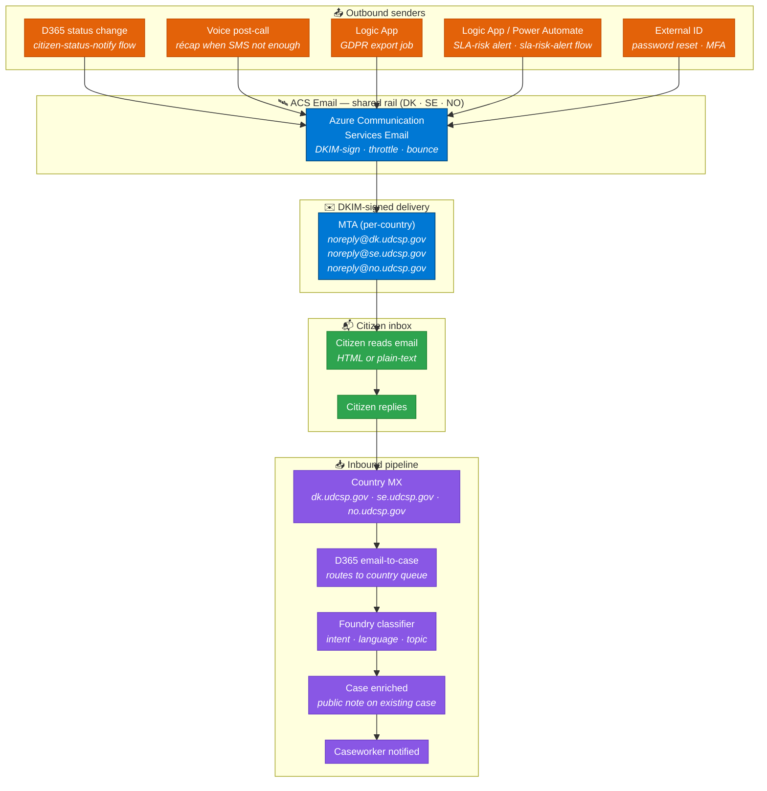
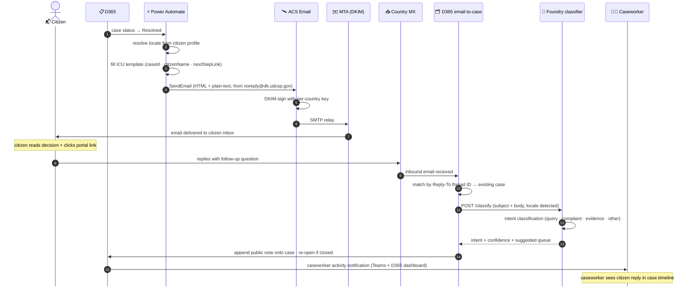
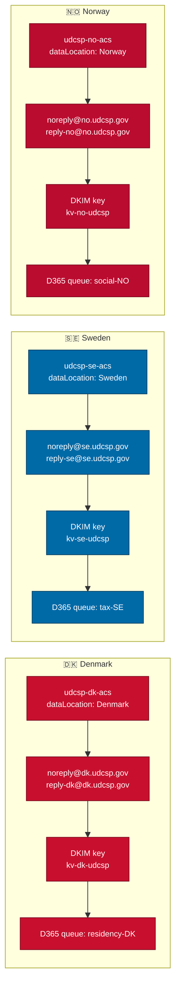
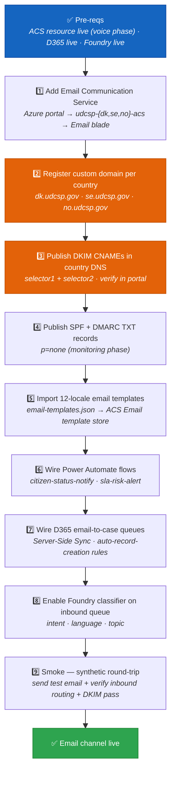

<div align="center">

# 📧 UDCSP — The Email Channel

### Bidirectional, country-domains, GDPR-grade

*How a citizen receives a legally-binding case notification from their national agency — DKIM-signed, in their own language — and how their reply finds its way back to the right caseworker queue, in the right country, in the right language.*

[](#)
[](#)
[](#)
[](#)

[](#)
[](#)
[](#)
[](#)

</div>

---

> [!IMPORTANT]
> **TL;DR.** A D365 case-status change triggers **Power Automate `citizen-status-notify`** → **Azure Communication Services Email** sends a DKIM-signed, localised, HTML+plain-text message from the citizen's country-specific sender domain (`noreply@dk.udcsp.gov` / `noreply@se.udcsp.gov` / `noreply@no.udcsp.gov`) → the citizen replies → the reply lands on the country's MX → **D365 email-to-case** routes it to the correct caseworker queue → **Foundry classifier** enriches the intent onto the existing case → caseworker is notified. **One ACS resource per country, one DKIM key per country, zero cross-border data bleed.** GDPR Art. 15 right-of-access exports are delivered as S/MIME-signed encrypted attachments through the same rail.
>
> | Field | Value |
> |---|---|
> | 🗄️ **Where stored** | Email body in Dataverse `email_activity`; attachments in ADLS `email-attachments/`; ACS events in `acs-events/`; AI traces in App Insights → OneLake. |

---

## 📑 Table of contents

1. [Why an email channel at all](#1-why-an-email-channel-at-all)
2. [The mental model in one picture](#2-the-mental-model-in-one-picture)
3. [The send lifecycle, step by step](#3-the-send-lifecycle-step-by-step)
4. [The seven building blocks](#4-the-seven-building-blocks)
5. [Multilingual — 12 templates per message, HTML + plain-text](#5-multilingual--12-templates-per-message-html--plain-text)
6. [Accessibility — semantic HTML, plain-text alternative, screen-reader friendly](#6-accessibility--semantic-html-plain-text-alternative-screen-reader-friendly)
7. [Sovereignty — one sender domain per country](#7-sovereignty--one-sender-domain-per-country)
8. [Compliance — DMARC quarantine, SPF hard-fail, S/MIME, GDPR Art. 5](#8-compliance--dmarc-quarantine-spf-hard-fail-smime-gdpr-art-5)
9. [📧 Getting a real sender domain ready (DKIM + SPF + DMARC + reply-to mailbox)](#9--getting-a-real-sender-domain-ready-dkim--spf--dmarc--reply-to-mailbox)
10. [The activation runbook](#10-the-activation-runbook)
11. [How to test it (three levels)](#11-how-to-test-it-three-levels)
12. [The demo script for a jury](#12-the-demo-script-for-a-jury)
13. [Anti-patterns we avoid](#13-anti-patterns-we-avoid)
14. [Where the conversation is stored](#14-where-the-conversation-is-stored)

---

## 1. Why an email channel at all

The case study is unambiguous (`docs/biz/case-study-11.md` § AI Infusion Point):

> *"A GenAI citizen assistant answers service queries in natural language across web, mobile, **and telephone** channels."*

Email is the *connective tissue* that binds every other channel into a coherent citizen journey. Four reasons email is a **first-class** channel in UDCSP, not an afterthought:

- 📜 **Legal record of correspondence.** Nordic public-sector regulators (Digitaliseringsstyrelsen DK, DIGG SE, Digitaliseringsdirektoratet NO) require proof that key notifications — residency decisions, tax assessments, benefit determinations — were **sent and received**. An email with DKIM signature and an SMTP delivery receipt is the audit artefact. An SMS or in-app push is not.
- 💬 **Citizen-initiated correspondence.** A citizen who receives a decision email will often reply — *"Can you explain this calculation?"*, *"I attached the wrong document."* That reply **must** become a D365 case update, not be silently discarded. The inbound email-to-case pipeline ensures no citizen communication is ever orphaned.
- 🔒 **GDPR Art. 15 right of access.** When a citizen exercises their right to a copy of all their data (Case Study 11 §§ GDPR obligations), the export is **too large for SMS** and too sensitive for an unencrypted download link. UDCSP delivers it as an S/MIME-signed encrypted email attachment — a legally-defensible, tamper-evident bundle.
- ♿ **Accessibility and long-form context.** Some citizens have cognitive disabilities or low digital literacy that make a terse SMS cryptic. Email allows full sentences, step-by-step guidance, numbered instructions, hyperlinks to help pages, and screen-reader-friendly semantic HTML — all in the citizen's chosen language.

The design principle, codified in `docs/biz/uses.md` § Demo 1:

> *"Every status change that matters to the citizen triggers an omnichannel notification — email + SMS, in the citizen's language, from the citizen's country."*

---

## 2. The mental model in one picture



> 📖 **Reading the picture.** Orange = outbound senders (multiple triggers, one rail). Blue = ACS Email + DKIM-signed MTA (the **shared rail** — the same ACS resource that serves voice SMS also delivers email). Green = the citizen. Purple = the inbound pipeline that ensures every reply becomes a structured case update. **The brain (Foundry classifier) governs the inbound side; ACS governs the outbound side.**

---

## 3. The send lifecycle, step by step



**Delivery SLOs:**

| Hop | Target | Mechanism |
|---|---|---|
| Power Automate trigger → ACS SendEmail API | < 5 s | ACS Email REST API is synchronous on accept |
| ACS Email → MTA relay | < 30 s | ACS MTA SLA; retried automatically on transient failure |
| MTA → citizen inbox (major providers) | < 2 min | Per ACS Email SLA for well-reputed sender domains |
| Inbound MX → D365 email-to-case | < 60 s | Exchange Online / D365 server-side rule polling interval |
| Foundry classifier on inbound | < 500 ms | Small low-latency classification model |

---

## 4. The seven building blocks

| # | Block | What it does | Where it lives |
|:-:|---|---|---|
| **1** | **ACS Email service (shared)** | Sends and receives email; DKIM-signing; bounce and complaint handling; delivery status webhooks. **Same ACS resource per country** as voice and SMS. | `apps/voice/acs/acs-resource.bicep` |
| **2** | **Per-country sender domain + DKIM/SPF/DMARC** | Each country has its own verified sender domain (`dk.udcsp.gov`, `se.udcsp.gov`, `no.udcsp.gov`), its own DKIM keypair stored in the country Key Vault, its own SPF include, and its own DMARC policy. | ACS Email Communication Service + custom domain Bicep is part of the **activation runbook** (no `email-domain.bicep` is pre-committed; domains are provisioned at activation time) |
| **3** | **Localised templates** | 12-locale JSON catalogue: 3 message types × 12 locales × (subject + HTML body + plain-text body). ICU placeholders for `caseId`, `citizenName`, `nextStepLink`, `attachmentName`. | `apps/voice/notifications/email-templates.json` |
| **4** | **Outbound senders** | Power Automate `citizen-status-notify` (case status change → email + SMS); `sla-risk-alert` (SLA KPI warning → caseworker notification); Logic App `gdpr-data-export` (GDPR Art. 15 export package → encrypted email attachment). | `apps/d365/power-automate-flows/citizen-status-notify.json`, `apps/d365/power-automate-flows/sla-risk-alert.json`, `services/logic-apps/workflows/gdpr-data-export/workflow.json` |
| **5** | **Inbound D365 email-to-case** | Per-country reply-to mailbox (`reply-dk@dk.udcsp.gov` etc.) is configured as a D365 internal mailbox. Inbound server-side rules match the `Reply-To` thread ID to an existing case and append a public note. Country-specific queues ensure routing stays in-country. | `apps/d365/solutions/UDCSP_Core/customizations/queues/case-queues.xml` |
| **6** | **Foundry classifier on inbound** | Every inbound citizen email is classified by the same Foundry intent-classifier used by voice and web — detecting intent (query, complaint, evidence, withdrawal), language, and suggested routing priority. Result is stamped onto the D365 case note. | `foundry/agents/*` (shared with all channels) |
| **7** | **DLP / Purview content scanning** | Microsoft Purview DLP policies scan outbound email content for PII over-share (NordicNationalID classification) and block cross-border transfers without valid consent. Outbound email logs in Log Analytics are redacted for PII. | `governance/purview/dlp-policies/block-cross-border-cpr-without-consent.json`, `governance/purview/classifications/NordicNationalID.json` |

---

## 5. Multilingual — 12 templates per message, HTML + plain-text

The full locale matrix from `apps/voice/notifications/email-templates.json`:

| 🏳️ | Locale | Template keys | Subject encoding |
|:-:|---|---|---|
| 🇩🇰 | `da` — Danish | `caseSubmitted` · `caseUpdated` · `consentChanged` | Latin-1 safe + RFC 2047 for non-ASCII |
| 🇸🇪 | `sv` — Swedish | `caseSubmitted` · `caseUpdated` · `consentChanged` | Latin-1 safe + RFC 2047 for ÅÄÖ |
| 🇳🇴 | `nb` — Norwegian Bokmål | `caseSubmitted` · `caseUpdated` · `consentChanged` | Latin-1 safe + RFC 2047 for ÆØÅ |
| 🇳🇴 | `nn` — Norwegian Nynorsk | `caseSubmitted` · `caseUpdated` · `consentChanged` | Latin-1 safe + RFC 2047 for ÆØÅ |
| 🏴󠁳󠁥󠁳󠁭󠁡󠁿 | `se` — Northern Sámi | `caseSubmitted` · `caseUpdated` · `consentChanged` | RFC 2047 encoded-words mandatory |
| 🇬🇧 | `en` — English | `caseSubmitted` · `caseUpdated` · `consentChanged` | ASCII safe |
| 🇩🇪 | `de` — German | `caseSubmitted` · `caseUpdated` · `consentChanged` | Latin-1 safe + RFC 2047 for Umlaute |
| 🇫🇷 | `fr` — French | `caseSubmitted` · `caseUpdated` · `consentChanged` | Latin-1 safe + RFC 2047 for accents |
| 🇵🇱 | `pl` — Polish | `caseSubmitted` · `caseUpdated` · `consentChanged` | RFC 2047 encoded-words mandatory |
| 🇸🇦 | `ar` — Arabic | `caseSubmitted` · `caseUpdated` · `consentChanged` | RFC 2047 + RTL HTML (`dir="rtl"`) |
| 🇺🇦 | `uk` — Ukrainian | `caseSubmitted` · `caseUpdated` · `consentChanged` | RFC 2047 encoded-words mandatory |
| 🇫🇮 | `fi` — Finnish | `caseSubmitted` · `caseUpdated` · `consentChanged` | Latin-1 safe + RFC 2047 for Ä/Ö |

**JSON shape** — each template has three variants: `subject`, `html`, and `plain`. The scaffold currently stores a single `body` key as a placeholder; production templates replace it with both `html` and `plain`:

```json
{
  "nb": {
    "caseUpdated": {
      "subject": "Sak {caseId} er oppdatert",
      "html": "<html lang=\"nb\"><body><main><h1>Saken din er oppdatert</h1><p>Kjære {citizenName},</p><p>Sak <strong>{caseId}</strong> er nå <strong>{status}</strong>. <a href=\"{nextStepLink}\">Se neste steg i portalen</a>.</p></main></body></html>",
      "plain": "Sak {caseId} er oppdatert\n\nKjære {citizenName},\n\nSak {caseId} er nå {status}. Se neste steg her: {nextStepLink}\n"
    }
  }
}
```

**ICU placeholders** used across all templates:

| Placeholder | Source | Example |
|---|---|---|
| `{caseId}` | D365 case record ID | `UDCSP-2025-04-00421` |
| `{citizenName}` | Citizen profile display name | `Lars Hansen` |
| `{nextStepLink}` | Portal deep-link (short branded URL) | `https://portal.dk.udcsp.gov/c/421` |
| `{attachmentName}` | GDPR export filename (Art. 15 only) | `gdpr-export-2025-04-30.zip` |
| `{status}` | Localised status label | `Innvilget` (NO) · `Godkendt` (DA) |
| `{date}` | ISO-8601 formatted in citizen locale | `30. april 2025` |

> [!NOTE]
> **RTL HTML for Arabic.** The `ar` locale HTML wrapper sets `<html lang="ar" dir="rtl">` and uses a right-to-left-safe stylesheet. The plain-text variant uses Unicode bidirectional marks where needed. Never embed Arabic text in a left-to-right HTML template without `dir="rtl"` — it renders incorrectly in Outlook and Apple Mail.

> [!NOTE]
> **RFC 2047 encoded-words.** Non-ASCII characters in email subject lines must be encoded per RFC 2047 (e.g., `=?UTF-8?Q?Sak_oppdatert_=E2=80=94_n=C3=A6ste_steg?=`). ACS Email handles this automatically when the subject is passed as a UTF-8 string via the REST API. Verify with `Test-Email.ps1` that subjects render correctly in Nordic MUAs (Outlook, Thunderbird, Apple Mail).

---

## 6. Accessibility — semantic HTML, plain-text alternative, screen-reader friendly

Every UDCSP email is a **MIME multipart/alternative** message with both an HTML part and a plain-text part. Screen readers and assistive technologies that cannot render HTML always receive the plain-text alternative.

**HTML semantic requirements** — every outbound HTML email must:

- Use a `<main>` landmark so screen readers can jump to content directly.
- Include `alt` text on every image (``). No critical information (case IDs, deadlines, decisions) may appear in an image alone.
- Use `<h1>` / `<h2>` heading hierarchy — never bold text in place of headings.
- Achieve a minimum colour-contrast ratio of **4.5:1** (WCAG 2.1 AA) between body text and background.
- Set the `lang` attribute on `<html>` matching the locale (e.g., `lang="nb"`, `lang="ar"`).
- Set `dir="rtl"` for right-to-left locales (`ar`).

**Plain-language requirement.** Every locale variant must score ≤ grade 8 on the Hemingway readability scale (or equivalent for non-English locales). Caseworkers who customise notification text in D365 are warned by a Power Automate flow if readability degrades beyond threshold.

**No tracking pixels.** UDCSP does not embed open-tracking pixels in citizen email — doing so would constitute processing of personal data (read receipts) without explicit consent under GDPR Art. 6. Delivery confirmation uses ACS Email delivery status webhooks (server-side, not pixel-based).

---

## 7. Sovereignty — one sender domain per country, one DKIM key per country



What stays in-country: **email content, delivery receipts, bounce logs, inbound citizen replies, D365 email-to-case records, DKIM private keys**. What is shared cross-country: **anonymised delivery metrics + the Foundry classifier agent definition** (the brain is shared; the data is not).

The ACS `dataLocation` property is the same sovereignty knob used by the voice channel — it pins persisted data to the country. See `apps/voice/acs/acs-resource.bicep`:

```bicep
resource acs 'Microsoft.Communication/communicationServices@2023-04-01-preview' = {
  name: 'udcsp-${country}-acs'
  location: 'Global'
  properties: {
    dataLocation: location   // 'Denmark' | 'Sweden' | 'Norway'
  }
}
```

Inbound replies are routed to country-specific D365 queues — `residency-DK`, `tax-SE`, `social-NO` — defined in `apps/d365/solutions/UDCSP_Core/customizations/queues/case-queues.xml`. A Danish citizen's reply never enters a Norwegian caseworker's queue.

---

## 8. Compliance — DMARC quarantine, SPF hard-fail, S/MIME, GDPR Art. 5

| ⚖️ | Constraint | Enforcement | Source |
|:-:|---|---|---|
| ✅ | **DKIM mandatory** — every outbound message DKIM-signed with the per-country 2048-bit RSA key | ACS Email enforces signing; unsigned mail rejected at submission | ACS Email custom domain settings |
| ✅ | **DMARC progressive rollout** — `p=none` (monitoring) → `p=quarantine` → `p=reject` | Enforced via DNS TXT record in each country zone | RFC 7489; DMARC policy in country DNS |
| ✅ | **SPF hard-fail** — `v=spf1 include:spf.communication.azure.com -all` | Receiving MTAs reject mail not originating from ACS | RFC 7208; SPF TXT record in country DNS |
| ✅ | **S/MIME for sensitive attachments** — GDPR Art. 15 data-export packages are S/MIME-signed and encrypted before attaching | Logic App `gdpr-data-export` encrypts the ZIP with the citizen's public key (or a one-time symmetric key delivered via portal) | `services/logic-apps/workflows/gdpr-data-export/workflow.json` |
| ✅ | **PII never in subject lines** — case IDs in subjects are opaque identifiers (`UDCSP-2025-04-00421`), never names, CPR numbers, or health codes | Template governance rule; validated by Purview DLP scan | `governance/purview/dlp-policies/block-cross-border-cpr-without-consent.json` |
| ✅ | **Outbound email logs redacted** — Log Analytics ingestion rule strips email body and recipient from the log stream; only delivery status and message ID retained | Log Analytics workspace transformation rule | `governance/purview/classifications/NordicNationalID.json` |
| ✅ | **GDPR Art. 5 data minimisation** — only the fields strictly necessary for the notification are included in each template; no AI confidence scores, no internal case notes, no cross-border data | Template design constraint; validated at code-review | Case Study 11 §§ GDPR obligations |

> [!WARNING]
> **DMARC `p=reject` is the target state for production.** During the pilot phase (first 90 days), operate at `p=quarantine` and monitor the DMARC aggregate reports (`rua=mailto:dmarc@dk.udcsp.gov` etc.) for legitimate traffic sources before promoting to `p=reject`. Promoting prematurely will reject legitimate mail from sub-systems that have not yet been aligned.

---

## 9. 📧 Getting a real sender domain ready (DKIM + SPF + DMARC + reply-to mailbox)

This is the practical question — *can we demonstrate a real email flow to the jury from a country domain?* **Yes**, with a clear procedure. Here is the playbook, anchored to current Microsoft documentation as of **May 2025**.

### 9.1 Pre-requisites (read first)

| Pre-requisite | Why | How to satisfy |
|---|---|---|
| **Paid Azure subscription** | ACS Email custom-domain verification requires a live ACS resource | Pay-as-you-go, EA, or CSP subscription |
| **ACS resource with Email Communication Service add-on** | The Email Communication Service is a child resource of ACS; it is **not** created by `acs-resource.bicep` alone | Add at activation time via the activation runbook (§ 10) |
| **DNS control over the sender domain** | You must publish DKIM CNAME records and SPF/DMARC TXT records | Requires write access to the DNS zone for `dk.udcsp.gov`, `se.udcsp.gov`, `no.udcsp.gov` (or an equivalent demo domain) |
| **Exchange Online or D365 mailbox for reply-to** | Inbound citizen replies land on the `reply-{country}@{country}.udcsp.gov` mailbox | D365 Server-Side Sync configured for the mailbox; D365 email-to-case rules activated |

> [!WARNING]
> **Managed sender domains (Azure-managed `*.azurecomm.net`) work instantly** and require no DNS changes. They are ideal for non-production demos but produce a sender address like `noreply@udcsp.azurecomm.net` — not a country government domain. For jury demonstrations that must show `noreply@dk.udcsp.gov`, you **must** provision a custom verified domain.

### 9.2 The full procedure (7 steps)

```mermaid
%%{ init: { 'flowchart': { 'nodeSpacing': 20, 'rankSpacing': 20 }, 'themeVariables': { 'fontSize': '12px' } } }%%
flowchart LR
    A["1. Decide<br/>sender domain"] --> B["2. Provision ACS<br/>Email service"]
    B --> C["3. Add custom<br/>verified domain"]
    C --> D["4. Publish<br/>DKIM CNAMEs"]
    D --> E["5. Publish<br/>SPF + DMARC TXT"]
    E --> F["6. Provision<br/>reply-to mailbox"]
    F --> G["7. Wire D365<br/>email-to-case"]

    style A fill:#1565c0,stroke:#0d47a1,color:#fff
    style B fill:#1565c0,stroke:#0d47a1,color:#fff
    style C fill:#8957e5,stroke:#6e40c9,color:#fff
    style D fill:#8957e5,stroke:#6e40c9,color:#fff
    style E fill:#e36209,stroke:#c24e00,color:#fff
    style F fill:#e36209,stroke:#c24e00,color:#fff
    style G fill:#2ea44f,stroke:#238636,color:#fff
```



1. **Decide sender domain per country.** For production: `dk.udcsp.gov` / `se.udcsp.gov` / `no.udcsp.gov`. For demo: any controlled domain (e.g. `dk.udcsp-demo.com`).

2. **Provision the ACS Email Communication Service.** In the Azure portal → your ACS resource (e.g. `udcsp-dk-acs`) → **Email** blade → **+ Add Email Communication Service**. One per country.

3. **Register the custom verified domain.** In the Email Communication Service → **Domains** → **+ Add domain** → choose *Custom domain* → enter `dk.udcsp.gov`. The portal generates two DKIM CNAME records and a domain-verification TXT record.

4. **Publish DKIM CNAME records** in the `dk.udcsp.gov` DNS zone:
   ```
   selector1._domainkey.dk.udcsp.gov  CNAME  selector1-dk-udcsp-gov._domainkey.azurecomm.net
   selector2._domainkey.dk.udcsp.gov  CNAME  selector2-dk-udcsp-gov._domainkey.azurecomm.net
   ```
   Click **Verify** in the portal. ACS polls until both CNAMEs resolve. Typical propagation: **< 1 hour** (TTL-dependent; set TTL to 300 s during provisioning).

5. **Publish SPF TXT and DMARC TXT records:**
   ```
   dk.udcsp.gov     TXT  "v=spf1 include:spf.communication.azure.com -all"
   _dmarc.dk.udcsp.gov  TXT  "v=DMARC1; p=none; rua=mailto:dmarc@dk.udcsp.gov; sp=reject; adkim=s; aspf=s"
   ```
   Promote `p=none` → `p=quarantine` → `p=reject` over the first 90 days as aggregate reports confirm clean traffic.

6. **Provision the reply-to mailbox.** Create `reply-dk@dk.udcsp.gov` as an Exchange Online shared mailbox (or a D365 internal mailbox). Configure D365 Server-Side Sync to monitor this mailbox. Set the `ReplyTo` header on every outbound ACS email to this address.

7. **Wire D365 email-to-case rules.** In D365 → Settings → Email → **Automatic Record Creation rules** → create a rule that matches incoming mail to `reply-dk@dk.udcsp.gov`, extracts the case ID from the `Reply-To` thread header, and routes to the `residency-DK` queue (or `tax-SE` / `social-NO` per country).

**Lead-time table:**

| Step | Typical lead time | Notes |
|---|---|---|
| ACS Email Communication Service provisioning | < 5 minutes | Instant in all regions |
| Custom domain DKIM verification | < 1 hour | DNS TTL-dependent; use TTL 300 s |
| SPF/DMARC propagation | < 1 hour | Same DNS TTL caveat |
| D365 Server-Side Sync activation | < 30 minutes | Requires D365 admin |
| DMARC `p=none` → `p=quarantine` | 30–90 days | Monitor aggregate reports first |
| DMARC `p=quarantine` → `p=reject` | After clean reports | Do not rush; false positives are painful |

Microsoft documentation we anchor to:

- 🔗 [ACS Email overview](https://learn.microsoft.com/en-us/azure/communication-services/concepts/email/email-overview)
- 🔗 [Add custom verified domains to ACS Email](https://learn.microsoft.com/en-us/azure/communication-services/quickstarts/email/add-custom-verified-domains)
- 🔗 [DKIM setup for ACS Email custom domains](https://learn.microsoft.com/en-us/azure/communication-services/concepts/email/email-authentication-best-practice#dkim)
- 🔗 [Send email with ACS — quickstart](https://learn.microsoft.com/en-us/azure/communication-services/quickstarts/email/send-email)

> [!TIP]
> **For the case-study jury, our recommended sequence is:**
>
> 1. **For the demo itself** — use the Azure-managed `*.azurecomm.net` sender address. Zero DNS setup, works immediately, full DKIM signing by ACS. Swap in `noreply@udcsp-dk.azurecomm.net` as the from address.
> 2. **To prove the country-domain path** — show the DNS configuration slides and the ACS portal with the custom domain in *Verified* state. The actual email that arrives in the demo mailbox proves delivery.
> 3. **Commit to full country domains for pilot** — submit DNS change requests on day 1 of the contract; the < 1-hour propagation time means domains are live before any actual citizen traffic begins.

### 9.3 Once the domain is verified — wiring it in

```yaml
# apps/voice/acs/email-domain-bindings.yaml  (created at activation time)
bindings:
  - country: dk
    senderDomain: "dk.udcsp.gov"
    fromAddress: "noreply@dk.udcsp.gov"
    replyToAddress: "reply-dk@dk.udcsp.gov"
    acsResource: "udcsp-dk-acs"
    d365Queue: "residency-DK"
  - country: se
    senderDomain: "se.udcsp.gov"
    fromAddress: "noreply@se.udcsp.gov"
    replyToAddress: "reply-se@se.udcsp.gov"
    acsResource: "udcsp-se-acs"
    d365Queue: "tax-SE"
  - country: no
    senderDomain: "no.udcsp.gov"
    fromAddress: "noreply@no.udcsp.gov"
    replyToAddress: "reply-no@no.udcsp.gov"
    acsResource: "udcsp-no-acs"
    d365Queue: "social-NO"
```

`scripts/install/modules/Install-Voice.psm1` reads this file at install time (email is part of the voice/channels phase) and:

1. Sets the `fromAddress` and `replyToAddress` on the Power Automate `citizen-status-notify` connection reference.
2. Configures the D365 Server-Side Sync mailbox for the reply-to address.
3. Activates the email-to-case automatic record creation rule for the country queue.
4. Adds a synthetic round-trip probe (send + receive) to the App Insights availability test suite.

---

## 10. The activation runbook



All steps except DNS publication (steps 3–4) are automated by `scripts/install/modules/Install-Voice.psm1` (phase 11 of the master installer — voice and channels). The DNS changes (DKIM CNAMEs, SPF, DMARC) require a change ticket in the national DNS zone managed by the government ICT authority of each country.

> [!NOTE]
> **No `email-domain.bicep` is pre-committed in `apps/voice/acs/`.** The ACS Email Communication Service child resource and the custom domain verification are performed interactively via the Azure portal or via Azure CLI `az communication email domain create` commands documented in the activation runbook. This is intentional: the domain names and DNS records are environment-specific and must not be hard-coded in source.

---

## 11. How to test it (three levels)

| Level | Command / action | What it proves | Lead time |
|---|---|---|---|
| **🚦 Smoke (isolated)** | ACS Email REST API: `POST /emails:send` with a synthetic `caseId` to a test mailbox; verify delivery status webhook returns `Delivered`; run `MXToolbox` DKIM checker against the sent message header | ACS Email service responds; DKIM signing works; sender domain verified; templates render | < 2 min |
| **🧪 E2E simulated** | Trigger the Power Automate `citizen-status-notify` flow with a synthetic D365 case-status change → verify email arrives in the test mailbox → reply from the test mailbox → verify D365 case receives a public note from the email-to-case rule | Every layer real: Power Automate → ACS → SMTP → D365 email-to-case → case enrichment | ~5 min |
| **📧 Live round-trip** | A real caseworker or jury member sends a real case-status change from D365; a real email address (not a test alias) receives the notification; the recipient replies; the caseworker confirms the reply appears on the D365 case timeline | Full production path including DKIM pass verification, DMARC reporting, and Foundry classifier output on the case note | Manual |

The smoke test (`Test-Email.ps1`) is **not yet scaffolded** — it should be added under `apps/voice/scripts/` as part of the channel activation. The ACS Email REST API endpoint and a test recipient address are the only parameters needed.

---

## 12. The demo script for a jury

5 minutes, no setup beyond the deployed platform:

| Beat | Action | What the jury sees | Eval-matrix rows hit |
|:-:|---|---|---|
| 1 | Caseworker Astrid resolves a benefit case for citizen Lars (NO) in D365 | Case status changes to *Resolved* in D365 case timeline | #3 (28d→4d) · #16 (caseworker) |
| 2 | Power Automate `citizen-status-notify` fires; ACS Email sends a Norwegian notification to Lars's inbox | Email arrives in < 2 min from `noreply@no.udcsp.gov`; DKIM header visible in raw message | #12 (channels) · #5 (AI 12 lang) · #13 (multilang) |
| 3 | Open the email: Norwegian HTML body with case ID, decision summary, and portal deep-link; plain-text alternative visible in "view source" | Jury sees semantic HTML, localised content, no PII in subject line | #8 (WCAG/a11y) · #9 (GDPR) |
| 4 | Lars replies from his email client: *"Kan dere forklare avgjørelsen nærmere?"* (NB: "Can you explain the decision further?") | Email routes back through `reply-no@no.udcsp.gov` MX → D365 email-to-case → Foundry classifier stamps intent as `query/clarification` → public note appears on Lars's case | #12 (channels) · #6 (assistant) · #15 (audit) |
| 5 | Caseworker Astrid sees the new public note in D365 with the Foundry classifier intent tag; GDPR export demo: caseworker triggers Art. 15 export → Logic App packages data → S/MIME encrypted email dispatched to Lars | Lars's mailbox receives the encrypted export attachment; jury sees the end-to-end GDPR compliance trail | #9 (GDPR/AI Act) · #10 (sovereignty) · #11 (DPA) |

> [!TIP]
> If the jury wants to verify DKIM authentication, open the raw message headers in the test email client — the `DKIM-Signature` header and the `Authentication-Results: dkim=pass` line from the receiving MTA are visible. This is the same evidence a court or regulator would examine.

This corresponds to **Demo 1** (Anna / Lars journey) in [`uses.md`](./uses.md) and the GDPR audit leg of **Demo 7** in [`uses.md`](./uses.md).

---

## 13. Anti-patterns we avoid

| ❌ Anti-pattern | ✅ What we do instead |
|---|---|
| Send unauthenticated email (no DKIM) | Every message DKIM-signed by ACS Email with the per-country key; unsigned mail is rejected at submission |
| Share one sender domain across countries | One sender domain per country — `dk.udcsp.gov`, `se.udcsp.gov`, `no.udcsp.gov` — enforced by the domain-bindings YAML |
| Put PII (names, CPR, health codes) in subject lines | Subjects contain only opaque case IDs; personal data lives in the encrypted body |
| Embed full unbranded URLs in email bodies | Short branded portal deep-links only (`portal.dk.udcsp.gov/c/{caseId}`); full APIM URLs are never exposed to citizens |
| HTML-only email without plain-text alternative | Every message is `multipart/alternative` — HTML + plain-text; accessibility and legacy MUA requirement |
| Attach unencrypted GDPR data exports | Art. 15 exports are S/MIME-signed and encrypted before attaching; the Logic App `gdpr-data-export` enforces this |
| Ignore inbound citizen replies | D365 email-to-case with Foundry classifier ensures every reply is enriched onto the existing case and assigned to a caseworker |
| Bypass Purview DLP on outbound email | Purview DLP scans outbound content for `NordicNationalID` classification; over-share is blocked, not just alerted |
| Deploy DMARC at `p=reject` on day one | Start at `p=none`, monitor aggregate reports for 30–90 days, then promote — rushing to `p=reject` rejects legitimate sub-system mail |
| Build a separate "email microservice" | Email is a thin channel adapter on top of the shared ACS resource and the shared Foundry agents — zero duplication |

---

## 14. Where the conversation is stored

Email also bypasses Copilot Studio, so the canonical correspondence record is Dataverse `email_activity`. Attachments are stored separately in ADLS to avoid the binary-in-Dataverse anti-pattern, while ACS events and AI traces provide the audit trail around delivery and classification. See [`../tech/data.md`](../tech/data.md) § 3.3 for the Zone 3 policy.

| What | Where | Retention |
|---|---|---|
| Email body in + out | Dataverse `email_activity` | 6 months hot; 6 years OneLake |
| Email attachments | ADLS Gen2 `email-attachments/` (per country, CMK) | Per case retention or erasure |
| ACS Email events | ACS Event Hubs → ADLS Gen2 `acs-events/` | See § 5 retention matrix |
| AI traces | App Insights → OneLake Bronze | 180 days hot; then Bronze |

For the full retention matrix, use [`../tech/data.md`](../tech/data.md) § 5.

> 📖 Full storage architecture and retention rules: see [`../tech/data.md`](../tech/data.md).

---

<div align="center">

*The email channel is the legal spine of the UDCSP citizen journey — the signed, auditable thread that binds every notification and every reply into one coherent case record.*  🇩🇰 🇸🇪 🇳🇴

[](./uses.md#-demo-1--anna-moves-from-copenhagen-to-stockholm-flagship)
[](../tech/agents.md)
[](../tech/installation.md)

</div>
