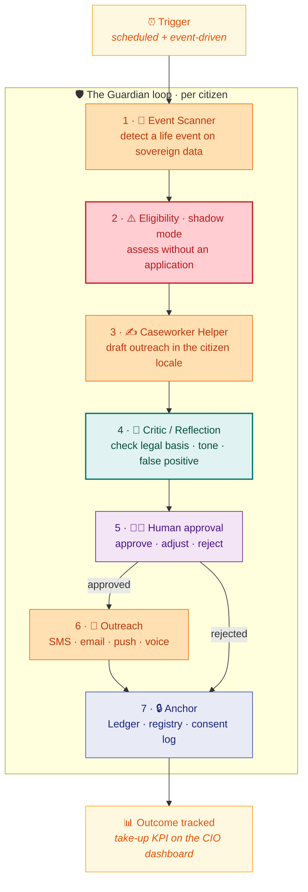
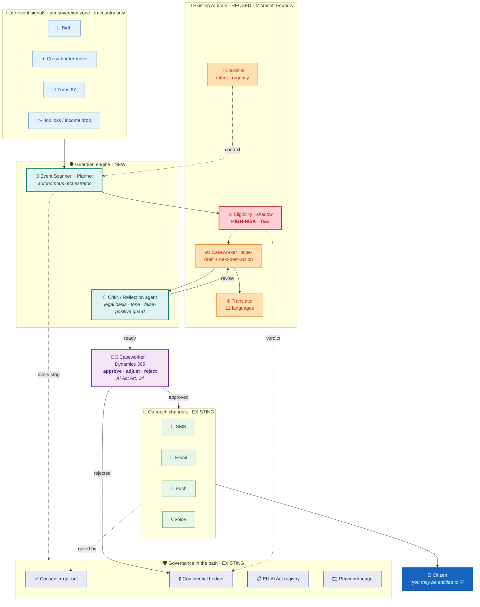

# 🛡️ UDCSP Guardian

### The proactive, autonomous, human-supervised entitlement layer

*From once-only to no-stop-shop: the platform stops waiting for the citizen to ask, and reaches out first, in the citizen's language, always under a human caseworker's control.*

---

> [!IMPORTANT]
> **TL;DR.** UDCSP today is reactive: a citizen must know they are entitled, find the portal, and apply. Yet studies show that between 20 % and 60 % of eligible people never claim their social benefits, mostly because they do not know they qualify.[^oecd]
>
> UDCSP Guardian flips the relationship. A new autonomous agent watches for life events across the sovereign zones (a child is born, a citizen moves country, turns 67, loses a job), runs the existing Eligibility agent in shadow (no application needed), has the Caseworker Helper draft an outreach in the citizen's language, a new Critic agent reviews it, a human caseworker approves it, and only then does the platform reach out through the channels that already exist (SMS, email, push, voice). Every autonomous step is consent-gated and anchored in Azure Confidential Ledger.
>
> It is the first genuinely autonomous behaviour on the platform, and it is built almost entirely by re-wiring bricks that are already live. This document tells the story, the architecture, the multi-agent coordination, the governance, and the executive impact.
>
> 🧭 *Guardian is a **vision** layer. Nothing here is coded yet; this is the design and the story. For what is live today, see [`../tech/inprogress.md`](../tech/inprogress.md).*

---

## 📑 Table of contents

1. [Why Guardian exists](#1-why-guardian-exists)
2. [The mental model in one picture](#2-the-mental-model-in-one-picture)
3. [What Guardian is, and what it is not](#3-what-guardian-is-and-what-it-is-not)
4. [How Guardian works: the autonomous loop](#4-how-guardian-works-the-autonomous-loop)
5. [The architecture of UDCSP Guardian](#5-the-architecture-of-udcsp-guardian) ★
6. [Multi-agent coordination patterns](#6-multi-agent-coordination-patterns)
7. [Trust, safety and compliance by design](#7-trust-safety-and-compliance-by-design)
8. [Executive impact and the KPI that matters](#8-executive-impact-and-the-kpi-that-matters)
9. [What Guardian reuses (and what is new)](#9-what-guardian-reuses-and-what-is-new)
10. [Status and roadmap](#10-status-and-roadmap)
11. [Glossary](#11-glossary)

---

## 1. Why Guardian exists

The platform is good at what it does, but it answers one question only: *"a citizen has a request, how do we handle it faster and more fairly?"* Every agent is request-driven. The Eligibility agent recommends, it never decides, and it only fires once a citizen has already started an application.

That leaves the hardest problem in social administration untouched: **non-take-up**. People who are entitled to a benefit but never receive it, because the burden is on them to know, to find the right portal, and to apply. The numbers are large and well documented across Europe and the Nordics.

| Signal | What research shows |
|---|---|
| 🎯 Take-up of means-tested benefits | Typically **40 % to 80 %** across OECD countries, so **20 % to 60 % never claim**.[^oecd] |
| 🇪🇺 Minimum-income benefits in Europe | Non-take-up rates commonly **over 30 %**, up to **50 % or more** for some benefits.[^drees] |
| 🧭 Main cause | Not fraud or choice: people simply **do not know they qualify**, or find the process too complex. |

The European Union has a name for where this is heading. The Single Digital Gateway gave us the *once-only principle* (never ask a citizen for data the state already holds). The next step, championed under the banner of *proactive public services* or *no-stop-shop*, is that the citizen should not even have to apply: the administration acts first.

> Guardian is UDCSP's answer to non-take-up. It turns the platform from a faster front door into a state that reaches out to the people it is meant to serve.

This is also the platform's weakest and highest-value gap against the evaluation grid. The current design shows tool-using agents, but little true autonomy and little multi-agent coordination. Guardian is precisely that missing behaviour.

---

## 2. The mental model in one picture

The whole idea is an inversion of the arrow between the citizen and the state.

```mermaid
flowchart LR
    %% ---------- Reactive (today) ----------
    subgraph TODAY["🕗 Today · reactive"]
        direction LR
        C1["👤 Citizen<br/><i>must know they qualify</i>"] --> P1["🌐 Finds the portal"]
        P1 --> A1["📝 Applies"]
        A1 --> E1["🤖 Eligibility<br/>recommends"]
        E1 --> H1["🧑‍💼 Caseworker decides"]
    end

    %% ---------- Proactive (Guardian) ----------
    subgraph GUARD["🛡️ Tomorrow · UDCSP Guardian"]
        direction LR
        S2["📡 Life event detected<br/><i>birth · move · job loss · age 67</i>"] --> G2["🛡️ Guardian<br/>assesses silently"]
        G2 --> D2["✍️ Drafts the outreach"]
        D2 --> K2["🔎 Critic reviews"]
        K2 --> H2["🧑‍💼 Caseworker approves"]
        H2 --> O2["📨 State reaches the citizen<br/><i>'you may be entitled to X'</i>"]
    end

    TODAY -.the inversion.-> GUARD

    classDef today fill:#ECEFF1,stroke:#607D8B,color:#263238
    classDef guard fill:#E0F2F1,stroke:#00796B,color:#004D40,stroke-width:2px
    classDef human fill:#F3E5F5,stroke:#6A1B9A,color:#4A148C
    class C1,P1,A1,E1 today
    class S2,G2,D2,K2,O2 guard
    class H1,H2 human
```

Same agents, same channels, same governance. The only thing that changes is who starts the conversation, and that changes everything for the citizen who never knew they qualified.

---

## 3. What Guardian is, and what it is not

Guardian is a thin autonomous layer that sits on top of the existing AI brain (see [`ai.md`](./ai.md)). It does not replace any agent or any authority. It orchestrates them on its own initiative.

**Legend** · 🟢 Guardian is · 🔴 Guardian is not

| | Statement |
|:-:|---|
| 🟢 | An **autonomous orchestrator** that starts work from an event, not from a citizen prompt. |
| 🟢 | A **recommender to a human**: it proposes an outreach; a caseworker approves before anything is sent. |
| 🟢 | A **reuse layer**: it re-wires the Eligibility, Caseworker Helper, Translator and Classifier agents already in the brain. |
| 🟢 | **Consent-first and reversible**: no outreach without a lawful basis and a one-click opt-out. |
| 🔴 | Not a decision-maker. It never grants or denies a benefit. The national authority still decides. |
| 🔴 | Not a new data lake. It reads the same sovereign, in-country data the platform already governs. |
| 🔴 | Not a marketing engine. It only surfaces genuine entitlements, evidenced rule by rule. |
| 🔴 | Not cross-border by default. A Danish signal stays in the Danish zone unless the citizen consents. |

---

## 4. How Guardian works: the autonomous loop

Guardian runs as a scheduled and event-triggered loop. Each pass walks one detected citizen through a seven-stage state graph, with a mandatory human gate before anything leaves the platform.

The stages in words:

- **1 · Event Scanner.** A Guardian-native planner scans the same in-country data the platform already holds (synthetic in the demonstrator) for life events that map to an entitlement: a birth to child benefit, a cross-border move to residency and tax, turning 67 to pension, a drop in income to housing support.
- **2 · Eligibility in shadow mode.** The existing high-risk Eligibility agent runs with no application attached, producing a rule-by-rule verdict and a confidence score. This is the same shadow path already used by the `ai-decision-shadow-mode` workflow.
- **3 · Draft the outreach.** The Caseworker Helper, which already knows the next-best-action catalogue and how to write in the citizen's locale, drafts a short, cited message: *"our records suggest you may be entitled to X; here is a pre-filled one-click way to confirm."*
- **4 · Critic and reflection.** A new Critic agent reviews the draft against the legal basis, the tone, and a false-positive guard, and can send it back. This is the reflection pattern the platform describes but does not yet run.
- **5 · Human approval.** A caseworker sees the signal, the evidence, and the draft on one screen, and approves, adjusts, or rejects. Nothing is autonomous past this gate. This satisfies EU AI Act Article 14.
- **6 · Outreach.** On approval, the message goes out through the channels that already exist: the ACS SMS and email templates, the mobile push registration, or an outbound voice call.
- **7 · Anchor.** Every autonomous step, and the human disposition, is hashed into Azure Confidential Ledger, written to the AI Act registry and Purview lineage, and checked against the citizen's consent and opt-out.

---

## 5. The architecture of UDCSP Guardian

Guardian is a small set of new components (in teal below) wrapped around the agents, channels and governance that are already live (in orange and indigo). The design principle is deliberate: maximise reuse, minimise new surface, keep every existing control in the path.

Two design choices carry the whole architecture:

- **Sovereignty is preserved.** The Event Scanner runs inside each country zone. A Danish signal is assessed by the Danish brain and never crosses a border unless the citizen explicitly consents, exactly like the rest of the platform.
- **The high-risk lane is unchanged.** The Eligibility agent still runs in its Confidential Compute enclave, still writes to the ledger, still never decides. Guardian only calls it earlier, before an application exists.

---

## 6. Multi-agent coordination patterns

Guardian is where the platform's agentic story becomes real rather than described. It exercises, in one feature, the coordination patterns the grid rewards.

| Pattern | How Guardian uses it |
|---|---|
| 🧠 **Autonomy** | The Event Scanner starts work from a signal, with no human or citizen prompt. This is the first non-reactive behaviour on the platform. |
| 🔀 **Orchestration** | A planner drives a multi-step pipeline across four existing agents and two new ones, in a fixed order with retries. |
| 🔎 **Reflection** | The Critic agent reviews the drafted outreach and can send it back for revision before any human sees it. |
| 🧭 **State graph** | The loop is an explicit seven-state graph with a hard human gate; rejected and approved paths both terminate in an audit anchor. |
| 🤝 **Handoff** | Control passes agent to agent, then hands off to a human caseworker, then to the outreach channel. |
| 👤 **Human-in-the-loop** | The state graph cannot advance past stage 5 without a caseworker decision, satisfying AI Act Article 14. |

---

## 7. Trust, safety and compliance by design

Reaching out to citizens about their entitlements is exactly the kind of processing regulators care about most. Guardian treats that as a feature to demonstrate, not a risk to hide. Every control the platform already has stays in the path, and a few are tightened.

- ⚖️ **GDPR Article 22.** Guardian never makes an automated decision with legal effect. It produces a proposal that a human approves, and the citizen action stays voluntary, so the automated-decision prohibition does not bite.
- 🛡️ **EU AI Act, high-risk.** The Eligibility agent is already registered as high-risk. Guardian keeps the mandatory human oversight (Art. 14), the logging (Art. 12), and the transparency notice (Art. 50): every outreach states it was prepared with AI and reviewed by a human.
- ✅ **Lawful basis and consent.** Proactive outreach fires only where a lawful basis exists, and every citizen has a standing, one-click opt-out. The consent state is checked at stage 6 and logged.
- 🔒 **Tamper-evident trail.** The signal, the verdict, the draft, the critic's note and the human disposition are hashed into Azure Confidential Ledger, so a regulator can reconstruct any outreach months later.
- 🎯 **False-positive guard.** The Critic agent exists partly to protect citizens from a wrong or distressing message. A low-confidence or ambiguous signal is dropped, not sent.
- 📄 **DPIA.** Proactive profiling gets its own Data Protection Impact Assessment, alongside the existing eligibility DPIA.

> The lesson for the jury: proactive government is safe when the autonomy stops at a human, the basis is lawful, the citizen can opt out, and every step is provable. Guardian is a demonstration of responsible autonomy.

---

## 8. Executive impact and the KPI that matters

Guardian changes the headline metric. The platform already tells a strong efficiency story (28 days to 4). Guardian adds an equity story that lands with a minister: money and rights delivered to people who would otherwise have been missed.

| Metric | Reactive platform | With Guardian |
|---|:-:|:-:|
| 🎯 Who starts | The citizen | The state |
| 📈 Benefit take-up | Bounded by who applies | Closes part of the **20 to 60 % gap**[^oecd] |
| 💶 New executive KPI | n/a | **Unclaimed entitlements recovered (€)** |
| 🧭 Story | Faster front door | A state that reaches out |

The new KPI, *unclaimed entitlements recovered*, is a natural tile on the CIO dashboard described in [`../tech/monitoring.md`](../tech/monitoring.md): euros of benefit proactively delivered, take-up lift versus baseline, sliced per country and per language, with the same sovereign aggregation as every other measure.

---

## 9. What Guardian reuses (and what is new)

The credibility of Guardian is that it is mostly assembly. The heavy, risky parts (PII handling, sovereignty, the high-risk lane, the channels, the ledger) are already built and governed.

| Building block | Status today | Guardian role |
|---|:-:|---|
| Eligibility agent | 🟢 live (advisory) | Run in shadow mode, before an application |
| `ai-decision-shadow-mode` workflow | 🟢 built | The template for the no-application assessment |
| Caseworker Helper + next-best-action | 🟢 built | Draft the citizen outreach in locale |
| Translator · Classifier | 🟢 live | Localise and contextualise the outreach |
| SMS · email · push · voice | 🟢 present | Deliver the approved outreach |
| Confidential Ledger · AI Act registry · Purview | 🟢 present | Anchor every autonomous step |
| Consent + opt-out surface | 🟡 partial | Gate every outreach |
| **Event Scanner / Planner** | 🔴 new | The autonomous orchestrator |
| **Critic / Reflection agent** | 🔴 new | Review the draft before the human |
| **`proactive-outreach` workflow** | 🔴 new | Twin of the shadow-mode workflow |
| **Take-up KPI tile** | 🔴 new | Prove the impact on the CIO dashboard |

Two new agents, one new workflow, one dashboard tile, one screen. Everything else is a re-wire.

---

## 10. Status and roadmap

Guardian is a vision, presented here as design and story. It is not coded. The honesty labels below match the rest of the repository.

| Item | Label |
|---|:-:|
| The proactive model and this architecture | 🧭 Vision |
| Reused bricks (eligibility, helper, channels, ledger) | 🟢 Live / built |
| Event Scanner, Critic agent, outreach workflow | 🟠 Blueprint |
| Consent and opt-out enforcement | 🟡 Partial today |
| Take-up KPI on Fabric CIO dashboard | ⚪ Roadmap |

A pragmatic path to a live demo, entirely on synthetic personas:

1. Add the `proactive-outreach` workflow as a twin of `ai-decision-shadow-mode`.
2. Add the Event Scanner as a scheduled planner over the synthetic zone data.
3. Add the Critic agent and its evaluation suite.
4. Wire the human approval screen onto the existing caseworker workspace.
5. Reuse the SMS and email templates for the approved outreach.
6. Add the take-up tile to the CIO dashboard.

Because each step is an assembly of an existing brick, Guardian can move from vision to a live, safe demo without touching the sovereign, high-risk foundations.

---

## 11. Glossary

| Term | Meaning |
|---|---|
| **Non-take-up** | Eligible people who never receive a benefit they are entitled to. |
| **No-stop-shop** | Proactive public services where the citizen does not have to apply; the administration acts first. Evolution of the EU once-only principle. |
| **Once-only principle** | The state never asks a citizen for data it already holds (EU Single Digital Gateway). |
| **Shadow mode** | Running the Eligibility agent with no application attached, to assess silently. |
| **Reflection / Critic** | An agent that reviews another agent's output and can send it back before a human sees it. |
| **HITL** | Human-in-the-loop: a human must approve before the process advances. |
| **TEE** | Trusted Execution Environment: a sealed enclave where data is encrypted even from the operator. |
| **Ledger anchor** | A tamper-evident hash of a decision written to Azure Confidential Ledger. |

---

[^oecd]: OECD, *Take-Up of Welfare Benefits in OECD Countries*: take-up of entitlement-based benefits is typically between 40 % and 80 %, implying non-take-up of 20 % to 60 %. <https://www.oecd.org/en/publications/take-up-of-welfare-benefits-in-oecd-countries_525815265414.html>

[^drees]: DREES, *Non-take-up of minimum social benefits: quantification in Europe*: non-take-up of minimum-income benefits is commonly above 30 % and reaches 50 % or more for some benefits across France, Finland, Belgium, Germany, the Netherlands and the UK.
