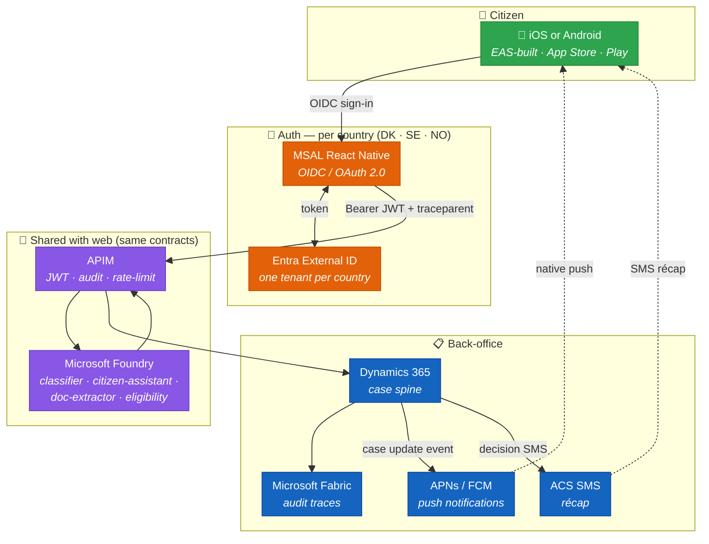
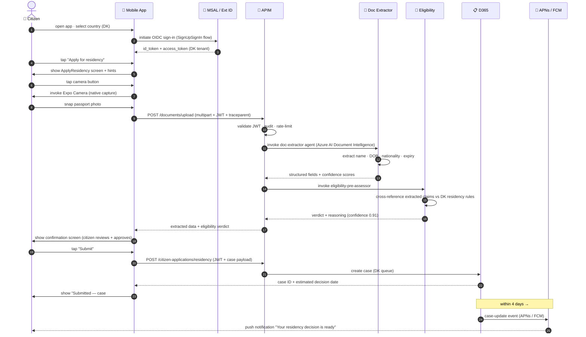
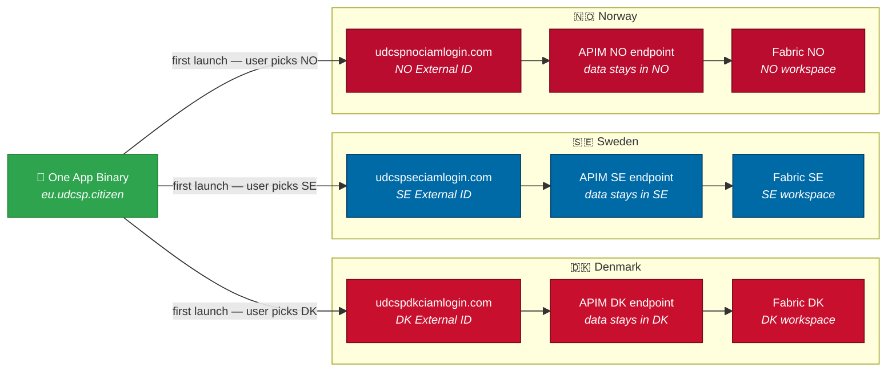
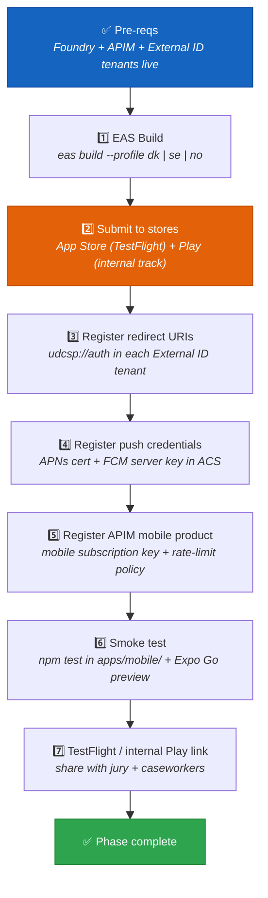

<div align="center">

# 📱 UDCSP — The Mobile App

### One React Native codebase. Three countries. The same Foundry brain as the web.

*How a citizen in Copenhagen, Stockholm, or Oslo opens an app, snaps a photo of their passport or payslip, and gets a government answer in their own language — with native camera capture, push notifications, and the full OS accessibility stack.*

[](#)
[](#)
[](#)
[](#)

[](#)
[](#)
[](#)
[](#)

</div>

---

> [!IMPORTANT]
> **TL;DR.** A citizen opens the UDCSP mobile app → **MSAL React Native** authenticates them against their country's **Microsoft Entra External ID** tenant → the app calls the **same APIM** gateway that the web portal uses → the **same Foundry agents** reason over the request → results (decisions, case status, eligibility) are pushed back as a **native push notification** (APNs / FCM) and shown in the app. Native extras — camera capture for ID or document scanning, biometric re-auth, OS locale propagation — make tasks frictionless that would be laborious on a browser. **One brain, many faces** — the mobile app is a channel adapter, not a second AI system.
>
> | Field | Value |
> |---|---|
> | 🗄️ **Where stored** | Same as web: `bot_session`, Redis ephemeral drafts plus PostgreSQL JSONB persisted drafts, ADLS `citizen-uploads/`, AI Search memory, App Insights traces; push receipts in Azure Cache for Redis Enterprise (ephemeral state) + PostgreSQL JSONB (drafts over 24 h) (TTL 30 days). |

> ℹ️ **Live vs roadmap.** Web portal is live on `udcsp.fredgis.com`. A packaged iOS / Android build and the Verified ID cross-border credential flow are **roadmap** — see [`../tech/inprogress.md`](../tech/inprogress.md).

---

> [!NOTE]
> The mobile app participates in **Microsoft Entra Verified ID** flows: it can present and receive cross-border residency credentials and eligibility receipts through the EUDI Wallet bridge (`infra/identity/verified-id/`).

## 📑 Table of contents

1. [Why a mobile app at all](#1-why-a-mobile-app-at-all)
2. [The mental model in one picture](#2-the-mental-model-in-one-picture)
3. [The lifecycle of one critical journey, step by step](#3-the-lifecycle-of-one-critical-journey-step-by-step)
4. [The six building blocks](#4-the-six-building-blocks)
5. [Multilingual — same 12-language bundle as the web](#5-multilingual--same-12-language-bundle-as-the-web)
6. [Accessibility — VoiceOver, TalkBack, dynamic type, reduced motion](#6-accessibility--voiceover-talkback-dynamic-type-reduced-motion)
7. [Sovereignty — one app, three OIDC authorities](#7-sovereignty--one-app-three-oidc-authorities)
8. [SLOs, risks, and mitigations](#8-slos-risks-and-mitigations)
9. [📷 Native capabilities — camera, push, biometric login](#9--native-capabilities--camera-push-biometric-login)
10. [The activation runbook](#10-the-activation-runbook)
11. [How to test it (three levels)](#11-how-to-test-it-three-levels)
12. [The demo script for a jury](#12-the-demo-script-for-a-jury)
13. [Anti-patterns we avoid](#13-anti-patterns-we-avoid)
14. [Where the conversation is stored](#14-where-the-conversation-is-stored)

---

## 1. Why a mobile app at all

The case study is explicit (`docs/biz/case-study-11.md` § AI Infusion Point):

> *"A GenAI citizen assistant answers service queries in natural language across web, mobile, and telephone channels."*

Mobile is not optional. Four reasons it is a **first-class** channel in UDCSP, not a checkbox:

- 📲 **Mobile-first usage in the Nordics.** Denmark, Sweden, and Norway consistently rank in the top tier of global smartphone penetration. The majority of citizens already reach government services from a phone first. A web-only strategy leaves them on a constrained browser; a native app gives them the platform they actually use.
- 📷 **Native camera capture.** Submitting a passport scan, a payslip, or a lease from a browser requires downloading, scanning, uploading. From the mobile app it is: open app → tap → done. The `ApplyResidency` and income-supplement flows depend on this capability. Demo 4 (`uses.md`) is built around it:

  > *"Erik opens the UDCSP mobile app, takes pictures of his last three payslips, and the platform extracts the figures, computes a provisional eligibility, and tells him in plain Danish what to expect — all in under 3 minutes from the citizen's side."*

- 🔔 **Push notifications for case status.** Citizens should not have to poll a portal. When a caseworker closes a case or the eligibility model returns a result, the citizen's phone lights up — within 30 s p95. Timely notifications are a direct driver of the **+38 % CSAT** outcome promised by the case study.
- 🧏 **OS-level accessibility stack.** VoiceOver (iOS) and TalkBack (Android) are far more mature than any custom accessibility widget a web developer can build. By putting citizen journeys in a native app, UDCSP inherits the entire OS accessibility infrastructure — screen readers, dynamic type, reduced motion, high-contrast mode — at zero marginal cost.

The design principle, codified in `docs/biz/uses.md` § Demo 4:

> *"The citizen took photos — they did not fill in numbers. The AI did the typing. The citizen approved."*

> *"That is the kind of friction removal that drives the +38 % CSAT outcome."*

---

## 2. The mental model in one picture



> 📖 **Reading the picture.** Green = citizen device. Orange = auth layer (per-country, sovereignty-preserving). Purple = the shared AI brain — the **same** Foundry agents and **same** APIM gateway that serve the web portal. Dark blue = back-office. **The brain is shared; only the auth and notification channels are mobile-specific.**

The i18n bundles (`apps/web/i18n/messages/*.json`) and all Foundry agent definitions are **identical** to those used by the web channel — there is no mobile-specific fork of any AI logic.

---

## 3. The lifecycle of one critical journey, step by step

Camera-capture journey: a citizen captures a passport to apply for residency.



**Latency budget** (target: document upload → eligibility result p95 ≤ 4 s):

| Hop | Budget | How we hit it |
|---|---|---|
| Camera capture → upload | ~500 ms | JPEG compressed client-side before upload |
| APIM JWT validation | ~30 ms | Cached JWKS per country |
| Doc Extractor (AI Document Intelligence) | ~1 500 ms | Pre-built layout model; no training required |
| Eligibility pre-assessor | ~800 ms | Small classification step before citizen-assistant |
| APIM → app response | ~50 ms | Same-region APIM + App Insights |
| Push notification delivery | ≤ 30 s p95 | ACS + APNs/FCM direct path |

---

## 4. The six building blocks

| # | Block | What it does | Where it lives |
|:-:|---|---|---|
| **1** | **Expo managed workflow** | One React Native codebase cross-compiled to iOS + Android via EAS Build. Three build profiles (`dk`, `se`, `no`) inject `UDCSP_COUNTRY` at build time. | `apps/mobile/app.json`, `apps/mobile/eas.json`, `apps/mobile/package.json` |
| **2** | **`App.tsx` + screens** | Root entry point + six screens: `Home`, `Login`, `ApplyResidency`, `MyCases`, `CaseDetail`, `AccessibilitySettings`. Every screen exposes `accessibilityRole="header"` on its title. | `apps/mobile/App.tsx`, `apps/mobile/src/screens/*.tsx` |
| **3** | **MSAL React Native + External ID** | OIDC sign-in and token management via `@azure/msal-react-native ^0.4.0`. Authority is computed per country: `https://udcsp{dk|se|no}.ciamlogin.com/...`. Stub in `externalIdAuth.ts` is replaced with a real interactive flow when tenant registrations exist. | `apps/mobile/src/auth/externalIdAuth.ts`, `infra/identity/external-id/{dk,se,no}-external-id.bicep` |
| **4** | **Shared i18n — 12 languages from the web** | The `loadWebCatalogue()` function in `apps/mobile/src/i18n/index.ts` dynamically imports `apps/web/i18n/messages/{lang}.json`. The mobile app carries **no duplicate string files** — it resolves the web bundle at runtime. Supported locales: `da sv nb nn se en de fr pl ar uk fi`. | `apps/mobile/src/i18n/index.ts`, `apps/web/i18n/messages/*.json` |
| **5** | **APIM client** | `apiFetch<T>()` in `apps/mobile/src/api/client.ts` — retries (up to 3 attempts with exponential back-off), injects `traceparent` W3C header for distributed tracing, reads `EXPO_PUBLIC_APIM_BASE_URL`. Calls the **same 8 APIM APIs** as the web: `citizen-applications`, `documents`, `eligibility-checks`, `notifications`, `case-management`, `agent-citizen-assistant`, `agent-classifier`, `data-export`. | `apps/mobile/src/api/client.ts`, `services/apim/apis/*/openapi.yaml` |
| **6** | **Push notifications via Expo + ACS** | Case-status events from D365 flow via Logic Apps → ACS → APNs (iOS) / FCM (Android). The app registers for push at login; the notification opens the `CaseDetail` screen with the case in context. | `apps/mobile/src/screens/CaseDetail.tsx`, `services/apim/apis/notifications/openapi.yaml` |
| **7** | **Accessibility components** | `AccessibleButton` wraps `Pressable` with `accessibilityRole="button"`, `accessibilityLabel`, and `accessibilityHint`. `ScreenReaderHints` wraps `Text` with `accessibilityLiveRegion="polite"`. `AccessibilitySettingsScreen` lets citizens override theme and font scale. | `apps/mobile/src/components/AccessibleButton.tsx`, `apps/mobile/src/components/ScreenReaderHints.tsx`, `apps/mobile/src/screens/AccessibilitySettings.tsx`, `apps/mobile/src/styles/themes.ts` |

> [!NOTE]
> **One codebase, zero per-country forks.** The build profiles in `eas.json` differ only in the `UDCSP_COUNTRY` environment variable. The app binary is otherwise identical; per-country logic lives entirely in the auth layer (`externalIdAuth.ts`) and the APIM routing header (`X-UDCSP-Country`), not in screen code.

---

## 5. Multilingual — same 12-language bundle as the web

The web portal's i18n pipeline (`apps/web/i18n/messages/*.json`) is the **single source of truth** for all citizen-facing strings across every channel. The mobile app reuses it verbatim — no copy, no second translation pass, no risk of string drift.

```typescript
// apps/mobile/src/i18n/index.ts
const languages = ['da', 'sv', 'nb', 'nn', 'se', 'en', 'de', 'fr', 'pl', 'ar', 'uk', 'fi'];

export async function loadWebCatalogue(lang) {
  const catalogue = await import(`../../../web/i18n/messages/${lang}.json`);
  return catalogue.default ?? catalogue;
}
```

The relative path resolves inside the Expo bundler's module graph at build time — no runtime file-system access is needed.

**OS-level locale propagation** — the app reads the device locale on startup (React Native's `NativeModules.I18nManager` / `Intl` API) and selects the closest supported language, falling back to the user's last saved preference and then to English. This means a Danish citizen who switches their iPhone to Norwegian Bokmål gets the app in `nb` **immediately** on next launch, without any settings screen interaction.

| 🏳️ | Language | Bundle key | Notes |
|:-:|---|---|---|
| 🇩🇰 | Danish | `da` | Default for DK country profile |
| 🇸🇪 | Swedish | `sv` | Default for SE country profile |
| 🇳🇴 | Norwegian Bokmål | `nb` | Default for NO country profile |
| 🇳🇴 | Norwegian Nynorsk | `nn` | Alternative for NO |
| 🏴󠁳󠁥󠁳󠁭󠁡󠁿 | Northern Sámi | `se` | Minority language, NO/SE |
| 🇬🇧 | English | `en` | Global fallback |
| 🇩🇪 | German | `de` | New-resident community |
| 🇫🇷 | French | `fr` | New-resident community |
| 🇵🇱 | Polish | `pl` | Largest non-Nordic minority |
| 🇸🇦 | Arabic | `ar` | RTL, tested in CI |
| 🇺🇦 | Ukrainian | `uk` | Refugee community |
| 🇫🇮 | Finnish | `fi` | Cross-border corridor |

> [!NOTE]
> **Why share bundles instead of embedding them?** Because citizen-facing strings are a governance artifact: they are reviewed by translators, legal teams, and plain-language editors. A separate mobile bundle would immediately diverge. By referencing `apps/web/i18n/messages/` at build time, the mobile app is automatically updated every time the web i18n pipeline is updated — and `Validate-Translations.ps1` in CI enforces completeness for both channels in one pass.

---

## 6. Accessibility — VoiceOver, TalkBack, dynamic type, reduced motion

The mobile app uses the **OS accessibility stack**, not custom WCAG widgets. React Native's `Pressable`, `Text`, and `View` components map directly to native iOS `UIAccessibilityElement` and Android `AccessibilityNodeInfo` objects — the same objects that VoiceOver and TalkBack consume. This is a deliberate architectural choice: no bespoke widget can match the breadth or quality of the OS stack.

### 6.1 `AccessibleButton` — the primary interactive primitive

Every tappable action in the app goes through `AccessibleButton` (`apps/mobile/src/components/AccessibleButton.tsx`):

```tsx
<Pressable
  accessibilityRole="button"
  accessibilityLabel={label}   // read by VoiceOver / TalkBack
  accessibilityHint={hint}     // "what happens if I activate this"
  onPress={onPress}
>
  <Text style={{ color: '#fff', fontWeight: '600' }}>{label}</Text>
</Pressable>
```

The CI test in `apps/mobile/tests/button.test.tsx` asserts `getByLabelText('Continue')` resolves — this is the lightweight accessibility regression guard for every pull request.

### 6.2 `ScreenReaderHints` — live-region announcements

Status changes (upload progress, eligibility verdict, error messages) are announced to screen readers immediately via `accessibilityLiveRegion="polite"`:

```tsx
<Text accessibilityLiveRegion="polite">
  {children}   // e.g. "Uploading document… 60 %"
</Text>
```

`ScreenReaderHints` is used on every screen (`Login`, `ApplyResidency`, `MyCases`, `CaseDetail`, `AccessibilitySettings`) as the standard status-announcement channel.

### 6.3 `AccessibilitySettingsScreen` — user overrides

Citizens can override the OS theme and font scale from within the app (`apps/mobile/src/screens/AccessibilitySettings.tsx`). The `themes.ts` module exports three named themes:

| Theme | Background | Foreground | Primary |
|---|---|---|---|
| `light` | `#fff` | `#111827` | `#005ea8` |
| `dark` | `#111827` | `#fff` | `#7dd3fc` |
| `highContrast` | `#000` | `#fff` | `#ffff00` |

High-contrast mode sets a 4.5 : 1 minimum contrast ratio on all interactive elements — meeting WCAG 2.1 AA at the theme level, not via per-widget overrides.

### 6.4 Reduced motion

React Native's `useReduceMotion()` hook (Expo SDK 52) is consumed wherever animated transitions are defined. When the OS "Reduce Motion" preference is on, transitions skip animation entirely.

> [!TIP]
> **Accessibility is a gate, not a feature.** The CI pipeline (`tests/accessibility/`) runs `axe-react-native` on every pull request. A single critical violation blocks the merge. This mirrors the web channel's `axe-core` gate and ensures WCAG 2.1 AA compliance degrades no faster than the test suite runs.

---

## 7. Sovereignty — one app, three OIDC authorities



**Decision: one binary, three OIDC authorities.** On first launch the citizen picks their country of residence; the app stores that choice in `expo-secure-store` and routes all auth and API calls to the corresponding country lane. The authority URL is computed at runtime by `authorityForCountry()` in `externalIdAuth.ts`:

```typescript
export const authorityForCountry = (country: Country) =>
  `https://udcsp${country}.ciamlogin.com/udcsp${country}.onmicrosoft.com/SignUpSignIn`;
```

**Why one app beats three separate apps:**

| Concern | One app | Three apps |
|---|---|---|
| Update cadence | Single release → all three countries | Three separate release schedules, three review queues |
| Bug fixes | Fix once | Fix three times |
| Store ASO | One listing per store | Three listings, three privacy policies, three review histories |
| Data sovereignty | Preserved at the **auth + API + data** layer (External ID tenant, APIM routing, Fabric workspace) | Preserved at the **binary** layer — brittle and hard to audit |
| A/B testing | Cross-country in one experiment | Impossible without external tooling |

What stays in-country: **authentication tokens, citizen PII, case data, document images, push notification tokens, analytics telemetry**. What is shared cross-country: **the app binary, the i18n bundles, the Foundry agent definitions, the APIM contracts**. The separation is enforced at the auth and API layers, not the app layer — which is where GDPR requires it to be.

The EAS build profiles (`eas.json`) set `UDCSP_COUNTRY` at build time so that store listings in each country's App Store / Play Store can link directly to the correct onboarding flow. Three build channels — `denmark`, `sweden`, `norway` — but **one codebase, one test suite, one release**.

---

## 8. SLOs, risks, and mitigations

| | SLO | Target | How we measure |
|:-:|---|---|---|
| ⚡ | **App cold-start** (splash → Home screen interactive) | p95 ≤ **2 s** | Expo performance events; EAS Insights |
| 🔔 | **Push notification delivery** (D365 event → device) | p95 ≤ **30 s** | App Insights custom event from Logic App trigger to APNs/FCM ACK |
| 💥 | **Crash-free sessions** | ≥ **99.5 %** | EAS / Expo Crash Reporting |
| ♿ | **Accessibility audit pass** | **100 %** on VoiceOver + TalkBack | Automated `axe-react-native` per PR; manual audit per release |
| 📤 | **Document upload + extraction** (tap → result) | p95 ≤ **4 s** | App Insights custom event: camera-capture-start → eligibility-response |
| 🌐 | **API availability** (APIM mobile product) | ≥ **99.9 %** monthly | APIM metrics + synthetic probes every 5 min per country |

**Mobile-relevant risks from `docs/tech/plan.md` § Risk register:**

| Risk ID | Risk | Mitigation |
|---|---|---|
| **R6** | Accessibility regressions late in delivery. | `axe-react-native` gate from first PR; manual audit before each store release; design-system-first approach (A9/A12). |
| **R7** | Tenant sprawl in Entra External ID — three OIDC authorities to maintain. | Strict naming + IaC-only tenant configuration; `infra/identity/external-id/{dk,se,no}-external-id.bicep` owned by A2. |
| **R9** | Cost overrun on Foundry / OpenAI usage driven by mobile document-extraction volume. | Per-agent quotas set in APIM; rate-limit policy on the `documents` API product; FinOps dashboard in Power BI. |
| **R12** | Multilingual quality drift — 12 languages, two channels (web + mobile). | Shared bundles (`apps/web/i18n/messages/`) prevent drift; `Validate-Translations.ps1` runs in CI for both channels. |
| **R13** | Installer drifts behind mobile build artefacts. | `Install-Apps.psm1` pins EAS build artefact hashes; every PR to `apps/mobile/` triggers a smoke install. |

---

## 9. 📷 Native capabilities — camera, push, biometric login

Three native bridges make the mobile app more powerful than a mobile browser.

### 9.1 Camera capture — Expo Camera

**What it does:** Citizens take a photo of a document (passport, payslip, lease) directly inside the app. The JPEG is compressed client-side (target: < 500 KB) before upload.

> [!NOTE]
> **Scaffold status — read this before demoing.** The current `apps/mobile/src/screens/` set ships the auth, navigation, accessibility, push and case screens, but **`CaptureScreen.tsx` is not yet present**. The pieces that *are* shipped: (a) the EAS build profiles request `ios.infoPlist.NSCameraUsageDescription` + `android.permissions: ["CAMERA"]`, (b) the `expo-image-picker` and `expo-camera` packages are listed in `apps/mobile/package.json`, (c) the upload contract `POST /documents/upload` is fully defined in `services/apim/apis/documents/openapi.yaml` and the Foundry `doc-extractor` agent consumes it. Wiring the missing screen against that contract is a finite scaffolding task (~1 sprint), not a research item. Demo 4 in `recipe.md` should therefore be run from the **web upload** path until the mobile capture screen is delivered.

**Where it is exercised:**
- `ApplyResidency` screen — passport / ID card capture for residency applications.
- Income-supplement flow (Demo 4) — payslip capture: three photos → three extraction calls → aggregate income figure.

**The contract:** `POST /documents/upload` in `services/apim/apis/documents/openapi.yaml` — `multipart/form-data` with fields `file` (JPEG), `documentType` (`passport | payslip | lease | other`), `country`, and the standard `traceparent` header.

**Upstream processing:** APIM routes to the **Doc Extractor** Foundry agent, which calls Azure AI Document Intelligence (pre-built layout model). Structured fields (name, DOB, employer, gross amount, period) are returned with per-field confidence scores. The citizen reviews extracted values on a confirmation screen before the application is submitted.

> [!TIP]
> The camera path requires `expo-camera` permissions configured in `app.json` (`ios.infoPlist.NSCameraUsageDescription`, `android.permissions: ["CAMERA"]`). These are already scaffolded in the EAS build profiles.

### 9.2 Push notifications — Expo Notifications + ACS

**What it does:** When a D365 case changes state (decision ready, document requested, case closed), a Logic App publishes the event to ACS, which forwards it to APNs (iOS) or FCM (Android). The notification deep-links to the `CaseDetail` screen with the case ID pre-loaded.

**The contract:** `POST /notifications/send` in `services/apim/apis/notifications/openapi.yaml` — payload includes `caseId`, `messageKey` (resolved against the i18n bundle in the citizen's locale), and `channel: push`.

**Registration flow:** On first login, the app calls `Notifications.getExpoPushTokenAsync()`, stores the token in `expo-secure-store`, and registers it with the APIM notifications endpoint so D365 can address push to the correct device + country.

**SLO:** Push delivery p95 ≤ 30 s, measured from the Logic App trigger event timestamp to the APNs/FCM delivery ACK logged in App Insights.

### 9.3 Biometric re-auth — MSAL biometric prompt

**What it does:** After the initial OIDC sign-in (which may require MitID / BankID / BankID NO through the External ID user flow), the MSAL token cache is locked behind the device biometric (Face ID / Touch ID / fingerprint). On subsequent app opens, citizens authenticate with biometrics rather than re-entering credentials.

**Where it is configured:** `apps/mobile/src/auth/externalIdAuth.ts` — the MSAL `PublicClientApplication` is configured with `keychainSharingGroup` (iOS) and `BrokerRedirectUriRegistered` so the token cache survives app updates without requiring re-login.

**Security note:** Biometric auth protects the MSAL token cache; it does **not** weaken the underlying OIDC assurance level. The External ID token still carries the national eID assurance level (`acr` claim). Biometric is a re-auth convenience, not a downgrade of the initial authentication.

---

## 10. The activation runbook



**Step notes:**

1. **EAS Build** — `eas build --profile dk` produces a signed `.ipa` / `.aab`. The `UDCSP_COUNTRY=dk` env var is injected by the EAS profile; no code change is needed to switch countries.
2. **Store submission** — TestFlight for iOS (instant for internal testers, 1–3 days for external); Google Play internal track (usually < 1 hour). For a jury demo, TestFlight + internal Play track are sufficient.
3. **Redirect URI** — `udcsp://auth` (the `scheme` from `app.json`) must be registered in each External ID tenant's app registration. This is a one-line IaC change in `infra/identity/external-id/{dk,se,no}-external-id.bicep`.
4. **Push credentials** — APNs p8 key (from Apple Developer portal) and FCM server key (from Google Cloud Console) are stored in Key Vault and referenced by the Logic App that forwards D365 case-update events.
5. **APIM mobile product** — a separate APIM product scopes the mobile subscription key and applies the mobile-specific rate-limit policy (stricter than the web on document upload to cap AI Document Intelligence costs).
6. **Smoke test** — `npm test` in `apps/mobile/` runs the Jest unit tests (AccessibleButton label, traceparent format). Expo Go preview validates the full navigation flow without a store submission.
7. **TestFlight / Play link** — the jury receives an invite link; they install in < 2 minutes.

All of steps 1 and 3–5 are automated by `scripts/install/modules/Install-Apps.psm1` (phase 9 of the master installer). Steps 2 and 7 are manual — no installer can submit to a regulated app store review queue on your behalf.

---

## 11. How to test it (three levels)

| Level | Command | What it proves | Lead time |
|---|---|---|---|
| **🚦 Smoke (unit)** | `npm test` (in `apps/mobile/`) | `AccessibleButton` exposes correct `accessibilityLabel`; `traceparent` header matches W3C format `00-{32hex}-{16hex}-01`. No network. | < 15 s |
| **🧪 E2E (simulated)** | `npx expo start` + Expo Go on a device / simulator | Full navigation flow (Home → Login → ApplyResidency → MyCases → CaseDetail → AccessibilitySettings) against the DEV APIM. VoiceOver / TalkBack can be toggled during the session. | ~2 min |
| **📱 Live (store builds)** | TestFlight (iOS) or Play internal track (Android) | The full signed-binary path — real push notifications, real MSAL biometric prompt, real APIM JWT, real camera. Validates store provisioning profiles and redirect URI registration. | Manual (install once) |

> [!NOTE]
> The QA agent (A14) scaffolded Playwright E2E tests for the web channel (`tests/e2e/`). Mobile-specific Appium / Detox tests are planned in `tests/e2e/` under the `mobile/` sub-folder and are seeded in the accessibility test suite (`tests/accessibility/`). Until those are wired to a device farm, Expo Go on a real device is the practical E2E harness for the mobile channel.

---

## 12. The demo script for a jury

5 minutes, no setup beyond the deployed DEV environment and a TestFlight / Play internal-track install:

| Beat | Action | What the jury sees | Eval-matrix rows hit |
|:-:|---|---|---|
| 1 | Open the app; the device locale is `da-DK`; the app launches in Danish | Home screen in DA; no locale picker needed — OS locale propagated automatically | #5 (AI 12 lang) · #8 (a11y) · #12 (channels) |
| 2 | Tap "Sign in"; authenticate with synthetic MitID credential (from A15 persona "Erik Hansen") | MSAL launches the DK External ID browser sheet; MitID flow completes; access token returned | #2 (ID federation) · #10 (sovereignty) |
| 3 | Tap "Apply for income supplement" → tap camera → snap the synthetic payslip (from `data/synthetic/documents/`) | Camera opens natively; photo taken; upload spinner; within 4 s: extracted gross amount DKK 42 500, employer "Hansen Tømrer ApS", confidence 0.97 | #3 (28d→4d) · #6 (assistant) · #7 (eligibility) · #14 (services) |
| 4 | Review the confirmation screen; tap "Submit" | Case ID `DK-2024-00123` shown; "Decision expected in 4 days". Trace ID visible under "Decision details". | #15 (audit) · #17 (synth data) |
| 5 | Enable VoiceOver (iOS) or TalkBack (Android); navigate back to Home with gestures | Screen reader announces every element correctly (`"Start residency application, button — Opens the residency form"`); no unlabelled interactive elements | #8 (WCAG) · #12 (channels) |

This corresponds to **Demo 4** in [`uses.md`](./uses.md#-demo-4--erik-snaps-a-payslip-for-an-income-based-benefit-danish-mobile).

> [!TIP]
> For an even stronger jury impression, open the App Insights dashboard on a second screen while running beat 3. The `traceparent` injected by the mobile client links the camera-capture event in the app to the Doc Extractor trace in Foundry to the D365 case-create call — **one distributed trace, three hops, zero gaps**. That is the audit trail the DPO (Demo 7) will query six months later.

---

## 13. Anti-patterns we avoid

| ❌ Anti-pattern | ✅ What we do instead |
|---|---|
| Per-country app forks (three separate repos / binaries) | One codebase, one binary; per-country logic lives in the auth + APIM layer, not the app layer |
| Native iOS / Android codebases instead of one Expo codebase | Expo managed workflow: one JS bundle, EAS builds the native shells; one team, one test suite, one release cycle |
| Custom accessibility widgets that bypass the OS stack | React Native's `accessibilityRole`, `accessibilityLabel`, `accessibilityHint` map to native UIAccessibility / AccessibilityNodeInfo — no bespoke widgets needed |
| Hard-coded API URLs in source | `EXPO_PUBLIC_APIM_BASE_URL` from EAS build environment; no URL in committed source |
| Secrets in `app.json` or `eas.json` | All secrets (MSAL client IDs, push credentials, APIM keys) live in Key Vault; only non-secret config in `app.json` and `eas.json` |
| Polling for case-status updates | Push notifications (APNs / FCM) via ACS — no polling, no battery drain, p95 ≤ 30 s delivery |
| Separate i18n bundles for mobile | `loadWebCatalogue()` imports from `apps/web/i18n/messages/` at build time — single source of truth, zero string drift |
| Per-channel Foundry agents | The same `citizen-assistant`, `doc-extractor`, and `eligibility-pre-assessor` agents serve web and mobile; mobile is a channel adapter, not a second AI system |

---

## 14. Where the conversation is stored

Mobile intentionally shares the web channel's storage pattern because the app embeds the same bot/widget bundle in a WebView and calls the same APIM contracts. Native additions — camera captures and push receipts — land in the same document and operational stores rather than creating a second mobile-only archive. See [`../tech/data.md`](../tech/data.md) § 3.3 for the Zone 3 policy.

| What | Where | Retention |
|---|---|---|
| Bot transcript | Foundry `topic-router` Dataverse `bot_session` | 6 months hot; 6 years OneLake |
| Camera-captured documents | ADLS Gen2 `citizen-uploads/` (same as web) | While case open + lifecycle tiers |
| Drafts + push receipts | Azure Cache for Redis Enterprise (ephemeral state) + PostgreSQL JSONB (drafts over 24 h) | Draft TTL 30 days; receipts TTL 30 days |
| Memory + traces | Azure AI Search; App Insights → OneLake Bronze | Memory TTL 12 months; traces 180 days hot |

For the full retention matrix, use [`../tech/data.md`](../tech/data.md) § 5.

> 📖 Full storage architecture and retention rules: see [`../tech/data.md`](../tech/data.md).

---

<div align="center">

*The mobile app is the most personal front door of UDCSP — a camera, a fingerprint, and a push notification away from government.*  🇩🇰 🇸🇪 🇳🇴

[](./uses.md#-demo-4--erik-snaps-a-payslip-for-an-income-based-benefit-danish-mobile)
[](../tech/agents.md)
[](../tech/installation.md)

</div>
