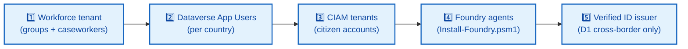

# 👥 UDCSP — Demo Personas & Identity Provisioning

### Every named human in `uses.md`, the AD they live in, the licences they need

*Citizens authenticate through per-country **CIAM** (Microsoft Entra External ID + national eID broker). Back-office staff live in a single **workforce Entra ID** tenant. Both are seeded with **synthetic** A15 personas — no real PII anywhere.*

---

> [!IMPORTANT]
> **TL;DR.** Two identity worlds, never mixed.
> **🪪 Citizen world** — one **CIAM (External ID)** tenant per country (`udcspdk` · `udcspse` · `udcspno`), brokered to **MitID / BankID / BankID Norge** in production, email + OTP in the sandbox. Provision **4 citizen accounts** to play all demos.
> **🧑‍💼 Workforce world** — a **single UDCSP system Entra ID tenant** holds caseworkers, the DPO, the SOC analyst, the CIO and the SRE. Provision **7 workforce accounts** — and add the DK / SE / NO caseworkers as Application Users in the Dataverse environments they triage.
>
> | Tenant | Role of accounts here | Min. count |
> |---|---|---:|
> | 🇩🇰 `udcspdk.ciamlogin.com` | Citizens applying as Danes | **3** |
> | 🇸🇪 `udcspse.ciamlogin.com` | Citizens applying as Swedes | **0** *(planned: Verified ID auto-issues at D1; provision manually until issued)* |
> | 🇳🇴 `udcspno.ciamlogin.com` | Citizens applying as Norwegians | **1** |
> | 🏢 UDCSP system Entra | All back-office staff | **7** |

---

## 📑 Table of contents

1. [🪪 Citizens — Microsoft Entra **External ID** (CIAM)](#-citizens--microsoft-entra-external-id-ciam)
2. [🧑‍💼 Back-office staff — Microsoft Entra **ID** (workforce)](#-back-office-staff--microsoft-entra-id-workforce)
3. [🤖 Persona-less actors (agents & system MIs)](#-persona-less-actors-agents--system-mis)
4. [🔧 Provisioning order](#-provisioning-order)
5. [🔗 See also](#-see-also)

---

## 🪪 Citizens — Microsoft Entra **External ID** (CIAM)

> [!NOTE]
> One CIAM tenant per country. Citizens authenticate via **MitID** (DK) / **BankID** (SE) / **BankID Norge** (NO) brokered by **Criipto / Signicat** in production; via email + OTP in the sandbox. The exact eID-broker contract lives in [`../tech/architecture.md` § 4](../tech/architecture.md#4-identity-federation-detail).

| | Persona | 🎬 Demo | 🌍 Country | 📧 Suggested UPN |
|:-:|---|:-:|:-:|---|
| 👩‍💻 | **Anna Jensen** — *34, software engineer, Copenhagen → Stockholm* | **D1** | 🇩🇰 DK | `anna.jensen@udcspdk.onmicrosoft.com` |
| 👩‍🦯 | **Maria Kowalska** — *41, Polish citizen in Copenhagen, NVDA user* | **D3** | 🇩🇰 DK | `maria.kowalska@udcspdk.onmicrosoft.com` |
| 👨‍🔧 | **Erik Hansen** — *52, freelance carpenter in Aarhus* | **D4** | 🇩🇰 DK | `erik.hansen@udcspdk.onmicrosoft.com` |
| 👴 | **Lars Berg** — *67, retired, Norwegian Bokmål speaker* | **D2** | 🇳🇴 NO | `lars.berg@udcspno.onmicrosoft.com` |

> [!TIP]
> **Anna's Swedish account is planned to be created automatically by Verified ID** at the cross-border step in D1. Verified ID issuance is **not yet wired** — for now, provision an `anna.jensen@udcspse.onmicrosoft.com` account upfront so the demo can skip the (currently mocked) VID step.

> [!NOTE]
> **Maria's Polish UI** is driven by an `extension_uiLanguage = pl` claim on her CIAM profile — the SPA reads it on sign-in and loads `pl.json` for `i18next`. No extra account, just one custom attribute.

### 📊 Per-tenant footprint

| Tenant | Accounts to provision | Used in |
|---|---|:-:|
| 🇩🇰 **`udcspdk.ciamlogin.com`** | Anna · Maria · Erik | **D1 · D3 · D4** |
| 🇸🇪 **`udcspse.ciamlogin.com`** | *(none required once Verified ID auto-issues at D1; provision manually until then)* | **D1** *(target side)* |
| 🇳🇴 **`udcspno.ciamlogin.com`** | Lars | **D2** |

---

## 🧑‍💼 Back-office staff — Microsoft Entra **ID** (workforce)

> [!IMPORTANT]
> All caseworkers, DPOs, SOC analysts, CIOs and SREs live in the **UDCSP system tenant** — *not* in any per-country CIAM. Rationale: caseworkers triage cases from any country via **D365 / Power Apps**, and the system tenant is where **Logic Apps / APIM managed identities** are scoped (see [`../tech/inprogress.md` § Caseworker UI strategy](../tech/inprogress.md#caseworker-ui-strategy-d7)).

| | Persona | 🎬 Demo | 🛠️ Role | 🌍 Queue | 🎫 Licences | 👥 Group |
|:-:|---|:-:|---|:-:|---|---|
| 👩‍💼 | **Astrid Lindgren** — *38, senior caseworker, Stockholm* | **D1 · D5 · D6** | Caseworker | 🇸🇪 SE | D365 CS Enterprise · Copilot for Service · Power Apps per-app | `udcsp-caseworkers-se` |
| 👩‍💼 | **Caseworker DK** *(implicit in D3 — receives Maria's case translated to DA)* | **D3** | Caseworker | 🇩🇰 DK | D365 CS Enterprise · Copilot for Service | `udcsp-caseworkers-dk` |
| 👨‍💼 | **Caseworker NO** *(implicit in D2 — voice warm-transfer target)* | **D2** | Caseworker | 🇳🇴 NO | D365 CS Enterprise · Copilot for Service | `udcsp-caseworkers-no` |
| 🧑‍⚖️ | **Hans Bjerg** — *Data Protection Officer, Danish administration* | **D7** | DPO | 🇩🇰 DK *(scoped)* | Purview Compliance Reader · Priva DSR Operator | `udcsp-dpo` |
| 🛡️ | **Ingrid Olsen** — *SOC analyst, federation security ops* | **D8** | SOC analyst | 🇪🇺 federation-wide | Sentinel Reader/Responder · Defender for Cloud Reader | `udcsp-soc` |
| 👔 | **Henrik Lund** — *CIO, federated programme* | **D9** | Executive / governance | 🇪🇺 federation-wide | Power BI Pro · Fabric Capacity Viewer | `udcsp-execs` |
| 👨‍💻 | **Ole Sørensen** — *DevOps engineer evaluating UDCSP for adoption* | **D10** | Platform engineer / SRE | 🇪🇺 federation-wide | Owner on sandbox sub · Azure DevOps Contributor | `udcsp-platform-engineers` |

### 📊 Workforce headcount

| Bucket | Accounts | Demos covered |
|---|:-:|---|
| 👩‍💼 Caseworkers (DK · SE · NO) | **3** | D1 · D2 · D3 · D5 · D6 |
| 🧑‍⚖️ DPO | **1** | D7 |
| 🛡️ SOC | **1** | D8 |
| 👔 CIO / Exec | **1** | D9 |
| 👨‍💻 SRE / DevOps | **1** | D10 |
| **Total** | **7** | **D1 → D10** |

> [!NOTE]
> The 3 caseworkers must also be added as **Application Users** in their country's Dataverse environment (`org7e9... DK`, `orgda2... SE`, `org... NO`) with role **Customer Service Representative**. APIM and Logic Apps managed identities sit in the same Dataverse with **System Customizer + Basic User** — covered in [`../tech/installation.md` § Step 3.5](../tech/installation.md).

---

## 🤖 Persona-less actors (agents & system MIs)

> [!TIP]
> These appear in `uses.md` as if they were "characters" but are **not human accounts** — they're **Foundry agents** or **service principals**. Listed here so a reader doesn't waste time provisioning a tenant account for `Citizen Assistant` 😉.

| Actor | 🎬 Demo(s) | Identity | Where it lives |
|---|:-:|---|---|
| 🤖 **Eligibility Pre-Assessor** | D1 · D6 | Foundry project MI | `udcspai/udcsp` → `udcsp-eligibility:2` |
| 🤖 **Citizen Assistant** | D1 · D2 · D3 · D8 | Foundry project MI | `udcsp-citizen-assistant:1` |
| 🤖 **Topic Router** | every chat / voice | Foundry project MI | `topic-router:1` |
| 🤖 **Document Extractor** | D3 · D4 | Foundry project MI | `udcsp-doc-extractor:1` |
| 🤖 **Translator** | D1 · D3 · D5 | Foundry project MI | `udcsp-translator:1` |
| 🤖 **Caseworker Helper** | D5 · D6 | Foundry project MI | `udcsp-caseworker-helper:2` |
| 🤖 **Classifier** | every intake | Foundry project MI | `udcsp-classifier:1` |
| 🔐 **APIM system MI** | every API call | System-assigned MI | `udcsp-{country}-prod-apim` → Application User in Dataverse `org939d8f07` |
| ⚙️ **Logic Apps system MI** | every case write | System-assigned MI | `udcsp-{country}-dev-application-intake` → Application User w/ **System Customizer + Basic User** |

---

## 🔧 Provisioning order

1. **🏢 Workforce tenant first** — create the `udcsp-caseworkers-{dk,se,no}`, `udcsp-dpo`, `udcsp-soc`, `udcsp-execs`, `udcsp-platform-engineers` security groups, then provision the 7 staff accounts and add them to the right group.
2. **🗄️ Dataverse Application Users** — promote the 3 caseworkers + APIM MI + Logic Apps MI in each country's environment ([`../tech/installation.md` § Step 3.5](../tech/installation.md)).
3. **🪪 CIAM tenants** — provision the 4 citizen accounts after the per-country SPA app registration is in place ([`../tech/installation.md` § Step 2](../tech/installation.md)).
4. **🤖 Foundry agents** — already created by `Install-Foundry.psm1`; re-deploy only if the project endpoint changes (see [`../tech/inprogress.md` § Foundry agents](../tech/inprogress.md)).
5. **🔐 Verified ID issuer** *(roadmap — not yet wired)* — required to demo the D1 cross-border auto-onboarding step into the SE tenant; until then, pre-provision the SE account manually.

---

## 🔗 See also

| Doc | What it covers |
|---|---|
| 📖 [`uses.md`](./uses.md) | The 10 end-to-end demo scripts these personas play. |
| 🪪 [`../tech/architecture.md` § 4](../tech/architecture.md#4-identity-federation-detail) | Identity federation — citizen CIAM vs workforce Entra ID, eID broker layer, per-country tenants. |
| 🛠️ [`../tech/installation.md`](../tech/installation.md) | App registrations, redirect URIs, Application Users in Dataverse, role assignments. |
| 🧑‍💼 [`./caseworker.md`](./caseworker.md) | Caseworker channel deep-dive — D365 + Copilot for Service. |

---

*Personas are synthetic. Tenants are real. Provision once, demo forever.* 🚀

