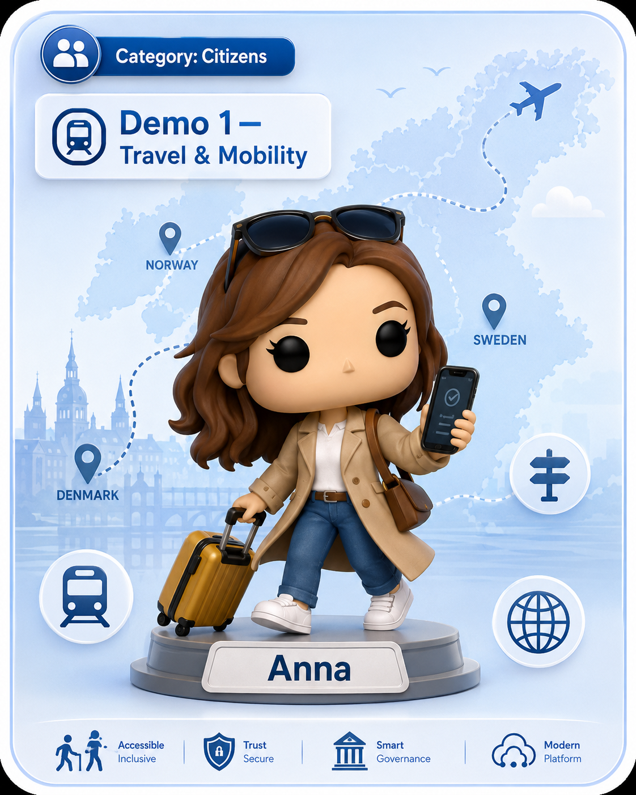
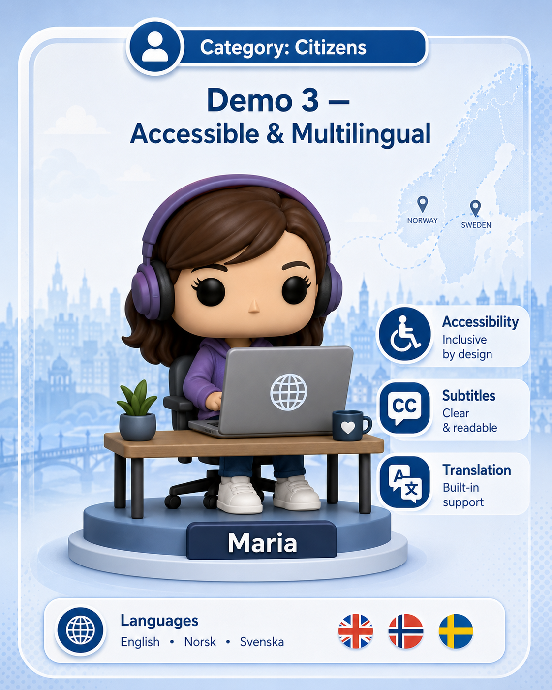
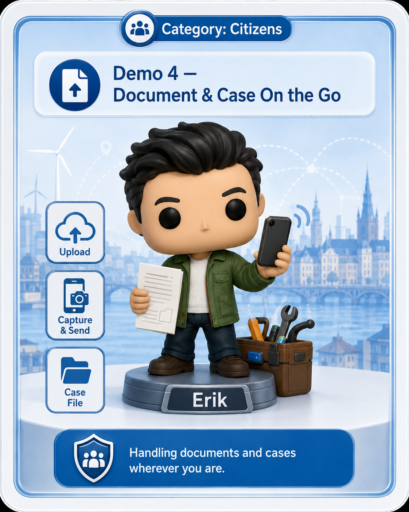
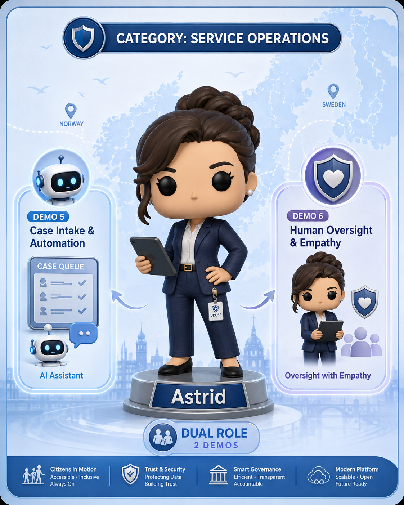
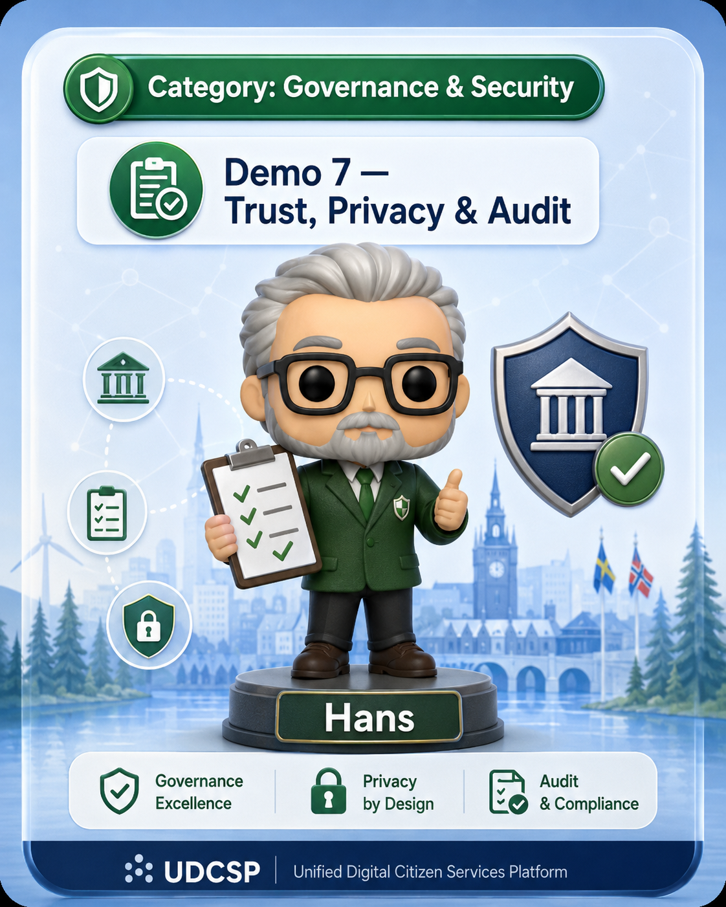
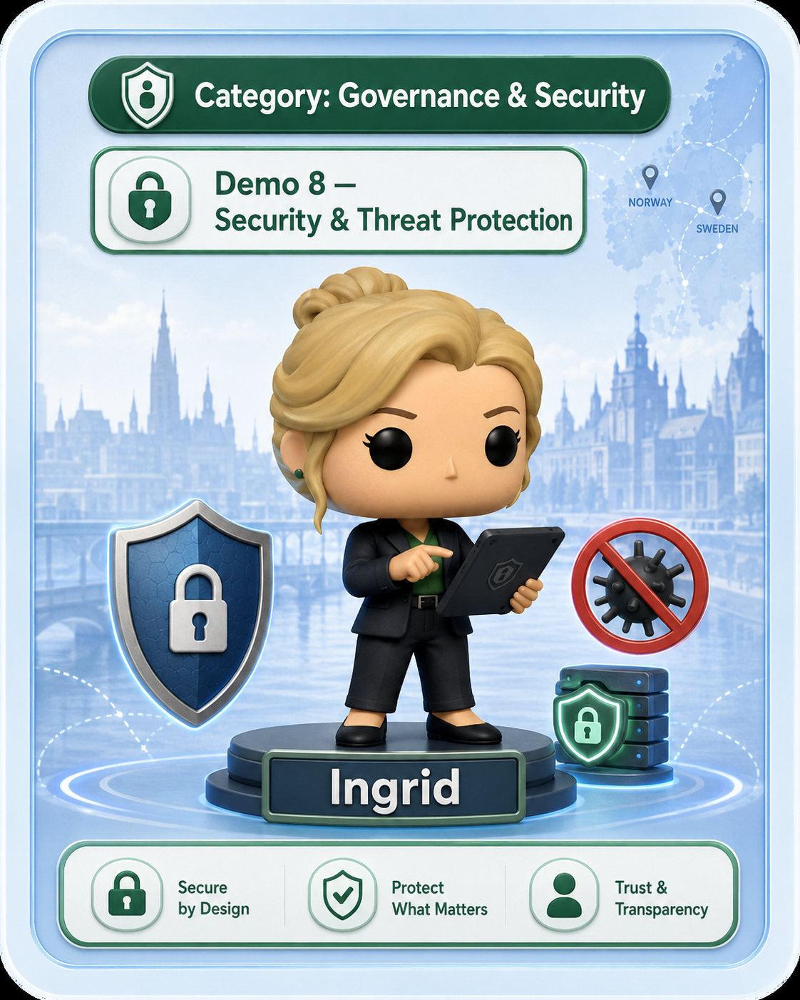
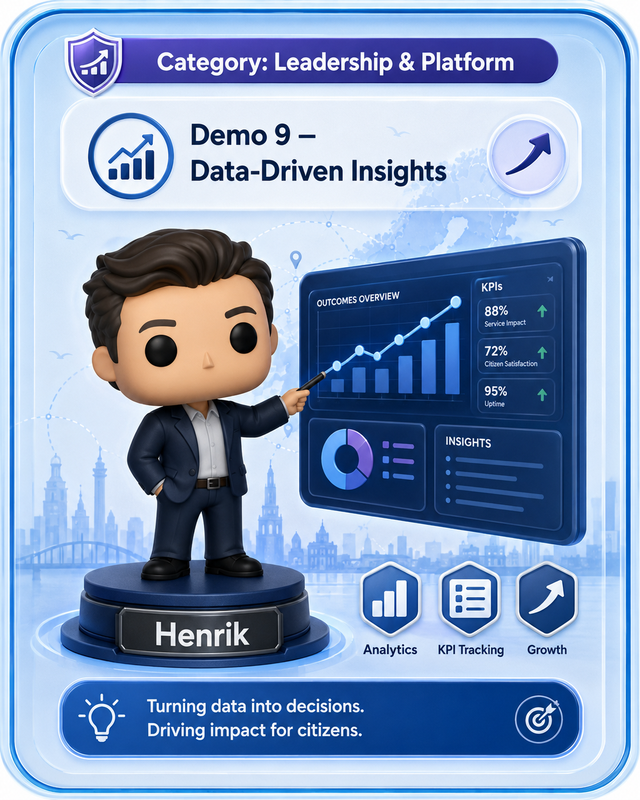

# 🍳 UDCSP — Acceptance Recipe

_Last verified: 2026-08-11 · commit f0bd850 + pending security remediation (not deployed)_

### 8 scenarios · ≈ 1 h 15 walkthrough · 100 % eval coverage

*A mixed-status walkthrough for evaluating live paths, source-only controls, and roadmap gaps after installation. It mirrors [`uses.md`](./uses.md) demos 1-8; demos 9-10 are not exercised live.*

---

> **Audience:** evaluators and platform owners walking through the platform end-to-end after install.
>
> **Goal:** verify each requirement against its actual live, partial, in-repo, scripted, or roadmap status, in the same order an auditor would follow.

> ℹ️ **Live vs target steps.** Scenarios 1 (Anna · DK→SE) and 2 (Lars · voice) include steps that depend on D365 Customer Service per country + Verified ID issuance, which are **not yet provisioned**. Today, Scenario 2 runs in **no-handoff mode** (citizen↔AI loop only, verbal callback closure) and Scenario 1's SE landing is mocked via the shared Dataverse Power App. See [`../tech/inprogress.md`](../tech/inprogress.md) for the canonical live-vs-roadmap split.
>
> **Security remediation status:** 🔵 **In repo**, not deployed. Document fields are synthetic filename inferences, voice transcript content is not retained in corrected telemetry, citizen DSR identity is bound to the caller only in pending source, delegated DPO requests need a separate actor contract, and the lineage endpoint has no backend. Status vocabulary: 🟢 **Live** · 🟡 **Partially deployed** · 🔵 **In repo** · ⚙️ **Scripted** · 🗺️ **Roadmap**.

Each step names the file or surface involved, the expected outcome, and the matching eval row and scenario. Some steps inspect source or target contracts rather than live behavior; those steps are labelled.

This recipe is split into **collapsible sections**. Click any ▶ to expand.

| # | Persona / theme | Use case (one-liner) | Channel | ⏱️ Time | Eval-matrix rows |
|---|---|---|---|---|---|
| 🟩 **1** | 👩‍💼 Anna — cross-border identity & residency (DK → SE) | Anna moves from Copenhagen to Stockholm and registers her Swedish residency using her Danish eID. | 🌐 Web | ~15 min | 1, 2, 3, 7, 12, 13 |
| 🟪 **2** | 👨‍🦯 Lars — accessibility voice journey (NO) | Lars, blind, calls in Norwegian to check a tax-refund case and is warm-transferred to a human. | 📞 Voice | ~10 min | 4, 5, 11, 12, 17 |
| 🟨 **3** | 👩‍🍼 Maria — Polish caregiver, screen-reader application (SE) | Maria applies for child benefit in Sweden using NVDA + keyboard, in Polish end-to-end. | 🌐 Web + 🦮 NVDA | ~10 min | 4, 5, 13 |
| 🟧 **4** | 👨‍🔧 Erik: DK SMB mobile payslip upload | Erik uploads a payslip; the current AI returns synthetic filename-inferred fields, not document extraction. | 📱 Mobile | ~10 min | 7, 13, 16 |
| 🟫 **5** | 👩‍⚖️ Astrid — SE caseworker reviews AI pre-assessment | Astrid triages her D365 queue with Copilot, inspects AI reasoning, overrides one decision. | 🖥️ D365 | ~10 min | 6, 7, 12, 14, 15 |
| ⬛ **6** | 🧑‍💼 Hans: DK DPO reviews the DSR contract | Citizen self-service is caller-bound in source. Delegated DPO export and Purview lineage are roadmap. | 🛡️ APIM + governance | ~5 min | 8, 9, 10, 18 |
| 🟥 **7** | 🦸‍♀️ Ingrid — SOC investigates impossible-travel alert | Ingrid investigates a Sentinel alert on a caseworker account, runs the containment playbook. | 🛰️ Sentinel | ~10 min | 9, 10 |
| 🟦 **8** | 👨‍💻 Henrik — CIO opens the cockpit | Henrik reads per-country / per-language outcomes; confirms 28→4-day SLA + 47-portal sunset. | 📊 Power BI | ~5 min | 11, 16 |
| | | | **Total** | **≈ 1 h 15** | |

---

<h2>🟩 1. Scenario 1 — 👩‍💼 Anna moves Denmark → Sweden (cross-border identity &amp; residency)</h2>

> *Anna moves from Copenhagen to Stockholm and registers her residency in Sweden using her Danish eID — one journey, two countries, one identity.*

> Maps to: **uses.md scenario 01** · **eval-matrix rows 1, 2, 3, 7, 12, 13**

| # | Action | Where | Expected outcome |
|---|---|---|---|
| 1.1 | Open the Swedish citizen portal | `https://udcsp-se.swa.azurestaticapps.net/` | Portal loads in Swedish (auto-detected) |
| 1.2 | Click "Logga in med dansk eID" | Login page | Federated External ID flow → DK External ID → eIDAS bridge → SE External ID |
| 1.3 | Confirm citizen lands authenticated as `anna@SYNTH-PERSONAS-DK` | Portal header | Display name + DK→SE migration banner shown |
| 1.4 | Apply for residency permit | Wizard "Apply / Boenderegistrering" | Multi-step accessible form, ARIA live region, no a11y violations |
| 1.5 | Upload payslip + passport scan (samples in `data/synthetic/documents/`) | Upload step | Current Doc Extractor returns synthetic fields inferred from the filename. After remediation, the response must visibly show `synthetic: true` and `provenance: inferred-from-filename`. |
| 1.6 | Submit application | Final step | Citizen sees confirmation #, SLA 4 days, AI assistant offers next steps in Swedish |
| 1.7 | Switch to caseworker view (D365) | `https://udcspse.crm4.dynamics.com/main.aspx?appid=UDCSP_CaseWorker` | Case appears in queue with AI pre-assessment, BPF at stage "Caseworker review" |
| 1.8 | Open AI pre-assessment trace | "Show AI reasoning" tab | Show the metadata available on the exercised path. Do not present synthetic document fields as extracted evidence or claim complete prompt and lineage capture. |
| 1.9 | Caseworker approves | "Approve" button | Decision logged, citizen notified in Swedish, case closed |
| 1.10 | Verify trace propagation | App Insights transaction view, filtered by the case `traceparent` | Correlated spans for the components that are instrumented. Complete D365 and Fabric lineage is not an acceptance result today. |

**Exit gate:** live steps match their documented status, a trace ID is propagated where wired, and no synthetic field or missing lineage hop is presented as evidence.

---

<h2>🟪 2. Scenario 2 — 👨‍🦯 Lars (NO) accessibility voice journey 📞</h2>

> *Lars, blind, calls in Norwegian to check the status of a tax-refund case and is warm-transferred to a human caseworker — no screen needed.*

> Maps to: **uses.md scenario 02** · **eval-matrix rows 4, 5, 11, 12, 17**

| # | Action | Where | Expected outcome |
|---|---|---|---|
| 2.1 | Look up the bound NO PSTN number | `apps/voice/acs/phone-number-bindings.yaml` — entry where `country: no` | E.164 number + `inboundWebhook: https://voice-no.udcsp.no/api/acs/eventgrid`. If still `placeholder: true`, bind a real one per [`installation.md` § C1](../tech/installation.md#-c--optional-only-if-you-need-them) |
| 2.2 | Smoke the orchestrator (no PSTN required) | `pwsh apps/voice/scripts/Test-Voice.ps1 -Country no -Env dev -OrchestratorBaseUrl https://voice-no.udcsp.no` | `healthz` returns `ok=true country=no liveMode=true`; the synthetic Event Grid handshake succeeds |
| 2.3 | **Real-call path** — dial the NO number, ask in Bokmål: « Hva er statusen på sak NO-2026-0117? » | Voice (PSTN) | Orchestrator answers in Norwegian, plays the recording-consent disclosure, opens gpt-realtime, and routes through APIM to the Foundry topic-router |
| 2.4 | Verify the APIM hop happened | App Insights query: `requests \| where url contains "/agents/topic-router/messages" and customDimensions["x-channel-actor"] == "voice" \| where timestamp > ago(2m)` | Exactly one HTTP 200 with `traceparent` linking back to the ACS call leg |
| 2.5 | Listen to the spoken status answer | Voice playback | Status read with the `nb-NO-FinnNeural` neural voice |
| 2.6 | Say « Snakk med saksbehandler » | Voice | Warm transfer to the D365 voice queue (`Voice.no.d365VoiceQueueId`) |
| 2.7 | Hang up and inspect the trace | App Insights transaction view, filtered by the `traceparent` from 2.4 | Correlated ACS, voice, APIM, and Foundry metadata. Transcript content and tool argument values are absent after the pending source fix is deployed. |
| 2.8 | (Optional, CI) Re-run the function-tool unit suite | `cd apps/voice/call-automation && npm test` | All tests pass — proves GPT Realtime → APIM contract & IVR DTMF routing without a PSTN call |

**Exit gate:** voice path works without touching a screen and the APIM hop is correlated. Warm transfer is a roadmap gate. Observability must show event metadata and `traceparent`, not transcript content. Without a real PSTN number, steps 2.1, 2.2, and 2.8 demonstrate the source path only.

---

<h2>🟨 3. Scenario 3 — 👩‍🍼 Maria (PL caregiver in SE) screen-reader application 🦮</h2>

> *Maria, Polish caregiver in Sweden, applies for child benefit using only NVDA + keyboard, in her own language end-to-end.*

> Maps to: **uses.md scenario 03** · **eval-matrix rows 4, 5, 13**

| # | Action | Where | Expected outcome |
|---|---|---|---|
| 3.1 | Open SE portal with NVDA running | Browser + NVDA | Page lang attribute switches when Maria selects Polish |
| 3.2 | Navigate via keyboard only to "Child benefit" | Tab key | Visible focus indicators on every focusable element, skip-nav works |
| 3.3 | Apply for child benefit | Wizard | All form labels announced; error messages programmatic + ARIA-live |
| 3.4 | Trigger validation error | Submit blank required field | Focus moves to first error, error summary read aloud |
| 3.5 | Fix and submit | Final | Confirmation in Polish; AI assistant in Polish offers follow-up |
| 3.6 | Run automated axe scan | `pwsh tests/accessibility/scripts/Run-Accessibility.ps1 -Scenario 3` | Zero WCAG 2.1 AA violations |

**Exit gate:** zero a11y violations across the journey; Polish language preserved end-to-end.

---

<h2>🟧 4. Scenario 4 — 👨‍🔧 Erik (DK SMB) mobile payslip upload 📱</h2>

> *Erik uploads a payslip from mobile. The current demonstrator infers synthetic fields from the filename. Real extraction is roadmap, and AI remains assistive.*

> Maps to: **uses.md scenario 04** · **eval-matrix rows 7, 13, 16**

| # | Action | Where | Expected outcome |
|---|---|---|---|
| 4.1 | Launch Expo dev build of the mobile app | `apps/mobile` | DK External ID login screen |
| 4.2 | Login with `erik@SYNTH-PERSONAS-DK` | Native OIDC flow | Token acquired |
| 4.3 | Take a photo of the payslip stub | `data/synthetic/documents/payslip_dk_001.jpg` | Image uploaded. The current extractor does not read it; Document Intelligence is 🗺️ Roadmap. |
| 4.4 | App displays demonstrator fields | Form prefill | Values are synthetic filename inferences and must be labelled with provenance before the user confirms. |
| 4.5 | App calls Foundry eligibility agent via APIM | Background | < 4 s, response contains AI Act registry ID and confidence |
| 4.6 | App displays pre-assessment + "Talk to a human" link | Result screen | Citizen retains agency; nothing auto-decided |

**Exit gate:** AI is assistive, synthetic provenance is visible, and no claim of operational Purview lineage is made.

---

<h2>🟫 5. Scenario 5 — 👩‍⚖️ Astrid (SE caseworker) reviews AI pre-assessment</h2>

> *Astrid, Swedish caseworker, triages her queue with Copilot for Service, inspects the AI reasoning, overrides one decision and the override feeds shadow-mode metrics.*

> Maps to: **uses.md scenario 05** · **eval-matrix rows 6, 7, 12, 14, 15**

| # | Action | Where | Expected outcome |
|---|---|---|---|
| 5.1 | Astrid opens her queue | Shared Dataverse Power App today; D365 Customer Service is roadmap | Current shell shows the partial caseworker path. |
| 5.2 | Open a case | Case form | Inspect the advisory recommendation and available summary. |
| 5.3 | Click "Show AI reasoning" | Side panel | Show available model metadata. Synthetic document fields must remain labelled and cannot be treated as evidence. |
| 5.4 | Disagree with AI assessment | Disposition control | Current path records a partial Dataverse disposition. Canonical `udcsp_caseworker_decision` persistence and Fabric mirroring are roadmap. |
| 5.5 | Publish a decision | Current caseworker path | Verify only the notification and persistence behavior that is actually wired. |
| 5.6 | Inspect agreement metrics | Operator workbook or source assets | The complete shadow-mode dashboard and feedback loop are roadmap. |

**Exit gate:** the advisory nature of AI is visible, the partial disposition path is demonstrated honestly, and no automatic feedback or complete lineage claim is made.

---

<h2>⬛ 6. Scenario 6: 🧑‍💼 Hans (DK DPO) reviews the Subject Access Request contract 🛡️</h2>

> *Hans verifies what is implemented for citizen self-service and what still requires a delegated DPO actor contract.*

> Maps to: **uses.md scenario 06** · **eval-matrix rows 8, 9, 10, 18**

| # | Action | Where | Expected outcome |
|---|---|---|---|
| 6.1 | Inspect the pending data-export and GDPR APIM policies | `services/apim/apis/data-export/policy.xml` and `services/apim/apis/gdpr/policy.xml` | Subject is derived from the validated token, caller-supplied trusted headers are removed, and a mismatching body subject returns `403`. |
| 6.2 | After deployment, submit a request as Anna for Anna | Data-export endpoint with Anna's token | Request may proceed under the citizen self-service contract. |
| 6.3 | After deployment, submit as Anna with another citizen in the body | Same endpoint | `403` mismatch. The body cannot select another subject. |
| 6.4 | Attempt a DPO-for-citizen request | Separate DPO identity | Expected result: unsupported. Delegation needs a separate authenticated actor contract, role, subject binding, and audit record. |
| 6.5 | Inspect lineage status | Lineage endpoint | Corrected source requires JWT and returns `503` because no backend exists. Purview lineage is not an acceptance result today. |

**Exit gate:** source contract is accurately described, a mismatch is rejected after deployment, delegated DPO access is not simulated with a citizen token, and no operational lineage claim is made.

---

<h2>🟥 7. Scenario 7 — 🦸‍♀️ Ingrid (SOC) investigates impossible-travel alert 🛰️</h2>

> *Ingrid, SOC analyst, opens a Sentinel impossible-travel alert on a caseworker account, runs the containment playbook (session revoked, PIM removed) — covers identity + AI-specific risks.*

> Maps to: **uses.md scenario 07** · **eval-matrix rows 9, 10**

| # | Action | Where | Expected outcome |
|---|---|---|---|
| 7.1 | Ingrid opens Sentinel | Sentinel Workbook in shared sub | "Impossible travel — caseworker" rule has fired (synthetic) |
| 7.2 | Pivot to user investigation | Sentinel investigation graph | Sign-ins, External ID events, role activations stitched |
| 7.3 | Run containment playbook | Sentinel automation `respond-to-impossible-travel` (`infra/security/sentinel/playbooks/`) | User session revoked, PIM eligibility removed, ticket opened in D365 |
| 7.4 | Verify trace | Log Analytics KQL `union ... | where TraceId == 'X'` | Single trace ID shows all SOC actions |

**Exit gate:** AI-specific risks (prompt injection, model misuse) and identity risks both covered.

---

<h2>🟦 8. Scenario 8 — 👨‍💻 Henrik (CIO) opens the cockpit 📊</h2>

> *Henrik, CIO, reads per-country / per-language outcomes in the Power BI cockpit and confirms the 28→4-day SLA + 47-portal sunset are measured automatically.*

> Maps to: **uses.md scenario 08** · **eval-matrix rows 11, 16**

| # | Action | Where | Expected outcome |
|---|---|---|---|
| 8.1 | Henrik opens the executive dashboard | **Executive Cockpit** report in the Power BI Premium workspace (URL = `phases.Fabric.outputs.workspaceUrl/reports/executive-cockpit` from the install report) | KPIs: avg processing days = 4.0, satisfaction = 4.5/5, AI accuracy = 92 % |
| 8.2 | Drill into "AI accuracy by language" | Visual | All 12 languages shown; minority languages within tolerance |
| 8.3 | Drill into "Per-country trends" | Visual | DK / SE / NO compared, no regressions |
| 8.4 | Validate KPI matches Fabric gold | KQL via Real-Time Intelligence | KPI numbers reconcile with `gold.applications_decisions` |

**Exit gate:** business outcome KPIs (28 → 4 days, +38 % CSAT) are measured automatically.

> **Note.** Two demos from [`uses.md`](./uses.md) are intentionally **not exercised live** in this recipe:
> - **Demo 9 — Ole, DevOps reproducible install.** A full tear-down + re-install takes ~90 min. Proof of reproducibility is the `install-report.json` already produced when you ran the platform — diff two consecutive runs to verify idempotence.
> - **Demo 10 — Evaluator cross-cutting walkthrough.** Run automatically by the QA pipeline (`pwsh ./scripts/install/Install-UDCSP.ps1 -Phase QA -SmokeOnly -EvaluatorMode`); the HTML report it produces is the deliverable artefact, no live re-play needed.

— A14 · QA & Evaluation
