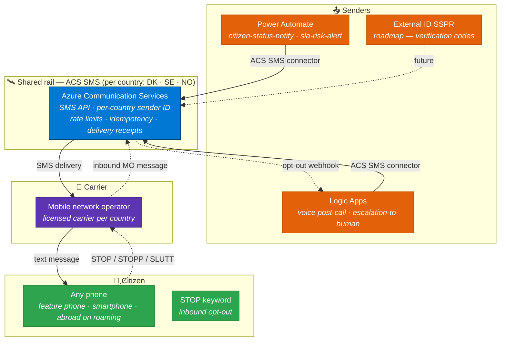
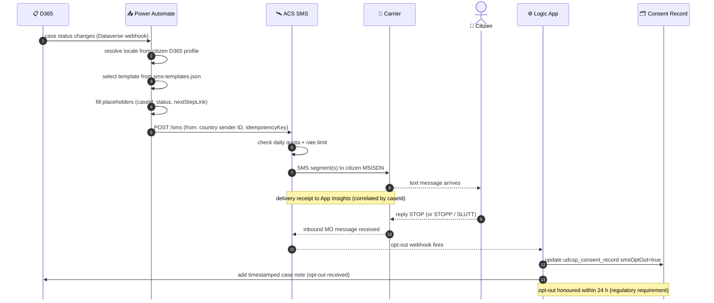
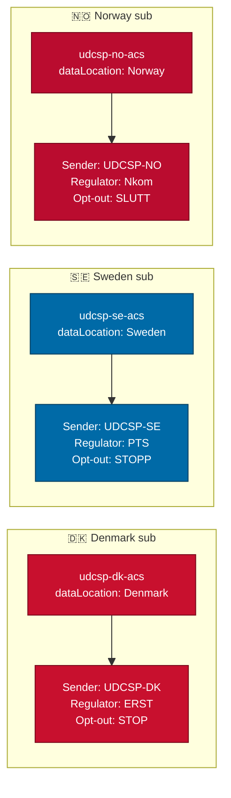
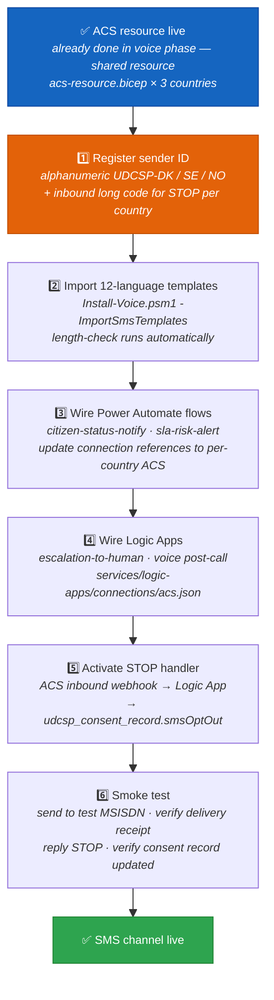

<div align="center">

# 📲 UDCSP — The SMS Channel

### Transactional notifications across every other channel

*How a case-status change in D365, a voice-call récap, or an SLA breach warning becomes a text message on a citizen's phone — in their own language, from a country-pinned number, with GDPR-compliant consent and a STOP keyword that actually works.*

[](#)
[](#)
[](#)
[](#)

[](#)
[](#)
[](#)
[](#)

</div>

---

> [!IMPORTANT]
> **TL;DR.** A citizen's phone receives a text from UDCSP through one shared rail: **Azure Communication Services SMS**. Three categories of sender use it — **Power Automate** (`citizen-status-notify`, `sla-risk-alert`), **Logic Apps** (voice post-call récap, escalation notifications), and (**roadmap**) **External ID SSPR verification codes**. Every SMS is localised in **12 languages**, sent from a **per-country sender ID**, rate-limited to protect the FinOps budget, and carries no PII beyond a case ID and a short branded portal link. The STOP keyword is honoured within 24 hours and writes `smsOptOut=true` to the `udcsp_consent_record` in D365.

---

## 📑 Table of contents

1. [Why an SMS channel at all](#1-why-an-sms-channel-at-all)
2. [The mental model in one picture](#2-the-mental-model-in-one-picture)
3. [The send lifecycle, step by step](#3-the-send-lifecycle-step-by-step)
4. [The five building blocks](#4-the-five-building-blocks)
5. [Multilingual — 12 templates per message type](#5-multilingual--12-templates-per-message-type)
6. [Accessibility & inclusivity — SMS as the inclusivity rail](#6-accessibility--inclusivity--sms-as-the-inclusivity-rail)
7. [Sovereignty — one ACS resource per country](#7-sovereignty--one-acs-resource-per-country)
8. [Compliance — opt-in, GDPR Art. 7 consent, regulator rules](#8-compliance--opt-in-gdpr-art-7-consent-regulator-rules)
9. [📲 Getting a real SMS-capable number (or sender ID)](#9--getting-a-real-sms-capable-number-or-sender-id)
10. [The activation runbook](#10-the-activation-runbook)
11. [How to test it (three levels)](#11-how-to-test-it-three-levels)
12. [The demo script for a jury](#12-the-demo-script-for-a-jury)
13. [Anti-patterns we avoid](#13-anti-patterns-we-avoid)

---

## 1. Why an SMS channel at all

The case study is explicit (`docs/biz/case-study-11.md` § AI Infusion Point + § Expected Outcomes):

> *"A GenAI citizen assistant answers service queries in natural language across web, mobile, and **telephone** channels."*
> *"Citizen satisfaction scores increased by **38 %**, full **WCAG 2.1 AA** accessibility compliance achieved."*

SMS is the glue that closes the loop across every one of those channels. Four reasons it earns first-class status in UDCSP:

- 📱 **Universal reach.** SMS arrives on every phone — no app, no data plan, no smartphone required. A 70-year-old with a feature phone and a refugee with a prepaid SIM card are equally reachable. The case study serves **2.1 million citizens across three countries**; no other channel covers that entire population.
- ✈️ **Works abroad.** When Anna moves from Copenhagen to Stockholm (Demo 1 in `docs/biz/uses.md`), her case-status notifications follow her across borders via roaming SMS — no app install, no login, no data plan. EU/EEA roaming is included in every consumer tariff.
- 🏛️ **Regulator-mandated for some steps.** Nordic eGovernment frameworks require proof of notification for certain administrative workflows. The architecture roadmap (`docs/tech/architecture.md` line 907) explicitly notes: *"email today, SMS roadmap"* for SSPR — SMS verification codes are the designated second factor for the citizen Self-Service Password Reset flow.
- 🔔 **The lowest-friction nudge.** SMS open rates exceed 90 %. It is the most reliable "you have an update — visit the portal" signal, opening the door to web, mobile, voice, or caseworker — whichever the citizen prefers.

The design principle is codified in [`voice.md` § 3 step 17](./voice.md#3-the-call-lifecycle-step-by-step):

> *"Post-call, Lars receives an SMS in NB summarising the case ID and next step (sent via ACS)."*

SMS is not just a notification rail — it is **voice's post-call attachment**, the citizen-facing receipt that makes a telephone conversation tangible and auditable.

---

## 2. The mental model in one picture



> 📖 **Reading the picture.** Orange = senders (the callers that ask ACS to send a text). Blue = the ACS SMS API — the **shared rail** used by voice, SMS, and email; the same `udcsp-{country}-acs` resource provisioned by `apps/voice/acs/acs-resource.bicep`. Purple = the carrier (PSTN/SMS network in each country). Green = citizen. The dashed lines trace the inbound STOP flow — the citizen's opt-out travels back through the same ACS resource and triggers the Logic App consent handler.

---

## 3. The send lifecycle, step by step



**Key design decisions in this flow:**

| Decision | Rationale |
|---|---|
| **Idempotency key** per message | Prevents duplicate SMS on Power Automate retry; keyed on `caseId + eventType + timestamp-bucket` |
| **Locale from citizen D365 profile** | Preferred language stored on the citizen record; falls back to country default (`da`, `sv`, `nb`) |
| **Short branded link** not full URL | Full portal URLs exceed the 160-char GSM-7 budget and expose PII query strings |
| **Daily quota per country** | FinOps guard: App Insights alert at 80 % of monthly budget; hard block at 100 % |
| **Delivery receipt to App Insights** | Every sent message is correlated to its case via `correlation-id`; receipt is the audit proof of notification |
| **Consent record checked pre-send** | `apps/d365/solutions/UDCSP_Core/customizations/entities/udcsp_consent_record.xml` — every sender reads `smsOptOut` before calling the ACS API |

---

## 4. The five building blocks

| # | Block | What it does | Where it lives |
|:-:|---|---|---|
| **1** | **Azure Communication Services (SMS)** | Sends and receives SMS. **Same ACS resource per country as voice** — one `udcsp-{dk,se,no}-acs` handles PSTN voice, SMS, and email. `dataLocation` pins all SMS metadata and delivery receipts to the country. | `apps/voice/acs/acs-resource.bicep`, `apps/voice/acs/phone-numbers.bicep` |
| **2** | **Sender identity** | A per-country sender ID (alphanumeric, short code, or long code — see § 9). Provisioned at registration time; **never hard-coded in source**. Placeholder outputs in `phone-numbers.bicep` are replaced at activation. | `apps/voice/acs/phone-numbers.bicep` |
| **3** | **Localised SMS templates** | 3 message types × 12 locale variants. ICU-style `{caseId}`, `{status}`, `{date}`, `{nextStepLink}` placeholders. Length-validated at import time by `Install-Voice.psm1`. | `apps/voice/notifications/sms-templates.json` |
| **4** | **Senders** | Three active senders: **(a)** Power Automate `citizen-status-notify` — D365 case-status changes; `sla-risk-alert` — SLA KPI warnings. **(b)** Logic App `escalation-to-human` — warm-transfer and case-decision notifications. **(c)** Voice post-call Logic App — récap SMS after every ACS call. ACS connection shared by all: `services/logic-apps/connections/acs.json`. | `apps/d365/power-automate-flows/citizen-status-notify.json`, `apps/d365/power-automate-flows/sla-risk-alert.json`, `apps/d365/power-automate-flows/escalation-to-human.json`, `services/logic-apps/workflows/escalation-to-human/` |
| **5** | **Inbound STOP handler** | ACS inbound webhook → Logic App → writes `smsOptOut=true` to `udcsp_consent_record` in D365 and adds a timestamped case note. Per-country opt-out keywords (`STOP` / `STOPP` / `SLUTT`) are handled by the same handler. | `apps/d365/solutions/UDCSP_Core/customizations/entities/udcsp_consent_record.xml`, `services/logic-apps/workflows/escalation-to-human/` |
| **6** | **Audit + cost guardrails** | Per-country daily quotas configured in ACS; App Insights custom event per send and per delivery receipt; FinOps dashboard alerts at 80 % of monthly budget; quiet-hours rate limiter in the Logic App layer. | `infra/observability/`, `services/logic-apps/connections/acs.json` |

> [!NOTE]
> **Email is the sibling, not the twin.** `apps/voice/notifications/email-templates.json` follows the same 12-locale / ICU-placeholder structure and shares the same ACS resource. Email is documented separately; this document covers SMS only.

---

## 5. Multilingual — 12 templates per message type

The template catalogue lives in `apps/voice/notifications/sms-templates.json`. Twelve locales, three message types each (36 strings total):

```json
{
  "da": {
    "caseSubmitted":       "UDCSP: Din ansøgning er modtaget. Sag {caseId}. Se: {nextStepLink}",
    "caseUpdated":         "UDCSP: Sag {caseId} er nu {status}. Se: {nextStepLink}",
    "appointmentReminder": "UDCSP: Påmindelse: aftale {date}. Se: {nextStepLink}"
  },
  "nb": {
    "caseSubmitted":       "UDCSP: Din søknad er mottatt. Sak {caseId}. Se: {nextStepLink}",
    "caseUpdated":         "UDCSP: Sak {caseId} er nå {status}. Se: {nextStepLink}",
    "appointmentReminder": "UDCSP: Påminnelse: avtale {date}. Se: {nextStepLink}"
  },
  "ar": {
    "caseUpdated":         "UDCSP: الحالة {caseId} أصبحت الآن {status}. انظر: {nextStepLink}"
  }
}
```

The 12 locales in delivery order:

| 🏳️ | Locale key | Language | Encoding |
|:-:|:-:|---|:-:|
| 🇩🇰 | `da` | Danish | GSM-7 |
| 🇸🇪 | `sv` | Swedish | GSM-7 |
| 🇳🇴 | `nb` | Norwegian Bokmål | GSM-7 |
| 🇳🇴 | `nn` | Norwegian Nynorsk | GSM-7 |
| 🏔️ | `se` | Northern Sámi | UCS-2 |
| 🇬🇧 | `en` | English (GB) | GSM-7 |
| 🇩🇪 | `de` | German | GSM-7 |
| 🇫🇷 | `fr` | French | GSM-7 |
| 🇵🇱 | `pl` | Polish | UCS-2 |
| 🇸🇦 | `ar` | Arabic (right-to-left) | UCS-2 |
| 🇺🇦 | `uk` | Ukrainian | UCS-2 |
| 🇫🇮 | `fi` | Finnish | GSM-7 |

**Length budget — this matters more than developers expect:**

| Encoding | Single-part budget | Multi-part budget | When triggered |
|---|:-:|:-:|---|
| **GSM-7** | 160 chars | 153 chars / part | Latin scripts — `da`, `sv`, `nb`, `nn`, `en`, `de`, `fr`, `fi` |
| **UCS-2 / UTF-16** | 70 chars | 67 chars / part | Non-Latin or emoji — `se`, `ar`, `uk`, `pl`, or **any** message containing emoji |

Rules enforced by `scripts/install/modules/Install-Voice.psm1` at template import time:

1. All 36 templates are expanded with maximum-length sample placeholder values and checked against the per-encoding budget.
2. UCS-2 templates (`se`, `ar`, `uk`) target the 70-char single-part limit. Each currently fits in one part.
3. **Emoji are forbidden in production templates.** A single emoji forces UCS-2 encoding on the entire message, halving the character budget.
4. `{nextStepLink}` is always a **short branded link** (`udcsp.dk/c/{code}`, `udcsp.se/c/{code}`, `udcsp.no/c/{code}`) — never a full portal URL with query parameters.

> [!WARNING]
> Adding even a single emoji (✅, 🔔, etc.) to any template shifts the whole message to UCS-2, potentially turning a single-part SMS into a two-part SMS and doubling the carrier cost across millions of sends. Run `Install-Voice.psm1 -ValidateTemplates` before committing any template change.

---

## 6. Accessibility & inclusivity — SMS as the inclusivity rail

The case study demands **WCAG 2.1 AA compliance** and a **38 % satisfaction increase** across 2.1 M citizens with very different digital literacy levels. SMS is the silent engine behind both.

**Why SMS is the inclusivity rail of UDCSP:**

- 📱 **Feature-phone compatible.** No smartphone, no app, no data plan required. A citizen with a 2005 Nokia receives a case-status update as reliably as one with a flagship phone.
- ✈️ **Works abroad and while roaming.** Nordic citizens travel — and move between countries (Demo 1, Demo 2). EU/EEA SMS roaming is universal and free in all Nordic markets. No configuration required by the citizen.
- 👁️ **Screen-reader-friendly by default.** SMS messages are plain text. Every accessibility tool (VoiceOver, TalkBack, built-in on feature phones) reads them aloud without any configuration — no ARIA attributes, no semantic markup required.
- 📡 **No internet connection required.** In areas with mobile voice coverage but no mobile data (rural Norway, mountain Sweden), SMS still arrives. The web portal may be unreachable; the text still lands.
- 🗣️ **Plain language, no jargon.** Templates are written to CEFR B1 reading level or below in every locale: no legalese, no abbreviations, no full domain URLs. The `{nextStepLink}` is a six-character branded code, not a 200-character URL with JSON-encoded query parameters.
- 🌍 **12 languages, no assumptions about digital literacy.** The A12 (Accessibility & Localisation) work package reviews every locale variant for plain-language compliance.

> [!TIP]
> For citizens who have indicated a **voice preference** in their D365 profile (often elderly citizens or those with reading difficulties), the SMS is kept to a single sentence with the short link. The full update is available on the voice channel — the SMS acts as a low-friction trigger: *"there is news about your case; call or visit the portal to hear it."*

---

## 7. Sovereignty — one ACS resource per country



What sovereignty means in practice for each country:

| | 🇩🇰 Denmark | 🇸🇪 Sweden | 🇳🇴 Norway |
|---|---|---|---|
| **ACS resource** | `udcsp-dk-acs` | `udcsp-se-acs` | `udcsp-no-acs` |
| **`dataLocation`** | `Denmark` | `Sweden` | `Norway` |
| **Sender ID** | `UDCSP-DK` | `UDCSP-SE` | `UDCSP-NO` |
| **Telecom regulator** | ERST (Energistyrelsen) | PTS (Post- och telestyrelsen) | Nkom (Nasjonal kommunikasjonsmyndighet) |
| **Opt-out keyword** | `STOP` | `STOPP` | `SLUTT` |
| **SMS metadata pinned to** | Denmark data centre | Sweden data centre | Norway east data centre |
| **Delivery receipts retained in** | DK Fabric workspace | SE Fabric workspace | NO Fabric workspace |

The load-bearing Bicep knob — `apps/voice/acs/acs-resource.bicep`:

```bicep
resource acs 'Microsoft.Communication/communicationServices@2023-04-01-preview' = {
  name: 'udcsp-${country}-acs'
  location: 'Global'
  properties: {
    dataLocation: location   // 'Denmark' | 'Sweden' | 'Norway'
  }
}
```

**A cross-country SMS is never sent.** A Danish citizen always receives a text from the Danish ACS resource with the Danish sender ID, regardless of which country's caseworker handled the underlying case. The Power Automate flow resolves the correct ACS resource from the citizen's country of residence, not the caseworker's country.

What is shared cross-country: **anonymised metrics + the Foundry agent definitions** (the brain is shared; the SMS data is not). This is the same sovereignty model documented in [`voice.md` § 7](./voice.md#7-sovereignty--one-acs-resource-per-country) for voice — SMS simply adds the sender-ID dimension.

---

## 8. Compliance — opt-in, GDPR Art. 7 consent, regulator rules

| Compliance constraint | Requirement | How UDCSP satisfies it |
|---|---|---|
| **Transactional SMS** | GDPR Art. 6(1)(e): public-task lawful basis covers status notifications to citizens | Transactional SMS (case updates, SLA warnings, appointment reminders) sent under public-task basis — no opt-in required, but opt-out is always available and trivial |
| **Marketing or engagement SMS** | GDPR Art. 7: freely given, specific, informed, unambiguous consent required | UDCSP sends **no marketing SMS**. The `smsConsent` flag on `udcsp_consent_record` is a hook for future use only |
| **STOP keyword** | EU Directive 2002/58/EC + Nordic national telecom law | ACS inbound webhook → Logic App → `udcsp_consent_record.smsOptOut = true` within **24 h** of receipt |
| **Alphanumeric sender registration** | ERST/PTS/Nkom require public authorities to pre-register alphanumeric sender IDs | Sender IDs registered via ACS portal during provisioning (§ 9); no spoofable or unregistered senders |
| **Quiet hours** | Nordic consumer protection frameworks: no commercial SMS 22:00–08:00 local time | Logic App rate-limiter blocks sends outside 08:00–20:00; safety-critical notifications (e.g. identity compromise alerts) are exempt |
| **Delivery receipt retention** | Internal audit: proof that citizen was notified | ACS delivery receipts → App Insights → per-country Fabric workspace, correlated with `caseId` and `correlation-id` |
| **PII minimisation** | GDPR Art. 5(1)(c): data minimisation principle | SMS body contains only: UDCSP brand + `{caseId}` + status word + short portal link. **No citizen name, no address, no decision text in the SMS body.** |

The consent record — `apps/d365/solutions/UDCSP_Core/customizations/entities/udcsp_consent_record.xml` — is the single source of truth for a citizen's notification preferences. Every outbound sender checks `smsOptOut` before calling the ACS SMS API.

> [!NOTE]
> **GDPR Art. 6(1)(e) vs. Art. 7.** UDCSP keeps two categories strictly separate: **(1) transactional** (case status, SLA warning, appointment reminder) — lawful basis is public task under Art. 6(1)(e); no explicit consent needed, opt-out always available; **(2) consent-based** (future: proactive engagement, SSPR codes) — requires `smsConsent=true` on `udcsp_consent_record`. This separation ensures future consent-based features can be added without touching the transactional flow, and that a transactional opt-out (`STOP`) cannot inadvertently opt the citizen out of a safety-critical consent-based notification.

---

## 9. 📲 Getting a real SMS-capable number (or sender ID)

This is the practical question — *can we show the jury a real SMS arriving on a phone?* **Yes**, and it is faster to provision than a voice number. Here is the playbook.

### 9.1 Three options — pick the right one

| Option | What it is | Lead time | Best for | Nordic availability |
|---|---|:-:|---|---|
| **Alphanumeric sender ID** | A text string up to 11 chars (e.g. `UDCSP-DK`) as the "from" field | 3–5 business days (carrier pre-registration) | Transactional notifications from a named public authority | DK ✅ · SE ✅ · NO ✅ |
| **Short code** | A 4–6 digit number (e.g. `12345`) | 2–6 weeks (regulator approval) | High-volume sends, two-way SMS at scale | DK ✅ · SE ✅ · NO on request |
| **Long code (mobile-originated)** | A full MSISDN (e.g. `+45 30 12 34 56`) | Instant in some markets | Lower-volume, two-way SMS, dev/test STOP handling | Varies by carrier |

> [!WARNING]
> **Alphanumeric sender IDs are outbound-only.** A citizen cannot reply to an alphanumeric sender. You must configure a **long code** in the same ACS resource as the inbound number for STOP/STOPP/SLUTT handling. ACS then routes inbound messages from that long code to your opt-out webhook even though outbound messages show the alphanumeric sender.

### 9.2 Eligibility and pre-requisites

| Pre-requisite | Why | How to satisfy |
|---|---|---|
| **Paid Azure subscription** | ACS SMS provisioning blocked on free / trial / sponsored subscriptions | Pay-as-you-go, EA, or CSP with EU/EEA billing address |
| **ACS resource with correct `dataLocation`** | SMS metadata pinned to country — wrong data location = non-compliant | `udcsp-{dk,se,no}-acs` Bicep already enforces `dataLocation`; do not use a generic resource |
| **Carrier pre-registration** | Nordic carriers require public-authority alphanumeric sender IDs to be registered | Submit via ACS portal "Sender ID registration" — provide organisation name, registration number, use-case description, contact person |
| **Inbound long code for STOP** | Required alongside any alphanumeric sender | Order a long code in the same ACS resource; configure ACS inbound webhook to the STOP handler Logic App |

### 9.3 The fast lane — what to do today for a demo

| Option | Lead time | Demo experience | Best for |
|---|---|---|---|
| **US or UK long code + ACS** | Minutes | SMS from a +1 or +44 number — same content, different sender | Internal demos, CI pipeline smoke tests |
| **Alphanumeric `UDCSP-TEST`** | 3–5 days | SMS from `UDCSP-TEST` — realistic sender, no national pre-reg needed | Pre-jury dry run |
| **Real per-country sender** | 3–5 days (alphanumeric) | SMS from `UDCSP-DK` / `UDCSP-SE` / `UDCSP-NO` on the demo phone | Jury demo and production |

Microsoft documentation we anchor to:

- 🔗 [ACS SMS concepts and overview](https://learn.microsoft.com/en-us/azure/communication-services/concepts/sms/concepts)
- 🔗 [ACS SMS FAQ](https://learn.microsoft.com/en-us/azure/communication-services/concepts/sms/sms-faq)
- 🔗 [Alphanumeric Sender ID in ACS](https://learn.microsoft.com/en-us/azure/communication-services/concepts/sms/alphanumeric-smsi)
- 🔗 [Country / region availability for ACS numbers and SMS](https://learn.microsoft.com/en-us/azure/communication-services/concepts/numbers/sub-eligibility-number-capability)

### 9.4 Once the sender is active — wiring it in

The sender ID is bound at install time by `scripts/install/modules/Install-Voice.psm1` — the same module that wires voice numbers. It reads a `sms-sender-bindings.yaml` (created at activation time, never committed to source) and:

1. Registers the alphanumeric sender ID with the ACS SMS resource.
2. Updates the Power Automate flow connection references (`citizen-status-notify`, `sla-risk-alert`) to use the correct per-country sender.
3. Registers the inbound long code and points the ACS inbound webhook at the STOP handler Logic App.
4. Runs the template import and length-validation pass (36 strings across 12 locales).

**No code change is needed** after this step — the same Foundry agents, the same D365 flows, the same Logic Apps; only the sender-ID binding changes.

---

## 10. The activation runbook



All automated steps are orchestrated by `scripts/install/modules/Install-Voice.psm1` (phase 11 of the master installer — SMS is part of the Voice & Channels work package A10). The only step that cannot be automated is **§ 9 — sender ID registration**, because no installer can speed up a carrier pre-registration form.

> [!TIP]
> **The ACS resource is already live** after the voice-channel activation (Step P0 is zero-cost here). SMS shares `udcsp-{dk,se,no}-acs` with voice. Steps P1–P6 can therefore run the morning after voice goes live, with no new infrastructure deployment.

---

## 11. How to test it (three levels)

| Level | Command / action | What it proves | Lead time |
|---|---|---|---|
| **🚦 Smoke (isolated)** | `pwsh apps/voice/scripts/Test-Voice.ps1 -Scope SMS` | ACS SMS API responds; `sms-templates.json` loads and passes length validation; one message sent to the ACS echo endpoint — **no real carrier, no billing**. | < 30 s |
| **🧪 E2E simulated** | Trigger `citizen-status-notify` Power Automate flow with a synthetic D365 case-status change against a test MSISDN (ACS test mode) | Full flow end-to-end: D365 → Power Automate → ACS SMS API → delivery receipt → App Insights. Real ACS call, no carrier delivery, no charge. | ~2 min |
| **📱 Live SMS** | Trigger the flow against a synthetic D365 case and nominate a real phone as the test MSISDN | Real carrier delivery, delivery receipt, and — critically — reply `STOP` to verify the inbound opt-out path writes `smsOptOut=true` to `udcsp_consent_record`. | Manual — ~5 min |

The ACS SMS echo endpoint (available in ACS development mode) allows unlimited sends without carrier charges — suitable for CI pipelines and daily regression runs.

---

## 12. The demo script for a jury

5 minutes, immediately after Demo 2 in [`uses.md`](./uses.md#-demo-2--lars-asks-the-voice-assistant-about-his-tax-refund-norwegian) (Lars's voice call). SMS is the visible close of the loop:

| Beat | Action | What the jury sees | Eval-matrix rows hit |
|:-:|---|---|---|
| 1 | Lars's voice call just ended (Demo 2 complete) | Copilot Studio shows "post-call SMS triggered"; Power Automate run history shows a green send | #12 (channels) · #13 (multilingual) |
| 2 | Pick up the demo phone — the SMS has arrived in NB | `UDCSP-NO: Sak 2025-NO-4421 er nå Under behandling. Se: udcsp.no/c/x7k2` | #5 (AI 12 lang) · #12 (channels) |
| 3 | Trigger a synthetic case-status change in D365 for Anna's DK case (Demo 1 residency move) | Second SMS arrives in DA from `UDCSP-DK` — different sender ID, different language | #13 (multilingual) · #10 (sovereignty — two countries, two senders) |
| 4 | Reply `STOP` from the demo phone | Within seconds, D365 consent record shows `smsOptOut=true` with ISO-8601 timestamp | #9 (GDPR) · #15 (auditability) |
| 5 | Open App Insights SMS delivery dashboard | Both sent messages shown with delivery receipts, correlated to case IDs, carrier round-trip time visible | #4 (CSAT infrastructure) · #10 (sovereignty) |

> [!TIP]
> **Pre-stage beats 1–3 before the jury session.** Trigger the synthetic case changes 30 seconds before the demo so the SMS messages arrive "live" during the presentation rather than waiting for carrier propagation. The jury sees a phone light up mid-demo — that moment of physical proof is more persuasive than any architecture slide.

This demo closes the omnichannel loop documented in `docs/biz/case-study-11.md` § AI Infusion Point and the post-call flow in [`voice.md` § 3](./voice.md#3-the-call-lifecycle-step-by-step) step 17.

---

## 13. Anti-patterns we avoid

| ❌ Anti-pattern | ✅ What we do instead |
|---|---|
| Send marketing or engagement SMS without explicit opt-in | Only transactional SMS under GDPR Art. 6(1)(e); `udcsp_consent_record.smsConsent` gates any future marketing sends |
| Hard-code phone numbers or sender IDs in source | Bicep emits placeholder outputs; real sender IDs bound at install time via `sms-sender-bindings.yaml`, never in source |
| Ignore the STOP keyword | ACS inbound webhook + Logic App updates `udcsp_consent_record.smsOptOut` within 24 h — no exceptions, including for transactional messages |
| Use a single global sender ID across all three countries | One sender ID per country (`UDCSP-DK`, `UDCSP-SE`, `UDCSP-NO`), per-country regulator registration, per-country opt-out keyword |
| Send full portal URLs in the SMS body | Short branded links (`udcsp.{country}/c/{code}`) only — full URLs expose PII query strings and blow the 160-char GSM-7 budget |
| Include citizen name, address, or decision text in the SMS body | SMS body: brand + `{caseId}` + status word + short link. PII stays on the portal, behind an authenticated session |
| Send SMS during quiet hours (22:00–08:00 local time) | Logic App rate-limiter enforces quiet hours; safety-critical notifications are the only exemption |
| Use one ACS resource for all three countries | One `udcsp-{dk,se,no}-acs` per country, `dataLocation` pinned — same sovereignty discipline as the voice channel |
| Add emoji to SMS templates to look friendly | Emoji force UCS-2 encoding and halve the per-part character budget — forbidden in production templates; run `-ValidateTemplates` before any template commit |
| Skip delivery receipt logging | Every send → App Insights → per-country Fabric workspace; the receipt is the audit proof that the citizen was notified |

---

<div align="center">

*SMS is the invisible thread connecting every other channel — the text that proves a call happened, a case moved, or a deadline was missed.*  🇩🇰 🇸🇪 🇳🇴

[](./uses.md#-demo-2--lars-asks-the-voice-assistant-about-his-tax-refund-norwegian)
[](../tech/agents.md)
[](../tech/installation.md)

</div>
