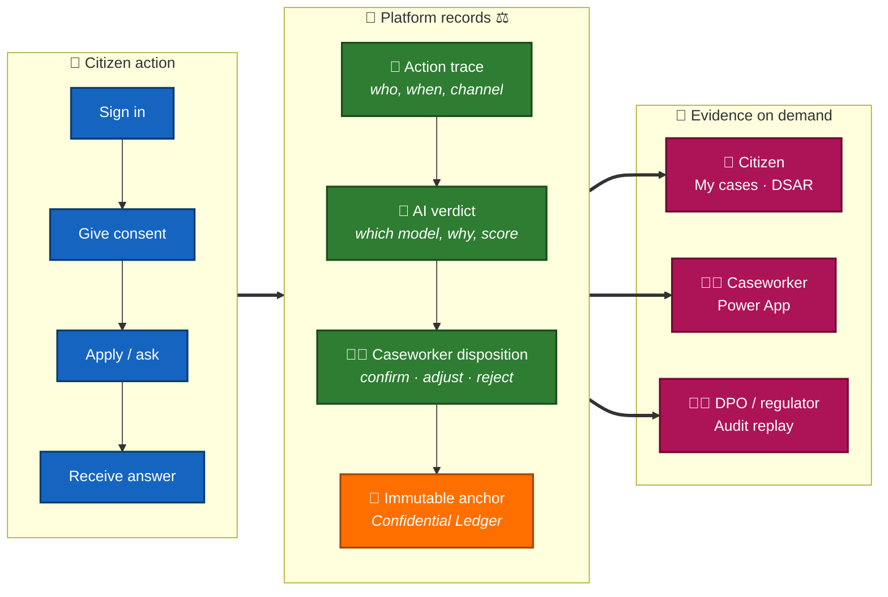

# ⚖️ UDCSP — Traceability

### Every citizen action and every AI decision, retrievable, attributable, defensible

*A non-technical view of how GDPR and the EU AI Act are honoured in practice — what is recorded, who can see it, for how long, and how a citizen, a caseworker or an auditor gets the answer they need.*

---

> [!IMPORTANT]
> **TL;DR.** UDCSP gives a citizen a single answer to *"who decided this, when, why, and on what evidence?"* The platform writes a **W3C distributed trace** for every interaction, a **structured record** for every model invocation, and an **immutable ledger entry** for every caseworker override. Three audiences consume these records: **the citizen** (Art. 13/15 access), **the caseworker** (Art. 14 oversight), **the regulator** (Art. 12 record-keeping, Annex III §5(b) high-risk audit). All technical details — KQL, schema, retention configuration — live in [`docs/tech/monitoring.md`](../tech/monitoring.md). This document is the **promise**, not the recipe.
>
> | Audience | What they get | Time to answer |
> |---|---|---|
> | 👤 **Citizen** | "Show me every decision that affected my case" | < 30 days (Art. 12 GDPR) — typically < 24 h |
> | 🧑‍💼 **Caseworker** | "Why did the AI propose this verdict?" | seconds (workbook drill) |
> | 🧑‍⚖️ **DPO / regulator** | "Reconstruct the eligibility decision of 6 months ago" | minutes (LAW query) |

---

## 📑 Table of contents

1. [Why traceability is a citizen right, not a technical chore](#1-why-traceability-is-a-citizen-right-not-a-technical-chore)
2. [The mental model in one picture](#2-the-mental-model-in-one-picture)
3. [What is recorded, where, for how long](#3-what-is-recorded-where-for-how-long)
4. [GDPR pillars](#4-gdpr-pillars)
5. [EU AI Act pillars](#5-eu-ai-act-pillars)
6. [Three user journeys](#6-three-user-journeys)
7. [Sovereignty — the silence in the dashboard](#7-sovereignty--the-silence-in-the-dashboard)
8. [What this document does NOT cover](#8-what-this-document-does-not-cover)

---

## 1. Why traceability is a citizen right, not a technical chore

Three regulations converge on the same demand: when AI participates in a public-sector decision, the decision must be **explainable, recordable, and reversible**.

- **GDPR Art. 22** — A citizen has the right not to be subject to a decision based solely on automated processing. The platform's answer: **no AI verdict is ever final**. A human caseworker always confirms, adjusts or rejects the recommendation. The trace records both the AI proposal and the human disposition.
- **GDPR Art. 13 + 15** — A citizen must be told that AI is used (transparency), and must be able to request a copy of the data used about them (access). The platform answers both through the citizen portal: a visible AI-assisted badge at the point of use, and a one-click *"download my file"* in *My cases*.
- **EU AI Act Art. 12 + Art. 14 + Annex III §5(b)** — Access to essential public services is a *high-risk* AI domain. The platform must keep automatic logs (Art. 12), allow human oversight (Art. 14), and document risk for the eligibility model (Annex III).

UDCSP treats these articles **as the product**, not as a checklist. The same dashboard that lets an SRE debug a slow API call is the dashboard that lets a DPO reconstruct a 6-month-old verdict. **Same data, three audiences.**

---

## 2. The mental model in one picture

**One sentence:** every blue action on the left produces a green record in the middle, anchored by an orange immutable hash, and consumable by three pink audiences on the right.

> 🛠️ The same diagram, with every Azure resource named, lives in [`docs/tech/monitoring.md` § 1](../tech/monitoring.md#diagram).

---

## 3. What is recorded, where, for how long

| What | Where it lands | How long it is kept | Why |
|---|---|---|---|
| **Action trace** — every citizen click, signin, consent, submit, voice turn | Per-country **App Insights** (`udcsp-{c}-prod-shared-appi`) — voice live today, SPA on roadmap | 90 days (Azure default, EU-region) | Operational observability + Art. 15 access request fulfilment |
| **AI verdict** — every model call (eligibility, classifier, translator, voice realtime, topic-router) with prompt tokens, completion tokens, latency, model deployment | Per-country **Log Analytics workspace** (`udcsp-{c}-prod-law`) via Azure Monitor diagnostic-settings | **Up to 730 days** (configured to satisfy AI Act Art. 12.3 minimum + buffer) | EU AI Act Art. 12 record-keeping for high-risk systems |
| **Caseworker disposition** — confirm / adjust / reject / request more info, plus free-text rationale if any | **Dataverse** `udcsp_application` + Power App audit log + scaffolded `udcsp_caseworker_decision` | 7 years (matches the underlying case retention per national archive law) | Art. 14 human oversight evidence + national archive obligations |
| **Immutable anchor** — hash of the verdict + disposition pair | **Azure Confidential Ledger** (`infra/security/confidential-ledger/`) | Permanent (write-only, tamper-evident) | Forensic-grade non-repudiation when a decision is challenged years later |
| **Citizen-facing journey events** — page views, form submissions, locale, channel | Per-country App Insights *(planned, Phase B in monitoring.md)* | 90 days | Inequity detection (per-language gap surfacing), per-channel adoption metrics |
| **Consent record** — banner accept, AI-assistance opt-in, voice recording acknowledgement | Dataverse `udcsp_consent_record` + the matching `consent.given` `customEvent` in App Insights | 6 years after last interaction | GDPR Art. 7 (proof of consent) |
| **Cross-border share envelope** — when a DK citizen's residency case moves to SE/NO | Dataverse audit + signed envelope in country lake (`signed-claims-envelope/`) | 7 years | Sovereignty + eIDAS Regulation 910/2014 evidence trail |

> 🛠️ Exact resource names, KQL queries, retention configuration commands → [`monitoring.md` § 4 Implementation](../tech/monitoring.md#implementation).

---

## 4. GDPR pillars

| Article | What citizens get | How UDCSP delivers |
|---|---|---|
| **Art. 5 — Principles** | Data is processed lawfully, minimally, with purpose limits | Telemetry never logs free-text form fields, names, CPR/BankID, payment details; only technical identifiers (event name, locale, route, correlationId). Enforced by typed event helper. |
| **Art. 13 — Transparency** | "I know AI is being used on me, and what for" | Visible AI-assisted badge on every page where a Foundry agent contributes; spoken disclosure on voice calls; *"How the AI helps"* explainer one click away |
| **Art. 15 — Access** | "Show me all my data" | One-click *Download my file* in *My cases* (DSAR fulfilment via Logic App `gdpr-data-export`); JSON bundle includes the action traces, the AI verdicts and the caseworker dispositions |
| **Art. 17 — Erasure** | "Delete me" | One-click *Erase my data* in *My cases* (DSAR fulfilment via Logic App `gdpr-data-erase` + Microsoft Priva); certificate returned with 30-day SLA |
| **Art. 22 — Solely automated** | "No AI alone makes a final decision about me" | **By design**: every eligibility verdict is a *proposal* to a caseworker; the citizen sees the proposal before consenting, the caseworker disposes. The AI never closes a case on its own. |
| **Art. 30 — Records of processing** | The controller can list every processing activity | `governance/gdpr/ropa.md` registers each processing flow (citizen rail, voice channel, telemetry, DSAR) with purpose, lawful basis, recipients, retention |
| **Art. 32 — Security of processing** | "My data is encrypted, only the right people can see it" | Encryption at rest (platform-managed keys, customer-managed available); MI-only auth (no API keys); RBAC scoped per country; per-country App Insights isolates telemetry |

---

## 5. EU AI Act pillars

| Article | What it demands | How UDCSP delivers |
|---|---|---|
| **Art. 12 — Record-keeping for high-risk AI** | Automatic recording of events during the system's operational life, minimum 6 months | AOAI `RequestResponse` log → per-country LAW → **730-day retention** (2× the minimum). Every model call captured: deployment, latency, tokens, status. Joinable to the citizen request via W3C `traceparent`. |
| **Art. 13 — Transparency to deployers** | The deployer (here: the public administration) must be able to interpret outputs | Each Foundry agent has a registry entry in `governance/ai-act/registry/` with intended purpose, training data summary, known limitations, performance metrics. Evals run on a fixed multilingual golden dataset. |
| **Art. 14 — Human oversight** | Caseworker must be able to interpret, override, intervene | Eligibility verdict shows confidence %, rule-by-rule evidence, missing-evidence list, citizen-friendly summary, caseworker rationale. Override goes to Dataverse + Confidential Ledger. The W3C `traceparent` makes the AI-to-human handoff replayable. |
| **Annex III §5(b) — High-risk** *(Access to essential public services)* | Eligibility for benefits → high-risk classification | `eligibility` agent declared `risk: high` in its registry entry. Other agents (classifier, translator, doc-extractor, citizen-assistant, topic-router) declared `risk: limited` — they support the flow but do not propose final-decision verdicts. |
| **Annex III §5(c)** *(Emergency triage)* | Not in scope today | Not used — UDCSP eligibility is not an emergency-triage system |
| **Art. 50 — Disclosure for chatbots** | Citizens told they interact with an AI | Voice channel plays a spoken disclosure on the first call turn (12 languages, accessibility-aware); chat widget shows an AI badge above the conversation; assistant agents prefix complex answers with *"Based on UDCSP guidance…"* |

---

## 6. Three user journeys

### 6.1 Anna asks — *"What data does UDCSP hold about me?"* (GDPR Art. 15)

1. Anna signs in on `udcsp.fredgis.com` → opens **My cases** → clicks **Download my file**.
2. APIM calls Logic App `gdpr-data-export` with her authenticated subject.
3. The LA aggregates: action traces (App Insights), AI verdicts (LAW), caseworker dispositions (Dataverse), consent record. Strips internal IDs, applies GDPR PII redaction.
4. Anna receives a signed JSON bundle in her *My cases* timeline, downloadable for 7 days.
5. **Time to delivery: minutes** (Art. 12 GDPR allows 30 days).

### 6.2 Astrid the caseworker asks — *"Why did the AI propose this verdict?"* (AI Act Art. 14)

1. Astrid opens the case in the **Caseworker Power App**.
2. The verdict card shows: confidence %, rules matched, missing evidence, summary.
3. Clicks **Show evidence** → workbook `ai-decision-traces` opens filtered on the case's `operation_Id`.
4. Drill into Transaction search → full W3C trace from web form to model call to verdict.
5. Astrid disposes: confirm / adjust / reject + free-text rationale → written to Dataverse + anchored in Confidential Ledger.

### 6.3 Hans the DPO asks — *"Reconstruct the eligibility decision of 6 months ago"* (AI Act Art. 12)

1. Hans opens Log Analytics workspace `udcsp-dk-prod-law` (or NO, depending on the citizen).
2. Filters `AzureDiagnostics` on `ResourceProvider == "MICROSOFT.COGNITIVESERVICES"` and the citizen's `correlationId` (derived from the DSAR request).
3. Sees the exact model deployment, prompt tokens, completion tokens, latency, response code.
4. Pivots to the APIM `ApiManagementGatewayLogs` on the same `operation_Id` to see the API request that produced the verdict.
5. Pivots to Dataverse to see the caseworker disposition; checks Confidential Ledger for the anchor hash.
6. Reconstructs the full decision in **minutes**, even though it happened 6 months ago.

> 🛠️ The exact KQL queries Hans runs → [`monitoring.md` § 5.6](../tech/monitoring.md#compliance) (4-minute demo pitch).

---

## 7. Sovereignty — the silence in the dashboard

Telemetry sovereignty is enforced at the **resource layer**, not at the application layer:

- **3 separate App Insights** instances (`udcsp-{dk,se,no}-prod-shared-appi`), one per country region (`northeurope` · `swedencentral` · `norwayeast`).
- **3 separate Log Analytics workspaces**, same residency.
- A DK citizen's events land **only** in DK App Insights. A NO voice call lands **only** in NO App Insights.
- **No cross-border telemetry traffic.** Even Power BI aggregation (planned) uses Direct Query that returns aggregates server-side from Fabric — raw rows never move between countries.

> 💡 In the executive demo, the proof is visual: open the **NO** workbook after a NO voice call → populated. Open the **DK** workbook on the same query → empty. The silence is the sovereignty proof, not a bug.

One trade-off is documented: the Azure OpenAI account `udcspai` is **platform-shared** (one resource for the 3 countries) because Microsoft Foundry currently bills per-account, not per-region. AOAI logs land in the NO LAW; per-country segregation of those rows is achieved at **query time** by joining on `operation_Id` to the per-country APIM `GatewayLogs` (which are sovereign-clean). See [`docs/biz/voice.md` § 11.2](./voice.md) for the full sovereignty rationale.

---

## 8. What this document does NOT cover

- **The technical KQL queries** that power each drill — see [`docs/tech/monitoring.md` § 4 Implementation](../tech/monitoring.md#implementation).
- **The diagnostic-settings recipe** — the `az monitor diagnostic-settings create` commands and the verification table — see [`docs/tech/monitoring.md` § 4 Phase A](../tech/monitoring.md#implementation).
- **The workbook JSON definitions** — see [`infra/observability/workbooks/`](../../infra/observability/workbooks/).
- **The Foundry agent registry entries** with risk classification, eval datasets, model parameters — see [`governance/ai-act/registry/`](../../governance/ai-act/) and the Foundry observability portal at <https://ai.azure.com/explore/aiservices/udcspai/observability>.
- **The data residency map** per zone, per service, with retention by classification — see [`docs/tech/data.md` § Retention](../tech/data.md).
- **The DSAR runbook step-by-step** — see [`governance/gdpr/ropa.md`](../../governance/gdpr/) and the Logic App `gdpr-data-export`.
- **The voice-call disclosure scripts in 12 languages** — see [`docs/biz/voice.md` § 6 Accessibility](./voice.md).

---

*Traceability is not a feature — it is the contract between the platform and the citizen.*

[← Back to docs/biz README](./README.md) · [Technical companion: `monitoring.md`](../tech/monitoring.md) · [Live status: `inprogress.md`](../tech/inprogress.md)

