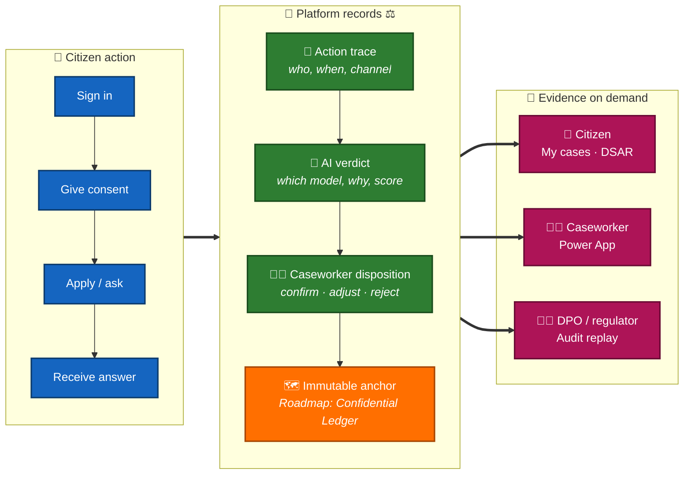

# ⚖️ UDCSP — Traceability

_Last verified: 2026-08-11 · commit f940d39 · security remediation committed, not deployed_

### Trace what is wired, expose what is missing, never invent evidence

*A non-technical view of how GDPR and the EU AI Act are honoured in practice — what is recorded, who can see it, for how long, and how a citizen, a caseworker or an auditor gets the answer they need.*

---

> [!IMPORTANT]
> **TL;DR.** UDCSP has W3C correlation and structured metadata on exercised paths, but it cannot yet give a complete answer to *"who decided this, when, why, and on what evidence?"* Caseworker disposition persistence is partial. The dedicated DPO console, complete replay, operational lineage backend, and Azure Confidential Ledger anchoring are 🗺️ **Roadmap**. Technical details, including KQL, schema and retention configuration, live in [`docs/tech/monitoring.md`](../tech/monitoring.md). This document states both the promise and the current gaps.
>
> 🔵 **Pending security remediation.** Citizen self-service export and erasure now derive the subject from the validated token, delete caller-supplied identity headers, and reject a mismatching body subject with `403`. Delegated DPO requests require a separate authenticated actor contract and remain 🗺️ **Roadmap**. Corrected voice source records transcript lengths and tool argument keys rather than content, while `traceparent` correlation still works. The document extractor still produces synthetic values inferred from the filename; its provenance markers must remain visible before those values can support human oversight. The lineage API is authenticated and fail-closed in source, but returns `503` because no backend exists. None of these changes is deployed.
>
> | Audience | What they get | Time to answer |
> |---|---|---|
> | 👤 **Citizen** | "Show me every decision that affected my case" | 🟡 **Partially deployed**: *My cases* shows Dataverse cases; DSAR export is 🗺️ **Roadmap** |
> | 🧑‍💼 **Caseworker** | "Why did the AI propose this verdict?" | 🟡 **Partially deployed**: shared Dataverse Power App path, with D365 CS rollout still 🗺️ **Roadmap** |
> | 🧑‍⚖️ **DPO / regulator** | "Reconstruct the eligibility decision of 6 months ago" | 🟡 **Partially deployed**: minutes via LAW query where traces exist; no DPO console |

### Current deployed reality

🟡 **Partially deployed**: the eligibility verdict travels in the submission payload and the caseworker disposition is written to Dataverse today through the `tasks` activity entity. The canonical `udcsp_application` table is provisioned, but the Logic App is not repointed to it. App Insights carries correlation metadata for exercised paths. The deployed voice image still has the prior content-logging behavior until the corrected image is deployed; the corrected source keeps lengths and argument keys only. Azure Confidential Ledger anchoring and `udcsp_caseworker_decision` persistence are 🗺️ **Roadmap**. The lineage API has no backend, and the DPO console, operational Purview lineage, delegated DSR contract, and Priva connector are also 🗺️ **Roadmap**.

---

## 📑 Table of contents

1. [Why traceability is a citizen right, not a technical chore](#1-why-traceability-is-a-citizen-right-not-a-technical-chore)
2. [The mental model in one picture](#2-the-mental-model-in-one-picture)
3. [What is recorded, where, for how long](#3-what-is-recorded-where-for-how-long)
4. [GDPR pillars](#4-gdpr-pillars)
5. [EU AI Act pillars](#5-eu-ai-act-pillars)
6. [Three user journeys](#6-three-user-journeys)
7. [Sovereignty — the silence in the dashboard](#7-sovereignty--the-silence-in-the-dashboard)
8. [What this document does NOT cover](#8-what-this-document-does-not-cover)

---

## 1. Why traceability is a citizen right, not a technical chore

Three regulations converge on the same demand: when AI participates in a public-sector decision, the decision must be **explainable, recordable, and reversible**.

- **GDPR Art. 22**: A citizen has the right not to be subject to a decision based solely on automated processing. UDCSP designs eligibility as an advisory recommendation. The human-disposition path exists partially, and canonical persistence is incomplete.
- **GDPR Art. 13 + 15**: A citizen must be told that AI is used and must be able to request a copy of personal data. Transparency surfaces and *My cases* exist on exercised paths. Full caller-bound export is 🔵 **In repo**, not deployed.
- **EU AI Act Art. 12 + Art. 14 + Annex III §5(b)** — Access to essential public services is a *high-risk* AI domain. The platform must keep automatic logs (Art. 12), allow human oversight (Art. 14), and document risk for the eligibility model (Annex III).

UDCSP treats these articles as product requirements, not as a checklist. The same correlation metadata that helps an SRE investigate a slow call can support a partial DPO reconstruction. It is not a complete decision replay. The dedicated DPO console is 🗺️ **Roadmap**.

---

## 2. The mental model in one picture

```mermaid
flowchart LR
  subgraph LEFT["👤 Citizen action"]
    direction TB
    C1["Sign in"]:::citizen
    C2["Give consent"]:::citizen
    C3["Apply / ask"]:::citizen
    C4["Receive answer"]:::citizen
    C1 --> C2 --> C3 --> C4
  end

  subgraph MID["🧠 Platform records ⚖️"]
    direction TB
    R1["📝 Action trace<br/><i>who, when, channel</i>"]:::trace
    R2["🤖 AI verdict<br/><i>which model, why, score</i>"]:::trace
    R3["🧑‍💼 Caseworker disposition<br/><i>confirm · adjust · reject</i>"]:::trace
    R4["🗺️ Immutable anchor<br/><i>Roadmap: Confidential Ledger</i>"]:::immut
    R1 --> R2 --> R3 --> R4
  end

  subgraph RIGHT["🔎 Evidence on demand"]
    direction TB
    A1["👤 Citizen<br/>My cases · DSAR"]:::audience
    A2["🧑‍💼 Caseworker<br/>Power App"]:::audience
    A3["🧑‍⚖️ DPO / regulator<br/>Audit replay"]:::audience
  end

  LEFT  ==> MID
  MID   ==> A1
  MID   ==> A2
  MID   ==> A3

  classDef citizen fill:#1565C0,stroke:#0d3c6e,color:#fff,stroke-width:2px
  classDef trace   fill:#2E7D32,stroke:#1a4d1d,color:#fff,stroke-width:2px
  classDef immut   fill:#FF6F00,stroke:#a64600,color:#fff,stroke-width:2px
  classDef audience fill:#AD1457,stroke:#6a0b35,color:#fff,stroke-width:2px
```

**One sentence:** the diagram is the target chain. R1, R2, and R3 exist only on the exercised paths described below, and the orange ledger hop is 🗺️ **Roadmap**.

**Legend:** R1, R2 and R3 are 🟡 **Partially deployed** across the exercised paths; R4 is 🗺️ **Roadmap** until the Logic App callback writes the Azure Confidential Ledger hash.

> 🛠️ The same diagram, with every Azure resource named, lives in [`docs/tech/monitoring.md` § 1](../tech/monitoring.md#diagram).

---

## 3. What is recorded, where, for how long

| What | Where it lands | How long it is kept | Why |
|---|---|---|---|
| **Action trace**: exercised requests, consent, submit, and voice event metadata | 🟡 **Partially deployed**: per-country **App Insights** carries correlation for exercised paths. The deployed voice image retains the previous content logging until redeployment. Corrected source keeps event names, lengths, argument keys, and correlation only. Full SPA instrumentation is 🗺️ **Roadmap**. | 90 days (current App Insights default) | Operational observability and correlation |
| **AI verdict**: model calls with prompt tokens, completion tokens, latency, model deployment | 🟡 **Partially deployed**: eligibility calls are in the submit payload and LA audit path; full per-country LAW diagnostic validation is ⚙️ **Scripted** | **Up to 730 days** after diagnostic validation | EU AI Act Art. 12 record-keeping for high-risk systems |
| **Caseworker disposition**: confirm / adjust / reject / request more info, plus free-text rationale if any | 🟡 **Partially deployed**: **Dataverse** `tasks` activity entity today. `udcsp_application` is provisioned, and `udcsp_caseworker_decision` is 🔵 **In repo** scaffold only | 7 years (design retention) | Art. 14 human oversight evidence + national archive obligations |
| **Immutable anchor**: hash of the verdict + disposition pair | 🗺️ **Roadmap**: **Azure Confidential Ledger** design under `infra/security/confidential-ledger/`; no caseworker override entry is written today | Permanent after the callback is added | Forensic-grade non-repudiation when a decision is challenged years later |
| **Citizen-facing journey events**: page views, form submissions, locale, channel | 🟡 **Partially deployed** in App Insights for exercised paths; full SPA journey capture is 🗺️ **Roadmap** | 90 days | Inequity detection (per-language gap surfacing), per-channel adoption metrics |
| **Consent record** — banner accept, AI-assistance opt-in, voice recording acknowledgement | Dataverse `udcsp_consent_record` + the matching `consent.given` `customEvent` in App Insights | 6 years after last interaction | GDPR Art. 7 (proof of consent) |
| **Cross-border share envelope** — when a DK citizen's residency case moves to SE/NO | Dataverse audit + signed envelope in country lake (`signed-claims-envelope/`) | 7 years | Sovereignty + eIDAS Regulation 910/2014 evidence trail |

> 🛠️ Exact resource names, KQL queries, retention configuration commands → [`monitoring.md` § 4 Implementation](../tech/monitoring.md#implementation).

---

## 4. GDPR pillars

| Article | What citizens get | How UDCSP delivers |
|---|---|---|
| **Art. 5: Principles** | Data is processed lawfully, minimally, with purpose limits | 🔵 Corrected voice source removes transcript text and tool argument values, retaining lengths, keys, event names, and correlation. This minimisation is not live until the voice image is deployed. |
| **Art. 13 — Transparency** | "I know AI is being used on me, and what for" | Visible AI-assisted badge on every page where a Foundry agent contributes; spoken disclosure on voice calls; *"How the AI helps"* explainer one click away |
| **Art. 15: Access** | "Show me all my data" | 🟡 *My cases* reads Dataverse `tasks` rows today. 🔵 The pending APIM policy binds citizen self-service export to the authenticated caller and rejects a mismatching subject. Full export and delegated DPO access are 🗺️ **Roadmap**. |
| **Art. 17: Erasure** | "Delete me" | 🟡 The current stub and local cache wipe are partial. 🔵 The pending policy binds citizen self-service erasure to the authenticated caller. Full Priva coordination, cascade verification, and delegated DPO erasure are 🗺️ **Roadmap**. |
| **Art. 22: Solely automated** | "No AI alone makes a final decision about me" | 🟡 Eligibility is advisory by design. The caseworker disposition path is partial, and canonical persistence remains roadmap. |
| **Art. 30 — Records of processing** | The controller can list every processing activity | `governance/gdpr/ropa.md` registers each processing flow (citizen rail, voice channel, telemetry, DSAR) with purpose, lawful basis, recipients, retention |
| **Art. 32 — Security of processing** | "My data is encrypted, only the right people can see it" | Encryption at rest (platform-managed keys, customer-managed available); MI-only auth (no API keys); RBAC scoped per country; per-country App Insights isolates telemetry |

---

## 5. EU AI Act pillars

| Article | What it demands | How UDCSP delivers |
|---|---|---|
| **Art. 12 — Record-keeping for high-risk AI** | Automatic recording of events during the system's operational life, minimum 6 months | 🟡 **Partially deployed**: exercised paths carry W3C `traceparent` correlation. Full AOAI `RequestResponse` to per-country LAW with **730-day retention** is ⚙️ **Scripted**. |
| **Art. 13 — Transparency to deployers** | The deployer (here: the public administration) must be able to interpret outputs | Each Foundry agent has a registry entry in `governance/ai-act/registry/` with intended purpose, training data summary, known limitations, performance metrics. Evals run on a fixed multilingual golden dataset. |
| **Art. 14: Human oversight** | Caseworker must be able to interpret, override, intervene | 🟡 Eligibility remains advisory and the disposition path is partial. The current document fields are synthetic values inferred from the filename, not extracted evidence. They must be visibly labelled or replaced by real extraction before a caseworker can rely on them. Azure Confidential Ledger anchoring is 🗺️ **Roadmap**. |
| **Annex III §5(b) — High-risk** *(Access to essential public services)* | Eligibility for benefits → high-risk classification | `eligibility` agent declared `risk: high` in its registry entry. Other agents (classifier, translator, doc-extractor, citizen-assistant, topic-router) declared `risk: limited` — they support the flow but do not propose final-decision verdicts. |
| **Annex III §5(c)** *(Emergency triage)* | Emergency triage systems | 🔵 **In repo**: UDCSP eligibility is not an emergency-triage system |
| **Art. 50 — Disclosure for chatbots** | Citizens told they interact with an AI | Voice channel plays a spoken disclosure on the first call turn (12 languages, accessibility-aware); chat widget shows an AI badge above the conversation; assistant agents prefix complex answers with *"Based on UDCSP guidance…"* |

---

## 6. Three user journeys

### 6.1 Anna asks — *"What data does UDCSP hold about me?"* (GDPR Art. 15)

1. Anna signs in on `udcsp.fredgis.com` → opens **My cases** → clicks **Download my file**.
2. 🟡 **Partially deployed** today: *My cases* reads her Dataverse `tasks` rows through APIM.
3. 🔵 **In repo**: the self-service contract derives the subject from Anna's validated token and rejects a mismatching body subject. 🗺️ **Roadmap**: the full export aggregates authoritative records and provides a separate authenticated actor contract for a DPO acting on another citizen's behalf.
4. 🗺️ **Roadmap**: Anna receives a signed JSON bundle in her *My cases* timeline, downloadable for 7 days.
5. 🗺️ **Roadmap** time to delivery: minutes (Art. 12 GDPR allows 30 days).

### 6.2 Astrid the caseworker asks — *"Why did the AI propose this verdict?"* (AI Act Art. 14)

1. Astrid opens the case in the **Caseworker Power App**.
2. The verdict card shows: confidence %, rules matched, missing evidence, summary.
3. Clicks **Show evidence** → workbook `ai-decision-traces` opens filtered on the case's `operation_Id`. Correlation metadata is available, but synthetic document fields must not be presented as document evidence.
4. Drill into Transaction search to inspect the correlated spans available for that exercised path. Do not claim complete prompt, response, retrieval, or lineage capture.
5. Astrid disposes: confirm / adjust / reject + free-text rationale. 🟡 **Partially deployed**: the disposition is written to Dataverse `tasks` today. 🗺️ **Roadmap**: the Logic App callback writes `udcsp_caseworker_decision` and the Azure Confidential Ledger anchor.

### 6.3 Hans the DPO asks — *"Reconstruct the eligibility decision of 6 months ago"* (AI Act Art. 12)

1. Hans opens Log Analytics workspace `udcsp-dk-prod-law` (or NO, depending on the citizen).
2. Filters `AzureDiagnostics` on `ResourceProvider == "MICROSOFT.COGNITIVESERVICES"` and the citizen's `correlationId` (derived from the DSAR request).
3. Sees the model deployment and available operational metadata, including token counts, latency, response code, and correlation identifiers. After the pending voice image is deployed, transcript content is not retained in telemetry.
4. Pivots to the APIM `ApiManagementGatewayLogs` on the same `operation_Id` to see the API request that produced the verdict.
5. Pivots to Dataverse to see the caseworker disposition. The Azure Confidential Ledger anchor hash is 🗺️ **Roadmap**.
6. 🟡 **Partially deployed**: Hans can reconstruct exercised traces through LAW and App Insights. A dedicated DPO console and full six-month replay path are 🗺️ **Roadmap**.

> 🛠️ The exact KQL queries Hans runs → [`monitoring.md` § 5.6](../tech/monitoring.md#compliance) (4-minute demo pitch).

---

## 7. Sovereignty — the silence in the dashboard

Telemetry sovereignty is enforced at the **resource layer**, not at the application layer:

- **3 separate App Insights** instances (`udcsp-{dk,se,no}-prod-shared-appi`), one per country region (`northeurope` · `swedencentral` · `norwayeast`).
- **3 separate Log Analytics workspaces**, same residency.
- A DK citizen's events land **only** in DK App Insights. A NO voice call lands **only** in NO App Insights.
- **No cross-border telemetry traffic.** Power BI aggregation is 🗺️ **Roadmap** and uses Direct Query so aggregates return server-side from Fabric. Raw rows never move between countries.

> 💡 In the executive demo, the proof is visual: open the **NO** workbook after a NO voice call → populated. Open the **DK** workbook on the same query → empty. The silence is the sovereignty proof, not a bug.

One trade-off is documented: the Azure OpenAI account `udcspai` is **platform-shared** (one resource for the 3 countries) because Microsoft Foundry currently bills per-account, not per-region. AOAI logs land in the NO LAW; per-country segregation of those rows is achieved at **query time** by joining on `operation_Id` to the per-country APIM `GatewayLogs` (which are sovereign-clean). See [`docs/biz/voice.md` § 11.2](./voice.md) for the full sovereignty rationale.

---

## 8. What this document does NOT cover

- **The technical KQL queries** that power each drill — see [`docs/tech/monitoring.md` § 4 Implementation](../tech/monitoring.md#implementation).
- **The diagnostic-settings recipe** — the `az monitor diagnostic-settings create` commands and the verification table — see [`docs/tech/monitoring.md` § 4 Phase A](../tech/monitoring.md#implementation).
- **The workbook JSON definitions** — see [`infra/observability/workbooks/`](../../infra/observability/workbooks/).
- **The Foundry agent registry entries** with risk classification, eval datasets, model parameters — see [`governance/ai-act/registry/`](../../governance/ai-act/) and the Foundry observability portal at <https://ai.azure.com/explore/aiservices/udcspai/observability>.
- **The data residency map** per zone, per service, with retention by classification — see [`docs/tech/data.md` § Retention](../tech/data.md).
- **The DSAR design and source workflow**: see [`governance/gdpr/ropa.md`](../../governance/gdpr/) and the Logic App `gdpr-data-export`. Citizen self-service binding is 🔵 **In repo** and not deployed; delegated DPO requests are 🗺️ **Roadmap**.
- **The voice-call disclosure scripts in 12 languages** — see [`docs/biz/voice.md` § 6 Accessibility](./voice.md).

---

*Traceability is not a feature — it is the contract between the platform and the citizen.*

[← Back to docs/biz README](./README.md) · [Technical companion: `monitoring.md`](../tech/monitoring.md) · [Live status: `inprogress.md`](../tech/inprogress.md)

