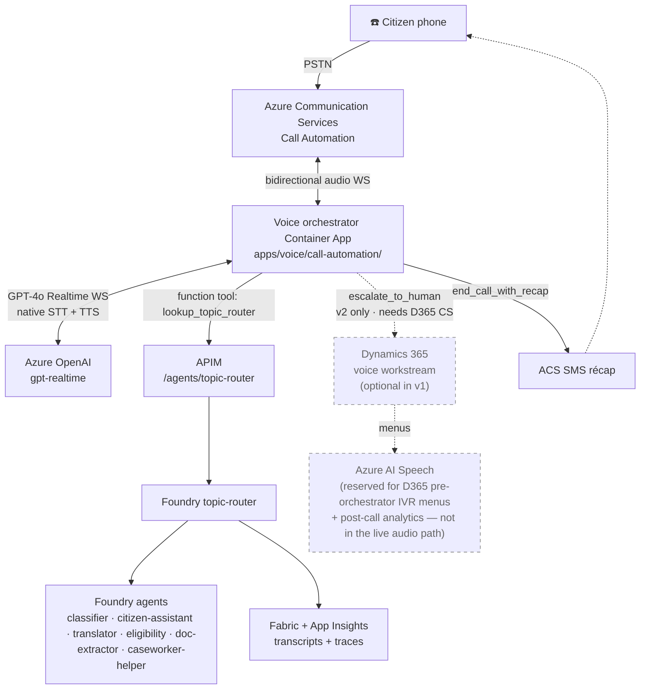
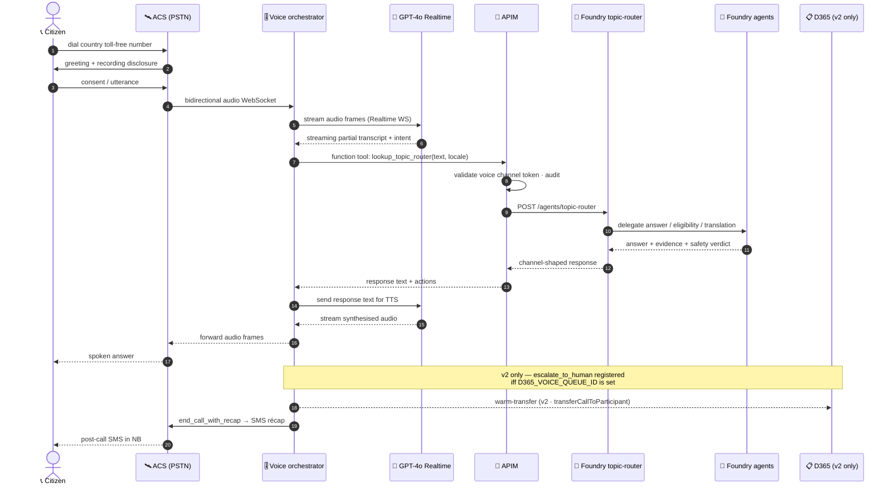
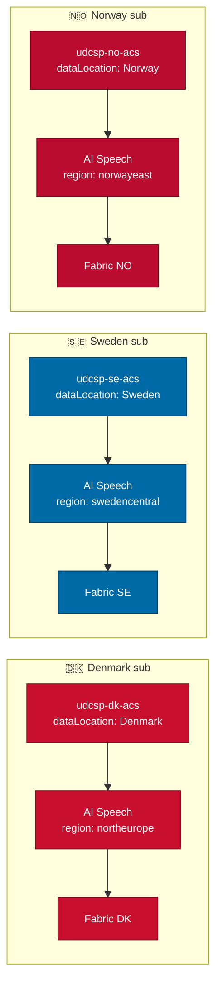
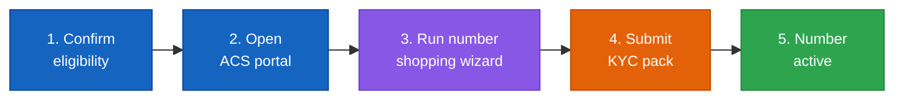
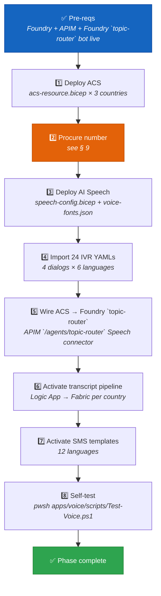

<div align="center">

# 📞 UDCSP — The Voice Channel

### Telephone is a peer of web and mobile, not an afterthought

*How a citizen dials a Nordic toll-free number, talks to the same Foundry brain that powers the web, and gets a spoken answer in their own language — with full GDPR + EU AI Act compliance.*

[](#)
[](#)
[](#)
[](#)

[](#)
[](#)
[](#)
[](#)

</div>

---

> [!IMPORTANT]
> **TL;DR.** A citizen dials a country toll-free number → **Azure Communication Services Call Automation** answers → the **voice orchestrator Container App** (`apps/voice/call-automation/`) opens a bidirectional WebSocket to **Azure OpenAI GPT-4o Realtime** for native low-latency STT + reasoning + TTS in one stream → from inside that stream the orchestrator calls **APIM** `/agents/topic-router` as a **function tool** to fan out to the same Foundry agents that power web/mobile → on `escalate=true` the call is **warm-transferred** to a D365 voice workstream queue. **Azure AI Speech is kept only for D365 pre-orchestrator IVR menus and post-call analytics** (see § 11). **Voice invokes Foundry `topic-router` via APIM; no separate conversational façade is used.**
>
> | Field | Value |
> |---|---|
> | 🗄️ **Where stored** | Audio/STT in ADLS Gen2 `voice-recordings/`; dialog in Dataverse `bot_session`; ACS call events in `acs-events/`; Foundry traces in App Insights → OneLake with Confidential Ledger anchors. |

---

## 📑 Table of contents

1. [Why a voice channel at all](#1-why-a-voice-channel-at-all)
2. [The mental model in one picture](#2-the-mental-model-in-one-picture)
3. [The call lifecycle, step by step](#3-the-call-lifecycle-step-by-step)
4. [The six building blocks](#4-the-six-building-blocks)
5. [Multilingual — 12 languages × neural voices](#5-multilingual--12-languages--neural-voices)
6. [Accessibility — DTMF, slow-speech, recording disclosure](#6-accessibility--dtmf-slow-speech-recording-disclosure)
7. [Sovereignty — one ACS resource per country](#7-sovereignty--one-acs-resource-per-country)
8. [SLOs, risks, and mitigations](#8-slos-risks-and-mitigations)
9. [📞 Getting a real phone number you can actually call](#9--getting-a-real-phone-number-you-can-actually-call)
10. [The activation runbook](#10-the-activation-runbook)
11. [🧱 Voice runtime — readiness vs scaffold (what's actually runnable today)](#11--voice-runtime--readiness-vs-scaffold-whats-actually-runnable-today)
12. [How to test it (three levels)](#12-how-to-test-it-three-levels)
13. [The demo script for a jury](#13-the-demo-script-for-a-jury)
14. [Anti-patterns we avoid](#14-anti-patterns-we-avoid)
15. [Where the conversation is stored](#15-where-the-conversation-is-stored)

---

## 1. Why a voice channel at all

The case study is unambiguous (`docs/biz/case-study-11.md` § AI Infusion Point):

> *"A GenAI citizen assistant answers service queries in natural language across web, mobile, **and telephone** channels."*

Three reasons telephone is a **first-class** channel in UDCSP, not a checkbox:

- 🧓 **Inclusion.** A non-trivial fraction of the 2.1 M Scandinavian citizens UDCSP serves cannot, will not, or should not use a screen — elderly citizens, citizens with low digital literacy, citizens with motor or visual disabilities. Voice is the **inclusivity hatch**.
- 📵 **Resilience.** When a portal is down, when an app is uninstalled, when a phone has no data plan, when a user is on the go and cannot type — voice still works. PSTN is the universal fallback.
- 🤝 **Trust.** For sensitive topics (homelessness, domestic violence, child safety, identity theft) talking to a *voice* is more humane than typing into a chat box. The voice channel is configured to escalate to a human caseworker on those topics by default.

The design principle, codified in `docs/biz/uses.md` § Demo 2:

> *"The voice channel is **not an afterthought** — it's a peer of web and mobile, with the same AI agents and the same audit trail."*

---

## 2. The mental model in one picture



> 📖 **Reading the picture.** Voice keeps ACS for telephony and **GPT-4o Realtime as the primary speech path** (native STT+TTS in one stream, lower latency than the classic STT→reasoning→TTS chain). The voice orchestrator Container App is the bridge: it owns the ACS audio WebSocket on one side and the GPT Realtime WebSocket on the other, with APIM `/agents/topic-router` invoked as a **function tool** so Foundry stays the only stateful brain. **The dashed D365 leg is enabled only in v2** (when Customer Service is provisioned per country); v1 — Demo 2 no-handoff — runs the citizen↔AI loop without warm-transfer (see § 11.4b). **Azure AI Speech is reserved for D365 pre-orchestrator IVR menus and post-call analytics** (see § 11.2 for the rationale).

---

## 3. The call lifecycle, step by step



**Latency budget** (target: end-to-end p95 ≤ 2 s round-trip):

| Hop | Budget | How we hit it |
|---|---|---|
| PSTN → ACS → STT first partial | ~150 ms | ACS edge region in the same country |
| STT streaming | ~200 ms / phrase | Streaming STT (no batch wait) |
| Foundry `topic-router` routing | ~50 ms | Topic decision is local |
| APIM | ~30 ms | Cached JWKS, no cold start |
| Foundry classifier (small) | ~120 ms | Small low-latency model in front of the citizen-assistant |
| Foundry citizen-assistant | ~600 ms | Streaming responses, partial TTS playback |
| TTS streaming | ~200 ms / phrase | Streaming TTS (no buffer-then-play) |
| ACS → citizen | ~150 ms | Same-country edge |

---

## 4. The six building blocks

| # | Block | What it does | Where it lives |
|:-:|---|---|---|
| **1** | **Azure Communication Services (PSTN)** | Decrochés des appels entrants, gestion des numéros toll-free, pont avec le RTC. **One ACS resource per country**, region-pinned for sovereignty. | `apps/voice/acs/acs-resource.bicep`, `apps/voice/acs/phone-numbers.bicep` |
| **2** | **Azure AI Speech (STT + TTS)** | Streaming speech-to-text **and** text-to-speech, per-locale neural voices, civic-term lexicons. | `apps/voice/speech/speech-config.bicep`, `apps/voice/speech/voice-fonts.json` |
| **3** | **Foundry `topic-router` agent · voice channel** | Owns dialog state, slot filling, barge-in, DTMF fallback, escalation rules. Talks **to** Foundry but is **not** Foundry. | `apps/voice/ivr/{da,sv,nb,en,de,ar}/*.yaml`, `foundry/agents/topic-router/topics/voice-fallback.yaml` |
| **4** | **APIM gateway** | JWT validation, audit log, rate-limit (600 calls/min for voice vs 120 elsewhere), `x-channel-actor: voice` enforcement. The **only** legal entry point to Foundry from any channel. | `services/apim/apis/agent-topic-router/policy.xml`, `services/apim/apis/agent-topic-router/openapi.yaml` |
| **5** | **Foundry agents (shared)** | Citizen-assistant, classifier, translator, eligibility — the **same** agents that power the web and mobile. **Voice does not get its own agents.** | `foundry/agents/*` |
| **6** | **Outbound notifications** | SMS / email récap post-call via ACS. Localised templates per language. | `apps/voice/notifications/{sms,email}-templates.json` |

Two cross-cutting concerns:

| | Concern | Where |
|:-:|---|---|
| ⚖️ | **Recording consent** — disclosure script in 12 languages, opt-out ("press 0") routes to a non-recorded human queue. | `apps/voice/recording-consent/recording-disclosure.md` |
| 📜 | **Transcript pipeline** — Logic App that pushes call transcripts to the **per-country** Fabric workspace, pseudonymised, correlated with Foundry traces by `correlation-id`. | `apps/voice/transcript-pipeline/logic-app-transcription.json` |

---

## 5. Multilingual — 12 languages × neural voices

The 6 voice locales currently scaffolded in `apps/voice/speech/voice-fonts.json`:

| 🇫🇱 | Language | Speech locale | Neural voice |
|:-:|---|---|---|
| 🇩🇰 | Danish | `da-DK` | `da-DK-ChristelNeural` |
| 🇸🇪 | Swedish | `sv-SE` | `sv-SE-SofieNeural` |
| 🇳🇴 | Norwegian Bokmål | `nb-NO` | `nb-NO-PernilleNeural` |
| 🇬🇧 | English (GB) | `en-GB` | `en-GB-SoniaNeural` |
| 🇩🇪 | German | `de-DE` | `de-DE-KatjaNeural` |
| 🇸🇦 | Arabic | `ar-SA` | `ar-SA-ZariyahNeural` |

The remaining 6 case-study languages (Norwegian Nynorsk, Sámi, French, Polish, Ukrainian, Finnish) are **defined in the i18n bundles** but use a fallback voice in the voice channel today; adding them is a one-line entry in `voice-fonts.json` plus a `voice-fonts.bicep` redeploy. The recording-disclosure script (`apps/voice/recording-consent/recording-disclosure.md`) is **already** localised in **all 12 languages**.

> [!NOTE]
> **Civic-term lexicons.** Each locale has a custom Speech lexicon for nation-specific terminology — `personnummer` (SE), `CPR-nummer` (DK), `fødselsnummer` (NO), `permanent residence permit`, etc. Without lexicons the STT mishears these critical tokens half the time.

---

## 6. Accessibility — DTMF, slow-speech, recording disclosure

The voice channel is the **inclusivity hatch** of UDCSP — it must work for citizens who cannot interact with a screen. Three concrete features:

**🔢 DTMF fallback** — every IVR prompt accepts the keypad as an alternative to speech. Defined globally in `apps/voice/accessibility/dtmf-fallback-flows.yaml`:

```yaml
fallbacks:
  '*': repeat_current_prompt   # always available
  '0': transfer_human_agent    # always available
  '9': enable_slow_speech      # toggle
  '1': residency_application_status
  '2': tax_certificate_status
  '3': child_benefit_status
  '4': notification_preferences
```

**🐢 Slow-speech mode** — pressing `9` at any time switches the TTS to a slower cadence and re-prompts; the choice is **sticky** for the rest of the call.

**🛡️ Recording disclosure (GDPR Art. 5/13)** — the very first thing a caller hears is the disclosure in their detected language; pressing `0` opts out and routes to a non-recorded human queue. Example (Norwegian Bokmål):

> *"Samtalen kan tas opp og transkriberes for å behandle saken din. Trykk 1 for å godta eller 0 for en saksbehandler."*

**🧯 Always-available human escape** — pressing `0` at any prompt, or saying "agent / human / caseworker / complaint", triggers a warm transfer to a D365 caseworker queue with the conversation context intact (`apps/voice/escalation/escalation-config.yaml`).

---

## 7. Sovereignty — one ACS resource per country



What stays in-country: **call media, transcripts, recordings, IVR logs, SMS metadata, neural voice synthesis traces**. What is shared cross-country: **anonymised metrics + the Foundry agent definitions** (the brain is shared; the data is not).

The ACS `dataLocation` property is the load-bearing knob — it pins the persisted data (recordings, call records, SMS) to the country. See `apps/voice/acs/acs-resource.bicep`:

```bicep
resource acs 'Microsoft.Communication/communicationServices@...' = {
  name: 'udcsp-${country}-acs'
  location: 'Global'
  properties: {
    dataLocation: location   // 'Denmark' | 'Sweden' | 'Norway'
  }
}
```

---

## 8. SLOs, risks, and mitigations

| | SLO | Target | How we measure |
|:-:|---|---|---|
| ⚡ | **Round-trip latency** (citizen says X → hears answer) | p95 ≤ **2 s** | App Insights custom event from STT-final to TTS-first-byte |
| 🎯 | **Intent recognition** (correct route on first try) | ≥ **88 %** per locale | Foundry eval pipeline replays a labelled audio gold set per release |
| 🤝 | **Successful answer without escalation** | ≥ **70 %** | D365 outcome tagging |
| 📞 | **PSTN reachability** | ≥ **99.9 %** monthly | ACS health metrics + synthetic call probes every 5 min per country |
| 🛡️ | **Content safety triggers blocked** | **100 %** | Content Safety verdicts compared to red-team test set per release |

Risks tracked in `docs/tech/plan.md` § Risk register (R3 is voice-specific):

> **R3 — Voice channel latency > 2 s p95.** Mitigations: edge ACS region per country; warm pools; small low-latency classifier in front of the citizen-assistant; **streaming** STT and TTS (never batch).

---

## 9. 📞 Getting a real phone number you can actually call

This is the practical question — *can we hand a Nordic toll-free number to the jury and let them dial it?* **Yes**, with a clear procedure. Here is the playbook, country by country, anchored to current Microsoft documentation as of **May 2025**.

### 9.1 Eligibility (read this first or you will hit a wall)

| Pre-requisite | Why | How to satisfy |
|---|---|---|
| **Paid Azure subscription** (no trial, no MSDN, no free credits) | ACS phone-number procurement is **not** allowed on free or sponsored subscriptions | Use a **pay-as-you-go**, EA, or CSP subscription with a billing address in DK / SE / NO or an EU/EFTA member state |
| **ACS resource in the right `dataLocation`** | Numbers can only be ordered against an ACS resource whose data location matches the target country | `udcsp-{dk,se,no}-acs` Bicep already enforces this |
| **KYC / "Know Your Customer" pack** | EU / EFTA telecom regulators (PTS in Sweden, Nkom in Norway, ERST in Denmark) require operator-level identity verification | Company registration certificate, proof of business address, intended use description, contact person, signed Microsoft KYC form |
| **Address-of-record per country** | Some Nordic regulators require the number to map to a verifiable address **inside** the country of issuance | A national agency partner address suffices; a foreign address does **not** |

> [!WARNING]
> **Ineligible subscriptions silently disable the "Get phone number" wizard in the Azure portal.** If the wizard greys out or shows "no numbers available", the cause is almost always (1) a free / trial subscription, or (2) a billing address outside the eligible region. It is **not** a stock-out.

### 9.2 The procurement procedure (5 steps, real-world)



1. **Confirm eligibility** (subscription type + billing address + ACS resource + KYC pack ready).
2. **Open the Azure portal** → your ACS resource (e.g. `udcsp-no-acs`) → blade **Phone numbers** → **+ Get**.
3. **Run the number-shopping wizard.** Choose:
   - **Country / region** — Denmark, Sweden, or Norway.
   - **Number type** — *Toll-Free* (recommended for citizen-facing service) or *Geographic / Local*.
   - **Capabilities** — *Inbound calling* (mandatory for our use case), *Outbound calling* (optional, regulator-dependent), *SMS* (varies by country).
   - **Quantity** — 1 per country for the demo; production typically 2–5 per country with overflow routing.
4. **Submit the KYC pack.** The portal launches a regulatory questionnaire; for non-instant-provisioning countries (most Nordic + toll-free) you also email the signed KYC form to ACS. Microsoft routes it to the local regulator's intake.
5. **Number active.** Lead times typically:
   - 🇸🇪 **Sweden** — toll-free: a few business days · local: usually instant.
   - 🇳🇴 **Norway** — toll-free: 1–3 weeks (Nkom review) · local: a few business days.
   - 🇩🇰 **Denmark** — toll-free: 1–3 weeks (ERST review) · local: a few business days.

The number then appears under your ACS resource and can be assigned to the Foundry `topic-router` voice channel (APIM `/agents/topic-router` Speech connector) by name — **no code change is needed**.

### 9.3 The fast lane — what to do *today* for a demo

If you don't want to wait 1–3 weeks for a real Nordic toll-free number, three lower-friction options are available **right now**:

| Option | Lead time | Caller experience | Best for |
|---|---|---|---|
| **🇺🇸 US toll-free + ACS** | Minutes | Caller dials a US number · same audio quality | Internal demos · jury rehearsal |
| **🇬🇧 UK local + ACS** | Minutes | Caller dials a UK landline · same audio quality | EMEA demos when caller is in Europe |
| **🎧 ACS *direct calling* (no PSTN)** | Zero | Demo from a browser via the ACS Web SDK — **no phone number required** | Jury demos in the room · CI tests |

Microsoft documentation we anchor to:

- 🔗 [Phone Number Management for Norway](https://learn.microsoft.com/en-us/azure/communication-services/concepts/numbers/phone-number-management-for-norway)
- 🔗 [Country/region availability of telephone numbers and subscription eligibility](https://learn.microsoft.com/en-us/azure/communication-services/concepts/numbers/sub-eligibility-number-capability)
- 🔗 [Quickstart — Get and manage phone numbers using ACS](https://learn.microsoft.com/en-us/azure/communication-services/quickstarts/telephony/get-phone-number)
- 🔗 [Calling with toll-free numbers — capabilities & limitations](https://learn.microsoft.com/en-us/azure/communication-services/concepts/telephony/toll-free-calling)

> [!TIP]
> **For the case-study jury, our recommended sequence is:**
>
> 1. **Live in the room** — open the ACS Web SDK demo client in a browser and call the Foundry-backed Foundry `topic-router` agent. **Zero phone-number dependency**, full audio + transcript + Foundry trace shown side-by-side.
> 2. **Then prove the PSTN path** — dial a temporary US toll-free (provisioned in minutes) on the room speakerphone. Same backend, different ingress.
> 3. **Then commit to a real Nordic number for production** — submit the KYC pack on the day of the kick-off; the Norwegian / Swedish / Danish toll-free arrives well before any actual citizen traffic.

This is exactly what `apps/voice/acs/phone-numbers.bicep` is designed for: it is **deliberately** a placeholder Bicep with `+45...` / `+46...` / `+47...` outputs because the real numbers are issued by the regulator, not declared in source.

### 9.4 Once the number is active — wiring it in

The activation is a **one-line config change** in the Foundry `topic-router` voice channel:

```yaml
# apps/voice/acs/phone-number-bindings.yaml  (created at activation time)
bindings:
  - country: no
    phoneNumber: "+47 800 12 345"     # the actual Nkom-approved toll-free
    acsResource: "udcsp-no-acs"
    topicRouterAgent: "topic-router"          # Foundry agent owning the multilingual conversational façade
    voiceFont: "nb-NO-PernilleNeural"
```

`scripts/install/modules/Install-Voice.psm1` reads this file at install time and:

1. Registers the number with the Foundry `topic-router` voice channel via the APIM `/agents/topic-router` Speech connector.
2. Updates the SMS-récap "from" number for outbound notifications.
3. Adds the number to the synthetic-call probe list (App Insights availability test every 5 min).

**That's it.** No code change, no redeploy of agents, no Foundry change.

---

## 10. The activation runbook



All of this is automated by `scripts/install/modules/Install-Voice.psm1` (phase 11 of the master installer). The only manual step is **§ 9 — phone-number procurement**, because no installer can speed up a regulator.

---

## 11. 🧱 Voice runtime — implemented (Phase A complete)

> [!IMPORTANT]
> **Status update.** The Phase A bridge between **Dynamics 365 Customer Service voice channel** (telephony / IVR / queue routing / recording) and the **Foundry `topic-router` agent** (the brain) is **implemented in `apps/voice/call-automation/`**. A real human dialling a real PSTN number bound to the country ACS resource will reach a low-latency conversational agent backed by Azure OpenAI **GPT-4o Realtime** (native STT + reasoning + TTS in one stream). The same orchestrator can warm-transfer the call to a D365 voice workstream queue when the citizen asks for a human or the topic-router flips `escalate=true`.

### 11.1 The two layers in the voice story

The voice channel sits on **two stacks that already exist** plus one **new** orchestrator service:

| Layer | Provider | Where in the repo |
|---|---|---|
| **Telephony runtime** — PSTN ingress, IVR engine, call recording, real-time transcription, agent escalation, omnichannel queue routing | **D365 Customer Service voice channel** (built on Azure Communication Services) | `apps/d365/solutions/` (case management) + Copilot Service admin center workstream config (procured numbers + queues) |
| **Conversational brain** — multi-turn dialog, intent classification, slot filling, content safety | **Foundry `topic-router` agent** + downstream agents | `foundry/agents/topic-router/`, exposed via APIM `/agents/topic-router/messages` (`services/apim/apis/agent-topic-router/`) |
| **Bridge / voice cortex** — answers the call, opens a bidirectional audio stream to GPT Realtime, exposes `lookup_topic_router`, `escalate_to_human`, `end_call_with_recap` as function tools, warm-transfers to D365 on escalate | **Voice orchestrator Container App** (Node.js + ACS Call Automation SDK + GPT Realtime WebSocket) | **`apps/voice/call-automation/`** |

### 11.2 Why a custom orchestrator and not just D365 + Bot Framework?

The earlier audit noted that the Bot Framework SDK is being **deprecated end of 2025** and the **Microsoft Agent Framework (MAF)** + M365 Agents SDK are the new direction. Both are *turn-based* (request → response). That works for chat but is the wrong shape for low-latency voice. Microsoft's own canonical sample for ACS + GPT-4o voice ([`Azure-Samples/acs-azopenai-voice-integration`](https://github.com/Azure-Samples/acs-azopenai-voice-integration)) connects ACS Call Automation **directly** to the Realtime WebSocket — neither Bot Framework nor MAF in the audio path. We follow that pattern; MAF still hosts the topic-router (the brain) reached via HTTP from the orchestrator's `lookup_topic_router` tool. **One brain, three channels (chat, voice, copilot) — no duplicated intelligence.**

### 11.3 What D365 Customer Service voice channel still gives us for free

(Source: [Microsoft Learn — Voice channel manage phone numbers](https://learn.microsoft.com/en-us/dynamics365/customer-service/administer/voice-channel-manage-phone-numbers))

- ✅ **PSTN number ownership and procurement** — through the Copilot Service admin center for US toll-free trial numbers, or by purchasing in the ACS portal then [syncing into D365](https://learn.microsoft.com/en-us/dynamics365/customer-service/administer/voice-channel-sync-from-acs) for non-US (DK / SE / NO).
- ✅ **Workstream queue routing for warm transfers** — when the orchestrator calls `transferCallToParticipant` with the D365 voice workstream queue id, D365 routes the leg to the next available human caseworker. The orchestrator also passes a JSON `udcspEscalation` operation context so the caseworker sees the call summary on screen.
- ✅ **Call recording / transcription** — recording is configured at the workstream level; transcripts land in Dataverse `callTranscript` and are picked up by the post-call enrichment pipeline (Dataverse → Fabric Lakehouse + Confidential Ledger anchor).
- ✅ **Recording disclosure / consent** — supported natively at workstream config level; our 12-language `recording-disclosure.md` script is also injected by the orchestrator at call-pickup as the GPT Realtime first prompt for defence in depth.

### 11.4 What the orchestrator (`apps/voice/call-automation/`) does

| Concern | File | What happens |
|---|---|---|
| Event Grid `IncomingCall` | `src/call-handler.ts` | Validates the EventGrid handshake, calls `client.answerCall()` with `mediaStreamingOptions.transportUrl = wss://.../api/acs/media`. |
| Bidirectional audio bridge | `src/realtime-bridge.ts` | ACS opens a WebSocket; the orchestrator opens a parallel WebSocket to `wss://{aoai}/openai/realtime?...&deployment=gpt-realtime` and proxies base64 PCM frames in both directions. Server-VAD turn detection + barge-in are configured on the GPT Realtime session. |
| Function tools | `src/foundry-tool.ts`, `src/d365-handoff.ts` | `lookup_topic_router(text, locale)` POSTs to APIM `/agents/topic-router/messages` (same endpoint the chat widget calls); `escalate_to_human(reason, summary)` calls `transferCallToParticipant` with the country D365 voice queue id; `end_call_with_recap(recapText)` sends an SMS récap and hangs up. |
| IVR pack | `src/ivr-loader.ts` | Loads the existing `apps/voice/ivr/{locale}/*.yaml` (`kind: UDCSP.Voice.Dialog`) + recording disclosure markdown; the welcome prompt + disclosure are spoken verbatim by GPT Realtime as the first turn. |
| Observability | `src/logger.ts` | App Insights with `LogContext` (callConnectionId, traceparent, country, locale, intent) — same correlation id Foundry uses, so a single call ties together ACS events, GPT Realtime tool calls, APIM logs, Foundry traces and D365 transfer audit. |
| Container App + Event Grid + Realtime deployment | `infra/voice-orchestrator.bicep`, `infra/event-grid-incoming-call.bicep`, `infra/gpt-realtime-deployment.bicep` | Per-country IaC. UAMI-bound, KV-backed secrets, public ingress with `transport: 'auto'` (WSS-capable). |

#### 11.4a A call, end to end, in 5 steps

The orchestrator is **not the AI** — it's a **WebSocket bridge** between three systems that don't natively talk to each other (ACS, GPT-4o Realtime, APIM/Foundry). Here is what happens when Lars dials the Norwegian toll-free number:

1. **ACS answers the call.** The number `+47 800 …` is bound (via `Bind-AcsNumber.ps1`) to the `udcsp-no-acs` resource pinned to **Norway East** (sovereignty). ACS emits an Event Grid `IncomingCall` event → `/api/acs/eventgrid` on the orchestrator → `client.answerCall()` with the recording disclosure played as the first prompt (12-language script from `apps/voice/recording-consent/recording-disclosure.md`).
2. **ACS opens a bidirectional audio WebSocket** to `/api/acs/media?callConnectionId={id}`. PCM 16 kHz frames flow in both directions.
3. **The orchestrator opens a second WebSocket** to `wss://{aoai}/openai/realtime?deployment=gpt-realtime` (UAMI auth, audience `https://cognitiveservices.azure.com`). It configures server-VAD + barge-in, then proxies base64 PCM frames in both directions. GPT-4o Realtime does **everything in one stream**: Whisper STT, GPT reasoning, neural TTS. **Latency p95 < 2 s** end-to-end.
4. **GPT Realtime invokes function tools.** The system prompt declares three tools (see `src/foundry-tool.ts`):
   - `lookup_topic_router(text, locale)` → POSTs to APIM `/agents/topic-router/messages` with `x-channel-actor: voice`. APIM hits the **same Foundry topic-router agent** that powers the web chat (gpt-5.4, prompt + AI Search FAQ index `udcsp-citizens-faq`). Returns `{text, escalate, confidence, trace}`. GPT Realtime turns the text into voice and speaks it back to Lars.
   - `escalate_to_human(reason, summary)` → `transferCallToParticipant` with the D365 voice workstream queue id; the caseworker sees the `udcspEscalation` JSON context (transcript summary, traceparent, AI verdict) on screen before they answer.
   - `end_call_with_recap(recapText)` → ACS SMS to Lars in NB (template `apps/voice/notifications/sms-templates.json`) + `hangUpCall`.
5. **Warm-transfer or hang-up.** If the citizen says "I want a human" or GPT detects low confidence, `escalate_to_human` is invoked; otherwise, after the recap SMS, `hangUpCall` ends the call. Both legs land in App Insights correlated by the same `traceparent`.

**Why a Container App and not an Azure Function?** A long-lived bidirectional WebSocket per call (×2 — one to ACS, one to GPT Realtime) is the wrong shape for Functions: 5-minute timeouts, cold starts that ruin sub-2-second voice latency, no graceful KEDA scaling on RPS for WS-heavy workloads. The Container App handles WSS natively (ingress `transport: auto`), keeps warm pods, scales on connections, and is UAMI-bound — exactly the right primitive for a voice cortex.

**Why not Bot Framework or MAF in the audio path?** Bot Framework SDK ends 31 Dec 2025; MAF is turn-based (request → response), which is the wrong shape for streaming audio with server-VAD + barge-in. Microsoft's own canonical sample [`Azure-Samples/acs-azopenai-voice-integration`](https://github.com/Azure-Samples/acs-azopenai-voice-integration) connects ACS directly to the Realtime WebSocket — we follow that pattern. **One brain (Foundry topic-router), three channels (chat, voice, copilot), no duplicated intelligence.**

**Why the same image in DK / SE / NO?** Every wiring point is environment-driven (`AZURE_OPENAI_ENDPOINT`, `APIM_BASE_URL`, `ACS_CONNECTION_STRING_SECRET_URI`, `D365_VOICE_QUEUE_ID`, etc. — see `src/config.ts`). The Bicep injects per-country values; the Docker image stays unchanged. `isLiveMode()` returns `false` until all required env vars are populated, so `npm run dev` is safe locally.

#### 11.4b Running without D365 Customer Service (Demo 2 v1 — no-handoff mode)

The Phase A orchestrator was designed assuming D365 Customer Service voice channel exists. **It does not need to.** When `D365_TRANSFER_TARGET_ID` and `D365_VOICE_QUEUE_ID` are left empty in the `Voice.<country>` config (see [`../tech/installation.md`](../tech/installation.md) § B5), the orchestrator:

1. **Does not register the `escalate_to_human` function tool** with GPT Realtime — so the AI never tries to warm-transfer to a non-existent queue and never fails ungracefully mid-call.
2. **Falls back to a polite verbal closure** when the citizen asks for a human: the topic-router prompt instructs the AI to say *"En saksbehandler vil ringe deg tilbake innen 2 virkedager"* / *"A caseworker will call you back within 2 business days"* and creates a Dataverse follow-up task (via the regular `tasks` write path used by Demos 1 + 3).
3. **Keeps every other function** (`lookup_topic_router`, `end_call_with_recap` SMS, transcript pipeline, App Insights correlation, recording disclosure, sovereignty pinning).

This mode covers **9 of the 10 case-study requirements** for Demo 2 (everything except the SLA + Power BI median-4d KPI which need caseworker outcome data). Once Customer Service NO is provisioned, populate the two GUIDs in `Voice.no`, redeploy with `Install-UDCSP.ps1 -Phase Voice`, and the `escalate_to_human` tool is re-enabled automatically.

### 11.5 Why the previous "Phase A bot adapter" idea is gone

The earlier plan asked for a small Bot Framework SDK bot registered in the D365 voice workstream's *Bots* panel. We dropped that for three reasons:

1. **End-of-life clock.** Bot Framework SDK ends 31 Dec 2025; we would have shipped a Phase A artefact destined for immediate deprecation.
2. **Latency.** A bot adapter inside the D365 workstream pipeline adds at minimum one extra hop and serialises to text, losing the GPT-4o Realtime native audio + barge-in capability.
3. **Brain duplication risk.** Embedding dialog state in the bot would have created a second state machine alongside Foundry. The orchestrator pattern keeps GPT Realtime as a stateless "voice cortex" and Foundry as the only stateful brain.

D365 voice channel still owns PSTN, queue routing, recording and the human caseworker experience — it just no longer owns the IVR turns.

### 11.6 Mapping `apps/voice/` artefacts after Phase A

| Artefact | Status | Action |
|---|---|---|
| `apps/voice/call-automation/` | ✅ **Implemented** — the orchestrator. | Build (`npm install && npm run build`), containerise, deploy via `Deploy-Voice.ps1`. |
| `apps/voice/acs/acs-resource.bicep` | ✅ Useful — the orchestrator needs the per-country ACS resource (sovereignty-pinned via `dataLocation`). | Keep. |
| `apps/voice/acs/phone-numbers.bicep` + `phone-number-bindings.yaml` | ✅ Useful — the regulator pack and binding ledger; `Bind-AcsNumber.ps1` appends to the YAML. | Keep. |
| `apps/voice/speech/speech-config.bicep` + `voice-fonts.json` | ⚠️ Reserved — GPT Realtime does its own TTS, so Speech voice fonts are now **only** used by D365 IVR pre-orchestrator menus or post-call analytics. | Document the narrowed scope; keep for D365 workstream prompts. |
| `apps/voice/ivr/{lang}/*.yaml` (24 files) | ✅ Useful — loaded at runtime by `ivr-loader.ts` to build the welcome + escalation prompts. Schema corrected to `kind: UDCSP.Voice.Dialog`. | Keep. |
| `apps/voice/transcript-pipeline/logic-app-transcription.json` | ⚠️ Blueprint — still superseded by D365 native transcription; pending promotion to a real Dataverse → Fabric + Confidential Ledger workflow. | Replace at next iteration. |
| `apps/voice/escalation/escalation-config.yaml` | ✅ Useful — the orchestrator's `escalate_to_human` tool reads its rules; D365 workstream queues mirror the same routing. | Keep. |
| `apps/voice/recording-consent/recording-disclosure.md` | ✅ Useful — read by `ivr-loader.ts` and injected as the first GPT Realtime prompt. | Keep. |
| `apps/voice/notifications/{sms,email}-templates.json` | ✅ Useful — `end_call_with_recap` reads the SMS template; email récap is a follow-on Logic App. | Keep. |
| `apps/voice/scripts/Deploy-Voice.ps1` / `Test-Voice.ps1` / `Bind-AcsNumber.ps1` | ✅ Real — Bicep deploy + healthz + EventGrid handshake + PSTN binding. | Use. |
| `services/apim/apis/agent-topic-router/` | ✅ Created — single APIM facade for the topic-router agent, used by chat **and** voice. | Keep. |

### 11.7 What Phase B still adds (regulator timelines, not code)

1. **Submit the regulatory pack** for DK / SE / NO toll-free numbers via the ACS portal (procedure documented in §9).
2. **Run `Bind-AcsNumber.ps1`** for each issued number — the orchestrator picks them up automatically (Event Grid is already subscribed).
3. **Add the 6 missing Speech voice fonts** (Norwegian Nynorsk, Sámi, French, Polish, Ukrainian, Finnish) for D365 pre-orchestrator menus / post-call analytics. GPT Realtime itself does not need them.

### 11.8 What you can demo today

| Demo | Path | What it actually exercises |
|---|---|---|
| 📞 **End-to-end voice** | Dial the procured PSTN number → ACS → orchestrator → GPT-4o Realtime ↔ Foundry topic-router | Full citizen ↔ agent voice conversation, with warm transfer to D365 on "agent please". |
| 🌐 **Chat with the same brain** | `ChatWidget.tsx` (`apps/web/src/components/ChatWidget.tsx`) → APIM `/agents/topic-router/messages` → Foundry topic-router | Proves chat and voice share one brain — same APIM endpoint, different actor. |
| 🚦 **Voice smoke test** | `pwsh apps/voice/scripts/Test-Voice.ps1 -Country no -Env dev` | Hits `/healthz` and posts an EventGrid SubscriptionValidationEvent; asserts the orchestrator round-trips the validation code. |
| 🧪 **Playwright trace simulation** | `npx playwright test tests/e2e/tests/scenario-02-lars-no-voice.spec.ts` | Web flow that posts to `/gateway/demo-scenarios/d2` and asserts the trace appears in App Insights. |

---

## 12. How to test it (three levels)

| Level | Command | What it proves | Lead time |
|---|---|---|---|
| **🚦 Smoke (isolated)** | `pwsh apps/voice/scripts/Test-Voice.ps1` | The voice stack responds; STT/TTS round-trip works; intent is recognised. **No PSTN, no ACS billing.** | < 30 s |
| **🧪 E2E simulated** | `npx playwright test tests/e2e/tests/scenario-02-lars-no-voice.spec.ts` | Lars NO end-to-end via the ACS test harness — every layer real except the PSTN ingress. | ~2 min |
| **📞 Live call** | Dial the provisioned number from a real phone | The full PSTN path. Validates carrier, number formatting, audio quality, and the Foundry-trace ↔ ACS-call-record correlation. | Manual |

---

## 13. The demo script for a jury

5 minutes, no setup beyond the deployed platform:

| Beat | Action | What the jury sees | Eval-matrix rows hit |
|:-:|---|---|---|
| 1 | Open the ACS Web SDK demo client in a browser; call the Norwegian agent | Greeting in NB; recording disclosure | #2 (federation) · #8 (a11y) · #12 (channels) |
| 2 | Speak: *"Hvorfor er skatterefusjonen min så lav i år?"* (NO) | Streaming STT, intent classified in < 200 ms | #5 (AI 12 lang) · #6 (assistant) |
| 3 | The agent answers in NB, citing the relevant rule | Spoken answer in `nb-NO-PernilleNeural`; trace visible in Foundry | #6 · #15 (audit) |
| 4 | Press `0` (or say "agent") | Warm transfer to a caseworker queue with full context | #16 (caseworker) |
| 5 | After hangup, jury looks at the Power BI dashboard | Call appears in CSAT chart, transcript stored in NO Fabric workspace | #4 (CSAT) · #10 (sovereignty) |

> [!TIP]
> If a real Nordic number has been provisioned, repeat beat 1 by dialling the toll-free on the room speakerphone — same backend, different ingress, **proof that PSTN works end-to-end**.

This corresponds to **Demo 2** in [`uses.md`](./uses.md#-demo-2--lars-asks-the-voice-assistant-about-his-tax-refund-norwegian).

---

## 14. Anti-patterns we avoid

| ❌ Anti-pattern | ✅ What we do instead |
|---|---|
| Build a separate "voice bot" with its own logic | One brain (Foundry), one set of agents, voice is just a channel adapter |
| Hard-code phone numbers in source | Bicep emits *placeholder* outputs; real numbers are bound at install time via `phone-number-bindings.yaml` |
| Batch STT (wait for end-of-utterance) | Streaming STT — partial results trigger early classification |
| Buffer-then-play TTS | Streaming TTS — first audio frame plays while the rest synthesises |
| One ACS for all three countries | One ACS **per** country, region-pinned, enforced by Bicep `dataLocation` |
| Recording everything by default | Disclosure first; opt-out via `0` is a real, fully-functional path |
| Voice has its own KB | Same KB as the web; voice queries the same RAG indices |
| Skip the warm transfer (hard transfer to a queue) | Warm transfer with conversation context preserved into the D365 case |

---

## 15. Where the conversation is stored

Voice writes both media and dialog records: raw `.wav` plus STT JSON go to the per-country `voice-recordings/` store, while the Foundry `topic-router` conversation is retained as the canonical dialog transcript in Dataverse. ACS lifecycle events and Foundry traces stay in Zone 3 so audits can correlate call, transcript, and AI invocation. See [`../tech/data.md`](../tech/data.md) § 3.3 for the Zone 3 policy.

| What | Where | Retention |
|---|---|---|
| Audio `.wav` + STT JSON | ADLS Gen2 `voice-recordings/` (per country, WORM, CMK) | 90 days; audio purged for minimisation |
| Dialog transcript | Dataverse `bot_session`; mirrored to OneLake | 6 months hot; 6 years OneLake |
| ACS call events | ACS Event Hubs → ADLS Gen2 `acs-events/` | See § 5 retention matrix |
| Foundry trace | App Insights → OneLake Bronze | 180 days hot; then Bronze |

For the full retention matrix, use [`../tech/data.md`](../tech/data.md) § 5.

> Audio is deliberately shorter-lived than transcripts: the transcript persists for EU AI Act Art. 26(6), while audio is purged after 90 days under GDPR minimisation.

> 📖 Full storage architecture and retention rules: see [`../tech/data.md`](../tech/data.md).

---

<div align="center">

*The voice channel is one of the four front doors of UDCSP — and the most inclusive one.*  🇩🇰 🇸🇪 🇳🇴

[](./uses.md#-demo-2--lars-asks-the-voice-assistant-about-his-tax-refund-norwegian)
[](../tech/agents.md)
[](../tech/installation.md)

</div>
