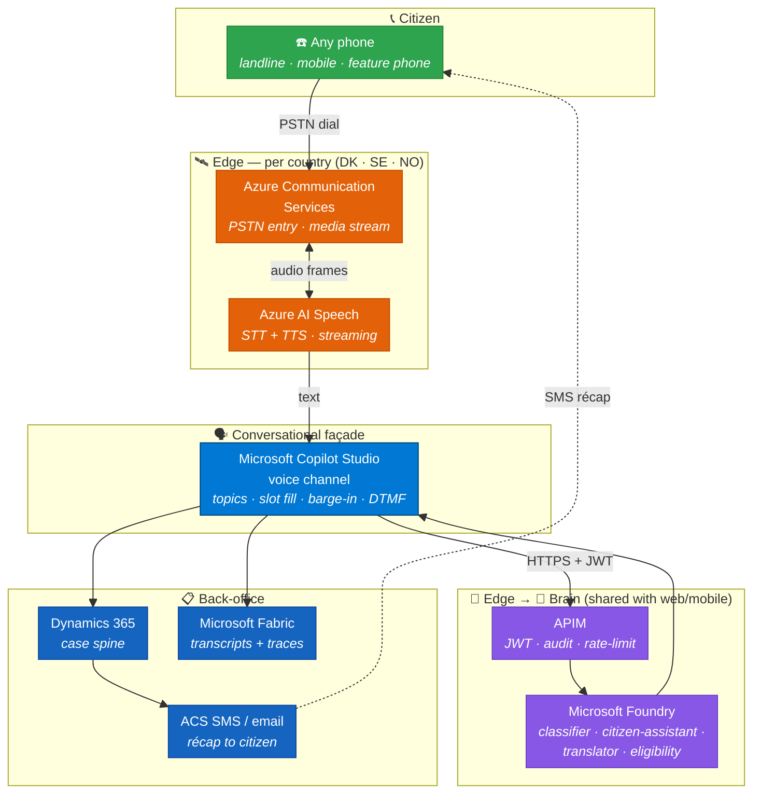
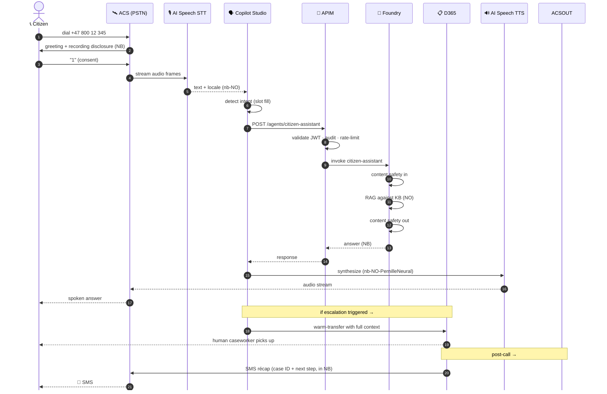
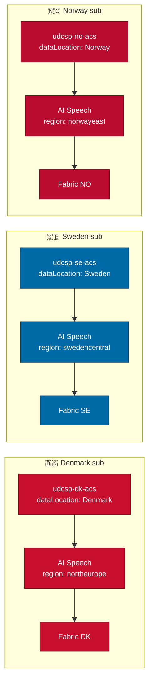
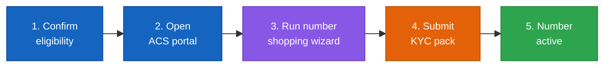
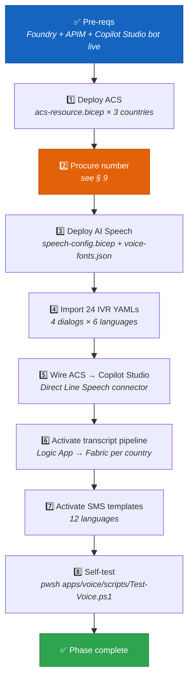

<div align="center">

# 📞 UDCSP — The Voice Channel

### Telephone is a peer of web and mobile, not an afterthought

*How a citizen dials a Nordic toll-free number, talks to the same Foundry brain that powers the web, and gets a spoken answer in their own language — with full GDPR + EU AI Act compliance.*

[](#)
[](#)
[](#)
[](#)

[](#)
[](#)
[](#)
[](#)

</div>

---

> [!IMPORTANT]
> **TL;DR.** A citizen dials a country toll-free number → **Azure Communication Services** answers → **Azure AI Speech** transcribes in streaming → **Microsoft Copilot Studio** voice channel routes the intent → **APIM** validates & audits → the **same Foundry agents** that power the web do the reasoning → **Speech TTS** speaks the answer back in a per-locale neural voice → an **SMS récap** is sent through ACS. **One brain, many faces** — the voice channel re-uses the entire AI control plane, with zero duplication.
>
> | Field | Value |
> |---|---|
> | 🗄️ **Where stored** | Audio/STT in ADLS Gen2 `voice-recordings/`; dialog in Dataverse `bot_session`; ACS call events in `acs-events/`; Foundry traces in App Insights → OneLake Bronze. |

---

## 📑 Table of contents

1. [Why a voice channel at all](#1-why-a-voice-channel-at-all)
2. [The mental model in one picture](#2-the-mental-model-in-one-picture)
3. [The call lifecycle, step by step](#3-the-call-lifecycle-step-by-step)
4. [The six building blocks](#4-the-six-building-blocks)
5. [Multilingual — 12 languages × neural voices](#5-multilingual--12-languages--neural-voices)
6. [Accessibility — DTMF, slow-speech, recording disclosure](#6-accessibility--dtmf-slow-speech-recording-disclosure)
7. [Sovereignty — one ACS resource per country](#7-sovereignty--one-acs-resource-per-country)
8. [SLOs, risks, and mitigations](#8-slos-risks-and-mitigations)
9. [📞 Getting a real phone number you can actually call](#9--getting-a-real-phone-number-you-can-actually-call)
10. [The activation runbook](#10-the-activation-runbook)
11. [How to test it (three levels)](#11-how-to-test-it-three-levels)
12. [The demo script for a jury](#12-the-demo-script-for-a-jury)
13. [Anti-patterns we avoid](#13-anti-patterns-we-avoid)
14. [Where the conversation is stored](#14-where-the-conversation-is-stored)

---

## 1. Why a voice channel at all

The case study is unambiguous (`docs/biz/case-study-11.md` § AI Infusion Point):

> *"A GenAI citizen assistant answers service queries in natural language across web, mobile, **and telephone** channels."*

Three reasons telephone is a **first-class** channel in UDCSP, not a checkbox:

- 🧓 **Inclusion.** A non-trivial fraction of the 2.1 M Scandinavian citizens UDCSP serves cannot, will not, or should not use a screen — elderly citizens, citizens with low digital literacy, citizens with motor or visual disabilities. Voice is the **inclusivity hatch**.
- 📵 **Resilience.** When a portal is down, when an app is uninstalled, when a phone has no data plan, when a user is on the go and cannot type — voice still works. PSTN is the universal fallback.
- 🤝 **Trust.** For sensitive topics (homelessness, domestic violence, child safety, identity theft) talking to a *voice* is more humane than typing into a chat box. The voice channel is configured to escalate to a human caseworker on those topics by default.

The design principle, codified in `docs/biz/uses.md` § Demo 2:

> *"The voice channel is **not an afterthought** — it's a peer of web and mobile, with the same AI agents and the same audit trail."*

---

## 2. The mental model in one picture



> 📖 **Reading the picture.** Green = citizen. Orange = edge (per-country, region-pinned). Blue (light) = the conversational façade (Copilot Studio). Purple = the shared AI brain (the *same* Foundry that powers the web). Dark blue = back-office. **The brain is shared; everything else is voice-specific.**

---

## 3. The call lifecycle, step by step



**Latency budget** (target: end-to-end p95 ≤ 2 s round-trip):

| Hop | Budget | How we hit it |
|---|---|---|
| PSTN → ACS → STT first partial | ~150 ms | ACS edge region in the same country |
| STT streaming | ~200 ms / phrase | Streaming STT (no batch wait) |
| Copilot Studio routing | ~50 ms | Topic decision is local |
| APIM | ~30 ms | Cached JWKS, no cold start |
| Foundry classifier (small) | ~120 ms | Small low-latency model in front of the citizen-assistant |
| Foundry citizen-assistant | ~600 ms | Streaming responses, partial TTS playback |
| TTS streaming | ~200 ms / phrase | Streaming TTS (no buffer-then-play) |
| ACS → citizen | ~150 ms | Same-country edge |

---

## 4. The six building blocks

| # | Block | What it does | Where it lives |
|:-:|---|---|---|
| **1** | **Azure Communication Services (PSTN)** | Decrochés des appels entrants, gestion des numéros toll-free, pont avec le RTC. **One ACS resource per country**, region-pinned for sovereignty. | `apps/voice/acs/acs-resource.bicep`, `apps/voice/acs/phone-numbers.bicep` |
| **2** | **Azure AI Speech (STT + TTS)** | Streaming speech-to-text **and** text-to-speech, per-locale neural voices, civic-term lexicons. | `apps/voice/speech/speech-config.bicep`, `apps/voice/speech/voice-fonts.json` |
| **3** | **Microsoft Copilot Studio · voice channel** | Owns dialog state, slot filling, barge-in, DTMF fallback, escalation rules. Talks **to** Foundry but is **not** Foundry. | `apps/voice/ivr/{da,sv,nb,en,de,ar}/*.yaml`, `apps/copilot-studio/agents/citizen-assistant-bot/topics/voice-fallback.yaml` |
| **4** | **APIM gateway** | JWT validation, audit log, rate-limit, `actor=voice` claim enforcement. The **only** legal entry point to Foundry from any channel. | `services/apim/policies/citizen-assistant.xml` |
| **5** | **Foundry agents (shared)** | Citizen-assistant, classifier, translator, eligibility — the **same** agents that power the web and mobile. **Voice does not get its own agents.** | `foundry/agents/*` |
| **6** | **Outbound notifications** | SMS / email récap post-call via ACS. Localised templates per language. | `apps/voice/notifications/{sms,email}-templates.json` |

Two cross-cutting concerns:

| | Concern | Where |
|:-:|---|---|
| ⚖️ | **Recording consent** — disclosure script in 12 languages, opt-out ("press 0") routes to a non-recorded human queue. | `apps/voice/recording-consent/recording-disclosure.md` |
| 📜 | **Transcript pipeline** — Logic App that pushes call transcripts to the **per-country** Fabric workspace, pseudonymised, correlated with Foundry traces by `correlation-id`. | `apps/voice/transcript-pipeline/logic-app-transcription.json` |

---

## 5. Multilingual — 12 languages × neural voices

The 6 voice locales currently scaffolded in `apps/voice/speech/voice-fonts.json`:

| 🇫🇱 | Language | Speech locale | Neural voice |
|:-:|---|---|---|
| 🇩🇰 | Danish | `da-DK` | `da-DK-ChristelNeural` |
| 🇸🇪 | Swedish | `sv-SE` | `sv-SE-SofieNeural` |
| 🇳🇴 | Norwegian Bokmål | `nb-NO` | `nb-NO-PernilleNeural` |
| 🇬🇧 | English (GB) | `en-GB` | `en-GB-SoniaNeural` |
| 🇩🇪 | German | `de-DE` | `de-DE-KatjaNeural` |
| 🇸🇦 | Arabic | `ar-SA` | `ar-SA-ZariyahNeural` |

The remaining 6 case-study languages (Norwegian Nynorsk, Sámi, French, Polish, Ukrainian, Finnish) are **defined in the i18n bundles** but use a fallback voice in the voice channel today; adding them is a one-line entry in `voice-fonts.json` plus a `voice-fonts.bicep` redeploy. The recording-disclosure script (`apps/voice/recording-consent/recording-disclosure.md`) is **already** localised in **all 12 languages**.

> [!NOTE]
> **Civic-term lexicons.** Each locale has a custom Speech lexicon for nation-specific terminology — `personnummer` (SE), `CPR-nummer` (DK), `fødselsnummer` (NO), `permanent residence permit`, etc. Without lexicons the STT mishears these critical tokens half the time.

---

## 6. Accessibility — DTMF, slow-speech, recording disclosure

The voice channel is the **inclusivity hatch** of UDCSP — it must work for citizens who cannot interact with a screen. Three concrete features:

**🔢 DTMF fallback** — every IVR prompt accepts the keypad as an alternative to speech. Defined globally in `apps/voice/accessibility/dtmf-fallback-flows.yaml`:

```yaml
fallbacks:
  '*': repeat_current_prompt   # always available
  '0': transfer_human_agent    # always available
  '9': enable_slow_speech      # toggle
  '1': residency_application_status
  '2': tax_certificate_status
  '3': child_benefit_status
  '4': notification_preferences
```

**🐢 Slow-speech mode** — pressing `9` at any time switches the TTS to a slower cadence and re-prompts; the choice is **sticky** for the rest of the call.

**🛡️ Recording disclosure (GDPR Art. 5/13)** — the very first thing a caller hears is the disclosure in their detected language; pressing `0` opts out and routes to a non-recorded human queue. Example (Norwegian Bokmål):

> *"Samtalen kan tas opp og transkriberes for å behandle saken din. Trykk 1 for å godta eller 0 for en saksbehandler."*

**🧯 Always-available human escape** — pressing `0` at any prompt, or saying "agent / human / caseworker / complaint", triggers a warm transfer to a D365 caseworker queue with the conversation context intact (`apps/voice/escalation/escalation-config.yaml`).

---

## 7. Sovereignty — one ACS resource per country



What stays in-country: **call media, transcripts, recordings, IVR logs, SMS metadata, neural voice synthesis traces**. What is shared cross-country: **anonymised metrics + the Foundry agent definitions** (the brain is shared; the data is not).

The ACS `dataLocation` property is the load-bearing knob — it pins the persisted data (recordings, call records, SMS) to the country. See `apps/voice/acs/acs-resource.bicep`:

```bicep
resource acs 'Microsoft.Communication/communicationServices@...' = {
  name: 'udcsp-${country}-acs'
  location: 'Global'
  properties: {
    dataLocation: location   // 'Denmark' | 'Sweden' | 'Norway'
  }
}
```

---

## 8. SLOs, risks, and mitigations

| | SLO | Target | How we measure |
|:-:|---|---|---|
| ⚡ | **Round-trip latency** (citizen says X → hears answer) | p95 ≤ **2 s** | App Insights custom event from STT-final to TTS-first-byte |
| 🎯 | **Intent recognition** (correct route on first try) | ≥ **88 %** per locale | Foundry eval pipeline replays a labelled audio gold set per release |
| 🤝 | **Successful answer without escalation** | ≥ **70 %** | D365 outcome tagging |
| 📞 | **PSTN reachability** | ≥ **99.9 %** monthly | ACS health metrics + synthetic call probes every 5 min per country |
| 🛡️ | **Content safety triggers blocked** | **100 %** | Content Safety verdicts compared to red-team test set per release |

Risks tracked in `docs/tech/plan.md` § Risk register (R3 is voice-specific):

> **R3 — Voice channel latency > 2 s p95.** Mitigations: edge ACS region per country; warm pools; small low-latency classifier in front of the citizen-assistant; **streaming** STT and TTS (never batch).

---

## 9. 📞 Getting a real phone number you can actually call

This is the practical question — *can we hand a Nordic toll-free number to the jury and let them dial it?* **Yes**, with a clear procedure. Here is the playbook, country by country, anchored to current Microsoft documentation as of **May 2025**.

### 9.1 Eligibility (read this first or you will hit a wall)

| Pre-requisite | Why | How to satisfy |
|---|---|---|
| **Paid Azure subscription** (no trial, no MSDN, no free credits) | ACS phone-number procurement is **not** allowed on free or sponsored subscriptions | Use a **pay-as-you-go**, EA, or CSP subscription with a billing address in DK / SE / NO or an EU/EFTA member state |
| **ACS resource in the right `dataLocation`** | Numbers can only be ordered against an ACS resource whose data location matches the target country | `udcsp-{dk,se,no}-acs` Bicep already enforces this |
| **KYC / "Know Your Customer" pack** | EU / EFTA telecom regulators (PTS in Sweden, Nkom in Norway, ERST in Denmark) require operator-level identity verification | Company registration certificate, proof of business address, intended use description, contact person, signed Microsoft KYC form |
| **Address-of-record per country** | Some Nordic regulators require the number to map to a verifiable address **inside** the country of issuance | A national agency partner address suffices; a foreign address does **not** |

> [!WARNING]
> **Ineligible subscriptions silently disable the "Get phone number" wizard in the Azure portal.** If the wizard greys out or shows "no numbers available", the cause is almost always (1) a free / trial subscription, or (2) a billing address outside the eligible region. It is **not** a stock-out.

### 9.2 The procurement procedure (5 steps, real-world)



1. **Confirm eligibility** (subscription type + billing address + ACS resource + KYC pack ready).
2. **Open the Azure portal** → your ACS resource (e.g. `udcsp-no-acs`) → blade **Phone numbers** → **+ Get**.
3. **Run the number-shopping wizard.** Choose:
   - **Country / region** — Denmark, Sweden, or Norway.
   - **Number type** — *Toll-Free* (recommended for citizen-facing service) or *Geographic / Local*.
   - **Capabilities** — *Inbound calling* (mandatory for our use case), *Outbound calling* (optional, regulator-dependent), *SMS* (varies by country).
   - **Quantity** — 1 per country for the demo; production typically 2–5 per country with overflow routing.
4. **Submit the KYC pack.** The portal launches a regulatory questionnaire; for non-instant-provisioning countries (most Nordic + toll-free) you also email the signed KYC form to ACS. Microsoft routes it to the local regulator's intake.
5. **Number active.** Lead times typically:
   - 🇸🇪 **Sweden** — toll-free: a few business days · local: usually instant.
   - 🇳🇴 **Norway** — toll-free: 1–3 weeks (Nkom review) · local: a few business days.
   - 🇩🇰 **Denmark** — toll-free: 1–3 weeks (ERST review) · local: a few business days.

The number then appears under your ACS resource and can be assigned to the Copilot Studio voice channel (Direct Line Speech connector) by name — **no code change is needed**.

### 9.3 The fast lane — what to do *today* for a demo

If you don't want to wait 1–3 weeks for a real Nordic toll-free number, three lower-friction options are available **right now**:

| Option | Lead time | Caller experience | Best for |
|---|---|---|---|
| **🇺🇸 US toll-free + ACS** | Minutes | Caller dials a US number · same audio quality | Internal demos · jury rehearsal |
| **🇬🇧 UK local + ACS** | Minutes | Caller dials a UK landline · same audio quality | EMEA demos when caller is in Europe |
| **🎧 ACS *direct calling* (no PSTN)** | Zero | Demo from a browser via the ACS Web SDK — **no phone number required** | Jury demos in the room · CI tests |

Microsoft documentation we anchor to:

- 🔗 [Phone Number Management for Norway](https://learn.microsoft.com/en-us/azure/communication-services/concepts/numbers/phone-number-management-for-norway)
- 🔗 [Country/region availability of telephone numbers and subscription eligibility](https://learn.microsoft.com/en-us/azure/communication-services/concepts/numbers/sub-eligibility-number-capability)
- 🔗 [Quickstart — Get and manage phone numbers using ACS](https://learn.microsoft.com/en-us/azure/communication-services/quickstarts/telephony/get-phone-number)
- 🔗 [Calling with toll-free numbers — capabilities & limitations](https://learn.microsoft.com/en-us/azure/communication-services/concepts/telephony/toll-free-calling)

> [!TIP]
> **For the case-study jury, our recommended sequence is:**
>
> 1. **Live in the room** — open the ACS Web SDK demo client in a browser and call the Foundry-backed Copilot Studio agent. **Zero phone-number dependency**, full audio + transcript + Foundry trace shown side-by-side.
> 2. **Then prove the PSTN path** — dial a temporary US toll-free (provisioned in minutes) on the room speakerphone. Same backend, different ingress.
> 3. **Then commit to a real Nordic number for production** — submit the KYC pack on the day of the kick-off; the Norwegian / Swedish / Danish toll-free arrives well before any actual citizen traffic.

This is exactly what `apps/voice/acs/phone-numbers.bicep` is designed for: it is **deliberately** a placeholder Bicep with `+45...` / `+46...` / `+47...` outputs because the real numbers are issued by the regulator, not declared in source.

### 9.4 Once the number is active — wiring it in

The activation is a **one-line config change** in the Copilot Studio voice channel:

```yaml
# apps/voice/acs/phone-number-bindings.yaml  (created at activation time)
bindings:
  - country: no
    phoneNumber: "+47 800 12 345"     # the actual Nkom-approved toll-free
    acsResource: "udcsp-no-acs"
    copilotStudioBot: "citizen-assistant-bot-no"
    voiceFont: "nb-NO-PernilleNeural"
```

`scripts/install/modules/Install-Voice.psm1` reads this file at install time and:

1. Registers the number with the Copilot Studio voice channel via the Direct Line Speech connector.
2. Updates the SMS-récap "from" number for outbound notifications.
3. Adds the number to the synthetic-call probe list (App Insights availability test every 5 min).

**That's it.** No code change, no redeploy of agents, no Foundry change.

---

## 10. The activation runbook



All of this is automated by `scripts/install/modules/Install-Voice.psm1` (phase 11 of the master installer). The only manual step is **§ 9 — phone-number procurement**, because no installer can speed up a regulator.

---

## 11. How to test it (three levels)

| Level | Command | What it proves | Lead time |
|---|---|---|---|
| **🚦 Smoke (isolated)** | `pwsh apps/voice/scripts/Test-Voice.ps1` | The voice stack responds; STT/TTS round-trip works; intent is recognised. **No PSTN, no ACS billing.** | < 30 s |
| **🧪 E2E simulated** | `npx playwright test tests/e2e/tests/scenario-02-lars-no-voice.spec.ts` | Lars NO end-to-end via the ACS test harness — every layer real except the PSTN ingress. | ~2 min |
| **📞 Live call** | Dial the provisioned number from a real phone | The full PSTN path. Validates carrier, number formatting, audio quality, and the Foundry-trace ↔ ACS-call-record correlation. | Manual |

---

## 12. The demo script for a jury

5 minutes, no setup beyond the deployed platform:

| Beat | Action | What the jury sees | Eval-matrix rows hit |
|:-:|---|---|---|
| 1 | Open the ACS Web SDK demo client in a browser; call the Norwegian agent | Greeting in NB; recording disclosure | #2 (federation) · #8 (a11y) · #12 (channels) |
| 2 | Speak: *"Hvorfor er skatterefusjonen min så lav i år?"* (NO) | Streaming STT, intent classified in < 200 ms | #5 (AI 12 lang) · #6 (assistant) |
| 3 | The agent answers in NB, citing the relevant rule | Spoken answer in `nb-NO-PernilleNeural`; trace visible in Foundry | #6 · #15 (audit) |
| 4 | Press `0` (or say "agent") | Warm transfer to a caseworker queue with full context | #16 (caseworker) |
| 5 | After hangup, jury looks at the Power BI dashboard | Call appears in CSAT chart, transcript stored in NO Fabric workspace | #4 (CSAT) · #10 (sovereignty) |

> [!TIP]
> If a real Nordic number has been provisioned, repeat beat 1 by dialling the toll-free on the room speakerphone — same backend, different ingress, **proof that PSTN works end-to-end**.

This corresponds to **Demo 2** in [`uses.md`](./uses.md#-demo-2--lars-asks-the-voice-assistant-about-his-tax-refund-norwegian).

---

## 13. Anti-patterns we avoid

| ❌ Anti-pattern | ✅ What we do instead |
|---|---|
| Build a separate "voice bot" with its own logic | One brain (Foundry), one set of agents, voice is just a channel adapter |
| Hard-code phone numbers in source | Bicep emits *placeholder* outputs; real numbers are bound at install time via `phone-number-bindings.yaml` |
| Batch STT (wait for end-of-utterance) | Streaming STT — partial results trigger early classification |
| Buffer-then-play TTS | Streaming TTS — first audio frame plays while the rest synthesises |
| One ACS for all three countries | One ACS **per** country, region-pinned, enforced by Bicep `dataLocation` |
| Recording everything by default | Disclosure first; opt-out via `0` is a real, fully-functional path |
| Voice has its own KB | Same KB as the web; voice queries the same RAG indices |
| Skip the warm transfer (hard transfer to a queue) | Warm transfer with conversation context preserved into the D365 case |

---

## 14. Where the conversation is stored

Voice writes both media and dialog records: raw `.wav` plus STT JSON go to the per-country `voice-recordings/` store, while the Copilot Studio conversation is retained as the canonical dialog transcript in Dataverse. ACS lifecycle events and Foundry traces stay in Zone 3 so audits can correlate call, transcript, and AI invocation. See [`../tech/data.md`](../tech/data.md) § 3.3 for the Zone 3 policy.

| What | Where | Retention |
|---|---|---|
| Audio `.wav` + STT JSON | ADLS Gen2 `voice-recordings/` (per country, WORM, CMK) | 90 days; audio purged for minimisation |
| Dialog transcript | Dataverse `bot_session`; mirrored to OneLake | 6 months hot; 6 years OneLake |
| ACS call events | ACS Event Hubs → ADLS Gen2 `acs-events/` | See § 5 retention matrix |
| Foundry trace | App Insights → OneLake Bronze | 180 days hot; then Bronze |

For the full retention matrix, use [`../tech/data.md`](../tech/data.md) § 5.

> Audio is deliberately shorter-lived than transcripts: the transcript persists for EU AI Act Art. 26(6), while audio is purged after 90 days under GDPR minimisation.

> 📖 Full storage architecture and retention rules: see [`../tech/data.md`](../tech/data.md).

---

<div align="center">

*The voice channel is one of the four front doors of UDCSP — and the most inclusive one.*  🇩🇰 🇸🇪 🇳🇴

[](./uses.md#-demo-2--lars-asks-the-voice-assistant-about-his-tax-refund-norwegian)
[](../tech/agents.md)
[](../tech/installation.md)

</div>
