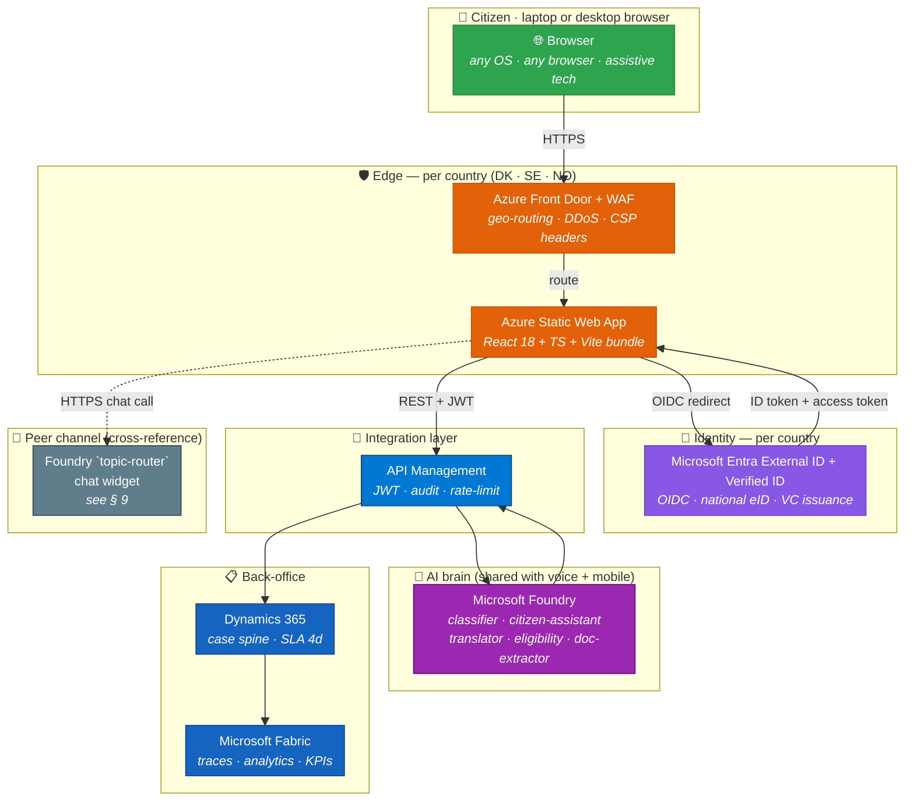
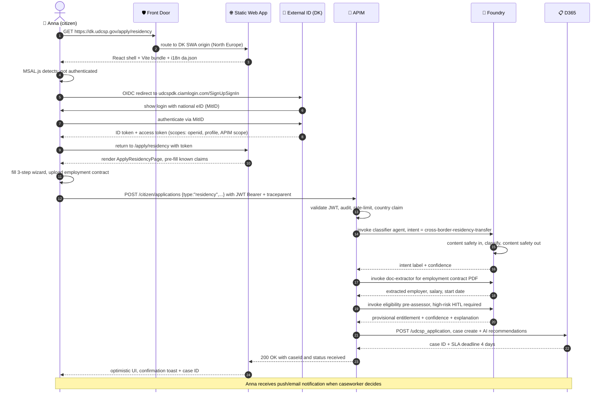
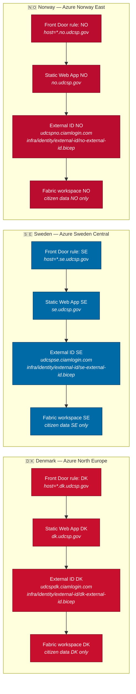
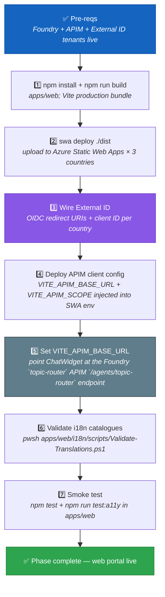

<div align="center">

# 🌐 UDCSP — The Web Portal

</div>

> ℹ️ **Live vs roadmap.** External ID per-country sign-in, the 12-language wizard, eligibility Foundry-driven and the My Cases re-hydration are live on `udcsp.fredgis.com`. **Verified ID cross-border credential issuance is roadmap** — see [`../tech/inprogress.md`](../tech/inprogress.md).

> [!NOTE]
> **Channel surface only.** This document covers the React+Vite portal — pages, accessibility, routing, citizen-facing UX. The agent routing topology (which Foundry agent handles which intent, how the topic-router fans out, what happens when content safety blocks a turn) lives in [`ai.md`](./ai.md). When in doubt, this doc owns *how the citizen sees the platform on the web*; `ai.md` owns *how the platform thinks*.

<div align="center">

### The single digital front door for 2.1 million Nordic citizens

*How Anna opens a laptop browser, logs in with her national eID, submits a cross-border residency application in her own language, and gets a response in four days — with full GDPR + WCAG 2.1 AA compliance and three countries' sovereignty intact.*

[](#)
[](#)
[](#)
[](#)

[](#)
[](#)
[](#)
[](#)

</div>

---

> [!IMPORTANT]
> **TL;DR.** A citizen opens `udcsp.dk` (or `.se` / `.no`) → **Azure Front Door** routes the request to the nearest **Static Web App** → **MSAL.js** authenticates the citizen against the **per-country Microsoft Entra External ID tenant** → the React shell loads the ICU locale catalogue for their language → form data flows through **APIM** (JWT-validated) → **Microsoft Foundry agents** classify, extract, and pre-assess eligibility → a case lands in **Dynamics 365** → the page shows an optimistic confirmation. **One portal, three country brandings, twelve languages, zero code forks.**
>
> | Field | Value |
> |---|---|
> | 🗄️ **Where stored** | Chat transcript in Dataverse `bot_session`; form drafts in Azure Cache for Redis Enterprise (ephemeral state) + PostgreSQL JSONB (drafts over 24 h); uploads in ADLS `citizen-uploads/`; memory in Azure AI Search; traces in App Insights → OneLake. |

---

## 📑 Table of contents

1. [Why a web portal at all](#1-why-a-web-portal-at-all)
2. [The mental model in one picture](#2-the-mental-model-in-one-picture)
3. [The page-load lifecycle, step by step](#3-the-page-load-lifecycle-step-by-step)
4. [The seven building blocks](#4-the-seven-building-blocks)
5. [Multilingual — 12 languages × ICU MessageFormat](#5-multilingual--12-languages--icu-messageformat)
6. [Accessibility — WCAG 2.1 AA, screen-readers, keyboard-only](#6-accessibility--wcag-21-aa-screen-readers-keyboard-only)
7. [Sovereignty — one cookie domain per country, one External ID tenant per country](#7-sovereignty--one-cookie-domain-per-country-one-external-id-tenant-per-country)
8. [SLOs, risks, and mitigations](#8-slos-risks-and-mitigations)
9. [🌐 Embedding the AI assistant in the page](#9--embedding-the-ai-assistant-in-the-page)
10. [The activation runbook](#10-the-activation-runbook)
11. [How to test it (three levels)](#11-how-to-test-it-three-levels)
12. [The demo script for a jury](#12-the-demo-script-for-a-jury)
13. [Anti-patterns we avoid](#13-anti-patterns-we-avoid)
14. [Where the conversation is stored](#14-where-the-conversation-is-stored)

---

## 1. Why a web portal at all

The case study is unambiguous (`docs/biz/case-study-11.md` § Transformation Objective):

> *"Create a federated digital citizen services platform that enables cross-border service delivery, automates back-office processing, and provides inclusive, accessible experiences within national sovereignty frameworks."*

And from § Business Challenge:

> *"Three Nordic governments … operate **47 citizen-facing service portals**, each built on different legacy platforms."*

Three reasons the web portal is a **first-class** channel in UDCSP, not just a modernisation checkbox:

- 🏛️ **Digital-by-default mandate.** Nordic governments operate under a policy of digital-first service delivery. Citizens have a right to receive public services electronically. A unified portal directly answers the case study's requirement to consolidate **47 portals into 1** — the "single front door, many back doors" principle (architecture P4).
- ♿ **Accessibility law (WCAG 2.1 AA).** The case study explicitly calls out: *"full **WCAG 2.1 AA** accessibility compliance achieved."* The web portal is the accessibility flagship — it must serve citizens with motor disabilities, low vision (NVDA/JAWS), cognitive impairments, and users of assistive technology. The voice channel is the *inclusivity hatch*; the web portal is the *inclusion baseline*.
- 🏠 **Portal rationalisation 47 → 1.** The 47 legacy portals are built on different platforms, collect duplicate PII, and produce inconsistent citizen experiences. The UDCSP web portal is the single authenticated surface through which citizens interact with Denmark, Sweden, and Norway — without knowing or caring which agency sits behind each service. Back-office integrations are mediated through APIM; the citizen sees **one portal, one case inbox, one identity**.

The design principle, codified in `docs/tech/architecture.md` § 1 (P4):

> *"Single front door, many back doors."*

---

## 2. The mental model in one picture



> 📖 **Reading the picture.** Green = citizen. Orange = edge (Static Web App + Front Door, per-country hosted). Purple = External ID auth. Blue = the APIM gateway (the only legal entry point to Foundry from any channel). Dark blue = back-office. Grey = the Foundry `topic-router` chat widget, which is a **peer** channel embedded in the web shell — it shares the same Foundry brain. The brain is shared; per-country data is not.

---

## 3. The page-load lifecycle, step by step



**Latency budget** (target: page interactive p95 ≤ 1.5 s):

| Hop | Budget | How we hit it |
|---|---|---|
| Front Door routing | ~20 ms | Anycast edge, North Europe for DK |
| SWA CDN static assets | ~80 ms | Vite bundle + i18n JSON, cache-control: immutable |
| External ID OIDC round-trip | ~200 ms | Already warm from browser cookie |
| MSAL.js token refresh (silent) | ~100 ms | sessionStorage cache; no round-trip when token fresh |
| APIM JWT validation | ~30 ms | Cached JWKS, no cold start |
| Foundry classifier (small) | ~120 ms | Small low-latency model before citizen-assistant |
| Foundry doc-extractor | ~400 ms | Streaming; UI shows progress bar |
| D365 case create | ~150 ms | Dataverse Web API, North Europe region |

---

## 4. The seven building blocks

| # | Block | What it does | Where it lives |
|:-:|---|---|---|
| **1** | **Azure Static Web App** | Hosts the pre-built Vite/React bundle at the edge; SPA fallback (`index.html` for all routes); `/api/*` routes require `authenticated` role; CSP headers enforced globally. | `apps/web/staticwebapp.config.json`, `infra/landing-zone/modules/networking.bicep` |
| **2** | **Vite + React 18 + TypeScript** | Single-page application shell; React Router for client-side routing (10 pages: Home, Apply Residency, Apply Tax Cert, Apply Child Benefit, My Cases, Case Detail, Consent, Accessibility, Login, Logout Callback); Fluent UI v9 design system; hot module replacement in dev, optimised bundle in prod. | `apps/web/vite.config.ts`, `apps/web/src/App.tsx`, `apps/web/src/pages/` |
| **3** | **MSAL.js + External ID + Verified ID per country** | `@azure/msal-browser` + `@azure/msal-react` pick the per-country OIDC authority (`udcspdk/se/no.ciamlogin.com`) from `localStorage` country preference; tokens cached in `sessionStorage` (never `localStorage`); `loginRequest` includes the APIM scope; post-logout redirect to `/logout-callback`; Verified ID issues cross-border residency and eligibility receipt credentials via `infra/identity/verified-id/`. | `apps/web/src/auth/msalConfig.ts` |
| **4** | **ICU MessageFormat i18n bundles** | `react-intl` (ICU MessageFormat) loads the locale catalogue from `/i18n/messages/{lang}.json` at runtime; 12 locale files produced by the A12 / agent-foundry translation pipeline; RTL direction toggled on `<html>` for `ar`; locale-aware date/number/currency formatting via `Intl` API. | `apps/web/i18n/messages/*.json`, `apps/web/src/utils/language.ts` |
| **5** | **APIM contract clients** | Five typed fetch wrappers mirror the APIM OpenAPI contracts — `applications.ts`, `cases.ts`, `documents.ts`, `eligibility.ts`, `client.ts` (base, with exponential-backoff retry and W3C `traceparent` header on every request). | `apps/web/src/api/` |
| **6** | **Foundry topic-router chat widget** | `ChatWidget.tsx` posts directly to APIM `/agents/topic-router`; passes `channel=web`, `locale`, and `traceparent`; lazy-loaded; backed by the same Foundry agents as voice/mobile. This replaces the previous iframe/channel-adapter approach. See **§ 9**. | `apps/web/src/components/ChatWidget.tsx` |
| **7** | **WCAG 2.1 AA assistive layer** | `SkipNav` → `#main-content`; `AccessibilityMenu` (font scale, high-contrast, reduce-motion, dyslexic font); `BreadcrumbsAccessible`; `LoadingSpinnerAccessible`; CSS tokens (`tokens.css`, `accessibility.css`, `dyslexic-font.css`); `AccessibilityStatementPage`; axe-core in CI. | `apps/web/src/components/`, `apps/web/src/styles/`, `apps/web/i18n/accessibility/` |
| **8** | **Citizen insights components** | Lightweight HTML/JS dashboards replace citizen-facing embedded BI: Chart.js + React wrappers render SLA, CSAT, and case progress without embedded BI licensing. Power BI Premium remains for internal ops, exec, and auditor users. | `apps/web/src/components/insights/` |

> [!NOTE]
> **Playwright is also in `apps/web`** (`playwright.config.ts`) but the E2E suite itself lives in `tests/e2e/` — owned by A14. The `apps/web` config is the configuration; the specs are in `tests/e2e/tests/scenario-01-anna-dk-to-se.spec.ts` et al.

---

## 5. Multilingual — 12 languages × ICU MessageFormat

The 12 locale catalogues in `apps/web/i18n/messages/`:

| 🏳️ | Locale code | Language | Script | Direction | Notes |
|:-:|---|---|---|:-:|---|
| 🇩🇰 | `da` | Danish | Latin | LTR | Primary language for DK portal |
| 🇸🇪 | `sv` | Swedish | Latin | LTR | Primary language for SE portal |
| 🇳🇴 | `nb` | Norwegian Bokmål | Latin | LTR | Primary for NO portal; ~90 % of NO speakers |
| 🇳🇴 | `nn` | Norwegian Nynorsk | Latin | LTR | Statutory language equal to Bokmål in NO |
| 🏔️ | `se` | Northern Sámi | Latin + diacritics | LTR | Indigenous language (Davvisámegiella) |
| 🇬🇧 | `en` | English | Latin | LTR | Default fallback; interface for immigrants |
| 🇩🇪 | `de` | German | Latin | LTR | German-speaking residents in all 3 countries |
| 🇫🇷 | `fr` | French | Latin | LTR | French-speaking residents |
| 🇵🇱 | `pl` | Polish | Latin | LTR | Largest non-Scandinavian community in NO/SE |
| 🇸🇦 | `ar` | Arabic | Arabic | **RTL** | RTL; requires `dir="rtl"` on `<html>` |
| 🇺🇦 | `uk` | Ukrainian | Cyrillic | LTR | Significant recent-arrival community |
| 🇫🇮 | `fi` | Finnish | Latin | LTR | Finnish-speakers in Norway and Sweden |

**How the i18n pipeline works:**

1. **Source of truth:** `apps/web/i18n/messages/en.json` — 30 ICU-formatted string keys (navigation, forms, errors, statuses, accessibility labels, banners).
2. **Translation pipeline:** `apps/web/i18n/pipeline/translation-pipeline.yaml` orchestrates Azure AI Translator + human-review hooks; outputs are validated against the glossary in `apps/web/i18n/pipeline/glossary.csv`.
3. **Quality gates:** `apps/web/i18n/quality-gates/translation-qa-rules.md` defines rules (no missing keys, no broken ICU placeholders, no untranslated `[AR]`/`[PL]` stubs); `apps/web/i18n/scripts/Validate-Translations.ps1` runs in CI.
4. **Runtime loading:** `src/utils/language.ts` → `loadMessages(lang)` fetches `/i18n/messages/{lang}.json` at runtime; the SPA re-renders via `react-intl`'s `<IntlProvider>`.
5. **RTL support:** `persistLanguage('ar')` sets `document.documentElement.dir = 'rtl'`; CSS logical properties handle layout mirroring automatically.

**ICU MessageFormat features used:**

```json
// Plural (English):
"language.current": "Current language: {language}",
"case.reference": "Case reference: {caseId}",
"date.submitted": "Submitted on {date}"
```

ICU MessageFormat supports `{count, plural, one {# item} other {# items}}` and `{gender, select, male {...} female {...} other {...}}` — the translation pipeline enforces correct plural forms per locale (e.g., Polish has 4 plural forms; Arabic has 6).

**Locale-aware formatting:** All dates, numbers, and currency amounts are formatted via the browser `Intl` API, not hard-coded strings — ensuring, for example, that Norwegian citizens see `12. mars 2025` rather than `2025-03-12`.

> [!TIP]
> The `Validate-Translations.ps1` script (`apps/web/i18n/scripts/Validate-Translations.ps1`) is the single command to check all 12 catalogues for missing keys, broken ICU placeholders, and RTL markers. Run it before any i18n PR merge.

---

## 6. Accessibility — WCAG 2.1 AA, screen-readers, keyboard-only

The case study is explicit: *"full WCAG 2.1 AA accessibility compliance achieved."* The web portal is the accessibility showcase of UDCSP. This section describes the concrete implementation anchored to source files.

### 6.1 Skip navigation

`index.html` contains a `.skip-link` anchor to `#main-content` **before** the React root — so screen-reader users and keyboard-only users can bypass the global navigation without waiting for React to hydrate. `src/components/SkipNav.tsx` renders the same link inside the React tree for post-hydration navigation.

### 6.2 Screen-reader landmarks

`App.tsx` uses semantic HTML5 landmarks: `<header>`, `<nav aria-label="Main">`, `<main id="main-content" tabIndex={-1}>`. Every page heading hierarchy starts at `<h1>`. ARIA live regions (`role="status" aria-live="assertive"`) are used in form pages (`ApplyResidencyPage.tsx`) to announce progress and errors without requiring focus movement.

### 6.3 Focus management

After route transitions, `<main id="main-content" tabIndex={-1}>` is programmatically focused so screen-reader users are placed at the top of the new page content — not stranded at the last interactive element of the previous page. All dialogs and modals use `aria-modal` and return focus on close.

### 6.4 Contrast tokens and theming

`apps/web/src/styles/tokens.css` defines CSS custom properties for colours, spacing, and typography derived from Fluent UI v9's design tokens. All foreground/background colour pairs meet the WCAG AA contrast ratio (4.5:1 for normal text, 3:1 for large text). High-contrast mode is toggled via the `.high-contrast` class on `<html>` (applied by `applyAccessibility()` in `src/utils/accessibility.ts`).

### 6.5 Reduced-motion

The `.reduce-motion` class on `<html>` activates `@media (prefers-reduced-motion: reduce)` overrides in `accessibility.css`, suppressing all CSS transitions and animations for users who opt in. The `AccessibilityMenu` component exposes this as a toggle, and the preference persists via `localStorage`.

### 6.6 Dyslexic font

`dyslexic-font.css` loads OpenDyslexic (or a system fallback) when the `.dyslexic-font` class is active. This is an opt-in feature exposed in the `AccessibilityMenu`.

### 6.7 Keyboard-only navigation

Fluent UI v9 components are keyboard-accessible by default. The language switcher (`LanguageSwitcher.tsx`), breadcrumbs (`BreadcrumbsAccessible.tsx`), and loading spinner (`LoadingSpinnerAccessible.tsx`) are all wrapped with explicit ARIA roles and keyboard handlers. The chat widget panel is given `aria-label="Foundry topic-router citizen assistant"` for assistive technology identification.

### 6.8 Automated axe-core scanning

`package.json` includes `@axe-core/react` and `axe-core` as dev dependencies; `tests/Home.a11y.test.tsx` runs axe on the home page in Vitest. The full CI accessibility gate is owned by A14 in `tests/accessibility/`.

### 6.9 Accessibility statement

`apps/web/i18n/accessibility/accessibility-statement-template.md` provides the per-country accessibility statement template (required by EU Web Accessibility Directive). The rendered statement is available at `/accessibility` via `AccessibilityStatementPage.tsx`. The WCAG 2.1 AA checklist (`apps/web/i18n/accessibility/wcag-2.1-aa-checklist.md`) maps every POUR criterion to implemented components: navigation, forms, status banner, language switcher, chat entry, document upload, error summary, notification panel.

---

## 7. Sovereignty — one cookie domain per country, one External ID tenant per country



### 7.1 Per-country cookie domain

Each portal is served on a **distinct registrable domain**:

| Country | Domain | Cookie scope |
|---|---|---|
| 🇩🇰 Denmark | `dk.udcsp.gov` / `*.dk.udcsp.gov` | Cookies scoped to `dk.udcsp.gov` only — never shared with SE or NO |
| 🇸🇪 Sweden | `se.udcsp.gov` / `*.se.udcsp.gov` | Cookies scoped to `se.udcsp.gov` only |
| 🇳🇴 Norway | `no.udcsp.gov` / `*.no.udcsp.gov` | Cookies scoped to `no.udcsp.gov` only |

The `staticwebapp.config.json` sets `Strict-Transport-Security` and `Referrer-Policy` headers globally. Session tokens are stored in `sessionStorage` (not cookies) per `msalConfig.ts` — aligning with the MSAL.js security recommendation and avoiding any cross-country token leakage.

### 7.2 Per-country External ID OIDC authority

`apps/web/src/auth/msalConfig.ts` resolves the authority at runtime from the user's country preference:

```typescript
export const authorityForCountry = (country: Country) =>
  `https://udcsp${country}.ciamlogin.com/udcsp${country}.onmicrosoft.com/SignUpSignIn`;
// country = 'dk' → udcspdk.ciamlogin.com
// country = 'se' → udcspse.ciamlogin.com
// country = 'no' → udcspno.ciamlogin.com
```

Each External ID tenant is declared in its own Bicep file:
- `infra/identity/external-id/dk-external-id.bicep`
- `infra/identity/external-id/se-external-id.bicep`
- `infra/identity/external-id/no-external-id.bicep`

User flows, custom policies, and national eID connections (MitID for DK, BankID for SE, BankID NO for NO) are defined per tenant in `infra/identity/external-id/user-flows/`.

### 7.3 Per-country brand theming

The `getCountry()` helper (`msalConfig.ts`) reads `udcsp.country` from `localStorage`. The React app applies a per-country CSS class to `<html>` — DK uses Danish red/white, SE uses Swedish blue/yellow, NO uses Norwegian red/white — all defined as CSS custom property overrides in `tokens.css`. **No code forks; one codebase, three themes.**

What stays in-country: **citizen PII, session tokens, application data, uploaded documents, Fabric analytics**. What is shared cross-country: **anonymised metrics, the Foundry agent definitions, the APIM gateway config, and the React codebase itself.**

---

## 8. SLOs, risks, and mitigations

| | SLO | Target | How we measure |
|:-:|---|---|---|
| ⚡ | **TTFB** (time to first byte) | p95 ≤ **200 ms** | Front Door diagnostics + App Insights custom metric `ttfb_p95` |
| 📱 | **Lighthouse score — mobile** | ≥ **95** (Performance + Accessibility + Best Practices) | Lighthouse CI in every PR; budget enforced |
| ♿ | **WCAG 2.1 AA conformance** | **100 %** automated + 0 critical manual findings | axe-core in CI; quarterly manual audit |
| 🚀 | **Page load p95** (Largest Contentful Paint) | ≤ **1.5 s** on 4G mobile | Synthetic test from 3 countries via App Insights availability |
| 🟢 | **Availability** | ≥ **99.9 %** monthly | Front Door health-probe + SWA status endpoint |
| 🔐 | **Auth success rate** (OIDC round-trip) | ≥ **99.5 %** | MSAL.js telemetry → App Insights |

Risks tracked in `docs/tech/plan.md` § Risk Register that affect the web portal:

> **R1 — Cross-border data flow violates a national DPA interpretation.** The web portal never sends raw PII across country lines; only claims-based tokens mediated by the eIDAS bridge. Mitigation: per-country Purview policy packs, legal review per data flow, claims-based mediation only.

> **R2 — Eligibility model bias.** The web portal surfaces the eligibility agent's output to citizens. Mitigation: high-risk AI classification, golden eval datasets covering protected attributes, shadow-mode rollout, mandatory human caseworker review before any eligibility decision is communicated.

> **R5 — AI Act conformity for high-risk agent.** The residency-transfer eligibility pre-assessor is a high-risk EU AI Act system. Mitigation: documentation pipeline in Foundry; conformity assessment artefacts produced from evals + tracing; the web portal always shows the disclosure banner (`banner.aiDisclosure` key in i18n catalogues).

**R12 — Multilingual quality drift.** With 12 languages, i18n key drift is a real risk: a new string key added in `en.json` but not propagated to all locales. Mitigation: `Validate-Translations.ps1` runs in CI and blocks the PR if any key is missing in any locale.

---

## 9. 🌐 Embedding the AI assistant in the page

> **Scope:** The web channel hosts the chat surface, but intelligence is in Foundry. This replaces the previous channel-adapter approach; it is now APIM `/agents/topic-router`.

### 9.1 The direct APIM call

```ts
await fetch(`${import.meta.env.VITE_APIM_BASE_URL}/agents/topic-router`, {
  method: 'POST',
  headers: { Authorization: `Bearer ${token}`, traceparent },
  body: JSON.stringify({ channel: 'web', locale, text })
});
```

`ChatWidget.tsx` remains the host component, but it no longer renders an embedded assistant frame or requests a channel token. It sends the citizen utterance to APIM, receives a channel-shaped response from Foundry `topic-router`, and renders citations/actions as React components.

### 9.2 Citizen-facing insights without embedded BI

Citizen status and outcome tiles are HTML/JS components in `apps/web/src/components/insights/` using Chart.js + React wrappers. They show case progress, expected SLA, and accessibility-friendly charts. **Power BI Premium is kept for internal users** — operations, executives, and auditors — but citizen pages do not embed Power BI.

---

## 10. The activation runbook



All of this is automated by `scripts/install/modules/Install-Apps.psm1` (phase **Apps** of the master installer, work package A9). The key steps from the module:

```powershell
# Install-Apps.psm1 (excerpt — scaffold)
# Step 1: build the web portal
"[scaffold] cd $repo\apps\web; npm install; npm run build"
# Step 2: deploy to Static Web Apps
"[scaffold] swa deploy ./dist --env production"
```

The `Test-Apps` function in the same module validates that all 12 i18n catalogue files are present before declaring the phase complete.

---

## 11. How to test it (three levels)

| Level | Command | What it proves | Lead time |
|---|---|---|---|
| **🚦 Smoke (unit + a11y)** | `npm run test --prefix apps/web` | Vitest unit tests: API client retry logic, language detection, traceparent format. `npm run test:a11y` runs axe-core on the home page. **No real backend, no OIDC.** | < 30 s |
| **🧪 E2E (Playwright)** | `npx playwright test tests/e2e/tests/scenario-01-anna-dk-to-se.spec.ts` | Anna's cross-border residency transfer — full web journey: DK External ID login, wizard form fill, Foundry classifier response, D365 case creation, optimistic confirmation toast. Every layer real except PSTN. | ~ 3 min |
| **🌐 Live (browser)** | Open `https://dk.udcsp.gov` in a browser | The full stack: Front Door routing, SWA CDN, External ID OIDC, APIM JWT validation, Foundry agents, D365 write. Validates network performance (TTFB, LCP) and real auth flows. | Manual |

The E2E scenario spec `tests/e2e/tests/scenario-01-anna-dk-to-se.spec.ts` maps to **Demo 1** in `uses.md` — Anna's flagship cross-border residency journey.

---

## 12. The demo script for a jury

5 minutes, no setup beyond the deployed platform and the DEV environment seeded with A15 synthetic data (`Install-UDCSP.ps1 -SeedSyntheticData`):

| Beat | Action | What the jury sees | Eval-matrix rows hit |
|:-:|---|---|---|
| 1 | Open `https://dk.udcsp.gov` in a browser. Click the language switcher and choose **Dansk**. | Portal loads in Danish. Front Door diagnostic panel (open in a second window) shows sub-200 ms TTFB from the North Europe edge. | #1 (47→1) · #13 (multilang) |
| 2 | Click **"Move to another Nordic country"**. Authenticate as synthetic persona **Anna Jensen** (MitID mock). | OIDC redirect to `udcspdk.ciamlogin.com`; token returned; portal re-renders with Anna's pre-filled DK claims — no duplicate data entry. | #2 (ID federation) · #6 (AI assistant) |
| 3 | Complete the 3-step residency wizard. Upload the synthetic employment contract PDF. | Vite progress bar while Foundry doc-extractor runs; employer and salary auto-filled. Eligibility pre-assessor returns provisional entitlement with HITL disclosure. | #3 (28d→4d) · #5 (AI 12 lang) · #7 (eligibility) · #9 (GDPR/AI Act) |
| 4 | Submit the form. | Confirmation toast with case ID and 4-day SLA deadline. Open the Foundry trace panel — classifier + doc-extractor + eligibility traces are all correlated by the same `traceparent`. | #15 (audit) · #3 (4d SLA) · #14 (all 9 services) |
| 5 | Open the `AccessibilityMenu`. Enable **high-contrast** mode. Navigate the page keyboard-only. Open a screen reader and observe the ARIA live region announce the form status. | Portal is fully navigable keyboard-only; high-contrast CSS activates; screen reader announces progress without focus movement. | #8 (WCAG 2.1 AA) · #1 (47→1 single front door) |

> [!TIP]
> After beat 5, switch the language to **Polski** (for Maria's accessibility demo from Demo 3 in `uses.md`) and show the RTL switch by selecting **العربية** — the entire layout mirrors, all labels appear in Arabic, and no layout breaks occur. This is a powerful visual proof of the ICU MessageFormat architecture.

This corresponds to **Demo 1** in [`uses.md`](./uses.md#-demo-1--anna-moves-from-copenhagen-to-stockholm-flagship).

---

## 13. Anti-patterns we avoid

| ❌ Anti-pattern | ✅ What we do instead |
|---|---|
| **Per-country code forks** — three separate React repositories, one per country | One codebase; country resolved at runtime from `udcsp.country` preference; CSS custom properties for theming |
| **Hard-coded strings** in JSX or TypeScript | Every citizen-visible string is an ICU key in `apps/web/i18n/messages/{lang}.json`; `banner.aiDisclosure` is localised in all 12 languages |
| **Server-side render of citizen data** — pre-rendering PII into the HTML | React SPA; no SSR; all citizen data is fetched client-side after OIDC authentication, never embedded in static HTML |
| **"One giant SPA"** — all routes loaded eagerly | React Router with lazy-loaded routes; Vite code splitting; the ChatWidget panel is lazy-loaded` |
| **Auth state in localStorage** | `sessionStorage` only (`msalConfig.ts`: `cacheLocation: 'sessionStorage'`); tokens are cleared on tab close; no cross-tab token sharing |
| **Ignoring WCAG until the end** | WCAG 2.1 AA is a platform invariant from the first commit (P3); axe-core runs in CI from W2; design system components (Fluent UI v9) are keyboard-accessible by default |
| **One External ID tenant for all three countries** | One External ID tenant **per** country, enforced by Bicep; per-country national eID connections; no cross-country token acceptance |
| **Bypassing APIM** — calling Foundry or D365 directly from the browser | All backend calls go through APIM (`apiFetch` base client); JWT validation, audit log, and rate-limiting are enforced on every request |
| **Uncorrelated traces** | Every API call carries a W3C `traceparent` header generated by `src/utils/traceparent.ts`; chat widget inherits the same trace via query param |
| **Static bundle for i18n** — locale strings compiled into the JS bundle | Runtime locale loading from `/i18n/messages/{lang}.json`; locale files can be updated independently of the app bundle |

---

## 14. Where the conversation is stored

The web portal separates typed dialog from portal transactions: the embedded Foundry `topic-router` widget writes its transcript to the shared `bot_session` store, while form drafts, submitted cases, uploads, and per-citizen memory use their own stores. This follows Zone 3 for conversations and keeps binary uploads out of Dataverse. See [`../tech/data.md`](../tech/data.md) § 3.3 for the Zone 3 policy.

| What | Where | Retention |
|---|---|---|
| Chat widget transcript | Foundry `topic-router` Dataverse `bot_session` | 6 months hot; 6 years OneLake |
| Portal form drafts | Azure Cache for Redis Enterprise (ephemeral state) + PostgreSQL JSONB (drafts over 24 h) drafts → Dataverse case on submit | TTL 30 days before submit |
| Uploaded documents | ADLS Gen2 `citizen-uploads/` (per country, CMK) | While case open + lifecycle tiers |
| Memory + traces | Azure AI Search vector store; App Insights → OneLake Bronze | Memory TTL 12 months; traces 180 days hot |

For the full retention matrix, use [`../tech/data.md`](../tech/data.md) § 5.

> 📖 Full storage architecture and retention rules: see [`../tech/data.md`](../tech/data.md).

---

<div align="center">

*The web portal is the flagship front door of UDCSP — one experience, three sovereignties, twelve languages, and one accessibility standard.*  🇩🇰 🇸🇪 🇳🇴

[](./uses.md#-demo-1--anna-moves-from-copenhagen-to-stockholm-flagship)
[](../tech/agents.md)
[](../tech/installation.md)

</div>
