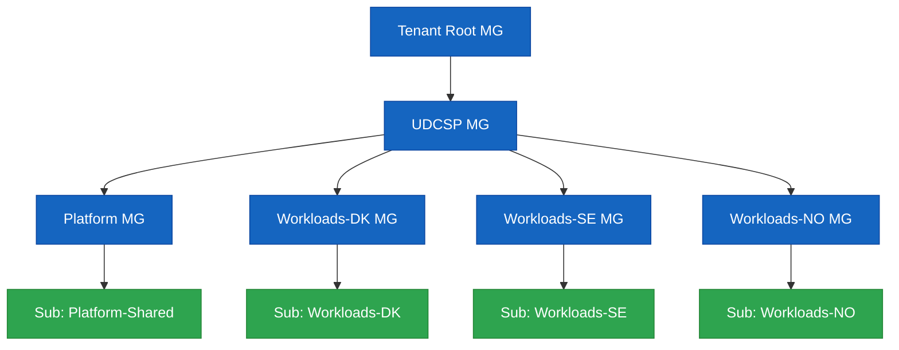

# UDCSP — Installation Guide

> **Audience:** platform engineers and reviewers performing a clean install of the **Unified Digital Citizen Services Platform** on a sacrificial Microsoft Cloud tenant.
>
> **Goal:** stand up every component referenced by [`architecture.md`](./architecture.md) and validated by [`recipe.md`](./recipe.md) in a single guided session.

---

## 1. Topology installed

The installer provisions **three sovereign country zones** (Denmark, Sweden, Norway) plus a **shared analytics zone**, all under a unified management-group hierarchy.



Each country sub gets its own landing zone, External ID tenant, Fabric capacity, APIM region, Logic Apps workspace, D365 environment, ACS resource and Foundry project. Cross-zone analytics, governance and SOC tooling sit in the shared sub.

---

## 2. Prerequisites

### 2.1 Tooling on the operator workstation

| Tool | Minimum | Notes |
|---|---|---|
| PowerShell | 7.4+ | Required by the installer |
| Azure CLI | 2.60+ | `az bicep upgrade` after install |
| Az PowerShell | 12.x | `Install-Module Az -Scope CurrentUser` |
| Microsoft.Graph PowerShell | 2.x | For Entra ID / Entra External ID automation |
| Power Platform CLI (`pac`) | latest | D365 solution import |
| Bicep | 0.27+ | Bundled by az CLI |
| Node.js | 20 LTS | For frontend & i18n tooling |
| Python | 3.11 | For synthetic-data generators |
| Git | 2.43+ | Working copy of this repo |

A single bootstrap script installs everything except Azure CLI and Power Platform CLI:

```powershell
pwsh ./scripts/dev/Bootstrap-DevEnv.ps1
```

### 2.2 Cloud prerequisites

You need owner-level access to:

1. A **Microsoft Entra tenant** (workforce) — for caseworker / SOC / DPO identities.
2. **Three Azure subscriptions** (or three resource-group quotas in one subscription if running a demo), one per country — `udcsp-dk`, `udcsp-se`, `udcsp-no`.
3. **One shared Azure subscription** for cross-zone analytics & governance.
4. **Capacity** to deploy: APIM Premium (multi-region), Microsoft Fabric F-SKU per country, ACS, AI Foundry hub & projects, AI Speech, Document Intelligence, Sentinel, Defender for Cloud, Key Vault Premium, ADLS Gen2.
5. **Three D365 Customer Service environments** (one per country) — sandbox SKU is fine for the case study.
6. **Three Microsoft Entra External ID tenants** — `udcspdk.onmicrosoft.com`, `udcspse.onmicrosoft.com`, `udcspno.onmicrosoft.com` (or your own naming).
7. A **Microsoft Foundry workspace** with model quota for the agents listed in `foundry/agents/`.

> **EU residency note:** every workload region MUST be in EU geography (`westeurope`, `northeurope`, `swedencentral`). The installer refuses to deploy to non-EU regions.

### 2.3 Secrets & configuration

The installer reads configuration from `scripts/install/config/udcsp.config.psd1`. Copy the template and fill in:

```powershell
Copy-Item scripts/install/config/udcsp.config.template.psd1 scripts/install/config/udcsp.config.psd1
notepad scripts/install/config/udcsp.config.psd1
```

Mandatory keys:

```powershell
@{
  TenantId                = '<entra-tenant-guid>'
  Subscriptions = @{
    SharedPlatform = '<sub-guid>'
    DK             = '<sub-guid>'
    SE             = '<sub-guid>'
    NO             = '<sub-guid>'
  }
  ExternalIdTenants = @{
    DK = 'udcspdk.onmicrosoft.com'
    SE = 'udcspse.onmicrosoft.com'
    NO = 'udcspno.onmicrosoft.com'
  }
  D365EnvironmentUrls = @{
    DK = 'https://udcspdk.crm4.dynamics.com'
    SE = 'https://udcspse.crm4.dynamics.com'
    NO = 'https://udcspno.crm4.dynamics.com'
  }
  FoundryWorkspace = @{
    Subscription = '<sub-guid>'
    ResourceGroup = 'udcsp-shared-foundry'
    Name = 'udcsp-foundry'
    Region = 'swedencentral'
  }
  Environment   = 'prod'   # one of dev|test|preprod|prod
  Regions = @{
    DK = 'northeurope'
    SE = 'swedencentral'
    NO = 'norwayeast'
  }
}
```

Secrets (External ID signing keys, D365 application-user secrets, Foundry deployment keys) are fetched **just-in-time** from a bootstrap Key Vault — the installer's first task is to provision that vault under the shared platform subscription and prompt for any secret it cannot resolve.

---

## 3. Install paths

There are three ways to run the installer:

### 3.1 Full one-shot install

```powershell
pwsh ./scripts/install/Install-UDCSP.ps1 -Environment prod
```

Runs every phase sequentially, idempotent, with a coloured progress log and a JSON report under `scripts/install/reports/<timestamp>/`.

### 3.2 Phase-only install

```powershell
pwsh ./scripts/install/Install-UDCSP.ps1 -Phase Foundry,D365,Apps
```

Useful when re-deploying a subset after a code change. Each phase is independently testable (see §5).

### 3.3 What-if (dry-run)

```powershell
pwsh ./scripts/install/Install-UDCSP.ps1 -WhatIf
```

Shows every Bicep what-if and APIM/Logic Apps/D365 deployment plan without applying anything. Required before any prod install.

---

## 4. Phases & ordering

The installer respects the wave dependencies declared in `plan.md`:

```mermaid
graph LR
  W0[W0 LandingZone]:::p --> W1
  subgraph W1[W1 Platform Horizontals]
    direction TB
    Identity:::p
    Security:::p
    Observability:::p
    Fabric:::p
    SyntheticData:::p
  end
  W1 --> W2
  subgraph W2[W2 Service Backbone]
    direction TB
    Foundry:::p
    Apim:::p
    LogicApps:::p
    D365:::p
  end
  W2 --> W3
  subgraph W3[W3 Channels & Conversational]
    direction TB
    Apps:::p
    Voice:::p
    CopilotStudio:::p
  end
  W3 --> W4
  subgraph W4[W4 Governance & Acceptance]
    direction TB
    Purview:::p
    AIAct:::p
    QA:::p
  end
  classDef p fill:#1565c0,stroke:#0d47a1,color:#fff
```



Phase names accepted by `-Phase`:

| Phase | Module | Owner WP | What it installs |
|---|---|---|---|
| `LandingZone` | `Install-LandingZone.psm1` | A1 | MG hierarchy, RGs, networking, Key Vault, ACR, Storage |
| `Identity` | `Install-Identity.psm1` | A2 | External ID tenants, custom user flows, Microsoft Entra ID, CA, PIM |
| `Security` | `Install-Security.psm1` | A3 | Defender for Cloud, Sentinel, Azure Policy, DPIA artefacts |
| `Observability` | `Install-Observability.psm1` | A5 | Log Analytics, App Insights, workbooks, alerts |
| `Fabric` | `Install-Fabric.psm1` | A4 | Capacities, workspaces, lakehouses, notebooks, semantic models |
| `Purview` | `Install-Purview.psm1` | A13 | Account, sources, classifications, labels, DLP, sharing policies |
| `Foundry` | `Install-Foundry.psm1` | A6 | Hub & projects, agents, prompts, eval suites, Content Safety, AI Act registry |
| `Apim` | `Install-Apim.psm1` | A7 | APIM instance(s), products, APIs, policies, named values |
| `LogicApps` | `Install-LogicApps.psm1` | A7 | Standard workspaces, workflows, connections, Service Bus, Event Grid |
| `D365` | `Install-D365.psm1` | A8 | Solutions, BPFs, queues, SLAs, Copilot for Service, Power Automate |
| `Apps` | `Install-Apps.psm1` | A9, A12 | Static Web Apps deployment, mobile builds, i18n catalogues |
| `Voice` | `Install-Voice.psm1` | A10 | ACS, AI Speech, IVR dialogs, transcript pipeline, SMS/email templates |
| `CopilotStudio` | `Install-CopilotStudio.psm1` | A11 | Copilot Studio bot, topics, knowledge sources, channels |
| `SyntheticData` | `Install-SyntheticData.psm1` | A15 | Generates and seeds personas, applications, conversations, eval datasets |
| `QA` | `Install-QA.psm1` | A14 | Wires CI eval/E2E/security/conformance pipelines to GitHub Actions |

The master script declares a DAG matching `plan.md` §4 and refuses to run a phase whose prerequisites are missing.

---

## 5. Independent component testing

Every module exposes a `Test-<Phase>` function that validates ONLY that component. Each is invokable without the rest of the platform being installed:

```powershell
Import-Module ./scripts/install/modules/Install-Foundry.psm1
Test-Foundry -Config (Import-PowerShellDataFile ./scripts/install/config/udcsp.config.psd1)
```

The same tests are runnable through:

```powershell
pwsh ./scripts/install/Install-UDCSP.ps1 -TestOnly -Phase Foundry
```

Each component folder also ships its own `scripts/Test-*.ps1` (see `infra/identity/scripts/Test-IdentityFederation.ps1`, `services/apim/scripts/Test-Apim.ps1`, etc.) so component owners can validate independently of the master orchestrator.

---

## 6. Post-install validation

After a successful install, run the recipe to walk through the 10 acceptance scenarios:

```powershell
pwsh ./scripts/install/Install-UDCSP.ps1 -Phase QA -SmokeOnly
# or, for the full guided walkthrough:
code ./recipe.md
```

The QA phase smoke kicks off:

1. `tests/e2e/scenario-09-devops-installer.spec.ts` — installer reproducibility check.
2. `tests/eval/pipelines/nightly-classifier.yaml` — reduced sample.
3. `tests/accessibility/automated/axe-runner.spec.ts` — homepage axe scan.
4. `tests/load/k6/citizen-application-submit.k6.js` — short ramp.

A **green** smoke gate produces `scripts/install/reports/<timestamp>/install-report.html` and closes with the platform's URLs printed to console.

---

## 7. Tear-down

```powershell
pwsh ./scripts/cleanup/Remove-UDCSP.ps1 -Environment dev -Confirm
```

Removes every resource group tagged `costCenter=UDCSP` across all configured subscriptions, deletes External ID tenants flagged disposable, and unregisters Purview sources. Refuses to run against `prod` unless `-Force` is supplied.

---

## 8. Troubleshooting

| Symptom | Likely cause | Fix |
|---|---|---|
| `Install-Identity` fails on External ID user flow upload | TenantId in config doesn't match the External ID tenant | Re-check `ExternalIdTenants` block; the installer will attempt with the right tenant when corrected |
| `Install-Fabric` returns `403 CapacityNotFound` | Fabric F-SKU not provisioned in the country region | Provision the capacity in Azure Portal → re-run with `-Phase Fabric` |
| `Install-Foundry` fails on model deployment | Quota exhausted in the Foundry region | Request quota in Foundry portal or change region in config |
| `Install-Apim` slow on first run | Premium APIM cold start ≈ 45 minutes | This is expected. The installer streams progress every 60 s. |
| Cross-border test fails (DK→SE) | Identity bridge claim mapping wrong | Re-deploy `infra/identity/external-id/custom-policies/eidas-bridge-claims.xml` and re-run scenario 01 |
| `Test-Observability` reports broken trace | Correlation header dropped at APIM | Verify `services/apim/policies/correlation-id.xml` is attached to all APIs |

Reports for every run are written under `scripts/install/reports/<timestamp>/install-report.json` and include the exact phase, status, duration, error stack and remediation hint.

---

## 9. Reference architecture

For any clarification on what a phase deploys and why, consult the corresponding section of [`architecture.md`](./architecture.md):

- §3 Logical zones → Identity, LandingZone phases
- §5 AI architecture → Foundry phase
- §6 Integration & workflow → Apim, LogicApps phases
- §7 Case management → D365 phase
- §8 Data & analytics → Fabric phase
- §9 Governance → Purview, AIAct phases
- §11 Observability → Observability phase
- §12 Multilingual & inclusivity → Apps, Voice, CopilotStudio phases

The installer is the executable expression of [`plan.md`](./plan.md). When a work-package owner changes their deliverables, they MUST update both the work package row in `plan.md` and the corresponding module in `scripts/install/modules/`.

— A16 · Installer & Developer Experience
