# UDCSP — Deep-Dive Architecture

> Companion document to the [README](../../README.md). This document describes **what is built and how it fits together** — every layer, every sovereignty zone, every AI agent, every governance control. No source code is presented here; this is the platform definition that the development plan ([`plan.md`](./plan.md)) will execute.

> [!TIP]
> **Companion documents.** This file describes *the entire platform* at the architecture level. Two deeper dives extend it:
> - [`ai.md`](../biz/ai.md) — every AI decision, every agent, every safety control, every channel pattern.
> - [`data.md`](./data.md) — every storage zone, every retention period, every compliance article.

---

## Table of Contents

1. [Architecture Principles](#1-architecture-principles)
2. [Logical Architecture](#2-logical-architecture)
3. [Sovereignty & Federation Topology](#3-sovereignty--federation-topology)
4. [Identity Federation Detail](#4-identity-federation-detail)
5. [AI Architecture — Microsoft Foundry at the Core](#5-ai-architecture--microsoft-foundry-at-the-core)
6. [Integration & Workflow Architecture](#6-integration--workflow-architecture)
7. [Case Management Architecture (Dynamics 365)](#7-case-management-architecture-dynamics-365)
8. [Data & Analytics Architecture (Microsoft Fabric)](#8-data--analytics-architecture-microsoft-fabric) — *see also [`data.md`](./data.md)*
9. [Governance, Compliance & EU AI Act](#9-governance-compliance--eu-ai-act)
10. [Security & Network Architecture](#10-security--network-architecture)
11. [Observability & Operations](#11-observability--operations)
12. [Multilingual & Inclusivity Strategy](#12-multilingual--inclusivity-strategy)
13. [End-to-End Flow Examples](#13-end-to-end-flow-examples)
14. [Service Inventory](#14-service-inventory)
15. [Deployment & Developer Experience](#15-deployment--developer-experience)

---

## 1. Architecture Principles

| # | Principle | Implication |
|---|---|---|
| P1 | **Federated, not centralised** | Each country owns its sovereign data zone; cross-border services are mediated, never co-mingled. |
| P2 | **AI-first, but supervised** | Every AI decision is registered, traced, evaluated and overridable by a caseworker. |
| P3 | **Compliance by design** | GDPR + EU AI Act + WCAG 2.1 AA are platform-level invariants, not project-level afterthoughts. |
| P4 | **Single front door, many back doors** | One citizen experience; many integration points to existing agency systems. |
| P5 | **Event-driven over batch** | Logic Apps + Service Bus + Event Grid, with Fabric Real-Time Intelligence for analytics. |
| P6 | **Open standards** | OpenID Connect, OAuth 2.0, eIDAS, FHIR (where applicable), OpenAPI 3, JSON-LD, SCIM. |
| P7 | **Infrastructure as code** | Bicep modules + GitHub Actions; no click-ops in any environment above DEV. |
| P8 | **Zero trust** | Private endpoints, managed identities, no shared secrets in code, Defender for everything. |
| P9 | **Multilingual from the first commit** | 12 languages are a model and content invariant, not a translation pass at the end. |
| P10 | **Auditable end-to-end** | Every channel, every API call, every prompt, every decision is correlatable through a single trace ID. |

---

## 2. Logical Architecture

### 2.1 High-level view (whole-platform)

This is the same diagram surfaced in [`README.md`](../../README.md), kept here as the canonical entry point for architects who want to drill down into the layered view below.

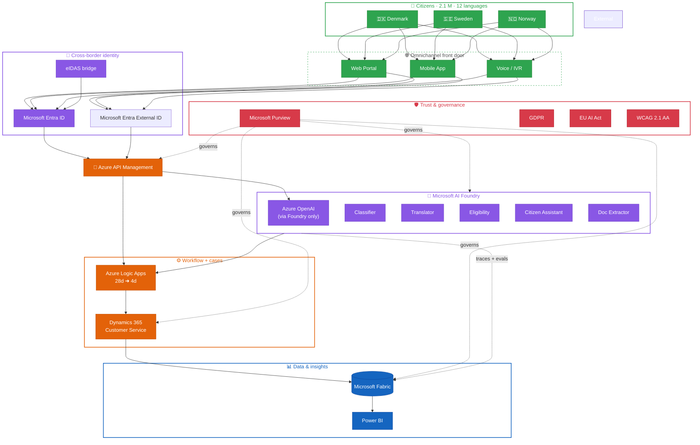

Blue = data, green = citizens / channels, orange = backend & process, purple = AI / identity, red = governance.

### 2.2 Layered detail

The full 8-layer breakdown used by build teams: it splits the platform into Citizens & Channels, Edge & Identity, API & Integration, AI Brain, Business Services, Data & Insights, Governance & Trust, and Security & Platform.

```mermaid
graph TB
    subgraph L0["Layer 0 — Citizens & Channels"]
        C["Citizens (DK · SE · NO) — 12 languages"]
        WEB["Web Portal — Azure Static Web Apps"]
        MOB["Mobile App — native shell + Static Web Apps backend"]
        VOICE["Voice / IVR — Azure Communication Services + AI Speech"]
        WAGENT["Web Chat Widget — Copilot Studio embed"]
    end

    subgraph L1["Layer 1 — Edge & Identity"]
        FD["Azure Front Door + WAF"]
        EXTID["Microsoft Entra External ID (per country)"]
        ENTRA["Microsoft Entra ID + eIDAS bridge"]
    end

    subgraph L2["Layer 2 — API & Integration"]
        APIM["Azure API Management (multi-region)"]
        SB["Azure Service Bus"]
        EG["Azure Event Grid"]
        LA["Azure Logic Apps (Standard, single-tenant)"]
    end

    subgraph L3["Layer 3 — AI Brain (Microsoft Foundry)"]
        FOUNDRY["Foundry Project + Hub"]
        AOAI["Azure OpenAI deployments"]
        AGENTS["Foundry Agents:<br/>Classifier · Translator · Eligibility · Assistant"]
        EVAL["Foundry Evaluations + Tracing + Content Safety"]
        CS["Microsoft Copilot Studio"]
        AISPEECH["Azure AI Speech"]
        AITRANS["Azure AI Translator"]
        AIDOC["Azure AI Document Intelligence"]
    end

    subgraph L4["Layer 4 — Business Services"]
        D365["Dynamics 365 Customer Service<br/>+ Copilot for Service"]
        FUNC["Domain microservices — Azure Container Apps + Functions"]
        COSMOS["Azure Cosmos DB — case state, draft applications"]
        SQL["Azure SQL Database — reference data, rules"]
        STORAGE["Azure Storage / ADLS Gen2 — documents"]
    end

    subgraph L5["Layer 5 — Data & Insights"]
        FABRIC["Microsoft Fabric:<br/>OneLake · Lakehouse · Warehouse · Real-Time Intelligence"]
        POWERBI["Power BI semantic models + reports"]
    end

    subgraph L6["Layer 6 — Governance & Trust"]
        PURVIEW["Microsoft Purview — catalog · classification · lineage · DLP · AI Act registry"]
        DPIA["DPIA & ROPA repository"]
    end

    subgraph L7["Layer 7 — Security & Platform"]
        KV["Azure Key Vault"]
        DEF["Microsoft Defender for Cloud"]
        SENT["Microsoft Sentinel"]
        MON["Azure Monitor + Log Analytics + Application Insights"]
        POL["Azure Policy + Blueprints"]
        ACR["Azure Container Registry"]
    end

    C --> WEB
    C --> MOB
    C --> VOICE
    C --> WAGENT
    WEB --> FD
    MOB --> FD
    VOICE --> FD
    WAGENT --> FD
    FD --> EXTID
    EXTID --> ENTRA
    ENTRA --> APIM
    APIM --> AGENTS
    APIM --> LA
    APIM --> D365
    APIM --> FUNC
    AGENTS --> AOAI
    AGENTS --> AITRANS
    AGENTS --> AIDOC
    CS --> AGENTS
    AISPEECH --> CS
    LA --> SB
    LA --> EG
    LA --> D365
    LA --> FUNC
    FUNC --> COSMOS
    FUNC --> SQL
    FUNC --> STORAGE
    D365 --> COSMOS
    D365 --> STORAGE
    FUNC -.events.-> EG
    EG --> FABRIC
    AGENTS -.tracing.-> MON
    MON --> FABRIC
    FABRIC --> POWERBI
    PURVIEW -. scans .-> COSMOS
    PURVIEW -. scans .-> SQL
    PURVIEW -. scans .-> STORAGE
    PURVIEW -. scans .-> FABRIC
    PURVIEW -. registers .-> AGENTS
    KV -.secrets.-> APIM
    KV -.secrets.-> FUNC
    KV -.secrets.-> LA
    DEF -. posture .-> APIM
    DEF -. posture .-> FUNC
    SENT -. SIEM .-> MON
    POL -. guardrails .-> APIM

    classDef l0 fill:#E3F2FD,stroke:#1565C0,color:#0D47A1
    classDef l1 fill:#EDE7F6,stroke:#5E35B1,color:#311B92
    classDef l2 fill:#E0F2F1,stroke:#00796B,color:#004D40
    classDef l3 fill:#FFF3E0,stroke:#E65100,color:#BF360C
    classDef l4 fill:#FCE4EC,stroke:#AD1457,color:#880E4F
    classDef l5 fill:#E8F5E9,stroke:#2E7D32,color:#1B5E20
    classDef l6 fill:#FFEBEE,stroke:#C62828,color:#B71C1C
    classDef l7 fill:#ECEFF1,stroke:#455A64,color:#263238

    class C,WEB,MOB,VOICE,WAGENT l0
    class FD,EXTID,ENTRA l1
    class APIM,SB,EG,LA l2
    class FOUNDRY,AOAI,AGENTS,EVAL,CS,AISPEECH,AITRANS,AIDOC l3
    class D365,FUNC,COSMOS,SQL,STORAGE l4
    class FABRIC,POWERBI l5
    class PURVIEW,DPIA l6
    class KV,DEF,SENT,MON,POL,ACR l7
```

---

## 3. Sovereignty & Federation Topology

Each country runs its own **sovereign zone** in the closest Azure region; cross-border services flow through a thin **federation hub** that never persists national data outside its zone.

```mermaid
graph TB
    subgraph DK["🇩🇰 Sovereign Zone — Denmark (Azure North Europe)"]
        DK_EXTID["External ID tenant DK"]
        DK_FAB["Fabric workspace DK"]
        DK_D365["D365 environment DK"]
        DK_LA["Logic Apps DK"]
        DK_DATA["Citizen data DK"]
    end

    subgraph SE["🇸🇪 Sovereign Zone — Sweden (Azure Sweden Central)"]
        SE_EXTID["External ID tenant SE"]
        SE_FAB["Fabric workspace SE"]
        SE_D365["D365 environment SE"]
        SE_LA["Logic Apps SE"]
        SE_DATA["Citizen data SE"]
    end

    subgraph NO["🇳🇴 Sovereign Zone — Norway (Azure Norway East)"]
        NO_EXTID["External ID tenant NO"]
        NO_FAB["Fabric workspace NO"]
        NO_D365["D365 environment NO"]
        NO_LA["Logic Apps NO"]
        NO_DATA["Citizen data NO"]
    end

    subgraph HUB["🌐 Federation Hub (multi-region active-active)"]
        ENTRA["Microsoft Entra ID<br/>eIDAS bridge"]
        APIM["API Management — global"]
        FOUNDRY["Microsoft Foundry — multi-region"]
        PURVIEW["Microsoft Purview — federated catalog"]
        FAB_DOMAIN["Fabric Domain federating the 3 workspaces"]
    end

    DK_EXTID -->|OIDC federation| ENTRA
    SE_EXTID -->|OIDC federation| ENTRA
    NO_EXTID -->|OIDC federation| ENTRA

    ENTRA --> APIM
    APIM --> DK_LA
    APIM --> SE_LA
    APIM --> NO_LA
    APIM --> FOUNDRY

    DK_FAB -.shortcut.-> FAB_DOMAIN
    SE_FAB -.shortcut.-> FAB_DOMAIN
    NO_FAB -.shortcut.-> FAB_DOMAIN

    PURVIEW -. scans .-> DK_DATA
    PURVIEW -. scans .-> SE_DATA
    PURVIEW -. scans .-> NO_DATA

    classDef dk fill:#FFEBEE,stroke:#C62828,color:#B71C1C
    classDef se fill:#FFF9C4,stroke:#F9A825,color:#F57F17
    classDef no fill:#E3F2FD,stroke:#1565C0,color:#0D47A1
    classDef hub fill:#FFF3E0,stroke:#E65100,color:#BF360C

    class DK_EXTID,DK_FAB,DK_D365,DK_LA,DK_DATA dk
    class SE_EXTID,SE_FAB,SE_D365,SE_LA,SE_DATA se
    class NO_EXTID,NO_FAB,NO_D365,NO_LA,NO_DATA no
    class ENTRA,APIM,FOUNDRY,PURVIEW,FAB_DOMAIN hub
```

**Key sovereignty rules**

- Citizen PII is stored **only** in the citizen's country zone.
- Cross-border services (e.g. residency transfer DK → SE) are mediated by **claims-based, purpose-bound** tokens issued by the federation hub — no raw PII crosses the border.
- The Fabric domain federates **metrics and lineage**, not raw data, by default; data product sharing is opt-in and requires Purview-enforced data-sharing policies.
- Each country's DPA can audit its own zone independently.

---

## 4. Identity Federation Detail

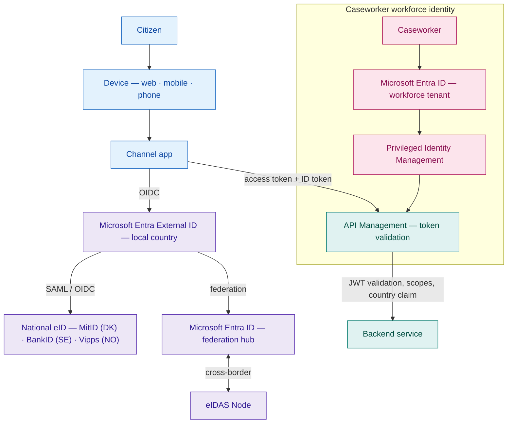

- **Citizens** authenticate locally (national eID) → External ID → Entra hub → API Management.
- **Caseworkers** authenticate against the Entra workforce tenant with **PIM** for sensitive actions (e.g. eligibility override).
- **Cross-border** is achieved by *claim mapping* in the Entra hub: a citizen authenticated in DK can be authorised for an SE service if and only if the SE policy accepts the DK eIDAS assurance level.
- **Per-country IdP wiring** is documented in [`governance/identity/identity-providers.md`](../../governance/identity/identity-providers.md) (MitID for DK, BankID for SE, Vipps for NO).
- **EUDI Wallet readiness** (eIDAS-2, Reg. (EU) 2024/1183) is captured in [`governance/identity/eudi-wallet-readiness.md`](../../governance/identity/eudi-wallet-readiness.md): the platform accepts OpenID4VP `vp_token` once member-state wallets land, with no back-end code change.

---

## 5. AI Architecture — Microsoft Foundry at the Core

> 📘 **For the dedicated AI deep-dive** (why Foundry **and** Copilot Studio, decision tree, agent catalogue, safety, evals, EU AI Act registry, end-to-end conversation flow), see [`ai.md`](../biz/ai.md). This section is the architecture-level summary.

Azure OpenAI is **never accessed directly**. Every model call is mediated by **Microsoft Foundry**, which provides agent orchestration, evaluation, tracing, content safety, and the EU AI Act registry.

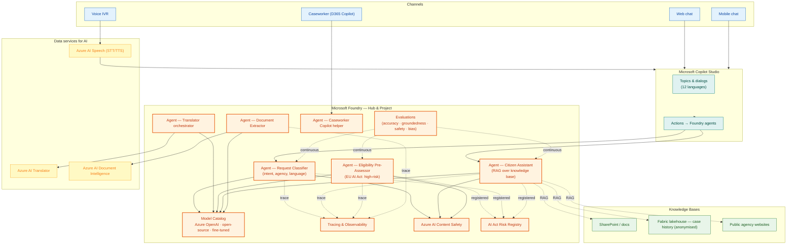

### 5.1 Agent Catalogue

| Agent | Purpose | Model strategy | EU AI Act class | Human-in-the-loop |
|---|---|---|---|---|
| **Request Classifier** | Detect intent, target agency, language, urgency. | Small, low-latency model; periodically fine-tuned on labelled traces. | Limited risk | Caseworker can re-route. |
| **Translator orchestrator** | Translate citizen content and outbound communications across the 12 languages, preserving administrative terminology. | OpenAI + AI Translator hybrid. | Limited risk | Caseworker can edit translation before sending. |
| **Eligibility Pre-Assessor** | Compute likelihood of benefit eligibility from structured + unstructured inputs; output a recommendation, never a decision. | Tool-using LLM with deterministic rule plug-ins; full lineage. | **High risk** | Always reviewed by a caseworker; never auto-approves. |
| **Citizen Assistant** | Answer citizen questions in natural language; perform safe actions on behalf of the citizen. | RAG over public knowledge bases + grounded prompting. | Limited risk | Escalation to human caseworker on demand. |
| **Document Extractor** | Extract structured data from uploaded documents (passport, payslip, lease). | AI Document Intelligence + LLM verification. | Limited risk | Caseworker validates extraction. |
| **Caseworker Copilot Helper** | Summarise cases, draft replies, suggest knowledge articles, propose next-best-action. | OpenAI grounded on the case record + knowledge base. | Limited risk | Caseworker is the operator. |

### 5.2 Foundry Operating Model

- **Hub** per region (3) sharing model deployments where compliant; **Project** per agent or agent family.
- **Evaluations** are versioned, run in CI/CD on every prompt or model change, and gate promotion to PROD.
- **Tracing** is continuous and stored in a dedicated Application Insights workspace exported to Fabric.
- **Content Safety** filters every input and output; high-risk events are sent to Sentinel.
- **AI Act Registry** in Foundry + Purview holds the risk classification, the technical documentation, the post-market monitoring plan, and the conformity declaration for every agent.

---

## 6. Integration & Workflow Architecture

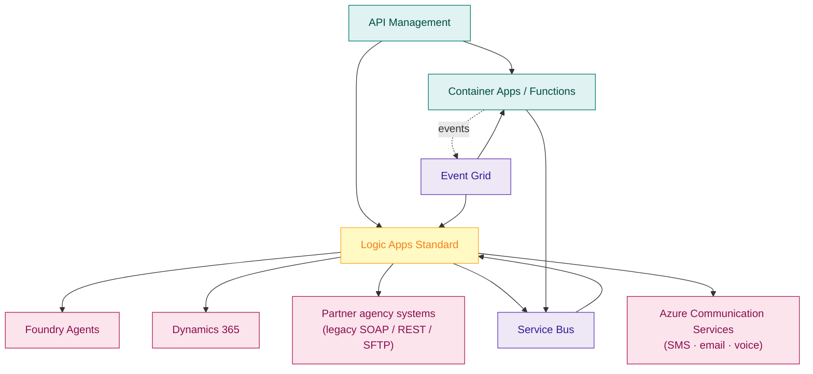

**Patterns**

- **API Management** policies enforce: country routing, OAuth scope checks, rate limiting per channel, request transformation, body redaction for logs.
- **Logic Apps** orchestrates long-running, human-in-the-loop processes (eligibility review, multi-agency coordination).
- **Service Bus** carries reliable commands (e.g. *create case*, *issue payment*).
- **Event Grid** carries domain events (e.g. *application submitted*, *eligibility recomputed*) for analytics & cross-service reactions.
- Each integration to a partner legacy system is wrapped in a **dedicated Logic App + Function** and exposed through API Management with its own facade contract.

**Lifecycle workflows.** Two symmetric *closed-loop* Logic Apps pairs cover the
end-of-data-life journey:

| Concern | Workflow | Trigger | Notes |
|---|---|---|---|
| GDPR right-to-erasure (Art. 17) | [`services/logic-apps/workflows/gdpr-data-erase/`](../../services/logic-apps/workflows/gdpr-data-erase/workflow.json) | HTTP from citizen self-service | Tags records under archive-law hold as `pending-archive-release` instead of physically deleting them. |
| National-archive handover (DK Arkivloven · SE Arkivlagen · NO Arkivlova) | [`services/logic-apps/workflows/archive-handover-{dk,se,no}/`](../../services/logic-apps/workflows/) | Daily 02:00 CET / WET | Picks up records flagged by the erase workflow when their statutory hold expires; packages METS + PDF/A-3 (`Bevaring og Aflevering` for DK, `FGS-PSI` for SE, `Noark 5 SIP` for NO) and pushes via SFTP to the national archive. |

**Inbound document virus-scan.** Defender for Storage emits an Event Grid
event for every uploaded blob; the
[`services/functions/func-document-virus-scan/`](../../services/functions/func-document-virus-scan/index.js)
Function tags the blob `VirusScanStatus=Clean` or moves a malicious blob to
the `quarantine/` container and raises a Sentinel incident. NIS2 Art. 21(2)(d).

---

## 7. Case Management Architecture (Dynamics 365)

| Capability | D365 component |
|---|---|
| Case lifecycle | Customer Service Hub, BPF for residency / tax / social-benefit application types. |
| Queues & SLAs | Per-country, per-agency queues with SLAs aligned to the 4-day target. |
| Knowledge base | Multilingual KB shared across channels and consumed by the Citizen Assistant via RAG. |
| Caseworker AI | Copilot for Service for case summarisation, draft replies, and similar-case suggestions. |
| Omnichannel | Inbound from web chat, voice, email, SMS via Azure Communication Services connector. |
| Custom logic | Plugins / PCF controls only when out-of-the-box configuration is insufficient; otherwise Power Automate flows. |
| Data residency | One D365 environment per country, in the country's geo. |
| Integration | Dataverse → Fabric mirroring (no copy, low latency). |

---

## 8. Data & Analytics Architecture (Microsoft Fabric)

**Cross-reference.** Section 8 covers the **analytics destination** (Microsoft Fabric / OneLake) of every dataset the platform produces. The **operational and conversational sources** that feed Fabric — including the new "Conversations" zone introduced for AI Act Art. 26(6) compliance (≥ 6 months log retention) — are documented in [`data.md`](./data.md). This section deliberately stays focused on the analytics layer; for the per-zone storage decisions, retention matrix, and right-to-erasure playbook, read `data.md` first.

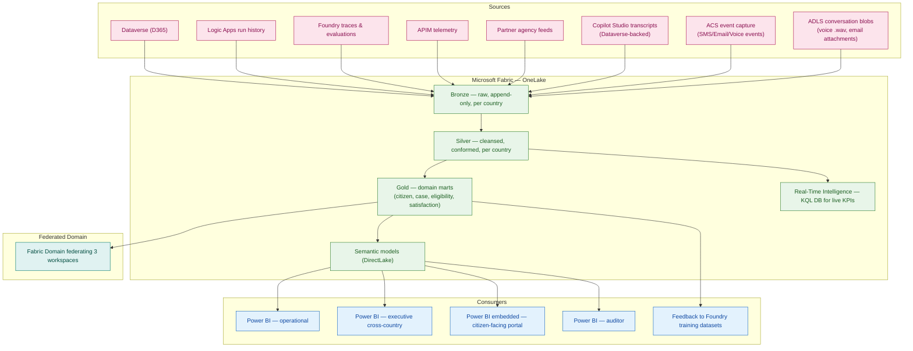

**Highlights**

- Each country owns its **Fabric workspace**; the **Fabric Domain** federates curated gold-layer products without copying raw data.
- **OneLake shortcuts** allow zero-copy access where a country has explicitly published a data product.
- **Real-Time Intelligence** powers live SLA dashboards (e.g. queues, average processing time).
- **Power BI semantic models** are the only analytics surface — no direct queries on bronze/silver from the front-end.
- A **feedback loop** anonymises closed cases and pushes them back to Foundry as training/evaluation datasets.
- New conversation sources (Copilot Studio Dataverse-backed transcripts, ACS event capture for SMS/Email/Voice, ADLS conversation blobs) feed Bronze nightly — this is what makes the platform AI Act Art. 26(6) compliant (≥ 6 months log retention).

---

## 9. Governance, Compliance & EU AI Act

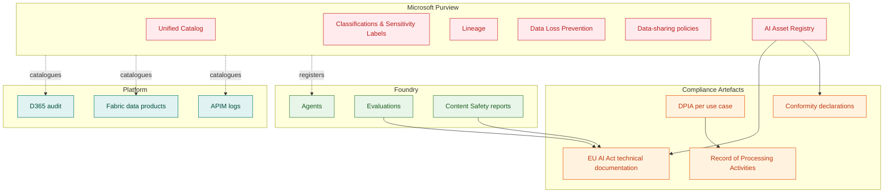

**Key controls**

| Regulation / standard | Control(s) |
|---|---|
| **GDPR** | Lawful basis registered per use case; ROPA in Purview *and* in [`governance/gdpr/ropa.md`](../../governance/gdpr/ropa.md); data minimisation enforced via API Management redaction policies; subject-rights workflow in Logic Apps; DPIA per high-risk processing. |
| **GDPR Art. 28 (sub-processors)** | Public sub-processor register at [`governance/gdpr/sub-processors.md`](../../governance/gdpr/sub-processors.md) with 30-day citizen pre-notice and an append-only change log. EU Data Boundary for Microsoft Cloud is the master transfer mechanism. |
| **GDPR Art. 33-34 + NIS2 Art. 23 (breach)** | Operational playbook with the 24h / 72h / 30d clocks at [`governance/security/breach-notification.md`](../../governance/security/breach-notification.md). |
| **EU AI Act** | Risk classification per agent, technical documentation, post-market monitoring plan ([`governance/ai-act/procedures/post-market-monitoring.md`](../../governance/ai-act/procedures/post-market-monitoring.md)), serious-incident procedure with 15/10/2-day deadlines ([`governance/ai-act/procedures/serious-incident-reporting.md`](../../governance/ai-act/procedures/serious-incident-reporting.md)), human oversight, logging of inputs/outputs (Foundry tracing), conformity assessment for high-risk (Eligibility Pre-Assessor). |
| **Sector EU directives** (e.g. eIDAS 2.0, EUDI Wallet, SDG / Single Digital Gateway, Once-Only Technical System) | eIDAS bridge in Entra ([`governance/identity/identity-providers.md`](../../governance/identity/identity-providers.md)); EUDI-Wallet readiness ([`governance/identity/eudi-wallet-readiness.md`](../../governance/identity/eudi-wallet-readiness.md)); SDG-compliant API contracts in APIM; OOTS connectors for evidence exchange. |
| **National DPA differences** | Per-country Purview policy packs; per-country Logic Apps orchestrations; per-country sensitivity label sets. |
| **WCAG 2.1 AA** | Design system with audited components; axe-core in CI/CD; manual annual audit; accessibility statements per portal. |
| **ePrivacy Directive (2002/58/EC, art. 5(1))** | Cookie banner with a per-purpose consent log; non-essential cookies (Microsoft Clarity, product analytics) are gated behind explicit opt-in. |
| **ISO 27001 / SOC 2** *(operational baseline)* | Defender for Cloud, Sentinel, Key Vault, managed identities, Azure Policy initiatives at [`infra/security/azure-policy/baseline-initiative.json`](../../infra/security/azure-policy/baseline-initiative.json) (MCSB + NIST 800-53 + ISO 27001:2013 built-in initiatives). |

**Storage retention and right-to-erasure operational playbook**: documented in [`data.md`](./data.md) §§ 5, 6, and 9.

---

## 10. Security & Network Architecture

- **Network** — Hub-and-spoke per sovereign zone, peered via the federation hub VNet. **Private Endpoints** on every PaaS service. No public ingress except via **Azure Front Door + WAF** and APIM's external gateway.
- **Identity** — Managed identities everywhere; no service principals with secrets in code; PIM for elevated access; Conditional Access on the workforce tenant.
- **Secrets** — **Azure Key Vault** with RBAC and Private Endpoint; secrets accessed via managed identity references; no plain-text secrets in app settings.
- **Threat protection** — **Microsoft Defender for Cloud** (CSPM + workload protection), **Microsoft Sentinel** as SIEM/SOAR, with playbooks for AI-specific incidents (e.g. prompt injection, model exfiltration). Defender for Storage scans every inbound document and emits an Event Grid event consumed by `func-document-virus-scan` (Clean → tag · Malicious → tag + quarantine + Sentinel incident · Unknown → manual-review queue).
- **Audit retention** — Sentinel + Log Analytics retain audit and security telemetry for **180 days hot** then 7 years in cold archive (NIS2 Art. 21(2)(g) + Art. 23 evidence baseline).
- **Citizen-side privacy controls** — ePrivacy-compliant **cookie consent banner** with per-purpose toggles; Microsoft Clarity and any product analytics are gated behind explicit opt-in. Mobile push notifications (`apps/mobile/src/notifications/registerPushToken.ts`) require an in-app consent flag *before* the OS-level prompt is requested.
- **Container supply chain** — Images signed and scanned; **ACR** with content trust; SBOM generated and stored.
- **Data protection** — At-rest encryption with customer-managed keys (per country); TLS 1.3 in transit; field-level encryption for the most sensitive PII (e.g. national ID).
- **API security** — OAuth 2.0 + PKCE on all citizen flows; mutual TLS for partner integrations; APIM rate-limiting and IP filtering; OWASP Top 10 + LLM Top 10 controls.
- **Sovereignty enforcement (policy-as-code)** — Five Azure Policy initiatives in [`infra/landing-zone/azure-policy/`](../../infra/landing-zone/azure-policy/) and [`infra/security/azure-policy/`](../../infra/security/azure-policy/) deny non-EU regions, public IPs on data resources, missing tags, missing encryption-at-rest, and missing CMK; covered end-to-end by the conformance test pack at [`tests/conformance/sovereignty/`](../../tests/conformance/sovereignty/).

---

## 11. Observability & Operations

| Concern | Tool |
|---|---|
| Metrics & logs | **Azure Monitor + Log Analytics** (per zone) federated into a shared workspace, **180-day** hot retention. |
| Distributed tracing | **Application Insights** with a unified `correlation-id` propagated from APIM through Logic Apps, Functions, D365 plugins, and Foundry traces. |
| Dashboards | **Power BI** for business KPIs; Azure Workbooks for SRE; Foundry built-in dashboards for AI quality. |
| Alerting | Azure Monitor alerts → Action Groups → on-call rotation in PagerDuty / Teams. |
| AI quality | Foundry **Evaluations** (continuous) + drift monitors; alerts on safety / accuracy regressions. |
| Document virus-scan telemetry | Defender-for-Storage scan results emit Event Grid events consumed by `func-document-virus-scan`; outcomes (`Clean` / `Malicious` / `Unknown`) carry the `traceparent` and the country tag and surface in the same App Insights dashboard. |
| SLOs | Citizen-facing channels: 99.9 %; AI agent latency p95 < 2 s; case-creation latency p95 < 5 s. |

---

## 12. Multilingual & Inclusivity Strategy

UDCSP treats **language and accessibility as first-class platform invariants**. Every layer is designed to behave correctly in the **12 supported languages** and to be usable by citizens with disabilities.

### 12.1 Language Coverage Matrix

| Layer | Component | How multilingualism is implemented |
|---|---|---|
| Channels — Web | Static Web Apps + design system | **ICU MessageFormat** for plurals/genders; per-locale resource bundles; language switcher; locale-aware date/number formatting; right-to-left support where applicable. |
| Channels — Mobile | Mobile shell | Same i18n pipeline; OS-level locale propagation. |
| Channels — Voice | ACS + Azure AI Speech | STT/TTS configured per language; per-locale lexicons for civic terminology; barge-in supported in all languages. |
| Conversational AI | Microsoft Copilot Studio | Topics authored once and reviewed per locale; language detection on entry; multilingual entities; per-locale fallback rules. |
| AI Brain — Classifier | Foundry agent | Multilingual model; eval set covers all 12 languages with golden examples per agency type. |
| AI Brain — Translator | Foundry agent | Hybrid Azure OpenAI + Azure AI Translator; **glossary** per agency to preserve administrative terminology; quality gate before outbound communication. |
| AI Brain — Citizen Assistant | Foundry agent | RAG knowledge base indexed per language; cross-lingual retrieval as fallback; safety filters per locale. |
| AI Brain — Eligibility | Foundry agent | Decision lineage and reasoning translated for caseworker + citizen views; never auto-translates legal text without human review. |
| AI Brain — Document Extractor | AI Document Intelligence + LLM | Multilingual OCR; field labels normalised to a canonical schema; per-country document templates supported. |
| Case Management | D365 Customer Service | Multilingual KB; per-language SLA queues; caseworker UI in their working language; outbound mail templates per locale, edited before send. |
| Notifications | Azure Communication Services | Templates per locale (email, SMS, voice); fallback to citizen-preferred language. |
| Data & Insights | Microsoft Fabric + Power BI | Locale dimension on every fact table; semantic models slice CSAT, accuracy, SLA, and content-safety metrics **by language** to detect inequity. |
| Governance | Purview | Sensitivity labels and policies localised; DPIAs available per language; AI Act registry includes per-language evaluation evidence. |

### 12.2 The 12 Languages

Coverage targets the **official**, **most-common minority** and **cross-border working** languages of Denmark, Sweden, and Norway as required by the **EU Single Digital Gateway**:

1. Danish, 2. Swedish, 3. Norwegian Bokmål, 4. Norwegian Nynorsk, 5. Sámi (Northern), 6. English, 7. German, 8. French, 9. Polish, 10. Arabic, 11. Ukrainian, 12. Finnish.

> The exact list will be ratified per country DPA / language council in Wave 0; the platform is designed to add or substitute languages without code changes.

### 12.3 Accessibility Strategy (WCAG 2.1 AA)

| Practice | How |
|---|---|
| **Design system first** | Audited, accessible components shared across all citizen portals; no ad-hoc UI. |
| **Automated CI gate** | `axe-core` and Lighthouse accessibility audits run on every PR; build fails below the agreed threshold. |
| **Manual audit** | Annual third-party WCAG 2.1 AA audit per portal; findings tracked as platform debt. |
| **Voice channel parity** | Citizens who cannot use a screen can complete every primary journey via the voice channel (ACS + Speech). |
| **Caseworker assistance** | Caseworkers can complete forms on behalf of citizens and capture verifiable consent. |
| **Plain language** | Foundry **Citizen Assistant** is prompted to reply in plain, jargon-free language at a defined reading level per locale. |
| **Accessibility statements** | Each portal publishes a per-locale accessibility statement and a feedback channel routed to D365. |

### 12.4 Multilingual Test & Evaluation Loop

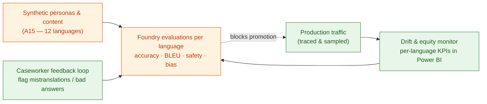

---

## 13. End-to-End Flow Examples

### 13.1 Cross-border residency transfer (DK citizen moving to SE)

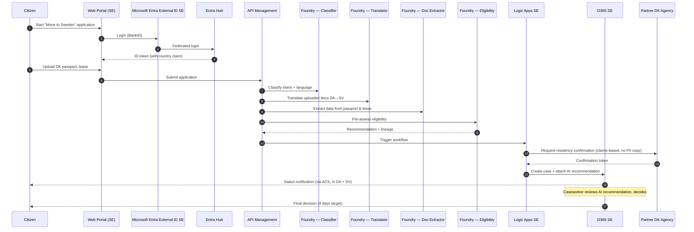

### 13.2 Citizen Assistant (voice) answering a tax question

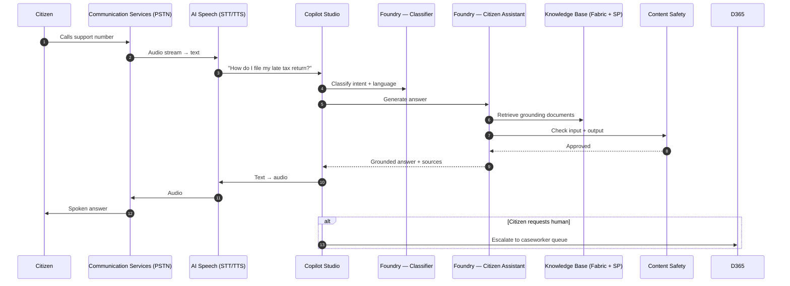

### 13.3 GDPR right-to-erasure with statutory archive hold

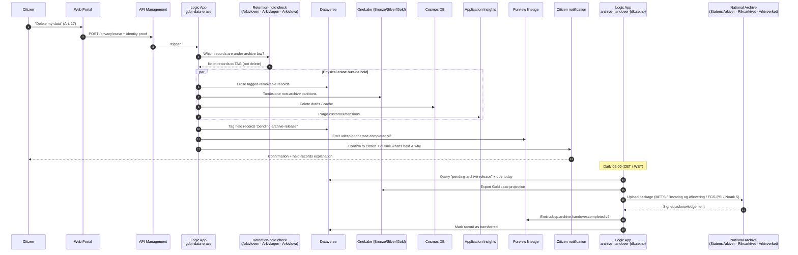

This flow shows that the platform **never silently keeps** data the citizen
asked to delete — it deletes everything outside the statutory hold, and
makes the held records' eventual destination (the national archive) visible
to the citizen.

---

## 14. Service Inventory

### 14.0 Identity deviation from the case study's B2C mandate

The case study lists **Azure AD B2C** as one of nine mandatory Azure services. **As of 1 May 2025, Azure AD B2C is no longer available to new customers** ([Microsoft Learn — Tutorial: Create an Azure AD B2C tenant](https://learn.microsoft.com/en-us/azure/active-directory-b2c/tutorial-create-tenant)). Microsoft's [announced successor](https://learn.microsoft.com/en-us/entra/external-id/customers/concept-supported-features-customers) is **Microsoft Entra External ID** (CIAM external tenants), which is the product line currently offered, supported, and extended.

UDCSP therefore substitutes Microsoft Entra External ID for Azure AD B2C across the entire platform. The substitution is intentional and documented; no other case-study service is changed.

**Capability mapping — every B2C feature relied on by the case study is preserved or improved:**

| Case study capability (B2C term) | UDCSP implementation (Entra External ID term) | Notes |
|---|---|---|
| Per-country B2C tenant            | Per-country **External (CIAM) tenant** (`Microsoft.AzureActiveDirectory/ciamDirectories`) | Same isolation model: one tenant per sovereign zone (DK / SE / NO). |
| `B2C_1A_*` custom policies (XML)  | **User flows** + **Custom Authentication Extensions** (JSON, Microsoft Graph beta) | Lower complexity; same extensibility for token augmentation, federation, and custom claims. See [`infra/identity/external-id/user-flows/`](../../infra/identity/external-id/user-flows/). |
| eIDAS bridge via Identity Experience Framework | eIDAS bridge as an **Azure Function** invoked by an `onTokenIssuanceStart` custom authentication extension | First-class, supported integration pattern. |
| `*.b2clogin.com` authority URL    | `*.ciamlogin.com` authority URL                                                            | Same MSAL.js client; only the host changes. |
| Self-service password reset (B2C user flow) | Native **SSPR** in External ID                                                       | Tenant-level, multi-method (email today, SMS roadmap). |
| Profile editing (B2C user flow)   | **My Account portal** + Microsoft Graph `PATCH /me`                                        | Server-side write filter via `profile-edit.json`. |
| Conditional Access for citizens   | Conditional Access available **natively in External ID** (preview / GA per region)         | Country, risk, MFA, device-state policies. |
| Multilingual UI in 12 languages   | Tenant **branding localizations** in External ID                                            | Same 12-language scope as the rest of the platform. |
| MFA, social logins, federated IdPs | All supported in External ID                                                              | Equivalent or wider IdP catalogue. |
| Auditing of every sign-in / token | `SigninLogs` + `AuditLogs` in Entra External ID                                            | Same Sentinel / Log Analytics ingestion path; analytics rules updated accordingly. |

**Operational consequences of the substitution:**

1. The installer (`scripts/install/Install-UDCSP.ps1` phase `Identity`) provisions `ciamDirectories` per country instead of `b2cDirectories`.
2. The OpenID discovery URL pattern is `https://<tenant>.ciamlogin.com/<tenant>.onmicrosoft.com/<UserFlow>/v2.0/.well-known/openid-configuration` (no `?p=` query parameter).
3. APIM `validate-jwt` policies (`services/apim/policies/jwt-validate-external-id.xml`) point at the External ID issuer.
4. Every Sentinel analytics rule and Application Insights alert that monitors authentication failures has been re-named (`external-id-failed-signin-spike`, `external-id-error-rate`); the underlying KQL targets the same `SigninLogs` table — telemetry continuity is preserved.
5. CSP `connect-src` allow-list on the citizen Static Web Apps now lists `https://*.ciamlogin.com`.
6. Tests against the auth flow (`tests/security/dast/`, `tests/e2e/fixtures/auth.ts`) reference `EXTERNAL_ID_*` environment variables.

**Why this is the correct architectural call rather than a deviation to challenge:** the case study was written before the B2C retirement announcement; following its B2C mandate literally would force any new customer to deploy a product they cannot purchase. The substitution preserves intent (sovereign customer-identity-and-access-management with eIDAS federation across DK/SE/NO) while using a product Microsoft will continue to invest in.

### 14.1 Mandatory (case study)

| Service | Where it lives in the architecture |
|---|---|
| Microsoft Entra External ID | §4 Identity Federation Detail |
| Microsoft Entra ID | §4 Identity Federation Detail |
| Azure OpenAI *(via Microsoft Foundry)* | §5 AI Architecture |
| Microsoft Fabric | §8 Data & Analytics Architecture |
| Dynamics 365 Customer Service | §7 Case Management Architecture |
| Azure API Management | §6 Integration & Workflow Architecture |
| Microsoft Purview | §9 Governance, Compliance & EU AI Act |
| Azure Logic Apps | §6 Integration & Workflow Architecture |
| Power BI | §8 Data & Analytics Architecture |

### 14.2 Additional Azure services included in the platform

| Service | Role |
|---|---|
| **Microsoft Foundry** | AI agent runtime, model catalog, evaluations, tracing, AI Act registry. |
| **Azure Front Door + WAF** | Global edge, TLS termination, DDoS, WAF. |
| **Azure Static Web Apps** | Hosting for citizen web portals. |
| **Azure Container Apps** | Domain microservices. |
| **Azure Functions** | Event-driven glue and lightweight integrations. |
| **Azure Cosmos DB** | Operational, low-latency document store for **draft applications, slot-filling cache and ephemeral session state**, 3 accounts (one per country) pinned to North Europe / Sweden Central / Norway East with `enableMultipleWriteLocations=false`, AAD-only auth, CMK from the country Key Vault, private endpoint, TTL-based auto-purge. Bicep at [`infra/data/cosmos/cosmos-account.bicep`](../../infra/data/cosmos/cosmos-account.bicep). |
| **Azure SQL Database** | Reference data, business rules. |
| **Azure Storage / ADLS Gen2** | Three per-country Storage accounts: citizen-uploads/ (documents), voice-recordings/ (PSTN audio + STT transcripts, WORM 90 days), email-attachments/ (email binaries). All CMK-encrypted. See data.md § 3.2. |
| **Azure Service Bus** | Reliable command messaging. |
| **Azure Event Grid** | Domain eventing. |
| **Azure Communication Services** | Voice, SMS, email channels. |
| **Azure Communication Services Event Capture** | Append-only ACS event log (SMS / Email / Voice events) routed via Event Hubs to ADLS Gen2 acs-events/. See data.md § 3.3. |
| **Azure AI Search** | Per-citizen long-term conversational memory (vector store with ACL row-level by citizen_id, TTL 12 months rolling). See data.md § 3.4. |
| **Azure AI Speech** | Speech-to-text and text-to-speech for the voice channel. |
| **Azure AI Translator** | High-quality translation across the 12 languages. |
| **Azure AI Document Intelligence** | OCR and structured extraction from citizen documents. |
| **Azure AI Content Safety** | Input/output safety filtering for every agent. |
| **Microsoft Copilot Studio** | Conversational orchestration and channel embedding. |
| **Azure Key Vault** | Secrets, keys, certificates with private endpoints. |
| **Microsoft Defender for Cloud** | CSPM and workload protection. |
| **Microsoft Sentinel** | SIEM / SOAR. |
| **Azure Monitor + Log Analytics + Application Insights** | Observability. Also serves as Foundry AI trace store — see data.md § 3.3. |
| **Azure Container Registry** | Container image registry with content trust. |
| **Azure Policy + Blueprints** | Guardrails, compliance enforcement. |
| **Azure DevOps / GitHub Actions** | CI/CD. |
| **Azure Bicep / Terraform** | Infrastructure as Code. |

---

## 15. Deployment & Developer Experience

UDCSP is deployable end-to-end from a clean Azure tenant by a **single PowerShell entry point**: `scripts/install/Install-UDCSP.ps1`. The script — owned by the dedicated installer agent **A16** — is **idempotent**, **environment-aware** (`dev`, `test`, `preprod`, `prod`), **zone-aware** (DK / SE / NO / all), and supports an optional `-SeedSyntheticData` switch that triggers A15's regeneration pipelines so a DEV environment comes up already populated with realistic multilingual personas, applications and conversations.

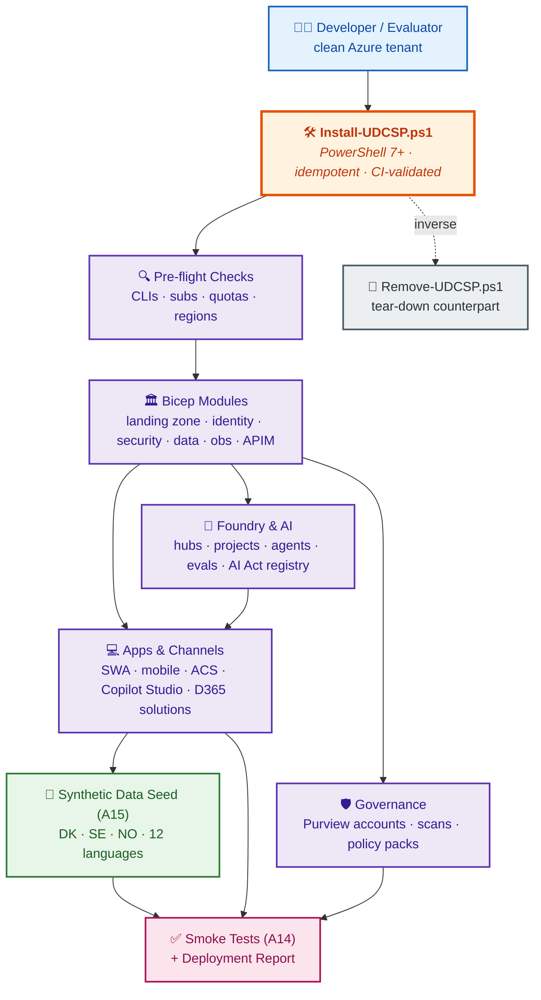

### 15.1 Installer principles

| Principle | What it means in `Install-UDCSP.ps1` |
|---|---|
| **Idempotent** | Re-running the script on an already-installed environment converges to the desired state without creating duplicates. |
| **Layered** | One PowerShell module per architectural layer (`Identity.psm1`, `Security.psm1`, `Data.psm1`, `Foundry.psm1`, `Integration.psm1`, `D365.psm1`, `Frontend.psm1`, `Voice.psm1`, `Governance.psm1`, `Observability.psm1`). |
| **Zone-aware** | Bicep modules deployed once per zone (DK / SE / NO) with parameter files; `-Zone` flag scopes installation to one or all. |
| **Reportable** | Each run produces an HTML + JSON report under `scripts/install/reports/<timestamp>/` with per-step duration, status, and resource IDs. |
| **Tear-down** | `scripts/cleanup/Remove-UDCSP.ps1` reverses everything safely (Key Vault soft-delete purge, Foundry project cleanup, Purview deregistration). |
| **CI-validated** | Wired into a GitHub Actions smoke job triggered by changes to `infra/`, `apps/`, `services/`, `foundry/`. Drift breaks the build. |

### 15.2 Developer onboarding

`scripts/dev/Bootstrap-DevEnv.ps1` provisions a developer laptop in one command: required CLIs (Az, Azure Developer CLI, Bicep, Power Platform CLI, Foundry CLI, GitHub CLI), VS Code extensions, Git hooks, an `.env.template`, and a verification step that runs `Install-UDCSP.ps1 -WhatIf -Environment dev` to confirm the toolchain works.

---

*See [`plan.md`](./plan.md) for how this architecture will be built by the multi-agent development team — including the **A15 Synthetic Data & Personas** and **A16 Installer & Developer Experience** agents.*
