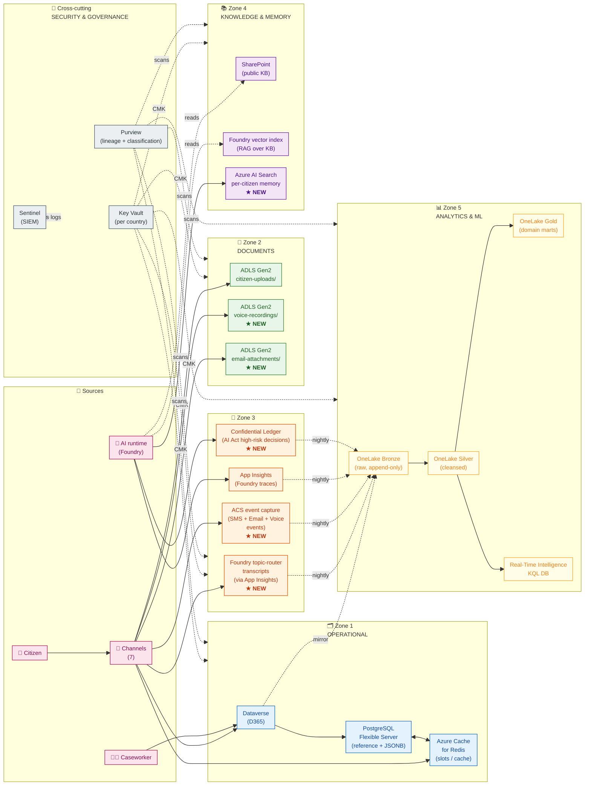

# 🗄️ Data Architecture & Retention

> **Where every byte of UDCSP lives, why it lives there, how long it lives, and who can read it.** Companion to [`architecture.md`](./architecture.md) (the *what is built*) and [`ai.md`](../biz/ai.md) (the *how AI thinks*). This document is the **storage truth**: 5 zones, ~25 stores, 1 retention matrix, 1 compliance map, 0 ambiguity.

---

> [!IMPORTANT]
> **TL;DR.** UDCSP keeps citizen data in **five storage zones**, each owned by a different concern: **Operational** (live cases) · **Documents** (binary uploads) · **Conversations** (every dialog turn, every voice second, every email body) · **Knowledge & Memory** (what the AI is allowed to read) · **Analytics & ML** (what the platform learns from itself). All five zones are **federated by country** (DK · SE · NO each own a private vault) and **governed end-to-end by Microsoft Purview** (lineage, classification, sensitivity labels). Retention is a **first-class platform invariant**, not a project-level afterthought: every data class has a documented retention period anchored on **EU AI Act Art. 26(6)** (≥ 6 months for high-risk AI logs), **GDPR Art. 5(1)(c)/(e)/Art. 17** (minimisation, storage limitation, right to erasure), and **ePrivacy Directive Art. 5** (informed notice for any conversational recording).
>
> 📡 The novelty introduced by this document — and the gap it fills compared to the original architecture — is **Zone 3 "Conversations"**: until now the platform doc described where *cases* and *documents* are stored, but did not formalise where the **per-channel conversations themselves** (voice `.wav`, dialog transcripts, SMS exchanges, email bodies, AI traces) are persisted, indexed, and eventually purged. § 3 below is the answer.
>
> ⚠️ **Compliance disclaimer.** Every retention duration in § 5 is a **platform default** that respects the EU baseline. Each Member State (DK · SE · NO) has its own administrative-law retention rules for public-service records that may **extend** these periods (typically 5 to 10 years for case files); the per-country Purview policy holds the authoritative number for each market. The defaults below are the floor, not the ceiling.
>
> 🛡️ *For the **business-language regulation-by-regulation answer** (DPO / auditor / citizen advocate audience) — what each regulation demands, what UDCSP does, where the evidence lives — see the companion document [`../biz/datacompliance.md`](../biz/datacompliance.md).*

---

## 📑 Table of contents

**Foundations**

1. [Why this document exists](#1-why-this-document-exists)
2. [Design principles for storage](#2-design-principles-for-storage)
3. [The five storage zones](#3-the-five-storage-zones) ★

**Operational specifics**

4. [Storage map per data category](#4-storage-map-per-data-category)
5. [Retention matrix (the contractual baseline)](#5-retention-matrix-the-contractual-baseline)
6. [Compliance mapping (GDPR · EU AI Act · ePrivacy)](#6-compliance-mapping-gdpr--eu-ai-act--eprivacy)
7. [Sovereignty & federation rules](#7-sovereignty--federation-rules)

**Cross-cutting concerns**

8. [Encryption, keys, and customer-managed keys (CMK)](#8-encryption-keys-and-customer-managed-keys-cmk)
9. [Right to erasure — operational playbook](#9-right-to-erasure--operational-playbook)
10. [Backup, disaster recovery, geo-redundancy](#10-backup-disaster-recovery-geo-redundancy)
11. [Data lineage (Purview) and audit trail](#11-data-lineage-purview-and-audit-trail)
12. [Anti-patterns we avoid](#12-anti-patterns-we-avoid)

---

## 1. Why this document exists

The case study mandates **GDPR + EU AI Act compliance** for a platform that serves 2.1 M citizens across three countries on seven channels (voice, web, mobile, chat, SMS, email, caseworker). That mandate forces us to answer five questions that the original architecture document only partially addressed:

1. **Where exactly does each piece of citizen data physically reside?** (Storage zone, region, encryption key.)
2. **How long is it kept?** (Retention period anchored on a specific legal article.)
3. **Who can read it?** (RBAC, ABAC, row-level security, sensitivity labels.)
4. **How do we delete it on demand?** (GDPR Art. 17 right-to-erasure operational playbook.)
5. **How do we prove all of the above to a regulator?** (Purview lineage + Sentinel audit trail.)

`architecture.md` answers these questions for **structured operational data** (cases, documents, references). This document **extends** the answer to **every byte that flows through the platform**, including the parts that were previously implicit:

| Previously implicit | Now explicit (this document) |
|---|---|
| "Conversation transcripts are in App Insights" | § 3 Zone 3 — **explicit pipeline**: Foundry topic-router → App Insights traces + Dataverse `bot_session` mirror → nightly mirror to OneLake bronze (≥ 6 months on hot tier) |
| "Voice uses gpt-realtime in the live audio path (Azure AI Speech reserved for pre-orchestrator menus + post-call analytics only)" | § 3 Zone 3 — **dedicated ADLS account** `voice-recordings/`, WORM-locked 90 days, lifecycle-purged automatically |
| "Email is via D365 email-to-case" | § 3 Zone 3 — **separated**: email *body* in Dataverse, **attachments** in dedicated ADLS `email-attachments/` (cost + perf) |
| "AI remembers the citizen" | § 3 Zone 4 — **dedicated Azure AI Search vector store** for per-citizen long-term conversational memory, ACL'd row-level by `citizen_id`, TTL 12 months rolling |
| "Logs are kept appropriately" | § 5 — **anchored** on EU AI Act Art. 26(6): "at least six months from the date each log is created" for high-risk AI deployers |

The bullet list above is also the **change log** versus the original `architecture.md`: five things became formal where they were informal.

---

## 2. Design principles for storage

| # | Principle | Implication |
|---|---|---|
| **D1** | **Right tool for the right shape** | Relational/JSONB → PostgreSQL · Sub-ms ephemeral state → Redis · CRM cases → Dataverse · Binary blobs → ADLS · Search → AI Search · Analytics → OneLake. Never abuse one for another (e.g., binary attachments **never** in Dataverse). |
| **D2** | **Hot, warm, cold tiers — explicit** | Every store has a tier policy (hot for active cases, cool for closed-but-recent, archive for legal hold). Lifecycle rules are coded, not manual. |
| **D3** | **Federation by country, never co-mingling** | Each of DK · SE · NO has its own **separate storage accounts, PostgreSQL servers, Redis instances, Dataverse environments, OneLake workspaces**. Cross-border = mediated, never co-mingled (architecture P1). |
| **D4** | **Customer-managed keys (CMK) at every layer** | Each country brings its own key (Key Vault per country); platform-managed encryption is a fallback, not a default. Key rotation is automated. |
| **D5** | **Retention is platform-enforced** | Lifecycle rules + immutability policies + Purview policies — not "we'll remember to delete it". All retention is implemented as Azure resource configuration. |
| **D6** | **PII is classified at write-time** | Purview auto-classification fires on every new container; sensitivity labels follow the data through transformations (Bronze → Silver → Gold). |
| **D7** | **Right to erasure is a service, not a project** | A tested workflow (`POST /privacy/erase/{citizen_id}`) cascades deletion across all 5 zones with a guaranteed ≤ 30-day SLA (GDPR Art. 12(3)). |
| **D8** | **Audit trail is immutable** | Sentinel + Storage account immutable WORM for the audit log itself — the audit cannot be tampered with, even by the deployer. |
| **D9** | **No raw production data in DEV** | DEV environments use **synthetic data** generated by agent A15 (see [`agents.md`](./agents.md)); production data never leaves PROD without DPO sign-off. |
| **D10** | **Storage costs are observable** | Azure Cost Management tagging on every resource — `country`, `zone`, `data-class` — so cost-of-compliance is measurable. |

---

## 3. The five storage zones

The 25 stores below break into 5 functional zones. Each zone is owned by a different *concern* (operational vs binary vs conversation vs knowledge vs analytics) and has its own retention/access/encryption policy.



> **Reading the diagram.** Sources on the left (citizen + AI + caseworker via 7 channels) write into Zones 1-4 directly. Zone 5 (Analytics & ML) is **always derivative** — it never receives direct writes from sources, only nightly mirrors from Zones 1-3. The Cross-cutting zone (Key Vault + Purview + Sentinel) wraps every other zone with encryption, governance, and audit. **Items marked ★ NEW** are the additions made by this document compared to the original architecture; the others were already present.

### 3.1 Zone 1 — Operational (chaud, transactionnel)

> **Purpose.** Live citizen state that the platform reads and writes thousands of times per second.

| Store | What lives there | Why this technology | Owner |
|---|---|---|---|
| **Microsoft Dataverse** (D365) | Cases, eligibility decisions, caseworker actions, email activity, audit | First-class CRM entities; native relationship model; built-in audit log | D365 plane |
| **Azure Database for PostgreSQL — Flexible Server** *(post-audit refactor — replaces Azure SQL **and** Cosmos DB)* | Reference data (countries, postal codes, currencies), business rules (eligibility tables, fee schedules), per-country glossaries, durable JSONB application drafts (>24 h retention), all relational lookups previously in SQL DB and all "JSON-document" workloads previously in Cosmos | Single OLTP engine consolidating relational + JSONB; CMK; private endpoint; geo-zone-redundant backup; Flexible Server HA; clear right-to-erasure surface | Reference + drafts plane |
| **Azure Cache for Redis** *(post-audit refactor — replaces ephemeral Cosmos workloads)* | Slot-filling cache for the topic-router (TTL 24 h.), session state, rate-limit counters, ephemeral conversational context, in-progress draft autosaves (TTL ≤ 24 h.), distributed locks | Sub-millisecond p99 reads; native TTL; Enterprise SKU CMK + private endpoint; cheaper than Cosmos for ephemeral data | App service plane |

> 🔧 **Implementation status (May 2026) — Dataverse `udcsp_application` table.**
> The canonical Dataverse table for citizen applications is `udcsp_application`
> (~40 columns covering identity, routing, citizen, residency-transfer, child-benefit, document extraction, AI verdict, claims envelope, consents, caseworker workflow). The full spec lives in
> `apps/d365/solutions/UDCSP_Core/customizations/entities/udcsp_application.xml`.
> **However**, until the table is authored once in `make.powerapps.com` (or
> provisioned by `apps/powerapps/caseworker/bootstrap-udcsp-application.ps1`,
> which calls the Dataverse Web API to create it idempotently), the
> application-intake Logic App falls back to writing on the standard
> `task` activity entity with `subject = "[UDCSP-<country>] <topic>"` and
> `description = "citizenUpn: <upn> | text: …"`. The 30+ `udcsp_*`
> columns the LA tries to set are silently dropped. The APIM operation
> policy `services/apim/apis/citizen-applications/operations/get-citizen-applications-list.xml`
> mirrors that fallback by querying `tasks` filtered by UPN — this gives
> citizens **cross-device case re-hydration today** (sign out, switch
> device, sign back in → cases appear). When the canonical table lands,
> swap one OData query in that policy (`tasks` → `udcsp_applications`)
> and the LA stops dropping columns.

### 3.2 Zone 2 — Documents (binary, immuable)

> **Purpose.** Binary blobs that are too big for Dataverse and need lifecycle policies.

| Store | What lives there | Why this technology | Owner |
|---|---|---|---|
| **ADLS Gen2 — `citizen-uploads/`** | Citizen-uploaded documents: passport scans, payslips, leases, ID cards, photos | Hierarchical namespace; cool/archive tiers; legal hold; Purview-scannable | Documents plane |
| **ADLS Gen2 — `voice-recordings/`** ★ | Audio `.wav` from PSTN calls + corresponding STT transcript JSON | Immutable WORM 90 days; lifecycle auto-purge; CMK; per-country account | Voice channel |
| **ADLS Gen2 — `email-attachments/`** ★ | Inbound + outbound email attachments (PDFs, images, signed forms) | Same lifecycle pattern as voice; referenced by URI in Dataverse `email_activity` | Email channel |

> 💡 **Why three separate ADLS accounts and not one with three folders?** Per-account lifecycle rules + per-account access keys + per-account immutability policies + per-account cost tagging = clearer compliance + cleaner audit + simpler right-to-erasure.

### 3.3 Zone 3 — Conversations (logs canal) ★ NEW ZONE

> **Purpose.** Every dialog turn, every audio second, every SMS, every email — captured, retained, mirrored to analytics, and purged on schedule.

| Store | What lives there | Why this technology | Owner |
|---|---|---|---|
| **Foundry topic-router transcripts** (via Application Insights, post-audit) ★ | Per-turn transcript: user message, agent reply, intent, slots filled, locale, escalation flag, model version, content-safety verdict | Native Foundry tracing exporter; KQL-queryable; row-level filtered by `country_tag` | AI plane (Foundry) |
| **ACS event capture** (Event Hubs → ADLS Gen2 `acs-events/`) ★ | SMS `MessageReceived` / `DeliveryReportReceived` events; Email `EmailReceived` / `BounceReceived` events; Voice `CallStarted` / `CallEnded` / `RecordingStateChanged` events | High-throughput append-only; native ACS Event Grid integration; idempotent ingestion | Workflow plane (Logic Apps) |
| **Application Insights** (Foundry traces) | Per-call OTEL traces: prompt version, retrieved chunks, tool invocations, model output, safety verdict, latency p50/p95, tokens in/out, evaluation scores | Native Foundry export; KQL-queryable; Sentinel-feedable; 90-day default retention extended to 180 d. | AI plane (Foundry) |
| **Azure Confidential Ledger** ★ *(post-audit addition)* | Append-only, hardware-attested ledger of every **high-risk AI** decision (Eligibility Pre-Assessor): hash of input, hash of output, model version, attestation evidence | CCF-backed; tamper-evident; satisfies AI Act Art. 26(6) cryptographic-integrity bar that App Insights cannot meet alone | AI plane (governance) |

**Why Zone 3 is its own zone** (and not a sub-zone of Operational or Analytics): conversations have **a different access pattern** (append-only, time-series), **a different retention curve** (≥ 6 months for AI Act compliance, but rarely needed beyond 12 months), **a different compliance regime** (ePrivacy + AI Act apply, on top of GDPR), and **a different consumer** (the data-science / eval / fine-tuning workflows pull from here, not from Operational).

### 3.4 Zone 4 — Knowledge & Memory (lecture par AI)

> **Purpose.** Anything the AI is allowed to read at runtime to ground its answers.

| Store | What lives there | Why this technology | Owner |
|---|---|---|---|
| **SharePoint** | Source-of-truth public knowledge: laws, FAQs, official forms, glossaries, policy circulars | Editorial workflow; versioning; multilingual sites; native M365 integration | Content plane |
| **Foundry vector index** | Embedded chunks of SharePoint + selected SP libraries, scoped per agent (Citizen Assistant has a different index than Caseworker Helper) | Native Foundry RAG primitive; per-agent isolation; auto-refresh | AI plane (Foundry) |
| **Azure AI Search** — per-citizen memory ★ | Embedded summaries of past conversations, indexed by `citizen_id`, ACL row-level secured | Vector + hybrid search; per-document ACL; scaleable to millions of citizens; rolling 12-month TTL | AI plane (memory) |
| **OneLake** (case-history anonymised, read by AI) | Anonymised closed cases used as precedent retrieval for Caseworker Helper (**never** as decision input for Eligibility) | Same Fabric workspace as analytics; anonymisation pipeline upstream; row-level security | Analytics plane (read by AI) |

> 💡 **Why a separate Azure AI Search vector store for citizen memory** when Foundry has its own vector index? **Lifecycle**: Foundry's index is built from public KB and is rebuilt nightly — wrong tool for per-citizen, mutable, ACL-scoped memory. AI Search lets us delete an individual citizen's memory in ≤ 1 second on a right-to-erasure request, without re-indexing 2.1 M others.

### 3.5 Zone 5 — Analytics & ML (froid, dérivé)

> **Purpose.** Aggregate insights, executive dashboards, ML training datasets — never serves a citizen-facing request directly.

| Store | What lives there | Why this technology | Owner |
|---|---|---|---|
| **OneLake — Bronze** (per country) | Raw mirrors of all sources (Dataverse, PostgreSQL, ACS events, Foundry traces, Confidential Ledger, Logic Apps run history) | Append-only; cheap; fault-tolerant landing zone | Fabric plane |
| **OneLake — Silver** (per country) | Cleansed, conformed, schema-enforced; PII classification applied | Data quality boundary; downstream consumers can trust types | Fabric plane |
| **OneLake — Gold** (per country) | Domain marts (citizen, case, eligibility, satisfaction); semantic-model-ready | Power BI consumption; cross-country aggregations via Domain | Fabric plane |
| **Fabric Real-Time Intelligence** (KQL DB) | Live KPIs: queue depth, avg processing time, SLA breach alerts | KQL real-time queries; sub-second freshness | Fabric plane |

> [!IMPORTANT]
> **3 Lakehouses, 9 medallion zones** — Fabric exposes **one** Lakehouse object per country (`udcsp-lh-dk`, `udcsp-lh-se`, `udcsp-lh-no`); inside each Lakehouse, Delta tables are organised into the three medallion folders Bronze / Silver / Gold. The platform-level claim of *"9 lakehouses"* is shorthand for **3 sovereign Lakehouses × 3 medallion layers = 9 logical zones**, not 9 separate Fabric items. Per-country isolation is enforced at the Lakehouse boundary; per-layer governance (PII gates, data-quality checks, Purview classification) is enforced at the medallion folder boundary.

---

## 4. Storage map per data category

The matrix below is the **definitive lookup table**: for each category of data the platform handles, where it lives (and where its mirror lives for analytics).

| # | Data category | Primary store | Zone | Mirror to Analytics? | Per-country isolation? |
|---|---|---|---|---|---|
| 1 | Citizen identity profile | Microsoft Entra External ID | (External, identity plane) | ❌ No (PII) | ✅ Yes (3 directories) |
| 2 | Open case + workflow state | Dataverse | Zone 1 | ✅ Mirror nightly to OneLake bronze | ✅ Yes (3 environments) |
| 3 | Application draft (in-progress form) | PostgreSQL Flexible Server (JSONB) — durable; Redis — autosave (TTL ≤ 24h) | Zone 1 | ❌ No (ephemeral) | ✅ Yes (3 instances of each) |
| 4 | Reference data (rules, codes, taxes) | PostgreSQL Flexible Server (relational) | Zone 1 | ✅ Snapshot to Bronze weekly | ❌ No (shared, public) |
| 5 | Citizen-uploaded document | ADLS Gen2 `citizen-uploads/` | Zone 2 | ✅ Metadata only (not blob) to Bronze | ✅ Yes (3 accounts) |
| 6 | **Voice call audio** ★ | ADLS Gen2 `voice-recordings/` | Zone 2 | ✅ STT transcript only to Bronze | ✅ Yes (3 accounts) |
| 7 | **Email attachment** ★ | ADLS Gen2 `email-attachments/` | Zone 2 | ✅ Metadata + SHA only to Bronze | ✅ Yes (3 accounts) |
| 8 | **Dialog transcript (Foundry topic-router)** ★ | App Insights (Foundry traces) + Dataverse `bot_session` mirror | Zone 3 | ✅ Mirror nightly to Bronze | ✅ Yes (per-environment) |
| 9 | **SMS message body** ★ | Dataverse — custom `sms_activity` table + ACS event | Zone 3 | ✅ Mirror nightly to Bronze | ✅ Yes |
| 10 | **Email body** ★ | Dataverse — `email_activity` table | Zone 3 | ✅ Mirror nightly to Bronze | ✅ Yes |
| 11 | **Foundry AI trace** | Application Insights | Zone 3 | ✅ Export nightly to Bronze | ✅ Yes (per-region App Insights) |
| 11b | **High-risk AI decision proof** ★ *(post-audit)* | Azure Confidential Ledger | Zone 3 | ✅ Mirror nightly to Bronze (for query) | ✅ Yes (per country) |
| 12 | Caseworker action / override | Dataverse — `case_audit` + custom `eligibility_override` | Zone 3 + Zone 1 | ✅ Mirror nightly to Bronze | ✅ Yes |
| 13 | Public knowledge base | SharePoint | Zone 4 | ❌ No (it IS the source) | ❌ No (1 tenant, 3 site collections) |
| 14 | Foundry RAG index | Foundry vector index | Zone 4 | N/A (rebuilt from SharePoint nightly) | ✅ Yes (per-agent + per-country) |
| 15 | **Per-citizen AI memory** ★ | Azure AI Search vector store | Zone 4 | ❌ No (PII; deleted on erasure) | ✅ Yes (3 search services) |
| 16 | Case-history anonymised (precedents) | OneLake — Gold layer (read by AI) | Zone 5 (read by Z4) | (it IS the analytics) | ✅ Yes (3 workspaces) |
| 17 | Analytics gold mart | OneLake Gold | Zone 5 | (it IS the analytics) | ✅ Yes (3 workspaces) |
| 18 | Cross-country aggregates | Fabric Domain | Zone 5 | (federated view) | Federation, not co-mingling |
| 19 | Live KPIs (queues, SLA) | Fabric Real-Time Intelligence (KQL) | Zone 5 | (KQL is the analytics) | ✅ Yes |
| 20 | Power BI semantic model | Fabric Semantic Model (DirectLake) | Zone 5 | (no further mirror) | ✅ Yes (per-workspace) |
| 21 | Audit log (Sentinel) | Sentinel workspace + immutable Storage | Cross-cutting | (audit IS the trail) | ✅ Yes (per-region workspace) |
| 22 | Secrets, certs, CMK | Azure Key Vault (HSM-backed) | Cross-cutting | ❌ Never leaves KV | ✅ Yes (per-country vault) |
| 23 | Purview catalog | Purview account + scan results | Cross-cutting | (Purview IS the catalog) | 1 Purview, 3 collections (per country) |
| 24 | Logic Apps run history | Logic Apps native | Cross-cutting (Workflow) | ✅ Export to Bronze | ✅ Yes (per-region) |
| 25 | APIM telemetry | App Insights (APIM-linked) | Cross-cutting | ✅ Export to Bronze | ✅ Yes |

★ = new in this document compared to the original `architecture.md`.

---

## 5. Retention matrix (the contractual baseline)

> ⚠️ **Reading note.** Each row is the **EU baseline** the platform enforces by default through Azure resource configuration (lifecycle rules, immutability policies, Postgres lifecycle jobs, Redis TTL, Sentinel retention, Purview policies). National administrative-law overrides may **extend** these — the per-country Purview policy holds the authoritative number. **Never shorter than the baseline below.**

| Data category | Hot retention (active) | Warm / archive | Definitive deletion | Anchor article |
|---|---|---|---|---|
| Open case (Dataverse) | 7 years (active) | After closure → OneLake Gold (anonymised), Dataverse purged | Per national admin law (5-10 years) | National admin law + GDPR Art. 5(1)(e) |
| Case audit log | 10 years | OneLake Bronze immutable | Aligned with case retention | National admin law |
| Application draft (Postgres JSONB) | Active until submission, then 30 days post-submission | Mirror to Bronze for analytics | DELETE on submission timeout | GDPR Art. 5(1)(c) minimisation |
| Application draft autosave (Redis) | TTL ≤ 24 h. (auto) | None | TTL auto-purge | GDPR Art. 5(1)(c) |
| Slot-filling cache (Redis) | TTL 24 h. (auto) | None | TTL auto-purge | GDPR Art. 5(1)(c) |
| Citizen-uploaded document | While case open + 30 days | Cool tier 1 year, then Archive | On erasure request OR end of case retention | GDPR Art. 17 + national admin law |
| **Voice call audio** ★ | 30 days clear-text | WORM 90 days total | Audio purged at 90 days; transcript follows "transcript" rule | GDPR Art. 5(1)(c) + ePrivacy Art. 5 |
| **Voice STT transcript** ★ | 6 months hot in Dataverse | 6 years OneLake (anonymised at 6 months) | Per case retention | EU AI Act Art. 26(6) (≥ 6 months) + GDPR |
| **Dialog transcript (Foundry topic-router)** ★ | 6 months hot (App Insights) + Dataverse mirror | 6 years OneLake (anonymised at 6 months) | Per case retention | EU AI Act Art. 26(6) |
| **High-risk AI decision proof (Confidential Ledger)** ★ *(post-audit)* | Append-only, immutable | Indefinite (immutable by design) | Never (only the citizen mapping in Postgres can be erased — the hash remains) | EU AI Act Art. 26(6) — cryptographic proof of integrity |
| **SMS message** ★ | 6 months hot in Dataverse | 6 years OneLake | Per case retention | EU AI Act Art. 26(6) + ePrivacy |
| **Email body + attachments** ★ | 6 months hot in Dataverse | 6 years OneLake | Per case retention OR erasure | EU AI Act Art. 26(6) + GDPR Art. 17 |
| **Foundry AI trace** | 180 days App Insights · LAW configurable up to 730 days | OneLake Bronze indefinite (anonymised) | Anonymisation at 6 months, per-trace deletion on erasure | **EU AI Act Art. 12.3 (≥ 6 months — this is the binding minimum); LAW ceiling 730 days gives 2× headroom for high-risk audit replay** |
| Caseworker action / override | 10 years (Dataverse + audit) | OneLake immutable | Per national admin law | National admin law |
| **Per-citizen AI memory (AI Search)** ★ | TTL 12 months rolling | None | TTL auto-purge OR erasure on demand | GDPR Art. 17 + Art. 5(1)(e) |
| KPI live (KQL) | 90 days raw | Aggregated to Gold (no raw beyond 90 d.) | Auto-purge | Operational |
| OneLake Bronze (raw) | Indefinite | Indefinite (immutable) | On per-citizen erasure cascade only | GDPR Art. 17 cascade |
| OneLake Silver / Gold | Indefinite | Indefinite | Anonymised, generally non-erasable | GDPR Art. 17 (anonymised data is out of scope) |
| Sentinel audit log | 2 years hot, 12 years cold | Immutable WORM | Per Member State criminal-investigation retention | GDPR + national criminal law |
| Logic Apps run history | 90 days | Mirrored to Bronze | Auto-purge in Logic Apps | Operational + AI Act Art. 26(6) for AI-related runs |
| APIM telemetry | 90 days App Insights | Mirrored to Bronze | Auto-purge | Operational |
| Key Vault audit | 90 days | Mirrored to Sentinel | Per Sentinel rule | Operational |

★ = formally added by this document.

> 💡 **The 6-month floor.** Any data category whose retention floor cites **EU AI Act Art. 26(6)** is **load-bearing for compliance**: it is the operationalisation of the deployer's obligation to keep high-risk AI logs for at least six months. Pulling it shorter is a regulatory finding waiting to happen.

---

## 6. Compliance mapping (GDPR · EU AI Act · ePrivacy)

Every storage decision in §§ 3-5 is anchored on one or more of the regulations below. This section is the cross-reference: if a regulator asks "where do you implement Art. X?", we point them to the table.

| Regulation | Article | What it requires | Where UDCSP implements it |
|---|---|---|---|
| **GDPR** | Art. 5(1)(c) — data minimisation | Adequate, relevant, not excessive | Postgres draft 30-day cap; Redis TTL; voice 90-day purge; AI memory 12-month TTL |
| **GDPR** | Art. 5(1)(e) — storage limitation | Kept no longer than necessary | All "definitive deletion" columns in § 5 |
| **GDPR** | Art. 5(1)(f) — integrity & confidentiality | Appropriate security | CMK at every layer (§ 8); private endpoints; RBAC; managed identities |
| **GDPR** | Art. 17 — right to erasure | Delete on data subject request, ≤ 30 days | **Microsoft Priva** is the system of record for DSR (post-audit); the executor cascades through `gdpr-data-erase` Logic App across all 5 zones (§ 9). |
| **GDPR** | Art. 25 — data protection by design | Privacy default settings | Encryption-at-rest is on by default for every store; sensitivity labels auto-applied |
| **GDPR** | Art. 30 — records of processing activities (RoPA) | Document every processing | Purview catalog IS the RoPA — auto-populated by scans (§ 11) |
| **GDPR** | Art. 32 — security of processing | Encryption + pseudonymisation + resilience | CMK + per-citizen pseudonymisation in OneLake Silver + GZRS replication (§ 10) |
| **GDPR** | Art. 33-34 — breach notification | Notify within 72 h. | Sentinel detection rules + automated notification workflow |
| **GDPR** | Art. 35 — DPIA | DPIA for high-risk processing | Documented per agent in `governance/ai-act/registry/` (see [`ai.md`](../biz/ai.md) § 11) |
| **EU AI Act** | Art. 12 — record-keeping (capability) | Logging capability over the lifetime | Foundry traces (App Insights) — § 3.3 Zone 3 |
| **EU AI Act** | Art. 13 — transparency | Inform users of AI use | Citizen-facing notices + caseworker badges in D365 |
| **EU AI Act** | Art. 14 — human oversight | Caseworker can override, with reason captured | `eligibility_override` table in Dataverse + mirrored to Foundry trace as `human-override` |
| **EU AI Act** | **Art. 26(6) — log retention (deployer)** | **Logs kept ≥ 6 months from creation** | **Foundry traces 180 days App Insights + indefinite OneLake Bronze + Confidential Ledger immutable proof for high-risk decisions** |
| **EU AI Act** | Art. 71-72 — registration & post-market monitoring | Registry of high-risk systems + monitoring plan | `governance/ai-act/registry/eligibility-model.yaml` + Power BI auditor dashboard |
| **ePrivacy** | Art. 5(1) — confidentiality of communications | No interception/recording without consent or legal basis | Voice IVR opening notice + email banner; lawful basis = "obligation légale" (public-service mission) |
| **ePrivacy** | Art. 5(3) — terminal storage (cookies) | Consent for non-essential storage | Cookie banner on web portal; only essential session cookie pre-consent |
| **WCAG 2.1 AA** | (per principle) | Accessibility | Every channel has accessibility tests (see [`uses.md`](../biz/uses.md)) |

> 💡 **Lawful basis for public-service voice/email recording.** Because UDCSP is a regalian platform delivering public services, the lawful basis under GDPR Art. 6 is **6(1)(e) — performance of a task carried out in the public interest** (citizen administrative service), **not** consent. Consent is brittle (it can be withdrawn) and inappropriate for a service the citizen is legally obliged to use. We still **inform** at the start of every interaction (ePrivacy Art. 5(1) requirement), but we **do not condition** the service on consent withdrawal.

---

## 7. Sovereignty & federation rules

The platform is federated across DK · SE · NO. Storage rules implement the federation:

| Rule | Implementation |
|---|---|
| **Each country has its own resource group, subscription, and storage accounts** | `rg-udcsp-{dk\|se\|no}-{env}`; sub-IDs distinct; resource names enforce country prefix |
| **Each country has its own Dataverse environment** | 3 separate environments (`udcsp-dk`, `udcsp-se`, `udcsp-no`); cross-environment lookups go through APIM, not direct Dataverse-to-Dataverse |
| **Each country has its own Key Vault with its own CMK** | Encryption keys never cross borders; if DK's key is compromised, only DK is affected |
| **Each country has its own Fabric workspace** | Raw data never leaves the country workspace; sharing is opt-in via Fabric Domain |
| **Cross-country data products are federated, not centralised** | Fabric Domain federates **gold-layer aggregates** (KPIs, anonymised stats); raw data is never co-mingled |
| **Cross-border citizen scenarios go through mediation** | When Anna moves from Copenhagen to Stockholm (D1), her Danish profile is **read** by the Swedish onboarding flow via APIM; nothing is **copied** wholesale |
| **OneLake shortcuts are explicit, audited, and reversible** | A country can revoke a shortcut at any time; Purview audits every cross-country read |
| **One Purview account, three collections** | Single catalog for federated lineage; collections enforce per-country read scope |

```mermaid
%%{ init: { 'flowchart': { 'nodeSpacing': 20, 'rankSpacing': 30 }, 'themeVariables': { 'fontSize': '12px' } } }%%
flowchart TB
    subgraph DK["🇩🇰 Denmark sovereign zone"]
        DK_KV["Key Vault DK"]
        DK_DV["Dataverse DK"]
        DK_ADLS["ADLS DK<br/>(docs+voice+email)"]
        DK_FAB["Fabric DK"]
    end

    subgraph SE["🇸🇪 Sweden sovereign zone"]
        SE_KV["Key Vault SE"]
        SE_DV["Dataverse SE"]
        SE_ADLS["ADLS SE"]
        SE_FAB["Fabric SE"]
    end

    subgraph NO["🇳🇴 Norway sovereign zone"]
        NO_KV["Key Vault NO"]
        NO_DV["Dataverse NO"]
        NO_ADLS["ADLS NO"]
        NO_FAB["Fabric NO"]
    end

    subgraph FED["🤝 Federation layer (gold-only, no raw)"]
        DOMAIN["Fabric Domain"]
        APIM["APIM cross-border<br/>(mediation)"]
        PV["Purview<br/>(3 collections)"]
    end

    DK_FAB -.->|"gold products"| DOMAIN
    SE_FAB -.->|"gold products"| DOMAIN
    NO_FAB -.->|"gold products"| DOMAIN

    DK_DV -. "mediated" .-> APIM
    SE_DV -. "mediated" .-> APIM
    NO_DV -. "mediated" .-> APIM

    PV -.-> DK
    PV -.-> SE
    PV -.-> NO

    classDef dk fill:#FCE4EC,stroke:#AD1457,color:#880E4F
    classDef se fill:#E3F2FD,stroke:#1565C0,color:#0D47A1
    classDef no fill:#E8F5E9,stroke:#2E7D32,color:#1B5E20
    classDef fed fill:#FFF3E0,stroke:#E65100,color:#BF360C

    class DK_KV,DK_DV,DK_ADLS,DK_FAB dk
    class SE_KV,SE_DV,SE_ADLS,SE_FAB se
    class NO_KV,NO_DV,NO_ADLS,NO_FAB no
    class DOMAIN,APIM,PV fed
```



---

## 8. Encryption, keys, and customer-managed keys (CMK)

| Layer | Encryption at rest | Encryption in transit | Key strategy |
|---|---|---|---|
| Dataverse | CMK from country Key Vault | TLS 1.2+ | Per-country CMK, rotated quarterly |
| PostgreSQL Flexible Server | CMK (BYOK) from country Key Vault | TLS 1.2+ enforced | Per-country CMK; auto-rotate |
| Azure Cache for Redis (Enterprise) | CMK from country Key Vault | TLS 1.2+ | Per-country CMK |
| Confidential Ledger | CCF-managed keys (hardware-attested) | TLS 1.2+ | Hardware-rooted, not in customer Key Vault |
| Confidential Container Apps | TEE memory encryption (SEV-SNP) + disk CMK | mTLS to APIM | Per-country CMK + remote attestation evidence stored alongside decisions |
| ADLS Gen2 (all 3 accounts per country) | CMK + double encryption | TLS 1.2+ | Per-country CMK; HSM-backed; auto-rotate |
| OneLake | Workspace-level encryption + CMK | TLS 1.2+ | Per-country CMK |
| Azure AI Search | Service-managed + CMK option | TLS 1.2+ | Per-country CMK |
| App Insights | Workspace-managed + CMK | TLS 1.2+ | Per-country CMK |
| Key Vault | HSM (FIPS 140-2 Level 2) | TLS 1.2+ | Master key in HSM, never exportable |

**Key rotation policy.** Quarterly automated rotation for symmetric keys; certificate auto-renewal for asymmetric. **Key revocation** is a tested procedure: in the event of a confirmed breach in country X, only country X's CMK is rolled — countries Y and Z continue uninterrupted.

---

## 9. Right to erasure — operational playbook

GDPR Art. 17 demands a way to delete a citizen's personal data on request, within 30 days, with proof. The playbook below is the operational answer; it is implemented as an APIM endpoint and tested every release.

```mermaid
sequenceDiagram
    autonumber
    participant DPO as DPO Console
    participant API as APIM /privacy/erase
    participant Priva as Microsoft Priva<br/>(DSR system of record)
    participant ORC as Erasure Executor<br/>(Logic App)
    participant Z1 as Zone 1<br/>Dataverse + Postgres + Redis
    participant Z2 as Zone 2<br/>ADLS docs + voice + email
    participant Z3 as Zone 3<br/>Conv. transcripts + AI traces<br/>+ Confidential Ledger
    participant Z4 as Zone 4<br/>AI Search memory
    participant Z5 as Zone 5<br/>OneLake (anonymise)
    participant PV as Purview<br/>(audit + lineage)

    DPO->>API: POST /privacy/erase/{citizen_id}
    API->>Priva: Open DSR ticket + SLA timer
    Priva->>ORC: Trigger erasure (signed request, ticket id)
    ORC->>Z1: delete cases, drafts, references<br/>(or anonymise if legal hold)
    ORC->>Z2: tombstone documents<br/>(retain hash for chain-of-custody)
    ORC->>Z3: anonymise transcripts<br/>(citizen_id → pseudonym);<br/>Confidential Ledger entries are NOT deleted (immutable)<br/>but the citizen ↔ hash mapping in Postgres IS removed
    ORC->>Z4: hard-delete vector memory
    ORC->>Z5: re-anonymise gold marts<br/>(pseudonym replaced)
    ORC->>PV: log erasure with timestamp + scope
    ORC-->>Priva: Report completion + DPA evidence package
    Priva-->>DPO: Erasure certificate (signed PDF) + audit trail
    Note over DPO,PV: Delivered ≤ 30 days per GDPR Art. 12(3)<br/>(Priva tracks the SLA continuously)
```

**Edge cases.**
- **Active investigation hold.** If the citizen is subject to a documented legal-hold (criminal investigation), the erasure is *suspended*, the DPO is notified, the citizen is informed of the suspension reason — the legal hold overrides Art. 17 per Art. 23.
- **Anonymised data.** OneLake Silver/Gold marts are *re-anonymised* (the pseudonym is rotated) but the aggregates remain — anonymised data is out of GDPR scope.
- **Audit log.** Sentinel records the erasure event itself; the audit log is **never** subject to erasure (Art. 23 exemption for legal claims).

---

## 10. Backup, disaster recovery, geo-redundancy

| Store | Backup strategy | RPO | RTO | Geo-redundancy |
|---|---|---|---|---|
| Dataverse | Native long-term backup, point-in-time restore | 1 h. | 4 h. | Geo-paired region (within country) |
| PostgreSQL Flexible Server | Azure Backup + Flexible Server PITR + GZRS-replicated backups | 15 min. | 1 h. | Zone-redundant HA + geo-paired backup |
| Azure Cache for Redis (Enterprise) | Azure Backup of dataset (RDB export to Storage) | 15 min. | 30 min. | Geo-paired RDB store |
| Confidential Ledger | CCF-managed multi-node consensus replication | 0 (synchronous) | < 5 min. | In-region multi-node + geo-paired second ledger for high-risk countries |
| Confidential Container Apps | Stateless; image in ACR with geo-replication | N/A (stateless) | 10 min. | ACR geo-replicated; redeploy from IaC |
| ADLS Gen2 (all accounts) | Soft-delete + versioning + GZRS + Azure Backup vault references | 0 (versioning) | 1 h. | Geo-zone-redundant storage |
| OneLake | Workspace backup + git integration on artefacts | 24 h. | 24 h. | Per-region |
| Azure AI Search | Service-managed snapshots | 24 h. | 4 h. | Multi-replica per service |
| App Insights | Native long-term retention | 24 h. | N/A | Per-region workspace |
| Key Vault | HSM-backed soft-delete + purge protection (90 d.) | 0 | 1 h. | HSM cluster |

**BCDR ownership.** End-to-end backup + replication is centralised in **Azure Backup** vaults + **Azure Site Recovery** (per-country, geo-paired in-EU); see [`infra/security/backup-asr/`](../../infra/security/backup-asr/). Resilience is empirically validated by **Azure Chaos Studio** monthly experiments (region failover, NSG isolation, Postgres failover) — see [`infra/security/chaos-studio/`](../../infra/security/chaos-studio/).

**DR drill cadence.** Twice yearly per country, with caseworker simulation; the runbook is in `docs/tech/runbook-dr.md` (created by the operations agent).

---

## 11. Data lineage (Purview) and audit trail

Purview is the **single source of truth** for "what data does UDCSP have, where is it, and who touched it":

- **Auto-classification** scans every storage account daily; PII categories auto-applied.
- **Sensitivity labels** (`Confidential / Citizen Personal`, `Restricted / Health`, `Public`) propagate from source to derived datasets via column-level lineage.
- **RoPA auto-population** — Purview's classifications + collections + scan history serve as the GDPR Art. 30 Records of Processing Activities; a quarterly export is delivered to the DPO.
- **Data-sharing policies** govern OneLake shortcuts: a cross-country shortcut from SE to DK requires DK's data steward approval, captured in Purview.

Sentinel sits **on top of** Purview for the live audit trail:

- All Key Vault access events → Sentinel.
- All cross-border APIM calls → Sentinel.
- All erasure requests → Sentinel.
- All "human-override" eligibility decisions → Sentinel.
- Detection rules: 24/7 alerting on anomalous read patterns, mass-export attempts, key rotation outside the rotation window.

---

## 12. Anti-patterns we avoid

| Anti-pattern | Why we avoid it | What we do instead |
|---|---|---|
| Putting binary attachments in Dataverse | Cost + perf + backup balloon | ADLS Gen2 with URI reference in Dataverse |
| Centralising all 3 countries in one Fabric workspace | Sovereignty violation | Per-country workspace + Fabric Domain federation |
| Storing voice `.wav` in clear forever | GDPR minimisation breach + cost | 90-day WORM purge; transcript persists |
| Using the Foundry RAG vector index for per-citizen memory | Wrong tool — index is rebuilt nightly, can't ACL per-citizen | Dedicated Azure AI Search vector store |
| Letting Postgres / Redis grow unbounded | Cost + slow scans | Postgres draft 30-day cap (lifecycle job); Redis native TTL on every key (24 h. cache, ≤ 24 h. autosaves) |
| Backing up secrets to a regular storage account | Defeats Key Vault's purpose | HSM-backed soft-delete + purge protection in Key Vault itself |
| Treating Sentinel as "logs we'll look at someday" | Misses 72-h. breach notification window | Active detection rules + paged on-call |
| Using "consent" as the GDPR lawful basis for a regalian service | Brittle (can be withdrawn), wrong legal basis | Use Art. 6(1)(e) public-interest task; **inform** without conditioning service on consent |
| Forgetting that anonymisation must be irreversible | "Pseudonymisation" ≠ "anonymisation" under GDPR | Gold marts use **k-anonymity** + suppression of quasi-identifiers, audited yearly |
| Hard-coding retention periods in app code | Becomes stale when law changes | All retention is Azure resource configuration (lifecycle rules, immutability policies, TTL) — single point to update |

---

> *UDCSP keeps every byte of citizen data in one of five clearly-bounded zones, with a documented retention period anchored on a specific legal article, with customer-managed encryption everywhere, with federation-not-co-mingling across DK · SE · NO, with a tested right-to-erasure cascade that respects GDPR Art. 17 in ≤ 30 days, and with Purview + Sentinel providing an immutable audit trail. The novelty over the original architecture is **Zone 3 — Conversations**, which formalises where every dialog turn, every voice second, every SMS, every email, and every AI trace physically lives — closing the most significant compliance gap a regulator would have asked about.*
