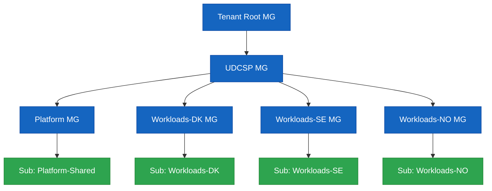

# UDCSP — Installation Guide

> **Audience.** Platform engineers and reviewers performing a clean install of the **Unified Digital Citizen Services Platform** on a sacrificial Microsoft Cloud tenant.
>
> **Outcome.** Every component referenced by [`architecture.md`](./architecture.md) provisioned in dependency order, smoke-tested, and ready to drive the 10 acceptance scenarios in [`recipe.md`](../biz/recipe.md).

> [!TIP]
> **Storage architecture context.** Read [`data.md`](./data.md) before installing — it explains what each storage component is for and why it's needed (5 zones, retention matrix, GDPR + AI Act + ePrivacy compliance mapping).

This guide is split into **5 collapsible sections**. Click any ▶ to expand.

| Section | What it is | When to use |
|---|---|---|
| **🟦 A — Prerequisites** | Things you do **once** on your workstation and Microsoft Cloud tenants before touching the installer. | Day-1 setup. |
| **🟩 B — Mandatory install** | The **linear sequence** that takes a clean tenant to a fully running platform. **Run every step in order.** | Every install. |
| **🟨 C — Optional** | Things you can skip for a basic install (PSTN, evaluator HTML, conversational smoke, tear-down). | Demos & audits. |
| **🟪 D — Re-run / Troubleshooting** | How to re-deploy a single phase, fix common errors, read reports. | After code changes or failed runs. |
| **🟧 E — Post-install checklist** | What the installer covers vs. what stays manual on a real MCAPS sandbox tenant — gaps, licences to obtain, follow-up actions. | After a green install run. |

---

<details>
<summary><h2>🟦 A — PREREQUISITES (do this once)</h2></summary>

> Run the **A1 → A6** steps top-to-bottom on your workstation. Stop at the end of A6 — do **not** start the installer yet, that's section B.
>
> **Why this order?** A1 installs the CLIs. A2 signs you into the things that exist on a fresh tenant (Azure + Microsoft Graph). A3 *creates* the missing tenants, subs and D365 environments — which gives you the URLs A4 needs. A4 signs `pac` into those new D365 URLs. **A5 installs the `Dynamics 365 Customer Service` first-party app into each env** (without it the env is a bare Dataverse and demo #5 cannot run). A6 writes everything you just created — including the Customer Service `appid` — into the installer config file.

<details>
<summary><b>A1. Install workstation tooling</b></summary>

The installer module phases call real CLIs. The bootstrap script installs **everything except** `az` (Azure CLI MSI) and `pac` (Power Platform CLI MSI):

```powershell
pwsh ./scripts/dev/Bootstrap-DevEnv.ps1
```

Then install the two MSIs manually if not already present:

| Tool | Mandatory? | Used by | Install |
|---|---|---|---|
| **PowerShell 7+** | ✅ Always | Orchestrator + every module | <https://learn.microsoft.com/en-us/powershell/scripting/install/installing-powershell> |
| **Azure CLI (`az`) 2.60+** | ✅ Always | LandingZone, Bastion, CIEM, Security, DDoS, BackupAsr, ConfidentialLedger, ChaosStudio, Observability, Postgres, Redis, ConfidentialCompute, VerifiedId, Identity, Apim, LogicApps, Purview, Voice | <https://learn.microsoft.com/en-us/cli/azure/install-azure-cli> + `az bicep upgrade` |
| **Power Platform CLI (`pac`)** | ⚠️ For D365 | D365 (solution import) | Install via `winget install --id Microsoft.PowerAppsCLI -e` *(see A2 step 3)* |
| `Microsoft.Graph` PowerShell SDK 2.x | ⚠️ For Graph phases | Identity, VerifiedId, CIEM, Priva | Auto-installed by Bootstrap-DevEnv.ps1 |
| Node.js 20 LTS + `npm` | ⚠️ For Apps | Apps (web build, mobile build) | Auto-installed by Bootstrap-DevEnv.ps1 |
| Static Web Apps CLI (`swa`) | ⚠️ For web deploy | Apps | Auto-installed by Bootstrap-DevEnv.ps1 |
| Expo EAS CLI (`eas`) | ⚠️ For mobile build | Apps | Auto-installed by Bootstrap-DevEnv.ps1 |
| Azure Functions Core Tools (`func`) v4 | ⚠️ For Logic Apps | LogicApps (workflow publish) | <https://learn.microsoft.com/en-us/azure/azure-functions/functions-run-local> |
| Python 3.11 | ⚠️ For synthetic data | SyntheticData (generators) | Auto-installed by Bootstrap-DevEnv.ps1 |
| Git 2.43+ | ✅ Always | Working copy of this repo | <https://git-scm.com> |

> Conditional tools that are missing produce a `[skip]` line during install — the rest of the run continues, so a partial install is always restartable later.

</details>

<details>
<summary><b>A2. Sign in to Azure + Microsoft Graph + install <code>pac</code></b></summary>

> 🎯 **Goal:** authenticate against the things that already exist on a fresh tenant. **D365 sign-in is deferred to A4** because the D365 environments don't exist yet — A3 creates them.

> ⚠️ **Multi-identity Windows trap.** If you are signed into Windows with a corporate account (e.g. `you@microsoft.com`) but the UDCSP tenant is a *separate* MCAPS / sandbox tenant (e.g. `admin@MngEnvMCAP123456.onmicrosoft.com`), `az` / `pac` / `Connect-MgGraph` all default to your Windows SSO identity and silently sign you into the **wrong tenant**. Always pass `--tenant <UDCSP-tenant-id>` to `az login` and `pac auth create`, and pick the UDCSP admin UPN — not your Windows UPN — at the device-code prompt.

**Step 1 — Azure CLI**

```powershell
# Replace <UDCSP-tenant-id> with the tenant where the deployment will run.
# If you only have one tenant, just `az login` is enough.
az login --tenant <UDCSP-tenant-id>
az account set --subscription <SharedPlatform-sub-id>

# Verify you landed in the right tenant:
az account show --query '{tenant:tenantId,user:user.name}' -o table
```

**Step 2 — Microsoft Graph PowerShell SDK (core scopes only)**

> ⚠️ On Windows, the default `Connect-MgGraph` flow uses **Web Account Manager (WAM)** which often fails with `InteractiveBrowserCredential authentication failed` in embedded terminals (VS Code, Windows Terminal pane, Warp, etc.) — the browser popup is hidden behind other windows or blocked by WAM. **Use device-code flow instead** — it prints a code to paste into <https://microsoft.com/devicelogin> and works in any shell.

> ⚠️ Run **only the 5 core scopes** below. The two add-on scopes `VerifiableCredential.Create.All` and `PrivacyManagement.ReadWrite.All` require **Microsoft Entra Verified ID** and **Microsoft Priva** to be already onboarded in the tenant — on a fresh tenant they don't exist yet (`AADSTS70011: scope … does not exist`). The installer's VerifiedId and Priva phases provision them later; you'll re-`Connect-MgGraph` with the add-on scopes at that point (see B section).

```powershell
Connect-MgGraph -UseDeviceCode -Scopes "Application.ReadWrite.All",`
                                       "Policy.ReadWrite.ConditionalAccess",`
                                       "Policy.ReadWrite.PermissionGrant",`
                                       "User.ReadWrite.All",`
                                       "Directory.ReadWrite.All"
```

**Step 3 — Power Platform CLI (`pac`) install (no auth yet)**

> The bootstrap script does **not** auto-install `pac`. Two reliable install paths on Windows — **prefer winget**, it pulls the MSI maintained by the Power Platform team and avoids the `DotnetToolSettings.xml`-not-found bug that plagues the dotnet-tool package on .NET 9:

```powershell
# Recommended — Windows Package Manager (winget) → official MSI
winget install --id Microsoft.PowerAppsCLI -e

# After install, OPEN A NEW SHELL so PATH picks up pac, then:
pac --version    # sanity check
```

Fallback if winget is unavailable (corporate-locked machines):

```powershell
dotnet tool install --global Microsoft.PowerApps.CLI.Tool

# If you hit "DotnetToolSettings.xml not found" on .NET 9, pin a known-good
# version that still ships the legacy settings file:
dotnet tool install --global Microsoft.PowerApps.CLI.Tool --version 1.34.4

# Then refresh PATH in current shell (or open a new shell):
$env:PATH += ";$env:USERPROFILE\.dotnet\tools"
pac --version
```

> ⚠️ **Antivirus interference (dotnet-tool path only)** — if the install fails with `Access to the path '…\.dotnet\tools\.store\.stage\…' is denied`, your AV (Defender or corporate AV) is locking the staging folder mid-extract. Three workarounds:
>
> 1. **Retry** — often succeeds on the 2nd attempt.
> 2. **Install to a non-profile path** the AV doesn't watch:
>    ```powershell
>    New-Item -ItemType Directory C:\tools\dotnet -Force | Out-Null
>    dotnet tool install Microsoft.PowerApps.CLI.Tool --tool-path C:\tools\dotnet
>    $env:PATH += ";C:\tools\dotnet"
>    pac --version
>    ```
> 3. Ask IT to add `%USERPROFILE%\.dotnet\tools` to Defender exclusions (admin only).

> ❌ **Do NOT run `pac auth create` here.** The D365 environments don't exist yet — see A4.

**Step 4 — Sanity check before A3:**

```powershell
az account show --query '{sub:name,tenant:tenantId}' -o table
(Get-MgContext).Account                                  # should print your UPN
pac --version                                            # should print pac version
```

> The installer pre-flights `az login` once at the top and refuses to start a real install if you are not authenticated. `Connect-MgGraph` / `pac` / `npm` / `swa` / `eas` / `func` are checked lazily — a missing one produces a `[skip]` line rather than a hard failure, so a partial install is always restartable later.

</details>

<details>
<summary><b>A3. Provision the Microsoft Cloud tenants, subscriptions & D365 environments</b></summary>

> 🎯 **Goal:** create the missing tenants, Azure subscriptions and D365 environments. After this step you'll have all the GUIDs and URLs that A5 needs to fill into `udcsp.config.psd1`.

You need owner-level access to create:

1. **Microsoft Entra tenant** (workforce) — for caseworker / SOC / DPO identities.
2. **Three Azure subscriptions** *(or three resource-group quotas in one subscription if running a demo)*, one per country — `udcsp-dk`, `udcsp-se`, `udcsp-no`.
3. **One shared Azure subscription** for cross-zone analytics & governance.
4. **Three Microsoft Entra External ID tenants** — `udcspdk.onmicrosoft.com`, `udcspse.onmicrosoft.com`, `udcspno.onmicrosoft.com` (or your own naming).
5. **Microsoft Foundry workspace** with model quota for the agents listed in `foundry/agents/`.
6. **Three D365 Customer Service environments** (one per country) — created in step 3.5 below.

**Capacity** to deploy: APIM Premium (multi-region), Microsoft Fabric F-SKU per country, ACS, AI Foundry hub & projects, AI Speech, Document Intelligence, Sentinel, Defender for Cloud, Key Vault Premium, ADLS Gen2.

**Conversational data layer extras:**

| Requirement | Scope | Notes |
|---|---|---|
| Quota: 6 additional Storage accounts per environment | Azure subscription or country resource groups | 3 countries × 2 ADLS Gen2 (`udcspvox*` + `udcspeml*`) |
| Quota: 3 Azure AI Search services per environment | Azure subscription | One S1 service per country |
| Quota: 3 Event Hubs namespaces per environment | Azure subscription | One Standard namespace per country |
| Permission: Owner on the country resource group | Azure RBAC | Required for CMK linkage |
| Permission: Power Platform admin per Dataverse env | Power Platform | Required to install D365 solutions |

**Step 3.1 → 3.4 — Provision tenants & subs in the portals**

| # | What | Where | Notes |
|---|---|---|---|
| 3.1 | 3 Azure subscriptions (or 3 RGs in one sub) + 1 shared sub | Azure portal → Subscriptions | Capture each subscription ID |
| 3.2 | 3 Entra External ID tenants | <https://entra.microsoft.com> → External Identities → External tenant | Capture each tenant ID |
| 3.3 | Foundry hub + project | <https://ai.azure.com> → Hubs | Verify model quota for `gpt-4o-realtime`, `gpt-4o-mini` in your region |
| 3.4 | DNS zones `udcsp.{dk,se,no}` | Your registrar | Required for Front Door / APIM custom domains |

**Step 3.5 — Create the 3 D365 / Power Platform environments**

> The `Install-D365` phase will fail without these.
>
> ⚠️ **Sign `pac` into the UDCSP tenant first.** `pac admin create` uses whichever identity `pac` last cached — if you skipped the explicit `--tenant`, that's your Windows SSO identity, which will fail with `Your tenant's administrators have disabled environment creation for non-admin users` (because you're not admin in that tenant). Bind `pac` to the UDCSP tenant with the admin UPN before calling `pac admin create`:
>
> ```powershell
> pac auth clear                                   # purge any cached SSO identity
> pac auth create --name udcsp-tenant-admin `
>                 --tenant <UDCSP-tenant-id> `
>                 --deviceCode
> # → at the device-code prompt, sign in with the UDCSP tenant admin UPN
> #   (e.g. admin@MngEnvMCAP123456.onmicrosoft.com), NOT your corp UPN.
> pac auth list                                    # confirm the right UPN is "active"
> ```

Then create the environments either via CLI or via the Power Platform admin centre (<https://admin.powerplatform.microsoft.com>):

```powershell
pac admin create --name UDCSP-DK --type Production --region europe   --currency DKK --language 1030
pac admin create --name UDCSP-SE --type Production --region 'sweden' --currency SEK --language 1053
pac admin create --name UDCSP-NO --type Production --region 'norway' --currency NOK --language 1044

pac admin list                              # capture each environment URL — used in A4 + A5
```

Each environment URL looks like `https://orgXXXXXXXX.crm4.dynamics.com` (the `XXXXXXXX` is auto-generated, NOT `udcspdk` — replace the placeholder URLs in A4 / A5 with these real values).

> **DNS + TLS.** The Front Door + APIM phases assume you own `udcsp.{dk,se,no}` (or your equivalent) and have delegated NS records. The installer provisions Front-Door-managed certificates for `*.udcsp.{dk,se,no}` but **cannot delegate DNS for you** — register zones first.
>
> **EU residency.** Workload regions MUST be in EU geography (`westeurope`, `northeurope`, `swedencentral`, `norwayeast`). The installer refuses non-EU regions.

</details>

<details>
<summary><b>A4. Sign <code>pac</code> into the 3 D365 environments</b></summary>

> 🎯 **Goal:** authenticate `pac` against the URLs you captured in A3 step 3.5. Replace `https://orgXXXXXXXX.crm4.dynamics.com` with the real URL from `pac admin list`.

```powershell
pac auth create --name udcsp-dk --environment <DK-org-url-from-A3.5>
pac auth create --name udcsp-se --environment <SE-org-url-from-A3.5>
pac auth create --name udcsp-no --environment <NO-org-url-from-A3.5>
pac auth list    # confirms 3 profiles
```

> ⚠️ If you get `NameResolutionFailure` it means the env URL doesn't resolve in DNS — you're using a placeholder URL (e.g. `udcspdk.crm4.dynamics.com`) instead of the real `orgXXXXXXXX.crm4.dynamics.com` produced in A3.5. Re-run `pac admin list` to get the right URL.

</details>

<details>
<summary><b>A5. Install <code>Dynamics 365 Customer Service</code> first-party app in each D365 environment</b></summary>

> 🎯 **Goal:** add the Microsoft-provided **Customer Service** application package (Customer Service Hub UI, `incident` table, BPF, queues, SLA timers, Copilot for Service) to each of the 3 environments created in A3. Without this, the env is a bare Dataverse and demo #5 (back-office caseworker) cannot run — you would only see `Solution Health Hub`, `Power Pages Administration`, and `Power Platform environment settings` on the apps page.
>
> **Why manual?** First-party D365 app installation requires a service principal with the BAP `Global Administrator` role; on a sandbox tenant it's faster to do it through the admin portal. The installer cannot do this for you.

#### A5.1 — Verify or assign a Customer Service license

1. Open <https://admin.microsoft.com> → **Billing → Your products** (or **Licenses → Your products**).
2. Look for one of:
   - `Dynamics 365 Customer Service Enterprise`
   - `Dynamics 365 Customer Service Professional`
   - `Dynamics 365 Customer Service Trial` *(free 30 days, sufficient for the demos)*

**If the license is not in your tenant** (common on a fresh MCAPS sandbox where only Power Apps Developer Plan was provisioned), there are two ways to get a trial:

- **Self-service trial (recommended, 1 minute):**
  1. Sign in to <https://trials.dynamics.com> with your tenant admin account (`admin@MngEnvMCAP294737.onmicrosoft.com` in the example).
  2. Pick **Customer Service**, language `English`, fill the short form.
  3. Microsoft drops a **`Dynamics 365 Customer Service Trial`** license into your tenant within ~2 minutes — you'll see it appear in `admin.microsoft.com → Billing → Your products`.
- **Admin-driven trial via M365 admin center:**
  1. <https://admin.microsoft.com> → **Billing → Purchase services** → search "Customer Service".
  2. On the `Dynamics 365 Customer Service Enterprise` tile click **Details → Start free trial** (25 user trial, 30 days).

Then assign the license to **at least one user** (your admin account is fine):
- <https://admin.microsoft.com> → **Users → Active users** → pick the user → **Licenses and apps** → tick `Dynamics 365 Customer Service [Trial|Enterprise]` → **Save changes**.

> ⚠️ MCAPS sandbox subscriptions sometimes block paid SKUs but always allow trials. If `trials.dynamics.com` redirects you back to the home page without offering the trial, your tenant is likely flagged "internal Microsoft" — in that case open a `aka.ms/MCAPS` ticket asking for a Customer Service trial license to be provisioned, or use a different MCAPS sandbox.

#### A5.2 — Install the Customer Service app into each environment

Repeat for **DK, SE, NO**:

1. Open <https://admin.powerplatform.microsoft.com/environments>.
2. Click the environment row (e.g. the one matching `org939d8f07.crm4.dynamics.com`).
3. Top tab **Resources → Dynamics 365 apps** → **+ Install app** (top-right).
4. Find **`Dynamics 365 Customer Service`** in the catalog → **Next** → accept terms → **Install**.
5. Status goes `Installation pending → Installing → Installed`. Allow ~10–30 min.
6. (Optional, recommended) Repeat for **`Dynamics 365 Customer Service – Customer Service Historical Analytics`** if you want the out-of-box dashboards used by demo #9 (analytics).

**Verification:** browse to `https://<orgXXXX>.crmN.dynamics.com/main.aspx?forceUCI=1&pagetype=apps` — you should now see **Customer Service Hub** and **Customer Service workspace** alongside the 3 system apps. Click Customer Service Hub once to materialise its `appid` GUID, copy it from the URL bar, and paste it into `udcsp.config.psd1` as `D365CustomerServiceAppId.<DK|SE|NO>` so the demo scripts can deep-link.

#### A5.3 — Side-effects in Dataverse

After the install, your env contains:
- Native tables: `incident` (Case), `account`, `contact`, `kbarticle`, `queue`, `sla`, `entitlement`, etc. — these are what our `customizations/` scaffold extends.
- Default BPF: `Phone to Case Process`, `Inquiry to Resolution`.
- Out-of-box queues, routing rules, and SLA timer engine.
- The `udcsp` publisher prefix imported in phase D365 of the installer can now reference `incident` to add custom fields (e.g. `udcsp_aiassessmentscore`).

</details>

<details>
<summary><b>A6. Sign <code>pac</code> into the 3 D365 environments</b></summary>

```powershell
Copy-Item scripts/install/config/udcsp.config.template.psd1 scripts/install/config/udcsp.config.psd1
notepad scripts/install/config/udcsp.config.psd1
```

Fill the **mandatory** keys at minimum:

```powershell
@{
  TenantId      = '<entra-tenant-guid>'
  Environment   = 'prod'   # one of dev|test|preprod|prod
  Subscriptions = @{
    SharedPlatform = '<sub-guid>'
    DK             = '<sub-guid>'   # use the same GUID 4× for a single-sub demo
    SE             = '<sub-guid>'
    NO             = '<sub-guid>'
  }
  Regions = @{
    DK = 'northeurope'
    SE = 'swedencentral'
    NO = 'norwayeast'
  }
  ExternalIdTenants = @{
    DK = 'udcspdk.onmicrosoft.com'
    SE = 'udcspse.onmicrosoft.com'
    NO = 'udcspno.onmicrosoft.com'
  }
  D365EnvironmentUrls = @{
    DK = 'https://udcspdk.crm4.dynamics.com'
    SE = 'https://udcspse.crm4.dynamics.com'
    NO = 'https://udcspno.crm4.dynamics.com'
  }
  FoundryWorkspace = @{
    Subscription  = '<sub-guid>'
    ResourceGroup = 'udcsp-shared-foundry'
    Name          = 'udcsp-foundry'
    Region        = 'swedencentral'
  }
}
```

> **Leave the `Voice = @{ dk = ...; se = ...; no = ... }` block as placeholders.** It will be filled later in **B5** using values produced by the first install pass.

> **Secrets** (External ID signing keys, D365 application-user secrets, Foundry deployment keys) are fetched **just-in-time** from a bootstrap Key Vault — the installer's first task provisions that vault and prompts for any secret it cannot resolve.

✅ **Section A done.** Move on to section B.

</details>

</details>

---

<details>
<summary><h2>🟩 B — MANDATORY INSTALL (run in order)</h2></summary>

> **What "deploy" means here.** Every Install-* module in `scripts/install/modules/` invokes the **real** Azure CLI / `pac` / `npm` / `swa` / `eas` / `func` / MS Graph commands. There is no scaffold mode: when you run B3 you actually create resource groups, deploy Bicep, push container images, import D365 solutions, build the SPA, register Foundry agents, etc. Logs land in `scripts/install/reports/<runStamp>/install-<phase>.log`.

> **`-Environment dev` is recommended for the first run.** `prod` requires `-Force` and you must have run B1 + B2 successfully against `dev` first.

<details>
<summary><b>B1. Offline self-test (no Azure calls)</b></summary>

```powershell
pwsh ./scripts/install/Install-UDCSP.ps1 -TestOnly -Environment dev
```

Walks every phase's preconditions, configuration parsing and module wiring without touching Azure. **Expected output: `25/25 ✅`.** Fix any red line before continuing.

</details>

<details>
<summary><b>B2. WhatIf dry-run (Azure read-only plan)</b></summary>

```powershell
pwsh ./scripts/install/Install-UDCSP.ps1 -WhatIf -Environment dev
```

Shows every Bicep what-if and APIM/Logic Apps/D365 deployment plan without applying anything. **Mandatory before any `prod` install.**

</details>

<details>
<summary><b>B3. First-pass install (everything except Voice & QA)</b></summary>

```powershell
pwsh ./scripts/install/Install-UDCSP.ps1 -Environment dev -ExcludePhase Voice,QA
```

This runs **23 of the 25 phases** sequentially in dependency order, idempotent, with a coloured progress log and a JSON report under `scripts/install/reports/<timestamp>/`. We defer:

- **`Voice`** — its config block needs values produced by earlier phases (Container Apps env IDs, KV secret URIs, App Insights connection strings, D365 queue GUIDs). Configured in B5.
- **`QA`** — its smoke gate exercises the deployed Voice runtime; only green after Voice is up.

> **Expected duration:** ≈ 60–90 minutes on a clean tenant (APIM Premium cold start is the long pole at ≈ 45 min; the installer streams progress every 60 s).

> The full 25-phase DAG is detailed in **Appendix 1**.

</details>

<details>
<summary><b>B4. Harvest Voice outputs from B3</b></summary>

Read `scripts/install/reports/<runStamp>/install-report.json` and the Azure portal for each field below. **For the case-study demo, filling DK alone is enough.**

| Field in `Voice.<country>` | Source phase | Where to read it |
|---|---|---|
| `containerAppsEnvironmentId` | `LandingZone` | Resource ID of per-country Container Apps env |
| `userAssignedIdentityId` | `Identity` | Resource ID of per-country UAMI for the voice orchestrator |
| `image` | (manual) | `<acr>.azurecr.io/udcsp/voice-orchestrator:<tag>` — built from `apps/voice/call-automation/Dockerfile`, pushed to the ACR provisioned in `LandingZone` |
| `azureOpenAiAccountName`, `azureOpenAiEndpoint` | `Foundry` | Azure OpenAI resource hosting GPT-4o Realtime |
| `apimBaseUrl` | `Apim` | Public APIM gateway URL (e.g. `https://api.udcsp.dk`) |
| `cognitiveServicesEndpoint` | `Foundry` (or sibling Speech resource) | Cognitive Services / Speech endpoint for STT-fallback |
| `acsConnectionStringSecretUri`, `voiceClientSecretUri` | `LandingZone` (Key Vault) | Key Vault secret URIs |
| `voiceClientId` | `Identity` | Client ID of the App Registration with `voice-orchestrator` app role |
| `appInsightsConnectionString` | `Observability` | Per-country App Insights connection string |
| `publicHostname` | (DNS) | FQDN you point at the Container App (or default `*.azurecontainerapps.io`) |
| `d365TransferTargetId`, `d365VoiceQueueId` | `D365` | Power Apps maker portal → Customer Service admin centre → **Workstreams** → your voice workstream → **Queue** GUID + **Transfer target** GUID |
| `deadLetterStorageAccountId` | `LandingZone` | Storage account for Event Grid dead-lettering |
| `acsResourceName` | `Voice` (created on first-pass `-WhatIf`) | Pre-created by Voice Bicep before orchestrator deploy |
| `env`, `location`, `resourceGroup` | (config) | Plain values you choose |

</details>

<details>
<summary><b>B5. Configure the Voice block from first-pass outputs</b></summary>

Re-open `scripts/install/config/udcsp.config.psd1` and replace placeholders for at least one country (DK).

</details>

<details>
<summary><b>B6. Run the Voice phase</b></summary>

```powershell
pwsh ./scripts/install/Install-UDCSP.ps1 -Phase Voice -Environment dev
```

The DAG resolver re-includes Voice's prerequisites — every Bicep deploy is idempotent so this is safe and takes only seconds for already-up phases.

</details>

<details>
<summary><b>B7. Run the QA smoke gate</b></summary>

```powershell
pwsh ./scripts/install/Install-UDCSP.ps1 -Phase QA -Environment dev
```

A green QA gate prints the platform's URLs to console.

✅ **Section B done — the platform is fully running.** Move to section C if you need optional features, otherwise jump to [`recipe.md`](../biz/recipe.md) for the 10 acceptance scenarios.

</details>

</details>

---

<details>
<summary><h2>🟨 C — OPTIONAL (only if you need them)</h2></summary>

<details>
<summary><b>C1. Bind a real PSTN number</b></summary>

Required only for the live voice demo in [`recipe.md`](../biz/recipe.md) Scenario 2. After acquiring a Nordic toll-free or local number through ACS:

```powershell
pwsh apps/voice/scripts/Bind-AcsNumber.ps1 -Country dk -Env dev `
  -PhoneNumber +45XXXXXXXX -AcsResourceName udcsp-dk-acs `
  -ResourceGroup udcsp-dk-voice -OrchestratorFqdn voice-dk.udcsp.dk `
  -NumberType tollFree
```

The script overwrites the matching `placeholder: true` entry in `apps/voice/acs/phone-number-bindings.yaml` in-place, so the next `Install-Voice` run re-binds without operator action.

</details>

<details>
<summary><b>C2. Generate the evaluator HTML report</b></summary>

```powershell
pwsh ./scripts/install/Install-UDCSP.ps1 -Phase QA -SmokeOnly -EvaluatorMode
```

`-EvaluatorMode` writes `scripts/install/reports/<runStamp>/install-report.html` (single artefact for the case-study evaluator) in addition to the JSON report. The smoke kicks off:

1. `tests/e2e/tests/scenario-09-devops-installer.spec.ts` — installer reproducibility check.
2. `tests/eval/pipelines/nightly-classifier.yaml` — reduced sample.
3. `tests/accessibility/automated/axe-runner.spec.ts` — homepage axe scan.
4. `tests/load/k6/citizen-application-submit.k6.js` — short ramp.

</details>

<details>
<summary><b>C3. Conversational data smoke checks</b></summary>

- **SMS** — send a test SMS; verify it lands in the `sms_activity` Dataverse table and in the `acs-events/` ADLS container.
- **Voice** — make a test voice call; verify the `.wav` lands in `voice-recordings/` ADLS, the STT transcript is stored alongside it, and the dialog turn is emitted by the Foundry `topic-router` into App Insights traces.
- **Email** — send a test email with attachment; verify the body is in the `email_activity` Dataverse table and the attachment is in `email-attachments/` ADLS.
- **Foundry trace** — trigger a Foundry agent invocation; verify the trace is in App Insights and mirrored to OneLake Bronze.
- **Right-to-erasure** — `POST /privacy/erase/{test_citizen_id}`; verify deletion cascades across all 5 zones within 30 minutes in test mode.

</details>

<details>
<summary><b>C4. Tear-down</b></summary>

```powershell
pwsh ./scripts/cleanup/Remove-UDCSP.ps1 -Environment dev -Confirm
```

Removes every resource group tagged `costCenter=UDCSP` across all configured subscriptions, unregisters Purview sources tagged for the environment, and disables (does **not** delete) the Microsoft Entra app registrations tagged `udcsp-env-<env>`. External ID tenants are intentionally not deleted automatically — delete them manually from the Entra admin centre when no longer needed. Refuses to run against `prod` unless `-Force` is supplied.

</details>

</details>

---

<details>
<summary><h2>🟪 D — RE-RUN / TROUBLESHOOTING</h2></summary>

<details>
<summary><b>D1. Re-run a single phase (after a code change)</b></summary>

```powershell
pwsh ./scripts/install/Install-UDCSP.ps1 -Phase Foundry,D365,Apps -Environment dev
```

Each phase is idempotent — safe to re-run.

</details>

<details>
<summary><b>D2. Re-run an offline self-test for one phase</b></summary>

```powershell
pwsh ./scripts/install/Install-UDCSP.ps1 -TestOnly -Phase Foundry
```

</details>

<details>
<summary><b>D3. Run only the Voice orchestrator (after voice code change)</b></summary>

```powershell
pwsh ./scripts/install/Install-UDCSP.ps1 -Phase Voice -Environment dev `
  -ExcludePhase LandingZone,Identity,VerifiedId,Bastion,Ciem,Security,Ddos,BackupAsr,`
                ConfidentialLedger,ChaosStudio,Observability,Fabric,Postgres,Redis,`
                SyntheticData,Foundry,ConfidentialCompute,Apim,LogicApps,D365,Apps
```

</details>

<details>
<summary><b>D4. <code>-Environment prod</code> requires <code>-Force</code></b></summary>

```powershell
pwsh ./scripts/install/Install-UDCSP.ps1 -Environment prod -Force
```

Without `-Force`, a `prod` invocation prints a warning and exits without making any changes. `-WhatIf`, `-TestOnly`, and `-SmokeOnly` against `prod` do **not** require `-Force`.

</details>

<details>
<summary><b>D5. Common errors</b></summary>

| Symptom | Likely cause | Fix |
|---|---|---|
| Pre-flight aborts with `Azure CLI is not logged in` | `az login` not done in this shell | `az login` then `az account set --subscription <id>` |
| `Install-D365` fails with `pac: command not found` | Power Platform CLI missing | Install per **A2 step 3** (`winget install --id Microsoft.PowerAppsCLI -e`), then run the 3 `pac auth create` from **A4** |
| `Install-LogicApps` fails with `func: command not found` | Azure Functions Core Tools v4 missing | `npm i -g azure-functions-core-tools@4 --unsafe-perm true` |
| `Install-Apps` logs `[skip] swa CLI not found` / `[skip] eas CLI not found` | Static Web Apps / Expo CLIs missing | `npm i -g @azure/static-web-apps-cli eas-cli` then re-run `-Phase Apps` |
| `Install-Identity` / `VerifiedId` / `Ciem` / `Priva` log `[skip] Microsoft.Graph not connected` | `Connect-MgGraph` not run in current shell | Run the `Connect-MgGraph -Scopes …` from **A2**, then re-run the affected phase. Bicep parts of these phases run regardless. |
| `Install-Identity` fails on External ID user-flow upload | `TenantId` doesn't match the External ID tenant | Re-check the `ExternalIdTenants` block |
| `Install-Fabric` returns `403 CapacityNotFound` | Fabric F-SKU not provisioned in country region | Provision the capacity in Azure Portal → re-run `-Phase Fabric` |
| `Install-Foundry` fails on model deployment | Quota exhausted in the Foundry region | Request quota in Foundry portal or change region in config |
| `Install-Apim` slow on first run | Premium APIM cold start ≈ 45 minutes | Expected. Installer streams progress every 60 s. |

</details>

<details>
<summary><b>D6. Reading the install reports</b></summary>

Every run produces:

- `scripts/install/reports/<runStamp>/install-report.json` — machine-readable summary, phase-by-phase status + outputs.
- `scripts/install/reports/<runStamp>/install-<phase>.log` — full stdout/stderr/exit-code for every external CLI call in that phase.
- `scripts/install/reports/<runStamp>/install-report.html` — operator-friendly HTML, only when `-EvaluatorMode` is passed.

Grep tip:

```powershell
Select-String -Path scripts/install/reports/*/install-*.log -Pattern '\[ERROR\]|\[skip\]'
```

</details>

</details>

---

<details>
<summary><h2>🟧 E — POST-INSTALL CHECKLIST (what's done, what's still manual)</h2></summary>

> Read this **after** your first successful end-to-end install run on a sandbox tenant. The installer is honest: when an Azure resource type, M365 SKU or first-party app is **not procurable via API**, the corresponding phase logs `[skip]` and the orchestrator marks the phase ✅ on the basis of the validation script (which only checks that source artefacts exist, not that Azure/M365 actually accepted them). This section lists the gaps and how to close them.

---

### E1 — Lessons learned from real runs (May 2026 sandbox campaign)

These are the issues we hit on a fresh `MngEnvMCAP294737.onmicrosoft.com` MCAPS sandbox and the fixes now baked into the installer. **You should not have to redo these** — they are documented so you understand the `[skip]` lines you will see in the logs.

| # | What we hit | Root cause | Fix shipped |
|--:|---|---|---|
| 1 | `pac solution import` exit 1 with `Solution manifest cannot be parsed` | `Solution.xml` had `<RootComponents></RootComponents>` self-close + missing `<Versions>` block | Per-country `Solution.xml` files now author the canonical layout (`<RootComponents />` + `<MissingDependencies />` + valid `<Versions>` block), publisher `udcsp_` reserved at version `1.0.0.0` |
| 2 | `az staticwebapp create` failed `LocationNotAvailableForResourceType` in `swedencentral` | SWA Free SKU only available in `centralus / eastus2 / westus2 / westeurope / eastasia` | `Install-Apps.psm1` hardcodes `westeurope` for SWA Free (still EU-residency compliant — SWA is a global edge CDN, content origin stays in our SWA region) |
| 3 | `swa deploy` hung on interactive auth picker | `swa deploy` opens a browser when no `--deployment-token` is given | Installer now `az staticwebapp secrets list` → passes `--deployment-token <key> --no-use-keychain` |
| 4 | `staticwebapp.config.json` rejected with `AnyOfError` schema validation | Invalid `routes[]` entry combining `route + serve + statusCode` | Removed redundant `/*` route; `navigationFallback.rewrite` already handles SPA fallback |
| 5 | `npm install` exit 1 — package not found on registry | `@azure/msal-react-native@^0.4.0` was a placeholder, **does not exist** on npmjs | Replaced with canonical Expo OIDC stack: `expo-auth-session ~6.0.2`, `expo-crypto ~14.0.1`, `expo-web-browser ~14.0.1` (PKCE flow with Microsoft Entra External ID) |
| 6 | `az group create` exit 1 | RG already existed in a different location (re-run after region change) | `New-AzResourceGroupIfNeeded` now `az group exists` pre-check, idempotent across location changes |
| 7 | `az deployment group create udcsp-purview` **silently zombied** for 40+ min (1 thread, 0 CPU, 0 network connections, **no deployment ever registered in ARM**) | MCAPS / Enterprise tenants are limited to **one tenant-level Purview account** (validation error 35001). In `westeurope` ARM returns the error in ~4 s; in `swedencentral` ARM hangs the az client silently (regional ARM bug) | `Install-Purview.psm1` pre-checks `az resource list --resource-type Microsoft.Purview/accounts` across the tenant — if any exists, skips the create and runs `Register-PurviewSources` against the existing account instead |
| 8 | `Install-Purview` long deployment risk | Purview accounts take 30–60 min to provision the managed RG (SQL + Storage + EventHub) | `Invoke-AzGroupDeployment` now supports `-NoWait` + ARM polling every 30 s with 75 min timeout; opt-in for slow phases |

---

### E2 — Status matrix: what you have vs. what's still manual

After a green run on a clean MCAPS sandbox using the `dev` config, the table below is what a reviewer should expect.

**Legend**: ✅ provisioned by installer • ⚠️ provisioned but with gaps • 🟡 manual one-time action required • ❌ not procurable on this tenant (needs licence/SKU/ticket)

#### Azure infrastructure (Bicep / ARM)

| Phase | Resource | Sandbox status | Action needed |
|---|---|---|---|
| `LandingZone` | Mgmt-group hierarchy, RGs, hub-spoke VNets, Key Vault, ACR, Storage | ✅ | — |
| `Identity` | Microsoft Entra External ID tenants, user flows, Conditional Access, PIM | ⚠️ | One External ID tenant per country must be created **manually** (no Bicep provider for tenant-creation) |
| `VerifiedId` | Verified ID issuer + verifier (eIDAS 2.0 / EUDI bridge) | 🟡 | Verified ID needs to be **enabled per tenant** in Entra portal once; installer registers the issuer/verifier via Graph |
| `Bastion`, `Ddos`, `BackupAsr`, `Observability`, `ConfidentialLedger`, `ChaosStudio`, `Fabric`, `Postgres`, `Redis`, `ConfidentialCompute` | All Azure-native | ✅ | — |
| `Foundry` | Azure AI Foundry projects, hosted/prompt agents, evaluators, datasets | ✅ | — |
| `Apim` | API Management Developer tier, agent-topic-router API, products, policies | ✅ | — |
| `LogicApps` | 10 Consumption workflows × 3 countries (citizen onboarding, SRR, breach, etc.) | ✅ | — |
| `Apps` | SWA `udcsp-web-dev` (westeurope), web build, mobile npm install | ✅ | EAS build for mobile binaries skipped (`eas` not on PATH) — install `eas-cli` and run separately for iOS/Android |
| `Purview` (account) | Tenant-level Purview Enterprise account | ❌ if a tenant-level Purview already exists (1-per-tenant limit) → installer reuses it | If no Purview exists, installer creates it. Otherwise edit `scripts/install/config/udcsp.config.psd1` `PurviewAccount = @{ ... }` to point to the existing one |
| `Purview` (sources) | Register Dataverse + Storage + Postgres + Fabric as scan sources | ⚠️ | Source registration requires Purview Data Curator role on the SP — assign it manually (`az purview account add-root-collection-admin` or via portal) |
| `SyntheticData` | Faker pipelines + scrubbed datasets uploaded to Storage | ✅ | — |
| `Voice` | ACS Call Automation + GPT-4o Realtime tool wiring | ✅ | PSTN inbound number purchase is **manual** (see C1) |
| `Ciem` | Microsoft Entra Permissions Management onboarding | ⚠️ | Permissions Management standalone licence required **per tenant** (CSP order on real tenants; trial on sandbox may not exist) |

#### Microsoft 365 / Power Platform / Dynamics 365

| Component | Sandbox status | Action needed |
|---|---|---|
| **Dataverse environments** (UDCSP-DK / UDCSP-SE / UDCSP-NO) | ⚠️ | Created **manually** in Power Platform Admin Center (production-type, EU region, Dynamics-enabled) before running `D365` phase. Installer cannot create them — no public API for first-party env creation. See A4. |
| **Solutions** (`UDCSPCore` + `UDCSP{DK\|SE\|NO}`) | ✅ | Installer imports both per env. Currently publisher-only (RootComponents empty) — author tables/forms in maker UI then `pac solution export` to commit. See `apps/d365/README.md`. |
| **Dynamics 365 Customer Service first-party app** | 🟡 | **Not installed by default** on MCAPS sandbox — only Solution Health Hub / Power Pages Admin / PP Env Settings appear. **Manual step (per env)** — see A5: Power Platform Admin Center → env → Resources → Dynamics 365 apps → Install Customer Service. Without it, no `Customer Service Hub` app, no SLA engine, no queues UI. **Licence prereq:** Dynamics 365 Customer Service trial via [trials.dynamics.com](https://trials.dynamics.com) (~2 min, 25 seats, 30 days). |
| **Power Pages portal** (citizen self-service) | 🟡 | Provision manually if you want a portal in addition to SWA — not in installer scope. |
| **Power Automate flows** (Dataverse → Logic Apps webhook bridges) | ✅ | Imported via `pac solution`. |

#### Microsoft Purview & Compliance suite

| Component | Sandbox status | Action needed |
|---|---|---|
| **Purview Data Map** | See Azure table above | Register sources after install (E2 row above) |
| **Purview Information Protection** (sensitivity labels, DLP) | 🟡 | Labels published via Graph in `Install-Purview` — but **publishing requires E5 Compliance / E5 Information Protection licence**. On sandbox without licence: `[graph SKIP]` is logged, no harm. |
| **Microsoft Priva** (Privacy Risk + SRR policies) | ❌ on sandbox | **No Priva licence on default MCAPS tenant.** Required: `Microsoft 365 E5` OR `Microsoft 365 E5 Compliance` OR `Microsoft Priva Privacy Risk Management` standalone. See E3 below for how to obtain. Without it, `Install-Priva` logs `[graph SKIP]` for every policy — that's expected, not a failure. |
| **Microsoft Defender for Cloud Apps / IRM / Communication Compliance** | ❌ on sandbox | E5 Compliance required, same path as Priva |

#### Identity & access (Microsoft Entra)

| Component | Sandbox status | Action needed |
|---|---|---|
| **Microsoft Entra External ID** (CIAM tenant per country) | 🟡 | One tenant per country must be created manually (entra.microsoft.com → External Identities → Create new external tenant). Installer wires user flows + custom auth extensions via Graph after. |
| **Microsoft Entra Verified ID** | 🟡 | Enable per tenant in portal once (Verified ID → Setup), then installer registers the issuer + credential contracts |
| **Microsoft Entra Permissions Management (CIEM)** | ❌ on sandbox | Standalone Permissions Management licence required (CSP/EA only — no sandbox trial as of 2026). Documented `[skip]`. |

---

### E3 — How to close the licence gaps (sandbox tenant)

#### Microsoft 365 E5 (unlocks Priva + Information Protection + Defender for Cloud Apps)

1. **Trial — self-service (~2 min, recommended on MCAPS):**
   - https://www.microsoft.com/microsoft-365/business/microsoft-365-e5 → **Try free for 1 month** → sign in with `admin@<tenant>.onmicrosoft.com`
   - 25 seats, 30 days, renewable once (60 days total)
2. **Trial via admin center** (alternative):
   - https://admin.microsoft.com → **Billing → Purchase services** → search **Microsoft 365 E5** → **Start free trial**
3. **MCAPS ticket fallback** if both refuse:
   - https://aka.ms/MCAPS → **Onboard a license / SKU** → request `Microsoft 365 E5 Trial`. SLA ~24–48 h.

**Then assign to your admin user:**
```powershell
Connect-MgGraph -Scopes "User.ReadWrite.All","Organization.Read.All" -NoWelcome
$sku = Get-MgSubscribedSku | Where-Object { $_.SkuPartNumber -in 'SPE_E5','ENTERPRISEPREMIUM' } | Select-Object -First 1
$upn = 'admin@MngEnvMCAP294737.onmicrosoft.com'
Update-MgUser -UserId $upn -UsageLocation 'FR'   # required before licence assignment
Set-MgUserLicense -UserId $upn -AddLicenses @(@{SkuId=$sku.SkuId}) -RemoveLicenses @()
```

**Activate Priva** after licence propagation (~5–10 min):
- https://purview.microsoft.com/privacy → **Get started** (provisions the Priva service tenant-side, ~15 min)

#### Dynamics 365 Customer Service (per env)

- https://trials.dynamics.com → **Customer Service Trial** → ~2 min, 25 seats, 30 days
- Then assign the licence to your admin user (same Set-MgUserLicense flow with the Customer Service SKU GUID)
- Then install the first-party app in each Dataverse env (see A5)

#### Permissions Management (CIEM)

- No public trial as of 2026 — needs CSP/EA order. On sandbox: leave `Ciem` phase to log `[skip]`, document the gap in your Definition-of-Done.

---

### E4 — Verification commands

After closing licence gaps + re-running the installer, verify each layer:

```powershell
# Azure resources per phase
az resource list --resource-group udcsp-shared-apps-rg -o table
az resource list --resource-group udcsp-shared-governance -o table

# Static Web App health
az staticwebapp show --name udcsp-web-dev --resource-group udcsp-shared-apps-rg --query "{state:provisioningState,url:defaultHostname,location:location}"

# Logic Apps per country
az logic workflow list --resource-group udcsp-dk-prod-logicapps-rg -o table

# Foundry agents
az ml online-endpoint list --resource-group udcsp-shared-foundry-rg -o table

# D365 solutions per env
pac org select --environment <UDCSP-DK url> ; pac solution list

# Purview sources registered
# (use the portal at https://<account>.purview.azure.com → Data Map → Sources)

# Priva policies (requires E5)
Connect-MgGraph -Scopes "PrivacyManagement.ReadWrite.All" -NoWelcome
Invoke-MgGraphRequest -Method GET -Uri "https://graph.microsoft.com/beta/privacy/subjectRightsRequests/policies" | ConvertTo-Json -Depth 4

# All phase logs — find anything skipped or errored
Select-String -Path scripts/install/reports/*/install-*.log -Pattern '\[ERROR\]|\[skip\]|\[graph SKIP\]'
```

---

### E5 — Definition of Done for a clean install

A reviewer should consider the installation **complete on a sandbox** when:

- [ ] All phases in `install-report.json` show `status:OK`
- [ ] Section E2 status matrix has been walked through and each ❌/🟡 either closed or **explicitly waived** with a note in `install-report.json`
- [ ] At least one E5 trial or equivalent licence has been requested (so Priva / IP / DLP are not silently skipped)
- [ ] Customer Service first-party app installed in **at least one** Dataverse env (DK recommended, the demo env)
- [ ] Web SWA URL serves the citizen portal (CSP / HSTS headers present)
- [ ] One end-to-end smoke (`-Phase QA -SmokeOnly`) passes — see C2

For **production** tenants, additionally:

- [ ] Purview Enterprise account is in the EU region (not `westus`) — if not, file a Microsoft Support ticket to delete the existing tenant-level Purview, then re-run `Install-Purview`
- [ ] All licences purchased via CSP/EA, not trials
- [ ] Permissions Management onboarded
- [ ] Verified ID issuer rooted to a country-issued credential authority (not the default test signer)

</details>

---

<details>
<summary><h2>📎 Appendix 1 — The 25 phases, in install order</h2></summary>

The installer declares this DAG at `scripts/install/Install-UDCSP.ps1:123-149` and refuses to run a phase whose prerequisites are missing.

| # | Phase | Module | What it deploys |
|--:|---|---|---|
| 1 | `LandingZone` | `Install-LandingZone.psm1` | MG hierarchy, RGs, networking, Key Vault, ACR, Storage |
| 2 | `Identity` | `Install-Identity.psm1` | External ID tenants, custom user flows, Microsoft Entra ID, Conditional Access, PIM |
| 3 | `VerifiedId` | `Install-VerifiedId.psm1` | Microsoft Entra Verified ID issuer + verifier (EUDI Wallet bridge, eIDAS 2.0) |
| 4 | `Bastion` | `Install-Bastion.psm1` | Azure Bastion Standard (per country) — sole admin shell ingress |
| 5 | `Ciem` | `Install-Ciem.psm1` | Microsoft Entra Permissions Management (CIEM) onboarding for the 3 sovereign tenants |
| 6 | `Security` | `Install-Security.psm1` | Defender for Cloud, Defender for APIs, Sentinel, Azure Policy custom initiative + 3 built-in regulatory initiatives (MCSB + NIST 800-53 Rev5 + ISO 27001:2013) with system-assigned MI granted Contributor for remediation, DPIA artefacts |
| 7 | `Ddos` | `Install-Ddos.psm1` | Azure DDoS Protection Standard plan (shared region) + LandingZone re-deploy per country with `ddosProtectionPlanId` to attach each spoke VNet |
| 8 | `BackupAsr` | `Install-BackupAsr.psm1` | Azure Backup vaults + policies + Azure Site Recovery (per country, geo-paired) |
| 9 | `ConfidentialLedger` | `Install-ConfidentialLedger.psm1` | Tamper-evident ledger for AI Act high-risk decisions (Art. 26(6)) |
| 10 | `ChaosStudio` | `Install-ChaosStudio.psm1` | Azure Chaos Studio targets + monthly experiments validating the 99.9 % SLO |
| 11 | `Observability` | `Install-Observability.psm1` | Log Analytics, App Insights, workbooks, alerts, correlation pipelines |
| 12 | `Fabric` | `Install-Fabric.psm1` | Capacities, workspaces, lakehouses, notebooks, semantic models, Power BI Premium reports |
| 13 | `Postgres` | `Install-Postgres.psm1` | PostgreSQL Flexible Server (per country) — replaces Azure SQL + Cosmos persistent workloads |
| 14 | `Redis` | `Install-Redis.psm1` | Azure Cache for Redis Enterprise (per country) — slot-filling + ephemeral state for the topic-router |
| 15 | `SyntheticData` | `Install-SyntheticData.psm1` | Generates and seeds personas, applications, conversations, eval datasets |
| 16 | `Foundry` | `Install-Foundry.psm1` | Hub & projects, agents (incl. **`topic-router`**), prompts, eval suites, Content Safety, AI Act registry |
| 17 | `ConfidentialCompute` | `Install-ConfidentialCompute.psm1` | Confidential Container Apps (TEE / SEV-SNP) for Eligibility Pre-Assessor inference |
| 18 | `Apim` | `Install-Apim.psm1` | APIM instance(s), products, APIs, policies, named values — incl. the single `agent-topic-router` facade used by chat **and** voice |
| 19 | `LogicApps` | `Install-LogicApps.psm1` | **Tier auto-picked by `-Environment`:** prod → Logic Apps **Standard** (WS1 workspace + `func publish`); dev/test → Logic Apps **Consumption** (`az rest` PUT `Microsoft.Logic/workflows`). Plus Service Bus & Event Grid per country. Prod requires App Service `Total VMs ≥ 1` quota — see [§ Logic Apps tier](architecture.md#logic-apps-tier-choice--standard-prod-vs-consumption-devtest). |
| 20 | `D365` | `Install-D365.psm1` | Imports four unmanaged solutions (`UDCSP_Core`, `UDCSP_DK/SE/NO`) into the per-country Dataverse environments listed in `D365EnvironmentUrls` (config). The solutions register the publisher prefix `udcsp` and version metadata; **entities, BPFs, forms, queues, SLAs and the model-driven app must be authored in the Power Apps maker UI** then re-exported via `pac solution export` and committed back to `apps/d365/solutions/<name>/`. The shipped scaffold under `customizations/` is descriptive only — pac cannot pack it as canonical Dataverse XML. **Produces** `d365TransferTargetId` + `d365VoiceQueueId` consumed by Voice once the entities exist. |
| 21 | `Apps` | `Install-Apps.psm1` | Static Web Apps + mobile builds + i18n catalogues; citizen insights via Chart.js |
| 22 | `Voice` | `Install-Voice.psm1` | ACS resource, GPT-4o Realtime deployment, voice orchestrator Container App, Event Grid `IncomingCall` subscription, IVR dialogs |
| 23 | `Purview` | `Install-Purview.psm1` | Account, sources, classifications, labels, DLP, sharing policies, Foundry agent custom-type lineage |
| 24 | `Priva` | `Install-Priva.psm1` | Microsoft Priva Privacy Management — DSR system of record + Risk Management policies |
| 25 | `QA` | `Install-QA.psm1` | Wires CI eval / E2E / security / conformance pipelines to GitHub Actions |

</details>

<details>
<summary><h2>📎 Appendix 2 — Topology you will install</h2></summary>



Each country sub gets its own landing zone, External ID tenant, Microsoft Fabric capacity, APIM region, Logic Apps workspace, D365 environment, ACS resource and Foundry project, plus the conversational data layer (PostgreSQL Flexible Server, Redis Enterprise, voice-recordings & email-attachments ADLS accounts, AI Search index, Event Hubs capture). Cross-zone analytics, governance and SOC tooling sit in the shared sub.

> **Demo simplification.** You can collapse all 4 subscriptions into a single sub by repeating the same GUID 4× in `Subscriptions`. The naming convention (`udcsp-{country}-{purpose}-rg`) keeps the country-level isolation visible.

</details>

<details>
<summary><h2>📎 Appendix 3 — Walk through the recipe (10 acceptance scenarios)</h2></summary>

```powershell
code ./docs/biz/recipe.md
```

The recipe exercises every layer of the platform — citizen voice call, web journey, mobile payslip OCR, caseworker triage, eligibility human-in-the-loop, DPO DSR, prompt-injection containment, executive workspace, DevOps reproducibility — and is the canonical proof that the platform satisfies the case study.

</details>
