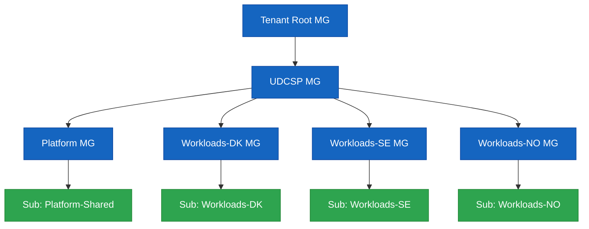

# UDCSP — Installation Guide

> **Audience.** Platform engineers and reviewers performing a clean install of the **Unified Digital Citizen Services Platform** on a sacrificial Microsoft Cloud tenant.
>
> **Outcome.** Every component referenced by [`architecture.md`](./architecture.md) provisioned in dependency order, smoke-tested, and ready to drive the 10 acceptance scenarios in [`recipe.md`](./recipe.md).

> [!TIP]
> **Storage architecture context.** Read [`data.md`](./data.md) before installing — it explains what each storage component is for and why it's needed (5 zones, retention matrix, GDPR + AI Act + ePrivacy compliance mapping).

This guide is split into **4 collapsible sections**. Click any ▶ to expand.

| Section | What it is | When to use |
|---|---|---|
| **🟦 A — Prerequisites** | Things you do **once** on your workstation and Microsoft Cloud tenants before touching the installer. | Day-1 setup. |
| **🟩 B — Mandatory install** | The **linear sequence** that takes a clean tenant to a fully running platform. **Run every step in order.** | Every install. |
| **🟨 C — Optional** | Things you can skip for a basic install (PSTN, evaluator HTML, conversational smoke, tear-down). | Demos & audits. |
| **🟪 D — Re-run / Troubleshooting** | How to re-deploy a single phase, fix common errors, read reports. | After code changes or failed runs. |

---

<details>
<summary><h2>🟦 A — PREREQUISITES (do this once)</h2></summary>

> Run the **A1 → A4** steps top-to-bottom on your workstation. Stop at the end of A4 — do **not** start the installer yet, that's section B.

<details>
<summary><b>A1. Install workstation tooling</b></summary>

The installer module phases call real CLIs. The bootstrap script installs **everything except** `az` (Azure CLI MSI) and `pac` (Power Platform CLI MSI):

```powershell
pwsh ./scripts/dev/Bootstrap-DevEnv.ps1
```

Then install the two MSIs manually if not already present:

| Tool | Mandatory? | Used by | Install |
|---|---|---|---|
| **PowerShell 7+** | ✅ Always | Orchestrator + every module | <https://learn.microsoft.com/en-us/powershell/scripting/install/installing-powershell> |
| **Azure CLI (`az`) 2.60+** | ✅ Always | LandingZone, Bastion, CIEM, Security, DDoS, BackupAsr, ConfidentialLedger, ChaosStudio, Observability, Postgres, Redis, ConfidentialCompute, VerifiedId, Identity, Apim, LogicApps, Purview, Voice | <https://learn.microsoft.com/en-us/cli/azure/install-azure-cli> + `az bicep upgrade` |
| **Power Platform CLI (`pac`)** | ⚠️ For D365 | D365 (solution import) | <https://learn.microsoft.com/en-us/power-platform/developer/cli/introduction> |
| `Microsoft.Graph` PowerShell SDK 2.x | ⚠️ For Graph phases | Identity, VerifiedId, CIEM, Priva | Auto-installed by Bootstrap-DevEnv.ps1 |
| Node.js 20 LTS + `npm` | ⚠️ For Apps | Apps (web build, mobile build) | Auto-installed by Bootstrap-DevEnv.ps1 |
| Static Web Apps CLI (`swa`) | ⚠️ For web deploy | Apps | Auto-installed by Bootstrap-DevEnv.ps1 |
| Expo EAS CLI (`eas`) | ⚠️ For mobile build | Apps | Auto-installed by Bootstrap-DevEnv.ps1 |
| Azure Functions Core Tools (`func`) v4 | ⚠️ For Logic Apps | LogicApps (workflow publish) | <https://learn.microsoft.com/en-us/azure/azure-functions/functions-run-local> |
| Python 3.11 | ⚠️ For synthetic data | SyntheticData (generators) | Auto-installed by Bootstrap-DevEnv.ps1 |
| Git 2.43+ | ✅ Always | Working copy of this repo | <https://git-scm.com> |

> Conditional tools that are missing produce a `[skip]` line during install — the rest of the run continues, so a partial install is always restartable later.

</details>

<details>
<summary><b>A2. Sign in to all control planes</b></summary>

```powershell
az login                                                # Azure
az account set --subscription <SharedPlatform-sub-id>   # default sub for shared deployments

Connect-MgGraph -Scopes "Application.ReadWrite.All",`
                        "Policy.ReadWrite.ConditionalAccess",`
                        "Policy.ReadWrite.PermissionGrant",`
                        "User.ReadWrite.All",`
                        "Directory.ReadWrite.All",`
                        "VerifiableCredential.Create.All",`
                        "PrivacyManagement.ReadWrite.All"

pac auth create --environment https://udcspdk.crm4.dynamics.com   # repeat for SE / NO
```

> The installer pre-flights `az login` once at the top and refuses to start a real install if you are not authenticated. `Connect-MgGraph` / `pac` / `npm` / `swa` / `eas` / `func` are checked lazily.

</details>

<details>
<summary><b>A3. Provision the Microsoft Cloud tenants & subscriptions</b></summary>

You need owner-level access to:

1. **Microsoft Entra tenant** (workforce) — for caseworker / SOC / DPO identities.
2. **Three Azure subscriptions** *(or three resource-group quotas in one subscription if running a demo)*, one per country — `udcsp-dk`, `udcsp-se`, `udcsp-no`.
3. **One shared Azure subscription** for cross-zone analytics & governance.
4. **Three D365 Customer Service environments** (one per country) — sandbox SKU is fine for the case study.
5. **Three Microsoft Entra External ID tenants** — `udcspdk.onmicrosoft.com`, `udcspse.onmicrosoft.com`, `udcspno.onmicrosoft.com` (or your own naming).
6. **Microsoft Foundry workspace** with model quota for the agents listed in `foundry/agents/`.

**Capacity** to deploy: APIM Premium (multi-region), Microsoft Fabric F-SKU per country, ACS, AI Foundry hub & projects, AI Speech, Document Intelligence, Sentinel, Defender for Cloud, Key Vault Premium, ADLS Gen2.

**Conversational data layer extras:**

| Requirement | Scope | Notes |
|---|---|---|
| Quota: 6 additional Storage accounts per environment | Azure subscription or country resource groups | 3 countries × 2 ADLS Gen2 (`udcspvox*` + `udcspeml*`) |
| Quota: 3 Azure AI Search services per environment | Azure subscription | One S1 service per country |
| Quota: 3 Event Hubs namespaces per environment | Azure subscription | One Standard namespace per country |
| Permission: Owner on the country resource group | Azure RBAC | Required for CMK linkage |
| Permission: Power Platform admin per Dataverse env | Power Platform | Required to install D365 solutions |

**Create the Power Platform environments now (the `D365` phase will fail if missing):**

```powershell
pac admin create --name UDCSP-DK --type Production --region europe   --currency DKK --language 1030
pac admin create --name UDCSP-SE --type Production --region 'sweden' --currency SEK --language 1053
pac admin create --name UDCSP-NO --type Production --region 'norway' --currency NOK --language 1044
```

Capture each environment URL for the next step (A4).

> **DNS + TLS.** The Front Door + APIM phases assume you own `udcsp.{dk,se,no}` (or your equivalent) and have delegated NS records. The installer provisions Front-Door-managed certificates for `*.udcsp.{dk,se,no}` but **cannot delegate DNS for you** — register zones first.
>
> **EU residency.** Workload regions MUST be in EU geography (`westeurope`, `northeurope`, `swedencentral`, `norwayeast`). The installer refuses non-EU regions.

</details>

<details>
<summary><b>A4. Configure <code>udcsp.config.psd1</code></b></summary>

```powershell
Copy-Item scripts/install/config/udcsp.config.template.psd1 scripts/install/config/udcsp.config.psd1
notepad scripts/install/config/udcsp.config.psd1
```

Fill the **mandatory** keys at minimum:

```powershell
@{
  TenantId      = '<entra-tenant-guid>'
  Environment   = 'prod'   # one of dev|test|preprod|prod
  Subscriptions = @{
    SharedPlatform = '<sub-guid>'
    DK             = '<sub-guid>'   # use the same GUID 4× for a single-sub demo
    SE             = '<sub-guid>'
    NO             = '<sub-guid>'
  }
  Regions = @{
    DK = 'northeurope'
    SE = 'swedencentral'
    NO = 'norwayeast'
  }
  ExternalIdTenants = @{
    DK = 'udcspdk.onmicrosoft.com'
    SE = 'udcspse.onmicrosoft.com'
    NO = 'udcspno.onmicrosoft.com'
  }
  D365EnvironmentUrls = @{
    DK = 'https://udcspdk.crm4.dynamics.com'
    SE = 'https://udcspse.crm4.dynamics.com'
    NO = 'https://udcspno.crm4.dynamics.com'
  }
  FoundryWorkspace = @{
    Subscription  = '<sub-guid>'
    ResourceGroup = 'udcsp-shared-foundry'
    Name          = 'udcsp-foundry'
    Region        = 'swedencentral'
  }
}
```

> **Leave the `Voice = @{ dk = ...; se = ...; no = ... }` block as placeholders.** It will be filled later in **B5** using values produced by the first install pass.

> **Secrets** (External ID signing keys, D365 application-user secrets, Foundry deployment keys) are fetched **just-in-time** from a bootstrap Key Vault — the installer's first task provisions that vault and prompts for any secret it cannot resolve.

✅ **Section A done.** Move on to section B.

</details>

</details>

---

<details>
<summary><h2>🟩 B — MANDATORY INSTALL (run in order)</h2></summary>

> **What "deploy" means here.** Every Install-* module in `scripts/install/modules/` invokes the **real** Azure CLI / `pac` / `npm` / `swa` / `eas` / `func` / MS Graph commands. There is no scaffold mode: when you run B3 you actually create resource groups, deploy Bicep, push container images, import D365 solutions, build the SPA, register Foundry agents, etc. Logs land in `scripts/install/reports/<runStamp>/install-<phase>.log`.

> **`-Environment dev` is recommended for the first run.** `prod` requires `-Force` and you must have run B1 + B2 successfully against `dev` first.

<details>
<summary><b>B1. Offline self-test (no Azure calls)</b></summary>

```powershell
pwsh ./scripts/install/Install-UDCSP.ps1 -TestOnly -Environment dev
```

Walks every phase's preconditions, configuration parsing and module wiring without touching Azure. **Expected output: `25/25 ✅`.** Fix any red line before continuing.

</details>

<details>
<summary><b>B2. WhatIf dry-run (Azure read-only plan)</b></summary>

```powershell
pwsh ./scripts/install/Install-UDCSP.ps1 -WhatIf -Environment dev
```

Shows every Bicep what-if and APIM/Logic Apps/D365 deployment plan without applying anything. **Mandatory before any `prod` install.**

</details>

<details>
<summary><b>B3. First-pass install (everything except Voice & QA)</b></summary>

```powershell
pwsh ./scripts/install/Install-UDCSP.ps1 -Environment dev -ExcludePhase Voice,QA
```

This runs **23 of the 25 phases** sequentially in dependency order, idempotent, with a coloured progress log and a JSON report under `scripts/install/reports/<timestamp>/`. We defer:

- **`Voice`** — its config block needs values produced by earlier phases (Container Apps env IDs, KV secret URIs, App Insights connection strings, D365 queue GUIDs). Configured in B5.
- **`QA`** — its smoke gate exercises the deployed Voice runtime; only green after Voice is up.

> **Expected duration:** ≈ 60–90 minutes on a clean tenant (APIM Premium cold start is the long pole at ≈ 45 min; the installer streams progress every 60 s).

> The full 25-phase DAG is detailed in **Appendix 1**.

</details>

<details>
<summary><b>B4. Harvest Voice outputs from B3</b></summary>

Read `scripts/install/reports/<runStamp>/install-report.json` and the Azure portal for each field below. **For the case-study demo, filling DK alone is enough.**

| Field in `Voice.<country>` | Source phase | Where to read it |
|---|---|---|
| `containerAppsEnvironmentId` | `LandingZone` | Resource ID of per-country Container Apps env |
| `userAssignedIdentityId` | `Identity` | Resource ID of per-country UAMI for the voice orchestrator |
| `image` | (manual) | `<acr>.azurecr.io/udcsp/voice-orchestrator:<tag>` — built from `apps/voice/call-automation/Dockerfile`, pushed to the ACR provisioned in `LandingZone` |
| `azureOpenAiAccountName`, `azureOpenAiEndpoint` | `Foundry` | Azure OpenAI resource hosting GPT-4o Realtime |
| `apimBaseUrl` | `Apim` | Public APIM gateway URL (e.g. `https://api.udcsp.dk`) |
| `cognitiveServicesEndpoint` | `Foundry` (or sibling Speech resource) | Cognitive Services / Speech endpoint for STT-fallback |
| `acsConnectionStringSecretUri`, `voiceClientSecretUri` | `LandingZone` (Key Vault) | Key Vault secret URIs |
| `voiceClientId` | `Identity` | Client ID of the App Registration with `voice-orchestrator` app role |
| `appInsightsConnectionString` | `Observability` | Per-country App Insights connection string |
| `publicHostname` | (DNS) | FQDN you point at the Container App (or default `*.azurecontainerapps.io`) |
| `d365TransferTargetId`, `d365VoiceQueueId` | `D365` | Power Apps maker portal → Customer Service admin centre → **Workstreams** → your voice workstream → **Queue** GUID + **Transfer target** GUID |
| `deadLetterStorageAccountId` | `LandingZone` | Storage account for Event Grid dead-lettering |
| `acsResourceName` | `Voice` (created on first-pass `-WhatIf`) | Pre-created by Voice Bicep before orchestrator deploy |
| `env`, `location`, `resourceGroup` | (config) | Plain values you choose |

</details>

<details>
<summary><b>B5. Configure the Voice block from first-pass outputs</b></summary>

Re-open `scripts/install/config/udcsp.config.psd1` and replace placeholders for at least one country (DK).

</details>

<details>
<summary><b>B6. Run the Voice phase</b></summary>

```powershell
pwsh ./scripts/install/Install-UDCSP.ps1 -Phase Voice -Environment dev
```

The DAG resolver re-includes Voice's prerequisites — every Bicep deploy is idempotent so this is safe and takes only seconds for already-up phases.

</details>

<details>
<summary><b>B7. Run the QA smoke gate</b></summary>

```powershell
pwsh ./scripts/install/Install-UDCSP.ps1 -Phase QA -Environment dev
```

A green QA gate prints the platform's URLs to console.

✅ **Section B done — the platform is fully running.** Move to section C if you need optional features, otherwise jump to [`recipe.md`](./recipe.md) for the 10 acceptance scenarios.

</details>

</details>

---

<details>
<summary><h2>🟨 C — OPTIONAL (only if you need them)</h2></summary>

<details>
<summary><b>C1. Bind a real PSTN number</b></summary>

Required only for the live voice demo in [`recipe.md`](./recipe.md) Scenario 2. After acquiring a Nordic toll-free or local number through ACS:

```powershell
pwsh apps/voice/scripts/Bind-AcsNumber.ps1 -Country dk -Env dev `
  -PhoneNumber +45XXXXXXXX -AcsResourceName udcsp-dk-acs `
  -ResourceGroup udcsp-dk-voice -OrchestratorFqdn voice-dk.udcsp.dk `
  -NumberType tollFree
```

The script overwrites the matching `placeholder: true` entry in `apps/voice/acs/phone-number-bindings.yaml` in-place, so the next `Install-Voice` run re-binds without operator action.

</details>

<details>
<summary><b>C2. Generate the evaluator HTML report</b></summary>

```powershell
pwsh ./scripts/install/Install-UDCSP.ps1 -Phase QA -SmokeOnly -EvaluatorMode
```

`-EvaluatorMode` writes `scripts/install/reports/<runStamp>/install-report.html` (single artefact for the case-study evaluator) in addition to the JSON report. The smoke kicks off:

1. `tests/e2e/tests/scenario-09-devops-installer.spec.ts` — installer reproducibility check.
2. `tests/eval/pipelines/nightly-classifier.yaml` — reduced sample.
3. `tests/accessibility/automated/axe-runner.spec.ts` — homepage axe scan.
4. `tests/load/k6/citizen-application-submit.k6.js` — short ramp.

</details>

<details>
<summary><b>C3. Conversational data smoke checks</b></summary>

- **SMS** — send a test SMS; verify it lands in the `sms_activity` Dataverse table and in the `acs-events/` ADLS container.
- **Voice** — make a test voice call; verify the `.wav` lands in `voice-recordings/` ADLS, the STT transcript is stored alongside it, and the dialog turn is emitted by the Foundry `topic-router` into App Insights traces.
- **Email** — send a test email with attachment; verify the body is in the `email_activity` Dataverse table and the attachment is in `email-attachments/` ADLS.
- **Foundry trace** — trigger a Foundry agent invocation; verify the trace is in App Insights and mirrored to OneLake Bronze.
- **Right-to-erasure** — `POST /privacy/erase/{test_citizen_id}`; verify deletion cascades across all 5 zones within 30 minutes in test mode.

</details>

<details>
<summary><b>C4. Tear-down</b></summary>

```powershell
pwsh ./scripts/cleanup/Remove-UDCSP.ps1 -Environment dev -Confirm
```

Removes every resource group tagged `costCenter=UDCSP` across all configured subscriptions, unregisters Purview sources tagged for the environment, and disables (does **not** delete) the Microsoft Entra app registrations tagged `udcsp-env-<env>`. External ID tenants are intentionally not deleted automatically — delete them manually from the Entra admin centre when no longer needed. Refuses to run against `prod` unless `-Force` is supplied.

</details>

</details>

---

<details>
<summary><h2>🟪 D — RE-RUN / TROUBLESHOOTING</h2></summary>

<details>
<summary><b>D1. Re-run a single phase (after a code change)</b></summary>

```powershell
pwsh ./scripts/install/Install-UDCSP.ps1 -Phase Foundry,D365,Apps -Environment dev
```

Each phase is idempotent — safe to re-run.

</details>

<details>
<summary><b>D2. Re-run an offline self-test for one phase</b></summary>

```powershell
pwsh ./scripts/install/Install-UDCSP.ps1 -TestOnly -Phase Foundry
```

</details>

<details>
<summary><b>D3. Run only the Voice orchestrator (after voice code change)</b></summary>

```powershell
pwsh ./scripts/install/Install-UDCSP.ps1 -Phase Voice -Environment dev `
  -ExcludePhase LandingZone,Identity,VerifiedId,Bastion,Ciem,Security,Ddos,BackupAsr,`
                ConfidentialLedger,ChaosStudio,Observability,Fabric,Postgres,Redis,`
                SyntheticData,Foundry,ConfidentialCompute,Apim,LogicApps,D365,Apps
```

</details>

<details>
<summary><b>D4. <code>-Environment prod</code> requires <code>-Force</code></b></summary>

```powershell
pwsh ./scripts/install/Install-UDCSP.ps1 -Environment prod -Force
```

Without `-Force`, a `prod` invocation prints a warning and exits without making any changes. `-WhatIf`, `-TestOnly`, and `-SmokeOnly` against `prod` do **not** require `-Force`.

</details>

<details>
<summary><b>D5. Common errors</b></summary>

| Symptom | Likely cause | Fix |
|---|---|---|
| Pre-flight aborts with `Azure CLI is not logged in` | `az login` not done in this shell | `az login` then `az account set --subscription <id>` |
| `Install-D365` fails with `pac: command not found` | Power Platform CLI missing | Install per **A1**, then `pac auth create --environment <env-url>` for each country |
| `Install-LogicApps` fails with `func: command not found` | Azure Functions Core Tools v4 missing | `npm i -g azure-functions-core-tools@4 --unsafe-perm true` |
| `Install-Apps` logs `[skip] swa CLI not found` / `[skip] eas CLI not found` | Static Web Apps / Expo CLIs missing | `npm i -g @azure/static-web-apps-cli eas-cli` then re-run `-Phase Apps` |
| `Install-Identity` / `VerifiedId` / `Ciem` / `Priva` log `[skip] Microsoft.Graph not connected` | `Connect-MgGraph` not run in current shell | Run the `Connect-MgGraph -Scopes …` from **A2**, then re-run the affected phase. Bicep parts of these phases run regardless. |
| `Install-Identity` fails on External ID user-flow upload | `TenantId` doesn't match the External ID tenant | Re-check the `ExternalIdTenants` block |
| `Install-Fabric` returns `403 CapacityNotFound` | Fabric F-SKU not provisioned in country region | Provision the capacity in Azure Portal → re-run `-Phase Fabric` |
| `Install-Foundry` fails on model deployment | Quota exhausted in the Foundry region | Request quota in Foundry portal or change region in config |
| `Install-Apim` slow on first run | Premium APIM cold start ≈ 45 minutes | Expected. Installer streams progress every 60 s. |

</details>

<details>
<summary><b>D6. Reading the install reports</b></summary>

Every run produces:

- `scripts/install/reports/<runStamp>/install-report.json` — machine-readable summary, phase-by-phase status + outputs.
- `scripts/install/reports/<runStamp>/install-<phase>.log` — full stdout/stderr/exit-code for every external CLI call in that phase.
- `scripts/install/reports/<runStamp>/install-report.html` — operator-friendly HTML, only when `-EvaluatorMode` is passed.

Grep tip:

```powershell
Select-String -Path scripts/install/reports/*/install-*.log -Pattern '\[ERROR\]|\[skip\]'
```

</details>

</details>

---

<details>
<summary><h2>📎 Appendix 1 — The 25 phases, in install order</h2></summary>

The installer declares this DAG at `scripts/install/Install-UDCSP.ps1:123-149` and refuses to run a phase whose prerequisites are missing.

| # | Phase | Module | What it deploys |
|--:|---|---|---|
| 1 | `LandingZone` | `Install-LandingZone.psm1` | MG hierarchy, RGs, networking, Key Vault, ACR, Storage |
| 2 | `Identity` | `Install-Identity.psm1` | External ID tenants, custom user flows, Microsoft Entra ID, Conditional Access, PIM |
| 3 | `VerifiedId` | `Install-VerifiedId.psm1` | Microsoft Entra Verified ID issuer + verifier (EUDI Wallet bridge, eIDAS 2.0) |
| 4 | `Bastion` | `Install-Bastion.psm1` | Azure Bastion Standard (per country) — sole admin shell ingress |
| 5 | `Ciem` | `Install-Ciem.psm1` | Microsoft Entra Permissions Management (CIEM) onboarding for the 3 sovereign tenants |
| 6 | `Security` | `Install-Security.psm1` | Defender for Cloud, Defender for APIs, Sentinel, Azure Policy, DPIA artefacts |
| 7 | `Ddos` | `Install-Ddos.psm1` | Azure DDoS Protection Standard plans + VNet associations |
| 8 | `BackupAsr` | `Install-BackupAsr.psm1` | Azure Backup vaults + policies + Azure Site Recovery (per country, geo-paired) |
| 9 | `ConfidentialLedger` | `Install-ConfidentialLedger.psm1` | Tamper-evident ledger for AI Act high-risk decisions (Art. 26(6)) |
| 10 | `ChaosStudio` | `Install-ChaosStudio.psm1` | Azure Chaos Studio targets + monthly experiments validating the 99.9 % SLO |
| 11 | `Observability` | `Install-Observability.psm1` | Log Analytics, App Insights, workbooks, alerts, correlation pipelines |
| 12 | `Fabric` | `Install-Fabric.psm1` | Capacities, workspaces, lakehouses, notebooks, semantic models, Power BI Premium reports |
| 13 | `Postgres` | `Install-Postgres.psm1` | PostgreSQL Flexible Server (per country) — replaces Azure SQL + Cosmos persistent workloads |
| 14 | `Redis` | `Install-Redis.psm1` | Azure Cache for Redis Enterprise (per country) — slot-filling + ephemeral state for the topic-router |
| 15 | `SyntheticData` | `Install-SyntheticData.psm1` | Generates and seeds personas, applications, conversations, eval datasets |
| 16 | `Foundry` | `Install-Foundry.psm1` | Hub & projects, agents (incl. **`topic-router`**), prompts, eval suites, Content Safety, AI Act registry |
| 17 | `ConfidentialCompute` | `Install-ConfidentialCompute.psm1` | Confidential Container Apps (TEE / SEV-SNP) for Eligibility Pre-Assessor inference |
| 18 | `Apim` | `Install-Apim.psm1` | APIM instance(s), products, APIs, policies, named values — incl. the single `agent-topic-router` facade used by chat **and** voice |
| 19 | `LogicApps` | `Install-LogicApps.psm1` | Standard workspaces, workflows, connections, Service Bus, Event Grid |
| 20 | `D365` | `Install-D365.psm1` | Solutions, BPFs, queues, SLAs, Copilot for Service, Power Automate. **Produces** `d365TransferTargetId` + `d365VoiceQueueId` consumed by Voice |
| 21 | `Apps` | `Install-Apps.psm1` | Static Web Apps + mobile builds + i18n catalogues; citizen insights via Chart.js |
| 22 | `Voice` | `Install-Voice.psm1` | ACS resource, GPT-4o Realtime deployment, voice orchestrator Container App, Event Grid `IncomingCall` subscription, IVR dialogs |
| 23 | `Purview` | `Install-Purview.psm1` | Account, sources, classifications, labels, DLP, sharing policies, Foundry agent custom-type lineage |
| 24 | `Priva` | `Install-Priva.psm1` | Microsoft Priva Privacy Management — DSR system of record + Risk Management policies |
| 25 | `QA` | `Install-QA.psm1` | Wires CI eval / E2E / security / conformance pipelines to GitHub Actions |

</details>

<details>
<summary><h2>📎 Appendix 2 — Topology you will install</h2></summary>



Each country sub gets its own landing zone, External ID tenant, Microsoft Fabric capacity, APIM region, Logic Apps workspace, D365 environment, ACS resource and Foundry project, plus the conversational data layer (PostgreSQL Flexible Server, Redis Enterprise, voice-recordings & email-attachments ADLS accounts, AI Search index, Event Hubs capture). Cross-zone analytics, governance and SOC tooling sit in the shared sub.

> **Demo simplification.** You can collapse all 4 subscriptions into a single sub by repeating the same GUID 4× in `Subscriptions`. The naming convention (`udcsp-{country}-{purpose}-rg`) keeps the country-level isolation visible.

</details>

<details>
<summary><h2>📎 Appendix 3 — Walk through the recipe (10 acceptance scenarios)</h2></summary>

```powershell
code ./docs/tech/recipe.md
```

The recipe exercises every layer of the platform — citizen voice call, web journey, mobile payslip OCR, caseworker triage, eligibility human-in-the-loop, DPO DSR, prompt-injection containment, executive workspace, DevOps reproducibility — and is the canonical proof that the platform satisfies the case study.

</details>
