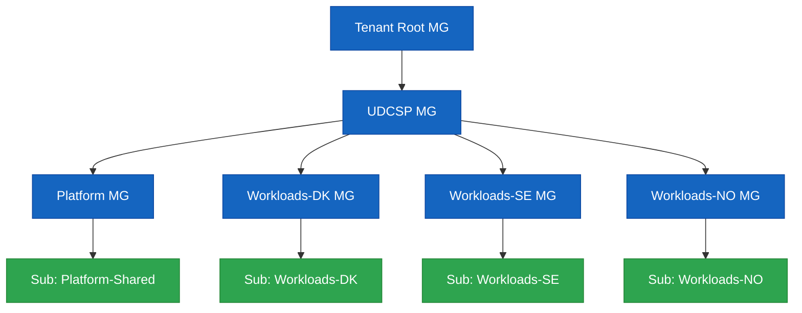

# UDCSP — Installation Guide

> **Audience.** Platform engineers and reviewers performing a clean install of the **Unified Digital Citizen Services Platform** on a sacrificial Microsoft Cloud tenant.
>
> **Outcome.** Every component referenced by [`architecture.md`](./architecture.md) provisioned in dependency order, smoke-tested, and ready to drive the 10 acceptance scenarios in [`recipe.md`](./recipe.md).

> [!TIP]
> **Storage architecture context.** Read [`data.md`](./data.md) before installing — it explains what each storage component is for and why it's needed (5 zones, retention matrix, GDPR + AI Act + ePrivacy compliance mapping).

The remainder of this document is organised in the **exact order an operator goes through** to take a clean tenant to a fully running platform. Each section is a step you finish before moving to the next:

1. [Topology you will install](#1-topology-you-will-install)
2. [Prepare the operator workstation](#2-prepare-the-operator-workstation)
3. [Prepare the Microsoft Cloud tenants](#3-prepare-the-microsoft-cloud-tenants)
4. [Configure the install (`udcsp.config.psd1`)](#4-configure-the-install-udcspconfigpsd1)
5. [Validate before deploying (`-TestOnly` then `-WhatIf`)](#5-validate-before-deploying)
6. [First-pass install (every phase except `Voice`)](#6-first-pass-install-every-phase-except-voice)
7. [Configure the `Voice` phase from first-pass outputs and re-run](#7-configure-the-voice-phase-from-first-pass-outputs-and-re-run)
8. [Optional — bind a real PSTN number](#8-optional--bind-a-real-pstn-number)
9. [Post-install validation (smoke + recipe)](#9-post-install-validation)
10. [Tear-down](#10-tear-down)
11. [Troubleshooting](#11-troubleshooting)

---

## 1. Topology you will install

The installer provisions **three sovereign country zones** (Denmark, Sweden, Norway) plus a **shared analytics + governance zone**, all under a unified management-group hierarchy.



Each country sub gets its own landing zone, External ID tenant, Microsoft Fabric capacity, APIM region, Logic Apps workspace, D365 environment, ACS resource and Foundry project, plus the conversational data layer (PostgreSQL Flexible Server, Redis Enterprise, voice-recordings & email-attachments ADLS accounts, AI Search index, Event Hubs capture). Cross-zone analytics, governance and SOC tooling sit in the shared sub.

---

## 2. Prepare the operator workstation

| Tool | Minimum | Notes |
|---|---|---|
| PowerShell | 7.4+ | Required by the installer |
| Azure CLI | 2.60+ | `az bicep upgrade` after install |
| Az PowerShell | 12.x | `Install-Module Az -Scope CurrentUser` |
| Microsoft.Graph PowerShell | 2.x | For Entra ID / Entra External ID automation |
| Power Platform CLI (`pac`) | latest | D365 solution import |
| Bicep | 0.27+ | Bundled by Azure CLI |
| Node.js | 20 LTS | For frontend & i18n tooling |
| Python | 3.11 | For synthetic-data generators |
| Git | 2.43+ | Working copy of this repo |

A single bootstrap script installs everything except Azure CLI and Power Platform CLI (those have their own MSIs):

```powershell
pwsh ./scripts/dev/Bootstrap-DevEnv.ps1
```

---

## 3. Prepare the Microsoft Cloud tenants

You need owner-level access to:

1. A **Microsoft Entra tenant** (workforce) — for caseworker / SOC / DPO identities.
2. **Three Azure subscriptions** (or three resource-group quotas in one subscription if running a demo), one per country — `udcsp-dk`, `udcsp-se`, `udcsp-no`.
3. **One shared Azure subscription** for cross-zone analytics & governance.
4. **Three D365 Customer Service environments** (one per country) — sandbox SKU is fine for the case study.
5. **Three Microsoft Entra External ID tenants** — `udcspdk.onmicrosoft.com`, `udcspse.onmicrosoft.com`, `udcspno.onmicrosoft.com` (or your own naming).
6. A **Microsoft Foundry workspace** with model quota for the agents listed in `foundry/agents/`.

**Capacity** to deploy: APIM Premium (multi-region), Microsoft Fabric F-SKU per country, ACS, AI Foundry hub & projects, AI Speech, Document Intelligence, Sentinel, Defender for Cloud, Key Vault Premium, ADLS Gen2.

Additional quota and permission checks for the conversational data layer:

| Requirement | Scope | Notes |
|---|---|---|
| Quota: 6 additional Storage accounts per environment | Azure subscription or country resource groups | 3 countries × 2 new ADLS Gen2 accounts: `udcspvox*` and `udcspeml*` |
| Quota: 3 Azure AI Search services per environment | Azure subscription | One S1 service per country for per-citizen conversational memory |
| Quota: 3 Event Hubs namespaces per environment | Azure subscription | One Standard namespace per country for ACS event capture |
| Permission: Owner on the country resource group | Azure RBAC | Required for CMK linkage between the new resources and the country Key Vault |
| Permission: Power Platform admin on each Dataverse environment | Power Platform | Required to install D365 solutions and enable the Foundry → Dataverse `bot_session` mirror table |

> **EU residency note.** Every workload region MUST be in EU geography (`westeurope`, `northeurope`, `swedencentral`, `norwayeast`). The installer refuses to deploy to non-EU regions.

---

## 4. Configure the install (`udcsp.config.psd1`)

The installer reads configuration from `scripts/install/config/udcsp.config.psd1`. Copy the template and fill in:

```powershell
Copy-Item scripts/install/config/udcsp.config.template.psd1 scripts/install/config/udcsp.config.psd1
notepad scripts/install/config/udcsp.config.psd1
```

Mandatory keys:

```powershell
@{
  TenantId                = '<entra-tenant-guid>'
  Subscriptions = @{
    SharedPlatform = '<sub-guid>'
    DK             = '<sub-guid>'
    SE             = '<sub-guid>'
    NO             = '<sub-guid>'
  }
  ExternalIdTenants = @{
    DK = 'udcspdk.onmicrosoft.com'
    SE = 'udcspse.onmicrosoft.com'
    NO = 'udcspno.onmicrosoft.com'
  }
  D365EnvironmentUrls = @{
    DK = 'https://udcspdk.crm4.dynamics.com'
    SE = 'https://udcspse.crm4.dynamics.com'
    NO = 'https://udcspno.crm4.dynamics.com'
  }
  FoundryWorkspace = @{
    Subscription  = '<sub-guid>'
    ResourceGroup = 'udcsp-shared-foundry'
    Name          = 'udcsp-foundry'
    Region        = 'swedencentral'
  }
  Environment = 'prod'   # one of dev|test|preprod|prod
  Regions = @{
    DK = 'northeurope'
    SE = 'swedencentral'
    NO = 'norwayeast'
  }
}
```

The `Voice = @{ dk = @{…}; se = @{…}; no = @{…} }` block ships **placeholders** — leave them as-is for now. They will be filled in [§ 7](#7-configure-the-voice-phase-from-first-pass-outputs-and-re-run), after the first install pass produces the Container Apps environment IDs, KV secret URIs, App Insights connection strings and D365 queue GUIDs the voice runtime needs.

Secrets (External ID signing keys, D365 application-user secrets, Foundry deployment keys) are fetched **just-in-time** from a bootstrap Key Vault — the installer's first task is to provision that vault under the shared platform subscription and prompt for any secret it cannot resolve.

---

## 5. Validate before deploying

### 5.1 Offline component self-test (no deployments)

Walk every phase's preconditions, configuration parsing and module wiring without touching Azure:

```powershell
pwsh ./scripts/install/Install-UDCSP.ps1 -TestOnly -Environment dev
```

A green run here means the config file parses, every module loads, every component is reachable, and every per-phase `Test-<Phase>` function passes — nothing has been deployed yet.

### 5.2 What-if (dry-run)

```powershell
pwsh ./scripts/install/Install-UDCSP.ps1 -WhatIf
```

Shows every Bicep what-if and APIM/Logic Apps/D365 deployment plan without applying anything. **Required before any `-Environment prod` install.**

### 5.3 Production runs require `-Force`

```powershell
pwsh ./scripts/install/Install-UDCSP.ps1 -Environment prod -Force
```

Without `-Force`, an `-Environment prod` invocation prints a warning and exits without making any changes. `-WhatIf`, `-TestOnly`, and `-SmokeOnly` against `prod` do **not** require `-Force`.

---

## 6. First-pass install (every phase except `Voice`)

The simplest and recommended path:

```powershell
pwsh ./scripts/install/Install-UDCSP.ps1 -Environment dev
```

This runs every phase sequentially in dependency order, idempotent, with a coloured progress log and a JSON report under `scripts/install/reports/<timestamp>/`. The Voice phase will execute against placeholder config and report the missing fields without failing the rest of the run; you'll fix it in [§ 7](#7-configure-the-voice-phase-from-first-pass-outputs-and-re-run).

If you prefer to stop just before Voice (so the missing fields are isolated in their own report):

```powershell
pwsh ./scripts/install/Install-UDCSP.ps1 -Phase D365 -Environment dev
```

Because the installer's DAG resolves prerequisites automatically, this single command runs **LandingZone → Identity → VerifiedId → … → D365** in order — every phase Voice depends on, plus everything D365 depends on.

### 6.1 The 25 phases, in install order

| # | Phase | Module | What it deploys |
|--:|---|---|---|
| 1 | `LandingZone` | `Install-LandingZone.psm1` | MG hierarchy, RGs, networking, Key Vault, ACR, Storage |
| 2 | `Identity` | `Install-Identity.psm1` | External ID tenants, custom user flows, Microsoft Entra ID, Conditional Access, PIM |
| 3 | `VerifiedId` | `Install-VerifiedId.psm1` | Microsoft Entra Verified ID issuer + verifier (EUDI Wallet bridge, eIDAS 2.0) |
| 4 | `Bastion` | `Install-Bastion.psm1` | Azure Bastion Standard (per country) — sole admin shell ingress |
| 5 | `Ciem` | `Install-Ciem.psm1` | Microsoft Entra Permissions Management (CIEM) onboarding for the 3 sovereign tenants |
| 6 | `Security` | `Install-Security.psm1` | Defender for Cloud, Defender for APIs, Sentinel, Azure Policy, DPIA artefacts |
| 7 | `Ddos` | `Install-Ddos.psm1` | Azure DDoS Protection Standard plans + VNet associations |
| 8 | `BackupAsr` | `Install-BackupAsr.psm1` | Azure Backup vaults + policies + Azure Site Recovery (per country, geo-paired) |
| 9 | `ConfidentialLedger` | `Install-ConfidentialLedger.psm1` | Tamper-evident ledger for AI Act high-risk decisions (Art. 26(6)) |
| 10 | `ChaosStudio` | `Install-ChaosStudio.psm1` | Azure Chaos Studio targets + monthly experiments validating the 99.9 % SLO |
| 11 | `Observability` | `Install-Observability.psm1` | Log Analytics, App Insights, workbooks, alerts, correlation pipelines |
| 12 | `Fabric` | `Install-Fabric.psm1` | Capacities, workspaces, lakehouses, notebooks, semantic models, Power BI Premium reports (`data/fabric/power-bi/`) |
| 13 | `Postgres` | `Install-Postgres.psm1` | PostgreSQL Flexible Server (per country) — replaces Azure SQL + Cosmos persistent workloads |
| 14 | `Redis` | `Install-Redis.psm1` | Azure Cache for Redis Enterprise (per country) — slot-filling + ephemeral state for the topic-router |
| 15 | `SyntheticData` | `Install-SyntheticData.psm1` | Generates and seeds personas, applications, conversations, eval datasets in `data/synthetic/` |
| 16 | `Foundry` | `Install-Foundry.psm1` | Hub & projects, agents (incl. **`topic-router`** which absorbs Copilot Studio), prompts, eval suites, Content Safety, AI Act registry, App Insights / Dataverse `bot_session` mirror |
| 17 | `ConfidentialCompute` | `Install-ConfidentialCompute.psm1` | Confidential Container Apps (TEE / SEV-SNP) for Eligibility Pre-Assessor inference |
| 18 | `Apim` | `Install-Apim.psm1` | APIM instance(s), products, APIs, policies, named values — incl. the single `agent-topic-router` facade used by chat **and** voice |
| 19 | `LogicApps` | `Install-LogicApps.psm1` | Standard workspaces, workflows, connections, Service Bus, Event Grid |
| 20 | `D365` | `Install-D365.psm1` | Solutions, BPFs, queues, SLAs, Copilot for Service, Power Automate. **Produces** `d365TransferTargetId` and `d365VoiceQueueId` consumed by the Voice phase in [§ 7](#7-configure-the-voice-phase-from-first-pass-outputs-and-re-run). |
| 21 | `Apps` | `Install-Apps.psm1` | Static Web Apps + mobile builds + i18n catalogues; citizen insights via Chart.js components in `apps/web/src/components/insights/` |
| 22 | `Voice` | `Install-Voice.psm1` | ACS resource (per country), GPT-4o Realtime deployment, voice orchestrator Container App (`apps/voice/call-automation/Dockerfile` → ACR push → `Deploy-Voice.ps1`), Event Grid `IncomingCall` subscription, IVR dialogs. **Requires the Voice config block from [§ 7](#7-configure-the-voice-phase-from-first-pass-outputs-and-re-run) to fully succeed.** |
| 23 | `Purview` | `Install-Purview.psm1` | Account, sources, classifications, labels, DLP, sharing policies, Foundry agent custom-type lineage |
| 24 | `Priva` | `Install-Priva.psm1` | Microsoft Priva Privacy Management — DSR system of record + Risk Management policies, wired to the GDPR Logic Apps |
| 25 | `QA` | `Install-QA.psm1` | Wires CI eval / E2E / security / conformance pipelines to GitHub Actions |

> The installer declares this DAG at `scripts/install/Install-UDCSP.ps1:99-125` and refuses to run a phase whose prerequisites are missing.

### 6.2 Re-running a single phase

```powershell
pwsh ./scripts/install/Install-UDCSP.ps1 -Phase Foundry,D365,Apps -Environment dev
```

Useful after a code change. Each module also exposes a `Test-<Phase>` function for offline validation:

```powershell
pwsh ./scripts/install/Install-UDCSP.ps1 -TestOnly -Phase Foundry
```

---

## 7. Configure the `Voice` phase from first-pass outputs and re-run

The voice runtime (`apps/voice/call-automation/`) is the only phase that reads a deeply per-country block from `udcsp.config.psd1`. Most fields are produced by **earlier phases**, hence the two-pass workflow.

### 7.1 Harvest first-pass outputs

Read `scripts/install/reports/<runStamp>/install-report.json` and the Azure portal for each field below. For the case-study demo, filling **DK** alone is enough.

| Field in `Voice.<country>` | Source phase | Where to read it |
|---|---|---|
| `containerAppsEnvironmentId` | `LandingZone` | Resource ID of the per-country Container Apps env |
| `userAssignedIdentityId` | `Identity` | Resource ID of the per-country UAMI created for the voice orchestrator |
| `image` | (manual) | `<acr>.azurecr.io/udcsp/voice-orchestrator:<tag>` — built from `apps/voice/call-automation/Dockerfile`, pushed to the ACR provisioned in `LandingZone` |
| `azureOpenAiAccountName`, `azureOpenAiEndpoint` | `Foundry` | Azure OpenAI resource hosting the GPT-4o Realtime deployment |
| `apimBaseUrl` | `Apim` | Public APIM gateway URL (e.g. `https://api.udcsp.dk`) |
| `cognitiveServicesEndpoint` | `Foundry` (or a sibling Speech resource) | Cognitive Services / Speech endpoint for STT-fallback |
| `acsConnectionStringSecretUri`, `voiceClientSecretUri` | `LandingZone` (Key Vault) | Key Vault secret URIs (the secrets themselves are seeded by the bootstrap KV step) |
| `voiceClientId` | `Identity` | Client ID of the App Registration with the `voice-orchestrator` app role |
| `appInsightsConnectionString` | `Observability` | Connection string of the per-country App Insights component |
| `publicHostname` | (DNS) | FQDN you point at the Container App (or use the default `*.azurecontainerapps.io`) |
| `d365TransferTargetId`, `d365VoiceQueueId` | `D365` | Power Apps maker portal → Customer Service admin centre → **Workstreams** → your voice workstream → **Queue** GUID + **Transfer target** GUID. See [`docs/biz/voice.md`](../biz/voice.md) §10 for the click-path. |
| `deadLetterStorageAccountId` | `LandingZone` | Resource ID of the storage account used for Event Grid dead-lettering |
| `acsResourceName` | `Voice` (created on first pass `-WhatIf`) | Name of the per-country ACS resource — pre-created by the Voice Bicep before the orchestrator is deployed |
| `env`, `location`, `resourceGroup` | (config) | Plain values you choose |

### 7.2 Edit the config file

Open `scripts/install/config/udcsp.config.psd1` and replace the placeholders for at least one country.

### 7.3 Re-run the Voice phase only

```powershell
pwsh ./scripts/install/Install-UDCSP.ps1 -Phase Voice -Environment dev
```

The DAG check confirms Voice's prerequisites (`LogicApps`, `Foundry`) are already up; it skips them and only deploys the voice runtime + replays bindings from `apps/voice/acs/phone-number-bindings.yaml`.

> **Why not auto-resolve?** The installer is intentionally agnostic to your tenant naming and DNS strategy. The two-pass workflow keeps the config file declarative and re-runnable on any tenant.

---

## 8. Optional — bind a real PSTN number

Required only for the live voice demo in [`recipe.md`](./recipe.md) Scenario 2. After acquiring a Nordic toll-free or local number through ACS:

```powershell
pwsh apps/voice/scripts/Bind-AcsNumber.ps1 -Country dk -Env dev `
  -PhoneNumber +45XXXXXXXX -AcsResourceName udcsp-dk-acs `
  -ResourceGroup udcsp-dk-voice -OrchestratorFqdn voice-dk.udcsp.dk `
  -NumberType tollFree
```

The script overwrites the matching `placeholder: true` entry in `apps/voice/acs/phone-number-bindings.yaml` in-place, so the next `Install-Voice` run re-binds without operator action.

---

## 9. Post-install validation

### 9.1 Smoke + evaluator HTML report

```powershell
pwsh ./scripts/install/Install-UDCSP.ps1 -Phase QA -SmokeOnly -EvaluatorMode
```

`-EvaluatorMode` writes `scripts/install/reports/<runStamp>/install-report.html` in addition to the JSON report — this is the single artefact the case-study evaluator opens.

The QA phase smoke kicks off:

1. `tests/e2e/tests/scenario-09-devops-installer.spec.ts` — installer reproducibility check.
2. `tests/eval/pipelines/nightly-classifier.yaml` — reduced sample.
3. `tests/accessibility/automated/axe-runner.spec.ts` — homepage axe scan.
4. `tests/load/k6/citizen-application-submit.k6.js` — short ramp.

A **green** smoke gate prints the platform's URLs to console.

### 9.2 Walk through the recipe (10 acceptance scenarios)

```powershell
code ./docs/tech/recipe.md
```

The recipe exercises every layer of the platform — citizen voice call, web journey, mobile payslip OCR, caseworker triage, eligibility human-in-the-loop, DPO DSR, prompt-injection containment, executive workspace, DevOps reproducibility — and is the canonical proof that the platform satisfies the case study.

### 9.3 Conversational data smoke checks

Add these to your post-install checklist:

- **SMS** — send a test SMS via the platform; verify it lands in the `sms_activity` Dataverse table and in the `acs-events/` ADLS container.
- **Voice** — make a test voice call; verify the `.wav` lands in the `voice-recordings/` ADLS account, the STT transcript is stored alongside it, and the dialog turn is emitted by the Foundry `topic-router` into App Insights traces (mirrored nightly to the Dataverse `bot_session` table).
- **Email** — send a test email with attachment; verify the body is in the `email_activity` Dataverse table and the attachment is in the `email-attachments/` ADLS account, not in Dataverse.
- **Foundry trace** — trigger a Foundry agent invocation; verify the trace is in App Insights and mirrored to OneLake Bronze.
- **Right-to-erasure** — `POST /privacy/erase/{test_citizen_id}`; verify deletion cascades across all 5 zones within 30 minutes in test mode.

---

## 10. Tear-down

```powershell
pwsh ./scripts/cleanup/Remove-UDCSP.ps1 -Environment dev -Confirm
```

Removes every resource group tagged `costCenter=UDCSP` across all configured subscriptions, deletes External ID tenants flagged disposable, and unregisters Purview sources. Refuses to run against `prod` unless `-Force` is supplied.

---

## 11. Troubleshooting

| Symptom | Likely cause | Fix |
|---|---|---|
| `Install-Identity` fails on External ID user-flow upload | `TenantId` in config doesn't match the External ID tenant | Re-check the `ExternalIdTenants` block; the installer will attempt with the right tenant when corrected |
| `Install-Fabric` returns `403 CapacityNotFound` | Fabric F-SKU not provisioned in the country region | Provision the capacity in Azure Portal → re-run with `-Phase Fabric` |
| `Install-Foundry` fails on model deployment | Quota exhausted in the Foundry region | Request quota in Foundry portal or change region in config |
| `Install-Apim` slow on first run | Premium APIM cold start ≈ 45 minutes | Expected. The installer streams progress every 60 s. |
| `Install-Voice` complains about missing fields | First-pass outputs not yet harvested into the `Voice = @{ … }` block | Follow [§ 7](#7-configure-the-voice-phase-from-first-pass-outputs-and-re-run) then re-run `-Phase Voice` |
| Cross-border test fails (DK→SE) | Identity bridge claim mapping wrong | Re-deploy `infra/identity/external-id/user-flows/eidas-claims-extension.json` (External ID custom-authentication extension) and re-run scenario 01 |
| `Test-Observability` reports broken trace | Correlation header dropped at APIM | Verify `services/apim/policies/correlation-id.xml` is attached to all APIs |

Reports for every run are written under `scripts/install/reports/<timestamp>/install-report.json` and include the exact phase, status, duration, error stack and remediation hint.

---

> Need clarification on what a phase deploys and why? See [`architecture.md`](./architecture.md) (per-section deep dive) and [`data.md`](./data.md) (storage zones, retention, compliance).
