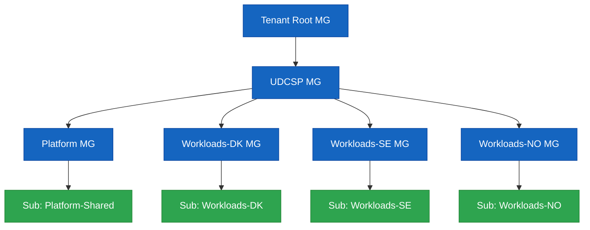

# UDCSP — Installation Guide

> **Audience:** platform engineers and reviewers performing a clean install of the **Unified Digital Citizen Services Platform** on a sacrificial Microsoft Cloud tenant.
>
> **Goal:** stand up every component referenced by [`architecture.md`](./architecture.md) and validated by [`recipe.md`](./recipe.md) in a single guided session.

> [!TIP]
> **Storage architecture context.** Before installing, understand what each storage component is for and why it's needed: read [`data.md`](./data.md) for the full storage zone breakdown, retention matrix, and compliance article-by-article mapping.

---

## 1. Topology installed

The installer provisions **three sovereign country zones** (Denmark, Sweden, Norway) plus a **shared analytics zone**, all under a unified management-group hierarchy.



Each country sub gets its own landing zone, External ID tenant, Fabric capacity, APIM region, Logic Apps workspace, D365 environment, ACS resource and Foundry project. Cross-zone analytics, governance and SOC tooling sit in the shared sub.

Country-scoped provisioning also includes the conversational data layer introduced by [`data.md`](./data.md) §§3.2-3.4:

- `udcspvox{country}{env}` — Storage account for `voice-recordings/` (StorageV2, ADLS Gen2 hierarchical namespace ON, GZRS, CMK from the country Key Vault, immutability policy enabled, lifecycle auto-purge at 90 days).
- `udcspeml{country}{env}` — Storage account for `email-attachments/` (same StorageV2/ADLS Gen2/GZRS/CMK/immutability baseline; lifecycle retention is driven by the `case-closed + 90 days` event).
- `udcspsearch{country}{env}` — Azure AI Search Standard S1 service with 3 replicas, 1 partition, semantic ranker enabled and CMK from the country Key Vault; used as the per-citizen conversational memory vector store.
- `udcspevh{country}{env}` — Azure Event Hubs Standard namespace with 4 throughput units and capture enabled to existing `udcspadls{country}{env}` storage in the `acs-events/` container for ACS SMS, Email and Voice events.
- `udcsppg{country}{env}` — Azure Database for PostgreSQL Flexible Server (post-audit refactor) with CMK + private endpoint + zone-redundant HA + GZRS backups.
- `udcspredis{country}{env}` — Azure Cache for Redis (Enterprise SKU, post-audit refactor) with CMK + private endpoint, holding the topic-router slot-filling state and ephemeral autosaves.
- Foundry topic-router transcript persistence — the post-audit refactor folds the conversational orchestration into the **Foundry `topic-router` agent**; transcripts are emitted by Foundry tracing into Application Insights and mirrored to a Dataverse `bot_session` table by the `Install-Foundry` phase. No Power Platform admin action is required (Copilot Studio has been removed).

Required Bicep module coverage: country-looped modules for `voice-recordings` storage, `email-attachments` storage, AI Search memory, Event Hubs capture, the `acs-events/` container on the existing ADLS account, **PostgreSQL Flexible Server** (`infra/data/postgresql/`), **Azure Cache for Redis** (`infra/data/redis/`), **Confidential Ledger** (`infra/security/confidential-ledger/`), **Confidential Container Apps** (`infra/security/confidential-compute/`), **DDoS Protection plans** (`infra/security/ddos/`), **Backup vaults + Site Recovery** (`infra/security/backup-asr/`), **Chaos Studio** (`infra/security/chaos-studio/`), **Defender for APIs** (`infra/security/defender/`), **Verified ID** (`infra/identity/verified-id/`), **Bastion** (`infra/identity/bastion/`) and **CIEM onboarding** (`infra/identity/ciem/`). The post-audit refactor removes the Cosmos DB and Azure SQL modules entirely, plus the standalone Copilot Studio admin step.

---

## 2. Prerequisites

### 2.1 Tooling on the operator workstation

| Tool | Minimum | Notes |
|---|---|---|
| PowerShell | 7.4+ | Required by the installer |
| Azure CLI | 2.60+ | `az bicep upgrade` after install |
| Az PowerShell | 12.x | `Install-Module Az -Scope CurrentUser` |
| Microsoft.Graph PowerShell | 2.x | For Entra ID / Entra External ID automation |
| Power Platform CLI (`pac`) | latest | D365 solution import |
| Bicep | 0.27+ | Bundled by az CLI |
| Node.js | 20 LTS | For frontend & i18n tooling |
| Python | 3.11 | For synthetic-data generators |
| Git | 2.43+ | Working copy of this repo |

A single bootstrap script installs everything except Azure CLI and Power Platform CLI:

```powershell
pwsh ./scripts/dev/Bootstrap-DevEnv.ps1
```

### 2.2 Cloud prerequisites

You need owner-level access to:

1. A **Microsoft Entra tenant** (workforce) — for caseworker / SOC / DPO identities.
2. **Three Azure subscriptions** (or three resource-group quotas in one subscription if running a demo), one per country — `udcsp-dk`, `udcsp-se`, `udcsp-no`.
3. **One shared Azure subscription** for cross-zone analytics & governance.
4. **Capacity** to deploy: APIM Premium (multi-region), Microsoft Fabric F-SKU per country, ACS, AI Foundry hub & projects, AI Speech, Document Intelligence, Sentinel, Defender for Cloud, Key Vault Premium, ADLS Gen2.
5. **Three D365 Customer Service environments** (one per country) — sandbox SKU is fine for the case study.
6. **Three Microsoft Entra External ID tenants** — `udcspdk.onmicrosoft.com`, `udcspse.onmicrosoft.com`, `udcspno.onmicrosoft.com` (or your own naming).
7. A **Microsoft Foundry workspace** with model quota for the agents listed in `foundry/agents/`.

Additional quota and permission checks for the conversational data layer:

| Requirement | Scope | Notes |
|---|---|---|
| Quota: 6 additional Storage accounts per environment | Azure subscription or country resource groups | 3 countries x 2 new ADLS Gen2 accounts: `udcspvox*` and `udcspeml*` |
| Quota: 3 Azure AI Search services per environment | Azure subscription | One S1 service per country for per-citizen conversational memory |
| Quota: 3 Event Hubs namespaces per environment | Azure subscription | One Standard namespace per country for ACS event capture |
| Permission: Owner on the country resource group | Azure RBAC | Required for CMK linkage between the new resources and the country Key Vault |
| Permission: Power Platform admin on each Dataverse environment | Power Platform | Required to install D365 solutions and enable the Foundry → Dataverse `bot_session` mirror table |

> **EU residency note:** every workload region MUST be in EU geography (`westeurope`, `northeurope`, `swedencentral`). The installer refuses to deploy to non-EU regions.

### 2.3 Secrets & configuration

The installer reads configuration from `scripts/install/config/udcsp.config.psd1`. Copy the template and fill in:

```powershell
Copy-Item scripts/install/config/udcsp.config.template.psd1 scripts/install/config/udcsp.config.psd1
notepad scripts/install/config/udcsp.config.psd1
```

Mandatory keys:

```powershell
@{
  TenantId                = '<entra-tenant-guid>'
  Subscriptions = @{
    SharedPlatform = '<sub-guid>'
    DK             = '<sub-guid>'
    SE             = '<sub-guid>'
    NO             = '<sub-guid>'
  }
  ExternalIdTenants = @{
    DK = 'udcspdk.onmicrosoft.com'
    SE = 'udcspse.onmicrosoft.com'
    NO = 'udcspno.onmicrosoft.com'
  }
  D365EnvironmentUrls = @{
    DK = 'https://udcspdk.crm4.dynamics.com'
    SE = 'https://udcspse.crm4.dynamics.com'
    NO = 'https://udcspno.crm4.dynamics.com'
  }
  FoundryWorkspace = @{
    Subscription = '<sub-guid>'
    ResourceGroup = 'udcsp-shared-foundry'
    Name = 'udcsp-foundry'
    Region = 'swedencentral'
  }
  Environment   = 'prod'   # one of dev|test|preprod|prod
  Regions = @{
    DK = 'northeurope'
    SE = 'swedencentral'
    NO = 'norwayeast'
  }
}
```

Secrets (External ID signing keys, D365 application-user secrets, Foundry deployment keys) are fetched **just-in-time** from a bootstrap Key Vault — the installer's first task is to provision that vault under the shared platform subscription and prompt for any secret it cannot resolve.

### 2.4 Voice block placeholders & dependency-order workflow

The post-audit voice runtime (`apps/voice/call-automation/`) is the only phase that reads a deeply per-country block from `udcsp.config.psd1`. The template (`scripts/install/config/udcsp.config.template.psd1`, `Voice = @{ dk = @{…}; se = @{…}; no = @{…} }`) ships **placeholders** for 19 fields per country. Most of those fields are produced by *earlier* phases of the same installer, so the operator workflow is necessarily iterative:

1. **First pass — leave Voice placeholders as-is.** Run the installer up to but **not** including Voice:
   ```powershell
   pwsh ./scripts/install/Install-UDCSP.ps1 -Phase D365 -Environment dev
   ```
   Because `Resolve-Phases` walks the DAG, this single command runs LandingZone → Identity → … → D365 in dependency order (everything Voice depends on, plus everything D365 depends on).
2. **Harvest outputs** from `scripts/install/reports/<runStamp>/install-report.json` and from the Azure portal:
   | Field in `Voice.<country>` | Source phase | Where to read it |
   |---|---|---|
   | `containerAppsEnvironmentId` | `LandingZone` | Resource ID of the per-country Container Apps env |
   | `userAssignedIdentityId` | `Identity` | Resource ID of the per-country UAMI created for the voice orchestrator |
   | `image` | (manual) | `<acr>.azurecr.io/udcsp/voice-orchestrator:<tag>` — built from `apps/voice/call-automation/Dockerfile`, pushed to the ACR provisioned in `LandingZone` |
   | `azureOpenAiAccountName`, `azureOpenAiEndpoint` | `Foundry` | Azure OpenAI resource hosting the GPT-4o Realtime deployment |
   | `apimBaseUrl` | `Apim` | Public APIM gateway URL (e.g. `https://api.udcsp.dk`) |
   | `cognitiveServicesEndpoint` | `Foundry` (or a sibling Speech resource) | Cognitive Services / Speech endpoint for STT-fallback |
   | `acsConnectionStringSecretUri`, `voiceClientSecretUri` | `LandingZone` (Key Vault) | Key Vault secret URIs (the secrets themselves are seeded by the bootstrap KV step) |
   | `voiceClientId` | `Identity` | Client ID of the App Registration with the `voice-orchestrator` app role |
   | `appInsightsConnectionString` | `Observability` | Connection string of the per-country App Insights component |
   | `publicHostname` | (DNS) | FQDN you point at the Container App (or use the default `*.azurecontainerapps.io`) |
   | `d365TransferTargetId`, `d365VoiceQueueId` | `D365` | Power Apps maker portal → Customer Service admin centre → **Workstreams** → your voice workstream → **Queue** GUID + **Transfer target** GUID. See `docs/biz/voice.md` §10 for the click-path. |
   | `deadLetterStorageAccountId` | `LandingZone` | Resource ID of the storage account used for Event Grid dead-lettering |
   | `acsResourceName` | `Voice` (created on first pass `-WhatIf`) | Name of the per-country ACS resource — pre-created by the Voice Bicep before the orchestrator is deployed |
   | `env`, `location`, `resourceGroup` | (config) | Plain values you choose |
3. **Edit `udcsp.config.psd1`** — replace the placeholders for at least one country (DK is recommended for the case-study demo).
4. **Second pass — run only the Voice phase**:
   ```powershell
   pwsh ./scripts/install/Install-UDCSP.ps1 -Phase Voice -Environment dev
   ```
   The DAG check confirms Voice's prerequisites (`LogicApps`, `Foundry`) are already up; it skips them and only deploys the voice runtime + replays bindings from `apps/voice/acs/phone-number-bindings.yaml`.
5. **Bind a real PSTN number** (optional, required only for the live voice demo in `recipe.md` Scenario 2):
   ```powershell
   pwsh apps/voice/scripts/Bind-AcsNumber.ps1 -Country dk -Env dev `
     -PhoneNumber +45XXXXXXXX -AcsResourceName udcsp-dk-acs `
     -ResourceGroup udcsp-dk-voice -OrchestratorFqdn voice-dk.udcsp.dk `
     -NumberType tollFree
   ```
   The script overwrites the matching `placeholder: true` entry in `apps/voice/acs/phone-number-bindings.yaml` in-place, so the next `Install-Voice` run re-binds without operator action.

> **Why not auto-resolve?** The installer is intentionally agnostic to your tenant naming and DNS strategy. The two-pass workflow keeps the config file declarative and re-runnable on any tenant.

---

## 3. Install paths

There are three ways to run the installer:

### 3.1 Full one-shot install

```powershell
pwsh ./scripts/install/Install-UDCSP.ps1 -Environment prod
```

Runs every phase sequentially, idempotent, with a coloured progress log and a JSON report under `scripts/install/reports/<timestamp>/`.

### 3.2 Phase-only install

```powershell
pwsh ./scripts/install/Install-UDCSP.ps1 -Phase Foundry,D365,Apps
```

Useful when re-deploying a subset after a code change. Each phase is independently testable (see §5).

### 3.3 What-if (dry-run)

```powershell
pwsh ./scripts/install/Install-UDCSP.ps1 -WhatIf
```

Shows every Bicep what-if and APIM/Logic Apps/D365 deployment plan without applying anything. Required before any prod install.

### 3.4 Component self-tests + smoke + evaluator HTML report

```powershell
# Quick component self-test of every phase (no deployments).
pwsh ./scripts/install/Install-UDCSP.ps1 -TestOnly -Environment dev

# Cross-cutting smoke suite (e2e + eval + accessibility + load) and
# generate the single HTML artefact attached to the case-study deliverable.
pwsh ./scripts/install/Install-UDCSP.ps1 -Phase QA -SmokeOnly -EvaluatorMode
```

`-EvaluatorMode` writes `scripts/install/reports/<runStamp>/install-report.html` in addition to the JSON report. This is the single artefact the case-study evaluator opens.

### 3.5 Production install requires `-Force`

```powershell
pwsh ./scripts/install/Install-UDCSP.ps1 -Environment prod -Force
```

Without `-Force`, an `-Environment prod` invocation prints a warning and exits without making any changes (`scripts/install/Install-UDCSP.ps1:262-265`). `-WhatIf`, `-TestOnly`, and `-SmokeOnly` against `prod` do **not** require `-Force`.

---

## 4. Phases & ordering

The installer respects the wave dependencies declared in `plan.md`:

```mermaid
graph LR
  W0[W0 LandingZone]:::p --> W1
  subgraph W1[W1 Platform Horizontals - 14 phases]
    direction TB
    Identity:::p
    VerifiedId:::n
    Bastion:::n
    Ciem:::n
    Security:::p
    Ddos:::n
    BackupAsr:::n
    ConfidentialLedger:::n
    ChaosStudio:::n
    Observability:::p
    Fabric:::p
    Postgres:::n
    Redis:::n
    SyntheticData:::p
  end
  W1 --> W2
  subgraph W2[W2 Service Backbone - 5 phases]
    direction TB
    Foundry:::p
    ConfidentialCompute:::n
    Apim:::p
    LogicApps:::p
    D365:::p
  end
  W2 --> W3
  subgraph W3[W3 Channels - 2 phases]
    direction TB
    Apps:::p
    Voice:::p
  end
  W3 --> W4
  subgraph W4[W4 Governance and Acceptance - 3 phases]
    direction TB
    Purview:::p
    Priva:::n
    QA:::p
  end
  classDef p fill:#1565c0,stroke:#0d47a1,color:#fff
  classDef n fill:#2ea44f,stroke:#238636,color:#fff
```



> Blue nodes are the original 14 phases; green nodes are the 11 phases added by the post-audit refactor (`plan_post_audit.md`). **Total: 25 phases.** The legacy `CopilotStudio` phase was removed (its functionality was folded into `Foundry` via the `topic-router` agent).

Phase names accepted by `-Phase`, listed **in the dependency-respecting order the installer applies** (matches the DAG declared at `scripts/install/Install-UDCSP.ps1:99-124`):

| Wave | Phase | Module | Owner WP | What it installs |
|:-:|---|---|---|---|
| W0 | `LandingZone` | `Install-LandingZone.psm1` | A1 | MG hierarchy, RGs, networking, Key Vault, ACR, Storage |
| W1 | `Identity` | `Install-Identity.psm1` | A2 | External ID tenants, custom user flows, Microsoft Entra ID, CA, PIM |
| W1 | `VerifiedId` *(post-audit)* | `Install-VerifiedId.psm1` | A2 | Microsoft Entra Verified ID issuer + verifier (EUDI Wallet bridge) |
| W1 | `Bastion` *(post-audit)* | `Install-Bastion.psm1` | A2, A3 | Azure Bastion Standard (per country) — sole admin shell ingress |
| W1 | `Ciem` *(post-audit)* | `Install-Ciem.psm1` | A2, A3 | Microsoft Entra Permissions Management (CIEM) onboarding for the 3 sovereign tenants |
| W1 | `Security` | `Install-Security.psm1` | A3 | Defender for Cloud, Sentinel, Azure Policy, DPIA artefacts |
| W1 | `Ddos` *(post-audit)* | `Install-Ddos.psm1` | A1, A3 | Azure DDoS Protection Standard plans + VNet associations |
| W1 | `BackupAsr` *(post-audit)* | `Install-BackupAsr.psm1` | A3 | Azure Backup vaults + policies + Azure Site Recovery (per country, geo-paired) |
| W1 | `ConfidentialLedger` *(post-audit)* | `Install-ConfidentialLedger.psm1` | A3 | Tamper-evident ledger for AI Act high-risk decisions |
| W1 | `ChaosStudio` *(post-audit)* | `Install-ChaosStudio.psm1` | A3, A14 | Azure Chaos Studio targets + monthly experiments validating the 99.9 % SLO |
| W1 | `Observability` | `Install-Observability.psm1` | A5 | Log Analytics, App Insights, workbooks, alerts |
| W1 | `Fabric` | `Install-Fabric.psm1` | A4 | Capacities, workspaces, lakehouses, notebooks, semantic models, Power BI Premium reports (`data/fabric/power-bi/`) |
| W1 | `Postgres` *(post-audit)* | `Install-Postgres.psm1` | A4 | PostgreSQL Flexible Server (per country) — replaces Azure SQL + Cosmos persistent workloads |
| W1 | `Redis` *(post-audit)* | `Install-Redis.psm1` | A4 | Azure Cache for Redis (per country) — replaces Cosmos ephemeral workloads |
| W1 | `SyntheticData` | `Install-SyntheticData.psm1` | A15 | Generates and seeds personas, applications, conversations, eval datasets in `data/synthetic/` |
| W2 | `Foundry` | `Install-Foundry.psm1` | A6 | Hub & projects, agents (incl. **`topic-router`** which absorbs Copilot Studio), prompts, eval suites, Content Safety, AI Act registry |
| W2 | `ConfidentialCompute` *(post-audit)* | `Install-ConfidentialCompute.psm1` | A3, A6 | Confidential Container Apps (TEE) for Eligibility Pre-Assessor inference |
| W2 | `Apim` | `Install-Apim.psm1` | A7 | APIM instance(s), products, APIs, policies, named values (incl. the single `agent-topic-router` facade used by chat **and** voice) |
| W2 | `LogicApps` | `Install-LogicApps.psm1` | A7 | Standard workspaces, workflows, connections, Service Bus, Event Grid |
| W2 | `D365` | `Install-D365.psm1` | A8 | Solutions, BPFs, queues, SLAs, Copilot for Service, Power Automate. The voice workstream + omnichannel queue created here produces the `d365TransferTargetId` and `d365VoiceQueueId` that the Voice phase reads from `udcsp.config.psd1` (see §2.4). |
| W3 | `Apps` | `Install-Apps.psm1` | A9, A12 | Static Web Apps deployment (citizen insights now via Chart.js components in `apps/web/src/components/insights/`, post-audit), mobile builds, i18n catalogues |
| W3 | `Voice` | `Install-Voice.psm1` | A10 | ACS resource (per country), GPT-4o Realtime deployment, voice orchestrator Container App (`apps/voice/call-automation/Dockerfile` → ACR push → `Deploy-Voice.ps1`), Event Grid `IncomingCall` subscription, replay of `apps/voice/acs/phone-number-bindings.yaml` via `Bind-AcsNumber.ps1`, IVR dialogs, transcript pipeline, SMS/email templates. **Real installer this iteration — see §2.4 for the per-country config block it expects.** |
| W4 | `Purview` | `Install-Purview.psm1` | A13 | Account, sources, classifications, labels, DLP, sharing policies |
| W4 | `Priva` *(post-audit)* | `Install-Priva.psm1` | A13 | Microsoft Priva Privacy Management — DSR system of record + Risk Management policies |
| W4 | `QA` | `Install-QA.psm1` | A14 | Wires CI eval/E2E/security/conformance pipelines to GitHub Actions |

The master script declares a DAG matching `plan.md` §4 and refuses to run a phase whose prerequisites are missing.

### 4.1 Conversational data layer (new)

This phase provisions the storage that captures every dialog turn, every voice second, every SMS, every email, and every AI trace — the foundation for EU AI Act Art. 26(6) compliance (>= 6 months high-risk AI log retention).

Per-country resources provisioned:

- ADLS Gen2 `voice-recordings/` account (audio `.wav` plus STT transcripts, WORM 90 days)
- ADLS Gen2 `email-attachments/` account (binary attachments, separated from Dataverse for cost and performance)
- Azure AI Search service (per-citizen long-term memory vector store)
- Event Hubs namespace (ACS event capture for SMS, Email and Voice events)

The Bicep deployment creates the storage accounts, AI Search service, Event Hubs namespace, capture destination, `acs-events/` container and CMK bindings. After Bicep deploys these resources:

1. The Foundry `topic-router` agent transcript schema is created automatically by `Install-Foundry`; it writes to App Insights and mirrors to a Dataverse `bot_session` table provisioned by `Install-D365`. *(Copilot Studio admin step removed in the post-audit refactor.)*
2. AI Search index schema (per-citizen long-term memory, row-level ACL by `citizen_id`) — currently **scaffolded inside `Install-Foundry` / `Install-Observability`**; a dedicated `Set-AISearchIndex.ps1` will be extracted in a later iteration when those modules graduate from `[scaffold]` to real deployments.
3. ACS Event Grid → Event Hubs → ADLS capture path — currently **scaffolded inside `Install-Voice` / `Install-Observability`** (the orchestrator subscribes to `Microsoft.Communication.IncomingCall`); a dedicated `Set-EventHubCapture.ps1` will be extracted when those modules graduate.
4. Retention verification — currently covered by `infra/security/backup-asr/scripts/Test-BackupAsr.ps1` (run via `Install-UDCSP.ps1 -TestOnly -Phase BackupAsr`) and the per-zone `Postgres`/`Redis` retention tests; a dedicated `Test-RetentionPolicies.ps1` will be extracted when the data-zone modules graduate.

> The three placeholder script names (`Set-AISearchIndex.ps1`, `Set-EventHubCapture.ps1`, `Test-RetentionPolicies.ps1`) appeared in the pre-post-audit plan; the work is currently performed inline by the modules listed above. The placeholder links are removed from this doc to avoid dead anchors.

---

## 5. Independent component testing

Every module exposes a `Test-<Phase>` function that validates ONLY that component. Each is invokable without the rest of the platform being installed:

```powershell
Import-Module ./scripts/install/modules/Install-Foundry.psm1
Test-Foundry -Config (Import-PowerShellDataFile ./scripts/install/config/udcsp.config.psd1)
```

The same tests are runnable through:

```powershell
pwsh ./scripts/install/Install-UDCSP.ps1 -TestOnly -Phase Foundry
```

Each component folder also ships its own `scripts/Test-*.ps1` (see `infra/identity/scripts/Test-IdentityFederation.ps1`, `services/apim/scripts/Test-Apim.ps1`, etc.) so component owners can validate independently of the master orchestrator.

---

## 6. Post-install validation

After a successful install, run the recipe to walk through the 10 acceptance scenarios:

```powershell
pwsh ./scripts/install/Install-UDCSP.ps1 -Phase QA -SmokeOnly
# or, for the full guided walkthrough:
code ./recipe.md
```

The QA phase smoke kicks off:

1. `tests/e2e/tests/scenario-09-devops-installer.spec.ts` — installer reproducibility check.
2. `tests/eval/pipelines/nightly-classifier.yaml` — reduced sample.
3. `tests/accessibility/automated/axe-runner.spec.ts` — homepage axe scan.
4. `tests/load/k6/citizen-application-submit.k6.js` — short ramp.

A **green** smoke gate produces `scripts/install/reports/<timestamp>/install-report.html` and closes with the platform's URLs printed to console.

Conversational data smoke tests to add to the post-install checklist:

- Send a test SMS via the platform; verify it lands in the `sms_activity` Dataverse table and in the `acs-events/` ADLS container.
- Make a test voice call; verify the `.wav` lands in the `voice-recordings/` ADLS account, the STT transcript is stored alongside it, and the dialog turn is emitted by the Foundry `topic-router` into the App Insights traces (mirrored nightly to the Dataverse `bot_session` table).
- Send a test email with attachment; verify the body is in the `email_activity` Dataverse table and the attachment is in the `email-attachments/` ADLS account, not in Dataverse.
- Trigger a Foundry agent invocation; verify the trace is in App Insights and mirrored to OneLake Bronze.
- Run an erasure simulation: `POST /privacy/erase/{test_citizen_id}`; verify deletion cascades across all 5 zones within 30 minutes in test mode.

---

## 7. Tear-down

```powershell
pwsh ./scripts/cleanup/Remove-UDCSP.ps1 -Environment dev -Confirm
```

Removes every resource group tagged `costCenter=UDCSP` across all configured subscriptions, deletes External ID tenants flagged disposable, and unregisters Purview sources. Refuses to run against `prod` unless `-Force` is supplied.

---

## 8. Troubleshooting

| Symptom | Likely cause | Fix |
|---|---|---|
| `Install-Identity` fails on External ID user flow upload | TenantId in config doesn't match the External ID tenant | Re-check `ExternalIdTenants` block; the installer will attempt with the right tenant when corrected |
| `Install-Fabric` returns `403 CapacityNotFound` | Fabric F-SKU not provisioned in the country region | Provision the capacity in Azure Portal → re-run with `-Phase Fabric` |
| `Install-Foundry` fails on model deployment | Quota exhausted in the Foundry region | Request quota in Foundry portal or change region in config |
| `Install-Apim` slow on first run | Premium APIM cold start ≈ 45 minutes | This is expected. The installer streams progress every 60 s. |
| Cross-border test fails (DK→SE) | Identity bridge claim mapping wrong | Re-deploy `infra/identity/external-id/user-flows/eidas-claims-extension.json` (External ID custom-authentication extension) and re-run scenario 01 |
| `Test-Observability` reports broken trace | Correlation header dropped at APIM | Verify `services/apim/policies/correlation-id.xml` is attached to all APIs |

Reports for every run are written under `scripts/install/reports/<timestamp>/install-report.json` and include the exact phase, status, duration, error stack and remediation hint.

---

## 9. Reference architecture

For any clarification on what a phase deploys and why, consult the corresponding section of [`architecture.md`](./architecture.md):

- §3 Logical zones → Identity, LandingZone phases
- §5 AI architecture → Foundry phase
- §6 Integration & workflow → Apim, LogicApps phases
- §7 Case management → D365 phase
- §8 Data & analytics → Fabric phase
- §9 Governance → Purview, Priva phases
- §11 Observability → Observability phase
- §12 Multilingual & inclusivity → Apps, Voice phases *(post-audit: the conversational AI is now in the Foundry phase via the `topic-router` agent — there is no longer a CopilotStudio phase)*

The installer is the executable expression of [`plan.md`](./plan.md). When a work-package owner changes their deliverables, they MUST update both the work package row in `plan.md` and the corresponding module in `scripts/install/modules/`.

— A16 · Installer & Developer Experience
