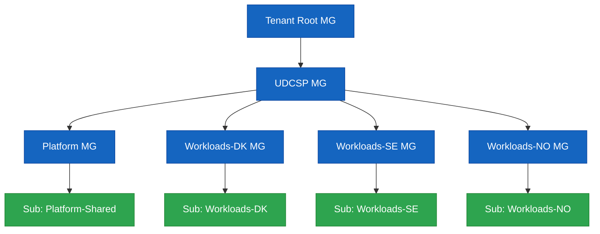

# UDCSP — Installation Guide

> **Audience.** Platform engineers and reviewers performing a clean install of the **Unified Digital Citizen Services Platform** on a sacrificial Microsoft Cloud tenant.
>
> **Outcome.** Every component referenced by [`architecture.md`](./architecture.md) provisioned in dependency order, smoke-tested, and ready to drive the 10 acceptance scenarios in [`recipe.md`](../biz/recipe.md).

> [!TIP]
> **Storage architecture context.** Read [`data.md`](./data.md) before installing — it explains what each storage component is for and why it's needed (5 zones, retention matrix, GDPR + AI Act + ePrivacy compliance mapping).

This guide is split into **5 collapsible sections**. Click any ▶ to expand.

| Section | What it is | When to use |
|---|---|---|
| **🟦 A — Prerequisites** | Things you do **once** on your workstation and Microsoft Cloud tenants before touching the installer. | Day-1 setup. |
| **🟩 B — Mandatory install** | The **linear sequence** that takes a clean tenant to a fully running platform. **Run every step in order.** | Every install. |
| **🟨 C — Optional** | Things you can skip for a basic install (PSTN, evaluator HTML, conversational smoke, tear-down). | Demos & audits. |
| **🟪 D — Re-run / Troubleshooting** | How to re-deploy a single phase, fix common errors, read reports. | After code changes or failed runs. |
| **🟧 E — Post-install checklist** | What the installer covers vs. what stays manual on a real MCAPS sandbox tenant — gaps, licences to obtain, follow-up actions. | After a green install run. |

---

<details>
<summary><h2>🟦 A — PREREQUISITES (do this once)</h2></summary>

> Run the **A1 → A6** steps top-to-bottom on your workstation. Stop at the end of A6 — do **not** start the installer yet, that's section B.
>
> **Why this order?** A1 installs the CLIs. A2 signs you into the things that exist on a fresh tenant (Azure + Microsoft Graph). A3 *creates* the missing tenants, subs and D365 environments — which gives you the URLs A4 needs. A4 signs `pac` into those new D365 URLs. **A5 installs the `Dynamics 365 Customer Service` first-party app into each env** (without it the env is a bare Dataverse and demo #5 cannot run). A6 writes everything you just created — including the Customer Service `appid` — into the installer config file.

<details>
<summary><b>A1. Install workstation tooling</b></summary>

The installer module phases call real CLIs. The bootstrap script installs **everything except** `az` (Azure CLI MSI) and `pac` (Power Platform CLI MSI):

```powershell
pwsh ./scripts/dev/Bootstrap-DevEnv.ps1
```

Then install the two MSIs manually if not already present:

| Tool | Mandatory? | Used by | Install |
|---|---|---|---|
| **PowerShell 7+** | ✅ Always | Orchestrator + every module | <https://learn.microsoft.com/en-us/powershell/scripting/install/installing-powershell> |
| **Azure CLI (`az`) 2.60+** | ✅ Always | LandingZone, Bastion, CIEM, Security, DDoS, BackupAsr, ConfidentialLedger, ChaosStudio, Observability, Postgres, Redis, ConfidentialCompute, VerifiedId, Identity, Apim, LogicApps, Purview, Voice | <https://learn.microsoft.com/en-us/cli/azure/install-azure-cli> + `az bicep upgrade` |
| **Power Platform CLI (`pac`)** | ⚠️ For D365 | D365 (solution import) | Install via `winget install --id Microsoft.PowerAppsCLI -e` *(see A2 step 3)* |
| `Microsoft.Graph` PowerShell SDK 2.x | ⚠️ For Graph phases | Identity, VerifiedId, CIEM, Priva | Auto-installed by Bootstrap-DevEnv.ps1 |
| Node.js 20 LTS + `npm` | ⚠️ For Apps | Apps (web build, mobile build) | Auto-installed by Bootstrap-DevEnv.ps1 |
| Static Web Apps CLI (`swa`) | ⚠️ For web deploy | Apps | Auto-installed by Bootstrap-DevEnv.ps1 |
| Expo EAS CLI (`eas`) | ⚠️ For mobile build | Apps | Auto-installed by Bootstrap-DevEnv.ps1 |
| Azure Functions Core Tools (`func`) v4 | ⚠️ For Logic Apps | LogicApps (workflow publish) | <https://learn.microsoft.com/en-us/azure/azure-functions/functions-run-local> |
| Python 3.11 | ⚠️ For synthetic data | SyntheticData (generators) | Auto-installed by Bootstrap-DevEnv.ps1 |
| Git 2.43+ | ✅ Always | Working copy of this repo | <https://git-scm.com> |

> Conditional tools that are missing produce a `[skip]` line during install — the rest of the run continues, so a partial install is always restartable later.

</details>

<details>
<summary><b>A2. Sign in to Azure + Microsoft Graph + install <code>pac</code></b></summary>

> 🎯 **Goal:** authenticate against the things that already exist on a fresh tenant. **D365 sign-in is deferred to A4** because the D365 environments don't exist yet — A3 creates them.

> ⚠️ **Multi-identity Windows trap.** If you are signed into Windows with a corporate account (e.g. `you@microsoft.com`) but the UDCSP tenant is a *separate* MCAPS / sandbox tenant (e.g. `admin@MngEnvMCAP123456.onmicrosoft.com`), `az` / `pac` / `Connect-MgGraph` all default to your Windows SSO identity and silently sign you into the **wrong tenant**. Always pass `--tenant <UDCSP-tenant-id>` to `az login` and `pac auth create`, and pick the UDCSP admin UPN — not your Windows UPN — at the device-code prompt.

**Step 1 — Azure CLI**

```powershell
# Replace <UDCSP-tenant-id> with the tenant where the deployment will run.
# If you only have one tenant, just `az login` is enough.
az login --tenant <UDCSP-tenant-id>
az account set --subscription <SharedPlatform-sub-id>

# Verify you landed in the right tenant:
az account show --query '{tenant:tenantId,user:user.name}' -o table
```

**Step 2 — Microsoft Graph PowerShell SDK (core scopes only)**

> ⚠️ On Windows, the default `Connect-MgGraph` flow uses **Web Account Manager (WAM)** which often fails with `InteractiveBrowserCredential authentication failed` in embedded terminals (VS Code, Windows Terminal pane, Warp, etc.) — the browser popup is hidden behind other windows or blocked by WAM. **Use device-code flow instead** — it prints a code to paste into <https://microsoft.com/devicelogin> and works in any shell.

> ⚠️ Run **only the 5 core scopes** below. The two add-on scopes `VerifiableCredential.Create.All` and `PrivacyManagement.ReadWrite.All` require **Microsoft Entra Verified ID** and **Microsoft Priva** to be already onboarded in the tenant — on a fresh tenant they don't exist yet (`AADSTS70011: scope … does not exist`). The installer's VerifiedId and Priva phases provision them later; you'll re-`Connect-MgGraph` with the add-on scopes at that point (see B section).

```powershell
Connect-MgGraph -UseDeviceCode -Scopes "Application.ReadWrite.All",`
                                       "Policy.ReadWrite.ConditionalAccess",`
                                       "Policy.ReadWrite.PermissionGrant",`
                                       "User.ReadWrite.All",`
                                       "Directory.ReadWrite.All"
```

**Step 3 — Power Platform CLI (`pac`) install (no auth yet)**

> The bootstrap script does **not** auto-install `pac`. Two reliable install paths on Windows — **prefer winget**, it pulls the MSI maintained by the Power Platform team and avoids the `DotnetToolSettings.xml`-not-found bug that plagues the dotnet-tool package on .NET 9:

```powershell
# Recommended — Windows Package Manager (winget) → official MSI
winget install --id Microsoft.PowerAppsCLI -e

# After install, OPEN A NEW SHELL so PATH picks up pac, then:
pac --version    # sanity check
```

Fallback if winget is unavailable (corporate-locked machines):

```powershell
dotnet tool install --global Microsoft.PowerApps.CLI.Tool

# If you hit "DotnetToolSettings.xml not found" on .NET 9, pin a known-good
# version that still ships the legacy settings file:
dotnet tool install --global Microsoft.PowerApps.CLI.Tool --version 1.34.4

# Then refresh PATH in current shell (or open a new shell):
$env:PATH += ";$env:USERPROFILE\.dotnet\tools"
pac --version
```

> ⚠️ **Antivirus interference (dotnet-tool path only)** — if the install fails with `Access to the path '…\.dotnet\tools\.store\.stage\…' is denied`, your AV (Defender or corporate AV) is locking the staging folder mid-extract. Three workarounds:
>
> 1. **Retry** — often succeeds on the 2nd attempt.
> 2. **Install to a non-profile path** the AV doesn't watch:
>    ```powershell
>    New-Item -ItemType Directory C:\tools\dotnet -Force | Out-Null
>    dotnet tool install Microsoft.PowerApps.CLI.Tool --tool-path C:\tools\dotnet
>    $env:PATH += ";C:\tools\dotnet"
>    pac --version
>    ```
> 3. Ask IT to add `%USERPROFILE%\.dotnet\tools` to Defender exclusions (admin only).

> ❌ **Do NOT run `pac auth create` here.** The D365 environments don't exist yet — see A4.

**Step 4 — Sanity check before A3:**

```powershell
az account show --query '{sub:name,tenant:tenantId}' -o table
(Get-MgContext).Account                                  # should print your UPN
pac --version                                            # should print pac version
```

> The installer pre-flights `az login` once at the top and refuses to start a real install if you are not authenticated. `Connect-MgGraph` / `pac` / `npm` / `swa` / `eas` / `func` are checked lazily — a missing one produces a `[skip]` line rather than a hard failure, so a partial install is always restartable later.

</details>

<details>
<summary><b>A3. Provision the Microsoft Cloud tenants, subscriptions & D365 environments</b></summary>

> 🎯 **Goal:** create the missing tenants, Azure subscriptions and D365 environments. After this step you'll have all the GUIDs and URLs that A5 needs to fill into `udcsp.config.psd1`.

You need owner-level access to create:

1. **Microsoft Entra tenant** (workforce) — for caseworker / SOC / DPO identities.
2. **Three Azure subscriptions** *(or three resource-group quotas in one subscription if running a demo)*, one per country — `udcsp-dk`, `udcsp-se`, `udcsp-no`.
3. **One shared Azure subscription** for cross-zone analytics & governance.
4. **Three Microsoft Entra External ID tenants** — `udcspdk.onmicrosoft.com`, `udcspse.onmicrosoft.com`, `udcspno.onmicrosoft.com` (or your own naming).
5. **Microsoft Foundry workspace** with model quota for the agents listed in `foundry/agents/`.
6. **Three D365 Customer Service environments** (one per country) — created in step 3.5 below.

**Capacity** to deploy: APIM Premium (multi-region), Microsoft Fabric F-SKU per country, ACS, AI Foundry hub & projects, AI Speech, Document Intelligence, Sentinel, Defender for Cloud, Key Vault Premium, ADLS Gen2.

**Conversational data layer extras:**

| Requirement | Scope | Notes |
|---|---|---|
| Quota: 6 additional Storage accounts per environment | Azure subscription or country resource groups | 3 countries × 2 ADLS Gen2 (`udcspvox*` + `udcspeml*`) |
| Quota: 3 Azure AI Search services per environment | Azure subscription | One S1 service per country |
| Quota: 3 Event Hubs namespaces per environment | Azure subscription | One Standard namespace per country |
| Permission: Owner on the country resource group | Azure RBAC | Required for CMK linkage |
| Permission: Power Platform admin per Dataverse env | Power Platform | Required to install D365 solutions |

**Step 3.1 → 3.4 — Provision tenants & subs in the portals**

| # | What | Where | Notes |
|---|---|---|---|
| 3.1 | 3 Azure subscriptions (or 3 RGs in one sub) + 1 shared sub | Azure portal → Subscriptions | Capture each subscription ID |
| 3.2 | 3 Entra External ID tenants | <https://entra.microsoft.com> → External Identities → External tenant | Capture each tenant ID |
| 3.3 | Foundry hub + project | <https://ai.azure.com> → Hubs | Verify model quota for `gpt-4o-realtime`, `gpt-4o-mini` in your region |
| 3.4 | DNS zones `udcsp.{dk,se,no}` | Your registrar | Required for Front Door / APIM custom domains |

**Step 3.5 — Create the 3 D365 / Power Platform environments**

> The `Install-D365` phase will fail without these.
>
> ⚠️ **Sign `pac` into the UDCSP tenant first.** `pac admin create` uses whichever identity `pac` last cached — if you skipped the explicit `--tenant`, that's your Windows SSO identity, which will fail with `Your tenant's administrators have disabled environment creation for non-admin users` (because you're not admin in that tenant). Bind `pac` to the UDCSP tenant with the admin UPN before calling `pac admin create`:
>
> ```powershell
> pac auth clear                                   # purge any cached SSO identity
> pac auth create --name udcsp-tenant-admin `
>                 --tenant <UDCSP-tenant-id> `
>                 --deviceCode
> # → at the device-code prompt, sign in with the UDCSP tenant admin UPN
> #   (e.g. admin@MngEnvMCAP123456.onmicrosoft.com), NOT your corp UPN.
> pac auth list                                    # confirm the right UPN is "active"
> ```

Then create the environments either via CLI or via the Power Platform admin centre (<https://admin.powerplatform.microsoft.com>):

```powershell
pac admin create --name UDCSP-DK --type Production --region europe   --currency DKK --language 1030
pac admin create --name UDCSP-SE --type Production --region 'sweden' --currency SEK --language 1053
pac admin create --name UDCSP-NO --type Production --region 'norway' --currency NOK --language 1044

pac admin list                              # capture each environment URL — used in A4 + A5
```

Each environment URL looks like `https://orgXXXXXXXX.crm4.dynamics.com` (the `XXXXXXXX` is auto-generated, NOT `udcspdk` — replace the placeholder URLs in A4 / A5 with these real values).

> **DNS + TLS.** The Front Door + APIM phases assume you own `udcsp.{dk,se,no}` (or your equivalent) and have delegated NS records. The installer provisions Front-Door-managed certificates for `*.udcsp.{dk,se,no}` but **cannot delegate DNS for you** — register zones first.
>
> **EU residency.** Workload regions MUST be in EU geography (`westeurope`, `northeurope`, `swedencentral`, `norwayeast`). The installer refuses non-EU regions.

</details>

<details>
<summary><b>A4. Sign <code>pac</code> into the 3 D365 environments</b></summary>

> 🎯 **Goal:** authenticate `pac` against the URLs you captured in A3 step 3.5. Replace `https://orgXXXXXXXX.crm4.dynamics.com` with the real URL from `pac admin list`.

```powershell
pac auth create --name udcsp-dk --environment <DK-org-url-from-A3.5>
pac auth create --name udcsp-se --environment <SE-org-url-from-A3.5>
pac auth create --name udcsp-no --environment <NO-org-url-from-A3.5>
pac auth list    # confirms 3 profiles
```

> ⚠️ If you get `NameResolutionFailure` it means the env URL doesn't resolve in DNS — you're using a placeholder URL (e.g. `udcspdk.crm4.dynamics.com`) instead of the real `orgXXXXXXXX.crm4.dynamics.com` produced in A3.5. Re-run `pac admin list` to get the right URL.

</details>

<details>
<summary><b>A5. Install <code>Dynamics 365 Customer Service</code> first-party app in each D365 environment</b></summary>

> 🎯 **Goal:** add the Microsoft-provided **Customer Service** application package (Customer Service Hub UI, `incident` table, BPF, queues, SLA timers, Copilot for Service) to each of the 3 environments created in A3. Without this, the env is a bare Dataverse and demo #5 (back-office caseworker) cannot run — you would only see `Solution Health Hub`, `Power Pages Administration`, and `Power Platform environment settings` on the apps page.
>
> **Why manual?** First-party D365 app installation requires a service principal with the BAP `Global Administrator` role; on a sandbox tenant it's faster to do it through the admin portal. The installer cannot do this for you.

#### A5.1 — Verify or assign a Customer Service license

1. Open <https://admin.microsoft.com> → **Billing → Your products** (or **Licenses → Your products**).
2. Look for one of:
   - `Dynamics 365 Customer Service Enterprise`
   - `Dynamics 365 Customer Service Professional`
   - `Dynamics 365 Customer Service Trial` *(free 30 days, sufficient for the demos)*

**If the license is not in your tenant** (common on a fresh MCAPS sandbox where only Power Apps Developer Plan was provisioned), there are two ways to get a trial:

- **Self-service trial (recommended, 1 minute):**
  1. Sign in to <https://trials.dynamics.com> with your tenant admin account (`admin@MngEnvMCAP294737.onmicrosoft.com` in the example).
  2. Pick **Customer Service**, language `English`, fill the short form.
  3. Microsoft drops a **`Dynamics 365 Customer Service Trial`** license into your tenant within ~2 minutes — you'll see it appear in `admin.microsoft.com → Billing → Your products`.
- **Admin-driven trial via M365 admin center:**
  1. <https://admin.microsoft.com> → **Billing → Purchase services** → search "Customer Service".
  2. On the `Dynamics 365 Customer Service Enterprise` tile click **Details → Start free trial** (25 user trial, 30 days).

Then assign the license to **at least one user** (your admin account is fine):
- <https://admin.microsoft.com> → **Users → Active users** → pick the user → **Licenses and apps** → tick `Dynamics 365 Customer Service [Trial|Enterprise]` → **Save changes**.

> ⚠️ MCAPS sandbox subscriptions sometimes block paid SKUs but always allow trials. If `trials.dynamics.com` redirects you back to the home page without offering the trial, your tenant is likely flagged "internal Microsoft" — in that case open a `aka.ms/MCAPS` ticket asking for a Customer Service trial license to be provisioned, or use a different MCAPS sandbox.

#### A5.2 — Install the Customer Service app into each environment

Repeat for **DK, SE, NO**:

1. Open <https://admin.powerplatform.microsoft.com/environments>.
2. Click the environment row (e.g. the one matching `org939d8f07.crm4.dynamics.com`).
3. Top tab **Resources → Dynamics 365 apps** → **+ Install app** (top-right).
4. Find **`Dynamics 365 Customer Service`** in the catalog → **Next** → accept terms → **Install**.
5. Status goes `Installation pending → Installing → Installed`. Allow ~10–30 min.
6. (Optional, recommended) Repeat for **`Dynamics 365 Customer Service – Customer Service Historical Analytics`** if you want the out-of-box dashboards used by demo #9 (analytics).

**Verification:** browse to `https://<orgXXXX>.crmN.dynamics.com/main.aspx?forceUCI=1&pagetype=apps` — you should now see **Customer Service Hub** and **Customer Service workspace** alongside the 3 system apps. Click Customer Service Hub once to materialise its `appid` GUID, copy it from the URL bar, and paste it into `udcsp.config.psd1` as `D365CustomerServiceAppId.<DK|SE|NO>` so the demo scripts can deep-link.

#### A5.3 — Side-effects in Dataverse

After the install, your env contains:
- Native tables: `incident` (Case), `account`, `contact`, `kbarticle`, `queue`, `sla`, `entitlement`, etc. — these are what our `customizations/` scaffold extends.
- Default BPF: `Phone to Case Process`, `Inquiry to Resolution`.
- Out-of-box queues, routing rules, and SLA timer engine.
- The `udcsp` publisher prefix imported in phase D365 of the installer can now reference `incident` to add custom fields (e.g. `udcsp_aiassessmentscore`).

</details>

<details>
<summary><b>A6. Sign <code>pac</code> into the 3 D365 environments</b></summary>

```powershell
Copy-Item scripts/install/config/udcsp.config.template.psd1 scripts/install/config/udcsp.config.psd1
notepad scripts/install/config/udcsp.config.psd1
```

Fill the **mandatory** keys at minimum:

```powershell
@{
  TenantId      = '<entra-tenant-guid>'
  Environment   = 'prod'   # one of dev|test|preprod|prod
  Subscriptions = @{
    SharedPlatform = '<sub-guid>'
    DK             = '<sub-guid>'   # use the same GUID 4× for a single-sub demo
    SE             = '<sub-guid>'
    NO             = '<sub-guid>'
  }
  Regions = @{
    DK = 'northeurope'
    SE = 'swedencentral'
    NO = 'norwayeast'
  }
  ExternalIdTenants = @{
    DK = 'udcspdk.onmicrosoft.com'
    SE = 'udcspse.onmicrosoft.com'
    NO = 'udcspno.onmicrosoft.com'
  }
  D365EnvironmentUrls = @{
    DK = 'https://udcspdk.crm4.dynamics.com'
    SE = 'https://udcspse.crm4.dynamics.com'
    NO = 'https://udcspno.crm4.dynamics.com'
  }
  FoundryWorkspace = @{
    Subscription  = '<sub-guid>'
    ResourceGroup = 'udcsp-shared-foundry'
    Name          = 'udcsp-foundry'
    Region        = 'swedencentral'
  }
}
```

> **Leave the `Voice = @{ dk = ...; se = ...; no = ... }` block as placeholders.** It will be filled later in **B5** using values produced by the first install pass.

> **Secrets** (External ID signing keys, D365 application-user secrets, Foundry deployment keys) are fetched **just-in-time** from a bootstrap Key Vault — the installer's first task provisions that vault and prompts for any secret it cannot resolve.

✅ **Section A done.** Move on to section B.

</details>

</details>

---

<details>
<summary><h2>🟩 B — MANDATORY INSTALL (run in order)</h2></summary>

> **What "deploy" means here.** Every Install-* module in `scripts/install/modules/` invokes the **real** Azure CLI / `pac` / `npm` / `swa` / `eas` / `func` / MS Graph commands. There is no scaffold mode: when you run B3 you actually create resource groups, deploy Bicep, push container images, import D365 solutions, build the SPA, register Foundry agents, etc. Logs land in `scripts/install/reports/<runStamp>/install-<phase>.log`.

> **`-Environment dev` is recommended for the first run.** `prod` requires `-Force` and you must have run B1 + B2 successfully against `dev` first.

<details>
<summary><b>B1. Offline self-test (no Azure calls)</b></summary>

```powershell
pwsh ./scripts/install/Install-UDCSP.ps1 -TestOnly -Environment dev
```

Walks every phase's preconditions, configuration parsing and module wiring without touching Azure. **Expected output: `25/25 ✅`.** Fix any red line before continuing.

</details>

<details>
<summary><b>B2. WhatIf dry-run (Azure read-only plan)</b></summary>

```powershell
pwsh ./scripts/install/Install-UDCSP.ps1 -WhatIf -Environment dev
```

Shows every Bicep what-if and APIM/Logic Apps/D365 deployment plan without applying anything. **Mandatory before any `prod` install.**

</details>

<details>
<summary><b>B3. First-pass install (everything except Voice & QA)</b></summary>

```powershell
pwsh ./scripts/install/Install-UDCSP.ps1 -Environment dev -ExcludePhase Voice,QA
```

This runs **23 of the 25 phases** sequentially in dependency order, idempotent, with a coloured progress log and a JSON report under `scripts/install/reports/<timestamp>/`. We defer:

- **`Voice`** — its config block needs values produced by earlier phases (Container Apps env IDs, KV secret URIs, App Insights connection strings, D365 queue GUIDs). Configured in B5.
- **`QA`** — its smoke gate exercises the deployed Voice runtime; only green after Voice is up.

> **Expected duration:** ≈ 60–90 minutes on a clean tenant (APIM Premium cold start is the long pole at ≈ 45 min; the installer streams progress every 60 s).

> The full 25-phase DAG is detailed in **Appendix 1**.

</details>

<details>
<summary><b>B4. Harvest Voice outputs from B3</b></summary>

Once B3 has run, all the Voice prerequisites are in place (ACR, Container Apps env, UAMI, Key Vault, APIM, Foundry, App Insights). This step **collects the IDs / URIs / connection strings** that the Voice phase needs in `Voice.<country>`. Do it once per country you want to enable voice on.

> 💡 **For Demo 2 (Lars · NB · Norway), `Voice.no` is enough.** The whole scenario lives in NO (Skatteetaten, Norwegian Bokmål, Norway East sovereignty). All commands in B4 → B7 below already target NO only (`udcspnoprodacr`, `udcsp-no-acs`, `udcsp-no-voice`, `norwayeast`); leave the `Voice.dk` / `Voice.se` blocks empty in `udcsp.config.psd1` and the `Install-UDCSP.ps1 -Phase Voice` loop skips them automatically. Re-apply the same B4 → B7 sequence later if you need DK or SE voice too — nothing changes beyond the country prefix.

### B4.0 — Pre-flight checks

Verify the upstream phases produced what Voice depends on:

```powershell
az containerapp env list -o table | findstr udcsp-no
az identity list -o table | findstr voice
az keyvault list -o table | findstr udcsp-no
az cognitiveservices usage list --location norwayeast -o table | findstr -i realtime
```

If the Container Apps env or UAMI are missing, you can either run the upstream phases via the installer (idempotent — re-applies LandingZone + Identity for every country) **or**, if you want to scope the change to NO only and avoid touching other countries:

```powershell
$LAW_RG   = 'udcsp-no-observability-rg'
$LAW_NAME = 'udcsp-no-prod-law'
$LAWCustomerId = az monitor log-analytics workspace show -g $LAW_RG -n $LAW_NAME --query customerId -o tsv
$LAWKey        = az monitor log-analytics workspace get-shared-keys -g $LAW_RG -n $LAW_NAME --query primarySharedKey -o tsv

$RG  = 'udcsp-no-voice'
$LOC = 'norwayeast'
az group create -n $RG -l $LOC -o none
az identity create -g $RG -n udcsp-no-voice-orch-uami -l $LOC -o none
az containerapp env create -g $RG -n udcsp-no-voice-env -l $LOC --logs-workspace-id $LAWCustomerId --logs-workspace-key $LAWKey -o none
```

> The Log Analytics workspace name (`udcsp-no-prod-law` in `udcsp-no-observability-rg`) and the voice RG / UAMI / ACA-env names follow the canonical pattern emitted by `Install-UDCSP.ps1 -Phase Observability,LandingZone,Identity`, so they're the same on every clean install. If you bootstrapped with custom names, run `az monitor log-analytics workspace list -o table | findstr udcsp-no` and substitute.

> 💡 **gpt-realtime: fallback to `swedencentral`.** Norway East doesn't ship `gpt-realtime` yet (region-limited preview). Swedencentral is the only Nordic region with quota — keep `Voice.no.azureOpenAiEndpoint = 'https://udcspai.openai.azure.com/'` (the default). ACS audio remains pinned to Norway East, so media sovereignty is preserved; only the LLM inference crosses to SE.

Or, if you prefer the full installer pass (safe — every Bicep is idempotent):

```powershell
pwsh ./scripts/install/Install-UDCSP.ps1 -Phase LandingZone,Identity -Environment dev
```

### B4.1 — Build + push the orchestrator image to ACR

The Voice Bicep needs a real image to deploy. Build once, push to the country ACR. Re-do this whenever you change anything under `apps/voice/call-automation/`.

```powershell
cd apps/voice/call-automation
az acr build --registry udcspnoprodacr --image udcsp/voice-orchestrator:1.0.0 .
cd ../../..
```

> If `az acr build` fails with `denied: client with IP ... is not allowed access`, the ACR firewall is blocking even its own build agents. Two cases:
>
> **Case A — public network access ENABLED + network rules in Deny.** Allow trusted Azure services (idempotent, no portal trip), wait ~30 s for propagation, re-run:
>
> ```powershell
> az resource update --ids $(az acr show --name udcspnoprodacr --query id -o tsv) --set properties.networkRuleBypassOptions=AzureServices
> ```
>
> **Case B — public network access DISABLED (private endpoint only).** The trusted-services bypass is ignored. Re-enable public access for the build, then re-disable once the image is pushed (the Container App runtime pulls via the private endpoint, so the public toggle can stay off afterward):
>
> ```powershell
> az acr update --name udcspnoprodacr --public-network-enabled true
> # wait ~30 s, then run `az acr build` above
> az acr update --name udcspnoprodacr --public-network-enabled false
> ```

> `az acr build` runs `docker build` + `docker push` on the ACR cloud agents — no local Docker daemon required. If you prefer a local build (faster on subsequent builds because of layer caching, but needs Docker Desktop running):
>
> ```powershell
> cd apps/voice/call-automation
> docker build -t udcspnoprodacr.azurecr.io/udcsp/voice-orchestrator:1.0.0 .
> az acr login --name udcspnoprodacr
> docker push udcspnoprodacr.azurecr.io/udcsp/voice-orchestrator:1.0.0
> cd ../../..
> ```

### B4.2 — Provision the voice App Registration + KV client secret

The orchestrator uses OAuth client-credentials to call APIM `/agents/topic-router/messages`. Create a dedicated App Registration and stash its secret in the country Key Vault.

```powershell
# (a) App Registration — capture appId + secret directly (no JMESPath dict, cmd-safe)
$appId = az ad app create --display-name "udcsp-voice-orch-no" --query appId -o tsv
az ad sp create --id $appId --query id -o tsv | Out-Null
$secret = az ad app credential reset --id $appId --append --query password -o tsv
"voiceClientId    : $appId"
"voiceClientSecret: $secret"

# (b) Stash the secret in the country Key Vault (canonical name from LandingZone)
$kvName = 'udcsp-no-prod-kv'
az keyvault secret set --vault-name $kvName --name "voice-client-secret" --value $secret --query id -o tsv
# Save the returned URI — that's the value for `voiceClientSecretUri`.
```

> If `az keyvault secret set` returns `(Forbidden) ... ForbiddenByRbac`, your az-login identity lacks the data-plane role on the vault. Grant it once (wait ~30 s after for propagation):
>
> ```powershell
> $myOid = az ad signed-in-user show --query id -o tsv
> $kvId  = az keyvault show --name udcsp-no-prod-kv --query id -o tsv
> az role assignment create --assignee-object-id $myOid --assignee-principal-type User --role "Key Vault Secrets Officer" --scope $kvId
> ```
>
> If you then hit `(Forbidden) Public network access is disabled ... ForbiddenByConnection`, the vault is locked to private endpoints. Toggle public access for the setup window (same pattern as the ACR fix in B4.1):
>
> ```powershell
> az keyvault update --name udcsp-no-prod-kv --public-network-access Enabled
> # run all your `az keyvault secret set` commands now (B4.2 + B4.4)
> az keyvault update --name udcsp-no-prod-kv --public-network-access Disabled
> ```
>
> The Container App pulls the secret via the KV private endpoint at runtime, so leaving public access `Disabled` after the setup is fine.

### B4.3 — Resolve the 3 dynamic values + pre-format the `Voice.no` block

Run this once — it resolves the Container Apps env id, the UAMI id and the App Insights connection string, then prints a ready-to-paste `Voice.no` block (you'll just need to add the two `voiceClientSecretUri` / `acsConnectionStringSecretUri` URIs returned by B4.2 / B4.4).

```powershell
$caeId       = az containerapp env show -n udcsp-no-voice-env -g udcsp-no-voice --query id -o tsv
$uamiId      = az identity show -n udcsp-no-voice-orch-uami -g udcsp-no-voice --query id -o tsv
$aiConn      = az monitor app-insights component show -a udcsp-no-prod-shared-appi -g udcsp-no-observability-rg --query connectionString -o tsv
$dlStorageId = az storage account show -n udcspnoprodlake -g udcsp-no-prod-platform-rg --query id -o tsv

@"
Voice.no = @{
    env                          = 'dev'
    resourceGroup                = 'udcsp-no-voice'
    location                     = 'norwayeast'
    containerAppsEnvironmentId   = '$caeId'
    userAssignedIdentityId       = '$uamiId'
    image                        = 'udcspnoprodacr.azurecr.io/udcsp/voice-orchestrator:1.0.0'
    azureOpenAiAccountName       = 'udcspai'
    azureOpenAiEndpoint          = 'https://udcspai.openai.azure.com/'
    apimBaseUrl                  = 'https://udcsp-no-prod-apim.azure-api.net'
    cognitiveServicesEndpoint    = 'https://udcspai.cognitiveservices.azure.com/'
    acsConnectionStringSecretUri = '<filled in B4.4>'
    voiceClientSecretUri         = '<URI from B4.2 voice-client-secret>'
    voiceClientId                = '$appId'
    appInsightsConnectionString  = '$aiConn'
    publicHostname               = ''
    d365TransferTargetId         = ''
    d365VoiceQueueId             = ''
    deadLetterStorageAccountId   = '$dlStorageId'
    acsResourceName              = 'udcsp-no-acs'
}
"@
```

Copy the printed block into `scripts/install/config/udcsp.config.psd1`. Swap the two `<...>` placeholders with the URIs from B4.2 (`voice-client-secret`) and B4.4 (`acs-connection-string`).

### B4.4 — First-pass Voice WhatIf to seed the ACS resource

The ACS connection string only exists after the ACS resource has been created by the Voice Bicep. Run a dry-pass to provision ACS, then capture the connection string.

```powershell
pwsh ./scripts/install/Install-UDCSP.ps1 -Phase Voice -Environment dev -WhatIf

# Now ACS exists — read its primary connection string and stash in KV
$acsCs = az communication list-key --name udcsp-no-acs -g udcsp-no-voice --query primaryConnectionString -o tsv
az keyvault secret set --vault-name $kvName --name "acs-connection-string" --value $acsCs --query id -o tsv
# Save the URI — that's `acsConnectionStringSecretUri`.
```

</details>

<details>
<summary><b>B5. Configure the Voice block from first-pass outputs</b></summary>

Paste the `Voice.no` block produced by the B4.3 here-string into `scripts/install/config/udcsp.config.psd1`, then fill the two `<...>` URI placeholders:

- `voiceClientSecretUri` ← URI returned by `az keyvault secret set --name voice-client-secret …` (B4.2).
- `acsConnectionStringSecretUri` ← URI returned by `az keyvault secret set --name acs-connection-string …` (B4.4).

> ⚠️ **`d365TransferTargetId` / `d365VoiceQueueId` left empty** means the voice orchestrator skips the `escalate_to_human` function tool. The AI assistant will answer questions and decline warm-transfer gracefully ("a human caseworker will call you back") until D365 Customer Service is provisioned. See [`inprogress.md`](./inprogress.md) § "Demo 2" for the v2 plan.

</details>

<details>
<summary><b>B6. Run the Voice phase</b></summary>

```powershell
pwsh ./scripts/install/Install-UDCSP.ps1 -Phase Voice -Environment dev
```

The DAG resolver re-includes Voice's prerequisites — every Bicep deploy is idempotent so this is safe and takes only seconds for already-up phases. The Voice phase itself provisions:

- `udcsp-no-acs` (Azure Communication Services, `dataLocation=Norway`)
- `gpt-realtime-no` (Azure OpenAI deployment, 10k TPM by default, fallback to `swedencentral` if NO has zero quota)
- `udcsp-no-dev-voice-orch` (Container App, UAMI-bound, KV-backed secrets, ingress `transport: auto` for WSS)
- Event Grid `IncomingCall` subscription pointing at the orchestrator's `/api/acs/eventgrid` route

Verify the orchestrator is live:

```powershell
$fqdn = az containerapp show -n udcsp-no-dev-voice-orch -g udcsp-no-voice `
    --query "properties.configuration.ingress.fqdn" -o tsv
curl "https://$fqdn/healthz"
# Expected: 200 OK with { "status": "ok", "mode": "live" }
```

### B6.1 — Bind a phone number (or browser ingress) to the orchestrator

Pick ONE of these three, in order of regulatory lead time:

| Option | Lead time | How |
|---|---|---|
| **A — ACS Direct Calling (browser)** | 0 min | Use the ACS Web SDK from a button on the demo page — no PSTN, no procurement, no regulator. Best for jury rehearsal. |
| **B — US toll-free `+1 800…`** | Minutes | Order a US toll-free via the ACS portal, then run `Bind-AcsNumber.ps1`. Same backend, different ingress. |
| **C — Real Nordic toll-free** (`+47 800…` / `+45 80…` / `+46 20…`) | 1–3 weeks | Submit the Nkom / ERST / PTS KYC pack via the ACS portal; production-grade. |

```powershell
# Option B / C — bind the procured number to this orchestrator
pwsh ./apps/voice/scripts/Bind-AcsNumber.ps1 -Country no -Env dev `
    -PhoneNumber "+1XXXXXXXXXX" `
    -AcsResourceName udcsp-no-acs `
    -ResourceGroup udcsp-no-voice `
    -OrchestratorFqdn $fqdn
```

</details>

<details>
<summary><b>B7. Run the QA smoke gate</b></summary>

```powershell
pwsh ./scripts/install/Install-UDCSP.ps1 -Phase QA -Environment dev
```

The QA phase exercises `/healthz` on every deployed surface, replays an Event Grid `SubscriptionValidationEvent` against the orchestrator, and prints the platform URLs to console.

### B7.1 — Live dial test

End-to-end verification:

1. **Call** the bound number (option B/C) or open the browser caller (option A).
2. **Listen** — you should hear the recording-disclosure prompt in Norwegian, then a "How can I help?" greeting.
3. **Say** in NB : *"Hvorfor er skatterefusjonen min så lav i år?"*
4. **Confirm in App Insights** that the call hit Foundry through APIM:
   ```kusto
   requests
   | where url contains "/agents/topic-router/messages"
       and customDimensions["x-channel-actor"] == "voice"
       and timestamp > ago(2m)
   | project timestamp, resultCode, duration, operation_Id
   ```
   Expect a single HTTP 200 with a `traceparent` linking back to the ACS call leg.

✅ **Section B done — the platform is fully running, including the voice channel.** Move to section C if you need optional features, otherwise jump to [`recipe.md`](../biz/recipe.md) for the 10 acceptance scenarios.

</details>

</details>

---

<details>
<summary><h2>🟨 C — OPTIONAL (only if you need them)</h2></summary>

<details>
<summary><b>C1. Bind a real PSTN number</b></summary>

Required only for the live voice demo in [`recipe.md`](../biz/recipe.md) Scenario 2. After acquiring a Nordic toll-free or local number through ACS:

```powershell
pwsh apps/voice/scripts/Bind-AcsNumber.ps1 -Country dk -Env dev `
  -PhoneNumber +45XXXXXXXX -AcsResourceName udcsp-dk-acs `
  -ResourceGroup udcsp-dk-voice -OrchestratorFqdn voice-dk.udcsp.dk `
  -NumberType tollFree
```

The script overwrites the matching `placeholder: true` entry in `apps/voice/acs/phone-number-bindings.yaml` in-place, so the next `Install-Voice` run re-binds without operator action.

</details>

<details>
<summary><b>C2. Generate the evaluator HTML report</b></summary>

```powershell
pwsh ./scripts/install/Install-UDCSP.ps1 -Phase QA -SmokeOnly -EvaluatorMode
```

`-EvaluatorMode` writes `scripts/install/reports/<runStamp>/install-report.html` (single artefact for the case-study evaluator) in addition to the JSON report. The smoke kicks off:

1. `tests/e2e/tests/scenario-09-devops-installer.spec.ts` — installer reproducibility check.
2. `tests/eval/pipelines/nightly-classifier.yaml` — reduced sample.
3. `tests/accessibility/automated/axe-runner.spec.ts` — homepage axe scan.
4. `tests/load/k6/citizen-application-submit.k6.js` — short ramp.

</details>

<details>
<summary><b>C3. Conversational data smoke checks</b></summary>

- **SMS** — send a test SMS; verify it lands in the `sms_activity` Dataverse table and in the `acs-events/` ADLS container.
- **Voice** — make a test voice call; verify the `.wav` lands in `voice-recordings/` ADLS, the STT transcript is stored alongside it, and the dialog turn is emitted by the Foundry `topic-router` into App Insights traces.
- **Email** — send a test email with attachment; verify the body is in the `email_activity` Dataverse table and the attachment is in `email-attachments/` ADLS.
- **Foundry trace** — trigger a Foundry agent invocation; verify the trace is in App Insights and mirrored to OneLake Bronze.
- **Right-to-erasure** — `POST /privacy/erase/{test_citizen_id}`; verify deletion cascades across all 5 zones within 30 minutes in test mode.

</details>

<details>
<summary><b>C4. Tear-down</b></summary>

```powershell
pwsh ./scripts/cleanup/Remove-UDCSP.ps1 -Environment dev -Confirm
```

Removes every resource group tagged `costCenter=UDCSP` across all configured subscriptions, unregisters Purview sources tagged for the environment, and disables (does **not** delete) the Microsoft Entra app registrations tagged `udcsp-env-<env>`. External ID tenants are intentionally not deleted automatically — delete them manually from the Entra admin centre when no longer needed. Refuses to run against `prod` unless `-Force` is supplied.

</details>

</details>

---

<details>
<summary><h2>🟪 D — RE-RUN / TROUBLESHOOTING</h2></summary>

<details>
<summary><b>D1. Re-run a single phase (after a code change)</b></summary>

```powershell
pwsh ./scripts/install/Install-UDCSP.ps1 -Phase Foundry,D365,Apps -Environment dev
```

Each phase is idempotent — safe to re-run.

</details>

<details>
<summary><b>D2. Re-run an offline self-test for one phase</b></summary>

```powershell
pwsh ./scripts/install/Install-UDCSP.ps1 -TestOnly -Phase Foundry
```

</details>

<details>
<summary><b>D3. Run only the Voice orchestrator (after voice code change)</b></summary>

```powershell
pwsh ./scripts/install/Install-UDCSP.ps1 -Phase Voice -Environment dev `
  -ExcludePhase LandingZone,Identity,VerifiedId,Bastion,Ciem,Security,Ddos,BackupAsr,`
                ConfidentialLedger,ChaosStudio,Observability,Fabric,Postgres,Redis,`
                SyntheticData,Foundry,ConfidentialCompute,Apim,LogicApps,D365,Apps
```

</details>

<details>
<summary><b>D4. <code>-Environment prod</code> requires <code>-Force</code></b></summary>

```powershell
pwsh ./scripts/install/Install-UDCSP.ps1 -Environment prod -Force
```

Without `-Force`, a `prod` invocation prints a warning and exits without making any changes. `-WhatIf`, `-TestOnly`, and `-SmokeOnly` against `prod` do **not** require `-Force`.

</details>

<details>
<summary><b>D5. Common errors</b></summary>

| Symptom | Likely cause | Fix |
|---|---|---|
| Pre-flight aborts with `Azure CLI is not logged in` | `az login` not done in this shell | `az login` then `az account set --subscription <id>` |
| `Install-D365` fails with `pac: command not found` | Power Platform CLI missing | Install per **A2 step 3** (`winget install --id Microsoft.PowerAppsCLI -e`), then run the 3 `pac auth create` from **A4** |
| `Install-LogicApps` fails with `func: command not found` | Azure Functions Core Tools v4 missing | `npm i -g azure-functions-core-tools@4 --unsafe-perm true` |
| `Install-Apps` logs `[skip] swa CLI not found` / `[skip] eas CLI not found` | Static Web Apps / Expo CLIs missing | `npm i -g @azure/static-web-apps-cli eas-cli` then re-run `-Phase Apps` |
| `Install-Identity` / `VerifiedId` / `Ciem` / `Priva` log `[skip] Microsoft.Graph not connected` | `Connect-MgGraph` not run in current shell | Run the `Connect-MgGraph -Scopes …` from **A2**, then re-run the affected phase. Bicep parts of these phases run regardless. |
| `Install-Identity` fails on External ID user-flow upload | `TenantId` doesn't match the External ID tenant | Re-check the `ExternalIdTenants` block |
| `Install-Fabric` returns `403 CapacityNotFound` | Fabric F-SKU not provisioned in country region | Provision the capacity in Azure Portal → re-run `-Phase Fabric` |
| `Install-Foundry` fails on model deployment | Quota exhausted in the Foundry region | Request quota in Foundry portal or change region in config |
| `Install-Apim` slow on first run | Premium APIM cold start ≈ 45 minutes | Expected. Installer streams progress every 60 s. |

</details>

<details>
<summary><b>D6. Reading the install reports</b></summary>

Every run produces:

- `scripts/install/reports/<runStamp>/install-report.json` — machine-readable summary, phase-by-phase status + outputs.
- `scripts/install/reports/<runStamp>/install-<phase>.log` — full stdout/stderr/exit-code for every external CLI call in that phase.
- `scripts/install/reports/<runStamp>/install-report.html` — operator-friendly HTML, only when `-EvaluatorMode` is passed.

Grep tip:

```powershell
Select-String -Path scripts/install/reports/*/install-*.log -Pattern '\[ERROR\]|\[skip\]'
```

</details>

</details>

---

<details>
<summary><h2>🟧 E — POST-INSTALL CHECKLIST (what's done, what's still manual)</h2></summary>

> Read this **after** your first successful end-to-end install run on a sandbox tenant. The installer is honest: when an Azure resource type, M365 SKU or first-party app is **not procurable via API**, the corresponding phase logs `[skip]` and the orchestrator marks the phase ✅ on the basis of the validation script (which only checks that source artefacts exist, not that Azure/M365 actually accepted them). This section lists the gaps and how to close them.

---

### E1 — Lessons learned from real runs (May 2026 sandbox campaign)

These are the issues we hit on a fresh `MngEnvMCAP294737.onmicrosoft.com` MCAPS sandbox and the fixes now baked into the installer. **You should not have to redo these** — they are documented so you understand the `[skip]` lines you will see in the logs.

| # | What we hit | Root cause | Fix shipped |
|--:|---|---|---|
| 1 | `pac solution import` exit 1 with `Solution manifest cannot be parsed` | `Solution.xml` had `<RootComponents></RootComponents>` self-close + missing `<Versions>` block | Per-country `Solution.xml` files now author the canonical layout (`<RootComponents />` + `<MissingDependencies />` + valid `<Versions>` block), publisher `udcsp_` reserved at version `1.0.0.0` |
| 2 | `az staticwebapp create` failed `LocationNotAvailableForResourceType` in `swedencentral` | SWA Free SKU only available in `centralus / eastus2 / westus2 / westeurope / eastasia` | `Install-Apps.psm1` hardcodes `westeurope` for SWA Free (still EU-residency compliant — SWA is a global edge CDN, content origin stays in our SWA region) |
| 3 | `swa deploy` hung on interactive auth picker | `swa deploy` opens a browser when no `--deployment-token` is given | Installer now `az staticwebapp secrets list` → passes `--deployment-token <key> --no-use-keychain` |
| 4 | `staticwebapp.config.json` rejected with `AnyOfError` schema validation | Invalid `routes[]` entry combining `route + serve + statusCode` | Removed redundant `/*` route; `navigationFallback.rewrite` already handles SPA fallback |
| 5 | `npm install` exit 1 — package not found on registry | `@azure/msal-react-native@^0.4.0` was a placeholder, **does not exist** on npmjs | Replaced with canonical Expo OIDC stack: `expo-auth-session ~6.0.2`, `expo-crypto ~14.0.1`, `expo-web-browser ~14.0.1` (PKCE flow with Microsoft Entra External ID) |
| 6 | `az group create` exit 1 | RG already existed in a different location (re-run after region change) | `New-AzResourceGroupIfNeeded` now `az group exists` pre-check, idempotent across location changes |
| 7 | `az deployment group create udcsp-purview` **silently zombied** for 40+ min (1 thread, 0 CPU, 0 network connections, **no deployment ever registered in ARM**) | MCAPS / Enterprise tenants are limited to **one tenant-level Purview account** (validation error 35001). In `westeurope` ARM returns the error in ~4 s; in `swedencentral` ARM hangs the az client silently (regional ARM bug) | `Install-Purview.psm1` pre-checks `az resource list --resource-type Microsoft.Purview/accounts` across the tenant — if any exists, skips the create and runs `Register-PurviewSources` against the existing account instead |
| 8 | `Install-Purview` long deployment risk | Purview accounts take 30–60 min to provision the managed RG (SQL + Storage + EventHub) | `Invoke-AzGroupDeployment` now supports `-NoWait` + ARM polling every 30 s with 75 min timeout; opt-in for slow phases |

---

### E2 — Status matrix: what you have vs. what's still manual

After a green run on a clean MCAPS sandbox using the `dev` config, the table below is what a reviewer should expect.

**Legend**: ✅ provisioned by installer • ⚠️ provisioned but with gaps • 🟡 manual one-time action required • ❌ not procurable on this tenant (needs licence/SKU/ticket)

#### Azure infrastructure (Bicep / ARM)

| Phase | Resource | Sandbox status | Action needed |
|---|---|---|---|
| `LandingZone` | Mgmt-group hierarchy, RGs, hub-spoke VNets, Key Vault, ACR, Storage | ✅ | — |
| `Identity` | Microsoft Entra External ID tenants, user flows, Conditional Access, PIM | ⚠️ | One External ID tenant per country must be created **manually** (no Bicep provider for tenant-creation) |
| `VerifiedId` | Verified ID issuer + verifier (eIDAS 2.0 / EUDI bridge) | 🟡 | Verified ID needs to be **enabled per tenant** in Entra portal once; installer registers the issuer/verifier via Graph |
| `Bastion`, `Ddos`, `BackupAsr`, `Observability`, `ConfidentialLedger`, `ChaosStudio`, `Fabric`, `Postgres`, `Redis`, `ConfidentialCompute` | All Azure-native | ✅ | — |
| `Foundry` | Azure AI Foundry projects, hosted/prompt agents, evaluators, datasets | ✅ | — |
| `Apim` | API Management Developer tier, agent-topic-router API, products, policies | ✅ | — |
| `LogicApps` | 10 Consumption workflows × 3 countries (citizen onboarding, SRR, breach, etc.) | ✅ | — |
| `Apps` | SWA `udcsp-web-dev` (westeurope), web build, mobile npm install | ✅ | EAS build for mobile binaries skipped (`eas` not on PATH) — install `eas-cli` and run separately for iOS/Android |
| `Purview` (account) | Tenant-level Purview Enterprise account | ❌ if a tenant-level Purview already exists (1-per-tenant limit) → installer reuses it | If no Purview exists, installer creates it. Otherwise edit `scripts/install/config/udcsp.config.psd1` `PurviewAccount = @{ ... }` to point to the existing one |
| `Purview` (sources) | Register Dataverse + Storage + Postgres + Fabric as scan sources | ⚠️ | Source registration requires Purview Data Curator role on the SP — assign it manually (`az purview account add-root-collection-admin` or via portal) |
| `SyntheticData` | Faker pipelines + scrubbed datasets uploaded to Storage | ✅ | — |
| `Voice` | ACS Call Automation + GPT-4o Realtime tool wiring | ✅ | PSTN inbound number purchase is **manual** (see C1) |
| `Ciem` | Microsoft Entra Permissions Management onboarding | ⚠️ | Permissions Management standalone licence required **per tenant** (CSP order on real tenants; trial on sandbox may not exist) |

#### Microsoft 365 / Power Platform / Dynamics 365

| Component | Sandbox status | Action needed |
|---|---|---|
| **Dataverse environments** (UDCSP-DK / UDCSP-SE / UDCSP-NO) | ⚠️ | Created **manually** in Power Platform Admin Center (production-type, EU region, Dynamics-enabled) before running `D365` phase. Installer cannot create them — no public API for first-party env creation. See A4. |
| **Solutions** (`UDCSPCore` + `UDCSP{DK\|SE\|NO}`) | ✅ | Installer imports both per env. Currently publisher-only (RootComponents empty) — author tables/forms in maker UI then `pac solution export` to commit. See `apps/d365/README.md`. |
| **Dynamics 365 Customer Service first-party app** | 🟡 | **Not installed by default** on MCAPS sandbox — only Solution Health Hub / Power Pages Admin / PP Env Settings appear. **Manual step (per env)** — see A5: Power Platform Admin Center → env → Resources → Dynamics 365 apps → Install Customer Service. Without it, no `Customer Service Hub` app, no SLA engine, no queues UI. **Licence prereq:** Dynamics 365 Customer Service trial via [trials.dynamics.com](https://trials.dynamics.com) (~2 min, 25 seats, 30 days). |
| **Power Pages portal** (citizen self-service) | 🟡 | Provision manually if you want a portal in addition to SWA — not in installer scope. |
| **Power Automate flows** (Dataverse → Logic Apps webhook bridges) | ✅ | Imported via `pac solution`. |

#### Microsoft Purview & Compliance suite

| Component | Sandbox status | Action needed |
|---|---|---|
| **Purview Data Map** | See Azure table above | Register sources after install (E2 row above) |
| **Purview Information Protection** (sensitivity labels, DLP) | 🟡 | Labels published via Graph in `Install-Purview` — but **publishing requires E5 Compliance / E5 Information Protection licence**. On sandbox without licence: `[graph SKIP]` is logged, no harm. |
| **Microsoft Priva** (Privacy Risk + SRR policies) | ❌ on sandbox | **No Priva licence on default MCAPS tenant.** Required: `Microsoft 365 E5` OR `Microsoft 365 E5 Compliance` OR `Microsoft Priva Privacy Risk Management` standalone. See E3 below for how to obtain. Without it, `Install-Priva` logs `[graph SKIP]` for every policy — that's expected, not a failure. |
| **Microsoft Defender for Cloud Apps / IRM / Communication Compliance** | ❌ on sandbox | E5 Compliance required, same path as Priva |

#### Identity & access (Microsoft Entra)

| Component | Sandbox status | Action needed |
|---|---|---|
| **Microsoft Entra External ID** (CIAM tenant per country) | 🟡 | One tenant per country must be created manually (entra.microsoft.com → External Identities → Create new external tenant). Installer wires user flows + custom auth extensions via Graph after. |
| **Microsoft Entra Verified ID** | 🟡 | Enable per tenant in portal once (Verified ID → Setup), then installer registers the issuer + credential contracts |
| **Microsoft Entra Permissions Management (CIEM)** | ❌ on sandbox | Standalone Permissions Management licence required (CSP/EA only — no sandbox trial as of 2026). Documented `[skip]`. |

---

### E3 — How to close the licence gaps (sandbox tenant)

#### Microsoft 365 E5 (unlocks Priva + Information Protection + Defender for Cloud Apps)

1. **Trial — self-service (~2 min, recommended on MCAPS):**
   - https://www.microsoft.com/microsoft-365/business/microsoft-365-e5 → **Try free for 1 month** → sign in with `admin@<tenant>.onmicrosoft.com`
   - 25 seats, 30 days, renewable once (60 days total)
2. **Trial via admin center** (alternative):
   - https://admin.microsoft.com → **Billing → Purchase services** → search **Microsoft 365 E5** → **Start free trial**
3. **MCAPS ticket fallback** if both refuse:
   - https://aka.ms/MCAPS → **Onboard a license / SKU** → request `Microsoft 365 E5 Trial`. SLA ~24–48 h.

**Then assign to your admin user:**
```powershell
Connect-MgGraph -Scopes "User.ReadWrite.All","Organization.Read.All" -NoWelcome
$sku = Get-MgSubscribedSku | Where-Object { $_.SkuPartNumber -in 'SPE_E5','ENTERPRISEPREMIUM' } | Select-Object -First 1
$upn = 'admin@MngEnvMCAP294737.onmicrosoft.com'
Update-MgUser -UserId $upn -UsageLocation 'FR'   # required before licence assignment
Set-MgUserLicense -UserId $upn -AddLicenses @(@{SkuId=$sku.SkuId}) -RemoveLicenses @()
```

**Activate Priva** after licence propagation (~5–10 min):
- https://purview.microsoft.com/privacy → **Get started** (provisions the Priva service tenant-side, ~15 min)

#### Dynamics 365 Customer Service (per env)

- https://trials.dynamics.com → **Customer Service Trial** → ~2 min, 25 seats, 30 days
- Then assign the licence to your admin user (same Set-MgUserLicense flow with the Customer Service SKU GUID)
- Then install the first-party app in each Dataverse env (see A5)

#### Permissions Management (CIEM)

- No public trial as of 2026 — needs CSP/EA order. On sandbox: leave `Ciem` phase to log `[skip]`, document the gap in your Definition-of-Done.

---

### E4 — Verification commands

After closing licence gaps + re-running the installer, verify each layer:

```powershell
# Azure resources per phase
az resource list --resource-group udcsp-shared-apps-rg -o table
az resource list --resource-group udcsp-shared-governance -o table

# Static Web App health
az staticwebapp show --name udcsp-web-dev --resource-group udcsp-shared-apps-rg --query "{state:provisioningState,url:defaultHostname,location:location}"

# Logic Apps per country
az logic workflow list --resource-group udcsp-dk-prod-logicapps-rg -o table

# Foundry agents
az ml online-endpoint list --resource-group udcsp-shared-foundry-rg -o table

# D365 solutions per env
pac org select --environment <UDCSP-DK url> ; pac solution list

# Purview sources registered
# (use the portal at https://<account>.purview.azure.com → Data Map → Sources)

# Priva policies (requires E5)
Connect-MgGraph -Scopes "PrivacyManagement.ReadWrite.All" -NoWelcome
Invoke-MgGraphRequest -Method GET -Uri "https://graph.microsoft.com/beta/privacy/subjectRightsRequests/policies" | ConvertTo-Json -Depth 4

# All phase logs — find anything skipped or errored
Select-String -Path scripts/install/reports/*/install-*.log -Pattern '\[ERROR\]|\[skip\]|\[graph SKIP\]'
```

---

### E5 — Definition of Done for a clean install

A reviewer should consider the installation **complete on a sandbox** when:

- [ ] All phases in `install-report.json` show `status:OK`
- [ ] Section E2 status matrix has been walked through and each ❌/🟡 either closed or **explicitly waived** with a note in `install-report.json`
- [ ] At least one E5 trial or equivalent licence has been requested (so Priva / IP / DLP are not silently skipped)
- [ ] Customer Service first-party app installed in **at least one** Dataverse env (DK recommended, the demo env)
- [ ] Web SWA URL serves the citizen portal (CSP / HSTS headers present)
- [ ] One end-to-end smoke (`-Phase QA -SmokeOnly`) passes — see C2

For **production** tenants, additionally:

- [ ] Purview Enterprise account is in the EU region (not `westus`) — if not, file a Microsoft Support ticket to delete the existing tenant-level Purview, then re-run `Install-Purview`
- [ ] All licences purchased via CSP/EA, not trials
- [ ] Permissions Management onboarded
- [ ] Verified ID issuer rooted to a country-issued credential authority (not the default test signer)

</details>

---

<details open>
<summary><h2>🪪 POST CONFIGURATION — External ID app registrations (DK / SE / NO)</h2></summary>

The installer creates the **3 CIAM tenants** (`udcspdk` / `udcspse` / `udcspno`) but cannot create the **user flow** or the **SPA app registration** inside them — both of those are portal-only operations on a CIAM tenant (Graph application API is gated and the user flow polymorphic schema is not supported by `Microsoft.Graph` PowerShell as of May 2026).

Until you run the steps below, the citizen portal renders correctly but the **Sign in** and **Create an account** buttons return `AADSTS700016: Application not found in the directory` — the LoginPage shows this warning explicitly when `VITE_EXTERNAL_ID_CLIENT_ID` is unset.

> **Repeat the procedure 3 times — once per country tenant.** The same redirect URI is used for all three; only the clientId differs.

### Prerequisites

- Your MCAPS admin account (`admin@MngEnvMCAP*.onmicrosoft.com`) must be a **Guest** with at least the **Application Administrator** role in each of the 3 CIAM tenants.
  - If you created the tenants yourself you are already Global Admin.
  - Otherwise: ask the tenant owner to invite you via *Entra → Users → New user → Invite external user*, then *Roles and administrators → Application Administrator → Add assignments*.

### Step 0 — Bind the custom domain `udcsp.fredgis.com` to the SWA (one-off)

Production runs on the custom hostname **`https://udcsp.fredgis.com`** (not the autogenerated `https://<swa-name>.azurestaticapps.net`). All APIM CORS named-values, the External ID redirect URIs, the assistant system-prompt URLs and this guide assume the custom domain is in place. Skip this step only if you genuinely want to run on the SWA-internal hostname.

> **Automated path.** `Install-Apps.psm1` now performs steps 2 + 4 below automatically when `Web.CustomDomain.Hostname` is set in `udcsp.config.psd1` (default: `udcsp.fredgis.com`). The DNS CNAME (step 1) is still your responsibility — the installer cannot create records at your registrar. Step 3 (External ID) and step 5 (`VITE_PORTAL_ORIGIN`) remain manual.

1. **DNS** — at your registrar, create a CNAME:
   ```
   udcsp.fredgis.com  →  <swa-name>.azurestaticapps.net
   ```
   (Production today: `udcsp.fredgis.com → icy-dune-01c23d903.7.azurestaticapps.net`.)

2. **Bind the hostname on the SWA** — do this **before** changing any Entra redirect URI, otherwise the ACME validation will fail and you'll be stuck on the SWA-internal hostname:
   ```powershell
   az staticwebapp hostname set `
     --name udcsp-web-dev `
     --resource-group udcsp-shared-apps-rg `
     --hostname udcsp.fredgis.com `
     --validation-method cname-delegation
   ```
   Wait for `status: Ready` (the SWA provisions a managed cert via Let's Encrypt — typically 1–5 min once DNS has propagated). Verify with:
   ```powershell
   az staticwebapp hostname list -n udcsp-web-dev -g udcsp-shared-apps-rg -o table
   curl -sI https://udcsp.fredgis.com/ | Select-String '^HTTP|^location'
   ```

3. **Update the External ID redirect URIs** — Step 2 below registers `https://udcsp.fredgis.com/` as the SPA redirect URI in each of the 3 country tenants. If you skip Step 0, register the SWA-internal hostname instead (and remember to re-add the custom one later).

4. **Update the APIM CORS allow-list** — the named-value `portal-origin` on each of the 3 country APIMs (`udcsp-dk-prod-apim`, `udcsp-se-prod-apim`, `udcsp-no-prod-apim`) must contain `https://udcsp.fredgis.com`. The installer already defaults to this value (see `scripts/install/modules/Install-Apim.psm1`); if you redeployed APIM with a different default, patch it:
   ```powershell
   foreach ($cc in 'dk','se','no') {
     az apim nv update `
       -n "udcsp-$cc-prod-apim" -g "udcsp-$cc-apim-rg" `
       --named-value-id portal-origin `
       --value 'https://udcsp.fredgis.com'
   }
   ```

5. **`VITE_PORTAL_ORIGIN`** — if you build the SPA bundle yourself (Step 4 below), set `VITE_PORTAL_ORIGIN=https://udcsp.fredgis.com` so the consent modal, share-links and any logged URL use the canonical hostname.

### Step 1 — Create the `SignUpSignIn` user flow

For each of `udcspdk.onmicrosoft.com`, `udcspse.onmicrosoft.com`, `udcspno.onmicrosoft.com`:

1. Open https://entra.microsoft.com → **Settings (top-right)** → **Switch directory** → pick the country tenant.
2. **External Identities → User flows → + New user flow**.
3. Name: **`SignUpSignIn`** (exact case — the portal code references this string).
4. Identity providers → check **Email with password**.
5. User attributes & token claims — at minimum collect: *Display Name*, *Country/Region*, *Given Name*, *Surname*. Return them as token claims so the portal can greet by first name.
6. **Create**.

### Step 2 — Register the SPA app

Still inside the country tenant:

1. **App registrations → + New registration**.
2. Name: **`UDCSP Citizen Portal`**.
3. Supported account types: **Accounts in this organizational directory only** (single-tenant on the CIAM tenant).
4. Redirect URI → platform **Single-page application (SPA)** → URL exactly:
   ```
   https://udcsp.fredgis.com/
   ```
   *(production custom domain — see §POST CONFIGURATION → Step 0 below for the binding procedure. If you redeployed the SPA on a different SWA hostname, register that one instead.)*

   > **Trailing slash matters.** The SPA's MSAL config emits `redirectUri = window.location.origin + '/'` and `postLogoutRedirectUri = window.location.origin + '/'` (so that sign-out lands on the home page rather than re-firing the AuthGate on a protected route). External ID does an **exact-match** on the registered Redirect URI — register the URI **with** the trailing slash. Add a second URI **without** the trailing slash for backwards compat. If you also keep the SWA-internal hostname (e.g. `https://icy-dune-01c23d903.7.azurestaticapps.net/`) as a fallback during the migration window, register both forms there too.
5. **Register**.
6. Copy the **Application (client) ID** — this is the value you'll inject as `VITE_EXTERNAL_ID_CLIENT_ID_<COUNTRY>`.

### Step 3 — Link the app to the user flow

1. Inside the same tenant: **External Identities → User flows → SignUpSignIn → Applications → + Add application** → select `UDCSP Citizen Portal`.
2. *(Optional but recommended)* Open the app → **Authentication** → enable **ID tokens** (used for implicit and hybrid flows). Leave *Access tokens* unchecked unless you front a custom API.
3. *(Optional)* Open the app → **API permissions** → add **`openid`** and **`profile`** (Microsoft Graph delegated). Click *Grant admin consent for udcsp\<country\>*.

### Step 3.5 — Expose the `access_as_user` API scope (required for APIM bearer)

The portal calls APIM with `Authorization: Bearer <jwt>` and APIM (`citizen-applications`, `agent-topic-router`, …) validates that the JWT was issued for `aud = api://<spa-clientId>` and contains `scp = access_as_user`. Without the scope below, MSAL `acquireTokenSilent` fails with `endpoints_resolution_error` or APIM returns `401 invalid_token`.

**Two options.**

**A) Azure CLI (30 s, recommended)** — replace `<APP_ID>` and `<TENANT_ID>` with your country values:

```powershell
$AppId    = "<APP_ID>"          # e.g. DK = 2f69440c-f6c8-49f2-847f-e2f63e376102
$TenantId = "<TENANT_ID>"        # e.g. DK = 448429d1-7367-4b84-a7b3-1896352226cd
az login --tenant $TenantId --allow-no-subscriptions --use-device-code
$ObjId   = (az ad app show --id $AppId --query id -o tsv)
$ScopeId = [guid]::NewGuid().ToString()

# 1) Set Application ID URI + add the scope
$body1 = @{
  identifierUris = @("api://$AppId")
  api = @{
    requestedAccessTokenVersion = 2
    oauth2PermissionScopes = @(@{
      id = $ScopeId; value = "access_as_user"; type = "User"; isEnabled = $true
      adminConsentDisplayName  = "Access UDCSP API as user"
      adminConsentDescription  = "Allows the portal to call UDCSP APIs on behalf of the signed-in user."
      userConsentDisplayName   = "Access UDCSP on your behalf"
      userConsentDescription   = "Lets the portal call UDCSP APIs as you."
    })
  }
} | ConvertTo-Json -Depth 10 -Compress
$body1 | Out-File "$env:TEMP\app-patch1.json" -Encoding utf8 -NoNewline
az rest --method PATCH --uri "https://graph.microsoft.com/v1.0/applications/$ObjId" `
  --headers "Content-Type=application/json" --body "@$env:TEMP\app-patch1.json"

# 2) Pre-authorise the SPA itself (skips the consent prompt)
$body2 = @{ api = @{ preAuthorizedApplications = @(@{ appId = $AppId; delegatedPermissionIds = @($ScopeId) }) } } | ConvertTo-Json -Depth 10 -Compress
$body2 | Out-File "$env:TEMP\app-patch2.json" -Encoding utf8 -NoNewline
az rest --method PATCH --uri "https://graph.microsoft.com/v1.0/applications/$ObjId" `
  --headers "Content-Type=application/json" --body "@$env:TEMP\app-patch2.json"

# 3) Make sure a service principal exists in the tenant
az ad sp show --id $AppId 2>$null || az ad sp create --id $AppId
```

**B) Portal** — same tenant, same SPA app reg:
1. **Manage → Expose an API → Set** *Application ID URI* → keep the proposed `api://<clientId>` → **Save**.
2. **+ Add a scope** → name `access_as_user`, who can consent **Admins and users**, admin display name `Access UDCSP API as user`, state **Enabled** → **Add scope**.
3. **+ Add a client application** → paste the **same SPA clientId** → tick the new scope → **Add application**. (This is the "preAuthorize self" trick — no consent prompt for end users.)
4. **Manage → API permissions → + Add a permission → My APIs** → pick the same app → delegated `access_as_user` → **Add permissions** → **Grant admin consent for udcsp\<country\>**.

**Verify**: sign in via the portal, open DevTools → *Network* → look for `https://login.microsoftonline.com/.../oauth2/v2.0/token` returning `access_token` + `scope = access_as_user`, then any `apiFetch` call to APIM returning `2xx` instead of `401 invalid_token`. If you still see `401`, double-check the APIM named value `external-id-api-audience-<country>` matches `<APP_ID>` exactly (no `api://` prefix on this one — APIM expects the GUID alone).

### Step 4 — Rebuild and redeploy the portal with the 3 client IDs

Once you have the 3 client IDs, set them in `apps/web/.env` (or the SWA app settings if you deploy via GitHub Actions) and rebuild.

```powershell
cd apps/web

# Single client id (all 3 tenants share the same SPA app reg if you mirrored them):
@'
VITE_EXTERNAL_ID_CLIENT_ID=<paste-client-id>
VITE_APIM_BASE_URL=https://<your-apim>.azure-api.net
VITE_APIM_SCOPE=https://<your-apim>.azure-api.net/.default
'@ | Set-Content .env.production

# Or per-country (recommended — keeps each tenant isolated):
# VITE_EXTERNAL_ID_CLIENT_ID_DK=<dk-client-id>
# VITE_EXTERNAL_ID_CLIENT_ID_SE=<se-client-id>
# VITE_EXTERNAL_ID_CLIENT_ID_NO=<no-client-id>

npm run build
$token = az staticwebapp secrets list --name udcsp-web-dev --resource-group udcsp-shared-apps-rg --query 'properties.apiKey' -o tsv
npx --yes @azure/static-web-apps-cli@latest deploy ./dist --env production --deployment-token $token --no-use-keychain
```

> ⚠️ **The SWA `udcsp-web-dev` is NOT branched to GitHub Actions** — there is
> no auto-deploy on `git push origin main`. Every code change must be
> deployed manually with the `swa deploy` command above (or by adding a
> GitHub Actions workflow with the `Azure/static-web-apps-deploy@v1` action
> and the `AZURE_STATIC_WEB_APPS_API_TOKEN` secret). Until that workflow
> exists, `git push` updates the repo but the live site at
> <https://udcsp.fredgis.com> still serves the previous build.

### Step 5 — Smoke test (per country)

1. Open the portal → header **Sign in** button.
2. Pick the country card you want to test.
3. **Sign in** → expect a redirect to `https://udcsp<c>.ciamlogin.com/.../SignUpSignIn` showing email + password.
4. Click **Sign up now** on the hosted page → fill the form → return to the portal authenticated. The header should now show your **initial + name + country flag** instead of *Sign in*.
5. **Create an account** in the portal goes straight to the signup tab (`prompt=create`).
6. Click **Sign out** in the header badge → MSAL `logoutRedirect` → you land back on `/`.

### Step 6 — Seed demo personas (optional but useful for the demos)

For each country tenant (still in the portal):
- **DK** (D1, D4): create `anna.kristensen@udcspdk.onmicrosoft.com`, `erik.nielsen@udcspdk.onmicrosoft.com`.
- **SE** (D3): create `maria.kowalski@udcspse.onmicrosoft.com` (or let her self-register live during the demo for extra wow).
- **NO** (D2): create `lars.haugen@udcspno.onmicrosoft.com`.

Use **Users → New user → Create new user**, set initial password, share credentials offline.

### What this fixes

| Symptom | Cause | After this section |
|---|---|---|
| `AADSTS700016 Application not found` on Sign in | No SPA app reg in the country tenant | ✅ Resolved |
| Hosted page returns "Invalid user flow" | User flow `SignUpSignIn` missing | ✅ Resolved |
| Header shows generic `Sign in` even after redirect back | MSAL token never issued (clientId placeholder) | ✅ Header switches to `<initial> <name> <flag>` |
| `/cases`, `/apply/*`, `/consent` show the "Sign in to apply / view / manage…" gate forever | AuthGate sees no MSAL account | ✅ Pages render once authenticated |
| ChatWidget badge stays `🌐 Public` | `useIsAuthenticated()` returns false | ✅ Becomes `🔒 Personalised`, sends Bearer to APIM |

### What this does NOT fix (separate sections)

- **APIM `agent-topic-router` returns "Service temporarily unavailable"** — the backend named-value `foundry-topic-router-agent-endpoint` is still `https://placeholder.local`. Replace with the real Foundry agent endpoint (`Install-Foundry.psm1` output) and add a CORS policy allowing `https://udcsp.fredgis.com` (and the legacy SWA hostname if you keep it as a fallback).
- **`/cases` empty even after sign in** — covered by Step 7 below (APIM `case-management` GET wired to Dataverse `tasks`).
- **Document upload returns 403 / 404** — covered by Step 8 below (storage public network access + APIM MI proxy).
- **GDPR Art. 17 "Delete my data" returns 404** — covered by Step 9 below (`gdpr/erasure-request` operation).
### Step 7 — APIM ↔ Foundry + Dataverse via Managed Identity (D3 / D4 backend)

Once the SPA can sign in, the back-end pipeline still needs to talk to Microsoft Foundry (agents) and to Dataverse (case write/read). We use **system-assigned managed identities** end-to-end — no client secrets — so a fresh tenant requires only role grants and one Application User per identity. This was completed for DK on 2026-05-13; repeat per country.

**A. APIM system MI (covers SPA-facing chat + case lookup)**

```powershell
$apim = az resource show --ids "/subscriptions/<sub>/resourceGroups/udcsp-<c>-apim-rg/providers/Microsoft.ApiManagement/service/udcsp-<c>-prod-apim" -o json | ConvertFrom-Json
$apimMi = $apim.identity.principalId   # ensure az resource update --set identity.type=SystemAssigned was run at deploy
$foundry = az resource list --resource-type Microsoft.CognitiveServices/accounts --query "[?name=='udcspai'].id|[0]" -o tsv
az role assignment create --assignee-object-id $apimMi --assignee-principal-type ServicePrincipal --role "Cognitive Services OpenAI User" --scope $foundry
az role assignment create --assignee-object-id $apimMi --assignee-principal-type ServicePrincipal --role "Azure AI User"                  --scope $foundry
```

Then create the APIM MI as a Dataverse Application User (one-time, per environment). Use the appId of the MI (`az ad sp show --id <principalId> --query appId -o tsv`), POST it to `/api/data/v9.2/systemusers` with the root business unit, and attach **Systemadministrator** (org-wide read/write/delete on `task`/`activity` — required so the GET `/citizen-applications/` op-policy can return rows owned by the LA MI, and DELETE `/citizen-applications/{id}` can cascade-delete them). `Basic User` alone is insufficient: it restricts reads to user-owned records, so APIM never sees the citizen tasks created by the Logic App's own MI. Full snippet is in `scripts/install/Configure-Dataverse-AppUser.ps1` (committed today).

**B. Logic App `udcsp-<c>-dev-application-intake` system MI (covers D3 backend)**

```powershell
$la = "udcsp-<c>-dev-application-intake"
$rg = "udcsp-<c>-logicapps-rg"
az resource update --ids "/subscriptions/<sub>/resourceGroups/$rg/providers/Microsoft.Logic/workflows/$la" --set identity.type=SystemAssigned
$laMi = az resource show --ids "/subscriptions/<sub>/resourceGroups/$rg/providers/Microsoft.Logic/workflows/$la" --query identity.principalId -o tsv
az role assignment create --assignee-object-id $laMi --assignee-principal-type ServicePrincipal --role "Cognitive Services OpenAI User" --scope $foundry
az role assignment create --assignee-object-id $laMi --assignee-principal-type ServicePrincipal --role "Azure AI User"                  --scope $foundry
# Then: same Application User creation in Dataverse for $laMi.
```

**C. APIM operation policies wired**
- `agent-classifier / agent-citizen-assistant / agent-doc-extractor` — `set-backend-service` to `{{foundry-project-base}}/openai/v1`, `authentication-managed-identity resource="https://ai.azure.com"`, body transformed to `{model, instructions, input}` (instructions stored as named values from `foundry/agents/*/system-prompt.md`).
- `eligibility-checks/assessments` (POST) — **two-step Foundry-driven pattern.** Policy first `send-request`s to `{{foundry-agents-endpoint}}agents/udcsp-eligibility?api-version=2025-05-15-preview` with MI auth on `https://ai.azure.com` (cached 5 min via `cache-lookup-value`), extracts `versions.latest.definition.{instructions, model_options}`, then `send-request`s to `{{foundry-aoai-endpoint}}openai/deployments/{{foundry-eligibility-model}}/chat/completions` with MI auth on `https://cognitiveservices.azure.com` and `{messages, …model_options}` (gpt-5.4 requires `max_completion_tokens`, not `max_tokens`). The deployed Foundry agent (kind=prompt) is the source of truth for the system prompt — updates in the Foundry portal propagate within 5 min without redeploying APIM. Policy returns a 200 + structured fallback verdict on any AOAI/Foundry 5xx so the SPA never blocks the form.
- `case-management POST/GET` — backend `{{d365-dataverse-url}}api/data/v9.2`, MI auth `resource="{{d365-dataverse-url}}"`. POST writes a `task` row (`incidents` table is absent in this Dataverse env), GET filters by `startswith(subject,'[UDCSP-')`.
- `citizen-applications POST` — decodes the SPA bearer JWT inline to extract `preferred_username`, then `send-request` to the LA callback URL stored as secret named value `logicapp-intake-dk-callback`, returns `202 {correlationId, status, laStatus}`.
- `citizen-applications GET /` — `operations/get-citizen-applications-list.xml` extracts `preferred_username`/`email`/`emails`/`upn` from the External ID JWT and returns the citizen's `tasks` (filtered server-side on `description contains "citizenUpn: <caller>"`) so users see their cases on a fresh device. Source of truth for `My Cases`; local cache is offline fallback only. **No API-level cache** on `citizen-applications` (removed in commit `5464f06` because the prior `<cache-lookup vary-by-header>Authorization</cache-lookup> + <cache-store duration="60"/>` would otherwise serve stale empty bodies for 60s when the op-policy was first deployed). Reads are real-time.
- `citizen-applications DELETE /{applicationId}` — `operations/delete-citizen-applications-by-id.xml`. Owner-checked cascade: validates JWT + ownership (`description` must contain `citizenUpn: <caller>` or → 403), parses the JSON tail of `description` (after `| text: `) to extract `documentBlobUrl`, fires a blob `DELETE` on `udcspdkprodlake/citizen-uploads/...` via APIM MI (`Storage Blob Data Contributor`, `x-ms-version: 2021-06-08`, `ignore-error="true"`), then DELETEs the Dataverse row. Returns 204 on success, 403 not_owner, 404 not_found, 502 with upstream body otherwise.

> 📝 **SPA-side compensation for the 2000-char Dataverse cap.** `task.description` carries the form JSON; for residency-transfer the payload usually exceeds 2000 chars and is truncated mid-string by Dataverse. `apps/web/src/utils/descriptionParser.ts` does a 3-tier parse: clean `JSON.parse` → bracket-depth-aware truncation repair (closes open string + open `{`/`[`, drops dangling key) → regex fallback for known top-level fields. Everything BEFORE the truncation point survives (documentBlobUrl, extractedFields, recommendation, confidence, first ruleResults), which is enough to render the case detail. The long-term fix is the move from `tasks` to the canonical `udcsp_application` custom table with dedicated columns for each structured field.

**D. Logic App workflow definition**
- 3 `Call_X_agent` HTTP actions point directly at `https://udcspai.services.ai.azure.com/api/projects/udcsp/openai/v1/responses` with `authentication.type=ManagedServiceIdentity`, `audience=https://ai.azure.com`. Body = `{model, instructions, input}` where instructions+model come from workflow parameters (synced from `foundry/agents/*`).
- `Create_D365_case` HTTP action posts to `/tasks` with MI audience `https://org939d8f07.crm4.dynamics.com`.
- `Publish_application_submitted_lineage` is currently a no-op `Compose` until the Purview topic is provisioned.

**E. Verify end-to-end**

```powershell
$cb = (Invoke-RestMethod "https://management.azure.com/subscriptions/<sub>/resourceGroups/udcsp-dk-logicapps-rg/providers/Microsoft.Logic/workflows/udcsp-dk-dev-application-intake/triggers/When_HTTP_request_received/listCallbackUrl?api-version=2019-05-01" -Method POST -Headers @{Authorization="Bearer $(az account get-access-token --resource https://management.azure.com --query accessToken -o tsv)"}).value
Invoke-RestMethod -Uri $cb -Method POST -Body (@{topic="child-benefit"; text="Smoke test"; country="dk"; citizenUpn="anna.kristensen@udcspdk.onmicrosoft.com"} | ConvertTo-Json) -ContentType application/json
# Expected: a few seconds later, a `task` row appears in Dataverse with subject "[UDCSP-DK] child-benefit".
```

Then in the SPA: sign in, **Apply → child benefit → Submit**, navigate to **My cases** — the row created above (and any new submission) should be listed. APIM enforces the JWT (`scp=access_as_user`).

### Step 8 — Document upload via APIM MI proxy (D3 payslip / lease)

Demo 3 lets the citizen drop a payslip or lease before submitting. The file must land in the **country lake** (`udcspdkprodlake` / `udcspseprodlake` / `udcspnoprodlake`) under the `citizen-uploads` container — never cross the residency boundary.

The SPA does **not** hold a SAS or storage key. It POSTs the file (base64 + name + mime) to APIM `POST /documents/upload-url`, which proxies to Blob REST using its system-assigned managed identity:

```powershell
# A. Storage public network access must be Enabled with Allow + AzureServices bypass
foreach ($c in 'dk','se','no') {
  az storage account update -n "udcsp${c}prodlake" -g "udcsp-${c}-storage-rg" `
    --public-network-access Enabled `
    --default-action Allow `
    --bypass AzureServices
}

# B. Grant the APIM MI 'Storage Blob Data Contributor' on each lake
$apimMi = az resource show --ids "/subscriptions/<sub>/resourceGroups/udcsp-<c>-apim-rg/providers/Microsoft.ApiManagement/service/udcsp-<c>-prod-apim" --query identity.principalId -o tsv
$lake = az storage account show -n "udcsp<c>prodlake" -g "udcsp-<c>-storage-rg" --query id -o tsv
az role assignment create --assignee-object-id $apimMi --assignee-principal-type ServicePrincipal `
    --role "Storage Blob Data Contributor" --scope $lake

# C. Ensure the container exists
az storage container create -n citizen-uploads --account-name "udcsp<c>prodlake" --auth-mode login

# D. Apply the MI-proxy operation policy
az apim api operation policy create -g udcsp-<c>-apim-rg -n udcsp-<c>-prod-apim `
    --api-id documents --operation-id upload-url `
    --xml-path services/apim/apis/documents/upload-url-policy-mi-proxy.xml
```

Verify:

```powershell
$tok = az account get-access-token --resource api://<spa-app-id> --query accessToken -o tsv
$body = @{ filename='payslip.pdf'; contentType='application/pdf'; contentBase64='JVBERi0xLjQK' } | ConvertTo-Json
Invoke-RestMethod -Uri "https://udcsp-<c>-prod-apim.azure-api.net/documents/upload-url" `
  -Method POST -Headers @{Authorization="Bearer $tok"} -ContentType application/json -Body $body
# Expected: { blobUrl: "https://udcsp<c>prodlake.blob.core.windows.net/citizen-uploads/<guid>-payslip.pdf", ... }
```

> ⚠ **Why we proxy** — the citizen never gets a SAS token; the MI hop keeps tenant secrets out of the browser and lets us add Content Safety / size limits in APIM later. The earlier approach (SPA-issued SAS) was abandoned after the first run; see `docs/biz/inprogress.md` checkpoint *SAS upload pivot to MI-proxy*.

### Step 9 — GDPR Article 17 erasure endpoint (D6)

The Consent & privacy page exposes a "Delete my data" button. It POSTs to APIM `POST /gdpr/erasure-request` which returns a Priva-style certificate with a 30-day SLA. Today the operation is a deterministic stub (no real Priva connector); it will be migrated to the real Priva DSR API once the Microsoft 365 E5 licence is provisioned (see § E3).

```powershell
# A. Apply the operation policy in DK / SE / NO
foreach ($c in 'dk','se','no') {
  az apim api operation policy create -g "udcsp-${c}-apim-rg" -n "udcsp-${c}-prod-apim" `
      --api-id gdpr --operation-id erasure-request `
      --xml-path services/apim/apis/gdpr/erasure-request-policy.xml
}

# B. Smoke test
$tok = az account get-access-token --resource api://<spa-app-id> --query accessToken -o tsv
Invoke-RestMethod -Uri "https://udcsp-dk-prod-apim.azure-api.net/gdpr/erasure-request" `
  -Method POST -Headers @{Authorization="Bearer $tok"} `
  -Body (@{reason='right-to-be-forgotten'} | ConvertTo-Json) -ContentType application/json
# Expected: { certificateId, status:'accepted', etaIso:'<+30d>', controller:'UDCSP <C>', ... }
```

When the SPA receives the certificate it also wipes its own local cache (`localStorage`/`indexedDB` keyed on `udcsp.*`), so that even if Priva is mocked, the browser-side state goes away immediately.

### Step 10 — Caseworker UI (D7) — Power Apps now, D365 incident later

Caseworkers are **not** citizens — their identity lives in the **main Entra tenant** `MngEnvMCAP575658.onmicrosoft.com`, not in the per-country External ID tenants. A single caseworker can be granted access to the DK / SE / NO Dataverse environments and triage cases from any country.

Two options exist; we recommend **A** today:

| | A. Power Apps Model-Driven app on `udcsp_application` (now) | B. D365 Customer Service on `incident` (later) |
|---|---|---|
| Setup time | ~5-15 min (Option A1 = scripted table + 2 maker clicks; A2 = ~30 min fully manual) | 1-2 days once licence acquired |
| Cost | Free with the existing Dataverse env | Customer Service per-user licence |
| Schema | Custom Dataverse table `udcsp_application` (~40 columns: identity, routing, citizen, residency-transfer, child-benefit, document extraction, AI verdict, claims envelope, consents, caseworker workflow). Spec in `apps/d365/solutions/UDCSP_Core/customizations/entities/udcsp_application.xml`. | Native case schema with SLA, queues, KB, omni-channel |
| Migration cost | When you flip to B, only **two** things change: the LA action `Create_D365_case` (`/udcsp_applications` → `/incidents`) and the APIM `case-management` policies. The caseworker MDA can be deleted in favour of the native incident MDA. | n/a |

> ⚠️ **The standalone `/caseworker` SPA route was removed (May 2026)**.
> Earlier installer runs shipped a stand-in caseworker page in the
> citizen SPA at `/caseworker`. That conflated personas (citizen and
> caseworker authenticating against different Entra rings). The single
> canonical caseworker surface is now the **model-driven Power App**
> below — drop-in for the D365 Customer Service deployment when it
> lands.

#### Build path A1 — scripted table + maker app (recommended, ~5 min)

```powershell
# 1. Authenticate Az CLI as a Dataverse System Customizer in the target env
az login

# 2. Create the udcsp_application table + its 40+ columns idempotently via
#    Dataverse Web API. Picklists are created as plain String for
#    simplicity (the SPA already sends matching string values like
#    'residency-transfer', 'se', 'approved'); convert to Choice in Maker
#    later if you want enum validation.
.\apps\powerapps\caseworker\bootstrap-udcsp-application.ps1 `
  -EnvUrl https://org939d8f07.crm4.dynamics.com

# 3. Two clicks in https://make.powerapps.com:
#    a. Apps -> New app -> Model-driven, name "UDCSP Caseworker",
#       attach the udcsp_application table as primary entity.
#    b. Publish. Bookmark
#       https://org939d8f07.crm4.dynamics.com/main.aspx?appid=<APP_GUID>
```

#### Build path A2 — fully manual (~30 min)

```powershell
# 1. In https://make.powerapps.com switch to the target env.
# 2. Tables -> New table 'udcsp_application' with the columns spec'd in
#    apps/d365/solutions/UDCSP_Core/customizations/entities/udcsp_application.xml
# 3. Repeat for udcsp_eligibility_assessment, udcsp_caseworker_decision,
#    udcsp_consent_record, udcsp_country_zone.
# 4. Apps -> New app -> Model-driven 'UDCSP Caseworker'.
# 5. Publish. Bookmark the /main.aspx?appid=<GUID> URL.
```

#### Replicating across the three sovereign envs

Once the app exists in one environment, replay it on the others with
`apps\powerapps\caseworker\deploy.ps1`:

```powershell
.\apps\powerapps\caseworker\deploy.ps1 `
  -SourceEnv https://org939d8f07.crm4.dynamics.com `
  -TargetEnvs @(
    'https://udcspdk.crm4.dynamics.com',
    'https://udcspse.crm4.dynamics.com',
    'https://udcspno.crm4.dynamics.com'
  )
```

The script auto-locates `pac.exe` under `%LOCALAPPDATA%\Microsoft\PowerAppsCLI\` if it isn't on `PATH`, runs `pac auth create` interactively, exports the solution from `-SourceEnv` (`pac solution export --include general,customization,autonumbering`), and imports it with `--publish-changes` to each `-TargetEnvs` entry.

Path B blueprint lives in § A5 above and in `docs/tech/inprogress.md` § *Reminder when D365 Customer Service licence is acquired*.

</details>

---

<details>
<summary><h2>📎 Appendix 1 — The 25 phases, in install order</h2></summary>

The installer declares this DAG at `scripts/install/Install-UDCSP.ps1:123-149` and refuses to run a phase whose prerequisites are missing.

| # | Phase | Module | What it deploys |
|--:|---|---|---|
| 1 | `LandingZone` | `Install-LandingZone.psm1` | MG hierarchy, RGs, networking, Key Vault, ACR, Storage |
| 2 | `Identity` | `Install-Identity.psm1` | External ID tenants, custom user flows, Microsoft Entra ID, Conditional Access, PIM |
| 3 | `VerifiedId` | `Install-VerifiedId.psm1` | Microsoft Entra Verified ID issuer + verifier (EUDI Wallet bridge, eIDAS 2.0) |
| 4 | `Bastion` | `Install-Bastion.psm1` | Azure Bastion Standard (per country) — sole admin shell ingress |
| 5 | `Ciem` | `Install-Ciem.psm1` | Microsoft Entra Permissions Management (CIEM) onboarding for the 3 sovereign tenants |
| 6 | `Security` | `Install-Security.psm1` | Defender for Cloud, Defender for APIs, Sentinel, Azure Policy custom initiative + 3 built-in regulatory initiatives (MCSB + NIST 800-53 Rev5 + ISO 27001:2013) with system-assigned MI granted Contributor for remediation, DPIA artefacts |
| 7 | `Ddos` | `Install-Ddos.psm1` | Azure DDoS Protection Standard plan (shared region) + LandingZone re-deploy per country with `ddosProtectionPlanId` to attach each spoke VNet |
| 8 | `BackupAsr` | `Install-BackupAsr.psm1` | Azure Backup vaults + policies + Azure Site Recovery (per country, geo-paired) |
| 9 | `ConfidentialLedger` | `Install-ConfidentialLedger.psm1` | Tamper-evident ledger for AI Act high-risk decisions (Art. 26(6)) |
| 10 | `ChaosStudio` | `Install-ChaosStudio.psm1` | Azure Chaos Studio targets + monthly experiments validating the 99.9 % SLO |
| 11 | `Observability` | `Install-Observability.psm1` | Log Analytics, App Insights, workbooks, alerts, correlation pipelines |
| 12 | `Fabric` | `Install-Fabric.psm1` | Capacities, workspaces, lakehouses, notebooks, semantic models, Power BI Premium reports |
| 13 | `Postgres` | `Install-Postgres.psm1` | PostgreSQL Flexible Server (per country) — replaces Azure SQL + Cosmos persistent workloads |
| 14 | `Redis` | `Install-Redis.psm1` | Azure Cache for Redis Enterprise (per country) — slot-filling + ephemeral state for the topic-router |
| 15 | `SyntheticData` | `Install-SyntheticData.psm1` | Generates and seeds personas, applications, conversations, eval datasets |
| 16 | `Foundry` | `Install-Foundry.psm1` | Hub & projects, agents (incl. **`topic-router`**), prompts, eval suites, Content Safety, AI Act registry |
| 17 | `ConfidentialCompute` | `Install-ConfidentialCompute.psm1` | Confidential Container Apps (TEE / SEV-SNP) for Eligibility Pre-Assessor inference |
| 18 | `Apim` | `Install-Apim.psm1` | APIM instance(s), products, APIs, policies, named values — incl. the single `agent-topic-router` facade used by chat **and** voice |
| 19 | `LogicApps` | `Install-LogicApps.psm1` | **Tier auto-picked by `-Environment`:** prod → Logic Apps **Standard** (WS1 workspace + `func publish`); dev/test → Logic Apps **Consumption** (`az rest` PUT `Microsoft.Logic/workflows`). Plus Service Bus & Event Grid per country. Prod requires App Service `Total VMs ≥ 1` quota — see [§ Logic Apps tier](architecture.md#logic-apps-tier-choice--standard-prod-vs-consumption-devtest). |
| 20 | `D365` | `Install-D365.psm1` | Imports four unmanaged solutions (`UDCSP_Core`, `UDCSP_DK/SE/NO`) into the per-country Dataverse environments listed in `D365EnvironmentUrls` (config). The solutions register the publisher prefix `udcsp` and version metadata; **entities, BPFs, forms, queues, SLAs and the model-driven app must be authored in the Power Apps maker UI** then re-exported via `pac solution export` and committed back to `apps/d365/solutions/<name>/`. The shipped scaffold under `customizations/` is descriptive only — pac cannot pack it as canonical Dataverse XML. **Produces** `d365TransferTargetId` + `d365VoiceQueueId` consumed by Voice once the entities exist. |
| 21 | `Apps` | `Install-Apps.psm1` | Static Web Apps + mobile builds + i18n catalogues; citizen insights via Chart.js |
| 22 | `Voice` | `Install-Voice.psm1` | ACS resource, GPT-4o Realtime deployment, voice orchestrator Container App, Event Grid `IncomingCall` subscription, IVR dialogs |
| 23 | `Purview` | `Install-Purview.psm1` | Account, sources, classifications, labels, DLP, sharing policies, Foundry agent custom-type lineage |
| 24 | `Priva` | `Install-Priva.psm1` | Microsoft Priva Privacy Management — DSR system of record + Risk Management policies |
| 25 | `QA` | `Install-QA.psm1` | Wires CI eval / E2E / security / conformance pipelines to GitHub Actions |

</details>

<details>
<summary><h2>📎 Appendix 2 — Topology you will install</h2></summary>



Each country sub gets its own landing zone, External ID tenant, Microsoft Fabric capacity, APIM region, Logic Apps workspace, D365 environment, ACS resource and Foundry project, plus the conversational data layer (PostgreSQL Flexible Server, Redis Enterprise, voice-recordings & email-attachments ADLS accounts, AI Search index, Event Hubs capture). Cross-zone analytics, governance and SOC tooling sit in the shared sub.

> **Demo simplification.** You can collapse all 4 subscriptions into a single sub by repeating the same GUID 4× in `Subscriptions`. The naming convention (`udcsp-{country}-{purpose}-rg`) keeps the country-level isolation visible.

</details>

<details>
<summary><h2>📎 Appendix 3 — Walk through the recipe (10 acceptance scenarios)</h2></summary>

```powershell
code ./docs/biz/recipe.md
```

The recipe exercises every layer of the platform — citizen voice call, web journey, mobile payslip OCR, caseworker triage, eligibility human-in-the-loop, DPO DSR, prompt-injection containment, executive workspace, DevOps reproducibility — and is the canonical proof that the platform satisfies the case study.

</details>
