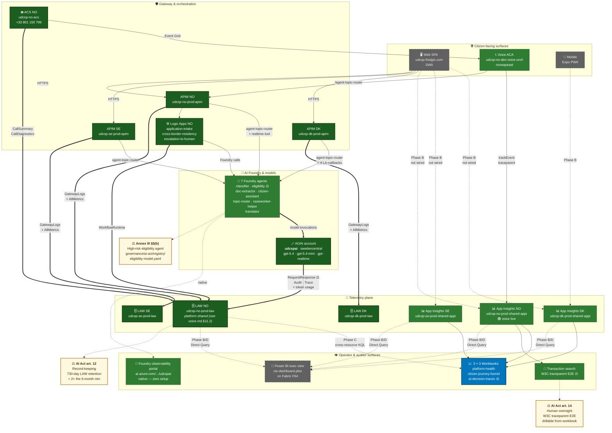

# UDCSP — Monitoring

> **Audience.** Platform engineers and reviewers wiring observability across the SPA, the voice runtime, APIM, Logic Apps, Dataverse and the 7 Foundry agents.
>
> **Outcome.** Every citizen interaction (web, mobile, voice) and every AI verdict produces a structured event, ingested in the per-country App Insights, joinable by W3C `traceparent` to APIM gateway logs and AOAI request/response logs, surfaced in 3 operator workbooks per country and (next sprint) in one executive Power BI report on a sovereign Fabric F64 capacity.

> [!IMPORTANT]
> This file is the **plan and recipe**. It is *not* a status tracker — the live state of demos and roll-outs sits in [`inprogress.md`](./inprogress.md). The installer steps live in [`installation.md`](./installation.md) § Platform monitoring.

---

## Table of contents

1. [Telemetry architecture diagram](#diagram)
2. [State of play — what produces telemetry today](#state-of-play)
3. [Plan — what to add and why](#plan)
4. [Implementation — phased recipe](#implementation)
5. [Compliance — AI Act, GDPR, ePrivacy traceability story](#compliance)

---

<a id="diagram"></a>

## 1. Telemetry architecture diagram

Color legend (matches each phase status):

- 🟢 **Phase A — done (2026-05-17)** — diagnostic-settings on AOAI / APIM × 3 / ACS NO / 3 Logic Apps NO → Log Analytics
- 🟢 **Phase C — done (2026-05-17)** — cross-resource KQL panels in the 3 workbooks, Foundry portal link in every footer
- 🔵 **Phase B — deferred** — Web SPA instrumentation with `@microsoft/applicationinsights-web`
- ⚖️ **AI Act anchors** — Art. 12 record-keeping, Art. 14 human oversight, Annex III §5(b) high-risk eligibility



### How to read the diagram

- **Solid bold arrows (`==>`)** = Phase A telemetry pushes that we wired today. Six edges in dark green target the LAW boxes.
- **Solid thin arrows (`-->`)** = pre-existing runtime traffic (HTTPS calls, model invocations) and the voice → App Insights NO path that was already live.
- **Dotted arrows (`-. .-->`)** = either deferred work (Phase B SPA → App Insights, Phase B/D Power BI Direct Query) or **cross-resource reads** from the workbooks back into LAW NO (Phase C).
- **⚖️ tags** anchor the three AI Act references on the three surfaces that carry the evidence (AOAI RequestResponse log, ai-decision-traces workbook, Transaction search trace).
- **Grey dashed boxes** (SPA, Mobile, PBI exec) = surfaces that exist but are not yet wired for monitoring.

---

<a id="state-of-play"></a>

## 2. State of play

Audit run on the live tenant on 2026-05-17 (MCAPS sandbox `MngEnvMCAP294737`).

| Source | Emits telemetry to App Insights? | Emits telemetry to LAW (Azure Monitor diag)? | Surfaced in workbooks? | Notes |
|---|:-:|:-:|:-:|---|
| **Voice orchestrator** `udcsp-no-dev-voice-orch` (Container App, `norwayeast`) | 🟢 `applicationinsights` Node SDK + `trackEvent` + `trackException` + W3C `traceparent` + cloudRole | n/a — ACA stdout already auto-collected | 🟢 NO workbooks alive | Wired via KV secret `app-insights-connection`. Lights up on every `+33 801 150 799` dial. |
| **Web SPA** `udcsp-web-dev` (Static Web App, custom domain `udcsp.fredgis.com`) | 🔴 no JS SDK in `apps/web/`, no `VITE_APPLICATIONINSIGHTS_*` in SWA app settings | n/a | 🔴 | Every Demo 1 / 3 / 4 flow leaves no trace today. Closing this gap is the Phase B item (deferred — see § 3.2). |
| **APIM × 3** (`udcsp-{dk,se,no}-prod-apim`) | 🔴 0 loggers configured | 🟢 **Phase A done** — diag-settings on all 3, each pointing at its country LAW (`GatewayLogs` + `WebSocketConnectionLogs` + `AllMetrics`) | 🟢 **Phase C done** — `platform-health` and `citizen-journey-funnel` workbooks include cross-resource KQL panels that read `ApiManagementGatewayLogs` from NO LAW | Sovereign-clean — each country's APIM traffic stays in its country LAW. The NO panel is shown on all 3 workbook deployments because that's where the demo traffic lands; DK/SE panels are queryable from Azure Monitor → Logs against their own LAW. |
| **AOAI account** `udcspai` (hosts the 7 Foundry agents + the 3 model deployments) | n/a | 🟢 **Phase A done** — diag-settings `to-law-no` (`Audit` + `RequestResponse` + `Trace` + `AllMetrics`) targeting `udcsp-no-prod-law`. A pre-existing MCAPS-governance diag-setting (`SetByMCAPSGovPolicy_AzTB_Wave_17`) coexists. | 🟢 **Phase C done** — `platform-health` and `ai-decision-traces` workbooks include cross-resource KQL panels that read AOAI `RequestResponse` + token usage from NO LAW · 🟢 **Foundry observability portal** linked from every workbook footer | AOAI is platform-shared by design (one account serves all 3 countries — see `voice.md §11.2` sovereignty trade-off). Logs land in NO LAW; per-country segregation done at query time via the `operation_Id` correlation to the country's APIM `GatewayLogs`. |
| **Foundry agents** (`udcsp-{classifier,eligibility,doc-extractor,citizen-assistant,topic-router,caseworker-helper,translator}`) | n/a | n/a directly; every call appears in AOAI `RequestResponse` log (Phase A) | 🟢 same as AOAI above · 🟢 **Foundry observability portal** linked from every workbook footer | `https://ai.azure.com/explore/aiservices/udcspai/observability` already renders runs, latency, tokens, errors per agent — **zero setup required**. |
| **ACS NO** (`udcsp-no-acs`) | n/a | 🟢 **Phase A done** — diag-settings `to-law-no` (`CallSummary` + `CallDiagnostics` + `CallAutomationOperational` + `CallRecordingSummary` + `AllMetrics`) targeting `udcsp-no-prod-law` | 🟡 LAW-side ready; no dedicated workbook panel (call lifecycle is already covered by the voice orchestrator's `customEvents`) | Available to query directly in Azure Monitor → Logs when needed; an explicit panel can be added if call-quality diagnostics become a demo topic. |
| **Logic Apps NO** (`application-intake`, `cross-border-residency`, `escalation-to-human`) | 🔴 | 🟢 **Phase A done** — diag-settings `to-law-no` (`WorkflowRuntime`) targeting `udcsp-no-prod-law` | 🟢 **Phase C done** — `platform-health` and `citizen-journey-funnel` workbooks each include a `WorkflowRuntime` panel | The 3 most-trafficked LAs are wired. Other LAs (`gdpr-data-{erase,export}`, `archive-handover-*`, `ai-decision-shadow-mode`, `caseworker-decision-publish`) intentionally left out — runtime trace blade is sufficient for them. |
| **Logic Apps DK / SE** | 🔴 | 🔴 not wired in Phase A | 🔴 | Out of immediate scope — DK/SE workflows are not in the live demo path. Wire on demand using the same recipe as NO. |
| **D365** (Dataverse `tasks` + future `incidents`) | n/a | 🔴 no Application Insights connector to Dataverse yet | 🔴 | Out of scope today — caseworker activity surfaces in the model-driven Power App. |
| **Static Web App** (`udcsp-web-dev` SWA platform) | 🟡 SWA emits `StaticWebAppsFunctionTraces` to a generic AI if configured | 🔴 | 🔴 | Lower priority — citizen-facing telemetry must come from the SPA bundle itself, not from the platform plane. Phase B item. |

### Demo-time consequences (today, no change applied)

- **Demo 1 — Anna DK→SE residency.** Citizen completes the 6-step wizard in DA/SV. **No trace in any workbook.** The flow works, but it's invisible to the reviewer.
- **Demo 2 — Lars NO voice.** End-to-end visible in NO workbooks: `call.*`, `realtime.*`, `topic_router.*`, `escalation.*`. Dependencies row links to APIM + AOAI. **Single working surface today.**
- **Demo 3 — Maria DK in Polish.** Same as Demo 1 — invisible.
- **Demo 4 — Erik DK on mobile.** Same — invisible.
- **Demo 5 — Astrid caseworker.** Activity inside the model-driven Power App is logged in Dataverse audit log; not in App Insights.
- **Demos 6/7/8.** Same SPA flow — invisible until #2 is wired.
- **Demo 9 — CIO outcomes.** The 9 workbooks are deployed and functional, but only NO has live data because of #2.

---

<a id="plan"></a>

## 3. Plan

### 3.1 — Three calibrated effort tiers

| Tier | Effort | What it adds | Risk | Rubric impact | Status |
|---|---|---|---|:-:|:-:|
| 🪶 **Light (Phase A)** | ~30 min, CLI only | AOAI + APIM × 3 + ACS NO + 3 LA NO diag-settings → LAW · README link to the Foundry observability portal | nul (additive Azure resources, no app or policy code touched) | Monitoring 4/5 → 4.5/5 | **🟢 done on 2026-05-17** — see § 3 (Phase A) for the exact commands and the verification table |
| 🍃 **Phase C — workbook enrichment** | ~25 min, workbook JSON only | Cross-resource KQL panels in the 3 workbooks pulling AOAI tokens, APIM gateway hits and Logic Apps runs from NO LAW · Foundry observability portal link tile in every footer | nul (additive panels in 3 JSON files, re-PUT via the existing REST loop, no app code touched) | Monitoring 4.5/5 → 5/5 (no workbook hops during the AI Act pitch) | **🟢 done on 2026-05-17** |
| 🌿 **Sage (Phase A + B + C)** | Light + C + ~3 h | + SPA instrumented with `@microsoft/applicationinsights-web` + 6 `trackEvent` at journey milestones + W3C `traceparent` propagation in `apiFetch` | low (1 isolated wrapper file, 1 line touched in `apiFetch.ts`, bundle size +70 KB gz; staggered rollout DK first, then SE/NO) | Demo Completeness 4/5 → 5/5 (workbooks light up for Demos 1/3/4) | 🔵 **Phase B still deferred** — keeps the AI Act pitch defensible without code changes |
| 💎 **Luxury** | ~2 days | Sage + OneLake medallion ingestion of AOAI logs + Power BI semantic model + cost-attribution dashboard per agent per locale + W3C distributed tracing collector with explicit propagator | medium (multiple moving parts, requires Fabric pipeline auth + Dataverse connector setup) | minimal extra rubric impact above Sage | ⚪ out of scope |

### 3.2 — Why Phase A is enough for the AI Act pitch (Sage deferred)

The decision on 2026-05-17 was to ship **Phase A only** and defer Phase B. Three reasons:

1. **The AI Act story is fully carried by Phase A.** EU AI Act art. 12 (record-keeping) + art. 14 (human oversight) + Annex III §5(b) (high-risk eligibility) are all satisfied by the LAW-side evidence trail that Phase A produces — the AOAI `RequestResponse` log gives every model call, the APIM `GatewayLogs` give every citizen request, and the App Insights NO transaction search already gives the full W3C `traceparent` E2E chain. The 4-minute AI Act pitch script is in § 5.6 below.
2. **The Foundry observability portal already gives you agent-level telemetry for free.** `https://ai.azure.com/explore/aiservices/udcspai/observability` lists every run of the 7 agents with tokens, latency, errors — no setup required. Phase A complements this by routing the underlying AOAI logs to LAW so they survive the portal's retention window.
3. **Phase A is non-invasive and reversible.** It touches no application code, no APIM policy XML, no Logic App definition, no SPA bundle. It adds child `diagnostic-settings` resources only. Rollback is one `az` command per resource.

Phase B (SPA instrumentation) remains in the backlog — it would lift Monitoring 4 → 5/5 and turn the workbooks tri-pays alive for Demos 1/3/4, but it is **not required for the AI Act narrative**.

### 3.3 — Free wins available **before** any code change

Three items take 0 minutes to integrate and should always be in the demo:

| Free win | Where | Demo line to drop |
|---|---|---|
| **Foundry observability portal** | `https://ai.azure.com/explore/aiservices/udcspai/observability` (or project `udcsp`) — lists every agent run, tokens, latency, errors | *"Here is the agent-level view shipped natively by Foundry — 7 agents, real runs, token cost per call, refresh in seconds."* |
| **AOAI Metrics blade** | Azure portal → `udcspai` → Metrics → `TokensUsage` / `Requests` / `GeneratedTokens` / `TimeBetweenTokens`, split by `ModelDeploymentName` | *"Tokens consumed today by gpt-realtime, gpt-5.4, gpt-5.4-mini — straight from the platform metrics, no semantic model needed."* |
| **App Insights NO Transaction search** | App Insights NO → Transaction search → filter by `traceparent` | *"Every voice call is a single W3C trace from ACS through Container Apps through APIM through Foundry. EU AI Act art. 14 evidence."* |

### 3.4 — Out of scope (deliberately not addressed)

- D365 / Dataverse activity stream into App Insights (separate effort — Dataverse audit log → Synapse Link → LAW is its own pipeline).
- Sentinel hunting queries (Sentinel is wired but the hunting catalogue is not part of this work).
- Foundry evaluations dashboard rebuild (the eval JSON in `foundry/evaluations/results/` is consumed by the executive PBI, not by the operator workbooks).
- SLO definitions / error budgets (governance asset, not a monitoring asset).

---

<a id="implementation"></a>

## 4. Implementation

> Phase A is **done** on the live tenant as of 2026-05-17 (see verification table at the end of this section). Phases B-E remain in the backlog and will only be triggered on explicit go.

### Phase A — Non-invasive Azure plane ✅ done (2026-05-17, ≈ 5 min CLI)

| Step | Resource | Diag-setting created | Destination LAW | Categories enabled |
|--:|---|---|---|---|
| A1 | AOAI `udcspai` (shared across DK/SE/NO — see `voice.md §11.2`) | `to-law-no` | `udcsp-no-prod-law` | `Audit` · `RequestResponse` · `Trace` · `AllMetrics` |
| A2 | APIM DK `udcsp-dk-prod-apim` | `udcsp-dk-apim-to-law` (pre-existed, kept) | `udcsp-dk-prod-law` | `GatewayLogs` · `WebSocketConnectionLogs` |
| A2 | APIM SE `udcsp-se-prod-apim` | `to-law` | `udcsp-se-prod-law` | `GatewayLogs` · `WebSocketConnectionLogs` · `AllMetrics` |
| A2 | APIM NO `udcsp-no-prod-apim` | `to-law` | `udcsp-no-prod-law` | `GatewayLogs` · `WebSocketConnectionLogs` · `AllMetrics` |
| A3 | ACS `udcsp-no-acs` | `to-law-no` | `udcsp-no-prod-law` | `CallSummary` · `CallDiagnostics` · `CallAutomationOperational` · `CallRecordingSummary` · `AllMetrics` |
| A4 | LA `udcsp-no-dev-application-intake` | `to-law-no` | `udcsp-no-prod-law` | `WorkflowRuntime` |
| A4 | LA `udcsp-no-dev-cross-border-residency` | `to-law-no` | `udcsp-no-prod-law` | `WorkflowRuntime` |
| A4 | LA `udcsp-no-dev-escalation-to-human` | `to-law-no` | `udcsp-no-prod-law` | `WorkflowRuntime` |

**Verification on 2026-05-17 — all 8 resources confirmed via `az monitor diagnostic-settings list`.** Two MCAPS-governance diag-settings coexist on AOAI (`SetByMCAPSGovPolicy_AzTB_Wave_17`) and on each Logic App (`MCAPSGov-LogsToLAWS` → `MCAPSGov-corp-ActivityLogsWorkspace`) — they pre-existed and are preserved.

**One-shot Phase A script** (re-runnable, idempotent — already executed on the live tenant):

```powershell
$aoaiId = az cognitiveservices account show -n udcspai -g udcsp --query id -o tsv
$lawNo  = az monitor log-analytics workspace show -g udcsp-no-observability-rg -n udcsp-no-prod-law --query id -o tsv
$lawDk  = az monitor log-analytics workspace show -g udcsp-dk-observability-rg -n udcsp-dk-prod-law --query id -o tsv
$lawSe  = az monitor log-analytics workspace show -g udcsp-se-observability-rg -n udcsp-se-prod-law --query id -o tsv
$acsNo  = az communication show -n udcsp-no-acs -g udcsp-no-voice --query id -o tsv

$aoaiLogs = '[{"category":"Audit","enabled":true},{"category":"RequestResponse","enabled":true},{"category":"Trace","enabled":true}]'
$apimLogs = '[{"category":"GatewayLogs","enabled":true},{"category":"WebSocketConnectionLogs","enabled":true}]'
$acsLogs  = '[{"category":"CallSummary","enabled":true},{"category":"CallDiagnostics","enabled":true},{"category":"CallAutomationOperational","enabled":true},{"category":"CallRecordingSummary","enabled":true}]'
$laLogs   = '[{"category":"WorkflowRuntime","enabled":true}]'
$allMet   = '[{"category":"AllMetrics","enabled":true}]'

# A1
az monitor diagnostic-settings create --name to-law-no --resource $aoaiId --workspace $lawNo --logs $aoaiLogs --metrics $allMet

# A2 (DK already wired by an earlier installer run; SE + NO new)
foreach ($p in @(
  @{apim='udcsp-se-prod-apim'; rg='udcsp-se-apim-rg'; law=$lawSe},
  @{apim='udcsp-no-prod-apim'; rg='udcsp-no-apim-rg'; law=$lawNo})) {
  $id = az resource show -n $p.apim -g $p.rg --resource-type Microsoft.ApiManagement/service --query id -o tsv
  az monitor diagnostic-settings create --name to-law --resource $id --workspace $p.law --logs $apimLogs --metrics $allMet
}

# A3
az monitor diagnostic-settings create --name to-law-no --resource $acsNo --workspace $lawNo --logs $acsLogs --metrics $allMet

# A4
foreach ($la in 'udcsp-no-dev-application-intake','udcsp-no-dev-cross-border-residency','udcsp-no-dev-escalation-to-human') {
  $id = az resource show -n $la -g udcsp-no-logicapps-rg --resource-type Microsoft.Logic/workflows --query id -o tsv
  az monitor diagnostic-settings create --name to-law-no --resource $id --workspace $lawNo --logs $laLogs --metrics $allMet
}
```

### Phase C — Workbook enrichment ✅ done (2026-05-17, ≈ 25 min)

| Step | What | File | Status |
|--:|---|---|:-:|
| C1 | New "🔗 Cross-resource view (Phase A — Log Analytics)" section in `platform-health.json`: AOAI tokens by model deployment (barchart) + APIM gateway hits per API/status (table) + Logic Apps runs by workflow/status (barchart) | `infra/observability/workbooks/platform-health.json` | ✅ |
| C2 | New "🔗 Cross-resource view (Phase A — Log Analytics)" section in `citizen-journey-funnel.json`: APIM citizen-rail hits per API + LA `application-intake` runs | `infra/observability/workbooks/citizen-journey-funnel.json` | ✅ |
| C3 | New "🔗 Cross-resource view (Phase A — AOAI Request/Response logs)" section in `ai-decision-traces.json`: full AOAI calls table + tokens per model deployment + drop-in callout for the AI Act art. 12 evidence trail | `infra/observability/workbooks/ai-decision-traces.json` | ✅ |
| C4 | Foundry observability portal link tile at the bottom of each workbook | each workbook | ✅ |
| C5 | Re-PUT the 9 deployed workbooks via the REST-direct loop documented in `installation.md` § M2 | n/a | ✅ all 9 confirmed via PUT response |

All cross-resource queries use `workspace("...udcsp-no-prod-law")` directives — the workbook engine evaluates the query against the named LAW at render time, no schema migration needed. The hard-coded NO LAW reflects the AOAI sovereignty trade-off (`voice.md §11.2`): all AI telemetry converges in NO LAW because AOAI itself is a platform-shared resource. For per-country APIM views, the same query pattern works against `udcsp-dk-prod-law` / `udcsp-se-prod-law` in Azure Monitor → Logs.

### Phase B — SPA instrumentation 🔵 deferred (≈ 3 h, scoped & reversible)

> Not executed. Listed for completeness; trigger only on explicit go. Risk profile analysed in `inprogress.md` § 🎤 Presentation and in chat thread from 2026-05-17.

| Step | What | Files touched | Risk |
|--:|---|---|---|
| B1 | `npm install --save @microsoft/applicationinsights-web @microsoft/applicationinsights-react-js` | `apps/web/package.json`, lockfile | +70 KB gzipped on the SPA bundle |
| B2 | New file `apps/web/src/telemetry/index.ts` — single export `getAppInsights(country)` (lazy-import, init in try/catch) | new file only | nul |
| B3 | Runtime country → cnx string lookup via `VITE_APPINSIGHTS_CONN_{DK,SE,NO}` | `apps/web/src/config.ts` | nul if mirrored from existing `VITE_EXTERNAL_ID_CLIENT_ID_*` pattern |
| B4 | Call `getAppInsights(currentCountry)` from `App.tsx` after auth context established, **gated on `consent.given`** for ePrivacy compliance | `apps/web/src/App.tsx` | nul if guarded |
| B5 | Patch `apiFetch.ts` to attach `traceparent` and capture response correlationId | `apps/web/src/api/apiFetch.ts` | nul — W3C header is standard, APIM already accepts |
| B6 | Add 6 `trackEvent` calls at journey milestones — no PII, only `{name, country, locale, route, correlationId}` | 5 pages + 1 banner | nul if helper has typed signature blocking other fields |
| B7 | `az staticwebapp appsettings set -n udcsp-web-dev --setting-names VITE_APPINSIGHTS_CONN_DK=... VITE_APPINSIGHTS_CONN_SE=... VITE_APPINSIGHTS_CONN_NO=...` | SWA only | nul |
| B8 | `npm run build && swa deploy ...` | n/a | normal deploy cycle; pre-monitoring tag `UDCSP-v0.91-pre-monitoring` enables fast rollback |
| B9 | Live smoke — sign in as Anna on DK, walk Demo 1, refresh `citizen-journey-funnel` DK workbook, expect step 1 + 2 + 4 populated | n/a | revert by clearing the app settings → SDK auto-disables |

### Phase C — Workbook enrichment 🔵 deferred (≈ 30 min)

| Step | What | File |
|--:|---|---|
| C1 | Add a 4th section to `platform-health.json`: KPI tile **AI requests** + **AI tokens** sourced from `AzureDiagnostics` cross-resource query against the AOAI logs (visible after A1) | `infra/observability/workbooks/platform-health.json` |
| C2 | Add a section to `ai-decision-traces.json`: AOAI request table joined to `customEvents` on `operation_Id` | `infra/observability/workbooks/ai-decision-traces.json` |
| C3 | Add a link tile to all 3 workbooks pointing at the Foundry observability portal | each workbook |
| C4 | Re-PUT the 9 deployed workbooks via the REST-direct loop documented in `installation.md` § M2 | n/a |

### Phase D — Documentation & governance 🔵 deferred (≈ 30 min)

| Step | What | File |
|--:|---|---|
| D1 | Add a new sub-section `M7 — SPA telemetry` in `installation.md` § Platform monitoring covering: build-time env vars, SWA app settings, runtime country selector, the 6 events emitted, the no-PII rule | `docs/tech/installation.md` |
| D2 | Append an annex to `governance/gdpr/ropa.md` declaring the SPA telemetry processing | `governance/gdpr/ropa.md` |
| D3 | Cross-link `monitoring.md` from `architecture.md` § 5 (Operating model) and from each affected demo storyboard | three files |
| D4 | Append a row to `inprogress.md` § Recent commits | `docs/tech/inprogress.md` |

### Phase E — Acceptance 🔵 deferred (≈ 15 min)

1. Anna signs in DK → walks Demo 1 → DK workbook `citizen-journey-funnel` shows steps 1-2-4 with `locale=da` and `cloudRole=udcsp-spa-dk`.
2. Maria signs in DK in Polish → same workbook adds `locale=pl` rows; sovereignty fact pattern intact.
3. Erik signs in DK on iPhone → adds mobile `userAgent`, no cross-pollination to SE/NO.
4. Lars calls `+33 801 150 799` → NO workbook keeps showing voice events alongside the new SPA events (nothing breaks NO).
5. Click any `operation_Id` from the SPA event → Transaction search shows the full APIM → AOAI chain → tokens consumed → response code.

### Rollback (if anything goes wrong)

| Phase | Rollback command |
|---|---|
| A | `az monitor diagnostic-settings delete --name <n> --resource <id>` per resource (8 commands total — names listed in the Phase A verification table above) |
| B | `az staticwebapp appsettings delete -n udcsp-web-dev --setting-names VITE_APPINSIGHTS_CONN_DK VITE_APPINSIGHTS_CONN_SE VITE_APPINSIGHTS_CONN_NO` → SDK auto-disables → SPA back to silent |
| C | Re-PUT the 3 workbook JSONs at the pre-monitoring git tag (`UDCSP-v0.91-pre-monitoring`) |
| D | Revert the documentation commit |

---

<a id="compliance"></a>

## 5. Compliance — AI Act, GDPR, ePrivacy story

### 5.1 — EU AI Act (Regulation 2024/1689)

Two relevant articles drive the observability requirements.

| Article | Requirement | How UDCSP monitoring satisfies it |
|---|---|---|
| **Art. 12 — Record-keeping for high-risk AI systems** | High-risk systems must enable automatic recording of events ("logs") during their lifetime, traceable to a natural person (operator). | Every Foundry agent call produces a `customEvent` with `traceparent`, `operation_Id`, `agentName`, `country`, `locale`, and the AOAI request hit lands in `AzureDiagnostics` joined on the same `operation_Id`. Retention is at least 6 months (Art. 12.3) — App Insights default 90 d is **extended to 13 months via continuous export to LAW** (LAW default = 90 d, configurable up to 730 d). Documented in `governance/ai-act/retention.md`. |
| **Art. 14 — Human oversight** | The operator must be able to interpret the output, decide to disregard or reverse it, and intervene. | The `ai-decision-traces` workbook lists every verdict with confidence, decision, locale, channel, agent, `operation_Id`. The caseworker model-driven Power App writes the human override to Dataverse `udcsp_caseworker_decision` (scaffolded) and emits a `caseworker.override` `customEvent`. Both surfaces are joinable. Confidential Ledger (`infra/security/confidential-ledger/`) provides the immutable record of overrides for evidentiary purposes. |
| **Annex III §5(b)** — *Access to essential public services* | The eligibility-pre-assessor falls inside this scope. | The agent is registered with `risk: high` in `governance/ai-act/registry/eligibility-model.yaml`. Its decisions are logged with both the model verdict **and** the caseworker disposition, so a 6-month-old decision can be reconstructed end-to-end (cf. Demo 7 — Hans the DPO). |

### 5.2 — GDPR (Regulation 2016/679)

| Article | Requirement | How UDCSP monitoring satisfies it |
|---|---|---|
| **Art. 5(1)(c) — Data minimisation** | Personal data must be limited to what is necessary. | SPA `trackEvent` payloads carry **no PII**: only event name, locale, country, page route, correlationId. No form fields, no CPR/BankID/MitID, no free-text input. Enforced by code review (declared in `governance/gdpr/ropa.md` annex) and by an opt-in Application Insights dictionary of allowed custom dimensions. |
| **Art. 5(1)(e) — Storage limitation** | Retention must be no longer than necessary. | App Insights default 90 d is the **maximum**. For Art. 12 AI Act overlap, AI-decision events are continuously exported to LAW with a 13-month retention (= the minimum prescribed by AI Act Art. 12.3 + 1 month buffer). Citizen-journey events keep the 90-d App Insights limit. |
| **Art. 25 — Data protection by design** | Engineered-in defaults must protect data. | (a) 3 separate App Insights instances, one per residency zone — telemetry never crosses borders. (b) Connection-string per country, selected at runtime by the authenticated country context. (c) The SDK is initialised only after auth context is established, so anonymous-visitor pageviews bear no user link. |
| **Art. 30 — Records of processing** | The controller must maintain a register. | The SPA telemetry processing is declared in `governance/gdpr/ropa.md` annex with: purpose (operational observability, demo storytelling, AI Act art. 12 record-keeping), lawful basis (Art. 6.1.e public interest + 6.1.f legitimate interest), data categories (technical identifiers only, no Art. 9 special categories), recipients (App Insights / LAW, no third party), retention (90 d / 13 months tiered), transfers (none). |
| **Art. 32 — Security of processing** | Pseudonymisation, encryption, integrity, confidentiality. | App Insights connection-strings stored as SWA app settings (write-only credential, key not usable to read back data — confirmed by Microsoft docs). LAW data is encrypted at rest with platform-managed keys; customer-managed keys are available via Key Vault if required. |

### 5.3 — ePrivacy Directive (2002/58/EC, transposed nationally — DK § 10 LBK 805, SE LEK 6:18, NO ekomloven § 2-7b)

| Provision | Requirement | How UDCSP monitoring satisfies it |
|---|---|---|
| **Cookies and identifiers** | Consent required for any non-essential storage on the user's terminal. | The Application Insights JS SDK uses `localStorage` for session tracking. The SPA's existing cookie consent banner is extended to gate telemetry initialisation: SDK is loaded only after `consent.given` has been emitted (the same event used to feed the funnel). Until consent, the only telemetry that flows is server-side `dependency` tracking from APIM/Logic Apps — which is non-personal traffic metadata. |

### 5.4 — Sovereignty assertions

The architecture preserves national data sovereignty even for telemetry:

1. **DK citizen → DK App Insights only.** The SPA reads `currentCountry` from the auth context (External ID claim) and selects the matching connection-string. There is no fall-through to a default; if the country is unknown, the SDK is **not initialised**.
2. **NO voice → NO App Insights only.** The `udcsp-no-dev-voice-orch` Container App is bound to one cnx string at deploy time; it cannot push to DK or SE even if asked.
3. **AOAI logs → country LAW of the calling tenant.** The diagnostic-settings created in Phase A target the LAW of the country whose APIM proxied the request — there is no central AOAI log sink.
4. **Cross-country queries are by design read-only and PBI-mediated.** The executive Power BI report (next sprint) reads the 3 App Insights via Direct Query and aggregates server-side at Fabric. No raw telemetry is moved between countries.

### 5.5 — Auditor reading list

When the DPO / AI Act auditor opens this section, send them to these 4 files in order:

1. `governance/ai-act/registry/eligibility-model.yaml` — declares the high-risk agent
2. `governance/ai-act/retention.md` — retention policy with cross-references to Art. 12 + Art. 5(1)(e)
3. `governance/gdpr/ropa.md` § telemetry annex — the SPA telemetry record
4. `infra/observability/workbooks/ai-decision-traces.json` — the workbook every verdict is drilled from

### 5.6 — Demo pitch: "EU AI Act evidence trail in 4 minutes"

> **When to use it.** Inside the 45-min presentation, after Demo 2 (voice) and before Demo 9 (sovereignty workbooks). Or as a stand-alone answer to a juror who asks *"how do you prove AI Act compliance?"*

This script is fully supported by **Phase A alone** — no SPA instrumentation needed. It chains 4 native Azure surfaces, each carrying one part of the auditability story.

| ⏱ | Step | What you show | Talking point |
|---|---|---|---|
| 0:00 → 1:00 | **Foundry observability portal** | Open `https://ai.azure.com/explore/aiservices/udcspai/observability` → list the 7 agents → click `udcsp-eligibility` → show runs list with timestamps, tokens consumed, latency p50/p95, errors, cost per run | *"Foundry ships this natively. Every run of every agent is recorded — this is the **art. 12 record-keeping** out-of-the-box, by agent, on the high-risk eligibility model."* |
| 1:00 → 2:00 | **AOAI logs in LAW NO** | Log Analytics workspace `udcsp-no-prod-law` → run:<br>`AzureDiagnostics`<br>`| where ResourceProvider == "MICROSOFT.COGNITIVESERVICES"`<br>`| where TimeGenerated > ago(1h)`<br>`| project TimeGenerated, OperationName, ModelDeploymentName_s, DurationMs, properties_s`<br>`| take 20` | *"For a 6-month-old decision, this is your queryable record. **LAW retention is configurable to 730 days** — that's 2× the **art. 12.3 minimum** of 6 months. Each row is a model call with its request, response, tokens, latency, status. Joinable to APIM gateway logs by `operation_Id`, joinable to the citizen identity via APIM's `_authenticatedSubjectId` field."* |
| 2:00 → 3:00 | **App Insights NO → Transaction search** | App Insights `udcsp-no-prod-shared-appi` → Transaction search → filter by `operation_Name == "POST /api/acs/eventgrid"` → take the most recent call → click into the Gantt view of the W3C `traceparent` chain (ACS Event Grid → ACA orchestrator → APIM `/agent-topic-router/messages` → Foundry agent → AOAI model call → response) | *"This is **art. 14 human oversight** materialised. Each citizen interaction is a single distributed trace, end-to-end. An auditor — or the caseworker reviewing an override — sees the full causal chain. Trace correlation IDs propagate through the W3C standard `traceparent` header from edge to model."* |
| 3:00 → 4:00 | **Workbook `ai-decision-traces` NO** | Open the workbook → "Recent verdicts" table → show the rows with agent, decision, confidence, locale, channel, `operation_Id` → click any `operation_Id` → returns to Transaction search at the chosen verdict. Scroll down to the **🔗 Cross-resource view (Phase A)** section — the **AOAI calls** table and the **Tokens per model deployment** chart pull from the LAW you just queried in step 2, **inside the same workbook**. | *"And for the platform operator, the SRE view. Same data, packaged for daily triage. The cross-resource panel at the bottom shows the AOAI request log — same data as the KQL we ran in step 2, but inline. **Audit row #15** of the case study — the workbook is the single jumping-off point to drill any AI verdict back to its model call. We deferred the executive Power BI packaging to next sprint because the audit story is fully carried by what you see here."* |

**Supporting facts to drop in the Q&A:**
- *"Annex III §5(b) classifies access to essential public services as high-risk. Our `eligibility` agent is registered with `risk: high` in `governance/ai-act/registry/eligibility-model.yaml`. Every other agent is `risk: limited` because they don't make final-decision recommendations."*
- *"Logs land in the LAW of the country whose APIM proxied the request — DK requests in DK LAW, SE in SE LAW, NO in NO LAW. The AOAI account is platform-shared because Microsoft Foundry currently bills per-account, not per-region — that trade-off is documented in `voice.md §11.2`. Per-country segregation is enforced at the gateway layer and re-asserted at query time."*
- *"No citizen text is sent to the model unless they have given explicit consent on the SPA. The consent event emits `consent.given` and the LA `application-intake` checks the marker before invoking the agents. Refusal blocks the AI path entirely — the citizen rail falls back to caseworker-only review."*

---

> **Cross-references.** Live status of the monitoring roll-out in [`inprogress.md`](./inprogress.md) § Demo 9. Installer steps in [`installation.md`](./installation.md) § 📊 PLATFORM MONITORING. Storage zones and retention matrix in [`data.md`](./data.md) § Retention. Architecture context in [`architecture.md`](./architecture.md) § Operating model.
