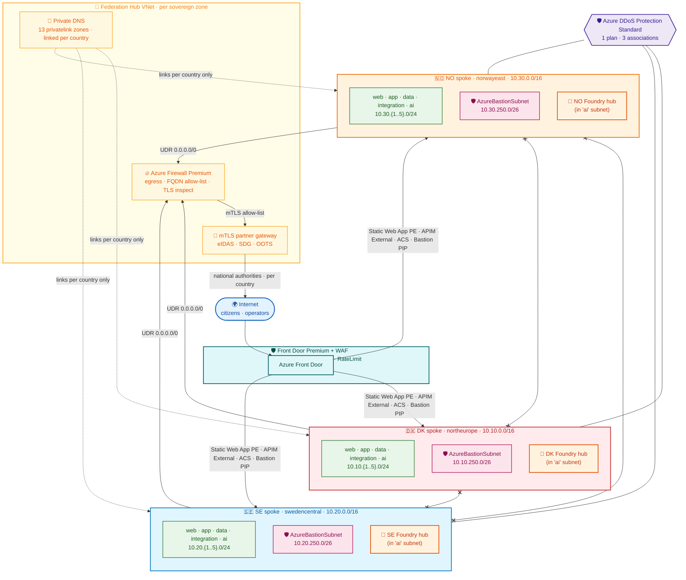

# 🌐 Network Architecture

> **Every packet's path, every private endpoint, every NSG, every public IP.** Companion to [`architecture.md`](./architecture.md) (the *what is built*) and [`data.md`](./data.md) (the *where bytes live*). This document is the **network truth**: 3 sovereign spokes, 1 optional federation hub, 18 named subnets, ~25 private endpoints, 1 public IP per country (Bastion only), 0 shared data path.

---

> [!IMPORTANT]
> **TL;DR.** Each country (DK · SE · NO) runs in its own `/16` spoke VNet, in its own Azure region, in its own RG, with its own **Foundry hub** in the `ai` subnet. Every PaaS that touches citizen data is reached via **Private Endpoint** with `publicNetworkAccess: Disabled`. The **only public IP per country** is the Azure Bastion PIP — all admin access funnels through it (no jump-box, no public NICs). The **federation hub VNet** is a **production-grade always-on component** that hosts the **Azure Firewall Premium** (forced egress + FQDN allow-list + TLS inspection), the **Private DNS zones** (linked per country only), the **mTLS partner gateway** (eIDAS / EU SDG / OOTS), the **Azure Lighthouse + cross-tenant B2B** plane, and a **hub-level Sentinel** for cross-zone correlation. The **LandingZone module is the single ARM owner of every subnet** (including `AzureBastionSubnet`); all downstream modules reference subnets via `existing` to keep redeploys idempotent. One **Azure DDoS Protection Standard** plan covers all 3 spokes via one association per VNet.
>
> 📐 The accompanying schematic is generated from [`network.drawio`](./network.drawio) and exported below as [`network.png`](./network.png). Re-render with the `drawio2png` skill if you edit the source.
>
> 🔧 **Owner:** Landing Zone module · **Implemented in:** `infra/landing-zone/modules/networking.bicep` · **Last reviewed:** 2026-05-17.

---

## 📑 Table of contents

1. [Design principles](#1-design-principles)
2. [Address plan](#2-address-plan)
3. [Topology overview](#3-topology-overview)
4. [Connectivity matrix](#4-connectivity-matrix)
5. [Private Endpoint inventory](#5-private-endpoint-inventory)
6. [Azure Bastion — sole admin shell path](#6-azure-bastion--sole-admin-shell-path)
7. [DDoS protection](#7-ddos-protection)
8. [Identity & cross-tenant flows](#8-identity--cross-tenant-flows)
9. [Idempotency guardrails (lessons learned)](#9-idempotency-guardrails-lessons-learned)
10. [References](#10-references)

---

## 1. Design principles

| # | Principle | Why |
|---|-----------|-----|
| 1 | **Per-country sovereign spoke VNet** | Each citizen-data plane (DK, SE, NO) lives in its own VNet, in its own Azure region, in its own resource group. No cross-country data path at network layer. |
| 2 | **Hub-and-spoke production topology** | Each spoke peers to the **federation hub VNet** per sovereign zone. The hub is **always deployed in production** (no longer optional) and hosts: Azure Firewall Premium (forced egress for every spoke via UDR `0.0.0.0/0`), the per-country Private DNS Zones, the mTLS partner gateway, the Lighthouse/B2B plane, and the hub-level Sentinel. The `hubVnetId` parameter on each spoke is mandatory in PROD. |
| 3 | **Private endpoints by default** | Every PaaS service that touches citizen data (Key Vault, Storage Account, ACR, PostgreSQL, Redis Enterprise, Recovery Services Vault) has `publicNetworkAccess: Disabled` and is reached via a Private Endpoint inside the spoke. |
| 4 | **One public IP exception: Azure Bastion** | The only public IP per country is the Bastion `pip`. All admin sessions go through Bastion → no jump-box, no NIC-level public IPs anywhere else. Tagged `publicIpException: 'azure-bastion-only'` for Policy enforcement. |
| 5 | **NSG per subnet, not per workload** | Each named subnet (web, app, data, integration, ai) gets its own NSG. Default-deny inbound from Internet; rules are added by capability modules. |
| 6 | **LandingZone owns ALL subnets** | The LZ is the single ARM owner of subnet definitions including `AzureBastionSubnet`. Every other module (Bastion, future Postgres delegated subnet, APIM premium, etc.) references subnets via `existing` so re-deploying the LZ stays idempotent and cannot accidentally drop in-use subnets. |
| 7 | **DDoS Protection Plan attached** | One Azure Standard DDoS Protection Plan in the shared region covers all 3 spoke VNets. The attachment is performed by re-deploying the LandingZone with `ddosProtectionPlanId` set, so the VNet stays owned by a single Bicep module (no risk of subnet wipe). |
| 8 | **Azure Firewall Premium as the single egress** | One Azure Firewall Premium per sovereign zone (in the federation hub VNet) is the only path out of any spoke subnet. UDRs on every spoke subnet force `0.0.0.0/0` to the firewall; FQDN allow-lists enforce least-privilege egress per workload type. TLS inspection is on for non-Microsoft destinations. |
| 9 | **Per-country Private DNS Zones** | One zone per `privatelink.*` surface, linked to the country VNet only. No cross-country DNS resolution; a DK workload cannot resolve a SE Private Endpoint FQDN even if it had network reachability. See §5 for the zone inventory. |
| 10 | **mTLS to every national authority** | Logic App `partner-cert-rotate` rotates per-partner client certs in the country Key Vault; APIM presents the cert on every outbound call. Inbound from partners (when applicable) is the same pattern reversed. |

---

## 2. Address plan

The 3 country spokes use disjoint, RFC1918, `/16` blocks. Subnetting is fully derived from the country prefix via `cidrSubnet()` so the layout is identical across countries.

| Country | Region | RG | VNet CIDR |
|---------|--------|----|----|
| DK | `northeurope` | `udcsp-dk-prod-platform-rg` | `10.10.0.0/16` |
| SE | `swedencentral` | `udcsp-se-prod-platform-rg` | `10.20.0.0/16` |
| NO | `norwayeast` | `udcsp-no-prod-platform-rg` | `10.30.0.0/16` |

Inside each spoke (replace `X` with `10`/`20`/`30`):

| Subnet | CIDR | NSG | Purpose | Hosts |
|--------|------|-----|---------|-------|
| `web` | `10.X.1.0/24` | `udcsp-{c}-prod-web-nsg` | Public-facing front door / APIM ingress, Static Web App PEs | Front Door origin PE, Static Web App PE, public TLS termination |
| `app` | `10.X.2.0/24` | `udcsp-{c}-prod-app-nsg` | Containerized workloads (Container Apps env, Functions Premium VNet integration) | Voice Call-Automation, agent runtime, Logic Apps Standard |
| `data` | `10.X.3.0/24` | `udcsp-{c}-prod-data-nsg` | Private Endpoints for stateful PaaS | KV PE, Storage Lake PE, PostgreSQL PE, Redis Enterprise PE, RSV PE, Confidential Ledger PE |
| `integration` | `10.X.4.0/24` | `udcsp-{c}-prod-integration-nsg` | Service Bus / ACR / Event Grid / APIM private endpoints | ACR PE, APIM internal-mode (when applicable), Service Bus PE |
| `ai` | `10.X.5.0/24` | `udcsp-{c}-prod-ai-nsg` | Foundry / Cognitive Services egress, Confidential Compute pools | Foundry PE, Confidential Compute VMSS NICs |
| `AzureBastionSubnet` | `10.X.250.0/26` | (Azure-managed default) | Reserved for Azure Bastion only — name + size mandated by the service | Bastion host NICs |

`privateEndpointNetworkPolicies` is `Disabled` on all 5 named subnets so PEs can be created without NSG-rule rewrites; NSGs still apply to the workload NICs in those subnets.

The Bastion subnet sits at `.250.0/26` (offset index `1000` in `cidrSubnet(addr, 26, 1000)`) — far enough from `.1.0`–`.5.0` to leave room for future workload subnets without re-numbering.

---

## 3. Topology overview

> **Legend** — solid arrows = ingress through Front Door + WAF, or forced egress through Azure Firewall; dashed arrows = Private DNS zone-to-VNet links (one zone linked to one country only); `x--x` lines = **no** spoke-to-spoke peering (cross-country flows must traverse the federation hub via the mTLS gateway, and are explicitly allow-listed by APIM policy + Azure Firewall application rules).

The 3 spokes are isolated from each other at L3 — there is no spoke-to-spoke peering. **Egress is forced through Azure Firewall** so a workload cannot break out directly to the Internet. **Private DNS zones are linked per country only** so the FQDN of a SE Private Endpoint cannot be resolved from a DK workload. Cross-country flows always traverse the federation hub and are policy-controlled at both the L7 (APIM) and L3/L4 (Azure Firewall) layers.

---

## 4. Connectivity matrix

### 4.1 Inbound (Internet → spoke)

| Surface | Path | Notes |
|---------|------|-------|
| Citizen web/chat UI | Internet → Azure Front Door (**Premium, WAF**) → origin = Static Web App PE in `web` subnet | TLS 1.3; WAF in **Prevention** mode with `DefaultRuleSet 2.1` (OWASP CRS 3.3-derived) + `MicrosoftDefaultRuleSet 1.0` for bot protection + a tenant `RateLimitRuleSet` per citizen IP (200 req / 5 min on `/api/*`); Defender for APIs onboarded. |
| Citizen voice | Internet → ACS (managed) → voice orchestrator Container App in `app` subnet | ACS is a Microsoft-hosted PaaS; the orchestrator runtime is private. One toll-free PSTN number per country. |
| APIM gateway | Internet → APIM (External, Premium) → backends via VNet integration in `app` / `integration` | APIM rate-limit policy enforced for `/agents/topic-router/messages` (see `services/apim`); per-channel actor enforcement; mTLS to partner backends. |
| Admin (operators only) | Internet → Azure Bastion PIP → SSH/RDP to NICs inside the spoke | Only one public IP per country; Conditional Access + PIM required; tagged `publicIpException: 'azure-bastion-only'`. |

### 4.2 Outbound (spoke → Internet / Azure)

- **Default egress** — **Azure Firewall Premium** in the country federation hub (one per sovereign zone). All workload egress is forced via UDR through the firewall — no Internet break-out from any spoke subnet. Per-workload FQDN allow-lists enforce least privilege:
  - Agents (`ai` subnet) reach `*.cognitiveservices.azure.com`, `*.openai.azure.com`, `*.api.cognitive.microsoft.com` only.
  - Logic Apps (`integration` subnet) reach the published partner-agency endpoints listed in [`architecture.md §2.3`](./architecture.md) plus eIDAS / EU SDG / OOTS gateways — strictly per-country (DK LA never reaches a SE partner).
  - Container Apps (`app` subnet) reach ACR, Microsoft Graph, Entra token endpoints.
  - TLS inspection is on for HTTP egress to non-Microsoft destinations (citizen documents never leak through an unintended TLS path).
- **Private** — Foundry, Storage, KV, ACR, Postgres, Redis, RSV, Confidential Ledger, AI Search are reached via **Private Endpoint only**; their public endpoints are disabled (`publicNetworkAccess: Disabled`).
- **Microsoft Graph** (Identity / Verified ID / Priva / Purview management) — reached via Service Tag rules in NSGs + Azure Firewall application rules; APIs are public Microsoft endpoints under EU Data Boundary.
- **National-authority bridge egress** (unified-platform integration plane) — Logic Apps + APIM in `integration` reach the public HTTPS endpoints of the national authorities listed in `architecture.md §2.3` — borger.dk / lifeindenmark.dk / SKAT / Udbetaling DK (DK), Skatteverket / Försäkringskassan / BankID / Freja+ (SE), Skatteetaten / NAV / Altinn / UDI / ID-porten (NO). All egress is **mTLS to the partner**, with client certs in the country Key Vault rotated by Logic App `partner-cert-rotate`. Egress is per-country sovereign (DK Logic Apps only call DK authorities, never SE or NO), and the per-country NAT/Firewall PIP is allow-listed at the partner endpoint where the partner publishes such an allow-list. eIDAS / EU SDG / OOTS gateways follow the same mTLS pattern with EU-trust-list issued certificates.

### 4.4 Public ingress hostnames (production)

| Hostname | Backend | Notes |
|---|---|---|
| `udcsp.fredgis.com` | Azure Static Web App `udcsp-web-dev` (custom domain, ACME-managed cert, `cname-delegation` validated) | Citizen portal — single canonical origin; CNAME → `<swa-name>.azurestaticapps.net`. All External ID redirect URIs and APIM `portal-origin` CORS named-values point here (see `installation.md §POST CONFIGURATION → Step 0`). |
| `udcsp-{dk,se,no}-prod-apim.azure-api.net` | APIM Premium per country (External SKU) | `agent-topic-router` + `citizen-applications` + MI-proxy operations. Front Door custom domain on top is planned but not yet live. |

### 4.3 East-west (intra-spoke)

- `web` → `app` : APIM dispatch + Front Door origin → containerised agents.
- `app` → `data` : workloads → PEs of KV/Postgres/Redis/Storage.
- `app` → `integration` : workloads → ACR pulls, Service Bus, APIM internal.
- `app` → `ai` : workloads → Foundry PE, Confidential Compute attestation.
- `AzureBastionSubnet` → any : SSH/RDP via Bastion only.

NSG inter-subnet rules are restricted to the explicit pairs above; everything else is denied by the subnet-level NSG.

---

## 5. Private Endpoint inventory

Per country, the LandingZone module creates these PEs out of the box (commit `be46598`):

| Service | Subnet | PE name pattern | DNS zone |
|---------|--------|-----------------|----------|
| Key Vault | `data` | `udcsp-{c}-prod-kv-pe` | `privatelink.vaultcore.azure.net` |
| Storage Lake (ADLS Gen2) | `data` | `udcsp-{c}-prod-lake-pe` | `privatelink.dfs.core.windows.net` |
| Container Registry (ACR Premium) | `integration` | `udcsp-{c}-prod-acr-pe` | `privatelink.azurecr.io` |

Added by capability modules:

| Service | Subnet | Module |
|---------|--------|--------|
| PostgreSQL Flexible | `data` | `infra/data/postgresql/postgresql-flexible.bicep` |
| Redis Enterprise | `data` | `infra/data/redis/redis-enterprise.bicep` |
| Recovery Services Vault | `data` | `infra/security/backup-asr/recovery-services-vault-country.bicep` |
| Confidential Ledger | `data` | `infra/security/confidential-ledger/confidential-ledger.bicep` |
| Foundry / AI Services | `ai` | `infra/foundry/*` |
| Azure AI Search | `ai` | `infra/data/ai-search/*` |
| Service Bus | `integration` | `infra/integration/service-bus/*` |

### 5.1 Private DNS Zones (one per surface, per country)

| Zone | Linked to VNet(s) | Resolved Private Endpoints |
|---|---|---|
| `privatelink.vaultcore.azure.net` | DK · SE · NO (3 zones, 1 link each) | Key Vault |
| `privatelink.dfs.core.windows.net` | DK · SE · NO | ADLS Gen2 / Storage |
| `privatelink.blob.core.windows.net` | DK · SE · NO | Blob endpoint of ADLS |
| `privatelink.azurecr.io` | DK · SE · NO | ACR |
| `privatelink.postgres.database.azure.com` | DK · SE · NO | PostgreSQL Flexible |
| `privatelink.redisenterprise.cache.azure.net` | DK · SE · NO | Redis Enterprise |
| `privatelink.confidential-ledger.azure.com` | DK · SE · NO | Confidential Ledger |
| `privatelink.cognitiveservices.azure.com` | DK · SE · NO | Foundry hub + AI Services |
| `privatelink.openai.azure.com` | DK · SE · NO | AOAI deployments (per-hub) |
| `privatelink.search.windows.net` | DK · SE · NO | AI Search (per-hub) |
| `privatelink.servicebus.windows.net` | DK · SE · NO | Service Bus |
| `privatelink.azure-api.net` | DK · SE · NO | APIM (if private) |
| `privatelink.eventgrid.azure.net` | DK · SE · NO | Event Grid topics |

> **Sovereignty enforcement.** A given zone is **linked to its country VNet only**. A DK workload cannot resolve a SE Private Endpoint FQDN even if a network path existed — the DNS resolution itself fails. This is the second line of defence on top of the no-spoke-peering rule in §3.

All PE-fronted resources have `publicNetworkAccess: Disabled` enforced in their bicep.

---

## 6. Azure Bastion — sole admin shell path

- One Bastion **per country** (Standard SKU, IP Connect + native client tunneling enabled).
- One **Standard public IP** per Bastion (`udcsp-{c}-prod-bastion-pip`) — this is the only public IP allowed outside Front Door / APIM.
- Subnet `AzureBastionSubnet` (mandatory name) at `.250.0/26`, owned by the LandingZone (see commit `8ee3227` rationale).
- Tagged `sovereigntyPolicy: 'bastion-public-ip-only'` for Azure Policy detection of any other Public IP creation.

---

## 7. DDoS protection

- One Azure Standard DDoS Protection Plan in the shared platform RG (`infra/security/ddos/ddos-protection-plan.bicep`).
- **Attachment goes through the LandingZone**, not a standalone module. `infra/landing-zone/modules/networking.bicep` exposes an optional `ddosProtectionPlanId` parameter; when set, the spoke VNet's `properties` are merged via `union()` to add `enableDdosProtection: true` + `ddosProtectionPlan.id`. Subnets are untouched.
- `Install-Ddos.psm1` orchestrates: (1) deploy the plan once, (2) re-deploy each country's LandingZone with `--parameters ddosProtectionPlanId=<id>`. The re-deploy is idempotent — only the VNet PUT changes, every subnet/PE/NSG is a no-op.
- Why not a standalone `vnet-association.bicep`? Because that would re-declare the VNet shape and any drift in `subnets[]` (default `[]`) would **delete every Private Endpoint subnet** of the spoke. Single-owner-per-resource is the iron rule of this LZ.
- Covers the Bastion PIP and all future Front Door origin PIPs.

---

## 8. Identity & cross-tenant flows

These are not L3 paths but illustrate the **trust boundaries** that surround the network:

| Flow | Tenant A | Tenant B | Transport |
|------|----------|----------|-----------|
| Citizen sign-in (DK) | `udcspdk.onmicrosoft.com` (External ID CIAM) | UDCSP platform tenant (`MngEnvMCAP294737`) | OIDC over HTTPS via Microsoft Graph endpoints |
| Verified ID issuance | UDCSP platform tenant (issuer authority) | Citizen wallet (any) | DIDComm / OpenID4VC over HTTPS |
| MS Graph admin | UDCSP platform tenant | Microsoft Graph API | HTTPS, Conditional Access |

External ID tenants are **separate Microsoft Entra tenants** with their own boundary — no VNet peering, no Private Endpoint. Communication is exclusively Graph/OIDC over the public Microsoft endpoints from inside the spoke.

---

## 9. Idempotency guardrails (lessons learned)

The most subtle network failure modes the installer has hit (and now guards against):

| Failure | Root cause | Guardrail |
|---------|------------|-----------|
| `InUseSubnetCannotBeDeleted: AzureBastionSubnet` | LZ re-deploy didn't list the Bastion subnet → ARM tried to drop it | LZ now declares `AzureBastionSubnet` inline; Bastion module references it via `existing` (commit `8ee3227`). |
| `InUsePrefixCannotBeDeleted: 10.X.250.0/26` | Different CIDR computed by LZ vs Bastion → ARM tried to change the prefix on an in-use subnet | Both modules now derive the prefix from the same `cidrSubnet(addressPrefix, 26, 1000)` (commit `be46598`). |
| `InUseSubnetCannotBeDeleted: data` (KV/ACR/Lake PEs attached) | Migration from inline to child subnet resources triggered DELETE+CREATE on subnets that already had PEs | Reverted to inline subnets — the LZ is the single ARM owner; no other module re-declares them. |
| Bastion DK deploy lands in SE/NO RGs | Old Bastion bicep iterated over countries inside one deploy | Refactored to single-country (`@allowed(['dk','se','no']) param country`); installer loops per country (commit `552a5aa`). |

---

## 10. References

- `infra/landing-zone/modules/networking.bicep` — VNet + subnets + NSGs + optional hub peering.
- `infra/landing-zone/main.bicep` — orchestrates network + KV PE + Lake PE + ACR PE per country.
- `infra/landing-zone/parameters/{dk,se,no}.bicepparam` — country CIDR + region.
- `infra/identity/bastion/bastion.bicep` — Bastion host + PIP, references `AzureBastionSubnet` via `existing`.
- `infra/security/ddos/ddos-protection-plan.bicep` — DDoS Protection Standard plan (per-spoke attachment lives in the LandingZone, see §7).
- `docs/tech/architecture.md` — full platform architecture (this doc is the network-only deep dive).
- `docs/tech/installation.md` — phase ordering and prerequisites; LandingZone is phase A1.
