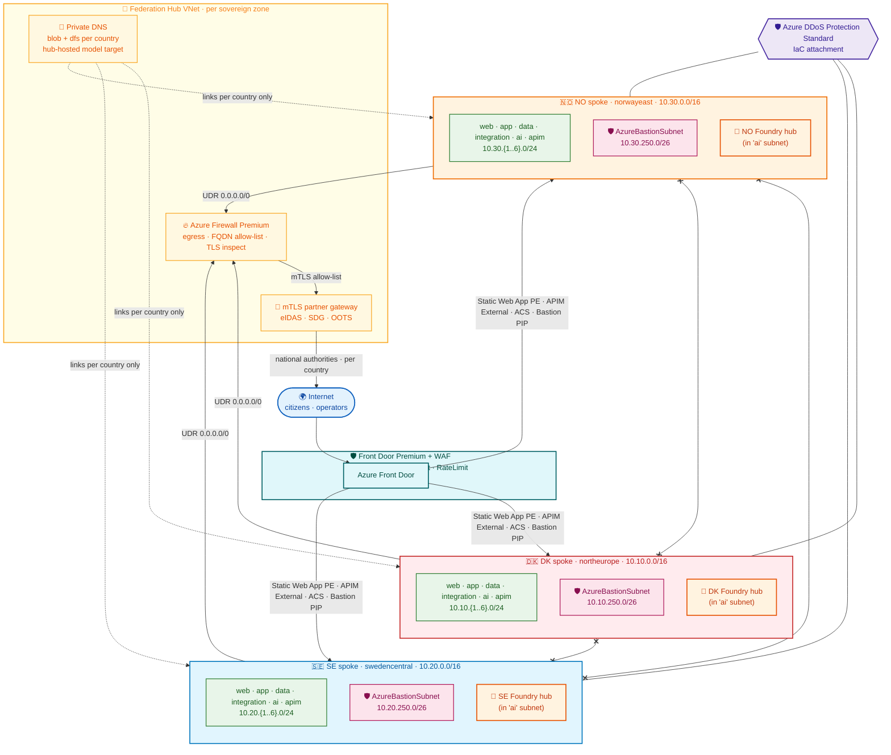

# 🌐 Network Architecture

> **Every packet's path, every private endpoint, every NSG, every public IP.** Companion to [`architecture.md`](./architecture.md) (the *what is built*) and [`data.md`](./data.md) (the *where bytes live*). This document is the **network truth**: 3 sovereign spokes, 1 optional federation hub, 18 named workload subnets plus 3 Bastion subnets, ~28 private endpoints, 2 public IPs per country (Bastion and APIM), 0 shared data path.

_Last verified: 2026-07-26 · commit 5a8d591_

---

> [!IMPORTANT]
> **TL;DR.** Each country (DK · SE · NO) runs in its own `/16` spoke VNet, in its own Azure region, in its own RG, with its own **Foundry hub** in the `ai` subnet. Every PaaS that touches citizen data is reached via **Private Endpoint** with `publicNetworkAccess: Disabled`. 🟢 **Live**: the citizen document-upload path now uses APIM managed identity to PUT to the storage **blob** endpoint through a blob Private Endpoint and country-linked `privatelink.blob.core.windows.net` DNS. 🟢 **Live**: each country has two public IPs, the Azure Bastion PIP for admin access and the APIM Standard static PIP required for External-mode stv2 VNet injection. There are still no jump-boxes and no NIC-level public IPs. 🗺️ **Roadmap**: the federation hub VNet, Azure Firewall Premium forced egress, mTLS partner gateway, hub-hosted DNS model, Lighthouse/B2B plane and hub-level Sentinel are target design unless their deployment is proven separately. The **LandingZone module is the single ARM owner of every subnet** (including `AzureBastionSubnet`); the private upload patch adds the `apim` subnet until the IaC catches up. 🔵 **In repo**: Azure DDoS Protection Standard IaC exists and attaches through the LandingZone when configured.
>
> 📐 The accompanying schematic is generated from [`network.drawio`](./network.drawio) and exported below as [`network.png`](./network.png). Re-render with the `drawio2png` skill if you edit the source.
>
> 🔧 **Owner:** Landing Zone module · **Implemented in:** `infra/landing-zone/modules/networking.bicep` · **Last reviewed:** 2026-05-17.

---

## 📑 Table of contents

1. [Design principles](#1-design-principles)
2. [Address plan](#2-address-plan)
3. [Topology overview](#3-topology-overview)
4. [Connectivity matrix](#4-connectivity-matrix)
5. [Private Endpoint inventory](#5-private-endpoint-inventory)
6. [Public IP exceptions and Bastion admin path](#6-public-ip-exceptions-and-bastion-admin-path)
7. [DDoS protection](#7-ddos-protection)
8. [Identity & cross-tenant flows](#8-identity--cross-tenant-flows)
9. [Idempotency guardrails (lessons learned)](#9-idempotency-guardrails-lessons-learned)
10. [References](#10-references)

---

## 1. Design principles

| # | Principle | Why |
|---|-----------|-----|
| 1 | **Per-country sovereign spoke VNet** | Each citizen-data plane (DK, SE, NO) lives in its own VNet, in its own Azure region, in its own resource group. No cross-country data path at network layer. |
| 2 | **Hub-and-spoke target topology** | 🗺️ **Roadmap**: each spoke peers to the **federation hub VNet** per sovereign zone. The hub target hosts Azure Firewall Premium, the hub-hosted Private DNS model, the mTLS partner gateway, the Lighthouse/B2B plane and hub-level Sentinel. The current repo keeps `hubVnetId` optional and the checked-in country parameters are empty, so do not treat the hub path as proven 🟢 **Live** from this file alone. |
| 3 | **Private endpoints by default** | Every PaaS service that touches citizen data (Key Vault, Storage Account, ACR, PostgreSQL, Redis Enterprise, Recovery Services Vault) has `publicNetworkAccess: Disabled` and is reached via a Private Endpoint inside the spoke. |
| 4 | **Two public IP exceptions: Bastion and APIM** | 🟢 **Live**: each country has a Bastion `pip` for admin access and an APIM Standard static `pip` for External-mode stv2 VNet injection. Admin sessions still go through Bastion, with no jump-box and no NIC-level public IPs. Policy tags such as `publicIpException` and `sovereigntyPolicy` must account for both approved exceptions. |
| 5 | **NSG per subnet, not per workload** | Each named workload subnet (web, app, data, integration, ai, apim) gets its own NSG. Default-deny inbound from Internet; rules are added by capability modules or the private upload patch. |
| 6 | **LandingZone owns ALL subnets** | The LZ is the single ARM owner of subnet definitions including `AzureBastionSubnet`. Every other module (Bastion, later Postgres delegated subnet, APIM premium, etc.) references subnets via `existing` so re-deploying the LZ stays idempotent and cannot accidentally drop in-use subnets. |
| 7 | **DDoS Protection Plan attached** | 🔵 **In repo**: Azure Standard DDoS Protection Plan IaC exists and attaches by re-deploying the LandingZone with `ddosProtectionPlanId` set, so the VNet stays owned by a single Bicep module and avoids subnet wipe. |
| 8 | **Azure Firewall Premium as the single egress** | 🗺️ **Roadmap**: one Azure Firewall Premium per sovereign zone in the federation hub VNet becomes the controlled path out of spoke subnets. UDRs on spoke subnets force `0.0.0.0/0` to the firewall; FQDN allow-lists enforce least-privilege egress per workload type. TLS inspection applies to non-Microsoft destinations. |
| 9 | **Per-country Private DNS Zones** | 🟢 **Live** for the private upload path: `privatelink.blob.core.windows.net` and `privatelink.dfs.core.windows.net` are created in each country platform RG and linked to that country VNet. The hub-hosted central DNS model remains 🗺️ **Roadmap** unless deployment evidence is added. See §5 for the zone inventory. |
| 10 | **mTLS to every national authority** | 🗺️ **Roadmap** unless deployment evidence is added: Logic App `partner-cert-rotate` rotates per-partner client certs in the country Key Vault; APIM presents the cert on every outbound call. Inbound from partners, when applicable, uses the same pattern reversed. |

---

## 2. Address plan

The 3 country spokes use disjoint, RFC1918, `/16` blocks. Subnetting is fully derived from the country prefix via `cidrSubnet()` so the layout is identical across countries.

| Country | Region | RG | VNet CIDR |
|---------|--------|----|----|
| DK | `northeurope` | `udcsp-dk-prod-platform-rg` | `10.10.0.0/16` |
| SE | `swedencentral` | `udcsp-se-prod-platform-rg` | `10.20.0.0/16` |
| NO | `norwayeast` | `udcsp-no-prod-platform-rg` | `10.30.0.0/16` |

Inside each spoke (replace `X` with `10`/`20`/`30`):

| Subnet | CIDR | NSG | Purpose | Hosts |
|--------|------|-----|---------|-------|
| `web` | `10.X.1.0/24` | `udcsp-{c}-prod-web-nsg` | Public-facing front door / APIM ingress, Static Web App PEs | Front Door origin PE, Static Web App PE, public TLS termination |
| `app` | `10.X.2.0/24` | `udcsp-{c}-prod-app-nsg` | Containerized workloads (Container Apps env, Functions Premium VNet integration) | Voice Call-Automation, agent runtime, Logic Apps Standard |
| `data` | `10.X.3.0/24` | `udcsp-{c}-prod-data-nsg` | Private Endpoints for stateful PaaS | KV PE, Storage Lake PE, PostgreSQL PE, Redis Enterprise PE, RSV PE, Confidential Ledger PE |
| `integration` | `10.X.4.0/24` | `udcsp-{c}-prod-integration-nsg` | Service Bus / ACR / Event Grid / APIM private endpoints | ACR PE, APIM internal-mode (when applicable), Service Bus PE |
| `ai` | `10.X.5.0/24` | `udcsp-{c}-prod-ai-nsg` | Foundry / Cognitive Services egress, Confidential Compute pools | Foundry PE, Confidential Compute VMSS NICs |
| `apim` | `10.X.6.0/24` | `udcsp-{c}-prod-apim-nsg` | APIM External-mode VNet injection and private egress to blob storage | APIM stv2 injected gateway egress, inbound 443/3443/6390 allowed by patch NSG |
| `AzureBastionSubnet` | `10.X.250.0/26` | (Azure-managed default) | Reserved for Azure Bastion only, name + size mandated by the service | Bastion host NICs |

`privateEndpointNetworkPolicies` is `Disabled` on all 6 named workload subnets so PEs can be created without NSG-rule rewrites; NSGs still apply to the workload NICs in those subnets.

The Bastion subnet sits at `.250.0/26` (offset index `1000` in `cidrSubnet(addr, 26, 1000)`) far enough from `.1.0` to `.6.0` to leave room for more workload subnets without re-numbering. The `apim` subnet is 🟢 **Live** from [`patch/Enable-PrivateUploadPath.ps1`](../../patch/Enable-PrivateUploadPath.ps1); the LandingZone subnet list is 🔵 **In repo** without `apim` until IaC catches up.

---

## 3. Topology overview

```mermaid
flowchart TB
    Internet(["🌍 Internet<br/>citizens · operators"]):::internet

    subgraph FD["🛡️ Front Door Premium + WAF<br/>DefaultRuleSet 2.1 · Bot · RateLimit"]
        FDoor["Azure Front Door"]:::edge
    end

    subgraph Hub["🔗 Federation Hub VNet · per sovereign zone"]
        direction TB
        HubDNS["🧭 Private DNS<br/>blob + dfs per country<br/>hub-hosted model target"]:::hub
        HubFW["🔥 Azure Firewall Premium<br/>egress · FQDN allow-list · TLS inspect"]:::hub
        HubGW["🤝 mTLS partner gateway<br/>eIDAS · SDG · OOTS"]:::hub
    end

    subgraph DK["🇩🇰 DK spoke · northeurope · 10.10.0.0/16"]
        direction TB
        DKsubs["web · app · data · integration · ai · apim<br/>10.10.{1..6}.0/24"]:::subnet
        DKbas["🛡️ AzureBastionSubnet<br/>10.10.250.0/26"]:::bastion
        DKfnd["🧠 DK Foundry hub<br/>(in 'ai' subnet)"]:::foundry
    end

    subgraph SE["🇸🇪 SE spoke · swedencentral · 10.20.0.0/16"]
        direction TB
        SEsubs["web · app · data · integration · ai · apim<br/>10.20.{1..6}.0/24"]:::subnet
        SEbas["🛡️ AzureBastionSubnet<br/>10.20.250.0/26"]:::bastion
        SEfnd["🧠 SE Foundry hub<br/>(in 'ai' subnet)"]:::foundry
    end

    subgraph NO["🇳🇴 NO spoke · norwayeast · 10.30.0.0/16"]
        direction TB
        NOsubs["web · app · data · integration · ai · apim<br/>10.30.{1..6}.0/24"]:::subnet
        NObas["🛡️ AzureBastionSubnet<br/>10.30.250.0/26"]:::bastion
        NOfnd["🧠 NO Foundry hub<br/>(in 'ai' subnet)"]:::foundry
    end

    DDoS{{"🛡️ Azure DDoS Protection Standard<br/>IaC attachment"}}:::ddos

    Internet --> FDoor
    FDoor -- "Static Web App PE · APIM External · ACS · Bastion PIP" --> DK
    FDoor -- "Static Web App PE · APIM External · ACS · Bastion PIP" --> SE
    FDoor -- "Static Web App PE · APIM External · ACS · Bastion PIP" --> NO

    DK -- "UDR 0.0.0.0/0" --> HubFW
    SE -- "UDR 0.0.0.0/0" --> HubFW
    NO -- "UDR 0.0.0.0/0" --> HubFW
    HubFW -- "mTLS allow-list" --> HubGW
    HubGW -- "national authorities · per country" --> Internet

    HubDNS -. "links per country only" .-> DK
    HubDNS -. "links per country only" .-> SE
    HubDNS -. "links per country only" .-> NO

    DDoS --- DK
    DDoS --- SE
    DDoS --- NO

    DK x--x SE
    SE x--x NO
    DK x--x NO

    classDef internet fill:#E3F2FD,stroke:#1565C0,stroke-width:2px,color:#0D47A1
    classDef edge fill:#E0F7FA,stroke:#006064,stroke-width:2px,color:#004D40
    classDef hub fill:#FFF8E1,stroke:#F9A825,stroke-width:1.5px,color:#E65100
    classDef subnet fill:#E8F5E9,stroke:#2E7D32,stroke-width:1.5px,color:#1B5E20
    classDef bastion fill:#FCE4EC,stroke:#AD1457,stroke-width:1.5px,color:#880E4F
    classDef foundry fill:#FFF3E0,stroke:#E65100,stroke-width:2px,color:#BF360C
    classDef ddos fill:#EDE7F6,stroke:#4527A0,stroke-width:2px,color:#311B92

    style DK fill:#FFEBEE,stroke:#C62828,stroke-width:2px,color:#B71C1C
    style SE fill:#E1F5FE,stroke:#0277BD,stroke-width:2px,color:#01579B
    style NO fill:#FFF3E0,stroke:#EF6C00,stroke-width:2px,color:#E65100
    style Hub fill:#FFFDE7,stroke:#F9A825,stroke-width:2px,color:#F57F17
    style FD fill:#E0F7FA,stroke:#006064,stroke-width:2px,color:#004D40
```

> **Legend** — solid arrows = ingress through Front Door + WAF or APIM public gateway, or target forced egress through Azure Firewall; dashed arrows = Private DNS zone-to-VNet links (one zone linked to one country only); `x--x` lines = **no** spoke-to-spoke peering (cross-country flows must traverse the federation hub via the mTLS gateway, and are explicitly allow-listed by APIM policy + Azure Firewall application rules).

The 3 spokes are isolated from each other at L3, there is no spoke-to-spoke peering. 🟢 **Live** for the upload path: APIM egress enters the country VNet and resolves `udcsp<c>prodlake.blob.core.windows.net` through the country-linked blob Private DNS zone. 🗺️ **Roadmap**: general forced egress through Azure Firewall and cross-country federation hub routing remain target design until `hubVnetId` and firewall deployment evidence are present.

---

## 4. Connectivity matrix

### 4.1 Inbound (Internet → spoke)

| Surface | Path | Notes |
|---------|------|-------|
| Citizen web/chat UI | Internet → Azure Front Door (**Premium, WAF**) → origin = Static Web App PE in `web` subnet | TLS 1.3; WAF in **Prevention** mode with `DefaultRuleSet 2.1` (OWASP CRS 3.3-derived) + `MicrosoftDefaultRuleSet 1.0` for bot protection + a tenant `RateLimitRuleSet` per citizen IP (200 req / 5 min on `/api/*`); Defender for APIs onboarded. |
| Citizen voice | Internet → ACS (managed) → voice orchestrator Container App in `app` subnet | ACS is a Microsoft-hosted PaaS; the orchestrator runtime is private. One toll-free PSTN number per country. |
| APIM gateway | Internet → APIM (External, Premium) → backends via VNet integration in `app` / `integration` / `apim` | APIM keeps public ingress on `udcsp-{c}-prod-apim.azure-api.net`. The Standard static APIM PIP is required for stv2 VNet injection, while APIM egress to private storage routes through the `apim` subnet. APIM rate-limit policy is enforced for `/agents/topic-router/messages` (see `services/apim`). |
| Admin (operators only) | Internet → Azure Bastion PIP → SSH/RDP to NICs inside the spoke | Bastion is the approved admin-plane public IP. Conditional Access + PIM required; policy tags must distinguish this from the APIM public IP exception. |

### 4.2 Citizen document upload path

🟢 **Live** after commit `5a8d591`: citizen document uploads use a private server-side path, not a public blob link.

1. The web app calls `POST /documents/upload-url` on the country APIM gateway.
2. APIM authenticates to Azure Storage with its managed identity, as defined in `services/apim/apis/documents/operations/post-documents-upload-url.xml`.
3. APIM PUTs the document server-side to `udcsp<c>prodlake.blob.core.windows.net`.
4. Because MCAPS policy `StorageAccount_PublicNetwork_Modify` forces `publicNetworkAccess = Disabled` and `allowSharedKeyAccess = false`, the PUT must reach the blob endpoint privately.
5. [`patch/Enable-PrivateUploadPath.ps1`](../../patch/Enable-PrivateUploadPath.ps1) injects APIM into the `apim` subnet in External mode and creates the blob Private Endpoint plus `privatelink.blob.core.windows.net` DNS link.

The gateway hostname stays `udcsp-{c}-prod-apim.azure-api.net`; only APIM egress changes. See [`patch/README.md`](../../patch/README.md) for the operational runbook and 30 to 45 minute APIM injection timing.

### 4.3 Outbound (spoke → Internet / Azure)

- **Default egress**: 🗺️ **Roadmap**: Azure Firewall Premium in the country federation hub (one per sovereign zone). Workload egress is forced via UDR through the firewall, with no Internet break-out from spoke subnets. Per-workload FQDN allow-lists enforce least privilege:
  - Agents (`ai` subnet) reach `*.cognitiveservices.azure.com`, `*.openai.azure.com`, `*.api.cognitive.microsoft.com` only.
  - Logic Apps (`integration` subnet) reach the published partner-agency endpoints listed in [`architecture.md §2.3`](./architecture.md) plus eIDAS / EU SDG / OOTS gateways — strictly per-country (DK LA never reaches a SE partner).
  - Container Apps (`app` subnet) reach ACR, Microsoft Graph, Entra token endpoints.
  - TLS inspection is on for HTTP egress to non-Microsoft destinations (citizen documents never leak through an unintended TLS path).
- **Private endpoints**: 🟢 **Live**: the data-lake blob/dfs upload path uses Private Endpoints. 🔵 **In repo**: Foundry, Storage, KV, ACR, Postgres, Redis, RSV, Confidential Ledger and AI Search capability modules that use Private Endpoints and disable public endpoints where supported (`publicNetworkAccess: Disabled`).
- **Microsoft Graph** (Identity / Verified ID / Priva / Purview management) — reached via Service Tag rules in NSGs + Azure Firewall application rules; APIs are public Microsoft endpoints under EU Data Boundary.
- **National-authority bridge egress**: 🗺️ **Roadmap**: unified-platform integration plane. Logic Apps + APIM in `integration` reach the public HTTPS endpoints of the national authorities listed in `architecture.md §2.3`: borger.dk / lifeindenmark.dk / SKAT / Udbetaling DK (DK), Skatteverket / Försäkringskassan / BankID / Freja+ (SE), Skatteetaten / NAV / Altinn / UDI / ID-porten (NO). Egress uses **mTLS to the partner**, with client certs in the country Key Vault rotated by Logic App `partner-cert-rotate`. Egress is per-country sovereign (DK Logic Apps only call DK authorities, never SE or NO), and the per-country NAT/Firewall PIP is allow-listed at the partner endpoint where the partner publishes such an allow-list. eIDAS / EU SDG / OOTS gateways follow the same mTLS pattern with EU-trust-list issued certificates.

### 4.4 Public ingress hostnames

| Hostname | Backend | Notes |
|---|---|---|
| `udcsp.fredgis.com` | Azure Static Web App `udcsp-web-dev` (custom domain, ACME-managed cert, `cname-delegation` validated) | Citizen portal — single canonical origin; CNAME → `<swa-name>.azurestaticapps.net`. All External ID redirect URIs and APIM `portal-origin` CORS named-values point here (see `installation.md §POST CONFIGURATION → Step 0`). |
| `udcsp-{dk,se,no}-prod-apim.azure-api.net` | APIM Premium per country (External SKU) | 🟢 **Live** for citizen API ingress and private upload egress. Front Door custom domain on top is 🗺️ **Roadmap**. |

### 4.5 East-west (intra-spoke)

- `web` → `app` : APIM dispatch + Front Door origin → containerised agents.
- `app` → `data` : workloads → PEs of KV/Postgres/Redis/Storage.
- `app` → `integration` : workloads → ACR pulls, Service Bus, APIM internal.
- `apim` → `data` : APIM managed identity upload operation → blob Private Endpoint on `udcsp<c>prodlake`.
- `app` → `ai` : workloads → Foundry PE, Confidential Compute attestation.
- `AzureBastionSubnet` → any : SSH/RDP via Bastion only.

NSG inter-subnet rules are restricted to the explicit pairs above; everything else is denied by the subnet-level NSG.

---

## 5. Private Endpoint inventory

Per country, the LandingZone module and the private upload patch create these PEs:

| Service | Subnet | PE name pattern | DNS zone | Status / source |
|---------|--------|-----------------|----------|-----------------|
| Key Vault | `data` | `udcsp-{c}-prod-kv-pe` | `privatelink.vaultcore.azure.net` | 🔵 **In repo**: LandingZone module |
| Storage Lake DFS (ADLS Gen2) | `data` | `udcsp-{c}-prod-lake-pe` | `privatelink.dfs.core.windows.net` | 🟢 **Live**: existing DFS PE, DNS zone group attached by patch |
| Storage Blob (document upload) | `data` | `udcsp-{c}-prod-lake-blob-pe` | `privatelink.blob.core.windows.net` | 🟢 **Live**: [`patch/Enable-PrivateUploadPath.ps1`](../../patch/Enable-PrivateUploadPath.ps1) |
| Container Registry (ACR Premium) | `integration` | `udcsp-{c}-prod-acr-pe` | `privatelink.azurecr.io` | 🔵 **In repo**: LandingZone module |

Added by capability modules:

| Service | Subnet | Module |
|---------|--------|--------|
| PostgreSQL Flexible | `data` | `infra/data/postgresql/postgresql-flexible.bicep` |
| Redis Enterprise | `data` | `infra/data/redis/redis-enterprise.bicep` |
| Recovery Services Vault | `data` | `infra/security/backup-asr/recovery-services-vault-country.bicep` |
| Confidential Ledger | `data` | `infra/security/confidential-ledger/confidential-ledger.bicep` |
| Foundry / AI Services | `ai` | `infra/foundry/*` |
| Azure AI Search | `ai` | `infra/data/ai-search/*` |
| Service Bus | `integration` | `infra/integration/service-bus/*` |

### 5.1 Private DNS Zones (one per surface, per country)

The private upload patch creates country-scoped zones in each country platform RG and links them to the matching country VNet. The older hub-hosted DNS wording is a 🗺️ **Roadmap** target design, not what commit `5a8d591` deployed.

| Zone | Linked to VNet(s) | Resolved Private Endpoints | Status / source |
|---|---|---|---|
| `privatelink.dfs.core.windows.net` | DK · SE · NO, one country zone and one country VNet link each | ADLS Gen2 DFS endpoint | 🟢 **Live**: [`patch/Enable-PrivateUploadPath.ps1`](../../patch/Enable-PrivateUploadPath.ps1) |
| `privatelink.blob.core.windows.net` | DK · SE · NO, one country zone and one country VNet link each | Blob endpoint of ADLS for document upload | 🟢 **Live**: [`patch/Enable-PrivateUploadPath.ps1`](../../patch/Enable-PrivateUploadPath.ps1) |
| `privatelink.vaultcore.azure.net` | Country VNet only in target design | Key Vault | 🔵 **In repo** / 🗺️ **Roadmap** deployment state not verified here |
| `privatelink.azurecr.io` | Country VNet only in target design | ACR | 🔵 **In repo** / 🗺️ **Roadmap** deployment state not verified here |
| `privatelink.postgres.database.azure.com` | Country VNet only in target design | PostgreSQL Flexible | 🔵 **In repo** / 🗺️ **Roadmap** deployment state not verified here |
| `privatelink.redisenterprise.cache.azure.net` | Country VNet only in target design | Redis Enterprise | 🔵 **In repo** / 🗺️ **Roadmap** deployment state not verified here |
| `privatelink.confidential-ledger.azure.com` | Country VNet only in target design | Confidential Ledger | 🔵 **In repo** / 🗺️ **Roadmap** deployment state not verified here |
| `privatelink.cognitiveservices.azure.com` | Country VNet only in target design | Foundry hub + AI Services | 🔵 **In repo** / 🗺️ **Roadmap** deployment state not verified here |
| `privatelink.openai.azure.com` | Country VNet only in target design | AOAI deployments (per-hub) | 🔵 **In repo** / 🗺️ **Roadmap** deployment state not verified here |
| `privatelink.search.windows.net` | Country VNet only in target design | AI Search (per-hub) | 🔵 **In repo** / 🗺️ **Roadmap** deployment state not verified here |
| `privatelink.servicebus.windows.net` | Country VNet only in target design | Service Bus | 🔵 **In repo** / 🗺️ **Roadmap** deployment state not verified here |
| `privatelink.azure-api.net` | Country VNet only in target design | APIM private endpoint, if added later | 🗺️ **Roadmap** |
| `privatelink.eventgrid.azure.net` | Country VNet only in target design | Event Grid topics | 🔵 **In repo** / 🗺️ **Roadmap** deployment state not verified here |

> **Sovereignty enforcement.** A private upload-path zone is linked to its country VNet only. A DK workload cannot resolve a SE Private Endpoint FQDN even if a network path existed. This is the second line of defence on top of the no-spoke-peering rule in §3.

🔵 **In repo**: PE-fronted resources set `publicNetworkAccess: Disabled` in their Bicep where the capability module exposes that property. 🟢 **Live**: the data-lake storage accounts are also forced private-only by MCAPS policy `StorageAccount_PublicNetwork_Modify`.

---

## 6. Public IP exceptions and Bastion admin path

🟢 **Live**: public IP exceptions per country:

| Public IP | Name pattern | Purpose | Required tags / policy note |
|---|---|---|---|
| Bastion PIP | `udcsp-{c}-prod-bastion-pip` | Admin-plane SSH/RDP through Azure Bastion Standard | Existing `publicIpException: 'azure-bastion-only'` and `sovereigntyPolicy: 'bastion-public-ip-only'` tags identify the admin exception. |
| APIM PIP | `udcsp-{c}-prod-apim-pip` | Citizen API ingress and required Standard static PIP for APIM stv2 External-mode VNet injection | The `publicIpException` / `sovereigntyPolicy` allow-list must include this approved APIM exception. DNS labels: DK `udcspdkprodapim`, SE `udcspseprodapim`, NO `udcspnoprodapim`. |

Bastion remains the sole admin shell path: no jump-box and no NIC-level public IPs. APIM remains public only at the gateway ingress, while its storage upload egress routes through the `apim` subnet to the blob Private Endpoint. See [`patch/README.md`](../../patch/README.md) for the APIM PIP requirement.

---

## 7. DDoS protection

- 🔵 **In repo**: one Azure Standard DDoS Protection Plan in the shared platform RG (`infra/security/ddos/ddos-protection-plan.bicep`).
- **Attachment goes through the LandingZone**, not a standalone module. `infra/landing-zone/modules/networking.bicep` exposes an optional `ddosProtectionPlanId` parameter; when set, the spoke VNet's `properties` are merged via `union()` to add `enableDdosProtection: true` + `ddosProtectionPlan.id`. Subnets are untouched.
- 🔵 **In repo**: `Install-Ddos.psm1` orchestrates: (1) deploy the plan once, (2) re-deploy each country's LandingZone with `--parameters ddosProtectionPlanId=<id>`. The re-deploy is idempotent, only the VNet PUT changes, every subnet/PE/NSG is a no-op.
- Why not a standalone `vnet-association.bicep`? Because that would re-declare the VNet shape and any drift in `subnets[]` (default `[]`) would **delete every Private Endpoint subnet** of the spoke. Single-owner-per-resource is the iron rule of this LZ.
- Covers the Bastion PIP, the APIM PIP and any 🗺️ **Roadmap** approved public ingress PIPs when attached.

---

## 8. Identity & cross-tenant flows

These are not L3 paths but illustrate the **trust boundaries** that surround the network:

| Flow | Tenant A | Tenant B | Transport |
|------|----------|----------|-----------|
| Citizen sign-in (DK) | `udcspdk.onmicrosoft.com` (External ID CIAM) | UDCSP platform tenant (`MngEnvMCAP123456`) | OIDC over HTTPS via Microsoft Graph endpoints |
| Verified ID issuance | UDCSP platform tenant (issuer authority) | Citizen wallet (any) | DIDComm / OpenID4VC over HTTPS |
| MS Graph admin | UDCSP platform tenant | Microsoft Graph API | HTTPS, Conditional Access |

External ID tenants are **separate Microsoft Entra tenants** with their own boundary, no VNet peering and no Private Endpoint. Communication is exclusively Graph/OIDC over the public Microsoft endpoints from inside the spoke.

---

## 9. Idempotency guardrails (lessons learned)

The most subtle network failure modes the installer has hit (and now guards against):

| Failure | Root cause | Guardrail |
|---------|------------|-----------|
| `InUseSubnetCannotBeDeleted: AzureBastionSubnet` | LZ re-deploy didn't list the Bastion subnet → ARM tried to drop it | LZ now declares `AzureBastionSubnet` inline; Bastion module references it via `existing` (commit `8ee3227`). |
| `InUsePrefixCannotBeDeleted: 10.X.250.0/26` | Different CIDR computed by LZ vs Bastion → ARM tried to change the prefix on an in-use subnet | Both modules now derive the prefix from the same `cidrSubnet(addressPrefix, 26, 1000)` (commit `be46598`). |
| `InUseSubnetCannotBeDeleted: data` (KV/ACR/Lake PEs attached) | Migration from inline to child subnet resources triggered DELETE+CREATE on subnets that already had PEs | Reverted to inline subnets — the LZ is the single ARM owner; no other module re-declares them. |
| Bastion DK deploy lands in SE/NO RGs | Old Bastion bicep iterated over countries inside one deploy | Refactored to single-country (`@allowed(['dk','se','no']) param country`); installer loops per country (commit `552a5aa`). |
| HTTP `403 upload_failed` on citizen document upload | MCAPS policy forced `udcsp<c>prodlake` private-only while APIM was outside the VNet, so APIM's server-side PUT to `udcsp<c>prodlake.blob.core.windows.net` used public egress and storage rejected it | 🟢 **Live** patch `5a8d591`: create blob/dfs Private DNS zones, add blob PE and DNS zone groups, create `apim` subnet + NSG + Standard static APIM PIP, then inject APIM in External mode. See [`patch/README.md`](../../patch/README.md) and [`patch/Enable-PrivateUploadPath.ps1`](../../patch/Enable-PrivateUploadPath.ps1). |

---

## 10. References

- `infra/landing-zone/modules/networking.bicep` — VNet + subnets + NSGs + optional hub peering.
- `infra/landing-zone/main.bicep` — orchestrates network + KV PE + Lake PE + ACR PE per country.
- `infra/landing-zone/parameters/{dk,se,no}.bicepparam` — country CIDR + region.
- `infra/identity/bastion/bastion.bicep` — Bastion host + PIP, references `AzureBastionSubnet` via `existing`.
- `infra/security/ddos/ddos-protection-plan.bicep` — DDoS Protection Standard plan (per-spoke attachment lives in the LandingZone, see §7).
- `docs/tech/architecture.md` — full platform architecture (this doc is the network-only deep dive).
- `docs/tech/installation.md` — phase ordering and prerequisites; LandingZone is phase A1.
- `patch/README.md` — 🟢 **Live** private upload-path fix, root cause and runbook.
- `patch/Enable-PrivateUploadPath.ps1` — 🟢 **Live** idempotent script for blob/dfs DNS, blob PE, APIM subnet, APIM PIP and External-mode VNet injection.
