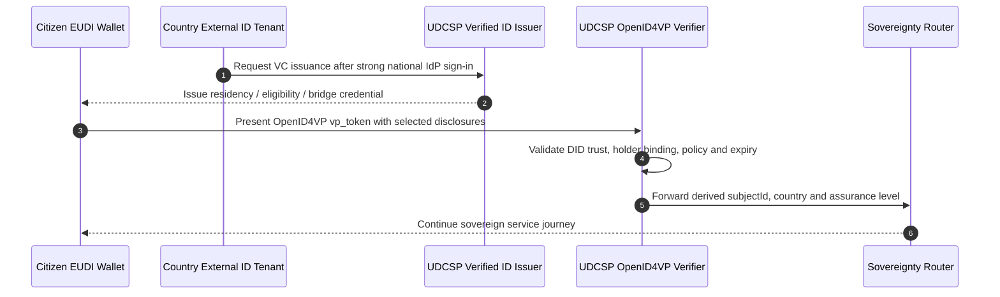

# UDCSP — EUDI-Wallet readiness

## Status update — post-audit refactor

> Current status: **active implementation supersedes the original readiness-only position**.
> The historical readiness assessment below is retained for audit context, but UDCSP now
> has a deployable Microsoft Entra Verified ID issuer/verifier scaffold in
> [`infra/identity/verified-id/`](../../infra/identity/verified-id/).

The active Verified ID implementation publishes three credential contracts:

* [`udcsp-residency-credential.json`](../../infra/identity/verified-id/credential-contracts/udcsp-residency-credential.json) — cross-border residency assertion.
* [`udcsp-eligibility-receipt.json`](../../infra/identity/verified-id/credential-contracts/udcsp-eligibility-receipt.json) — signed Eligibility Pre-Assessor recommendation receipt.
* [`udcsp-eudi-wallet-bridge.json`](../../infra/identity/verified-id/credential-contracts/udcsp-eudi-wallet-bridge.json) — OpenID4VP `vp_token` bridge for EUDI Wallet interoperability.

## Active implementation

The verifier keeps the `vp_token` transient, stores only derived routing claims and
uses presentation policies that match the three credential contracts. This moves the
platform from "ready to accept wallets later" to a concrete issuer/verifier baseline
that can be tested and promoted as national EUDI Wallet schemes become available.

> Status: **forward-looking architecture statement**. EUDI-Wallet is the
> Architecture-and-Reference-Framework (ARF) coming out of eIDAS-2
> (Regulation (EU) 2024/1183). Member-state wallets will be live by 2026.
> UDCSP is built so that, the day the Danish/Swedish/Norwegian wallets land,
> the platform can accept them as a third strong-identity option **without
> code changes** to the back-end services.

> Superseded note: the following readiness content remains historically accurate
> for the original target architecture, but it is now superseded by the active
> implementation described above.

---

## 1. Trust framework

| Component            | Today (eIDAS-1)                                   | EUDI-Wallet (eIDAS-2)                                |
|----------------------|---------------------------------------------------|------------------------------------------------------|
| Issuer               | National IdP brokers (MitID/BankID/Vipps)         | National wallet providers                            |
| Holder               | Browser session                                   | Citizen device wallet                                |
| Verifier (UDCSP)     | OIDC relying party                                | OpenID4VP relying party                              |
| Credential format    | OIDC ID Token                                     | SD-JWT VC, ISO mDoc                                  |
| Selective disclosure | No                                                | Yes — citizen consents per attribute                 |
| Cross-border         | eIDAS notified node                               | Built-in via the EUDI ARF                            |

## 2. What we already do

* All citizen-facing claims are pseudonymous (`sub`) — already
  selective-disclosure friendly.
* Microsoft Entra External ID supports OIDC, OpenID4VP attestation
  brokers and Verifiable Credentials issuance — see
  Microsoft Entra Verified ID.
* The `country` claim drives the sovereignty router; same hook will
  carry the wallet's `iss` claim.
* OpenID4VP test vectors are part of the eIDAS test pack
  ([`tests/conformance/eidas/`](../../tests/conformance/eidas/eidas-test-spec.yaml)).

## 3. What changes when wallets land

| Layer              | Change required                                          |
|--------------------|----------------------------------------------------------|
| External ID tenant | Add OpenID4VP `vp_token` issuer per country wallet provider |
| API gateway        | Accept `vp_token` alongside ID Token; same RBAC mapping  |
| DPIA               | New section per agent — selective-disclosure consent log |
| UX                 | "Connect with EUDI Wallet" button alongside MitID/BankID/Vipps |

## 4. Anti-patterns we avoid

* No copy of the wallet attestation in our datastores — we keep the
  `vp_token` only for the duration of the request and store the derived
  pseudonymous PID + assurance level.
* No bypass of the wallet — when the citizen has a wallet, we require it
  for sensitive actions; the legacy IdP path is for citizens without one.

## 5. References

* [`identity-providers.md`](identity-providers.md)
* eIDAS-2: Regulation (EU) 2024/1183
* EUDI-Wallet ARF: <https://github.com/eu-digital-identity-wallet>
