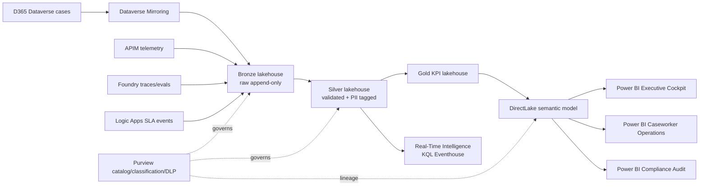

# UDCSP Data Lineage

```mermaid
flowchart LR
  D365[D365 Dataverse cases] --> Mirror[Dataverse Mirroring]
  Mirror --> Bronze[Bronze lakehouse<br/>raw append-only]
  APIM[APIM telemetry] --> Bronze
  Foundry[Foundry traces/evals] --> Bronze
  Logic[Logic Apps SLA events] --> Bronze
  Bronze --> Silver[Silver lakehouse<br/>validated + PII tagged]
  Silver --> Gold[Gold KPI lakehouse]
  Silver --> RTI[Real-Time Intelligence<br/>KQL Eventhouse]
  Gold --> Model[DirectLake semantic model]
  Model --> Exec[Power BI Executive Cockpit]
  Model --> Ops[Power BI Caseworker Operations]
  Model --> Audit[Power BI Compliance Audit]
  Purview[Purview catalog/classification/DLP] -. governs .-> Bronze
  Purview -. governs .-> Silver
  Purview -. lineage .-> Model
```
