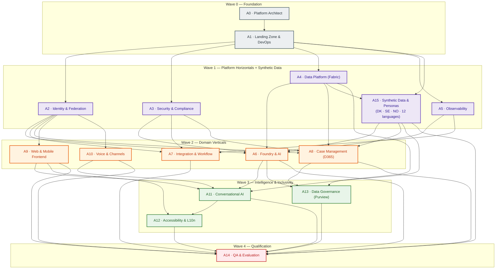
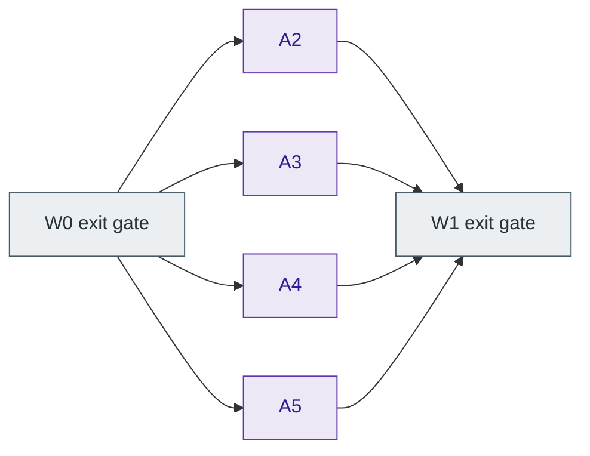
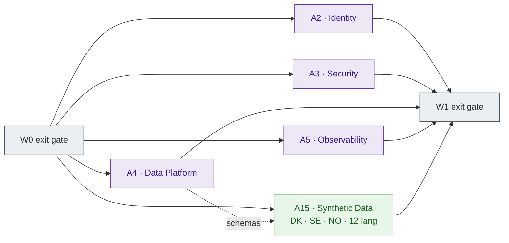
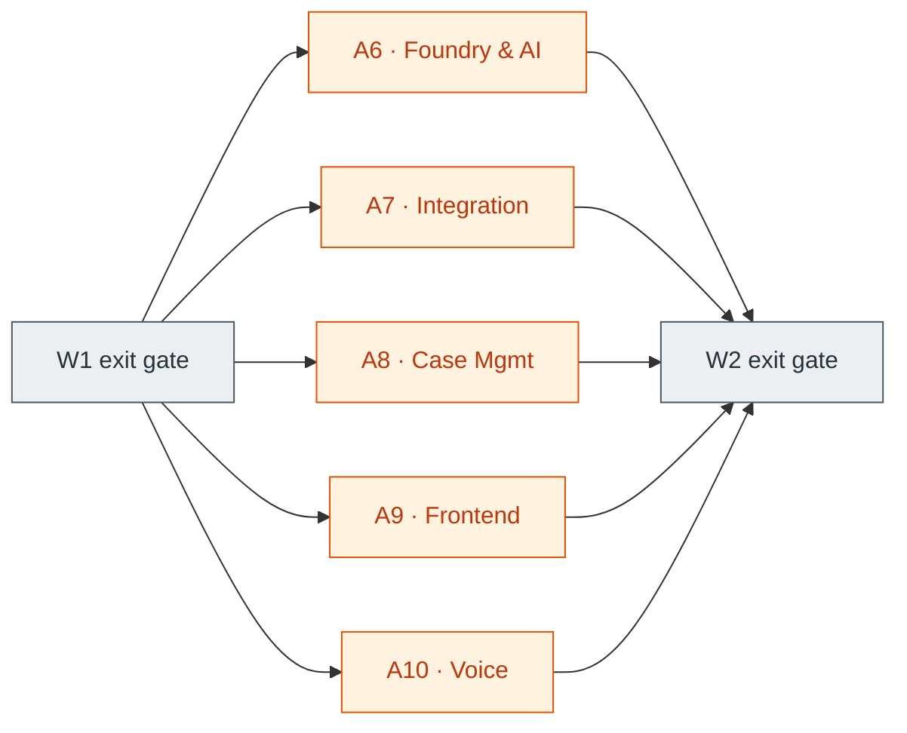
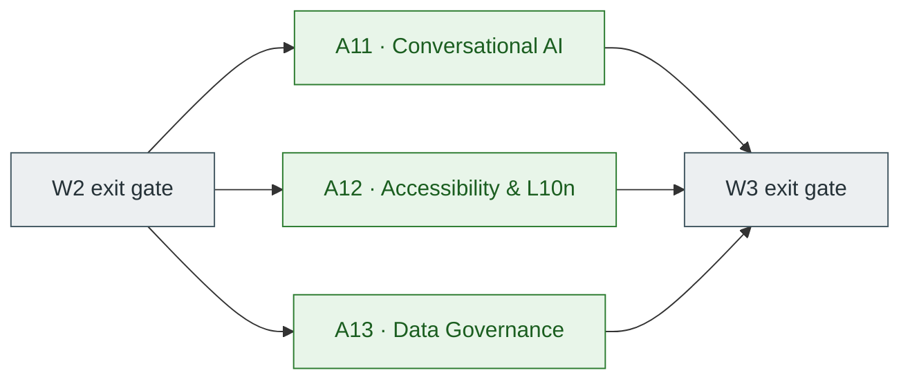

# UDCSP — Multi-Agent Development Plan

> Source-of-truth plan consumed by the **AI coding agents** that will implement the platform defined in [`architecture.md`](./architecture.md). This document describes **who builds what, in which order, and what runs in parallel**. No source code is included; each work package will be implemented by the assigned agent in a follow-up session.

---

## Table of Contents

1. [Operating Model](#1-operating-model)
2. [Agent Profiles](#2-agent-profiles)
3. [Phasing & Parallelisation](#3-phasing--parallelisation)
4. [Agent Dependency Graph](#4-agent-dependency-graph)
5. [Execution Sequence by Wave](#5-execution-sequence-by-wave)
6. [Work Packages — Detailed](#6-work-packages--detailed)
7. [Cross-Cutting Conventions](#7-cross-cutting-conventions)
8. [Definition of Ready / Definition of Done](#8-definition-of-ready--definition-of-done)
9. [Risk Register](#9-risk-register)

---

## 1. Operating Model

UDCSP is built by a **swarm of specialised AI coding agents**, each owning a clearly bounded slice of the platform. Coordination rules:

- **One owner per work package.** Two agents never edit the same module concurrently.
- **Contract-first.** Every horizontal layer publishes its OpenAPI / event schema / data contract before downstream agents begin.
- **Asynchronous handoffs through the repo.** An agent declares a deliverable "ready" by tagging the produced artefact (PR label, contract folder, IaC module).
- **Evaluation gates.** Each agent's PR must pass a defined set of automated checks (lint, build, tests, evals, accessibility, policy, security) before merge.
- **Human-in-the-loop.** A human architect reviews wave-boundary deliverables and any change to the AI risk posture.
- **Idempotent IaC.** All infra is defined in Bicep modules under `infra/`; agents may not configure resources outside IaC.
- **Trunk-based development.** Short-lived feature branches per work package, fast forward to `main`.

---

## 2. Agent Profiles

Each profile defines **role, skills, owned areas, primary outputs, and PR review responsibilities**.

| ID | Agent profile | Owned areas | Primary outputs |
|---|---|---|---|
| **A0** | **Platform Architect** | ADRs, target reference architecture, contracts, naming conventions, phase gates. | `docs/adr/*`, contract templates, governance for cross-cutting changes. |
| **A1** | **Landing Zone & DevOps** | Azure subscriptions, management groups, network hub-and-spoke (3 zones), Azure Policy, GitHub Actions, IaC scaffolding, secrets/Key Vault baseline, ACR. | `infra/landing-zone/*`, `.github/workflows/*`, repo bootstrap. |
| **A2** | **Identity & Federation** | Entra External ID hub, B2C tenants per country, eIDAS bridge, custom policies, workforce tenant, PIM, Conditional Access. | `infra/identity/*`, B2C custom policies, federation runbooks. |
| **A3** | **Security & Compliance** | Defender for Cloud, Sentinel, Key Vault topology, network security groups, Azure Policy compliance baseline, GDPR DPIA scaffolding. | `infra/security/*`, Sentinel content, policy assignments, DPIA template. |
| **A4** | **Data Platform (Fabric)** | Fabric capacities, workspaces per country, OneLake structure, bronze/silver/gold lakehouses, Real-Time Intelligence, semantic models, Fabric Domain. | `data/fabric/*`, semantic model definitions, ingestion notebooks. |
| **A5** | **Observability** | Log Analytics, App Insights, Azure Monitor workbooks, alert rules, correlation-id strategy, dashboards. | `infra/observability/*`, workbook JSON, alert definitions. |
| **A6** | **Foundry & AI** | Microsoft Foundry hubs/projects, model catalog, agents (Classifier, Translator, Eligibility, Doc Extractor, Caseworker Helper), Content Safety, evaluations, AI Act registry entries. | `foundry/*` (agents, prompts, datasets, evals), `governance/ai-act/*`. |
| **A7** | **Integration & Workflow** | API Management gateway + products + policies, Logic Apps Standard workspaces, Service Bus, Event Grid, partner connectors. | `services/apim/*`, `services/logic-apps/*`, contract registry. |
| **A8** | **Case Management (D365)** | D365 Customer Service environments per country, BPF, queues, SLAs, Copilot for Service config, Dataverse-to-Fabric mirroring, Power Automate flows. | `apps/d365/*` (solutions), Power Automate flows. |
| **A9** | **Web & Mobile Frontend** | Citizen web portals (Static Web Apps), accessible design system, mobile shell, embedded chat widget, OIDC client integration. | `apps/web/*`, `apps/mobile/*`, design system package. |
| **A10** | **Voice & Channels** | Azure Communication Services telephony, IVR flow, AI Speech (STT/TTS), SMS/email transactional, Copilot Studio voice channel. | `apps/voice/*`, ACS resources, IVR dialogs. |
| **A11** | **Conversational AI (Copilot Studio)** | Copilot Studio agents, topics in 12 languages, Foundry agent invocation, knowledge sources, escalation to D365. | `apps/copilot-studio/*`, topic packs. |
| **A12** | **Accessibility & Localization** | WCAG 2.1 AA tooling (axe in CI, manual audits), 12-language translation pipeline, ICU message format, accessibility statements. | `apps/web/i18n/*`, accessibility audit reports, CI gates. |
| **A13** | **Data Governance (Purview)** | Unified Catalog, sensitivity labels, classifications, lineage, DLP, data-sharing policies per country, AI asset registry. | `governance/purview/*`, policy packs. |
| **A14** | **QA & Evaluation** | E2E test suites, performance/load tests, Foundry eval pipelines, accessibility audits, security scans, conformance tests. | `tests/*`, evaluation datasets, audit reports. |
| **A15** | **Synthetic Data & Personas** | GDPR-safe synthetic personas, addresses, documents, applications, cases, conversations and golden eval datasets — across **DK / SE / NO** in **all 12 languages** — plus the regeneration pipelines so the data can be rebuilt at any scale. | `data/synthetic/*` (personas, applications, documents, conversations, cases, eval-datasets, streams, persona-book), regeneration notebooks & Functions. |

---

## 3. Phasing & Parallelisation

Work is organised in **five waves**. Within a wave, agents work in parallel; between waves, contracts and artefacts produced by the previous wave are consumed.

| Wave | Theme | Agents involved | Parallelism |
|---|---|---|---|
| **W0** | Foundation & contracts | A0, A1 | Sequential within wave (A0 → A1). |
| **W1** | Platform horizontals + synthetic data | A2, A3, A4, A5, A15 | Fully parallel. |
| **W2** | Domain verticals | A6, A7, A8, A9, A10 | Fully parallel. |
| **W3** | Intelligence & inclusivity | A11, A12, A13 | Fully parallel. |
| **W4** | End-to-end qualification | A14 | Sequential, but parallel test suites. |

> Waves are not time-boxed in this plan; they describe **dependency boundaries**, not a calendar.

---

## 4. Agent Dependency Graph

> Edges represent **must-finish-before** relationships (artefact / contract / resource availability), not communication channels.

---

## 5. Execution Sequence by Wave

### Wave 0 — Foundation (sequential)

1. **A0** publishes the reference architecture, ADRs (one per major decision), naming conventions, contract templates (OpenAPI, AsyncAPI, Bicep module shape), and the repository structure.
2. **A1** stands up subscriptions, management groups, network topology, GitHub Actions skeleton, ACR, Key Vault baseline, and the IaC scaffolding (`infra/`).

**Exit gate (W0 → W1):** subscriptions provisioned, network reachable, CI/CD green on a hello-world IaC module, ADRs reviewed and signed off.

### Wave 1 — Platform Horizontals (parallel)

### Wave 1 — Platform Horizontals + Synthetic Data (parallel)

**Exit gate (W1 → W2):** workforce tenant operational, B2C tenants per country, security baseline applied, Fabric workspaces created, observability sink reachable, **synthetic persona library + first golden eval datasets available** for downstream agents.

### Wave 2 — Domain Verticals (parallel)

**Exit gate (W2 → W3):** Foundry agents callable through APIM, D365 environments accept cases, web portal authenticates and submits to APIM, voice channel reaches Copilot Studio.

### Wave 3 — Intelligence & Inclusivity (parallel)

**Exit gate (W3 → W4):** end-to-end Citizen Assistant works in 12 languages, axe scans pass, Purview catalogs every data product and registers every AI agent.

### Wave 4 — Qualification

A14 runs all qualification suites in parallel: functional E2E, performance, AI evaluations, accessibility audits, security scans, GDPR / EU AI Act conformance checks.

**Final exit gate:** Evaluation Criteria Matrix in `README.md` is fully green.

---

## 6. Work Packages — Detailed

Each work package below is sized to be implemented by **one agent in one or a few sessions**. Inputs and outputs are explicit so that agents can self-validate handoffs.

### A0 · Platform Architect
- **Inputs:** [`README.md`](./README.md), [`architecture.md`](./architecture.md), [`case-study-11.md`](./case-study-11.md).
- **Tasks:** Repository structure ADR; naming convention ADR; environment topology ADR (DEV/TEST/PREPROD/PROD per zone); contract templates (OpenAPI, AsyncAPI, Bicep, Power Platform solution); decision log.
- **Outputs:** `docs/adr/*`, `docs/conventions/*`, `contracts/templates/*`.
- **Exit criteria:** All downstream agents have a template they can pick up.

### A1 · Landing Zone & DevOps
- **Inputs:** A0 ADRs.
- **Tasks:** Bicep modules for management group hierarchy; subscription wiring; per-country resource groups; hub-and-spoke VNet; Azure Policy initiative ("UDCSP baseline"); ACR; Key Vault baseline; GitHub Actions templates (CI, infra-deploy, app-deploy); branch protection; environments and approvals.
- **Outputs:** `infra/landing-zone/*`, `infra/_shared/*`, `.github/workflows/*`.
- **Exit criteria:** A "hello-world" module deploys end-to-end via PR to the DEV environment in all three zones.

### A2 · Identity & Federation
- **Inputs:** A1 (network, Key Vault, IaC).
- **Tasks:** Workforce Entra tenant baseline (Conditional Access, PIM); External ID hub; B2C tenant per country; user flows / custom policies; eIDAS bridge configuration; OIDC client registrations for web, mobile, voice; SCIM connectors to D365.
- **Outputs:** `infra/identity/*`, B2C policies, federation diagrams in `architecture.md` already match.
- **Exit criteria:** A test citizen can log in to the SE B2C tenant via a mocked national eID and obtain a token accepted by APIM.

### A3 · Security & Compliance
- **Inputs:** A1.
- **Tasks:** Defender for Cloud onboarding for all subscriptions; Microsoft Sentinel deployment + analytics rules + AI-specific playbooks (prompt injection, model misuse); per-zone Key Vault topology; Azure Policy assignments enforcing CMK, private endpoints, no public IPs; DPIA template.
- **Outputs:** `infra/security/*`, `governance/dpia/*`, Sentinel content packs.
- **Exit criteria:** Defender posture ≥ target score; policy compliance ≥ 95 %.

### A4 · Data Platform (Fabric)
- **Inputs:** A1.
- **Tasks:** Fabric capacities per zone; workspaces per country; OneLake folder structure; bronze/silver/gold lakehouses; Real-Time Intelligence eventstream; ingestion from D365 (Dataverse mirroring), APIM diagnostics, Foundry traces; semantic models; Fabric Domain federation; Power BI workspace structure.
- **Outputs:** `data/fabric/*`, semantic model definitions.
- **Exit criteria:** A synthetic event lands in bronze and is queryable in gold within the target SLA.

### A5 · Observability
- **Inputs:** A1.
- **Tasks:** Per-zone Log Analytics workspaces; shared workspace for cross-zone correlation; Application Insights for each app component; correlation-id propagation contract; alert rules; Azure Monitor workbooks for SRE; Power BI dashboards for ops KPIs.
- **Outputs:** `infra/observability/*`, workbook JSON, dashboards.
- **Exit criteria:** A request can be traced across APIM → Logic Apps → D365 → Foundry by a single ID.

### A6 · Foundry & AI
- **Inputs:** A2 (identity for Foundry RBAC), A3 (Key Vault), A4 (KB sources, training data path), A5 (tracing endpoint).
- **Tasks:** Foundry hubs and projects (per region); model deployments (Azure OpenAI + selected open-source); agents per architecture §5.1 (Classifier, Translator, Eligibility, Citizen Assistant, Doc Extractor, Caseworker Helper); prompts; tools; Content Safety configuration; evaluations (golden datasets per agent); AI Act registry entries; CI/CD pipelines for prompt/agent promotion gated by evaluations.
- **Outputs:** `foundry/agents/*`, `foundry/evals/*`, `foundry/datasets/*`, `governance/ai-act/*`.
- **Exit criteria:** Each agent has a green eval baseline and is registered in the AI Act registry; agents callable via Foundry endpoint.

### A7 · Integration & Workflow
- **Inputs:** A2 (token issuer, scopes), A3 (network, secrets), A0 (contracts).
- **Tasks:** APIM instance(s); product/API definitions per channel and per agency; policies (country routing, OAuth, throttling, redaction, response caching); Logic Apps Standard workspaces per country; Service Bus namespaces; Event Grid topics; partner agency facade Functions/Container Apps; OOTS / SDG connectors.
- **Outputs:** `services/apim/*`, `services/logic-apps/*`, `services/integration/*`.
- **Exit criteria:** End-to-end synthetic application flows from APIM through a Logic App to D365 with full tracing.

### A8 · Case Management (D365)
- **Inputs:** A2 (caseworker identity), A7 (Logic Apps, APIM contracts), A4 (mirroring target).
- **Tasks:** D365 environment per country; solutions for Customer Service Hub; case types, BPFs, queues, SLAs aligned to 4-day target; Copilot for Service configuration; multilingual KB skeleton; Power Automate flows for routine actions; Dataverse-to-Fabric mirroring.
- **Outputs:** `apps/d365/*` (managed solutions), Power Automate flows.
- **Exit criteria:** A case can be created from APIM, routed to a queue, and closed with audit trail visible in Fabric.

### A9 · Web & Mobile Frontend
- **Inputs:** A2 (OIDC), A7 (APIM), A0 (design tokens).
- **Tasks:** Accessible design system (component library); citizen web portal scaffolds (per country brand) on Static Web Apps; mobile shell (cross-platform); OIDC integration via B2C; offline-friendly form handling; chat widget embedding hooks for A11; instrumentation for A5.
- **Outputs:** `apps/web/*`, `apps/mobile/*`, `apps/_design-system/*`.
- **Exit criteria:** A citizen can authenticate, fill a sample form, submit via APIM, and view status. axe-core baseline scan passes.

### A10 · Voice & Channels
- **Inputs:** A2, A7.
- **Tasks:** Azure Communication Services resources per country; toll-free numbers; PSTN connectivity; AI Speech custom voice/lexicon if needed; IVR baseline; ACS-to-Copilot Studio voice channel; SMS / email transactional templates.
- **Outputs:** `apps/voice/*`, ACS IaC.
- **Exit criteria:** A test call reaches the IVR, plays a greeting, and routes to the Copilot Studio agent placeholder.

### A11 · Conversational AI (Copilot Studio)
- **Inputs:** A6 (Foundry agents), A9 (web embed), A10 (voice channel), A8 (D365 escalation).
- **Tasks:** Copilot Studio agent(s); topics in 12 languages; knowledge sources (SharePoint, Fabric KB shortcut, public sites); actions wired to Foundry agents; escalation hand-off to D365 Customer Service queues; consent banners.
- **Outputs:** `apps/copilot-studio/*`.
- **Exit criteria:** End-to-end conversation works on web, mobile, and voice in all 12 languages with safe-completion guarantees from Content Safety.

### A12 · Accessibility & Localization
- **Inputs:** A9, A11.
- **Tasks:** axe-core integration in CI/CD with PR gating; Lighthouse accessibility budget; translation pipeline (source-of-truth English + machine-translated drafts validated by AI Translator + human review hooks); ICU message format; accessibility statements per portal; manual audit checklist.
- **Outputs:** `apps/web/i18n/*`, CI gates, audit templates.
- **Exit criteria:** All portals pass automated WCAG 2.1 AA scans; 12 languages served end-to-end without UI breakage.

### A13 · Data Governance (Purview)
- **Inputs:** A4 (data sources), A6 (AI assets), A8 (Dataverse), A7 (APIs).
- **Tasks:** Purview account(s); scans of Fabric, Dataverse, ADLS, APIM; sensitivity labels and classifications; lineage stitching; DLP policies per country; AI asset registry (linked to Foundry); data-sharing policy packs per country.
- **Outputs:** `governance/purview/*`, classifications, policies.
- **Exit criteria:** A sensitive PII column is detected, classified, traced through the pipeline, and protected by DLP.

### A14 · QA & Evaluation
- **Inputs:** all of the above, including A15's synthetic datasets.
- **Tasks:** Functional E2E suite (Playwright for web, Appium for mobile, ACS test harness for voice); load tests (k6 / Azure Load Testing) targeting SLOs; Foundry evaluation pipelines (continuous regression on agents); axe and manual accessibility audits; Defender / OWASP / LLM-Top-10 security scans; GDPR / EU AI Act conformance checklists.
- **Outputs:** `tests/*`, evaluation datasets, audit reports, traceability matrix to the README evaluation table.
- **Exit criteria:** Every row of the README evaluation table is green and traceable to a passing artefact.

### A15 · Synthetic Data & Personas
- **Inputs:** A0 (schemas, contracts, naming), A4 (data model & ingestion endpoints), A8 (D365 case schema, contracts), A6 (Foundry eval format), A12 (locale matrix).
- **Tasks:**
  - **T1 — National statistical models** — for each of **DK · SE · NO**, derive realistic distributions for age, gender, language, civic status, address (geocoded), residency type, social-benefit status, tax bracket and document types — referenced from open national statistics. **No real PII is used or copied.**
  - **T2 — Persona library** — generate ≥ 30 000 synthetic personas (10 000+ per country) with synthetic civic IDs in the national format (clearly watermarked `SYNTHETIC`), realistic addresses, language preference and accessibility needs.
  - **T3 — Synthetic documents** — passport, national ID card, payslip, lease, residency certificate, tax statement templates per country, generated and visibly watermarked `SYNTHETIC — UDCSP`.
  - **T4 — Application & case dataset** — sample residency, tax, social-benefit and cross-border applications, with their multi-step state machine; matched D365 case records via A8's contracts.
  - **T5 — Multilingual content variants** — every persona, application, KB article, notification and transcript also produced in the **12 official languages**, with locale-correct formatting (dates, currencies, names, RTL where applicable).
  - **T6 — Conversation corpora** — citizen ↔ assistant and citizen ↔ caseworker dialogues across web, mobile and voice; including escalations, ambiguity and mistranslation cases.
  - **T7 — Foundry golden eval datasets** — per agent (Classifier, Translator, Eligibility, Citizen Assistant, Document Extractor) with adversarial / safety / bias / language-coverage subsets.
  - **T8 — Streaming event data** — synthetic event flow into Fabric Real-Time Intelligence to demo and load-test live KPIs.
  - **T9 — Persona book** — human-readable catalog of personas and journeys for demos, audits and evaluator walkthroughs.
- **Outputs:** `data/synthetic/personas/`, `data/synthetic/applications/`, `data/synthetic/documents/`, `data/synthetic/conversations/`, `data/synthetic/cases/`, `data/synthetic/eval-datasets/`, `data/synthetic/streams/`, `data/synthetic/persona-book.md`, plus **regeneration pipelines** (notebooks + Functions + Bicep) so any dataset can be rebuilt at scale.
- **Exit criteria:** Each downstream agent has a seed dataset matching its schema; Foundry evaluations have green baselines on synthetic data; **no real PII anywhere**; auditor walkthrough on the persona book passes.

---

## 7. Cross-Cutting Conventions

| Concern | Convention |
|---|---|
| Repository layout | `infra/`, `apps/`, `services/`, `foundry/`, `data/`, `governance/`, `docs/`, `tests/`. |
| Branching | `main` protected; short-lived `feat/<wave>-<agent>-<slug>` branches. |
| Commit messages | Conventional Commits + co-author trailer. |
| IaC | Bicep modules under `infra/`; module per resource type; environments via parameter files; **no portal-only changes** above DEV. |
| Contracts | OpenAPI 3 + AsyncAPI under `contracts/`; semantic versioning; CI lints contracts and computes consumer impact. |
| Secrets | Always in Key Vault; referenced by managed identity; never in repo, never in CI logs. |
| Naming | `udcsp-<env>-<zone>-<workload>-<resource-suffix>`; documented in A0's ADR. |
| Localisation | Source-of-truth English; ICU MessageFormat; per-locale review. |
| AI changes | Any new agent or material prompt change ⇒ runs evals + safety gate + AI Act registry update. |
| Security | Threat model per work package, recorded in `docs/threat-models/<wp>.md`. |

---

## 8. Definition of Ready / Definition of Done

### Definition of Ready (per work package)
- Prerequisite agents have published their contracts / IaC modules / endpoints.
- Inputs documented in this plan are available.
- Threat-model placeholder created.
- Acceptance tests (per the evaluation matrix) sketched.

### Definition of Done (per work package)
- All exit-criteria bullets satisfied.
- IaC merged and deployed in DEV via CI/CD.
- Tests added and passing in CI (functional + accessibility + security where relevant).
- Documentation updated (`architecture.md` if architecture changes; `docs/adr/*` if a decision was made).
- Observability instrumented (logs, metrics, traces with correlation-id).
- Governance updated (Purview metadata; AI Act registry if AI; DPIA if PII).
- PR reviewed by A0 (and a human architect for wave-boundary deliverables).

---

## 9. Risk Register

| ID | Risk | Mitigation | Owner |
|---|---|---|---|
| R1 | Cross-border data flow violates a national DPA interpretation. | Per-country policy packs in Purview; legal review per data flow; claims-based mediation only. | A13, A2 |
| R2 | Eligibility model bias. | High-risk classification, golden eval datasets covering protected attributes, shadow-mode rollout, human override. | A6, A14 |
| R3 | Voice channel latency > 2 s p95. | Edge ACS region per country; warm pools; small low-latency classifier; streaming TTS. | A10, A6 |
| R4 | 47 legacy portals not all decommissioned. | Decommission tracker, contract-first façades, sunset waves planned post-W4. | A0, A7 |
| R5 | AI Act conformity for high-risk agent. | Documentation pipeline in Foundry; conformity assessment artefacts produced from evals + tracing. | A6, A13 |
| R6 | Accessibility regressions late in delivery. | axe gate from W2; manual audit before W3 exit; design-system-first approach. | A12, A9 |
| R7 | Tenant sprawl in Entra/B2C. | Strict naming + IaC-only tenant configuration; A2 owns the tenant model. | A2 |
| R8 | Observability gaps preventing root-cause analysis. | A5's correlation-id contract is mandatory before W2; CI check enforces propagation. | A5 |
| R9 | Cost overrun on Foundry / OpenAI usage. | Per-agent quotas; APIM rate limits per channel; FinOps dashboard in Power BI. | A6, A1 |
| R10 | Partner agency integration delays. | Façade-and-mock pattern from W2; replay tests; contract-versioning policy. | A7 |
| R11 | Synthetic data not realistic enough → AI evals over-optimistic. | Statistical fidelity tests against national open-data distributions; periodic refresh of synthetic generators; production-trace sampling fed back into eval sets. | A15, A14 |
| R12 | Multilingual quality drift across 12 languages. | Per-language eval suites with native-reviewed golden sets; per-language KPIs in Power BI; CI gate blocks promotion if any language regresses. | A12, A6, A14 |

---

*Plan owned by A0 (Platform Architect). Update via PR; do not edit during a wave once the wave has started without an explicit re-planning cycle.*
