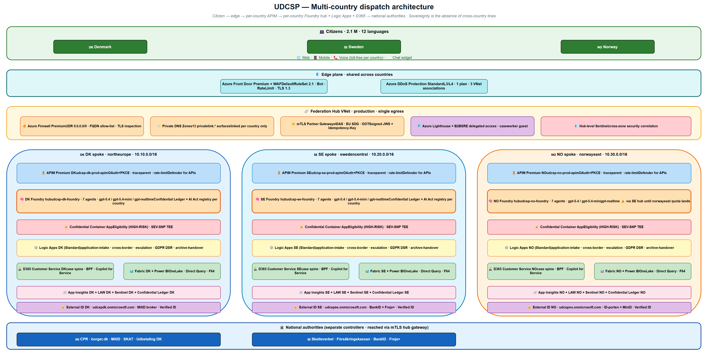
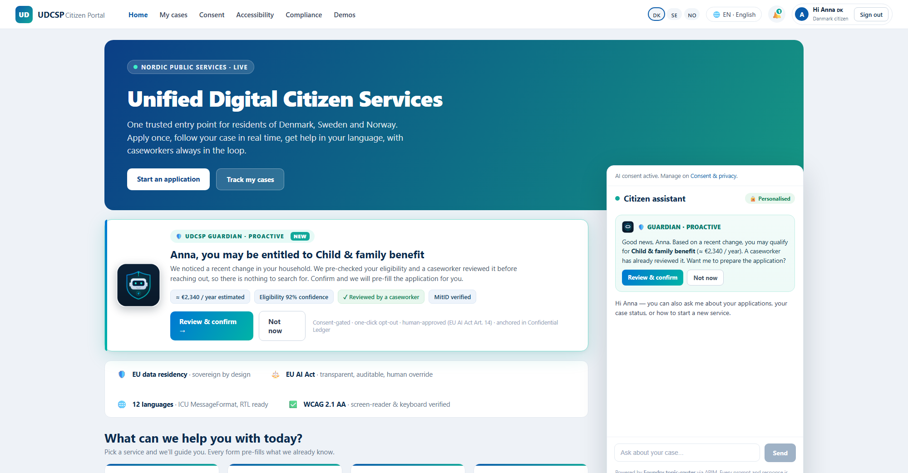
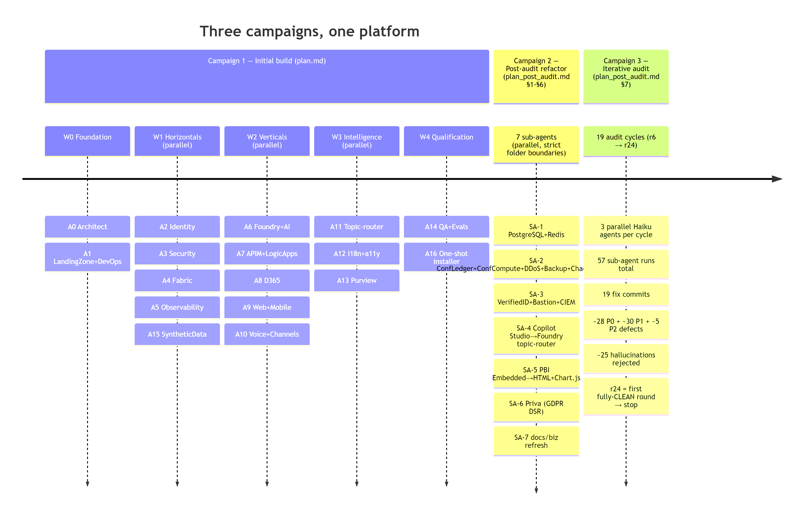

# Executive summary

Problem. Across Denmark, Sweden and Norway, 2.1 million citizens deal with 47 disconnected public-sector portals. Take Anna, who is moving from Copenhagen to Stockholm: her case takes 28 days and drags her through two national portals, two languages, three authorities and several physical document uploads. Some of those portals do not speak her language. Some are not accessible to screen readers.

Response. UDCSP, the Unified Digital Citizen Services Platform, is a federated citizen front door across the three Nordic countries. It runs on web, mobile and telephone, in 12 languages, with WCAG 2.1 AA accessibility, GDPR-by-design data flows, and an EU AI Act high-risk dossier for its eligibility pre-assessor. A multi-agent AI brain on Azure AI Foundry pre-classifies, translates and extracts documents, then proposes an eligibility verdict, always under a human caseworker's supervision.

Business value. Processing time targets a drop from 28 days to 4, and citizen satisfaction a gain of 38 %. Forty-seven legacy portals consolidate into one, and twelve languages become first-class rather than afterthoughts. The three sovereign data zones never share a citizen's data without an explicit, signed, audit-trailed cross-border envelope. The high-risk Eligibility model is designed to run inside a SEV-SNP attested Trusted Execution Environment, with each verdict hashed into Azure Confidential Ledger for tamper-evident audit. Both are built and registered in the repository, and both are gated on tenant capacity and a licence, so they are stated here as the production target rather than as deployed behaviour (Gate 2 of the roadmap).

Evidence available today. Demos 1 to 4 (Anna, Lars, Maria, Erik) run live on a working tenant. Demo 9 (CIO outcomes dashboard) ships as nine deployed Azure Workbooks, three per country, queryable today; the Norwegian instance receives live data from every voice call, while the Danish and Swedish instances stay empty by design until a country-specific orchestrator or browser instrumentation is added, which is itself the sovereignty proof. Demo 10 (DevOps install from a clean tenant) is scripted as 25 idempotent phases and has not been re-run end to end since the most recent installer changes; it also requires the documented tenant prerequisites and the mandatory `patch/Enable-PrivateUploadPath.ps1` network patch. Demos 5 to 8 are blueprints, each with implementation hooks, scripts and YAML registries already in the repo: the model gates, the AI Act dossier, the Sentinel playbook and the Confidential Ledger pipeline. Every demo has a documented fallback path in `docs/biz/uses.md`, and the live state of each one is tracked in `docs/tech/inprogress.md`.

Status: demonstrator versus production target. UDCSP is a production-oriented demonstrator, a tenant-deployable platform that exercises the full citizen journey end to end, anchored to a documented production-target architecture for general availability. The target architecture (three sovereign Azure AI Foundry hubs, a federation hub with Azure Firewall Premium, Confidential Containers, Microsoft Priva, Microsoft Defender for APIs and Confidential Ledger) is described in this submission and traced to its evidence artefacts. Items that need tenant-side validation, notably specific Azure OpenAI model deployments and regional availability, are flagged inline.

Vision. UDCSP Guardian is the platform's forward-looking layer: a proactive, autonomous, human-supervised agent that detects a citizen's life event, silently checks entitlement on the existing high-risk brain, and, once a caseworker approves, reaches out first. It is the answer to non-take-up, where 20 % to 60 % of eligible people never claim what they are owed, and it is built by re-wiring components that are already live. Guardian is presented as a vision, not yet code, and it is the section where the platform's autonomy and multi-agent coordination story becomes concrete.

# The story

A citizen named Anna lives in Copenhagen and accepts a new job in Stockholm.

To register her residency in Sweden today she has to navigate two national portals in two languages, re-upload her identity documents, prove her income to a third tax authority and wait 28 days for a decision.

Across the three Nordic countries, 2.1 million citizens like Anna face 47 disconnected legacy portals every day. Some do not speak the citizen's language. Some cannot be read by a screen reader at all.

UDCSP changes that. It is a single citizen front door across Denmark, Sweden and Norway, available on web, mobile and telephone, in 12 languages, and fully accessible. Behind it sits a multi-agent AI brain that pre-classifies and translates requests, extracts documents and pre-assesses eligibility, always under the supervision of a human caseworker.

UDCSP does not replace the national authorities. CPR, borger.dk, SKAT and Udbetaling DK in Denmark; Skatteverket, Försäkringskassan and BankID in Sweden; Skatteetaten, NAV, Altinn and UDI in Norway all remain the controllers of the substantive decision. UDCSP bridges to them. Every transaction is pre-filled, validated and then submitted to the competent authority, and the official decision comes back into the citizen's *My cases* timeline.

Processing time drops from 28 days to 4. Citizen satisfaction is targeted at a 38 % gain. Forty-seven portals consolidate into one, and twelve languages become first-class rather than afterthoughts.

The three sovereign data zones never share a citizen's data without an explicit, signed, audit-trailed cross-border envelope. The Eligibility model, registered under EU AI Act Annex III §5(b) as high-risk, is always reviewed by a human caseworker before any decision becomes final, and is designed to run inside a SEV-SNP attested Trusted Execution Environment and hash its verdict into Azure Confidential Ledger. Those last two are built and registered, and gated on capacity and a licence; the human review is live.

This document is the architect's submission for the Azure Master Architect Program.

# Use case alignment matrix

The matrix maps every explicit requirement of the AMA use case brief to the UDCSP response, the evidence artefact and the implementation status. Status legend: *Live*, runs on the tenant today · *Implemented*, code merged and exercised by smoke tests · *Scripted*, installer phase plus idempotent script present · *Blueprint*, registered design with YAML/spec but not yet live · *Roadmap*, planned, with a dependency outside this submission.

\begin{longtable}[]{@{}
  >{\raggedright\arraybackslash}p{0.21\linewidth}
  >{\raggedright\arraybackslash}p{0.25\linewidth}
  >{\raggedright\arraybackslash}p{0.32\linewidth}
  >{\raggedright\arraybackslash}p{0.16\linewidth}
@{}}
\toprule
\small Requirement (use case) & \small UDCSP response & \small Evidence / Demo / Artefact & \small Status \\
\midrule
\endhead
\small Unify 47 portals across DK/SE/NO into one front door & \small Single SPA `udcsp.fredgis.com` with per-country federation and shared chrome & \small Demo 1-4 · `apps/web/` & \small Live \\
\small Serve 2.1 M citizens in 12 languages & \small ICU catalogue + Translator agent + per-locale gold-set gate & \small Demo 3 · `apps/web/src/i18n/` & \small Implemented \\
\small Federated cross-border identity & \small Entra External ID per country + Entra Verified ID for EUDI bridge & \small Demo 1 (screen 11) · `infra/identity/` & \small Live (External ID) · Blueprint (Verified ID) \\
\small Reduce decision latency 28 → 4 days & \small AI pre-fill + AI eligibility + caseworker disposition + saga to authority & \small Demo 1 + Demo 6 · `services/logic-apps/` & \small Live (pre-fill) · Blueprint (full saga) \\
\small WCAG 2.1 AA accessibility & \small axe-core CI gate · audited components · per-portal a11y statement & \small Demo 3 · `apps/web/.axe-ci/` & \small Implemented \\
\small GDPR: RoPA, DSAR, erasure, portability & \small Microsoft Priva + Logic Apps `gdpr-data-*` + per-country Purview & \small `governance/gdpr/` · `services/logic-apps/gdpr/` & \small Scripted \\
\small EU AI Act art. 12, 14, 50, Annex III & \small LAW 730 d · HITL disposition · TEE + Ledger anchor · model registry & \small Demo 6 + Demo 7 · `governance/ai-act/registry/` & \small Implemented (registry) · Blueprint (live TEE) \\
\small Automate back-office processing & \small Saga on Logic Apps Standard + Caseworker Helper agent & \small Demo 5 + Demo 6 · `foundry/projects/caseworker-helper/` & \small Scripted · Blueprint (D365) \\
\small AI assistant on web, mobile, voice & \small Citizen Assistant on 3 channels, voice via ACS + real-time speech model & \small Demo 1, 2, 4 · `apps/voice/call-automation/` & \small Live (web, mobile) · Live with tenant model validation (voice) \\
\small Eligibility pre-assessment with HITL & \small High-risk agent · Confidential Container · ledger anchor · caseworker disposition & \small Demo 6 · `foundry/projects/eligibility-pre-assessor/` & \small Implemented · Blueprint (live SEV-SNP) \\
\small Operational transparency for the operator & \small 9 Azure Workbooks (3 per country) + W3C `traceparent` propagation & \small Demo 9 · `infra/monitoring/workbooks/` & \small Live \\
\small Repeatable deployment from a clean tenant & \small 25-phase idempotent PowerShell installer + smoke suite & \small Demo 10 · `scripts/install/` · `scripts/smoke/` & \small Live \\
\small Proactive, autonomous entitlement outreach (non-take-up) & \small UDCSP Guardian: Event Scanner + Critic over the existing high-risk brain, human-approved, ledger-anchored & \small `docs/biz/guardian.md` · Guardian chapter & \small Vision (reuses live components) \\
\bottomrule
\end{longtable}

The matrix is also the basis of the demo plan (§"Demo plan and evidence" below).

# The citizen experience

UDCSP is one platform with three surfaces and a single identity. The same citizens, Anna, Lars, Maria and Erik, meet it on `udcsp.fredgis.com` from a desktop browser, open the same site on an iPhone or Android, or dial a toll-free Nordic phone number.

The shell is responsive, the language is auto-detected and switchable to eleven others, the accessibility menu offers slow speech, high contrast and reduce-motion modes, and the chat widget is pinned in the bottom-right corner waiting for a question.

\screenfig{0.85\linewidth}{images/screen1.png}{The citizen portal home: a single canonical entry across DK, SE and NO, with the language picker, accessibility menu, demo index and a chat widget pinned bottom-right.}

\screenfig{0.85\linewidth}{images/screen11.png}{The sign-in landing: per-country External ID federation behind the same `udcsp.fredgis.com` URL. Each country uses its national eID broker (MitID · BankID + Freja+ · ID-porten + MinID).}

\screenfig{0.85\linewidth}{images/screen2.png}{The contact page: a citizen can pick up a phone and dial the country toll-free number. The voice channel is a first-class peer of web and mobile.}

\screenfig{0.85\linewidth}{images/screen3.png}{The *My cases* timeline: every interaction, every AI verdict and every caseworker disposition, with the official decision mirrored back from the national authority.}

\screenfig{0.85\linewidth}{images/screen4.png}{The Citizen Assistant: a chat widget grounded on the national-authority knowledge base, with mandatory citation for every reply. The voice channel reaches the same widget through a function tool.}

\screenfig{0.85\linewidth}{images/screen8.png}{The cross-border transfer request: Anna's DK-to-SE residency form, with the AI eligibility verdict (confidence, rule-by-rule evidence and missing documents) shown *before* the citizen consents.}

The mobile experience is the same SPA rather than a separate native binary. Twenty-one media queries cover the responsive breakpoints between a 375 px iPhone SE and a 430 px iPhone 14 Pro Max.

The accessibility menu reflows to a single column under 600 px, the chat widget pins to the bottom-right with a thumb-reachable target, and the file picker uses the native iOS document and photo chooser.

{width=72%}

# Architecture

UDCSP runs in three sovereign Azure zones, one per country. Denmark sits in `northeurope`, Sweden in `swedencentral` and Norway in `norwayeast`. Each zone has its own resource group, its own /16 VNet, its own Microsoft Entra External ID tenant for citizen identity, its own Application Insights workspace, its own Log Analytics workspace, and, most important for AI sovereignty, its own Azure AI Foundry hub.

A Foundry hub in the production-target architecture is a country boundary. A Danish citizen interaction stays in the Danish hub, a Norwegian voice call stays in the Norwegian hub. The three hubs share no model deployment and no agent registry.

{width=92%}

The platform is hub-and-spoke. Each country spoke peers to a federation hub VNet that is production-target, always on and never optional.

The federation hub hosts the few elements that must be shared across sovereign zones. Azure Firewall Premium becomes the single egress path for every spoke workload, with `0.0.0.0/0` UDR-forced through it, FQDN allow-lists per workload and TLS inspection for non-Microsoft destinations. The Private DNS zones cover thirteen `privatelink.*` surfaces (Key Vault, Storage, Postgres, Redis, ACR, Confidential Ledger, Foundry, AI Search, Service Bus, APIM, Event Grid), each linked to its country VNet only, so a Danish workload cannot resolve a Swedish private endpoint. The mTLS partner gateway talks to the national authorities under eIDAS, EU SDG and OOTS standards. Azure Lighthouse provides SRE delegated access across zones, and a hub-level Sentinel correlates security events from the three country workspaces.

{width=80%}

The citizen-facing front door is Azure Front Door Premium with WAF, using Microsoft `DefaultRuleSet 2.1` for OWASP coverage, `MicrosoftDefaultRuleSet 1.0` for bot protection, and a tenant rate-limit rule of 200 requests per 5 minutes per citizen IP.

Behind Front Door, Azure API Management Premium is the gateway: one APIM instance per country, never shared. APIM enforces the OAuth 2.0 + PKCE flow on every citizen call, validates the External ID-issued bearer token, decorates every request with a W3C `traceparent` header, applies per-channel rate limits, runs the Microsoft Defender for APIs runtime protection (shadow-API discovery, sensitive-data leakage detection, anomalous token use), and proxies to Logic Apps Standard workflows and Azure AI Foundry agents as the only allowed backends.

# The AI Brain

UDCSP runs seven Azure AI Foundry agents in the target production architecture, replicated identically across the three country hubs. The seven agents work as specialised experts that hand work to each other under one orchestrator, the Topic Router, rather than as standalone chatbots.

{width=92%}

Each agent has a stable name with auto-incrementing versions, an Entra-only authentication contract (no API keys), a managed identity per agent version, a registered EU AI Act risk class, and an evaluation suite that gates every promotion through CI.

The Topic Router owns the conversational shell. It detects the citizen's intent across 12 languages, manages slot-filling state in Azure Cache for Redis, and dispatches to the right downstream agent. Its target deployment is a low-latency routing model (Azure OpenAI deployment alias, target: `gpt-5.4-mini`, regional availability requires tenant validation) because the work is latency-critical, low-token and high-volume.

It is invoked from two paths: by the SPA, mobile and chat widget through APIM `/agent-topic-router/messages`, and by the voice orchestrator through the `lookup_topic_router` function tool exposed to the real-time speech model. Either way, the Topic Router never holds long-term state. Its memory is the Redis slot-filling cache, scoped per session and expired after 24 hours.

The Request Classifier (low-latency routing model) classifies every inbound request by intent, target agency, language and urgency.

The Translator orchestrator (frontier reasoning model + Azure AI Translator service) bridges across the 12 languages, preserving the administrative terminology that civil servants insist on.

The Document Extractor (low-latency routing model + Azure AI Document Intelligence) reads citizen-uploaded passports, payslips and leases and returns structured fields, redacted of any PII never required by the downstream agent.

The Citizen Assistant (frontier reasoning model, grounded) answers questions in natural language with mandatory citation enforcement: every reply has to cite a knowledge-base document by `docId`, or APIM blocks the response.

The Caseworker Copilot Helper (frontier reasoning model, grounded on the case record) drafts replies, summarises the case history and suggests the next best action. It is purely advisory, never operative.

> Model alias note. "Frontier reasoning model" refers to the Azure OpenAI deployment alias whose target is `gpt-5.4`; "low-latency routing model" targets `gpt-5.4-mini`; "real-time speech model" targets `gpt-realtime`. Target deployments require validation of region and quota in the destination tenant. The platform reads the deployment name from `infra/foundry/deployments.bicep` so a tenant-specific override is a single parameter change.

The Eligibility Pre-Assessor (frontier reasoning model + deterministic rule plug-ins) is the only high-risk agent and is treated accordingly.

It is designed to run inside an Azure Confidential Container App with SEV-SNP attestation, so that every prompt and every fragment of partner-agency data fetched for the verdict would be encrypted in memory during inference, even from a privileged Azure operator, and every verdict hashed and appended to Azure Confidential Ledger, a CCF-backed tamper-evident log that gives cryptographic proof of integrity beyond what Application Insights or Microsoft Fabric can offer. Deployment status: the Bicep for both exists in `infra/security/confidential-compute/` and `infra/security/confidential-ledger/`, the container image and confidential workload profile are not yet wired, and no ledger entry is written today. Eligibility inference currently runs in the standard Foundry hub, and the verdict plus the caseworker disposition are persisted in Dataverse with an Application Insights trace. Closing this gap is Gate 2 of the roadmap.

It is designed to follow a champion-challenger lifecycle. Any new version receives 5 % of production traffic in shadow for one week. The gold evaluation set is run in all 12 languages. Any locale that scores more than 0.4 below the Swedish baseline blocks the promotion until the gap is closed or an explicit waiver is recorded in the AI Act registry. Drift is tested daily on input and output distributions with a Kolmogorov-Smirnov test. Bias is monitored on protected attributes (age band, locale, channel) over the past 30 days. Rollback is a deployment-alias flip that takes seconds and writes an audit entry to the registry. Deployment status: this lifecycle is specified and documented, and no continuous-integration job executes the gates yet, so it is a target rather than an operating control.

The sovereignty exception is honest and documented. The real-time speech model has rolled out to `swedencentral` and `northeurope` but not yet to `norwayeast`. The Norwegian voice orchestrator therefore opens its WebSocket to the Swedish hub's real-time speech deployment under Microsoft EU Data Boundary and the Nordic Data Protection Authorities cross-border cooperation framework. Citizen-side data persists only in Norway. In the version running today, audio recording to the ADLS Gen2 `voice-recordings/` container is deliberately gated off and only the speech transcripts are captured, as `realtime.user_transcript` and `realtime.assistant_transcript` events in the Norwegian Application Insights; the WORM 90-day recording container is provisioned and switched on with the same flag that re-enables the human handoff. The day the real-time speech model lands in `norwayeast`, a single Bicep parameter flip moves the inference to the Norwegian hub, with no application change.

# UDCSP Guardian: proactive, autonomous, human-supervised

Everything described so far makes the platform faster when a citizen asks. UDCSP Guardian is about the citizens who never ask.

Across the OECD, take-up of means-tested benefits sits between 40 % and 80 %, which means that 20 % to 60 % of eligible people never claim what they are entitled to. In Europe, non-take-up of minimum-income benefits is commonly above 30 % and reaches 50 % or more for some benefits. The cause is rarely fraud or choice. People simply do not know they qualify, or they find the process too complex.

Every portal, UDCSP included, waits for the citizen to know, to find the right service, and to apply. The European Union has a direction of travel for this. The Single Digital Gateway gave us the once-only principle, where the state never asks a citizen for data it already holds. The next step, called proactive public services or no-stop-shop, is that the citizen should not even have to apply: the administration acts first. Guardian is UDCSP's answer. It turns a faster front door into a state that reaches out to the people it is meant to serve.

This is also the platform's highest-value gap against the evaluation grid. The core platform shows tool-using agents, but limited true autonomy and limited multi-agent coordination. Guardian is precisely that missing behaviour, and it is built almost entirely by re-wiring components that are already live.

Guardian is a thin autonomous layer on top of the AI brain. It is an autonomous orchestrator that starts work from a detected life event rather than a citizen prompt. It is a recommender to a human: it proposes an outreach, and a caseworker approves before anything is sent. It re-wires the Eligibility, Caseworker Helper, Translator and Classifier agents already in the brain, and it is consent-first and reversible, with a lawful basis and a one-click opt-out behind every message. It is not a decision-maker: it never grants or denies a benefit, and the national authority still decides. It is not a new data lake: it reads the same sovereign, in-country data the platform already governs. It is not a marketing engine: it only surfaces genuine entitlements, evidenced rule by rule. And it is not cross-border by default: a Danish signal stays in the Danish zone unless the citizen consents.

## The autonomous loop

Guardian runs as a scheduled and event-triggered loop. Each pass walks one detected citizen through a seven-stage state graph, with a mandatory human gate before anything leaves the platform.

1. Event Scanner. A Guardian-native planner scans the in-country data the platform already holds, synthetic in the demonstrator, for a life event that maps to an entitlement: a birth to child benefit, a cross-border move to residency and tax, turning 67 to pension, an income drop to housing support.
2. Eligibility in shadow mode. The existing high-risk Eligibility agent runs with no application attached, producing a rule-by-rule verdict and a confidence score. This is the same shadow path already used by the `ai-decision-shadow-mode` workflow.
3. Draft the outreach. The Caseworker Helper, which already knows the next-best-action catalogue and how to write in the citizen's language, drafts a short, cited message: "our records suggest you may be entitled to X, and here is a pre-filled way to confirm".
4. Critic and reflection. A new Critic agent reviews the draft against the legal basis, the tone and a false-positive guard, and can send it back for revision. This is the reflection pattern the platform describes but does not yet run.
5. Human approval. A caseworker sees the signal, the evidence and the draft on one screen, and approves, adjusts or rejects. Nothing is autonomous past this gate, which is what satisfies EU AI Act Article 14 on human oversight.
6. Outreach. On approval, the message goes out through channels that already exist: the Azure Communication Services short-message and email templates, the mobile push registration, or an outbound voice call.
7. Anchor. Every autonomous step and the human disposition are hashed into Azure Confidential Ledger, written to the EU AI Act registry and Microsoft Purview lineage, and checked against the citizen's consent and opt-out.

## The architecture: a new engine around a reused brain

Guardian is a small set of new components wrapped around the agents, channels and governance that are already live. The design principle is deliberate: maximise reuse, minimise new surface, and keep every existing control in the path.

{width=70%}

Two design choices carry the whole architecture. Sovereignty is preserved: the Event Scanner runs inside each country zone, so a Danish signal is assessed by the Danish brain and never crosses a border unless the citizen explicitly consents, exactly like the rest of the platform. And the high-risk lane is unchanged: the Eligibility agent still runs in its confidential-compute enclave, still writes to the ledger, and still never decides. Guardian only calls it earlier, before an application exists.

The credibility of Guardian is that it is mostly assembly. It adds two new agents (the Event Scanner and the Critic), one new workflow (a `proactive-outreach` twin of the existing shadow-mode workflow), one dashboard tile and one approval screen. Everything else, the heavy and risky parts of personal-data handling, sovereignty, the high-risk lane, the channels and the ledger, is already built and governed.

{width=88%}

## Multi-agent coordination

Guardian is where the platform's agentic story becomes real rather than described. In one feature it exercises the coordination patterns the rubric rewards. Autonomy: the Event Scanner starts work from a signal, with no human or citizen prompt, the first non-reactive behaviour on the platform. Orchestration: a planner drives a multi-step pipeline across four existing agents and two new ones, in a fixed order with retries. Reflection: the Critic agent reviews the drafted outreach and can send it back before any human sees it. State graph: the loop is an explicit seven-state graph with a hard human gate, where rejected and approved paths both terminate in an audit anchor. Handoff: control passes from agent to agent, then hands off to a human caseworker, then to the outreach channel. Human-in-the-loop: the graph cannot advance past stage five without a caseworker decision, satisfying EU AI Act Article 14.

## Trust, safety and compliance by design

Reaching out to citizens about their entitlements is exactly the kind of processing regulators watch most closely, so Guardian treats it as a feature to demonstrate rather than a risk to hide. Every control the platform already has stays in the path, and a few are tightened.

Under the General Data Protection Regulation Article 22, Guardian never makes an automated decision with legal effect. It produces a proposal that a human approves, and the citizen action stays voluntary, so the automated-decision prohibition does not bite. Under the EU AI Act, the Eligibility agent is already registered as high-risk, and Guardian keeps the mandatory human oversight of Article 14, the record-keeping of Article 12 and the transparency notice of Article 50: every outreach states that it was prepared with AI and reviewed by a human. Proactive outreach fires only where a lawful basis exists, and every citizen has a standing, one-click opt-out that is checked before a message is sent. The signal, the verdict, the draft, the critic's note and the human disposition are all hashed into Azure Confidential Ledger, so a regulator can reconstruct any outreach months later. The Critic agent exists partly to protect citizens from a wrong or distressing message: a low-confidence or ambiguous signal is dropped, not sent. Proactive profiling gets its own Data Protection Impact Assessment alongside the existing eligibility one. The lesson is simple: proactive government is safe when the autonomy stops at a human, the basis is lawful, the citizen can opt out, and every step is provable.

## Executive impact and status

Guardian changes the headline metric. The platform already tells a strong efficiency story, from 28 days to 4. Guardian adds an equity story that lands with a minister: money and rights delivered to people who would otherwise have been missed. It introduces a new executive indicator, unclaimed entitlements recovered, measured in euros of benefit proactively delivered, with take-up lift against a baseline, sliced per country and per language, under the same sovereign aggregation as every other measure on the operator dashboard.

Guardian is presented here as a vision: the proactive model and this architecture are design and story, not yet code, in line with the honesty labels used across this submission. The reused components (eligibility, the helper, the channels, the ledger) are live or built today; the Event Scanner, the Critic agent and the outreach workflow are blueprints; consent and opt-out enforcement is partial today; and the take-up tile on the executive dashboard is on the roadmap. Because each step is an assembly of an existing component, Guardian can move from vision to a live, safe demonstration on synthetic personas without touching the sovereign, high-risk foundations. The full design lives in `docs/biz/guardian.md`.

# Design patterns

UDCSP is built on a deliberate stack of well-named design patterns, each chosen because it solves a concrete problem.

The voice channel is the most agentic. When a citizen dials the toll-free number, the call lands on Azure Communication Services, a Container App orchestrator picks it up, and a bidirectional WebSocket opens to the real-time speech model, a single stream that combines speech-to-text, reasoning and text-to-speech. Inside that stream, the LLM decides on its own whether to answer directly, route the request to a specialist agent, or warm-transfer the call to a human caseworker. This is the Microsoft Agent Framework Agents-as-Tools pattern, applied to a real phone call.

The application-intake path uses saga orchestration. A Logic App walks the case through six named states with explicit compensating actions when any step fails. The partner-agency call is wrapped in a circuit breaker: a sustained failure rate opens the breaker, the upstream falls fast to a manual caseworker queue, and citizens never see a thirty-second timeout. Every cross-border message carries an idempotency key and a replay-protected signed envelope.

The data path uses a read-write split. Writes go through Logic Apps and end up in Dataverse; reads go through the API gateway directly to Dataverse with response caching. The caseworker workspace is built as a strangler fig: today it writes to a generic activity table, and tomorrow to the canonical case entity once D365 Customer Service licences land in the tenant. The schema stays the same, the repointing is a single change, and the UI does not move.

The most visible pattern is defence in depth. Six independent layers each address a different class of threat: Front Door with WAF at L7, DDoS Protection Standard at L3/L4, Azure Firewall Premium at egress, the API gateway with rate-limiting and runtime API protection, Private Endpoints with per-country Private DNS at the data plane, and Content Safety with a jailbreak detector and deterministic rule plug-ins at the AI surface. A malicious prompt that tries to pivot the eligibility verdict has to defeat every layer, and each layer is independently auditable.

# Security

Security is principle P3 of the architecture, a platform-level invariant rather than a late add-on. The implementation spans nine security subdomains and eight identity subdomains, but the story rests on three pillars.

Confidential compute for the high-risk AI agent. The Eligibility Pre-Assessor is designed to run inside a SEV-SNP attested Trusted Execution Environment, where every prompt and every fragment of partner-agency data is encrypted in memory during inference, even from a privileged operator. Every verdict is then hashed and appended to Azure Confidential Ledger, a tamper-evident log that gives cryptographic proof of integrity, and the caseworker disposition that follows is anchored to the same ledger entry, so that six months later a regulator can reconstruct the decision end to end. Deployment status: the templates for both are in the repository and neither is active. Inference runs in the standard Foundry hub today, and the reconstructable trail that exists now is the Dataverse record plus the correlated Application Insights trace. Gate 2 of the roadmap turns the design on.

Sovereign identity. Three CIAM tenants federate citizens through their national eIDs: MitID for Denmark, BankID and Freja+ for Sweden, ID-porten and MinID for Norway. Microsoft Entra Verified ID handles the EUDI Wallet bridge with selective disclosure, so a cross-border case crosses with only the minimum attributes required, without a national ID number or a document copy; the Verified ID issuance path is provisioned and not yet exercised. CIEM continuously inventories entitlements across the three tenants. Azure Bastion is the only path for caseworker and SRE shell access. Each country exposes two public IP addresses and no more: the Bastion endpoint for the administrative plane, and the API Management gateway address for citizen API ingress, which was added when API Management was injected into the spoke so that its egress could reach the private-only data lake. No workload network interface carries a public address.

Locked-down egress. Azure Firewall Premium is the single egress for every spoke workload, with FQDN allow-lists per workload type. The Foundry agents reach only the Cognitive Services endpoints. The Logic Apps reach only the published partner-agency endpoints. TLS inspection is on for any non-Microsoft destination. Citizen documents cannot leak through an unintended path.

# Compliance

UDCSP answers to eight regulations at once: GDPR, the EU AI Act, ePrivacy, eIDAS 2.0, NIS2, the Web Accessibility Directive, ISO 27001 and SOC 2 as operational baselines, and the national administrative law of each country. Every one of those obligations is implemented as a platform control in code, and each major control is tied to an evidence artefact, demo path, or roadmap item.

{width=85%}

Of these, the EU AI Act leaves the most demanding and most visible trail.

Article 12 requires automatic record-keeping for high-risk AI systems for at least six months. UDCSP configures the per-country Log Analytics retention to 730 days, twice the minimum, so every model invocation, prompt, completion, latency and status code is queryable for at least two years.

Article 14 requires human oversight. Every Eligibility verdict is a proposal to a caseworker who confirms, adjusts or rejects it. The disposition is written to Dataverse today, correlated to the verdict through the shared trace identifier. Anchoring that pair to Azure Confidential Ledger is designed and not yet active: the ledger and the `udcsp_caseworker_decision` table exist, and the Logic App callback that writes the hash is the remaining piece.

Annex III §5(b) classifies access to essential public services as high-risk. The Eligibility agent is registered as `risk: high` in the `governance/ai-act/registry/eligibility-model.yaml` dossier with its intended purpose, training data summary, performance metrics, known limitations and post-market monitoring plan.

{width=80%}

Article 50 of the EU AI Act requires transparency: citizens must know they are interacting with an AI. The voice channel plays a spoken disclosure on the first call turn in twelve languages. The chat widget shows an AI badge above the conversation. The Citizen Assistant agent prefixes complex answers with *"Based on UDCSP guidance…"*.

GDPR is woven into every layer. Lawful basis is registered per use case in the Record of Processing Activities held in Microsoft Purview and mirrored in `governance/gdpr/ropa.md`. Data minimisation is enforced via API Management redaction policies. Subject Access Requests, erasure requests, portability requests and rectification requests are industrialised by Microsoft Priva, with the legacy `gdpr-data-erase` and `gdpr-data-export` Logic Apps acting as executors. A DPIA is filed per high-risk processing.

NIS2 is honoured by the security posture documented above: Defender for Cloud, Defender for APIs, Sentinel and the breach-notification operational playbook with the 24/72/30-day clocks. ePrivacy is honoured by the cookie consent banner with per-purpose toggles and by the gated initialisation of any non-essential telemetry. The Web Accessibility Directive 2016/2102 is honoured by WCAG 2.1 AA conformance: axe-core in CI, a design system with audited components, an annual manual audit and per-portal accessibility statements.

National administrative law is honoured by per-country Purview policy packs, per-country Logic Apps orchestrations, per-country sensitivity label sets. A Danish citizen's data follows Datatilsynet's instructions. A Swedish citizen's data follows IMY's. A Norwegian citizen's data follows Datatilsynet (NO).

The citizen-facing companion document, `docs/biz/traceability.md`, turns this regulatory mapping into a citizen-rights story. The technical recipe (KQL queries, retention configuration, drill paths) lives in `docs/tech/monitoring.md`.

# Monitoring

The platform treats observability as an obligation to the citizen: every interaction must be recordable, replayable and explainable.

UDCSP keeps three sovereign Application Insights instances (one per country) and three sovereign Log Analytics workspaces. The instances are never federated. A Danish citizen interaction lands only in the Danish App Insights.

A W3C `traceparent` is propagated end to end through every channel: from Azure Front Door at the edge to APIM, Logic Apps, Azure Functions, D365 plugins, the Foundry agent and the Azure OpenAI model call, and back.

The correlation model is a single `traceparent` carried by every event the platform emits: a consent acceptance, a document upload, a model invocation, a caseworker disposition, a Sentinel incident, and, once the anchor is switched on, a Confidential Ledger write. A DPO or a regulator can pick any `operation_Id` in the operator workbook, drill into Application Insights Transaction Search, and replay the causal chain in seconds. One boundary is worth stating: the chain is instrumented from the gateway inwards. Browser-side and mobile-side telemetry, which would extend the same trace to the citizen's page views, is specified and deferred, so today the replay starts at the API gateway rather than in the browser.

The operator-facing surface is nine Azure Workbooks, three per country, deployed live as shared workbooks. `platform-health` shows request volume, p50/p95/p99 latency, dependency success and failure, exceptions and Azure OpenAI tokens by model deployment. `citizen-journey-funnel` shows the funnel through the case-open path, activity per language so a per-locale gap surfaces in raw telemetry before it appears in case data, channel mix. `ai-decision-traces` shows every verdict with confidence, decision, locale, channel, agent and an `operation_Id` that drills to Transaction Search. The Norwegian instance is populated by every voice call; the Danish and Swedish instances are empty until a country-specific orchestrator or browser instrumentation is deployed, and that emptiness is itself the sovereignty demonstration, since no telemetry crosses a border.

The executive surface is designed for Microsoft Fabric F64 in the sovereign EU capacity, with a Power BI Premium semantic model using Direct Query against the three App Insights instances, the three Log Analytics workspaces and Dataverse, so that aggregation happens server-side at Fabric and raw rows never leave their country. It is not built: the capacity and the report remain a roadmap item, and the operator workbooks carry the monitoring story today.

SLOs are explicit and budgeted. The citizen web portal is 99.9 % over 28 days per country, an error budget of 40 minutes per month. The voice channel is 99.5 % answer rate with a p95 turn latency of 2 seconds. The Topic Router is 99.5 % at p95 ≤ 1 second. The Eligibility verdict is 99.9 % at p95 ≤ 3 seconds. Case creation in D365 is 99.5 % at p95 ≤ 5 seconds.

Burn-rate alerts page the on-call when 2 % of the monthly budget burns in 1 hour and escalate to a manager at 5 % in 6 hours. Synthetic monitoring runs from five external regions every minute against each citizen URL and the IVR test number. Real-User Monitoring on the SPA captures TTFB, LCP, INP and CLS per page per locale per country.

FinOps is a first-class observability concern. Every resource is tagged with `country`, `workload` and `cost-center`. The Management Group hierarchy mirrors the sovereign zones. The per-agent monthly token budget lives in `foundry/projects/*/agent.yaml` and CI fails when the total declared budget exceeds the Azure OpenAI pool capacity. Reserved PTU baseline covers the steady-state of the frontier and real-time models; pay-as-you-go covers elastic peaks on the low-latency routing model.

# Agentic behaviour

UDCSP is multi-agent by construction rather than by veneer.

The most visible agentic moment is the voice channel. When the citizen asks for help, the LLM receives the audio, reasons over the request, and decides on its own whether to answer directly, to route the question to a specialist agent, or to escalate to a human. The model is treated as a tool-using agent, the canonical Microsoft Agent Framework pattern.

Beyond voice, UDCSP demonstrates four further coordination patterns. Handoff is the bread and butter: the Topic Router passes the conversation to one of six specialised downstream agents depending on intent. State-graph orchestration is what Logic Apps deliver: the cross-border case is a six-step graph with named states and compensating actions. Reflection is how the eligibility verdict is consumed: the Caseworker Helper surfaces the confidence and missing evidence in natural language, and the caseworker's disposition feeds the next training iteration as ground truth. Shadow and canary is how new models reach production: a challenger gets 5 % of production traffic, an automated job replays anonymised prompts through it, and the alias is flipped only if every guarded metric passes.

The agentic story goes well beyond a chatbot. It is a system of seven specialised experts, two function tools, one orchestrator and five coordination patterns, all under the supervision of one human caseworker. UDCSP Guardian, described earlier, turns that same machinery into genuine proactive autonomy: an Event Scanner and a Critic agent add the one behaviour the core platform still describes rather than runs.

# Demo plan and evidence

UDCSP ships ten demos that together cover every dimension of the AMA rubric. Each demo names its primary AMA criterion, what is shown live during the walkthrough, the deterministic fallback if a live element fails, and the current status. Repo evidence for every demo is consolidated in the Annex *Evidence index* at the end of this document.

\begin{longtable}[]{@{}
  >{\raggedright\arraybackslash}p{0.03\linewidth}
  >{\raggedright\arraybackslash}p{0.26\linewidth}
  >{\raggedright\arraybackslash}p{0.18\linewidth}
  >{\raggedright\arraybackslash}p{0.22\linewidth}
  >{\raggedright\arraybackslash}p{0.13\linewidth}
  >{\raggedright\arraybackslash}p{0.13\linewidth}
@{}}
\toprule
\small \# & \small Demo (persona / scenario) & \small Primary AMA criterion & \small Shown live & \small Fallback & \small Status \\
\midrule
\endhead
\small 1 & \small Anna: DK to SE cross-border residency (flagship) & \small Architecture · AI · Agentic & \small SPA on the tenant; eligibility verdict and reasons inline & \small Recorded screen capture + verdict JSON & \small Live \\
\small 2 & \small Lars: voice channel in Norwegian & \small AI · Agentic · Accessibility & \small ACS toll-free dial · real-time speech turn · warm-transfer offer & \small Recorded call audio + transcript JSON & \small Live (model region) \\
\small 3 & \small Maria: Polish citizen using NVDA & \small Accessibility · UX · AI translation & \small NVDA on Windows 11 reading every label and the AI summary & \small Axe-core CI report + pre-recorded NVDA capture & \small Live \\
\small 4 & \small Erik: Danish SMB owner on iPhone & \small UX · Mobile · Doc Intelligence & \small iPhone responsive layout · iOS picker · payslip → fields & \small Recorded mobile capture + extracted-fields JSON & \small Live \\
\small 5 & \small Astrid: caseworker triage with Copilot for Service & \small DevOps · Operations · D365 & \small Caseworker copilot drafting reply, surfacing case context & \small Static prompt-and-response artefact & \small Blueprint (D365 licence) \\
\small 6 & \small Eligibility model proposes, caseworker disposes (HITL) & \small AI · Compliance · Agentic & \small Verdict + reasons + caseworker disposition cycle & \small Gold-set evaluation JSON · dossier YAML & \small Implemented · Blueprint (live TEE) \\
\small 7 & \small Hans: DPO replays a six-month-old AI decision & \small Compliance · Monitoring & \small LAW query by correlation ID · ledger anchor · evidence pack export & \small KQL queries + sample ledger receipt & \small Live (workbook) · Blueprint (live ledger) \\
\small 8 & \small Prompt-injection containment & \small Security · AI safety & \small Hostile prompt rejected at gateway, Content Safety, rule plug-in & \small Static request/response showing 3-layer rejection & \small Scripted · Blueprint (live Sentinel) \\
\small 9 & \small CIO outcomes dashboard \& 47-portal sunset & \small Monitoring · Business value & \small 9 Workbooks · per-country, per-language outcomes & \small Workbook query screenshots + LAW retention proof & \small Live · Blueprint (Fabric F64) \\
\small 10 & \small Ole: DevOps stands up the platform from a clean tenant & \small DevOps · IaC · Operations & \small 25-phase installer on a fresh tenant · smoke suite & \small Recorded install log · smoke HTML report & \small Live \\
\bottomrule
\end{longtable}

Demos 1 to 4 are exercised live during the AMA walkthrough. Demo 10 is exercised live or replayed from a captured install log. Demo 9 is queryable on the operator workbench. Demos 5 to 8 follow the blueprint with their fallback artefacts opened side-by-side.

# Personas: who actually uses the platform

The platform is built for named people on real journeys rather than for an abstract "user": six citizens and operators with concrete demands, plus one threat scenario that shows what the defences do when the platform is attacked. They are the seven vignettes that follow.

\personabegin{images/Demo1.png}

**Anna** is moving from Copenhagen to Stockholm. She lands on the Swedish portal in Danish, signs in with her Danish eID, uploads her passport and her Stockholm lease.

In under four seconds, the AI extracts the structured fields, translates the lease into Swedish, and proposes an eligibility verdict with the rule-by-rule evidence. Anna consents on the explanation, not on the verdict.

The platform orchestrates the case to the Danish authority, receives a signed confirmation, and creates the case in the Swedish caseworker queue. A human caseworker reviews and decides.

What used to take 28 days now takes 4.

\personaend

\personabegin{images/Demo2.png}

**Lars** is blind. He dials the Norwegian toll-free number and starts speaking in Norwegian.

The AI brain answers him in Norwegian without a single button to press. When his question hits a tax-refund topic, the model routes to the right Foundry agent under the hood, and the citizen never sees the architecture, only the conversation.

When Lars asks to speak with a human, the call is warm-transferred to a caseworker queue with the full context attached. The transcript stays in Norway.

Voice latency stays at p95 ≤ 2 seconds. Lars is a first-class citizen on the platform rather than an accessibility afterthought.

\personaend

\personabegin{images/Demo3.png}

**Maria** is a Polish caregiver who lives in Denmark. She uses NVDA on Windows 11 and keyboard navigation.

The portal loads in Polish from end to end: labels, error messages, AI summary and consent text. The accessibility CI gate has been green for months. The Translator agent localises the citizen-facing summary.

If a model promotion ever regresses Polish more than 0.4 below the Swedish baseline, the promotion is blocked. On this platform accessibility is a citizen right under the Web Accessibility Directive and WCAG 2.1 AA, not an optional feature.

\personaend

\personabegin{images/Demo4.png}

**Erik** runs a small construction business in Aarhus and applies for an income-based benefit on his iPhone.

The portal is the same SPA Anna used on her laptop, with no separate native binary and no separate mobile codebase. Twenty-one media queries reflow the layout between a 375 px iPhone SE and a 430 px Pro Max. The native iOS document picker captures his payslip, and the AI returns the structured fields and an eligibility verdict inline.

Mobile parity is built in from the start rather than bolted on.

\personaend

\personabegin{images/Demo8.png}

**A hostile prompt** arrives on the chat widget, trying to pivot the eligibility verdict. Three independent layers stop it: the API gateway flags the anomaly, the Content Safety jailbreak detector emits a security event, and the eligibility deterministic rule plug-in rejects the request before the model fires.

The security playbook isolates the session, recovers the citizen flow, and exports the audit pack. The containment takes 38 seconds. No citizen data is exposed.

\personaend

\personabegin{images/Demo7.png}

**Hans** is the Danish DPO. A citizen has filed an Article 15 subject access request asking for every AI decision made about her over the past six months.

Hans opens the per-country Log Analytics workspace, filters by the citizen's correlation ID, and reconstructs the full decision: the model deployment, the tokens consumed, the verdict, the human disposition and the cryptographic ledger anchor.

The decision happened six months ago. It is still queryable two years out, configured to twice the AI Act minimum retention. The full audit pack assembles in under ten minutes.

\personaend

\personabegin{images/Demo10.png}

**Ole** is the DevOps engineer evaluating the platform for adoption. He clones the repository on a clean tenant and runs the master installer.

Twenty-five phases execute in dependency order. The synthetic-data agent seeds tens of thousands of personas and conversations into Fabric and Foundry in parallel with the frontend deployment. The smoke suite runs at the end and the HTML report is green across the board.

From `git clone` to a working federated platform with realistic data: one script, plus the tenant-level prerequisites the installer cannot create for him (the Foundry workspace, the Dataverse environment, the Power BI tenant) and one mandatory network patch, `patch/Enable-PrivateUploadPath.ps1`, which restores the private document-upload path. Both are documented step by step in `docs/tech/installation.md`. The same script runs in CI on every PR that touches infrastructure or apps.

\personaend

# How we built it

UDCSP itself is the product of three multi-agent development campaigns. The platform was scaffolded, refactored and hardened by AI coding agents, end to end, with measurable parallelism factors.

{width=92%}

The first campaign was the initial build. Seventeen plan-agents (A0 to A16) were declared in `docs/tech/plan.md` and collapsed into six vertical sub-agents that owned non-overlapping folder trees: `agent-platform` owned `infra/`, `agent-data-gov` owned the Fabric and governance assets, `agent-foundry` owned the Foundry agents and the multilingual catalogue, `agent-services` owned APIM, Logic Apps and D365, `agent-frontend` owned the web, mobile and voice apps, and `agent-qa` owned the test suite. An orchestrator session wrote the installer, the master documents and the CI plumbing concurrently with the six verticals.

The longest single sub-agent (`agent-platform`) ran for 11 minutes 5 seconds. The sum of every sub-agent's wall-clock time was 45 minutes 47 seconds. The parallelism factor for the sub-agent fan-out alone was 4.13×, rising to about 5× end-to-end when the orchestrator's concurrent work is included. Six hundred and three files were produced in this campaign, distributed across the strict folder boundaries.

The second campaign was the post-audit refactor. An architectural audit identified four services to suppress (Azure SQL Database, Cosmos DB, Microsoft Copilot Studio, Power BI Embedded for citizen-facing surfaces) and nine services to add for production-oriented compliance (Microsoft Entra Verified ID, Microsoft Priva, Azure Confidential Ledger, Azure Confidential Computing, Microsoft Defender for APIs, Azure DDoS Protection Standard, Azure Backup + Site Recovery, Azure Chaos Studio, Azure Bastion). Seven sub-agents executed the refactor in parallel under strict folder boundaries (`sa1-data-refactor`, `sa2-security-additions`, `sa3-identity-additions`, `sa4-copilot-into-foundry`, `sa5-pbi-embedded-to-html`, `sa6-priva-gdpr`, `sa7-docs-biz`), bringing the installer phases from 15 to 25.

The third campaign was the iterative audit. Nineteen audit cycles (`r6` through `r24`) ran three parallel agents per cycle, for fifty-seven sub-agent runs total. Each cycle produced a fix commit. Approximately twenty-eight P0 defects, thirty P1 defects and five P2 defects were fixed. Approximately twenty-five hallucinations were rejected. The twenty-fourth round was the first fully CLEAN round, at which point the campaign stopped.

The net result is the platform you see today: forty-seven Bicep modules, twenty-five PowerShell install modules, 868 tracked files, and fourteen markdown documents totalling more than thirteen thousand lines. Two custom Copilot CLI skills (`md2pdf` and `drawio2png`) support the documentation pipeline and are reusable beyond UDCSP; they live in a separate repository at `github.com/fredgis/fabric-foundry-kb`.

The discipline that made parallelism possible was strict folder ownership. No two agents wrote to overlapping paths. Contracts between agents (registry entry IDs, ICU catalogue keys, OpenAPI specs, mirroring configuration) were resolved at orchestrator finalisation. The risks observed during the build, such as sub-agents writing to overlapping folders, inconsistent IDs, i18n drift and installer modules referencing missing test scripts, were caught by the orchestrator before any sub-agent could create a regression.

# Performance and reliability

Reliability here is engineered rather than assumed.

Each country runs active-passive with DNS-level Front Door priority routing. When the primary region degrades, traffic flips to the paired EU region within five minutes. The Recovery Point Objective is fifteen minutes across every stateful workload. The Recovery Time Objective is four hours to a full citizen-facing service in the paired region.

Azure Backup vaults are per country (Postgres, Redis, critical Storage, agent VMs). Azure Site Recovery replicates between paired EU regions. Azure Chaos Studio injects faults (region failover, NSG isolation, Postgres failover, per-country Foundry hub blackout) on a monthly cadence in non-production and a quarterly cadence in production.

The 99.9 % SLO is the target-state operational claim. It is empirically validated through the chaos drills against the demonstrator, and the burn-rate alerts are wired through Teams and PagerDuty to the on-call rotation.

The Eligibility verdict path is the latency-sensitive one. Citizens consent on the explanation, and the explanation has to arrive in under three seconds at p95. The voice channel is the most latency-sensitive of all: real-time speech turn latency has to stay under two seconds at p95, or the conversation becomes unnatural.

The Container App voice orchestrator runs with a minimum of one replica per country to avoid cold-start penalties, scales horizontally to six replicas on a `concurrentRequests=20` threshold, and is pre-warmed before every demo by a dial-test from the operator's terminal.

# Roadmap: from demonstrator to production target

UDCSP is delivered today as a production-oriented demonstrator. The roadmap to general availability has four explicit gates.

Gate 1: Tenant validation (week 1 to 2). Confirm Azure OpenAI model deployments in target regions (`gpt-5.4`, `gpt-5.4-mini`, `gpt-realtime`), Fabric F64 sovereign capacity, the DDoS Protection Standard plan attachment, and AI Foundry hub capacity in the three target regions. Each item flagged in this document is closed in the tenant-readiness checklist `docs/tech/tenant-readiness.md`.

Gate 2: Live confidential compute (week 3 to 6). Bring the Eligibility Pre-Assessor onto an SEV-SNP attested Confidential Container App, wire it to Confidential Ledger, and run the first end-to-end attested verdict in CI. Demo 6 transitions from *Blueprint* to *Live*.

Gate 3: Partner-agency integration (week 6 to 14). Sign mTLS partner agreements, deploy the federation hub gateway in production, and exercise the full cross-border envelope on a non-production partner sandbox first, then in production. Demo 1 transitions from *Live demonstrator* to *Live with real authority back-end*.

Gate 4: D365 Customer Service + Copilot for Service activation (week 14 to 20). When licences land, repoint the strangler-fig writes to the canonical case entity. Demo 5 transitions from *Blueprint* to *Live*.

Every gate ships an updated evidence index (see Annex) and a refreshed AMA rubric self-score. The platform is designed so each gate is independently shippable.

# Closing

UDCSP is more than a demo wrapped around a few Azure services.

It is a production-oriented demonstrator with a documented production-target architecture, delivered for the three Nordic countries, spanning three sovereign Azure zones, seven AI agents, forty-seven Bicep modules, twenty-five install scripts, fourteen documents and 868 tracked files.

Every architectural decision is anchored to a regulation: GDPR, the EU AI Act, ePrivacy, eIDAS 2.0, NIS2, the Web Accessibility Directive and national administrative law. Each major claim is tied to an evidence artefact, a demo path or a roadmap item, and the roadmap names its gates.

The five proofs the jury can pick up and verify today:

1. One front door: `udcsp.fredgis.com` serves DK, SE and NO behind a single SPA, with APIM Premium and per-country Foundry hubs; the Front Door and WAF edge is the designed entry and the sandbox serves the Static Web App directly.
2. Identity federation: Microsoft Entra External ID per country (MitID · BankID+Freja+ · ID-porten+MinID), with Entra Verified ID as the blueprint bridge to the EUDI Wallet.
3. AI-assisted processing: Topic Router · Translator · Document Extractor · Citizen Assistant · Caseworker Helper · Eligibility Pre-Assessor, all on Azure AI Foundry and all in the seven-agent registry.
4. Compliance by design: LAW 730 days · Priva DSAR · AI Act dossier · Article 50 disclosure on every channel, with the Confidential Ledger anchor built, registered and gated on its licence.
5. Repeatable deployment: `git clone` plus a single `Install-UDCSP.ps1` invocation, the documented tenant prerequisites and the `Enable-PrivateUploadPath.ps1` patch produce the whole platform with realistic synthetic data on a clean tenant.

The citizen who started this story, Anna in Copenhagen, does not need to know any of this. She signs in once, fills in one form, and gets her residency decision in four days instead of twenty-eight.

The platform stays invisible to her, and that is the point.

UDCSP answers the use case as a transparent demonstrator and a production-oriented blueprint.

---

# Annex: Evidence index

The artefacts below are the canonical proof points referenced throughout this dossier. Paths are relative to the repository root `github.com/fredgis/UDCSP`.

| Theme | Artefact | What it proves |
|---|---|---|
| Architecture | `docs/tech/architecture.md` | Target architecture, sovereignty, hub-and-spoke, 47-module inventory |
| Architecture | `infra/` (47 Bicep modules) | Infrastructure as code per workload |
| Network | `docs/tech/network.md` · `images/network.png` | Three spokes, federation hub, Private DNS topology |
| AI | `docs/biz/ai.md` · `foundry/projects/*/agent.yaml` | Seven agents, roles, model aliases, evaluations |
| AI Act | `governance/ai-act/registry/eligibility-model.yaml` | High-risk dossier per Annex III §5(b) |
| Agentic vision | `docs/biz/guardian.md` | UDCSP Guardian: proactive autonomy, the seven-stage loop, the coordination patterns |
| Security | `governance/security/` · `docs/biz/datacompliance.md` | Defence-in-depth controls, breach playbook |
| GDPR | `governance/gdpr/ropa.md` · `services/logic-apps/gdpr/` | RoPA, DSAR, erasure, portability |
| Monitoring | `docs/tech/monitoring.md` · `infra/monitoring/workbooks/` | KQL queries, retention, 9 Workbooks |
| Citizen-rights story | `docs/biz/traceability.md` | GDPR + AI Act narrative from the citizen's perspective |
| Demo scripts | `docs/biz/uses.md` | Step-by-step run-book for every demo |
| Installer | `scripts/install/` · `docs/tech/install.md` | 25-phase idempotent PowerShell installer |
| Smoke | `scripts/smoke/` | End-to-end functional validation |
| Build campaigns | `docs/tech/agents.md` | The three multi-agent development campaigns |
| Tenant readiness | `docs/tech/tenant-readiness.md` *(planned at Gate 1)* | Checklist for the items requiring live tenant validation |

---

*Document built by the `md2pdf` Copilot CLI skill (pandoc + xelatex + Mermaid pre-rendering) from `github.com/fredgis/UDCSP/presentation/AMA_Use_Case_11_Project_Executive_Overall.md`. Cover image is the ten-demo overview; technical companion docs live under `docs/biz/` and `docs/tech/` in the same repository.*
