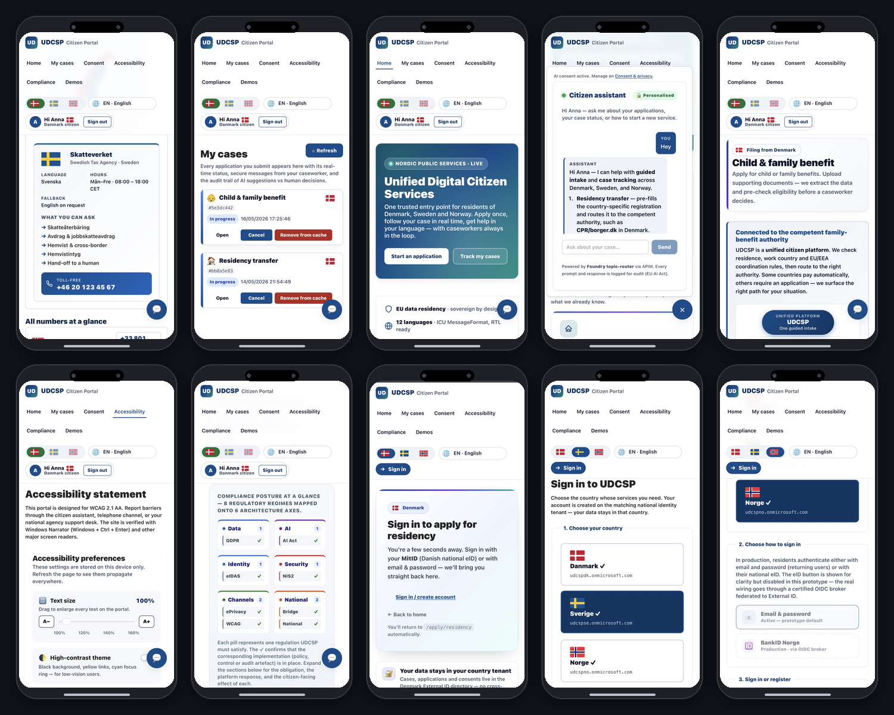
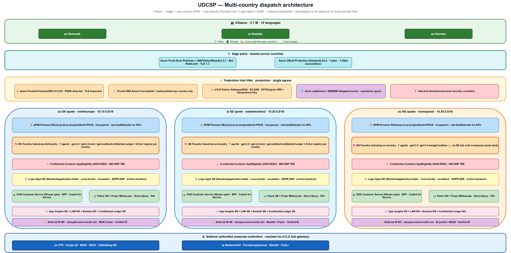
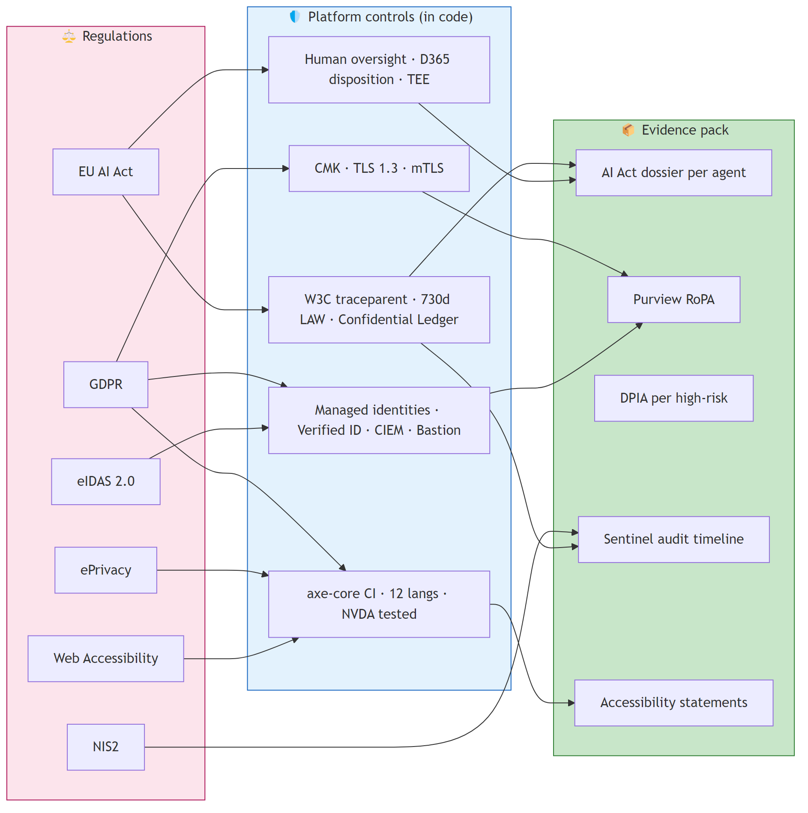
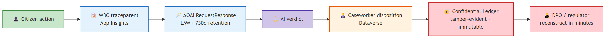
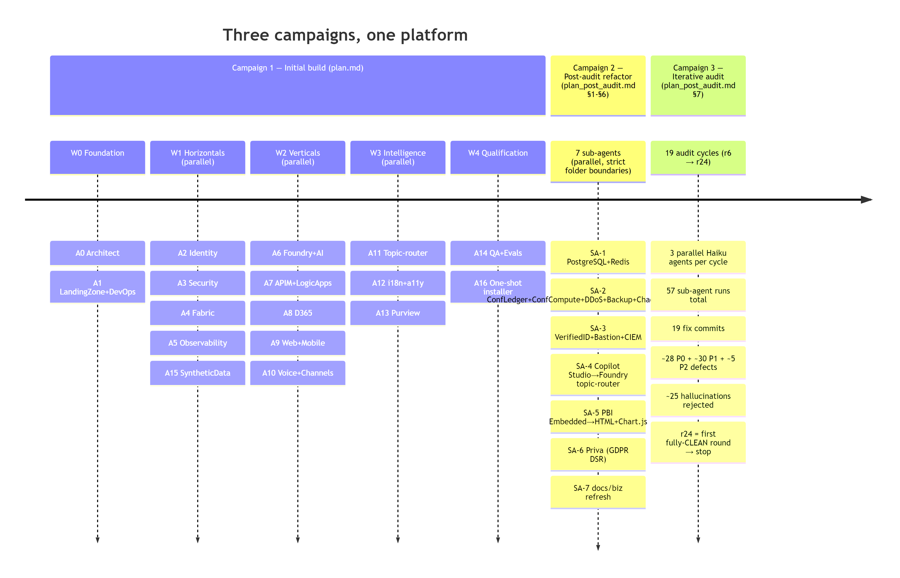

# The story

A citizen named Anna lives in Copenhagen and accepts a new job in Stockholm.

To register her residency in Sweden today she has to navigate two national portals in two languages, re-upload her identity documents, prove her income to a third tax authority and wait 28 days for a decision.

Across the three Nordic countries — Denmark, Sweden, Norway — 2.1 million citizens like Anna deal with 47 disconnected legacy portals every day. Some of those portals do not speak the citizen's language. Some are not even accessible to screen readers.

UDCSP is the answer. It is a single citizen front door across the three Nordic countries, available on web, mobile and telephone, in 12 languages, fully accessible, and powered by a multi-agent AI brain that pre-classifies, translates, extracts documents and pre-assesses eligibility — under the constant supervision of a human caseworker.

UDCSP does not replace the national authorities. CPR, borger.dk, SKAT and Udbetaling DK in Denmark; Skatteverket, Försäkringskassan and BankID in Sweden; Skatteetaten, NAV, Altinn and UDI in Norway — they remain the controllers of the substantive decision. UDCSP bridges to them. Every transaction is pre-filled, validated, then submitted to the competent authority, and the official decision comes back into the citizen's *My cases* timeline.

Processing time drops from 28 days to 4 days. Citizen satisfaction is targeted at +38 %. Forty-seven portals consolidate into one. Twelve languages are first-class, not afterthoughts.

Three sovereign data zones never share a citizen's data without an explicit, signed, audit-trailed cross-border envelope. The Eligibility model — registered under EU AI Act Annex III §5(b) as high-risk — runs inside a SEV-SNP attested Trusted Execution Environment, hashes its verdict into Azure Confidential Ledger, and is always reviewed by a human caseworker before any decision becomes final.

This document is the architect's submission for the Azure Master Architect Program.

# The citizen experience

UDCSP is one platform, three surfaces, one identity. The same citizen — Anna, Lars, Maria, Erik — meets the platform on `udcsp.fredgis.com` from a desktop browser, opens the same site on an iPhone or an Android, or dials a toll-free Nordic phone number.

The shell is responsive, the language is auto-detected and switchable to eleven others, the accessibility menu offers slow speech, high contrast and reduce-motion modes, and the chat widget is pinned in the bottom-right corner waiting for a question.

\screenfig{0.85\linewidth}{images/screen1.png}{The citizen portal home — single canonical entry across DK, SE, NO with the language picker, accessibility menu, demo index and a pinned chat widget bottom-right.}

\screenfig{0.85\linewidth}{images/screen11.png}{The sign-in landing — per-country External ID federation behind the same `udcsp.fredgis.com` URL; each country uses its national eID broker (MitID · BankID + Freja+ · ID-porten + MinID).}

\screenfig{0.85\linewidth}{images/screen2.png}{The contact page — a citizen can pick up a phone and dial the country toll-free number; the voice channel is a first-class peer of web and mobile.}

\screenfig{0.85\linewidth}{images/screen3.png}{The *My cases* timeline — every interaction, every AI verdict, every caseworker disposition, with the official decision mirrored back from the national authority.}

\screenfig{0.85\linewidth}{images/screen4.png}{The Citizen Assistant — a chat widget grounded on the national-authority knowledge base, with mandatory citation for every reply; the same widget the voice channel reaches through a function tool.}

\screenfig{0.85\linewidth}{images/screen8.png}{The cross-border transfer request — Anna's DK to SE residency form, with the AI eligibility verdict (confidence + rule-by-rule evidence + missing documents) shown *before* the citizen consents.}

The mobile experience is the same SPA, not a separate native binary. Twenty-one media queries cover the responsive breakpoints from a 375 px iPhone SE to a 430 px iPhone 14 Pro Max.

The accessibility menu reflows to a single column under 600 px, the chat widget pins to the bottom-right with a thumb-reachable target, and the file picker uses the native iOS document and photo chooser.

{width=72%}

# Architecture

UDCSP runs in three sovereign Azure zones, one per country. Denmark sits in `northeurope`, Sweden in `swedencentral`, Norway in `norwayeast`. Each zone is its own resource group, its own /16 VNet, its own Microsoft Entra External ID tenant for citizen identity, its own Application Insights workspace, its own Log Analytics workspace, and — most importantly for AI sovereignty — its own Microsoft Foundry hub.

A Foundry hub in production is a country boundary. A Danish citizen interaction stays in the Danish hub, a Norwegian voice call stays in the Norwegian hub. The three hubs share no model deployment and no agent registry.

{width=92%}

The platform is hub-and-spoke. Each country spoke peers to a federation hub VNet — production-grade, always-on, never optional.

The federation hub hosts the few elements that must be shared across sovereign zones. Azure Firewall Premium becomes the single egress path for every spoke workload, with `0.0.0.0/0` UDR-forced through it, FQDN allow-lists per workload, and TLS inspection for non-Microsoft destinations. The Private DNS zones cover thirteen `privatelink.*` surfaces — Key Vault, Storage, Postgres, Redis, ACR, Confidential Ledger, Foundry, AI Search, Service Bus, APIM, Event Grid — each linked to its country VNet only so a Danish workload cannot resolve a Swedish private endpoint. The mTLS partner gateway talks to the national authorities under eIDAS, EU SDG and OOTS standards. Azure Lighthouse provides SRE delegated access across zones, and a hub-level Sentinel correlates security events from the three country workspaces.

{width=80%}

The citizen-facing front door is Azure Front Door Premium with WAF, using Microsoft `DefaultRuleSet 2.1` for OWASP coverage, `MicrosoftDefaultRuleSet 1.0` for bot protection, and a tenant rate-limit rule of 200 requests per 5 minutes per citizen IP.

Behind Front Door, Azure API Management Premium is the gateway — one APIM instance per country, never shared. APIM enforces the OAuth 2.0 + PKCE flow on every citizen call, validates the External ID-issued bearer token, decorates every request with a W3C `traceparent` header, applies per-channel rate limits, runs the Microsoft Defender for APIs runtime protection (shadow-API discovery, sensitive-data leakage detection, anomalous token use), and proxies to Logic Apps Standard workflows and Microsoft Foundry agents as the only allowed backends.

# The AI Brain

UDCSP runs seven Microsoft Foundry agents in production, replicated identically across the three country hubs. The seven agents are not seven chatbots — they are seven specialised experts who hand work to each other under the supervision of one orchestrator, the Topic Router.

{width=92%}

Each agent has a stable name with auto-incrementing versions, an Entra-only authentication contract (no API keys, period), a managed identity per agent version, a registered EU AI Act risk class, and an evaluation suite that gates every promotion through CI.

The Topic Router owns the conversational shell. It detects the citizen's intent across 12 languages, manages slot-filling state in Azure Cache for Redis, and dispatches to the right downstream agent. Its model is gpt-5.4-mini because the work is latency-critical, low-token and high-volume.

It is invoked from two paths: by the SPA, mobile and chat widget through APIM `/agent-topic-router/messages`, and by the voice orchestrator through the `lookup_topic_router` function tool that gpt-realtime exposes to the LLM. Either way, the Topic Router never holds long-term state — its memory is the Redis slot-filling cache, scoped per session, expired in 24 hours.

The Request Classifier (gpt-5.4-mini) classifies every inbound request by intent, target agency, language and urgency. The Translator orchestrator (gpt-5.4 plus the Azure AI Translator service) bridges across the 12 languages, preserving the administrative terminology that civil servants insist on. The Document Extractor (gpt-5.4-mini plus Azure AI Document Intelligence) reads citizen-uploaded passports, payslips and leases and returns structured fields, redacted of any PII never required by the downstream agent. The Citizen Assistant (gpt-5.4, grounded) answers questions in natural language with mandatory citation enforcement — every reply has to cite a knowledge-base document by `docId`, or APIM blocks the response. The Caseworker Copilot Helper (gpt-5.4, grounded on the case record) drafts replies, summarises the case history and suggests the next-best action — purely advisory, never operative.

The Eligibility Pre-Assessor (gpt-5.4 plus deterministic rule plug-ins) is the only high-risk agent and is treated accordingly.

It runs inside an Azure Confidential Container App with SEV-SNP attestation. Every prompt and every fragment of partner-agency data fetched for the verdict are encrypted in memory during inference, even from a privileged Azure operator. Every verdict is hashed and appended to Azure Confidential Ledger, a CCF-backed tamper-evident log that gives cryptographic proof of integrity beyond what Application Insights or Microsoft Fabric can offer.

It follows a champion-challenger lifecycle. Any new version receives 5 % of production traffic in shadow for one week. The gold evaluation set is run in all 12 languages. Any locale that scores more than 0.4 below the Swedish baseline blocks the promotion until the gap is closed or an explicit waiver is recorded in the AI Act registry. Drift is tested daily on input and output distributions with a Kolmogorov-Smirnov test. Bias is monitored on protected attributes (age band, locale, channel) over the past 30 days. Rollback is a deployment-alias flip that takes seconds and writes an audit entry to the registry.

The sovereignty exception is honest and documented. Microsoft has rolled out gpt-realtime to `swedencentral` and `northeurope` but not yet to `norwayeast`. The Norwegian voice orchestrator therefore opens its WebSocket to the Swedish hub's gpt-realtime deployment under Microsoft EU Data Boundary and the Nordic Data Protection Authorities cross-border cooperation framework.

Citizen-side audio and STT transcripts persist only in Norway in the ADLS Gen2 `voice-recordings/` container with WORM 90 days. The day gpt-realtime lands in `norwayeast`, a single Bicep parameter flip moves the inference to the Norwegian hub. No application change.

# Design patterns

UDCSP is built on a deliberate stack of well-named design patterns, each chosen because it solves a concrete problem.

The voice channel is the most agentic. When a citizen dials the toll-free number, the call lands on Azure Communication Services, a Container App orchestrator picks it up, and a bidirectional WebSocket opens to Azure OpenAI gpt-realtime — a single stream that combines speech-to-text, reasoning, and text-to-speech. Inside that stream, the LLM autonomously decides whether to answer directly, to route the request to a specialist agent, or to warm-transfer the call to a human caseworker. This is the Microsoft Agent Framework Agents-as-Tools pattern, applied to a real phone call.

The application-intake path uses saga orchestration. A Logic App walks the case through six named states with explicit compensating actions when any step fails. The partner-agency call is wrapped in a circuit breaker — a sustained failure rate opens the breaker, the upstream falls fast to a manual caseworker queue, and citizens never see a thirty-second timeout. Every cross-border message carries an idempotency key and a replay-protected signed envelope.

The data path uses a read-write split. Writes go through Logic Apps and end up in Dataverse; reads go through the API gateway directly to Dataverse with response caching. The caseworker workspace is built as a strangler fig — today it writes to a generic activity table, tomorrow to the canonical case entity when D365 Customer Service licences land. Same schema, single repointing, no UI change.

The defence-in-depth posture is the most visible pattern. Six independent layers each block a different class of threat — Front Door with WAF at L7, DDoS Protection Standard at L3/L4, Azure Firewall Premium at egress, the API gateway rate-limiting and runtime API protection, Private Endpoints with per-country Private DNS at the data plane, and Content Safety with a jailbreak detector and deterministic rule plug-ins at the AI surface. A malicious prompt attempting to pivot the eligibility verdict has to defeat all six. It cannot.

# Security

Security is principle P3 of the architecture — a platform-level invariant, not a project-level afterthought. The implementation spans nine security subdomains and eight identity subdomains, but the story rests on three pillars.

The high-risk AI agent — the Eligibility Pre-Assessor — runs inside a SEV-SNP attested Trusted Execution Environment. Every prompt and every fragment of partner-agency data is encrypted in memory during inference, even from a privileged operator. Every verdict is hashed and appended to Azure Confidential Ledger, a tamper-evident log that gives cryptographic proof of integrity. The caseworker disposition that follows is anchored to the same ledger entry. Six months later, a regulator can reconstruct the decision end-to-end.

Identity is sovereign. Three CIAM tenants federate citizens through their national eIDs — MitID for Denmark, BankID and Freja+ for Sweden, ID-porten and MinID for Norway. Microsoft Entra Verified ID handles the EUDI Wallet bridge with selective disclosure, so a cross-border case only crosses with the minimum attributes required — no national ID number, no document copy. CIEM continuously inventories entitlements across the three tenants. Azure Bastion is the only path for caseworker and SRE shell access; the only public IP per country is the Bastion endpoint.

The network is locked down at egress, not just at ingress. Azure Firewall Premium is the single egress for every spoke workload, with FQDN allow-lists per workload type. The Foundry agents reach only the Cognitive Services endpoints. The Logic Apps reach only the published partner-agency endpoints. TLS inspection is on for any non-Microsoft destination. Citizen documents cannot leak through an unintended path.

# Compliance

UDCSP answers to eight regulations at once: GDPR, the EU AI Act, ePrivacy, eIDAS 2.0, NIS2, the Web Accessibility Directive, ISO 27001 and SOC 2 as operational baselines, and the national administrative law of each country. Every one of those obligations is implemented as a platform control in code, and every control produces evidence the regulator can demand.

{width=85%}

The EU AI Act trail is the most demanding, and the most visible.

Article 12 requires automatic record-keeping for high-risk AI systems for at least six months. UDCSP configures the per-country Log Analytics retention to 730 days — two times the minimum — so every model invocation, every prompt, every completion, every latency, every status code is queryable for at least two years.

Article 14 requires human oversight. Every Eligibility verdict is a proposal to a caseworker who confirms, adjusts or rejects it. The disposition is written to Dataverse and anchored to Azure Confidential Ledger alongside the verdict hash.

Annex III §5(b) classifies access to essential public services as high-risk. The Eligibility agent is registered as `risk: high` in the `governance/ai-act/registry/eligibility-model.yaml` dossier with its intended purpose, training data summary, performance metrics, known limitations and post-market monitoring plan.

{width=80%}

Article 50 of the EU AI Act requires transparency: citizens must know they are interacting with an AI. The voice channel plays a spoken disclosure on the first call turn in twelve languages. The chat widget shows an AI badge above the conversation. The Citizen Assistant agent prefixes complex answers with *"Based on UDCSP guidance…"*.

GDPR is woven into every layer. Lawful basis is registered per use case in the Record of Processing Activities held in Microsoft Purview and mirrored in `governance/gdpr/ropa.md`. Data minimisation is enforced via API Management redaction policies. Subject Access Requests, erasure requests, portability requests and rectification requests are industrialised by Microsoft Priva, with the legacy `gdpr-data-erase` and `gdpr-data-export` Logic Apps acting as executors. A DPIA is filed per high-risk processing.

NIS2 is honoured by the security posture documented above — Defender for Cloud, Defender for APIs, Sentinel, the breach-notification operational playbook with the 24/72/30-day clocks. ePrivacy is honoured by the cookie consent banner with per-purpose toggles and by the gated initialisation of any non-essential telemetry. The Web Accessibility Directive 2016/2102 is honoured by the WCAG 2.1 AA conformance — axe-core in CI, a design system with audited components, a manual annual audit, per-portal accessibility statements.

National administrative law is honoured by per-country Purview policy packs, per-country Logic Apps orchestrations, per-country sensitivity label sets. A Danish citizen's data follows Datatilsynet's instructions. A Swedish citizen's data follows IMY's. A Norwegian citizen's data follows Datatilsynet (NO).

The citizen-facing companion document — `docs/biz/traceability.md` — turns this regulatory mapping into a citizen-rights story. The technical recipe — KQL queries, retention configuration, drill paths — lives in `docs/tech/monitoring.md`.

# Monitoring

Observability is the contract between the operator and the citizen. Every interaction must be recordable, replayable and explainable.

UDCSP keeps three sovereign Application Insights instances (one per country) and three sovereign Log Analytics workspaces. The instances are never federated. A Danish citizen interaction lands only in the Danish App Insights.

A W3C `traceparent` is propagated end-to-end through every channel — from Azure Front Door at the edge, to APIM, to Logic Apps, to Azure Functions, to D365 plugins, to the Foundry agent, to the Azure OpenAI model call, and back.

Every event the platform emits — a citizen page view, a consent acceptance, a document upload, a model invocation, a caseworker disposition, a Sentinel incident, a Confidential Ledger anchor — carries the same `traceparent`. A DPO or a regulator can pick any `operation_Id` in the operator workbook, drill into Application Insights Transaction Search, and replay the full causal chain from the citizen's browser to the model's response in seconds.

The operator-facing surface is nine Azure Workbooks — three per country, deployed live as shared workbooks. `platform-health` shows request volume, p50/p95/p99 latency, dependency success and failure, exceptions and Azure OpenAI tokens by model deployment. `citizen-journey-funnel` shows the funnel from page view to case open, activity per language so a per-locale gap surfaces in raw telemetry before it appears in case data, channel mix. `ai-decision-traces` shows every verdict with confidence, decision, locale, channel, agent and an `operation_Id` that drills to Transaction Search.

The executive surface is on Microsoft Fabric F64 in the sovereign EU capacity, with a Power BI Premium semantic model that uses Direct Query against the three App Insights and the three LAWs and Dataverse. The aggregation happens server-side at Fabric. Raw rows never leave their country.

SLOs are explicit and budgeted. The citizen web portal is 99.9 % over 28 days per country, an error budget of 40 minutes per month. The voice channel is 99.5 % answer rate with a p95 turn latency of 2 seconds. The Topic Router is 99.5 % at p95 ≤ 1 second. The Eligibility verdict is 99.9 % at p95 ≤ 3 seconds. Case creation in D365 is 99.5 % at p95 ≤ 5 seconds.

Burn-rate alerts page the on-call when 2 % of the monthly budget burns in 1 hour and escalate to a manager at 5 % in 6 hours. Synthetic monitoring runs from five external regions every minute against each citizen URL and the IVR test number. Real-User Monitoring on the SPA captures TTFB, LCP, INP and CLS per page per locale per country.

FinOps is a first-class observability concern. Every resource is tagged with `country`, `workload` and `cost-center`. The Management Group hierarchy mirrors the sovereign zones. The per-agent monthly token budget lives in `foundry/projects/*/agent.yaml` and CI fails when the total declared budget exceeds the Azure OpenAI pool capacity. Reserved PTU baseline covers the steady-state of gpt-5.4 and gpt-realtime; pay-as-you-go covers elastic peaks on gpt-5.4-mini.

# Agentic behaviour

UDCSP is multi-agent by construction, not by veneer.

The most visible agentic moment is the voice channel. When the citizen asks for help, the LLM receives the audio, reasons over the request, and decides on its own whether to answer directly, to route the question to a specialist agent, or to escalate to a human. The model is treated as a tool-using agent — the canonical Microsoft Agent Framework pattern.

Beyond voice, UDCSP demonstrates four further coordination patterns. **Handoff** is the bread and butter — the Topic Router passes the conversation to one of six specialised downstream agents depending on intent. **State-graph orchestration** is what Logic Apps deliver — the cross-border case is a six-step graph with named states and compensating actions. **Reflection** is how the eligibility verdict is consumed — the Caseworker Helper surfaces the confidence and missing evidence in natural language, and the caseworker's disposition feeds the next training iteration as ground truth. **Shadow and canary** is how new models reach production — a challenger gets 5 % of production traffic, an automated job replays anonymised prompts through it, and the alias is autonomously flipped only if every guarded metric passes.

The agentic story is not a chatbot. It is a system of seven specialised experts, two function tools, one orchestrator, five coordination patterns — all under the supervision of one human caseworker.

# How we built it

UDCSP itself is the product of three multi-agent development campaigns. The platform was scaffolded, refactored and hardened by AI coding agents, end to end, with measurable parallelism factors.

{width=92%}

The first campaign was the initial build. Seventeen plan-agents (A0 to A16) were declared in `docs/tech/plan.md` and collapsed into six vertical sub-agents that owned non-overlapping folder trees: `agent-platform` owned `infra/`, `agent-data-gov` owned the Fabric and governance assets, `agent-foundry` owned the Foundry agents and the multilingual catalogue, `agent-services` owned APIM, Logic Apps and D365, `agent-frontend` owned the web, mobile and voice apps, and `agent-qa` owned the test suite. An orchestrator session wrote the installer, the master documents and the CI plumbing concurrently with the six verticals.

The longest single sub-agent (`agent-platform`) ran for 11 minutes 5 seconds. The sum of every sub-agent's wall-clock time was 45 minutes 47 seconds. The parallelism factor for the sub-agent fan-out alone was 4.13×, rising to ~5× end-to-end when the orchestrator's concurrent work is included. Six hundred and three files were produced in this campaign, distributed across the strict folder boundaries.

The second campaign was the post-audit refactor. An architectural audit identified four services to suppress (Azure SQL Database, Cosmos DB, Microsoft Copilot Studio, Power BI Embedded for citizen-facing surfaces) and nine services to add for production-grade compliance (Microsoft Entra Verified ID, Microsoft Priva, Azure Confidential Ledger, Azure Confidential Computing, Microsoft Defender for APIs, Azure DDoS Protection Standard, Azure Backup + Site Recovery, Azure Chaos Studio, Azure Bastion). Seven sub-agents executed the refactor in parallel under strict folder boundaries — `sa1-data-refactor`, `sa2-security-additions`, `sa3-identity-additions`, `sa4-copilot-into-foundry`, `sa5-pbi-embedded-to-html`, `sa6-priva-gdpr`, `sa7-docs-biz` — bringing the installer phases from 15 to 25.

The third campaign was the iterative audit. Nineteen audit cycles (`r6` through `r24`) ran three parallel agents per cycle, for fifty-seven sub-agent runs total. Each cycle produced a fix commit. Approximately twenty-eight P0 defects, thirty P1 defects and five P2 defects were fixed. Approximately twenty-five hallucinations were rejected. The twenty-fourth round was the first fully CLEAN round, at which point the campaign stopped.

The net result is the platform you see today. Forty-seven Bicep modules. Twenty-five PowerShell install modules. Eight hundred and sixty-eight tracked files. Fourteen markdown documents totalling more than thirteen thousand lines. Two custom Copilot CLI skills (`md2pdf` and `drawio2png`) that support the documentation pipeline and are themselves reusable beyond UDCSP — they live in a separate repository at `github.com/fredgis/fabric-foundry-kb`.

The discipline that made parallelism possible was strict folder ownership. No two agents wrote to overlapping paths. Contracts between agents — registry entry IDs, ICU catalogue keys, OpenAPI specs, mirroring configuration — were resolved at orchestrator finalisation. Risks observed during the build — sub-agents writing to overlapping folders, inconsistent IDs, i18n drift, installer modules referencing missing test scripts — were caught by the orchestrator before any sub-agent could create a regression.

# Personas — who actually uses the platform

The platform is not built for an abstract "user". It is built for **named people on real journeys** — six citizens and operators with concrete demands, plus one threat scenario that shows what the defences do when the platform is attacked. They are the seven vignettes that follow.

\persona{images/Demo1.png}{Anna — Danish citizen moving DK to SE}
**Anna** is moving from Copenhagen to Stockholm. She lands on the Swedish portal in Danish, signs in with her Danish eID, uploads her passport and her Stockholm lease.

In under four seconds, the AI extracts the structured fields, translates the lease into Swedish, and proposes an eligibility verdict with the rule-by-rule evidence. Anna consents on the explanation, not on the verdict.

The platform orchestrates the case to the Danish authority, receives a signed confirmation, and creates the case in the Swedish caseworker queue. A human caseworker reviews and decides.

What used to take 28 days now takes 4.

\bigskip

\persona{images/Demo2.png}{Lars — blind Norwegian citizen on voice}
**Lars** is blind. He dials the Norwegian toll-free number and starts speaking in Norwegian.

The AI brain answers him in Norwegian without a single button to press. When his question hits a tax-refund topic, the model autonomously routes to the right Foundry agent under the hood — the citizen never knows the architecture, only the conversation.

When Lars asks to speak with a human, the call is warm-transferred to a caseworker queue with the full context attached. The transcript stays in Norway.

Voice latency p95 ≤ 2 seconds. Lars is treated as a first-class citizen on the platform, not an accessibility afterthought.

\bigskip

\persona{images/Demo3.png}{Maria — Polish caregiver in Denmark with NVDA}
**Maria** is a Polish caregiver who lives in Denmark. She uses NVDA on Windows 11 and keyboard navigation.

The portal loads in Polish, end-to-end — labels, error messages, AI summary, consent text. The accessibility CI gate has been green for months. The Translator agent localises the citizen-facing summary.

If a model promotion ever regresses Polish more than 0.4 below the Swedish baseline, the promotion is blocked. Accessibility is not a feature on this platform — it is a citizen right under the Web Accessibility Directive and WCAG 2.1 AA.

\bigskip

\persona{images/Demo4.png}{Erik — Danish SMB owner on iPhone}
**Erik** runs a small construction business in Aarhus and applies for an income-based benefit on his iPhone.

The portal is the same SPA Anna used on her laptop — there is no separate native binary, no separate mobile codebase. Twenty-one media queries reflow the layout from a 375 px iPhone SE to a 430 px Pro Max. The native iOS document picker captures his payslip; the AI returns the structured fields and an eligibility verdict inline.

Mobile parity is built in, not bolted on.

\bigskip

\persona{images/Demo8.png}{Prompt injection contained at three layers}
**A hostile prompt** arrives on the chat widget, trying to pivot the eligibility verdict. Three independent layers stop it — the API gateway flags the anomaly, the Content Safety jailbreak detector emits a security event, and the eligibility deterministic rule plug-in rejects the request before the model fires.

The security playbook isolates the session, recovers the citizen flow, and exports the audit pack. The containment takes 38 seconds. No citizen data is exposed.

\bigskip

\persona{images/Demo7.png}{Hans — Danish DPO replaying an AI decision}
**Hans** is the Danish DPO. A citizen has filed an Article 15 subject access request asking for every AI decision made about her over the past six months.

Hans opens the per-country Log Analytics workspace, filters by the citizen's correlation ID, and reconstructs the full decision — the model deployment, the tokens consumed, the verdict, the human disposition, the cryptographic ledger anchor.

The decision happened six months ago. It is still queryable two years out, configured to twice the AI Act minimum retention. The full audit pack assembles in under ten minutes.

\bigskip

\persona{images/Demo10.png}{Ole — DevOps engineer onboarding a tenant}
**Ole** is the DevOps engineer evaluating the platform for adoption. He clones the repository on a clean tenant and runs the master installer.

Twenty-five phases execute in dependency order. The synthetic-data agent seeds tens of thousands of personas and conversations into Fabric and Foundry in parallel with the frontend deployment. The smoke suite runs at the end and the HTML report is green across the board.

From `git clone` to a working federated platform with realistic data: one command. The same script runs in CI on every PR that touches infrastructure or apps.

# Performance and reliability

Reliability is engineered, not assumed.

Each country runs active-passive with DNS-level Front Door priority routing. When the primary region degrades, traffic flips to the paired EU region within five minutes. The Recovery Point Objective is fifteen minutes across every stateful workload. The Recovery Time Objective is four hours to a full citizen-facing service in the paired region.

Azure Backup vaults are per country (Postgres, Redis, critical Storage, agent VMs). Azure Site Recovery replicates between paired EU regions. Azure Chaos Studio injects faults — region failover, NSG isolation, Postgres failover, per-country Foundry hub blackout — on a monthly cadence in non-production and a quarterly cadence in production.

The 99.9 % SLO is not a marketing claim. It is empirically validated through the chaos drills, and the burn-rate alerts are wired through Teams and PagerDuty to the on-call rotation.

The Eligibility verdict path is the latency-sensitive one. Citizens consent on the explanation, and the explanation has to arrive in under three seconds at p95. The voice channel is the most latency-sensitive of all — gpt-realtime turn latency has to stay under two seconds at p95, or the conversation becomes unnatural.

The Container App voice orchestrator runs with a minimum of one replica per country to avoid cold-start penalties, scales horizontally to six replicas on a `concurrentRequests=20` threshold, and is pre-warmed before every demo by a dial-test from the operator's terminal.

# Closing

UDCSP is not a demo wrapped around a few Azure services.

It is a production-grade unified citizen platform for the three Nordic countries, spanning three sovereign Azure zones, seven AI agents, forty-seven Bicep modules, twenty-five install scripts, fourteen documents and 868 tracked files.

Every architectural decision is anchored to a regulation — GDPR, the EU AI Act, ePrivacy, eIDAS 2.0, NIS2, the Web Accessibility Directive, national administrative law. Every claim is provable by a live demonstration on a real Azure tenant.

The citizen who started this story — Anna in Copenhagen — does not need to know any of this. She signs in once, fills in one form, gets her residency decision in four days instead of twenty-eight.

The platform is invisible to her. That is exactly the point.

---

*Document built by the `md2pdf` Copilot CLI skill (pandoc + xelatex + Mermaid pre-rendering) from `github.com/fredgis/UDCSP/presentation/project.md`. Cover image is the ten-demo overview; technical companion docs live under `docs/biz/` and `docs/tech/` in the same repository.*
