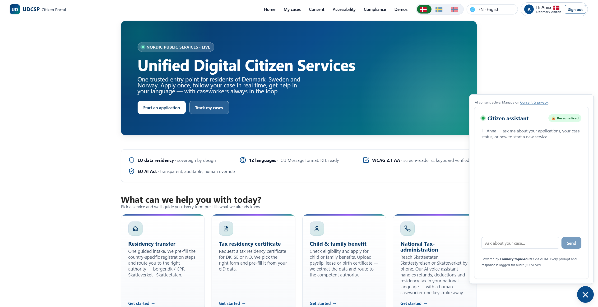
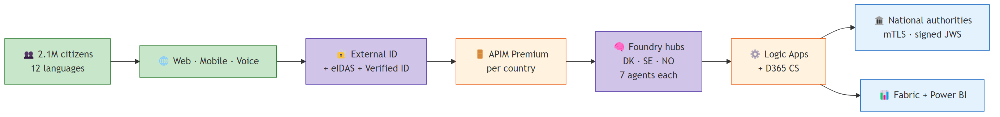
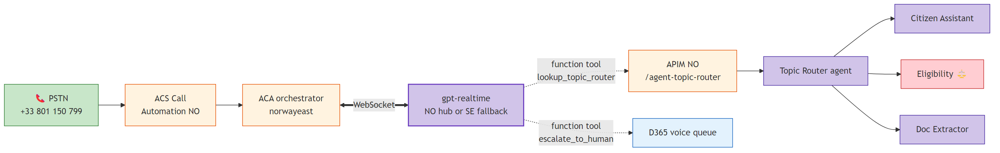
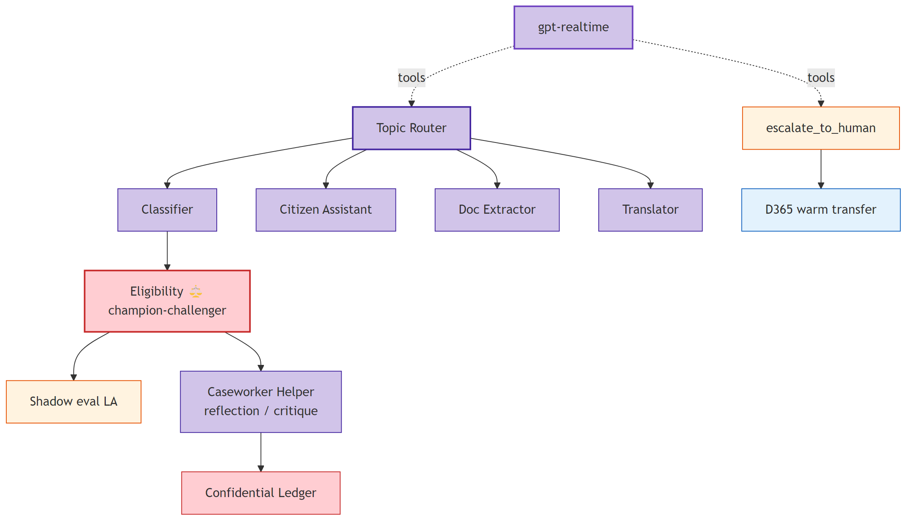
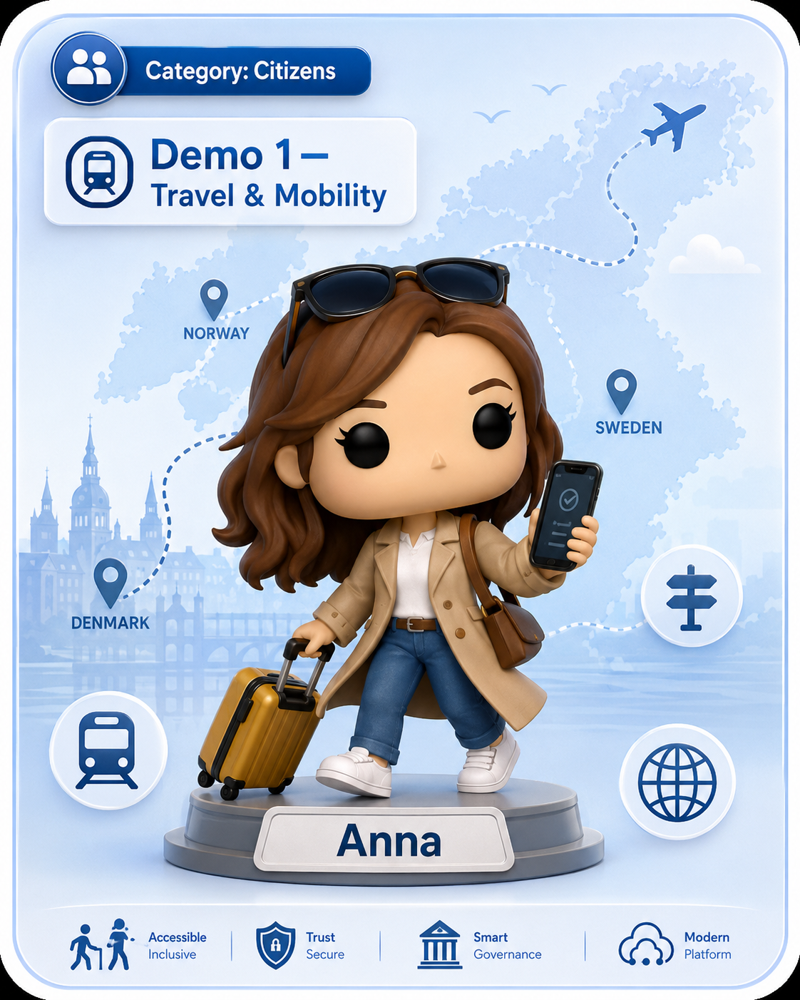
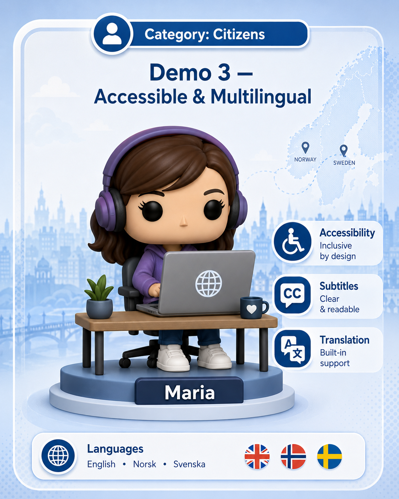
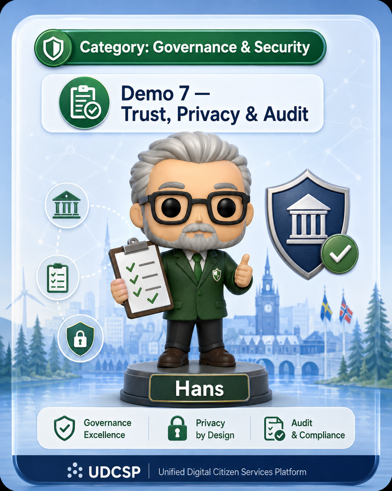
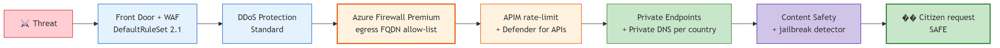

<!-- _class: lead -->
<!-- _paginate: false -->
<!-- _header: '' -->
<!-- _footer: '' -->

<div class="tag">Azure Master Architect Program · May 2026</div>

# Unified Digital<br>Citizen Services Platform.

## One front door for 2.1 M Nordic citizens across DK · SE · NO

### Architecture, AI & Agentic submission

---

# The problem.

<div class="split">
<div>

<div class="stat">
<div class="big">2.1 M</div>
<div class="label">citizens across 🇩🇰 🇸🇪 🇳🇴</div>
</div>

<div class="stat">
<div class="big">47</div>
<div class="label">disconnected legacy portals</div>
</div>

<div class="stat">
<div class="big">28 d</div>
<div class="label">average residency-case processing time</div>
</div>

</div>
<div>

A citizen who moves from Copenhagen to Stockholm re-submits identity documents, waits **28 days** for a residency decision, navigates a portal that may not speak their language, and which may not be accessible to them at all.

UDCSP unifies the front door. It bridges to the existing national authorities — never replaces them.

<span class="pill">GDPR</span> <span class="pill">EU AI Act</span> <span class="pill">eIDAS 2.0</span> <span class="pill">NIS2</span> <span class="pill">WCAG 2.1 AA</span> <span class="pill">ePrivacy</span>

</div>
</div>

---

# What we ship.

<div class="cards four">
<div class="card">
<div class="card-num">CHANNEL</div>
<h3>🌐 Web · Mobile · Voice</h3>
<p>One SPA, 12 langs, WCAG 2.1 AA · Toll-free PSTN per country · iPhone PWA</p>
</div>
<div class="card teal">
<div class="card-num">AI BRAIN</div>
<h3>🧠 Foundry · 7 agents</h3>
<p>Topic router + classifier + eligibility + assistant + doc extractor + caseworker + translator</p>
</div>
<div class="card green">
<div class="card-num">OUTCOMES</div>
<h3>📉 28 d → 4 d</h3>
<p>Cross-border residency in 4 days · +38 % CSAT target · 47 portals → 1</p>
</div>
<div class="card orange">
<div class="card-num">SOVEREIGN</div>
<h3>🛡️ 3 zones</h3>
<p>3 Foundry hubs · 3 App Insights · 3 LAW · 0 cross-border telemetry</p>
</div>
</div>

> The platform is a **unified citizen platform**, not a substitute for the national authorities. CPR, Skatteverket, NAV, Altinn, UDI remain the controllers of the substantive decision.

---

# The platform you actually see.

<div class="split right-wide">
<div>

One SPA · 12 languages · 3 channels · always accessible.

The same React + TypeScript bundle runs on desktop, tablet and phone. Twenty-one media queries reflow the breakpoints from 375 px to 1100 px.

The chat widget pins bottom-right; the accessibility menu offers slow speech, high contrast and reduce-motion.

Every *Apply* page shows the AI eligibility verdict — confidence, rule-by-rule evidence, missing-evidence list — **before** the citizen consents.

</div>
<div>




</div>
</div>

---

<!-- _class: chapter -->
<div class="num">01</div>

# Architecture.

## 3 sovereign zones · hub-and-spoke · 47 Bicep modules · 25 install PSMs

---

# High-level architecture.



> One citizen experience, three sovereign back-offices, one AI brain replicated per country. The mTLS gateway in the federation hub is the only path to the national authorities.

---

# 3 sovereign Foundry hubs in production.

<div class="split">
<div>

### One hub per country

Each Foundry hub is deployed in its country's Azure region:

- 🇩🇰 **DK hub** — `northeurope`
- 🇸🇪 **SE hub** — `swedencentral`
- 🇳🇴 **NO hub** — `norwayeast`

No agent call ever crosses a national border. APIM `udcsp-{c}-prod-apim` only talks to the in-country hub.

</div>
<div>

### Per-hub model deployments

- **gpt-realtime** — voice channel
- **gpt-5.4** — high-stakes (Eligibility, Assistant, Caseworker Helper)
- **gpt-5.4-mini** — low-stakes (Classifier, Doc Extractor, Topic Router)

</div>
</div>

> **Sovereignty exception.** `gpt-realtime` is not yet GA in `norwayeast`. The NO voice orchestrator uses the SE hub's deployment under Microsoft EU Data Boundary + Nordic-DPA cooperation. Audio + transcripts persist only in NO. Single Bicep flip when quota lands.

---

# Network topology.


> Per-country `/16` spoke. Federation hub holds Azure Firewall Premium + Private DNS Zones + mTLS partner gateway + Lighthouse + B2B + hub-level Sentinel. One public IP per country: Bastion. No spoke-to-spoke peering.

---

# Design patterns we use.

<div class="cards">
<div class="card">
<h3>Agents-as-Tools</h3>
<p>gpt-realtime invokes <code>lookup_topic_router</code> + <code>escalate_to_human</code> as function tools.</p>
</div>
<div class="card teal">
<h3>BFF + Saga</h3>
<p>APIM × 3 per country; LA <code>cross-border-residency</code> is a 6-step saga with compensating actions.</p>
</div>
<div class="card orange">
<h3>Strangler fig</h3>
<p>SPA writes to <code>task</code> today, <code>udcsp_application</code> tomorrow — same schema, single LA repointing.</p>
</div>
<div class="card green">
<h3>CQRS-light</h3>
<p>Write via Logic App; read via APIM op-policy directly on Dataverse.</p>
</div>
<div class="card purple">
<h3>Sidecar</h3>
<p>Voice orchestrator pairs <code>call-handler.ts</code> with <code>realtime-bridge.ts</code>.</p>
</div>
<div class="card red">
<h3>Circuit breaker</h3>
<p>APIM 50 % failure / 60 s → open / 5 min on every partner endpoint.</p>
</div>
</div>

---

<!-- _class: chapter -->
<div class="num">02</div>

# AI & Agents.

## 7 Foundry agents · Agents-as-Tools · champion-challenger · per-country sovereignty

---

# Agent catalogue.

| Agent | Purpose | Model | AI Act class |
|---|---|---|:-:|
| **Topic Router** | Multi-turn orchestration · 12 langs · slot-filling in Redis | gpt-5.4-mini | Limited |
| **Request Classifier** | Intent · agency · language · urgency | gpt-5.4-mini | Limited |
| **Translator** | 12-language admin terminology preservation | gpt-5.4 + AI Translator | Limited |
| **Eligibility Pre-Assessor** ⚖️ | Verdict + lineage · runs in TEE · Confidential Ledger anchor | gpt-5.4 + det. rules | **High (Annex III §5b)** |
| **Citizen Assistant** | RAG over public KB · multi-lingual | gpt-5.4 grounded | Limited |
| **Document Extractor** | Passport / payslip / lease structured extraction | gpt-5.4-mini + Doc Intel | Limited |
| **Caseworker Copilot Helper** | Summarise · draft replies · NBA | gpt-5.4 grounded | Limited |

> **No agent makes a final decision.** Every Eligibility verdict is a *proposal* to a human caseworker who confirms, adjusts or rejects. Citizen sees the rule-by-rule explanation **before** consenting.

---

# Voice channel — Agents-as-Tools pattern.



> Citizen dials → ACS Call Automation → Container App → bidirectional WebSocket to gpt-realtime → **the LLM autonomously decides** to call `lookup_topic_router` (function tool) or `escalate_to_human` (warm transfer). Microsoft Agent Framework canonical pattern.

---

# Eligibility model lifecycle.

<div class="steps">
<div class="step"><div class="step-content"><strong>Champion-challenger</strong><span>5 % shadow traffic on the new version for 1 week, then evaluated.</span></div></div>
<div class="step"><div class="step-content"><strong>Per-locale parity gate</strong><span>Gold-eval set in all 12 languages. Locale > 0.4 below SV baseline = promotion blocked.</span></div></div>
<div class="step"><div class="step-content"><strong>Drift detection</strong><span>Daily KS-test on input + output distribution. Drift → Sentinel incident → re-eval.</span></div></div>
<div class="step"><div class="step-content"><strong>Bias monitoring</strong><span>Statistical-parity tests on age / locale / channel over 30d. Breach → senior reviewer queue.</span></div></div>
<div class="step"><div class="step-content"><strong>Shadow LA</strong><span><code>ai-decision-shadow-mode</code> replays anonymised production through challenger. Delta > 3 % → block.</span></div></div>
<div class="step"><div class="step-content"><strong>Rollback</strong><span>Immutable agent versions <code>&lt;name&gt;:&lt;n&gt;</code>. Alias flip restores previous in seconds. Audit-trail in registry.</span></div></div>
</div>

---

# Multi-agent coordination — beyond a chatbot.



> Handoff (router → 6 experts) · Reflection (caseworker-helper critiques eligibility) · State graph (LA cross-border, 6 named states with compensating actions) · Function tool · Warm transfer · Shadow/canary.

---

<!-- _class: chapter -->
<div class="num">03</div>

# Live demos.

## 7 scenarios — citizens · security · compliance · DevOps

---

# Demo 1 — Anna moves DK → SE.



<div class="steps">
<div class="step"><div class="step-content"><strong>Anna signs in to the SE portal with her Danish eID</strong><span>External ID federation · Verified ID attribute disclosure</span></div></div>
<div class="step"><div class="step-content"><strong>Uploads DK passport + lease</strong><span>Doc Extractor returns structured fields in &lt; 4 s</span></div></div>
<div class="step"><div class="step-content"><strong>Translator agent DA → SV</strong><span>Administrative-terminology preserving</span></div></div>
<div class="step"><div class="step-content"><strong>Eligibility verdict with confidence + missing-evidence</strong><span>Citizen consents before submission</span></div></div>
<div class="step"><div class="step-content"><strong>LA cross-border-residency → mTLS to DK partner agency</strong><span>Signed JWS · Idempotency-Key · circuit-breaker</span></div></div>
<div class="step"><div class="step-content"><strong>D365 case created in SE, AI verdict attached</strong><span>SLA target: 4 days</span></div></div>
</div>

---

# Demo 2 — Lars asks the voice assistant. ⭐ hero


- Lars (blind, NO) dials **`+33 801 150 799`**
- ACS Call Automation NO → Container App → gpt-realtime
- LLM invokes `lookup_topic_router` function tool → APIM → Topic Router → Citizen Assistant
- Tax-refund answer returned in Norwegian, voice latency p95 ≤ 2 s
- Warm-transfer to D365 voice workstream on request
- Audio + STT transcript persist in NO `voice-recordings/` (WORM 90 d)

> **Real PSTN, real audio, real W3C `traceparent` from ACS to model call.** Open the App Insights NO `platform-health` workbook live; the `call.connected` and `realtime.tool_call` events land within 2 min.

---

# Demo 3 — Maria with Windows Narrator.



- Polish caregiver, lives in Denmark, applies for child benefit
- **SPA fully in Polish** end-to-end (12 languages shipped)
- **NVDA + keyboard** navigation, no mouse
- axe-core CI gate, RouteAnnouncer + cookie-banner a11y patches
- Translator agent localises the citizen-facing summary
- `citizen-journey-funnel` workbook lights up with `customDimensions['locale']='pl'`

> Accessibility is **not a feature** — it is a citizen right. WCAG 2.1 AA · Web Accessibility Directive 2016/2102.

---

# Demo 4 — Erik snaps a payslip on iPhone.


- Danish SMB owner, on mobile
- Responsive PWA on `udcsp.fredgis.com` (21 media queries, breakpoints 375 → 430 px)
- Native iOS document chooser to snap a payslip
- Doc Extractor returns structured fields
- AI eligibility verdict displayed inline
- Submit → My Cases timeline updates in real time

> Same SPA bundle as the desktop demo — Demo 4 proves **mobile parity** without a separate native binary. Citizen experience is uniform across screens.

---

# Demo — Security: prompt-injection contained.


A malicious prompt attempting to extract the system prompt or pivot the eligibility verdict is caught at **three layers**:

<div class="steps">
<div class="step"><div class="step-content"><strong>APIM rate-limit + Defender for APIs</strong><span>Anomalous token rate · sensitive-data leak detection</span></div></div>
<div class="step"><div class="step-content"><strong>Foundry Content Safety jailbreak detector</strong><span><code>safety.block</code> customEvent → Sentinel incident</span></div></div>
<div class="step"><div class="step-content"><strong>Eligibility deterministic rule plug-in</strong><span>Rejects the request before LLM inference fires</span></div></div>
</div>

> Sentinel playbook isolates the session, recovers the citizen flow, exports the audit pack with `correlationId` chain.

---

# Demo — Compliance: Hans the DPO audits a 6-month-old decision.




> AI Act art. 12.3 minimum = 6 months. LAW retention configured to **730 days** = 2× minimum. From DSAR to full audit pack: **< 10 minutes**.

---

# Demo — DevOps: one-shot installer.


```powershell
git clone https://github.com/fredgis/UDCSP
cd UDCSP
pwsh ./scripts/install/Install-UDCSP.ps1 `
     -Environment dev -Zone all `
     -SeedSyntheticData -Verbose
```

- 25 phases in dependency order: LandingZone → Identity → Security → Data → Observability → APIM → Foundry → D365 → Frontend → Voice → Governance → QA
- A15 synthetic-data seeding runs in parallel with frontend deploy
- A14 smoke suite at the end (identity · APIM health · Foundry reachability · D365 case creation · Power BI refresh · accessibility quick-scan)
- HTML report at `scripts/install/reports/<timestamp>/install-report.html`

> From `git clone` to a working federated platform with realistic synthetic data: **one command**. Same script runs in CI on every PR.

---

<!-- _class: chapter -->
<div class="num">04</div>

# Security &<br>compliance.

## Defence in depth · GDPR · EU AI Act · ePrivacy · eIDAS 2.0 · NIS2 · WCAG

---

# Defence in depth — 6 layers.



<div class="cards">
<div class="card"><h3>L7 edge</h3><p>Front Door Premium + WAF (DefaultRuleSet 2.1 + Bot + RateLimit)</p></div>
<div class="card teal"><h3>L3/L4 edge</h3><p>DDoS Protection Standard on every VNet</p></div>
<div class="card orange"><h3>Egress</h3><p>Azure Firewall Premium · FQDN allow-list · TLS inspection</p></div>
</div>

---

# Identity & data sovereignty.

<div class="split">
<div>

### Identity (8 subdomains)

- 3 CIAM tenants (External ID per country)
- Verified ID issuer + verifier (EUDI Wallet)
- CIEM cross-tenant entitlement audit
- PIM time-bound elevation
- Bastion sole admin path
- Cross-tenant B2B (caseworker guest)
- Azure Lighthouse SRE delegation
- Conditional Access + MFA

</div>
<div>

### Sovereign data (5 zones)

- **Operational** — Postgres Flex + Redis Enterprise per country
- **Documents** — ADLS Gen2 immutable WORM
- **Conversations** — App Insights + Dataverse (AI Act art. 12.3)
- **Knowledge** — AI Search ACL by `citizen_id` + `country`
- **Analytics** — Fabric F64 sovereign EU + Power BI Premium

</div>
</div>

> **Customer-managed keys** per country · TLS 1.3 in transit · mTLS to partners · field-level encryption for national IDs · `publicNetworkAccess: Disabled` everywhere.

---

# EU AI Act — article-by-article mapping.

| Article | Requirement | UDCSP delivery |
|---|---|---|
| **Art. 12** | Auto record-keeping ≥ 6 months for high-risk | AOAI `RequestResponse` → LAW · **730d retention** (2× min) |
| **Art. 13** | Transparency to deployers | Foundry registry per agent · eval per locale |
| **Art. 14** | Human oversight | Caseworker disposition · Confidential Ledger anchor |
| **Annex III §5(b)** | High-risk = essential public services | Eligibility agent declared `risk: high` |
| **Art. 50** | Citizen knows AI is used | AI-assisted badge · voice spoken disclosure 12 langs |

> AI Act + GDPR (Art. 5/13/15/17/22/30/32) + ePrivacy + eIDAS 2.0 + NIS2 + WCAG 2.1 AA are all mapped to platform controls. Full mapping in `docs/biz/datacompliance.md`.

---

<!-- _class: chapter -->
<div class="num">05</div>

# Monitoring &<br>FinOps.

## 9 workbooks · W3C traceparent · SLO + error budgets · synthetic + RUM

---

# Telemetry pillars.

<div class="cards">
<div class="card">
<div class="card-num">METRICS / LOGS</div>
<h3>Azure Monitor + LAW</h3>
<p>3 workspaces (one per country) · 180d hot · 7y cold · never federated</p>
</div>
<div class="card teal">
<div class="card-num">DISTRIBUTED TRACE</div>
<h3>Application Insights</h3>
<p>W3C <code>traceparent</code> end-to-end · Front Door → APIM → LA → D365 → Foundry → AOAI</p>
</div>
<div class="card purple">
<div class="card-num">AI QUALITY</div>
<h3>Foundry Evaluations</h3>
<p>Continuous · drift monitors · per-locale parity · bias monitoring</p>
</div>
<div class="card red">
<div class="card-num">AI ACT EVIDENCE</div>
<h3>Confidential Ledger</h3>
<p>Tamper-evident anchors · cross-resource KQL joins LAW ↔ AI ↔ Dataverse</p>
</div>
<div class="card orange">
<div class="card-num">ACTIVE</div>
<h3>Synthetic + RUM</h3>
<p>5 external regions · 60s probes · TTFB / LCP / INP per locale</p>
</div>
<div class="card green">
<div class="card-num">DASHBOARDS</div>
<h3>3 × 3 workbooks</h3>
<p>platform-health · citizen-journey-funnel · ai-decision-traces · per country</p>
</div>
</div>

---

# SLOs and error budgets.

| Surface | SLO | Error budget | Burn-rate alert |
|---|---|---|---|
| Citizen web portal (per country) | 99.9 % over 28 d | 40 min / month | 2 % in 1 h → page |
| Voice channel (per country) | 99.5 % answer · p95 ≤ 2 s | 22 h / month | latency p95 > 2 s 5 min → page |
| Topic-router agent | 99.5 % · p95 ≤ 1 s | 22 h / month | identical |
| Eligibility verdict | 99.9 % · p95 ≤ 3 s | 40 min / month | identical |
| Case-creation in D365 | 99.5 % · p95 ≤ 5 s | 22 h / month | identical |

> Burn-rate alerts route to Teams + PagerDuty + Sentinel for security-class incidents. 5 % budget burn in 6 h → manager escalation.

---

# FinOps.

<div class="split">
<div>

### Cost allocation

- Tags `country`, `workload`, `cost-center`
- Management Group hierarchy mirrors sovereign zones
- Cost Management views per country and workload

### Token budget

- Per-agent monthly budget in `foundry/projects/*/agent.yaml`
- CI fails if total declared > pool capacity
- Power BI page slices tokens / agent / channel / language / country

</div>
<div>

### Reserved + spot

- Reserved AOAI PTU for gpt-5.4 + gpt-realtime baseline
- Pay-as-you-go for elastic peaks (gpt-5.4-mini)

### Anomaly detection

- Threshold +30 % d/d per country
- Sentinel correlation rules join with security signals

### Showback

- Cross-country chargeback rendered in the executive Power BI page
- Each ministry sees its country's cost broken down by workload

</div>
</div>

---

<!-- _class: chapter -->
<div class="num">06</div>

# Reliability.

## Active-passive · BackupASR · Chaos Studio · p95 SLOs · Confidential Ledger

---

# Performance & reliability.

<div class="stats-row">
<div class="stat"><div class="big">99.9%</div><div class="label">citizen web SLO per country</div></div>
<div class="stat"><div class="big">≤ 2s</div><div class="label">voice turn p95 latency</div></div>
<div class="stat"><div class="big">15 min</div><div class="label">RPO across all workloads</div></div>
<div class="stat"><div class="big">4 h</div><div class="label">RTO to paired EU region</div></div>
</div>

<div class="cards">
<div class="card"><h3>Active-passive per country</h3><p>DNS-level Front Door priority routing. Failover within 5 min.</p></div>
<div class="card teal"><h3>BackupASR</h3><p>Postgres + Redis + Storage + agent VMs. Per-country RSV.</p></div>
<div class="card orange"><h3>Chaos Studio</h3><p>Monthly non-prod, quarterly prod drill. Region failover · NSG isolation · Postgres failover · Foundry hub blackout.</p></div>
<div class="card red"><h3>Confidential Ledger</h3><p>Append-only, hardware-attested. Forensic anchors persist indefinitely.</p></div>
</div>

---

<!-- _class: chapter -->
<div class="num">07</div>

# Closing.

## A production-grade unified citizen platform — not a demo.

---

<!-- _class: closing -->
<!-- _paginate: false -->

## Closing

# UDCSP is a production-grade platform, not a demo.

<p>
3 sovereign zones · 7 AI agents · 47 Bicep modules · 25 install PSMs · 14 documents · 868 tracked files. Every architectural decision is anchored to a regulation. Every claim is provable on a real Azure tenant. One command from <code>git clone</code> to running platform.
</p>

<p style="margin-top: 36px; opacity: 0.6; font-size: 0.85em">
Frederic Gisbert · May 2026 · github.com/fredgis/UDCSP
</p>
