<!-- _class: lead -->
<!-- _paginate: false -->
<!-- _header: '' -->
<!-- _footer: '' -->

<!-- ⏱ 0:40 — Good morning, everyone — I'm Frederic.
I'll walk you through UDCSP, the Unified Digital Citizen Services Platform.
The idea is simple.
Today, citizens prove who they are and retype the same papers across dozens of systems.
Instead, we give them one identity and one experience, while the platform connects behind the scenes to share and check what's needed.
It serves two point one million citizens across Denmark, Sweden and Norway.
In the next thirty-five minutes I'll cover the problem, the architecture, the AI and the security — including the EU AI Act and GDPR — and then run a live demo. -->

<div class="tag">Azure Master Architect Program · June 2026</div>

# Unified Digital<br>Citizen Services Platform.

## One front door for 2.1 M Nordic citizens across DK · SE · NO

### Architecture, AI & Agentic submission

---

<!-- _class: tight -->

# What this is — and what it isn't.

<!-- ⏱ 0:35 — Before we dive in, one honest framing.
UDCSP is a production accelerator, not an exhaustive demo.
What you'll see is a target vision, with a working core you can run on a real Azure tenant today, and a partial live demonstration of it.
A few bricks are still at blueprint stage — designed and registered, but not yet switched on — and each one has a named gate on the roadmap.
So every claim in this deck carries one of five honesty labels, and I'll show the full coverage and the roadmap near the end. -->

<div class="cards">
<div class="card"><h3>🎯 A target vision</h3><p>The production-target architecture for a federated Nordic platform — end to end.</p></div>
<div class="card teal"><h3>⚙️ A working core</h3><p>Deployed on a real Azure tenant with one command — the live demo runs on it.</p></div>
<div class="card orange"><h3>📐 Some blueprint</h3><p>A few bricks are designed and registered, not yet switched on — each with a roadmap gate.</p></div>
</div>

**Every claim in this deck carries one honesty label:**

<span class="pill green">🟢 Live — on the tenant today</span> <span class="pill">🔵 Implemented — merged & smoke-tested</span> <span class="pill purple">🟣 Scripted — installer phase, idempotent</span> <span class="pill orange">🟠 Blueprint — designed, not yet live</span> <span class="pill gray">⚪ Roadmap — external dependency</span>

> UDCSP is a **production accelerator**: a target vision, a working core you can run today, and a named path for the rest.

---

# The problem.

<!-- ⏱ 1:00 — Nordic public services are good, but they live in forty-seven separate portals that don't talk to each other.
The real problem is that your identity and your information don't travel with you — every system asks again who you are and makes you re-enter the same papers.
So when someone moves between countries, they wait around twenty-eight days for a residency decision, often on a portal that doesn't speak their language.
Our answer is one unified identity and one experience, connected to the systems that already hold the records, so information is shared and checked instead of re-collected.
The rule we set: we don't replace the national authorities, we connect to them.
That means private networking, every piece of personal data tracked in Microsoft Purview, and eight European laws like GDPR and the EU AI Act mapped to real controls. -->

<div class="split">
<div>

<div class="stat">
<div class="big">2.1 M</div>
<div class="label">citizens across 🇩🇰 🇸🇪 🇳🇴</div>
</div>

<div class="stat">
<div class="big">47</div>
<div class="label">separate legacy portals</div>
</div>

<div class="stat">
<div class="big">28 d</div>
<div class="label">average time for a residency case</div>
</div>

</div>
<div>

A citizen who moves from Copenhagen to Stockholm proves their identity again, re-sends the same papers, waits **28 days** for a decision, and uses a portal that may not speak their language — or may not be accessible at all.

UDCSP unifies the **identity** and the **experience**, then connects to the national systems to **share and check** information — never to replace them.

<span class="pill">GDPR</span> <span class="pill">EU AI Act</span> <span class="pill">eIDAS 2.0</span> <span class="pill">NIS2</span> <span class="pill">WCAG 2.1 AA</span> <span class="pill">ePrivacy</span>

</div>
</div>

---

<!-- _class: tight -->

# Who we build for.

<!-- ⏱ 1:00 — Before writing any code, we decided who we were building for — not a generic user, but nine concrete roles we kept in front of us the whole time.
Four are citizens: one who moves between countries, one who is blind and works by voice, one who uses a screen reader in her own language, and one who does everything from a phone.
Then the caseworker, who keeps the final human decision.
A privacy officer, whose questions we answer by tracking every piece of personal data in Microsoft Purview, and a security lead, who is why the whole platform runs on private networks.
And a leader who needs results, and an operator who keeps it running.
Each one drove a real design choice. -->


<div class="cards four">
<div class="card"><div class="card-num">CITIZENS</div><h3>Anna · Lars · Maria · Erik</h3><p>Anna moves country. Lars is blind and calls in. Maria uses a screen reader. Erik uploads from his phone.</p></div>
<div class="card teal"><div class="card-num">OPERATIONS</div><h3>Astrid — caseworker</h3><p>The AI helps her work faster. She always makes the final decision.</p></div>
<div class="card purple"><div class="card-num">GOVERNANCE</div><h3>Hans · Ingrid</h3><p>Hans protects privacy and consent. Ingrid watches for security threats.</p></div>
<div class="card green"><div class="card-num">LEADERSHIP</div><h3>Henrik · Ole</h3><p>Henrik needs clear data to decide. Ole runs the platform with one command.</p></div>
</div>

---

# The insight: unify the identity, connect the systems.

<!-- ⏱ 1:00 — The first and biggest choice was this.
We could have built yet another portal on the pile — instead we unified the one thing that was missing, a single identity and a single experience, and connected it to the systems that already hold the records.
Concretely, the citizen signs in once through identity federation.
Microsoft Entra External ID is joined to the national electronic IDs over the European eIDAS standard.
So we never store a password, and we trust each country's own login.
From there, Azure Logic Apps connectors talk to each authority — they pre-fill the right national form, submit it, and read the status back.
borger.dk, Skatteverket and NAV still hold the records and still make the decision: we own the experience, they own the case.
Everything else in this talk follows from that one decision. -->

<div class="split">
<div>

We did **not** rebuild the national portals. We unified the one thing that was missing — a single **identity** and a single **experience** — and connected it to the systems that already hold the records.

The citizen signs in once with their national **eID**. From there the platform **shares and checks** information with each authority: it pre-fills the right national form, submits it, and follows the status live.

borger.dk, Skatteverket, NAV, Altinn and UDI stay the system of record and the decision-maker. We **connect** to them — we never replace them.

</div>
<div>

### Why identity-first, not another portal

- One identity, one design, one accessibility standard
- Information is **shared and verified**, not re-collected
- The **same code** on web, mobile and phone
- A new service is a new card on the same shelf — not a new website
- The authorities keep their data; we keep the experience

</div>
</div>

> Sign in once. Share and check — don't re-collect. Follow the case live.

---

<!-- _class: tight -->
<!-- _header: '' -->
<!-- _footer: '' -->

# One front door — what the citizen lands on.

<!-- ⏱ 0:24 — So this is what it looks like for the citizen.
One home, in their own language, with every service as a simple card, and a help assistant always one click away.
They sign in once with their national eID, and the page already greets them by name — no re-typing, and no choosing between forty-seven different sites. -->


---

<!-- _class: tight -->
<!-- _header: '' -->
<!-- _footer: '' -->

# One identity, connected to every national system.

<!-- ⏱ 0:30 — And behind that calm home page, this is what's actually happening.
The platform sits in the middle and connects to the registers, the electronic IDs and the case systems of all three countries — borger.dk, Skatteverket, NAV, and the rest.
We collect the citizen's data once, check the cross-border rules, pre-fill the right national form, and submit it to the competent authority.
They keep their data; we keep the experience.
But first it has to work out which country each request belongs to. -->

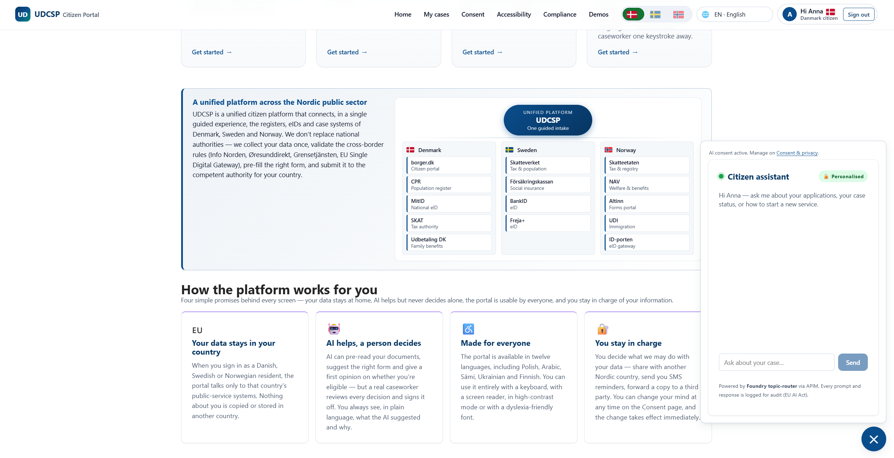

---

# How the front door routes.

<!-- ⏱ 0:45 — That single door raises a question: how does it know which country and which authority a request belongs to?
It uses the citizen's national electronic identity, their eID — MitID in Denmark, BankID in Sweden, ID-porten in Norway.
From that identity plus the published cross-border rules, it works out who owns the request and routes it there over a private connection, never the open internet.
Those rules come from official sources like Info Norden and the European Single Digital Gateway, so routing follows public policy, not logic we made up.
Now let's see what the door actually became. -->

<div class="split right-wide">
<div>

One guided intake. The portal finds **which authority owns the request** and sends it there — using each citizen's national eID and the public cross-border rules.

- 🇩🇰 **Denmark** — borger.dk · MitID
- 🇸🇪 **Sweden** — Skatteverket · BankID / Freja+
- 🇳🇴 **Norway** — UDI · Altinn · ID-porten

The rules come from Info Norden, Øresunddirekt and the EU Single Digital Gateway — public policy, not logic we invented.

</div>
<div>

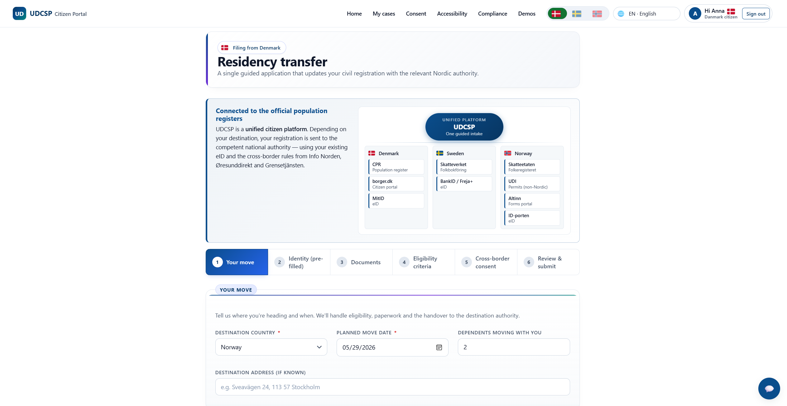

</div>
</div>

---

# What we ship.

<!-- ⏱ 0:40 — It became three things.
First, one app reachable three ways — web, phone, and a free phone number — in twelve languages.
Second, behind it, what we call the brain: one coordinator and six specialist agents — seven in all — on Azure AI Foundry.
That is Microsoft's platform for building and governing AI.
Third, a real change in outcome — a cross-border residency case now takes about four days instead of twenty-eight, with each country's AI and data staying inside its borders.
Now let's touch the part the citizen actually uses. -->

<div class="cards four">
<div class="card">
<div class="card-num">CHANNEL</div>
<h3>🌐 Web · Mobile · Voice</h3>
<p>One web app · 12 languages · accessibility-tested · one free phone number per country</p>
</div>
<div class="card teal">
<div class="card-num">AI BRAIN</div>
<h3>🧠 One brain · 7 agents</h3>
<p>One orchestrator sends work to six specialists on Azure AI Foundry</p>
</div>
<div class="card green">
<div class="card-num">OUTCOME</div>
<h3>📉 28 days → 4</h3>
<p>Cross-border residency in four days · 47 portals become one · 12 languages</p>
</div>
<div class="card orange">
<div class="card-num">SOVEREIGN</div>
<h3>🛡️ 3 zones</h3>
<p>One AI hub and one data zone per country · no data crosses a border uninvited</p>
</div>
</div>

> UDCSP is a **unified citizen platform**, not a replacement. The national authorities still make the decision.

---

<!-- _class: tight -->
<!-- _header: '' -->
<!-- _footer: '' -->

# Sign in once — the rest is pre-filled.

<!-- ⏱ 0:28 — So let's actually touch it.
This is the guided application.
Look at the steps along the top — your move, identity already pre-filled, documents, eligibility, cross-border consent, and submit.
Because the citizen signed in with their eID, the identity step is already done; they never retype what the country already knows.
They just add what's new, here an employment contract, and the platform reads it for them.
Let me step back and show you that whole surface, and the one detail on it that matters most. -->

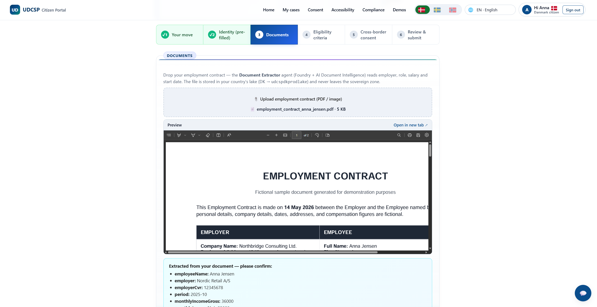

---

# The platform you actually see.

<!-- ⏱ 0:40 — What the citizen sees is one web app — the same code on a laptop and a phone — with a help assistant in the corner and accessibility built in for screen-reader users.
But one detail matters more than the rest.
On every application page, the citizen sees the AI's assessment before they consent: its confidence, the evidence for each rule, and anything that's still missing.
Nothing is hidden.
That's the surface; now let me take you behind it. -->

<div class="split right-wide">
<div>

One web app · 12 languages · 3 channels · always accessible.

The same React and TypeScript code runs on phone, tablet and laptop, and adapts to each screen.

The chat assistant stays in the corner. The accessibility menu offers slow speech, high contrast and reduced motion.

On every *Apply* page, the citizen sees the AI result — confidence, evidence, missing documents — **before** they consent.

</div>
<div>

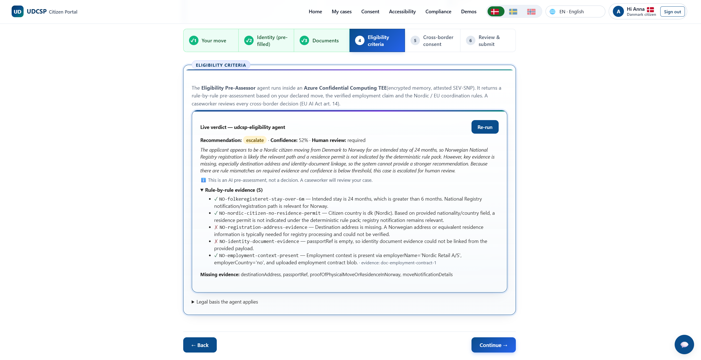


</div>
</div>

---

<!-- _class: chapter -->
<div class="num">01</div>

# Architecture.

## How we built it — three sovereign zones, one private path from the portal to the case

<!-- ⏱ 0:12 — Behind that simple door is where most of the engineering sits.
Two ideas hold the architecture together: keep every country sovereign, and keep the whole path private, from the first click to the caseworker. -->

---

# High-level architecture.

<!-- ⏱ 0:50 — At the highest level, the shape is this: one experience on top for the citizen, and underneath three separate back-offices, one per country, that never mix.
The brain is copied into all three, so an AI call in Denmark stays in Denmark.
The only bridge to the national authorities runs through a single guarded gateway, and we'll come back to exactly how that bridge works.
So it looks like one website from outside, but inside each country is a sealed world.
Let me zoom into one of those countries. -->

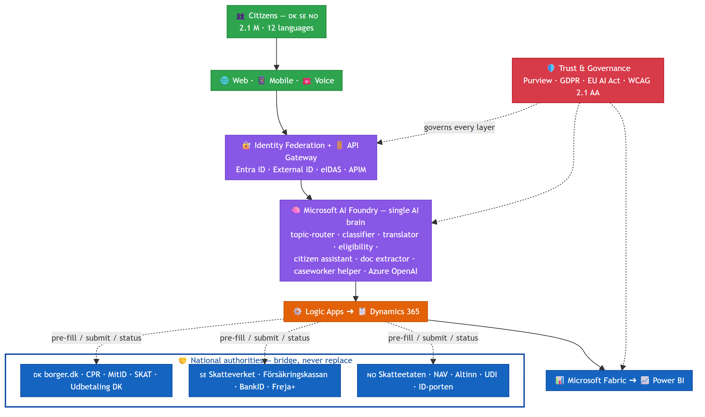

> One citizen experience on top, three sovereign back-offices below, one AI brain copied per country. **Logic Apps bridges to Dynamics 365 and onward to each national authority** — pre-fill, submit, status — never replacing them. Trust and governance wrap every layer.

---

# One country, one hub — three times.

<!-- ⏱ 0:55 — Each country gets its own Azure region, its own private network, its own identity system, and its own AI hub.
Denmark runs in North Europe, Sweden in Sweden Central, Norway in Norway East, and no AI call crosses a border.
Inside each hub we don't use one model for everything; we match the model to the job — a fast one sorts, a stronger one decides, and a real-time one handles live speech on the phone.
The model names sit in one settings file, so changing region is a one-line edit.
One honest exception: real-time speech isn't in Norway yet, so Norwegian calls use the Swedish hub for now, still inside Europe, and one setting will bring it home. -->

<div class="split">
<div>

### A hub per country

Each country has its own Azure region, private network, identity system, and **AI hub** on Azure AI Foundry.

- 🇩🇰 **Denmark** — North Europe region
- 🇸🇪 **Sweden** — Sweden Central region
- 🇳🇴 **Norway** — Norway East region

No AI call ever crosses a border.

</div>
<div>

### The right model for each job

- **Real-time speech** model — the voice channel
- **Strong reasoning** model — the hard decisions
- **Fast** model — simple routing and sorting

The model name comes from one parameter file, so a region change is a one-line edit.

</div>
</div>

> **One honest exception.** Real-time speech is not available yet in Norway, so Norwegian calls use the Sweden hub, inside the EU Data Boundary. The audio still stays in Norway. When the model arrives, one parameter brings it home.

---

<!-- _class: tight -->

# Privatising every zone — from the portal to the case.

<!-- ⏱ 0:55 — Now to that promise that the whole path is private, because it works as a chain.
The only public entry is Azure Front Door, with a web firewall in front; nothing else has a public address.
Behind it a private gateway checks the token, and everything further in — the workflows, the agents, the storage, the database, the secret vault — sits off the internet on private connections.
For analytics we never copy the real records out; we send only numbers, so the raw data stays home.
So from the first click to the caseworker's queue, nothing travels in the open, and it's encrypted the whole way.
And the one piece that actually reaches the outside world deserves its own slide. -->

**One public door per country.** Everything behind it is private — from the citizen's first click to the caseworker's queue.

<div class="split">
<div>

<div class="steps">
<div class="step"><div class="step-content"><strong>One public front door</strong><span>Azure Front Door and a web firewall. Nothing else is public.</span></div></div>
<div class="step"><div class="step-content"><strong>A private API gateway</strong><span>Azure API Management checks the token — the only way in.</span></div></div>
<div class="step"><div class="step-content"><strong>Backends on private endpoints</strong><span>Workflows, agents, storage, database, vault: off the internet. Private DNS per country.</span></div></div>
<div class="step"><div class="step-content"><strong>The case lands in Dynamics 365</strong><span>One environment per country, in-region. Writes go through workflows, reads through the gateway.</span></div></div>
<div class="step"><div class="step-content"><strong>Analytics copies only numbers</strong><span>Dynamics sends metrics to Microsoft Fabric. The raw rows stay in the country.</span></div></div>
</div>

</div>
<div>

### The only other public address

Azure Bastion — the single admin door per country. All outbound traffic goes through Azure Firewall, with allow-lists and TLS inspection.

### Encrypted everywhere

- Customer-managed keys, one set per country
- Two-way TLS to the national authorities
- Field-level encryption for national ID numbers

</div>
</div>

---

<!-- _class: tight -->

# The integration bridge.

<!-- ⏱ 0:50 — That piece is the integration plane, and it runs on Azure Logic Apps.
A Logic App is simply a workflow — a sequence of steps the platform runs for the citizen — and here each one pre-fills the right national form, submits it to the competent authority, and reads the decision back.
The portal never calls a ministry directly; the Logic App does, and it writes every case into Dynamics 365, our case system of record.
It's private by design: in production the workflows are VNet-integrated, so they live on the country's own private network, and they reach each authority over mutual TLS, where both sides show a certificate before any data moves.
And it's event-driven: a message on Service Bus or Event Grid triggers the right workflow, while the private API gateway stays the only token-checked way in.
There is one plane like this per country — and that whole private network looks like this. -->

**One private integration plane per country.** The portal never calls a ministry directly — Logic Apps do, on its behalf.

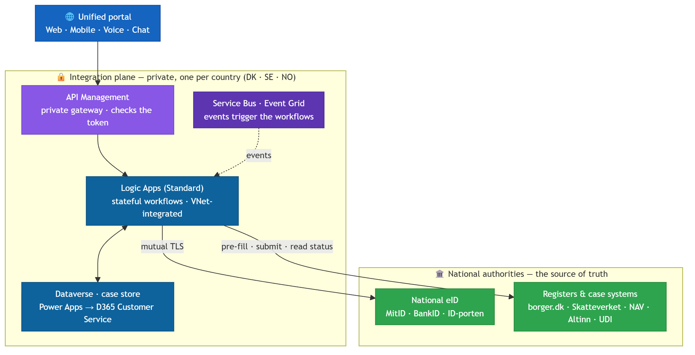

> Logic Apps are the **bridge** — stateful workflows that pre-fill the national form, submit it, and read the status back, writing each case into **Dynamics 365** and reaching authorities over **mutual TLS**. In production they're **VNet-integrated**.

---

<!-- _class: tight -->

# How the network fits together — simply.

<!-- ⏱ 0:45 — Before the detailed map, here is the simple idea.
There is one shared front door and one user interface, so the citizen always sees the same portal.
But for sovereignty, each country has its own private front-end origin: a Static Web App whose public access is off, reached only through a private endpoint that lives in the country's web subnet.
So the web subnet you'll see in each spoke is just that private door to the front-end, not a second copy of the whole application.
Everything else — app, data, AI and the Logic Apps — is private and in-country too.
A shared hub handles the firewall, the private DNS, cross-border routing and monitoring.
To get this right, we leaned on patterns the industry already trusts — the full network map is in the annex. -->

<div class="split" style="grid-template-columns:1.25fr 0.85fr;align-items:center">
<div>

**One entry, one experience — private and sovereign underneath.**

- **One public entry**: a single **Azure Front Door** (web firewall) and one UI codebase — the citizen always sees the same portal.
- **Sovereign by design**: each country has its *own* private front-end origin — a **Static Web App reached through a private endpoint** in that country's `web` subnet, with no public origin.
- That `web` subnet in each spoke is the **private door** to the front-end, not a separate copy of the app.
- App, data, AI, Logic Apps are private and in-country too; a **shared hub** handles firewall, DNS, cross-border and monitoring.

</div>
<div>

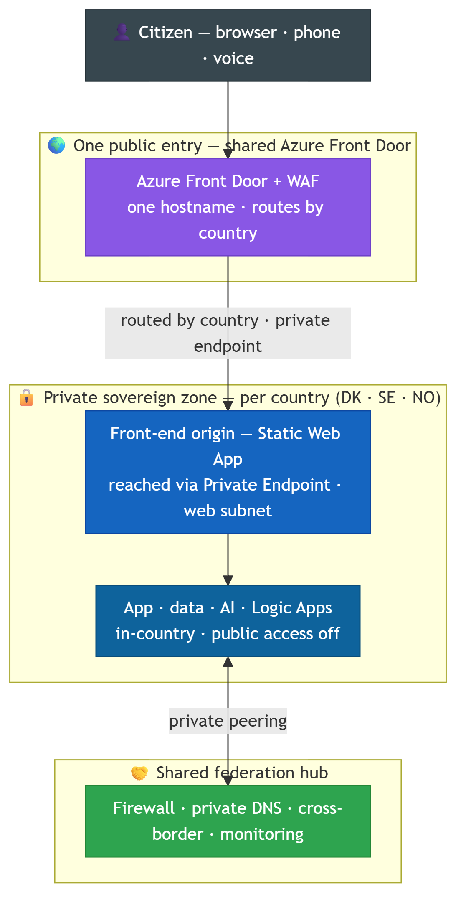

</div>
</div>

---

# Design patterns we use.

<!-- ⏱ 1:00 — Six patterns shaped the platform.
On the phone, the AI decides for itself when to look something up or hand the call to a human.
A cross-border case runs as a series of steps that can undo themselves if one fails, so a request never gets stuck half-done.
Dynamics 365 stays the single source of truth for every case, and we can swap pieces of it later without breaking anything.
And if a national service goes down, a safety switch sends the citizen to a human queue instead of an error.
None of this is exotic; it's proven patterns, applied with care.
With the body of the platform covered, let's look at its mind. -->

<div class="cards">
<div class="card">
<h3>Agents-as-Tools</h3>
<p>On a phone call, the speech model decides by itself when to call a function or pass to a human.</p>
</div>
<div class="card teal">
<h3>Gateway + Saga</h3>
<p>One API gateway per country. The cross-border case is a 6-step workflow that rolls back if a step fails.</p>
</div>
<div class="card green">
<h3>System of record — Dynamics 365</h3>
<p>Dynamics 365 holds each case. The app writes through workflows and reads through the gateway with a cache.</p>
</div>
<div class="card orange">
<h3>Strangler fig</h3>
<p>The caseworker app writes to a simple Dynamics 365 table today, the final case entity tomorrow — one switch.</p>
</div>
<div class="card purple">
<h3>Sidecar</h3>
<p>The voice service pairs a call handler with a real-time audio bridge.</p>
</div>
<div class="card red">
<h3>Circuit breaker</h3>
<p>A failing national endpoint switches to a human queue — citizens never see a timeout.</p>
</div>
</div>

---

<!-- _class: chapter -->
<div class="num">02</div>

# The AI Brain.

## One brain on Azure AI Foundry · one orchestrator · six specialists · safe by design

<!-- ⏱ 0:12 — At the centre of everything is the part we call the brain.
This is where the AI lives, and it's built as one governed system, not a pile of separate chatbots. -->

---

<!-- _class: tight -->

# The AI Brain.

<!-- ⏱ 0:50 — At the centre of everything is one governed brain.
Every AI request passes through a single place: Azure AI Foundry, Microsoft's platform for building and running AI agents.
So the safety checks, the quality checks, the tracing and the AI Act records all happen in one spot, instead of being scattered around.
Inside, a coordinator we call the Topic Router reads each request and hands the work to the right specialist.
And because the whole brain is copied into each country, the conversation stays home, just like the data.
Let me show you how the pieces actually fit together. -->

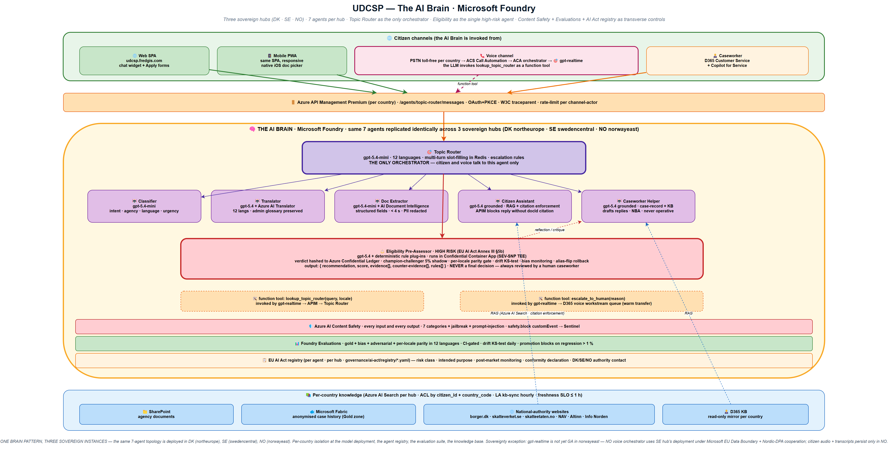

> **One brain, not seven chatbots.** Every model call goes through Azure AI Foundry — so orchestration, safety, evaluation, tracing and the EU AI Act register live in one place. The **Topic Router** gives each task to the right specialist, and the whole brain is copied per country.

---

<!-- _class: tight -->

# The AI Brain — every channel, one gateway.

<!-- ⏱ 1:00 — Here is the same brain, end to end.
Every channel comes in on the left — the website, the phone, the mobile app, the chat, even the caseworker's own screen.
They all enter through one door: the API Management gateway.
It handles sign-in, rate limits and the audit log, so no channel ever calls a model on its own.
From there, every message is scanned by Content Safety, on the way in and on the way out.
Then the Topic Router picks the right specialist for the job.
One of them, the eligibility agent, is the only high-risk part under the EU AI Act, so it runs in a sealed enclave with a tamper-proof record — I'll come back to exactly why.
The agents that answer questions only quote official sources, and the whole conversation is traced for later.
Now let me trace one real request through it. -->

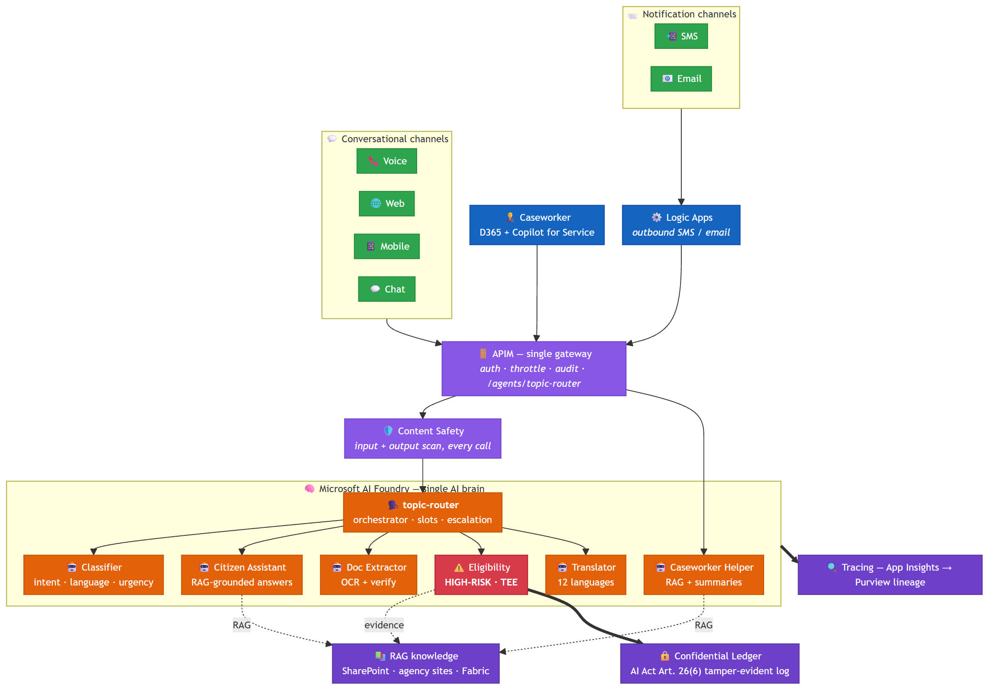

---

# How a citizen's question flows through the brain.

<!-- ⏱ 0:55 — Now that one request, step by step.
The router has already read the intent and the language, so here it just chooses who does the work.
A payslip goes to the document reader, which pulls out the numbers.
A general question goes to the assistant, which answers only from official, cited sources, never from imagination.
A residency case goes to the eligibility agent, which proposes an answer with the reason for every rule it applied.
Whatever comes back carries a trace number and its sources, so it can always be explained later.
That trace number will come up again in the compliance section.
First, let me show you the agents themselves. -->

<div class="steps">
<div class="step"><div class="step-content"><strong>The channel asks the brain</strong><span>Web, mobile and phone reach the Topic Router through the one private gateway — never a model directly.</span></div></div>
<div class="step"><div class="step-content"><strong>The router understands and remembers</strong><span>It finds the intent and the language across 12 languages, and keeps the short conversation for 24 hours.</span></div></div>
<div class="step"><div class="step-content"><strong>It passes the task to a specialist</strong><span>Classifier, Translator, Document Reader, Citizen Assistant, Caseworker Helper — or the high-risk Eligibility agent.</span></div></div>
<div class="step"><div class="step-content"><strong>The specialist does one job well</strong><span>The Assistant answers only from cited sources; the Reader extracts a payslip; Eligibility proposes a result with evidence.</span></div></div>
<div class="step"><div class="step-content"><strong>The answer returns — traced and sourced</strong><span>Every reply carries a trace number and its sources. On voice, the model decides when to call a tool or a human.</span></div></div>
</div>

> Six specialist agents, two function tools, one orchestrator — seven agents in all, always under one human caseworker.

---

# Agent catalogue.

<!-- ⏱ 0:55 — There are seven agents in all, and the law treats them differently.
Most only sort, translate, or answer from public information, so under the European AI Act they count as limited risk.
One does not: the agent that pre-assesses eligibility.
Because it affects access to an essential public service, the AI Act classes it as high risk.
So we handle it differently from the rest, because it runs in a sealed, protected enclave, and every answer it gives is written to a record that can't be altered.
And it never has the final word.
Whatever it proposes is only a suggestion to the caseworker, who confirms it, changes it, or rejects it.
One agent deserves a closer look, because it shows the AI acting on its own. -->

| Agent | Purpose | Model | EU AI Act class |
|---|---|---|:-:|
| **Topic Router** | Orchestration · 12 languages · slot-filling | Fast | Limited |
| **Request Classifier** | Intent · agency · language · urgency | Fast | Limited |
| **Translator** | 12 languages · keeps admin terms exact | Strong + Translator | Limited |
| **Eligibility Pre-Assessor** ⚖️ | Result + evidence · runs in a protected enclave · ledger-logged | Strong + rules | **High (public service)** |
| **Citizen Assistant** | Answers only from the cited public knowledge base | Strong, grounded | Limited |
| **Document Reader** | Passport / payslip / lease extraction | Fast + Doc Intelligence | Limited |
| **Caseworker Helper** | Summarise · draft replies · suggest next action | Strong, grounded | Limited |

> **No agent makes a final decision.** Every result is a *proposal* to a human caseworker, who confirms, changes or rejects it.

---

# Voice channel — the model uses tools on its own.

<!-- ⏱ 0:55 — That's the voice channel, the one a blind citizen uses by phone.
The call lands on Azure Communication Services, and we open a live, two-way audio link to a speech model.
From there, the model runs the conversation itself.
When it needs information, it decides, on its own, to call into the brain.
And when the caller needs a person, it decides, on its own, to transfer them, warmly, to a human.
We didn't script that with rigid rules; the model chooses turn by turn.
It's the direction the whole industry is moving, and here it already works on a real phone line you could call today.
Because that eligibility agent carries real weight, its model needs special care. -->


> Citizen dials → the call lands on Azure Communication Services → a small service opens a two-way audio stream to the speech model. **The model decides on its own** to call `lookup_topic_router` or `escalate_to_human` (a warm transfer). This is the Microsoft Agent Framework *Agents-as-Tools* pattern, on a real phone call.

---

# Eligibility model lifecycle.

<!-- ⏱ 0:55 — We don't just deploy a new version of it and hope.
A new version first runs silently beside the old one, on a small slice of traffic, with no effect on real citizens, until we're sure it's better.
We test it in all twelve languages, and if even one is weaker, it doesn't ship.
Every day we check whether the data has shifted under it, and any shift raises an alarm.
Over a month, we check it treats people fairly across age, place, and channel.
And if anything ever goes wrong, we roll back to the previous version in seconds, with a full record.
Beyond any single agent, these agents also work together as a team. -->

<div class="steps">
<div class="step"><div class="step-content"><strong>Champion-challenger</strong><span>A new version runs in shadow on 5% of traffic for one week, then we evaluate it.</span></div></div>
<div class="step"><div class="step-content"><strong>Parity gate per language</strong><span>A gold test runs in all 12 languages. If one language is too weak, the release is blocked.</span></div></div>
<div class="step"><div class="step-content"><strong>Drift detection</strong><span>A daily test on inputs and outputs. Drift opens a security incident and forces a new evaluation.</span></div></div>
<div class="step"><div class="step-content"><strong>Bias monitoring</strong><span>Fairness tests across age, location and channel for 30 days. A problem routes cases to a senior reviewer.</span></div></div>
<div class="step"><div class="step-content"><strong>Rollback in seconds</strong><span>Versions never change. Switching the alias restores the previous one at once, with an audit record.</span></div></div>
</div>

---

# Multi-agent coordination — more than a chatbot.

<!-- ⏱ 0:50 — This is what makes it more than one chatbot.
The router hands work off to the specialists.
A helper reviews the eligibility answer, like a second pair of eyes on the first.
A cross-border case moves through clear stages and can step backwards when needed.
On the phone, the model reaches for tools and for humans.
And every model change is tested in the shadows before it goes live.
Hand-off, review, stages, tools, those are the building blocks of real agent teamwork, and they're all here.
With the AI explained, the next question is whether you can trust it. -->


> **Handoff** (router → six experts) · **Reflection** (the helper reviews the eligibility result) · **State graph** (the case is a 6-state workflow that can undo a step) · **Function tool** and **warm transfer** on voice · **Shadow / canary** for every model change.

---

# Trust built into the brain.

<!-- ⏱ 1:00 — Because this is AI making suggestions about people's lives, trust is built into the brain, with six guardrails.
Every message is screened for attempts to trick or jailbreak the model.
Quality is tested on every change, in every language.
Each agent is officially declared, its purpose, its risk, and its limits, in a register, exactly as the AI Act requires.
Every high-risk answer is sealed in a record that can't be altered.
No agent decides alone, because a human caseworker always has the final say.
And we never hide the AI, so people are told, on screen and on the phone, in their language, that they're dealing with a machine.
The high-risk agent even runs in a sealed enclave, where the data is protected from us, the operators, as well.
That leads straight into security and compliance. -->

<div class="cards">
<div class="card"><h3>Content Safety</h3><p>A jailbreak and prompt-injection detector runs on every turn; a block raises a security event.</p></div>
<div class="card teal"><h3>Evaluations</h3><p>Quality is tested on every change — language parity, grounding and safety.</p></div>
<div class="card purple"><h3>AI Act register</h3><p>Each agent is declared with its purpose, risk level and limits, in a versioned file.</p></div>
<div class="card red"><h3>Confidential Ledger</h3><p>Each high-risk result is hashed into a log that cannot be changed.</p></div>
<div class="card green"><h3>Human-in-the-loop</h3><p>No agent decides. A caseworker confirms, changes or rejects every result.</p></div>
<div class="card orange"><h3>Transparency</h3><p>The citizen is always told AI is used — a chat badge and a spoken message in 12 languages.</p></div>
</div>

> The Eligibility agent is the only high-risk part. It runs inside a **protected enclave** — its data is encrypted in memory, even from an administrator — and it never decides alone.

---

<!-- _class: chapter -->
<div class="num">03</div>

# Security &<br>compliance.

## How we made it provable — eight EU laws mapped to controls in code

<!-- ⏱ 0:12 — For a government system, this is the part I care about most.
The goal was simple to say and hard to do: make every promise provable. -->

---

# Defence in depth — many layers.

<!-- ⏱ 0:50 — On security, the rule was that no single wall should carry all the weight, so we built layers.
At the edge, a web firewall blocks the common attacks and the bots.
Underneath it, there's protection against attacks that try to flood the network.
Anything leaving the platform is checked against a list of allowed destinations, so it can't quietly phone home to a stranger.
And deep inside are the private connections, the identity checks, and the encryption already described.
If one layer ever fails, the next one still stands.
Two of these layers deserve a closer look: identity, and where the data lives. -->


<div class="cards">
<div class="card"><h3>Edge — application</h3><p>Azure Front Door and web firewall — common-attack rules, bot protection, rate limits</p></div>
<div class="card teal"><h3>Edge — network</h3><p>Standard DDoS protection on every network</p></div>
<div class="card orange"><h3>Traffic out</h3><p>Azure Firewall · destination allow-lists · TLS inspection</p></div>
</div>

---

# Identity & data sovereignty.

<!-- ⏱ 1:00 — Two things decide whether a system like this is trustworthy: who gets in, and where the data sits.
For who gets in, each country has its own identity system, and people sign in with their national eID through a certified broker, so we never see a password.
We also support the new European Digital Identity Wallet, for carrying identity across borders.
For where the data sits, everything stays in-country.
The live record, the write-once documents, the conversations, the knowledge base and the analytics never leave.
Each country holds its own encryption keys, everything is encrypted in transit, and there's no public way into the data at all.
That's deliberate, not lucky.
And it's only half the story; the other half is the law. -->

<div class="split">
<div>

### Identity

- One citizen-identity system per country (Microsoft Entra External ID)
- National eID via a certified broker — MitID · BankID + Freja+ · ID-porten
- Support for the EU Digital Identity Wallet
- Admins get time-limited access only, through one jump-host

</div>
<div>

### Data — five zones, all in-country

- **Live** — managed database and cache
- **Documents** — write-once, cannot be changed
- **Conversations** — kept for AI Act records
- **Knowledge** — search, locked per citizen and country
- **Analytics** — sovereign EU Fabric capacity

</div>
</div>

> One encryption key set per country · modern TLS in transit · two-way TLS to partners · field-level encryption for national IDs · public network access **turned off** everywhere.

---

# How we made it compliant — the story.

<!-- ⏱ 1:05 — People ask how we made this compliant, and the honest answer is that we worked backwards, because we started from the law, not from the features.
When you look closely, eight European laws touch a single voice call at the same time.
There's data protection, under GDPR, the General Data Protection Regulation.
There's electronic identity, under a rule called eIDAS.
There's cybersecurity, under a directive called NIS2.
There's accessibility law.
And there's the AI Act.
So we took each obligation, from each of those laws, and turned it into a concrete control in the code, with evidence behind it.
And one trace number ties it all together, following an interaction from the browser to the model and back, kept for two years.
So compliance here isn't a binder on a shelf; it's wired into the system.
Let me make the AI Act part concrete. -->

<div class="split right-wide">
<div>

<div class="steps">
<div class="step"><div class="step-content"><strong>We started from the law, not the features</strong><span>Eight bodies of EU law touch one interaction — a single voice call is data protection, accessibility, e-identity, cybersecurity and AI law, all at once.</span></div></div>
<div class="step"><div class="step-content"><strong>Each obligation became a control in code</strong><span>Every rule maps to a real platform mechanism, with an evidence file behind it.</span></div></div>
<div class="step"><div class="step-content"><strong>We made the evidence provable</strong><span>One trace number follows every interaction, from the browser to the model and back, kept for two years.</span></div></div>
</div>

<span class="pill">GDPR — data protection</span> <span class="pill purple">EU AI Act — high-risk AI</span> <span class="pill green">eIDAS — e-identity</span> <span class="pill orange">NIS2 — cybersecurity</span> <span class="pill">ePrivacy — cookies</span> <span class="pill gray">WCAG — accessibility</span>

</div>
<div>


</div>
</div>

---

# EU AI Act — article by article.

<!-- ⏱ 0:55 — The AI Act is easy to mention and hard to show, so here is exactly how we meet it.
It requires automatic records for at least six months for a high-risk system, and we keep two full years, more than double.
It requires transparency about each AI part, so every agent has a written entry.
It requires a human in control, so the caseworker confirms every decision.
It names access to essential public services as high risk, which is why we flagged the eligibility agent.
And it requires telling people when AI is used, so we do, in writing and out loud, in their language.
Every line of the law has a matching line in the system.
Theory is one thing, so let me show you two real moments. -->

| Article | Requirement | UDCSP delivery |
|---|---|---|
| **Art. 12** | Automatic records ≥ 6 months for high-risk | Model logs kept **730 days** = 2× the minimum |
| **Art. 13** | Transparency for deployers | A register entry per agent · tests per language |
| **Art. 14** | Human oversight | A caseworker confirms every result · ledger-logged |
| **Annex III §5(b)** | High-risk = access to essential public services | The Eligibility agent is declared high-risk |
| **Art. 50** | The citizen must know AI is used | AI badge on chat · spoken message in 12 languages |

> The AI Act, GDPR, ePrivacy, eIDAS, NIS2 and accessibility law are each mapped to platform controls. The full mapping is in `docs/biz/datacompliance.md`.

---

# Security in action — a prompt injection, stopped.

<!-- ⏱ 0:45 — The first is an attack.
Imagine a message crafted to trick the AI into revealing its hidden instructions, or quietly changing an eligibility result — that is called a prompt injection.
Three independent tools stop it.
Azure API Management, the gateway, spots the strange token rate and blocks the data leak.
Azure AI Content Safety, with its jailbreak detector, recognises the trick and opens a security incident.
And our own fixed eligibility rule simply refuses the request before any model runs.
Then the platform isolates the session, brings the real citizen back, and saves the evidence — and no citizen data is ever exposed.
The second moment is the opposite: not an attack, but an audit. -->

<div class="split">
<div>

A message that tries to leak the hidden instructions, or change a result, is caught at **three independent layers** — three different Azure tools:

<div class="steps">
<div class="step"><div class="step-content"><strong>Azure API Management</strong><span>The gateway sees the strange token rate and blocks the data leak.</span></div></div>
<div class="step"><div class="step-content"><strong>Azure AI Content Safety</strong><span>The jailbreak detector raises a security event and opens an incident.</span></div></div>
<div class="step"><div class="step-content"><strong>Fixed eligibility rule</strong><span>A deterministic plug-in rejects the request before any model runs.</span></div></div>
</div>

</div>
<div>

### The automatic response

- The session is isolated at once
- The citizen flow is brought back safely
- An audit pack is saved for review

<div class="stat" style="margin-top:24px"><div class="big">0</div><div class="label">citizen data exposed</div></div>

</div>
</div>

---

# Compliance in action — replay a decision, months later.

<!-- ⏱ 1:00 — Six months after a decision, a regulator asks the hardest question there is: why did the system propose this, back then?
In most places, that's a moment of panic.
Here, it's a lookup.
The privacy officer takes the single trace number for that case and rebuilds the whole decision.
That includes which model ran, what it answered, what the caseworker did with it, and a sealed proof that nothing has changed since.
And from the question to a complete, signed audit file takes under ten minutes.
That is what provable compliance actually means.
Once it's all running, of course, we still have to watch it and pay for it. -->


<div class="split">
<div>

Hans, a data-protection officer, takes the citizen's **trace number** and rebuilds the whole decision — the model, the tokens, the result, the human choice, and the cryptographic ledger proof.

</div>
<div>

The AI Act minimum is six months. We keep **two years**. From the request to a full audit pack: **under 10 minutes**.

</div>
</div>

---

<!-- _class: chapter -->
<div class="num">04</div>

# Monitoring &<br>FinOps.

## One anonymized central view · end-to-end tracing · cost per token

<!-- ⏱ 0:18 — A quick word on operations — how we watch the platform and its cost without breaking the walls between countries.
Monitoring rests on per-country pillars: separate logs that are never merged, one trace number that follows a request end-to-end, continuous AI-quality checks and sealed AI Act evidence — the full pillar map is in the annex.
The one view that needs real care is the cross-country picture, because it has to span all three countries at once. -->

---

# One central view — anonymized, in Fabric & Power BI.

<!-- ⏱ 1:00 — A leader has to answer for results across the whole programme, but can't be allowed to see individual citizens, because that would break everything we just built.
So the answer is a single shared view where the names and the case files have already been stripped away.
Only anonymous, combined numbers ever leave each country, gathered into Microsoft Fabric and shown in Power BI, refreshed every hour.
The view shows roughly twelve thousand cases this month, and the median time down to four days from twenty-eight.
Satisfaction sits at four and a half out of five, and the processing time keeps falling quarter after quarter.
So leadership gets the full picture, and privacy stays completely intact.
The other operational concern is cost. -->

Leadership needs the big picture. But raw citizen data never leaves its country. So only **anonymized, aggregated numbers** travel to a central view.

<div class="dash">
<div class="kpis">
<div class="kpi"><b>12,480</b><span>cases this month</span></div>
<div class="kpi"><b>4 days</b><span>median time (was 28)</span></div>
<div class="kpi"><b>71%</b><span>AI-assisted, human-approved</span></div>
<div class="kpi"><b>4.5 / 5</b><span>citizen satisfaction</span></div>
</div>
<div class="panels">
<div class="panel">
<h4>Cases by country (anonymized)</h4>
<div class="bars">
<div class="b"><i style="height:82%"></i><span>🇩🇰 DK</span></div>
<div class="b"><i style="height:68%"></i><span>🇸🇪 SE</span></div>
<div class="b"><i style="height:54%"></i><span>🇳🇴 NO</span></div>
</div>
</div>
<div class="panel">
<h4>By service</h4>
<div class="donut"></div>
<div class="legend"><i style="background:#0078d4"></i>Residency 46% &nbsp; <i style="background:#00b4a6"></i>Tax 28% &nbsp; <i style="background:#c7d2fe"></i>ID & docs 26%</div>
</div>
<div class="panel">
<h4>Median days to decision</h4>
<div class="bars">
<div class="b down"><i style="height:100%"></i><span>Q1 · 28</span></div>
<div class="b down"><i style="height:54%"></i><span>Q2 · 15</span></div>
<div class="b down"><i style="height:29%"></i><span>Q3 · 8</span></div>
<div class="b down"><i style="height:15%"></i><span>Now · 4</span></div>
</div>
</div>
</div>
</div>

> Only anonymized, aggregated numbers leave each country — never a name, never a case file. Built on Microsoft Fabric and Power BI · refreshed every hour.

---

# FinOps — cost under control.

<!-- ⏱ 0:50 — AI can get expensive fast, so we treat it like any other budget.
Every resource is labelled by country, by workload, and by cost centre, so each ministry sees exactly what it spends.
Every agent gets a monthly budget of tokens — the unit you pay for with AI — written into the code.
If a change would blow that budget, the build fails before it ships.
We reserve capacity for the steady work, pay only for the spikes, and get a warning the moment cost jumps.
So there's no surprise invoice at the end of the month.
Cost is one promise; speed and uptime are the other. -->

<div class="split">
<div>

### Allocation & showback

- Every resource tagged `country`, `workload`, `cost-center`
- Cost views per country and per workload
- Each ministry sees its own country's cost

</div>
<div>

### Token budget & capacity

- A monthly token budget per agent, written in code
- The build **fails** if the total is over the pool
- Reserved capacity for steady models · pay-as-you-go for peaks
- Alert on a +30% jump in one day

</div>
</div>

> We treat AI tokens like any other budget line: planned, tagged, and checked at build time.

---

<!-- _class: chapter -->
<div class="num">05</div>

# Performance &<br>reliability.

## Fast for the citizen, always available — measured targets, automatic failover, chaos drills

<!-- ⏱ 0:12 — Underneath everything is a quieter promise, that the platform stays fast, and stays up, even when something breaks.
Here is how we keep it. -->

---

# Performance & reliability.

<!-- ⏱ 1:00 — We set the targets out loud, and then we test them.
The website should be available almost all the time, and we aim for ninety-nine point nine percent in every country.
A phone call should be answered within two seconds, and it is, for almost every call.
If something serious ever fails, we should lose at most fifteen minutes of data, and be back within four hours, in a backup European region.
And we don't just hope those numbers hold.
Each country runs a hot standby that takes over in minutes.
We back everything up, in every country.
And we break things on purpose — knocking out a region, cutting a network, failing a database.
We do it every month in test and every quarter in production, so the real failure, when it comes, is one we've already rehearsed.
There's one more thing worth showing, about how the platform was built. -->

<div class="stats-row">
<div class="stat"><div class="big">99.9%</div><div class="label">citizen web target, per country</div></div>
<div class="stat"><div class="big">≤ 2 s</div><div class="label">voice answer, 95% of calls</div></div>
<div class="stat"><div class="big">15 min</div><div class="label">recovery point — max data loss</div></div>
<div class="stat"><div class="big">4 h</div><div class="label">recovery time to the backup EU region</div></div>
</div>

<div class="cards four">
<div class="card"><h3>Active-passive per country</h3><p>Azure Front Door sends traffic to the healthy region. Failover in under 5 minutes.</p></div>
<div class="card teal"><h3>Backup & disaster recovery</h3><p>Database, cache, storage and agent hosts. One recovery vault per country.</p></div>
<div class="card orange"><h3>Chaos drills</h3><p>We break things on purpose — region failover, network cut, database failover. Monthly in test, quarterly in production.</p></div>
<div class="card green"><h3>Autoscale & caching</h3><p>Services scale out under load. Reads are cached at the gateway, so peaks stay fast.</p></div>
</div>

---

<!-- _class: chapter -->
<div class="num">06</div>

# How we built it.

## The platform itself was built by an agent swarm — in under 45 minutes of wall-clock time

<!-- ⏱ 0:12 — This part surprised even us.
We didn't build the platform the way you might expect. -->

---

# UDCSP was built by an agent swarm.

<!-- ⏱ 0:45 — We didn't write this by hand, file by file, over months — we built it with a swarm of AI agents working together.
There were three campaigns: a build, a clean-up after review, then round after round of audits.
Six specialist agents each took a separate part of the code, with no overlap, and worked at the same time — about five times faster than one could alone.
After each audit they fixed what they found, and it took twenty-four rounds before one came back completely clean.
In the end they produced eight hundred and sixty-eight files.
And the proof it holds together is simple: the whole platform installs with one command. -->

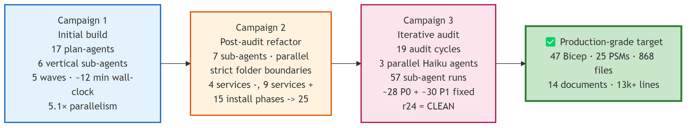

<div class="stats-row">
<div class="stat"><div class="big">3</div><div class="label">multi-agent campaigns</div></div>
<div class="stat"><div class="big">~5×</div><div class="label">faster than sequential</div></div>
<div class="stat"><div class="big">24</div><div class="label">audit rounds to first clean</div></div>
<div class="stat"><div class="big">868</div><div class="label">tracked files produced</div></div>
</div>

> Three campaigns — build, refactor, then repeated audits — produced the platform. Six sub-agents owned separate folders and ran in parallel. Each round produced fix commits until round 24 was the first fully **clean** one. The one-command installer is the executable summary of it all.

---

<!-- _class: tight -->

# Everything is in the open — one repository.

<!-- ⏱ 0:40 — And all of it lives in one place — a single public repository you can open right now.
The story starts in the documents, not the code.
Under docs-slash-biz is the business side: who we build for, every channel, the data and compliance rules, and an acceptance recipe for what "done" means.
Under docs-slash-tech is the engineering: the architecture, the data model, the network design, the install guide and a disaster-recovery runbook.
The infra folder holds the Bicep, and the scripts folder holds the installer.
It's at a short address, aka.ms-slash-UDCSP — everything I'm claiming today, you can check there. -->

<div class="split right-wide">
<div>

### The story starts in the docs
- **`/docs/biz`** — the business story: who we build for, every channel, data-and-compliance, demo scenarios, and an acceptance recipe for "done".
- **`/docs/tech`** — the engineering: architecture deep-dive, data model, network design, one-command install guide, disaster-recovery runbook.
- **`/infra`** — the Bicep that builds every zone · **`/scripts`** — the installer.

<div class="parallel">
<span class="lbl fr">short link</span>
<span class="lbl us">github</span>
<strong>aka.ms/UDCSP</strong>
<strong>github.com/fredgis/UDCSP</strong>
</div>

</div>
<div>

<div class="repo-shots">

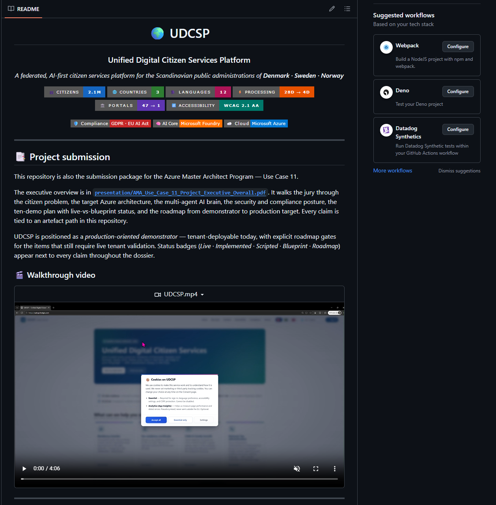

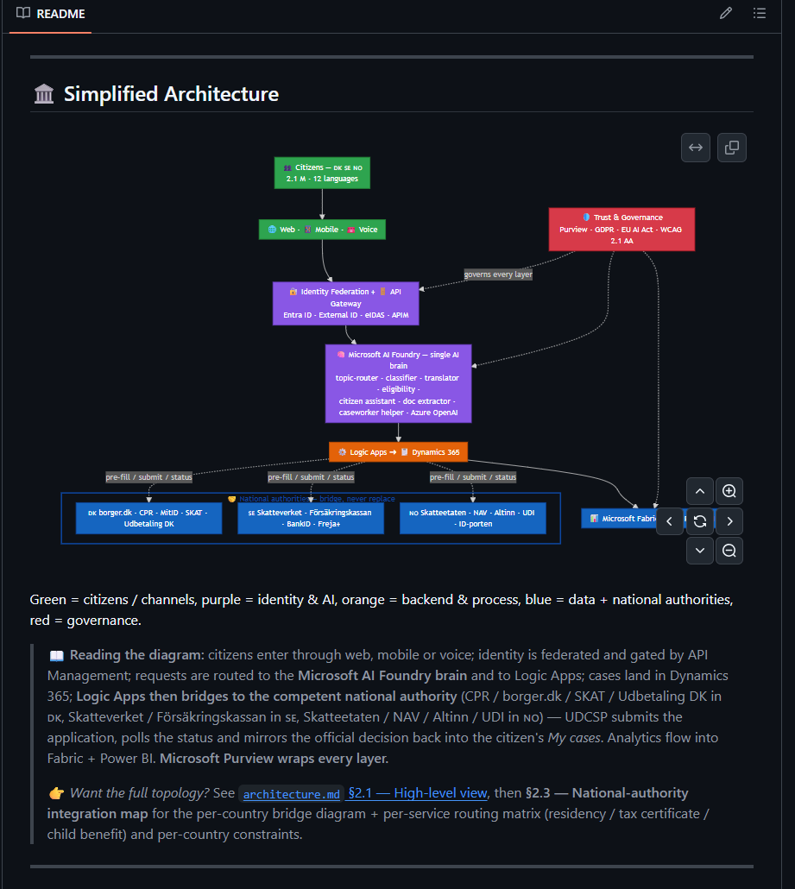

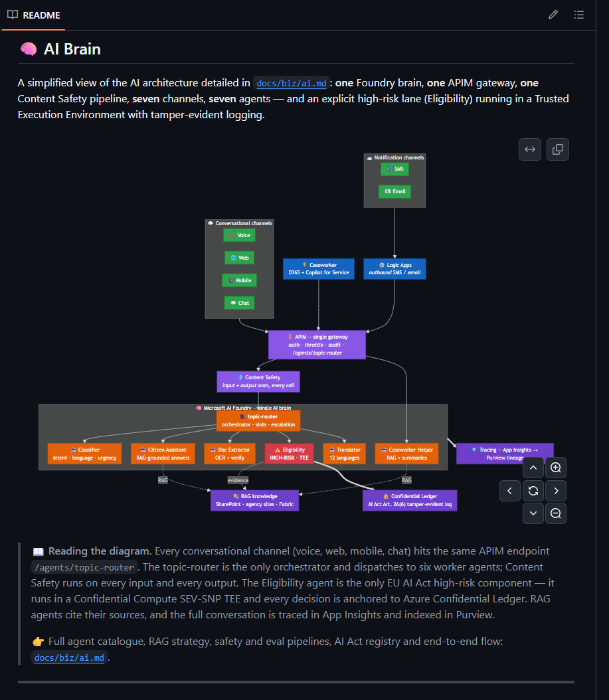

</div>

</div>
</div>

---

<!-- _class: tight -->

# One idempotent deploy — provision.

<!-- ⏱ 0:35 — So how do we actually ship all of this? With one idempotent command.
The same script checks the prerequisites, signs in to Azure, registers the identity app, builds the code and runs the tests.
Then it provisions every Azure resource as code, with Bicep.
Idempotent means you can run it again safely: it reuses what already exists, and never creates a duplicate. -->

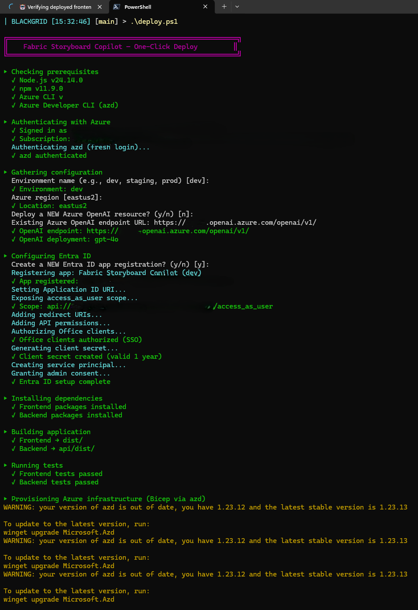

**One script, one click — and you can run it again safely.**

- Checks prerequisites, signs in to Azure, registers the **Entra ID** identity app.
- Installs, **builds**, and runs the **tests** before anything is deployed.
- Provisions all the infrastructure **as code** — Bicep, through `azd`.
- **Idempotent**: a second run reuses what exists — never a duplicate.

---

<!-- _class: tight -->

# One idempotent deploy — release and verify.

<!-- ⏱ 0:35 — The same run then deploys the application, generates the production manifest, and wires the redirect addresses and the access roles — RBAC, role-based access control.
It ends with a clear Deployment Complete and a full summary of every resource and URL.
And the very same script runs in our pipeline on every change, so a deploy is always repeatable, never done by hand. -->


**It deploys, verifies, and reports — every time the same way.**

- Provisioned in **~2 minutes**, then the app is deployed to Azure.
- Generates the **production manifest**, wires redirect URIs and **RBAC** (role-based access control).
- Ends with **Deployment Complete** and a summary of every resource and URL.
- The same script runs in the **pipeline on every change** — repeatable, not hand-made.

---

<!-- _class: chapter -->
<div class="num">07</div>

# Real scenario.

## Life imitates the demo — a story we did not plan

<!-- ⏱ 0:12 — This one we genuinely did not plan.
It happened a few weeks ago, and it turned into a useful reality check on the whole design. -->

---

# "I bought my car back." 🚗

<!-- ⏱ 0:30 — Quick fun story to finish.
A few weeks ago I re-registered a car, and had to log in to France Titres, the official French government portal.
I'd never opened it while we were building UDCSP.
And there it was: the same single front door, the same service cards, even the same little assistant in the corner. -->

<div class="split right-wide">
<div>

To change my licence plate, I signed in to the **official French government portal** — France Titres.

I had **never seen it** while building UDCSP.

And there it was — the same one-front-door layout, the same service cards (vehicle registration, driving licence, ID & passport), the same assistant in the corner. 😄

</div>
<div>

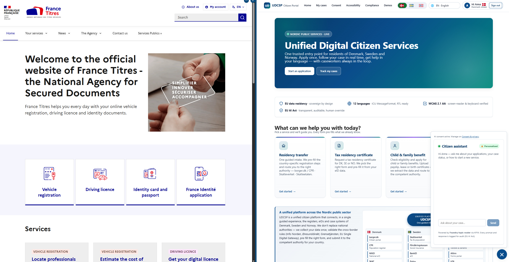

</div>
</div>

<div class="parallel"><div class="lbl fr">🇫🇷 France Titres — the real thing</div><div class="lbl us">🟦 UDCSP — our design</div></div>

---

# …and we'd built it first. 🙂

<!-- ⏱ 0:35 — The sign-in matched too.
France Titres uses FranceConnect and the France Identité app, with an EU cross-border identity marked "coming soon" — pick your country, then your national eID.
That is our exact model: a national eID, plus the EU wallet for crossing borders.
We designed it months before I ever saw the French version — and that is genuinely the fun part. -->

<div class="split">
<div>

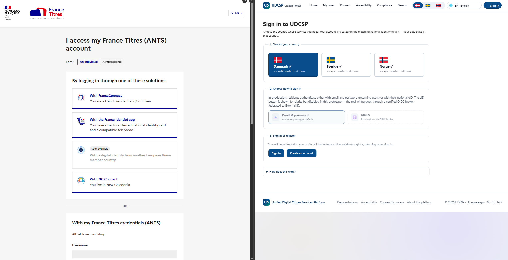

</div>
<div>

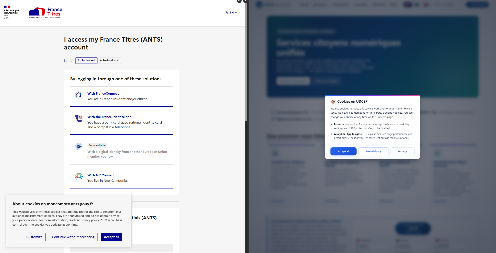

</div>
</div>

> Pick your country, sign in with a national eID, and — *"coming soon"* — an **EU cross-border identity**. That is our model, almost line for line. **We designed it before we ever saw it.** 🙂

---

<!-- _class: chapter -->
<div class="num">08</div>

# Status &<br>roadmap.

## What runs today · what's blueprint · how it reaches production

<!-- ⏱ 0:15 — Before the demo, the honest scorecard.
Here is every headline capability with its label, and then the four gates that take the blueprint bricks to production. -->

---

<!-- _class: tight -->

# Requirement coverage — the honest scorecard.

<!-- ⏱ 0:55 — This is the whole submission on one slide.
The green and blue rows run today or are merged and tested: unified identity, twelve-language accessibility, the assistant across web, mobile and voice, the cross-border pre-fill, the eligibility decision with a human in the loop, and the one-command deploy.
The orange parts are blueprint: the full cross-border saga, live confidential compute, the immutable ledger and the Fabric capacity — designed and registered, waiting on a tenant capacity or a licence.
Nothing here is hand-waved; every label is backed by code or a script in the repository. -->

<div class="cards">
<div class="card"><h3>Unified identity</h3><p>Entra External ID · eIDAS-ready</p><span class="pill green">🟢 Live</span> <span class="pill orange">🟠 Verified ID</span></div>
<div class="card"><h3>12-language portal</h3><p>WCAG 2.1 AA accessibility</p><span class="pill">🔵 Implemented</span></div>
<div class="card"><h3>AI assistant</h3><p>web · mobile · voice</p><span class="pill green">🟢 Live</span></div>
<div class="card"><h3>Cross-border case</h3><p>DK → SE pre-fill + saga</p><span class="pill green">🟢 Live</span> <span class="pill orange">🟠 saga</span></div>
<div class="card"><h3>Eligibility + human-in-loop</h3><p>verdict, then a person decides</p><span class="pill">🔵 Implemented</span> <span class="pill orange">🟠 live TEE</span></div>
<div class="card"><h3>EU AI Act evidence</h3><p>article-by-article trail</p><span class="pill">🔵 Implemented</span> <span class="pill orange">🟠 live ledger</span></div>
<div class="card"><h3>GDPR rights</h3><p>records · access · erasure</p><span class="pill purple">🟣 Scripted</span></div>
<div class="card"><h3>Sovereign monitoring</h3><p>9 workbooks, per country</p><span class="pill green">🟢 Live</span> <span class="pill orange">🟠 Fabric F64</span></div>
<div class="card"><h3>One-command deploy</h3><p>25 phases, idempotent</p><span class="pill green">🟢 Live</span></div>
</div>

> **Legend** — Live = runs today · Implemented = merged & smoke-tested · Scripted = idempotent installer · Blueprint = designed & gated. **The working core carries the demo; each blueprint brick has a named gate.**

---

<!-- _class: tight -->

# Four gates from accelerator to production.

<!-- ⏱ 0:50 — Here is how the blueprint becomes live, in four gates over about twenty weeks.
Gate one, weeks one to two: validate the tenant — the model deployments, the Fabric capacity and the DDoS plan.
Gate two, weeks three to six: switch eligibility onto live confidential compute, which flips demo six to live.
Gate three, weeks six to fourteen: sign the partner-agency agreements and stand up the production hub, so demo one talks to a real authority.
Gate four, weeks fourteen to twenty: bring in Dynamics 365 with Copilot for Service and repoint the writes, flipping demo five.
Each gate ships on its own — the platform is useful after every one. -->

<div class="cards four">
<div class="card"><div class="card-num">GATE 1 · WK 1–2</div><h3>Tenant validation</h3><p>Confirm model deployments, Fabric F64 capacity, DDoS plan & Foundry hub.</p></div>
<div class="card teal"><div class="card-num">GATE 2 · WK 3–6</div><h3>Live confidential compute</h3><p>Eligibility on a SEV-SNP enclave + Confidential Ledger. <strong>Demo 6 → Live.</strong></p></div>
<div class="card purple"><div class="card-num">GATE 3 · WK 6–14</div><h3>Partner-agency integration</h3><p>Mutual-TLS agreements + production federation hub. <strong>Demo 1 → real authority.</strong></p></div>
<div class="card orange"><div class="card-num">GATE 4 · WK 14–20</div><h3>D365 + Copilot for Service</h3><p>Strangler-fig repoint of case writes. <strong>Demo 5 → Live.</strong></p></div>
</div>

> Today → Gate 1 → Gate 2 → Gate 3 → Gate 4 → production. **Each gate is independently shippable** — every blueprint brick has an owner, a window, and a demo it flips to live.

---

<!-- _class: chapter -->
<div class="num">09</div>

# Demo.

## 10 minutes, live on a real tenant

<!-- ⏱ 0:12 — So let's move to the demo, about ten minutes, live, on a real Azure tenant.
First the plan, then the live system. -->

---

<!-- _class: tight -->

# The run of show.

<!-- ⏱ 0:50 — The demo runs five short scenes.
First, a cross-border move from Denmark to Sweden: sign in, upload a passport and a lease, watch the AI read and translate them and propose a result, consent, and the case crosses the border.
Then the one I most want you to see: a blind citizen calls a real phone number, and the AI answers in Norwegian and runs the call itself.
After that, the whole portal in Polish, with a screen reader.
Then a payslip photographed on an iPhone.
And finally, the entire platform stood up from nothing with a single command.
Let me switch to the live system. -->


<div class="steps">
<div class="step"><div class="step-content"><strong>Anna moves DK → SE <span class="pill green">🟢 Live</span></strong><span>Sign in with a Danish eID · upload a passport and lease · the AI reads, translates and proposes a result · consent · the case crosses the border.</span></div></div>
<div class="step"><div class="step-content"><strong>Lars calls the voice line ⭐ <span class="pill green">🟢 Live</span></strong><span>A blind citizen dials a real free number · the model answers in Norwegian and routes itself · a human transfer is offered.</span></div></div>
<div class="step"><div class="step-content"><strong>Maria uses a screen reader in Polish <span class="pill">🔵 Implemented</span></strong><span>The whole portal in Polish, keyboard only, screen-reader clean — accessibility as a citizen right.</span></div></div>
<div class="step"><div class="step-content"><strong>Erik photographs a payslip on iPhone <span class="pill green">🟢 Live</span></strong><span>The same web app on mobile · native iOS picker · structured fields and a result, inline.</span></div></div>
<div class="step"><div class="step-content"><strong>Ole builds it from a clean tenant <span class="pill green">🟢 Live</span></strong><span>One command: 25 phases, sample data seeded, smoke tests green.</span></div></div>
</div>

> Hero moment — **a real phone call**: dial **`+33 801 150 799`**, hear the model answer, and watch the live dashboard update within two minutes.

---

# One command, from clean tenant to running platform.

<!-- ⏱ 0:45 — That single command isn't a demo trick; it's how we really ship.
You clone the repository, run one script, and it builds twenty-five stages in order, from network, identity, security, and data, through the gateway, the AI, the case system, the front end, and the voice line, all the way to governance.
At the end it runs its own health checks, and the same script runs automatically on every code change.
So this isn't a fragile demo machine; it's a platform we can rebuild from scratch, on demand.
Let me bring it together. -->

```powershell
git clone https://github.com/fredgis/UDCSP
cd UDCSP
pwsh ./scripts/install/Install-UDCSP.ps1 `
     -Environment dev -Zone all `
     -SeedSyntheticData -Verbose
```

- 25 phases in order: landing zone → identity → security → data → monitoring → gateway → Foundry → Dynamics → frontend → voice → governance → quality
- Sample data is seeded in parallel with the frontend
- A smoke test runs at the end (identity · gateway · AI · case creation · dashboard · accessibility)
- An HTML report is saved in `scripts/install/reports/<timestamp>/`

> From `git clone` to a working federated platform with real sample data: **one command**. The same script runs in our pipeline on every pull request.

---

<!-- _class: closing -->
<!-- _paginate: false -->

<!-- ⏱ 0:45 — That's UDCSP: a production accelerator — a working core you can run today, with a named path to production.
Three sovereign countries, seven AI agents, and one private path from the first click to the caseworker.
Every decision tied to a law, and every claim labelled and provable on a real Azure tenant.
It was built by a swarm of AI agents in under an hour, and quietly confirmed by a real government portal we stumbled into by accident.
And the headline is the number that matters most: a cross-border case went from twenty-eight days to four.
Thank you.
I'm happy to take your questions, and then run the demo. -->

## Closing

# UDCSP — a production accelerator with a named path to production.

<p>
3 sovereign zones · 7 AI agents · one private path from the portal to the case · every decision anchored to a regulation · every claim labelled and provable on a real Azure tenant. A working core you deploy with one command today — and a four-gate roadmap that takes the blueprint bricks to production. A real French government portal, seen by accident, proved the architecture was right.
</p>

<p style="margin-top: 32px; opacity: 0.6; font-size: 0.85em">
Frederic Gisbert · June 2026 · github.com/fredgis/UDCSP
</p>

---

<!-- _header: 'UDCSP — Annex' -->

# Annex — the platform, screen by screen.

<!-- ⏱ 0:20 — I'll leave these screens up for reference, and for your questions.
They cover the whole journey, from the home page and the assistant, to the residency form, the cross-border result, the compliance view, and the sign-in.
One app, twelve languages, three ways in.
I'm happy to open any of them while we talk. -->

<div class="shots">


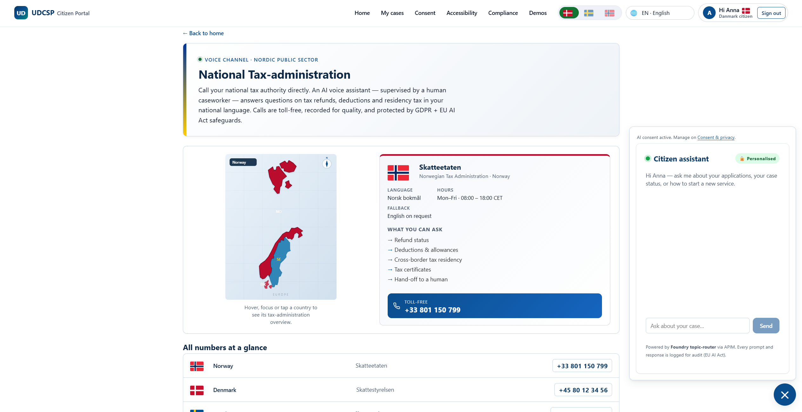

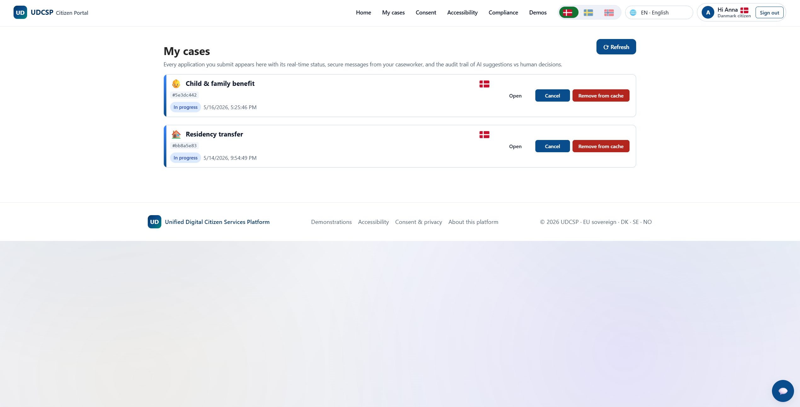


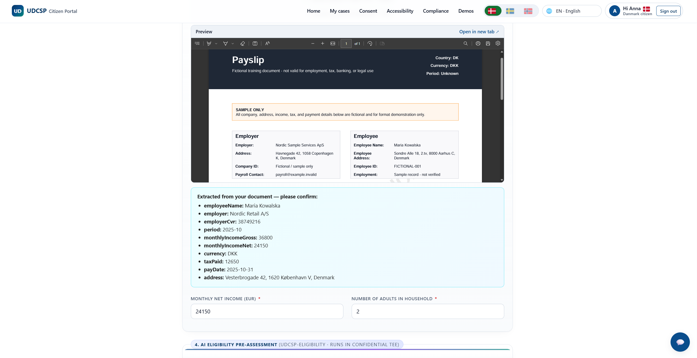


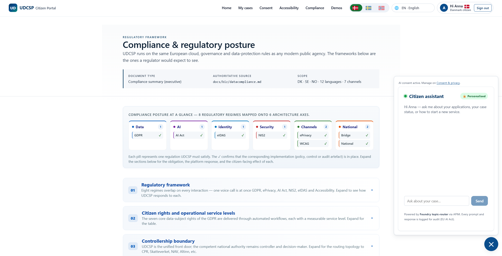

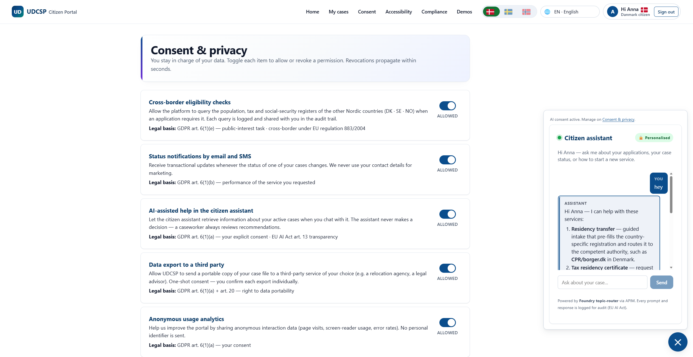

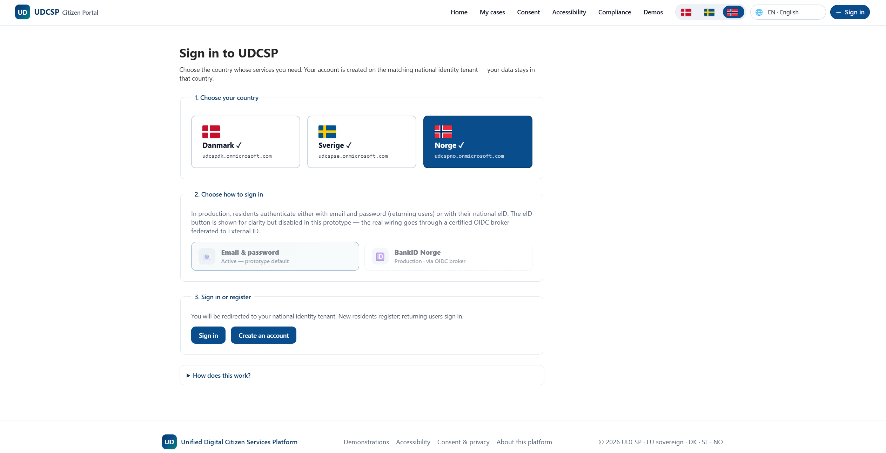

</div>

> **1** Home · **2** Contact / voice · **3** My cases · **4** Assistant · **5** Residency intake · **6–7** Document reading · **8** Cross-border result · **9** Compliance · **10** Consent · **11** Sign-in. One web app, twelve languages, three channels — the same React and TypeScript code on desktop, tablet and phone.

---

<!-- _header: 'UDCSP — Annex' -->

# Annex — network topology in full.

<!-- ⏱ 0:10 — Reference: the full private network behind the simplified slide. -->


> A private network per country, joined to one shared hub. The hub holds the firewall, the DNS zones, the partner gateway and a security workspace. The only public address per country is the admin host. No country talks directly to another.

---

<!-- _header: 'UDCSP — Annex' -->
<!-- _class: tight -->

# Annex — telemetry pillars in full.

<!-- ⏱ 0:10 — Reference: the six monitoring pillars behind the central view. -->

<div class="cards">
<div class="card">
<div class="card-num">METRICS / LOGS</div>
<h3>Azure Monitor</h3>
<p>3 workspaces, one per country · 180 days hot · 7 years cold · never joined</p>
</div>
<div class="card teal">
<div class="card-num">DISTRIBUTED TRACE</div>
<h3>Application Insights</h3>
<p>One trace number end-to-end · front door → gateway → workflow → Dynamics → agent → model</p>
</div>
<div class="card purple">
<div class="card-num">AI QUALITY</div>
<h3>Foundry Evaluations</h3>
<p>Continuous · drift monitors · language parity · bias monitoring</p>
</div>
<div class="card red">
<div class="card-num">AI ACT EVIDENCE</div>
<h3>Confidential Ledger</h3>
<p>Records that cannot be changed · joins logs, AI and Dynamics in one query</p>
</div>
<div class="card orange">
<div class="card-num">ACTIVE</div>
<h3>Synthetic + real-user</h3>
<p>5 external regions · 60-second probes · load times per language</p>
</div>
<div class="card green">
<div class="card-num">DASHBOARDS</div>
<h3>9 workbooks</h3>
<p>platform health · citizen-journey funnel · AI-decision traces · per country</p>
</div>
</div>
